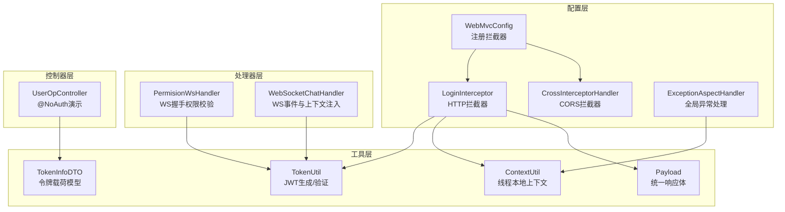
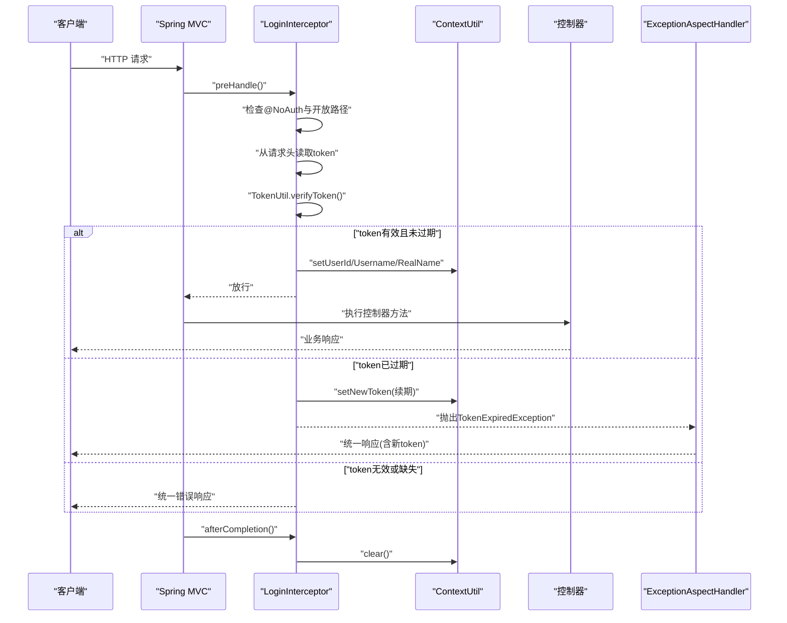
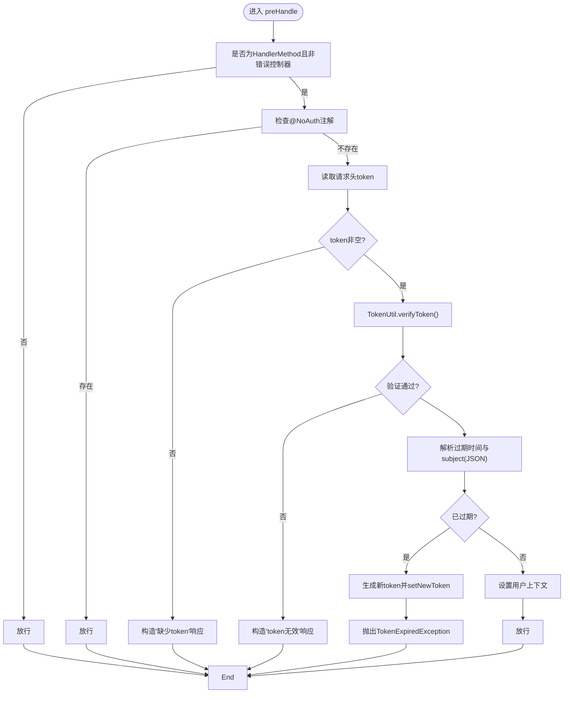
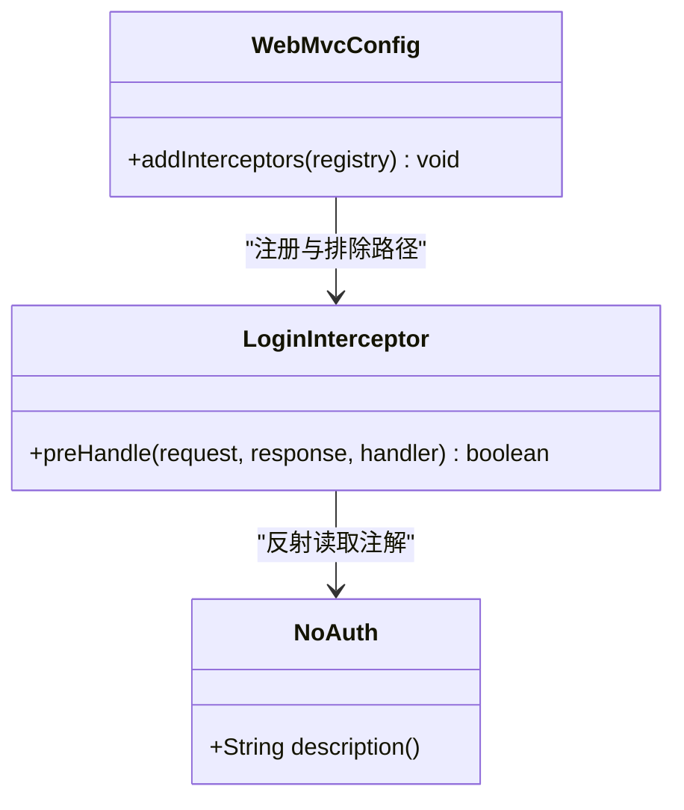
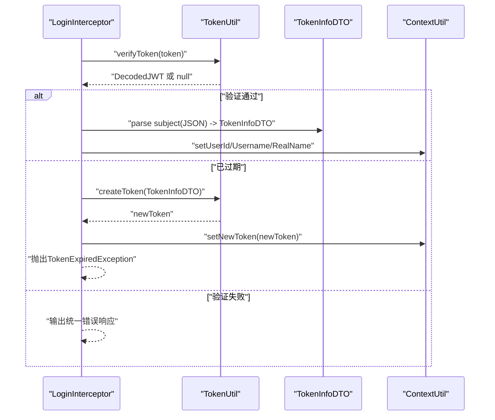
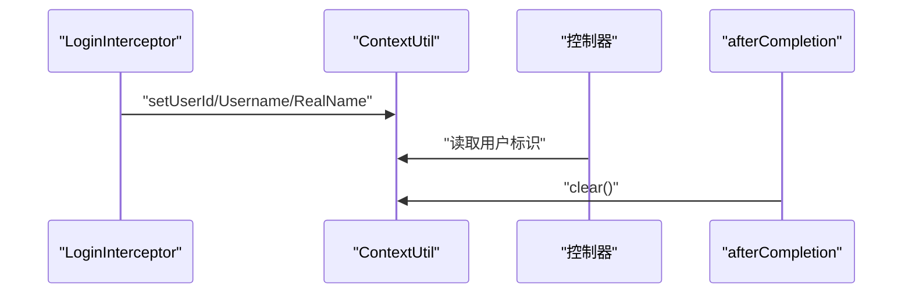
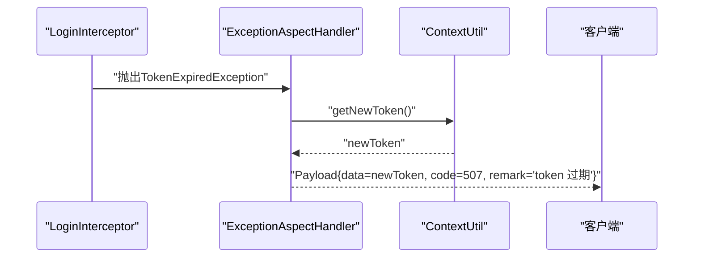
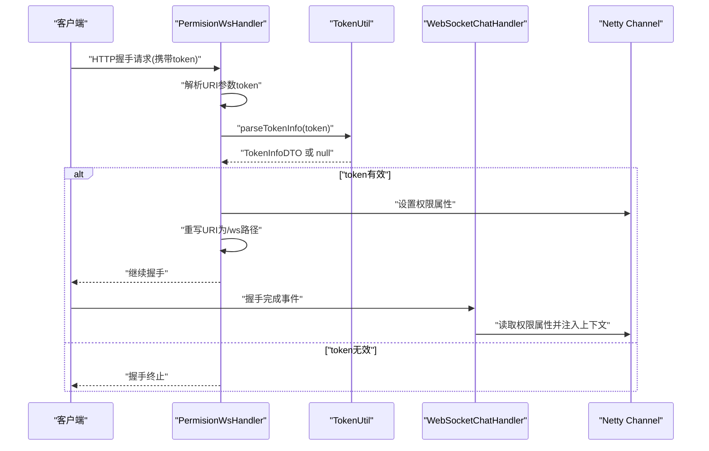
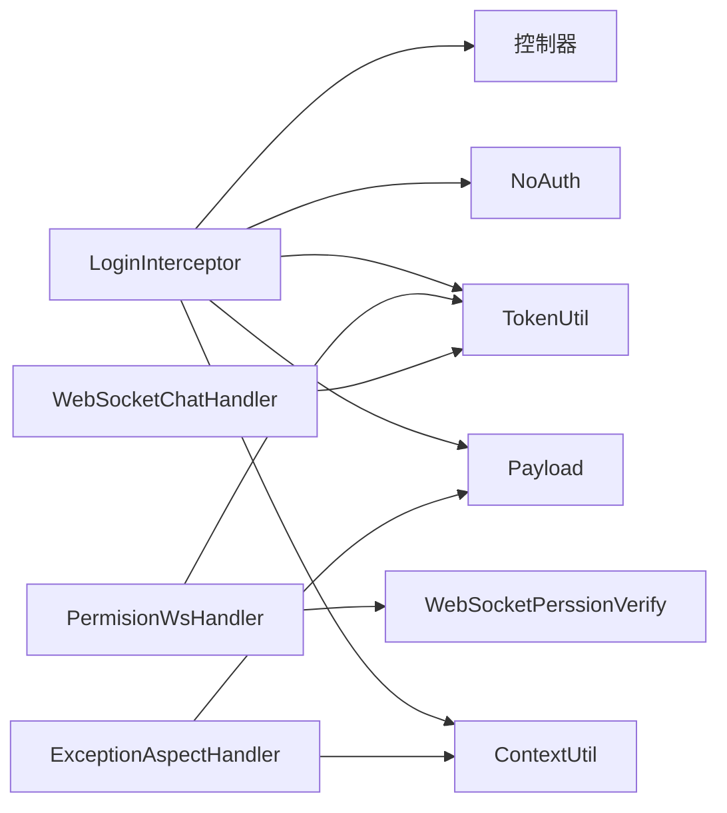

# 权限拦截器

<cite>
**本文引用的文件**
- [LoginInterceptor.java](file://src/main/java/com/hch/chat_simple/config/LoginInterceptor.java)
- [NoAuth.java](file://src/main/java/com/hch/chat_simple/auth/NoAuth.java)
- [WebMvcConfig.java](file://src/main/java/com/hch/chat_simple/config/WebMvcConfig.java)
- [ContextUtil.java](file://src/main/java/com/hch/chat_simple/util/ContextUtil.java)
- [TokenUtil.java](file://src/main/java/com/hch/chat_simple/util/TokenUtil.java)
- [TokenInfoDTO.java](file://src/main/java/com/hch/chat_simple/pojo/dto/TokenInfoDTO.java)
- [Payload.java](file://src/main/java/com/hch/chat_simple/util/Payload.java)
- [ExceptionAspectHandler.java](file://src/main/java/com/hch/chat_simple/config/ExceptionAspectHandler.java)
- [CrossInterceptorHandler.java](file://src/main/java/com/hch/chat_simple/config/CrossInterceptorHandler.java)
- [UserOpController.java](file://src/main/java/com/hch/chat_simple/controller/UserOpController.java)
- [WebSocketChatHandler.java](file://src/main/java/com/hch/chat_simple/handler/WebSocketChatHandler.java)
- [PermisionWsHandler.java](file://src/main/java/com/hch/chat_simple/handler/PermisionWsHandler.java)
- [WebSocketPerssionVerify.java](file://src/main/java/com/hch/chat_simple/pojo/dto/WebSocketPerssionVerify.java)
- [Constant.java](file://src/main/java/com/hch/chat_simple/util/Constant.java)
</cite>

## 目录
1. [简介](#简介)
2. [项目结构](#项目结构)
3. [核心组件](#核心组件)
4. [架构总览](#架构总览)
5. [详细组件分析](#详细组件分析)
6. [依赖分析](#依赖分析)
7. [性能考虑](#性能考虑)
8. [故障排查指南](#故障排查指南)
9. [结论](#结论)
10. [附录](#附录)

## 简介
本文件系统性阐述 Spring MVC 权限拦截器在聊天应用中的实现与最佳实践，重点围绕 LoginInterceptor 的工作原理展开，包括：
- 请求拦截与放行判定（含注解识别与开放接口处理）
- 令牌提取与验证（请求头解析、JWT 验证、过期处理）
- 上下文用户信息的设置与清理（ContextUtil 的线程安全保障）
- 异常处理（TokenExpiredException 的捕获与统一响应）
- WebSocket 连接中的权限校验与特殊处理
- 拦截器配置与扩展建议

## 项目结构
权限相关代码主要分布在以下包与类中：
- config：拦截器与全局异常处理
- util：工具类（上下文、令牌、统一响应体）
- pojo/dto：数据传输对象（TokenInfoDTO、WebSocketPerssionVerify）
- handler：WebSocket 权限与业务处理器
- controller：演示注解使用与受控接口

图示来源
- [WebMvcConfig.java:12-16](file://src/main/java/com/hch/chat_simple/config/WebMvcConfig.java#L12-L16)
- [LoginInterceptor.java:30-97](file://src/main/java/com/hch/chat_simple/config/LoginInterceptor.java#L30-L97)
- [CrossInterceptorHandler.java:10-25](file://src/main/java/com/hch/chat_simple/config/CrossInterceptorHandler.java#L10-L25)
- [ExceptionAspectHandler.java:16-20](file://src/main/java/com/hch/chat_simple/config/ExceptionAspectHandler.java#L16-L20)
- [ContextUtil.java:5-52](file://src/main/java/com/hch/chat_simple/util/ContextUtil.java#L5-L52)
- [TokenUtil.java:18-71](file://src/main/java/com/hch/chat_simple/util/TokenUtil.java#L18-L71)
- [Payload.java:5-30](file://src/main/java/com/hch/chat_simple/util/Payload.java#L5-L30)
- [TokenInfoDTO.java:9-20](file://src/main/java/com/hch/chat_simple/pojo/dto/TokenInfoDTO.java#L9-L20)
- [PermisionWsHandler.java:32-66](file://src/main/java/com/hch/chat_simple/handler/PermisionWsHandler.java#L32-L66)
- [WebSocketChatHandler.java:118-163](file://src/main/java/com/hch/chat_simple/handler/WebSocketChatHandler.java#L118-L163)
- [UserOpController.java:44-112](file://src/main/java/com/hch/chat_simple/controller/UserOpController.java#L44-L112)

章节来源
- [WebMvcConfig.java:12-16](file://src/main/java/com/hch/chat_simple/config/WebMvcConfig.java#L12-L16)

## 核心组件
- LoginInterceptor：基于 HandlerInterceptor 的 HTTP 层权限拦截器，负责识别开放接口、提取与验证令牌、设置上下文用户信息、异常处理与清理。
- NoAuth 注解：用于标注无需认证的接口或类，拦截器在 preHandle 中优先放行。
- WebMvcConfig：注册拦截器与排除路径，定义拦截范围与开放端点。
- ContextUtil：基于 TransmittableThreadLocal 的线程安全上下文容器，保存用户标识与新令牌。
- TokenUtil：JWT 生成与验证工具，包含密钥、签发者、过期时间与解析逻辑。
- Payload：统一响应体封装，用于标准化错误与成功返回。
- ExceptionAspectHandler：全局异常处理，专门捕获 TokenExpiredException 并返回带新令牌的响应。
- WebSocket 相关处理器：PermisionWsHandler 在握手阶段校验 WS 令牌；WebSocketChatHandler 在握手完成后注入用户上下文。

章节来源
- [LoginInterceptor.java:28-97](file://src/main/java/com/hch/chat_simple/config/LoginInterceptor.java#L28-L97)
- [NoAuth.java:8-13](file://src/main/java/com/hch/chat_simple/auth/NoAuth.java#L8-L13)
- [WebMvcConfig.java:12-16](file://src/main/java/com/hch/chat_simple/config/WebMvcConfig.java#L12-L16)
- [ContextUtil.java:5-52](file://src/main/java/com/hch/chat_simple/util/ContextUtil.java#L5-L52)
- [TokenUtil.java:18-71](file://src/main/java/com/hch/chat_simple/util/TokenUtil.java#L18-L71)
- [Payload.java:5-30](file://src/main/java/com/hch/chat_simple/util/Payload.java#L5-L30)
- [ExceptionAspectHandler.java:16-20](file://src/main/java/com/hch/chat_simple/config/ExceptionAspectHandler.java#L16-L20)
- [PermisionWsHandler.java:32-66](file://src/main/java/com/hch/chat_simple/handler/PermisionWsHandler.java#L32-L66)
- [WebSocketChatHandler.java:118-163](file://src/main/java/com/hch/chat_simple/handler/WebSocketChatHandler.java#L118-L163)

## 架构总览
下图展示从客户端到服务端的关键交互链路，包括 HTTP 拦截、WS 握手与上下文注入：

图示来源
- [LoginInterceptor.java:30-97](file://src/main/java/com/hch/chat_simple/config/LoginInterceptor.java#L30-L97)
- [ExceptionAspectHandler.java:16-20](file://src/main/java/com/hch/chat_simple/config/ExceptionAspectHandler.java#L16-L20)
- [ContextUtil.java:44-49](file://src/main/java/com/hch/chat_simple/util/ContextUtil.java#L44-L49)

## 详细组件分析

### LoginInterceptor 工作原理
- 请求拦截逻辑
  - 忽略错误控制器与非 HandlerMethod 类型的处理器。
  - 若目标方法或类声明了 @NoAuth，则直接放行。
  - 否则从请求头提取 token 并调用 TokenUtil.verifyToken() 进行验证。
- 权限验证流程
  - 解析 JWT 的过期时间与主体（JSON 字符串），反序列化为 TokenInfoDTO。
  - 若已过期：生成新 token 并通过 ContextUtil.setNewToken() 写入上下文，随后抛出 TokenExpiredException，交由全局异常处理器统一响应。
  - 若未过期：将用户标识写入 ContextUtil，放行请求。
- 响应与清理
  - 验证失败或缺失 token 时，构造 Payload 统一响应并输出 JSON。
  - afterCompletion 中调用 ContextUtil.clear() 清理线程上下文，避免内存泄漏。

图示来源
- [LoginInterceptor.java:30-97](file://src/main/java/com/hch/chat_simple/config/LoginInterceptor.java#L30-L97)
- [TokenUtil.java:48-59](file://src/main/java/com/hch/chat_simple/util/TokenUtil.java#L48-L59)
- [ContextUtil.java:44-49](file://src/main/java/com/hch/chat_simple/util/ContextUtil.java#L44-L49)

章节来源
- [LoginInterceptor.java:30-97](file://src/main/java/com/hch/chat_simple/config/LoginInterceptor.java#L30-L97)
- [TokenUtil.java:48-59](file://src/main/java/com/hch/chat_simple/util/TokenUtil.java#L48-L59)
- [ContextUtil.java:44-49](file://src/main/java/com/hch/chat_simple/util/ContextUtil.java#L44-L49)

### 注解扫描与开放接口处理
- @NoAuth 注解
  - 作用于方法与类，标记为无需认证的接口。
  - 拦截器在 preHandle 中通过反射读取方法注解，命中即放行。
- 开放接口配置
  - WebMvcConfig 中通过 excludePathPatterns 排除登录、错误、Swagger 等路径，避免拦截器误伤。

图示来源
- [NoAuth.java:8-13](file://src/main/java/com/hch/chat_simple/auth/NoAuth.java#L8-L13)
- [LoginInterceptor.java:39-43](file://src/main/java/com/hch/chat_simple/config/LoginInterceptor.java#L39-L43)
- [WebMvcConfig.java:12-16](file://src/main/java/com/hch/chat_simple/config/WebMvcConfig.java#L12-L16)

章节来源
- [NoAuth.java:8-13](file://src/main/java/com/hch/chat_simple/auth/NoAuth.java#L8-L13)
- [LoginInterceptor.java:39-43](file://src/main/java/com/hch/chat_simple/config/LoginInterceptor.java#L39-L43)
- [WebMvcConfig.java:12-16](file://src/main/java/com/hch/chat_simple/config/WebMvcConfig.java#L12-L16)

### 令牌提取与验证
- 请求头解析
  - 从 HTTP 请求头读取名为 token 的字段作为 JWT。
- JWT 验证
  - 使用 TokenUtil.verifyToken() 完成签名校验、签发者匹配与过期容忍窗口。
  - 主体（subject）为 JSON 字符串，反序列化为 TokenInfoDTO。
- 过期处理
  - 当 JWT 已过期但仍在容忍窗口内，拦截器生成新 token 并写入上下文，抛出 TokenExpiredException，由全局异常处理器统一返回。

图示来源
- [LoginInterceptor.java:44-82](file://src/main/java/com/hch/chat_simple/config/LoginInterceptor.java#L44-L82)
- [TokenUtil.java:48-69](file://src/main/java/com/hch/chat_simple/util/TokenUtil.java#L48-L69)
- [TokenInfoDTO.java:9-20](file://src/main/java/com/hch/chat_simple/pojo/dto/TokenInfoDTO.java#L9-L20)
- [ContextUtil.java:40-42](file://src/main/java/com/hch/chat_simple/util/ContextUtil.java#L40-L42)

章节来源
- [LoginInterceptor.java:44-82](file://src/main/java/com/hch/chat_simple/config/LoginInterceptor.java#L44-L82)
- [TokenUtil.java:48-69](file://src/main/java/com/hch/chat_simple/util/TokenUtil.java#L48-L69)
- [TokenInfoDTO.java:9-20](file://src/main/java/com/hch/chat_simple/pojo/dto/TokenInfoDTO.java#L9-L20)
- [ContextUtil.java:40-42](file://src/main/java/com/hch/chat_simple/util/ContextUtil.java#L40-L42)

### 上下文用户信息的设置与清理
- 设置
  - 通过 ContextUtil.setUserId/setUsername/setRealName 将当前用户的标识写入线程本地存储。
  - 新 token 通过 ContextUtil.setNewToken 写入，供全局异常处理器使用。
- 清理
  - afterCompletion 中调用 ContextUtil.clear() 清空所有线程变量，防止线程复用导致的数据串扰。
- 线程安全
  - 使用 TransmittableThreadLocal，确保在异步场景（如线程池）中上下文可正确传递与回收。

图示来源
- [ContextUtil.java:12-49](file://src/main/java/com/hch/chat_simple/util/ContextUtil.java#L12-L49)
- [LoginInterceptor.java:67-97](file://src/main/java/com/hch/chat_simple/config/LoginInterceptor.java#L67-L97)

章节来源
- [ContextUtil.java:12-49](file://src/main/java/com/hch/chat_simple/util/ContextUtil.java#L12-L49)
- [LoginInterceptor.java:67-97](file://src/main/java/com/hch/chat_simple/config/LoginInterceptor.java#L67-L97)

### 异常处理与统一响应
- TokenExpiredException 捕获
  - 全局异常处理器 ExceptionAspectHandler 捕获该异常，读取 ContextUtil.getNewToken() 返回给客户端。
- 统一响应格式
  - 使用 Payload 封装 data/code/remark，确保前后端一致的响应契约。
- 其他错误
  - 拦截器在 token 缺失或无效时也返回 Payload 统一错误响应。

图示来源
- [ExceptionAspectHandler.java:16-20](file://src/main/java/com/hch/chat_simple/config/ExceptionAspectHandler.java#L16-L20)
- [ContextUtil.java:36-41](file://src/main/java/com/hch/chat_simple/util/ContextUtil.java#L36-L41)
- [Payload.java:18-28](file://src/main/java/com/hch/chat_simple/util/Payload.java#L18-L28)

章节来源
- [ExceptionAspectHandler.java:16-20](file://src/main/java/com/hch/chat_simple/config/ExceptionAspectHandler.java#L16-L20)
- [ContextUtil.java:36-41](file://src/main/java/com/hch/chat_simple/util/ContextUtil.java#L36-L41)
- [Payload.java:18-28](file://src/main/java/com/hch/chat_simple/util/Payload.java#L18-L28)

### WebSocket 连接中的特殊处理
- 握手阶段权限校验
  - PermisionWsHandler 在收到 FullHttpRequest 时，从 URI 参数提取 token，调用 TokenUtil.parseTokenInfo() 校验并填充 WebSocketPerssionVerify。
  - 将权限信息以属性形式绑定到 Channel，随后将请求 URI 重写为目标 WS 路径，继续后续握手流程。
- 握手完成后的上下文注入
  - WebSocketChatHandler 在握手完成事件中读取 Channel 属性中的权限信息，设置用户标识并加入在线通道组。
- 未登录或 token 失效处理
  - 若 token 缺失或解析失败，握手阶段直接返回，不建立 WS 连接。

图示来源
- [PermisionWsHandler.java:32-66](file://src/main/java/com/hch/chat_simple/handler/PermisionWsHandler.java#L32-L66)
- [WebSocketChatHandler.java:118-163](file://src/main/java/com/hch/chat_simple/handler/WebSocketChatHandler.java#L118-L163)
- [TokenUtil.java:61-68](file://src/main/java/com/hch/chat_simple/util/TokenUtil.java#L61-L68)
- [WebSocketPerssionVerify.java:7-21](file://src/main/java/com/hch/chat_simple/pojo/dto/WebSocketPerssionVerify.java#L7-L21)
- [Constant.java:6](file://src/main/java/com/hch/chat_simple/util/Constant.java#L6)

章节来源
- [PermisionWsHandler.java:32-66](file://src/main/java/com/hch/chat_simple/handler/PermisionWsHandler.java#L32-L66)
- [WebSocketChatHandler.java:118-163](file://src/main/java/com/hch/chat_simple/handler/WebSocketChatHandler.java#L118-L163)
- [TokenUtil.java:61-68](file://src/main/java/com/hch/chat_simple/util/TokenUtil.java#L61-L68)
- [WebSocketPerssionVerify.java:7-21](file://src/main/java/com/hch/chat_simple/pojo/dto/WebSocketPerssionVerify.java#L7-L21)
- [Constant.java:6](file://src/main/java/com/hch/chat_simple/util/Constant.java#L6)

### 拦截器配置与扩展最佳实践
- 配置要点
  - 在 WebMvcConfig 中注册 LoginInterceptor 与 CrossInterceptorHandler，并通过 excludePathPatterns 排除登录、错误、Swagger 等路径。
  - 可根据业务需求调整拦截路径与排除规则。
- 扩展建议
  - 自定义注解：可新增更细粒度的权限注解（如 @RequireRole），在拦截器中读取并校验。
  - 多种认证方式：支持同时处理 Bearer Token 与自定义 token 头，增强兼容性。
  - 日志与审计：在拦截器中记录关键操作日志，便于问题追踪与审计。
  - 跨域与安全：结合 CrossInterceptorHandler 与 CORS 配置，确保前端域名与凭证策略正确。

章节来源
- [WebMvcConfig.java:12-16](file://src/main/java/com/hch/chat_simple/config/WebMvcConfig.java#L12-L16)
- [CrossInterceptorHandler.java:10-25](file://src/main/java/com/hch/chat_simple/config/CrossInterceptorHandler.java#L10-L25)

## 依赖分析
- 组件耦合
  - LoginInterceptor 依赖 TokenUtil、ContextUtil、Payload、NoAuth 与 Spring MVC 拦截器机制。
  - ExceptionAspectHandler 依赖 ContextUtil 与 Payload。
  - WebSocket 处理器依赖 TokenUtil 与 WebSocketPerssionVerify。
- 关键依赖链
  - HTTP：LoginInterceptor -> TokenUtil -> ContextUtil -> 控制器
  - WS：PermisionWsHandler -> TokenUtil -> WebSocketChatHandler -> Netty Channel
  - 异常：LoginInterceptor -> ExceptionAspectHandler -> Client

图示来源
- [LoginInterceptor.java:18-20](file://src/main/java/com/hch/chat_simple/config/LoginInterceptor.java#L18-L20)
- [TokenUtil.java:18-71](file://src/main/java/com/hch/chat_simple/util/TokenUtil.java#L18-L71)
- [ContextUtil.java:5-52](file://src/main/java/com/hch/chat_simple/util/ContextUtil.java#L5-L52)
- [Payload.java:5-30](file://src/main/java/com/hch/chat_simple/util/Payload.java#L5-L30)
- [NoAuth.java:8-13](file://src/main/java/com/hch/chat_simple/auth/NoAuth.java#L8-L13)
- [PermisionWsHandler.java:32-66](file://src/main/java/com/hch/chat_simple/handler/PermisionWsHandler.java#L32-L66)
- [WebSocketChatHandler.java:118-163](file://src/main/java/com/hch/chat_simple/handler/WebSocketChatHandler.java#L118-L163)
- [ExceptionAspectHandler.java:16-20](file://src/main/java/com/hch/chat_simple/config/ExceptionAspectHandler.java#L16-L20)

## 性能考虑
- JWT 验证成本低：基于内存计算，单次验证开销较小。
- 线程安全上下文：TransmittableThreadLocal 在多线程场景下减少锁竞争，提升吞吐。
- 缓存与降级：可在 TokenUtil 中引入短期缓存（如基于 userId 的轻量缓存）以降低重复解析成本（需评估一致性风险）。
- 路径匹配优化：合理设置拦截路径与排除规则，避免对静态资源与公开接口产生不必要的开销。

## 故障排查指南
- token 缺失
  - 现象：统一错误响应“缺少 token”。
  - 排查：确认客户端是否正确设置请求头 token；检查拦截器排除路径是否误删登录接口。
- token 无效
  - 现象：统一错误响应“token无效”。
  - 排查：核对签名密钥、签发者、过期时间；确认客户端未篡改 token。
- token 过期
  - 现象：触发 TokenExpiredException，全局异常返回 code=507 与新 token。
  - 排查：客户端收到新 token 后应替换旧 token；检查服务端过期容忍窗口与新 token 生成逻辑。
- 上下文未清理
  - 现象：线程复用导致用户信息串扰。
  - 排查：确认 afterCompletion 是否被调用；检查线程池或异步任务是否手动清理上下文。
- WS 握手失败
  - 现象：连接被拒绝或未建立。
  - 排查：确认 URI 参数 token 是否随握手请求传递；检查 PermisionWsHandler 的 URI 重写逻辑。

章节来源
- [LoginInterceptor.java:74-82](file://src/main/java/com/hch/chat_simple/config/LoginInterceptor.java#L74-L82)
- [ExceptionAspectHandler.java:16-20](file://src/main/java/com/hch/chat_simple/config/ExceptionAspectHandler.java#L16-L20)
- [ContextUtil.java:44-49](file://src/main/java/com/hch/chat_simple/util/ContextUtil.java#L44-L49)
- [PermisionWsHandler.java:32-66](file://src/main/java/com/hch/chat_simple/handler/PermisionWsHandler.java#L32-L66)

## 结论
本权限拦截器通过注解驱动与拦截器机制实现了对 HTTP 与 WebSocket 的统一认证控制，结合线程安全上下文与全局异常处理，提供了清晰、可扩展的权限保障方案。建议在生产环境中进一步完善多认证方式、审计日志与缓存策略，以满足更高的安全性与性能要求。

## 附录
- 示例控制器使用 @NoAuth 标注开放接口，演示拦截器的放行逻辑。
- 统一响应体 Payload 提供标准字段，便于前端统一处理。

章节来源
- [UserOpController.java:44-112](file://src/main/java/com/hch/chat_simple/controller/UserOpController.java#L44-L112)
- [Payload.java:18-28](file://src/main/java/com/hch/chat_simple/util/Payload.java#L18-L28)