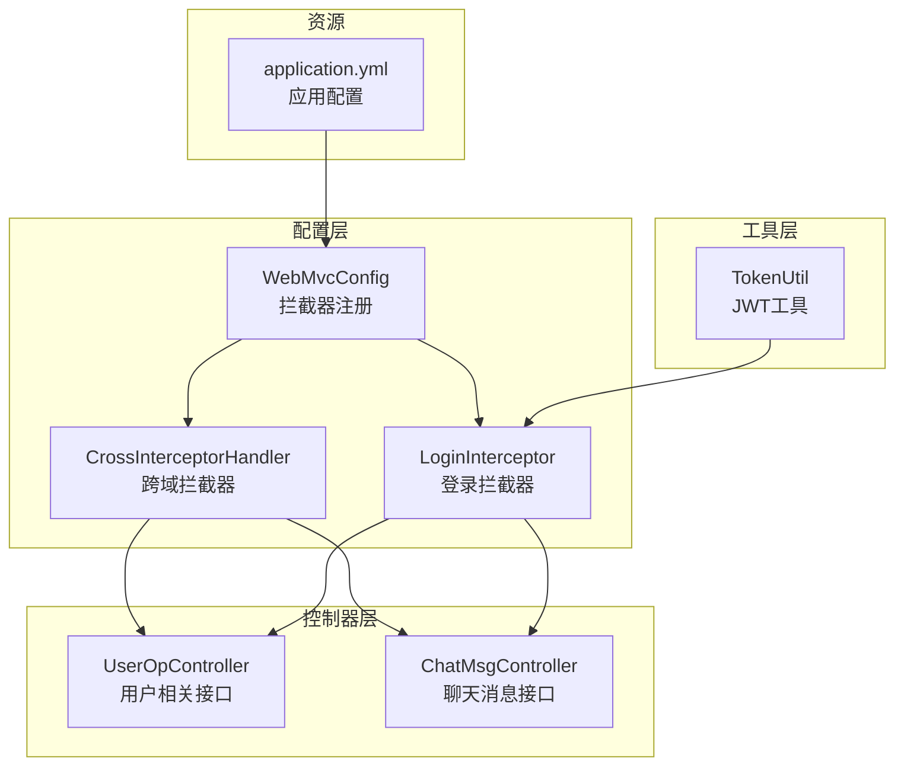
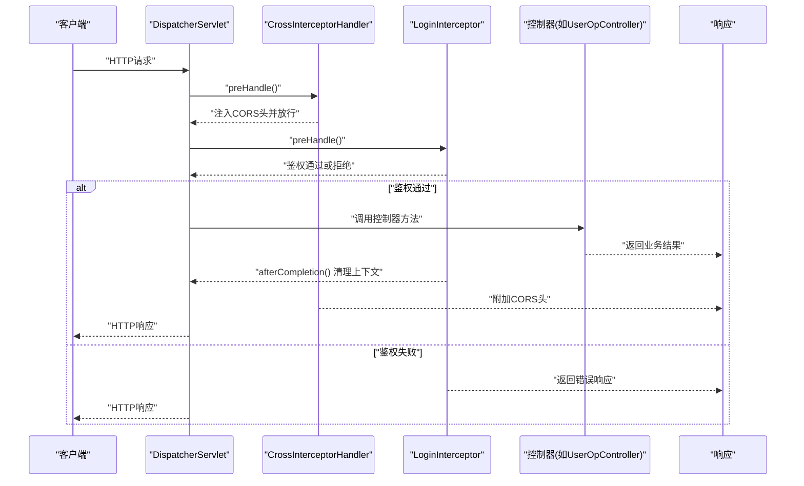
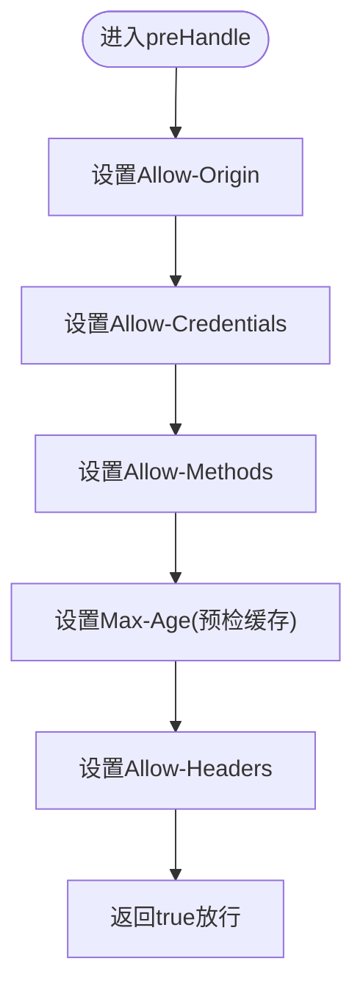
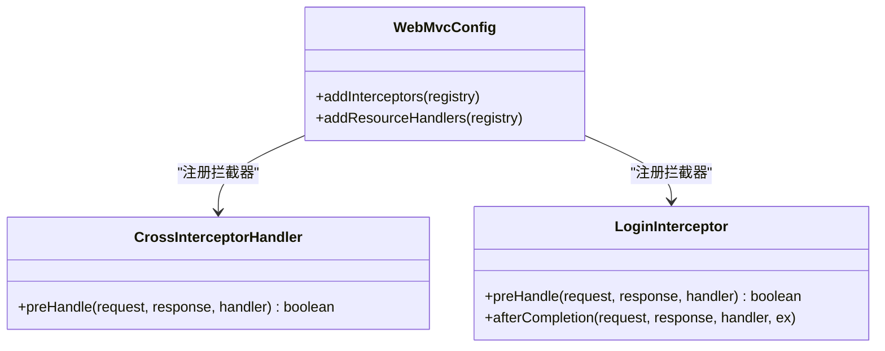
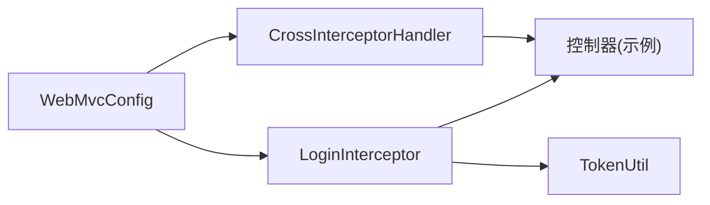

# 跨域安全配置

<cite>
**本文引用的文件**
- [CrossInterceptorHandler.java](file://src/main/java/com/hch/chat_simple/config/CrossInterceptorHandler.java)
- [WebMvcConfig.java](file://src/main/java/com/hch/chat_simple/config/WebMvcConfig.java)
- [LoginInterceptor.java](file://src/main/java/com/hch/chat_simple/config/LoginInterceptor.java)
- [UserOpController.java](file://src/main/java/com/hch/chat_simple/controller/UserOpController.java)
- [ChatMsgController.java](file://src/main/java/com/hch/chat_simple/controller/ChatMsgController.java)
- [application.yml](file://src/main/resources/application.yml)
- [TokenUtil.java](file://src/main/java/com/hch/chat_simple/util/TokenUtil.java)
</cite>

## 目录
1. [简介](#简介)
2. [项目结构](#项目结构)
3. [核心组件](#核心组件)
4. [架构总览](#架构总览)
5. [详细组件分析](#详细组件分析)
6. [依赖分析](#依赖分析)
7. [性能考虑](#性能考虑)
8. [故障排查指南](#故障排查指南)
9. [结论](#结论)
10. [附录](#附录)

## 简介
本文件聚焦于本项目的跨域安全配置，系统性梳理了基于Spring MVC拦截器的CORS处理机制，覆盖以下主题：
- CrossInterceptorHandler拦截器的跨域处理逻辑与安全头设置
- 预检请求处理、允许的源域名配置、HTTP方法白名单、预检缓存等
- WebMvcConfig中的全局跨域配置与拦截器优先级
- 不同环境下的跨域配置策略与最佳实践
- 常见跨域问题的排查与解决方案

## 项目结构
本项目采用标准Spring Boot目录结构，跨域相关的核心代码位于config包中，分别通过拦截器实现跨域头注入与全局拦截器注册；控制器层用于演示跨域请求的实际处理流程。

图表来源
- [WebMvcConfig.java:12-16](file://src/main/java/com/hch/chat_simple/config/WebMvcConfig.java#L12-L16)
- [CrossInterceptorHandler.java:14-24](file://src/main/java/com/hch/chat_simple/config/CrossInterceptorHandler.java#L14-L24)
- [LoginInterceptor.java:30-90](file://src/main/java/com/hch/chat_simple/config/LoginInterceptor.java#L30-L90)
- [UserOpController.java:35-114](file://src/main/java/com/hch/chat_simple/controller/UserOpController.java#L35-L114)
- [ChatMsgController.java:31-58](file://src/main/java/com/hch/chat_simple/controller/ChatMsgController.java#L31-L58)
- [application.yml:1-89](file://src/main/resources/application.yml#L1-L89)

章节来源
- [WebMvcConfig.java:1-28](file://src/main/java/com/hch/chat_simple/config/WebMvcConfig.java#L1-L28)
- [CrossInterceptorHandler.java:1-28](file://src/main/java/com/hch/chat_simple/config/CrossInterceptorHandler.java#L1-L28)
- [application.yml:1-89](file://src/main/resources/application.yml#L1-L89)

## 核心组件
- CrossInterceptorHandler：实现HandlerInterceptor接口，在preHandle阶段向响应写入CORS相关安全头，统一处理跨域请求。
- WebMvcConfig：实现WebMvcConfigurer，注册CrossInterceptorHandler与LoginInterceptor，定义拦截路径与排除规则。
- LoginInterceptor：实现HandlerInterceptor接口，负责登录态校验与上下文清理，与跨域拦截器共同构成请求处理链。
- 控制器层：UserOpController与ChatMsgController作为业务入口，展示跨域请求到达后如何被拦截器链处理。

章节来源
- [CrossInterceptorHandler.java:8-27](file://src/main/java/com/hch/chat_simple/config/CrossInterceptorHandler.java#L8-L27)
- [WebMvcConfig.java:9-27](file://src/main/java/com/hch/chat_simple/config/WebMvcConfig.java#L9-L27)
- [LoginInterceptor.java:28-109](file://src/main/java/com/hch/chat_simple/config/LoginInterceptor.java#L28-L109)

## 架构总览
跨域处理在请求进入控制器之前由拦截器链完成。CrossInterceptorHandler负责注入CORS安全头，LoginInterceptor负责鉴权与上下文管理。WebMvcConfig统一注册拦截器并定义路径匹配规则。

图表来源
- [WebMvcConfig.java:12-16](file://src/main/java/com/hch/chat_simple/config/WebMvcConfig.java#L12-L16)
- [CrossInterceptorHandler.java:10-25](file://src/main/java/com/hch/chat_simple/config/CrossInterceptorHandler.java#L10-L25)
- [LoginInterceptor.java:30-90](file://src/main/java/com/hch/chat_simple/config/LoginInterceptor.java#L30-L90)
- [UserOpController.java:44-66](file://src/main/java/com/hch/chat_simple/controller/UserOpController.java#L44-L66)

## 详细组件分析

### CrossInterceptorHandler：跨域拦截器
- 功能定位：在preHandle阶段为所有匹配路径的请求注入CORS安全头，确保跨域请求能够正确携带凭据并支持预检缓存。
- 安全头说明：
  - Access-Control-Allow-Origin：限定允许的源域名，当前配置为固定值，建议按环境动态化。
  - Access-Control-Allow-Credentials：允许携带Cookie或自定义认证头。
  - Access-Control-Allow-Methods：允许的HTTP方法集合，包含OPTIONS以支持预检。
  - Access-Control-Max-Age：预检请求缓存时长，减少重复预检次数。
  - Access-Control-Allow-Headers：允许的请求头白名单，包含常见认证与内容类型头。
- 预检请求处理：由于显式声明了OPTIONS方法，浏览器在复杂请求前会先发送OPTIONS预检，该拦截器直接放行并注入CORS头，避免控制器层面重复处理。

图表来源
- [CrossInterceptorHandler.java:14-24](file://src/main/java/com/hch/chat_simple/config/CrossInterceptorHandler.java#L14-L24)

章节来源
- [CrossInterceptorHandler.java:8-27](file://src/main/java/com/hch/chat_simple/config/CrossInterceptorHandler.java#L8-L27)

### WebMvcConfig：全局拦截器配置
- 拦截器注册：
  - CrossInterceptorHandler：对所有路径/**生效，确保跨域头在所有请求上一致注入。
  - LoginInterceptor：对所有路径/**生效，但排除登录、错误页与Swagger相关路径，避免对这些接口产生不必要的鉴权开销。
- 路径匹配与优先级：
  - 拦截器注册顺序即执行顺序，CrossInterceptorHandler先于LoginInterceptor执行，保证跨域头在鉴权逻辑之前可用。
  - 排除路径通过excludePathPatterns指定，确保静态资源与非受控接口不被登录拦截器影响。

图表来源
- [WebMvcConfig.java:12-16](file://src/main/java/com/hch/chat_simple/config/WebMvcConfig.java#L12-L16)
- [CrossInterceptorHandler.java:10-25](file://src/main/java/com/hch/chat_simple/config/CrossInterceptorHandler.java#L10-L25)
- [LoginInterceptor.java:30-97](file://src/main/java/com/hch/chat_simple/config/LoginInterceptor.java#L30-L97)

章节来源
- [WebMvcConfig.java:9-27](file://src/main/java/com/hch/chat_simple/config/WebMvcConfig.java#L9-L27)

### 登录拦截器与跨域协作
- LoginInterceptor负责：
  - 识别无需鉴权的方法（通过注解标记），直接放行。
  - 从请求头提取令牌并进行验证，过期则生成新令牌并通过上下文传递。
  - 在afterCompletion中清理线程上下文，避免内存泄漏。
- 与CrossInterceptorHandler协作：
  - 两者均作用于/**路径，LoginInterceptor在CrossInterceptorHandler之后执行，确保跨域头已注入后再进行鉴权。
  - 对Swagger相关路径进行排除，避免跨域头与鉴权逻辑相互干扰。

章节来源
- [LoginInterceptor.java:28-109](file://src/main/java/com/hch/chat_simple/config/LoginInterceptor.java#L28-L109)

### 控制器层示例
- UserOpController：包含登录、用户信息、权限测试等接口，演示跨域请求到达后如何被拦截器链处理。
- ChatMsgController：包含消息发送、未读消息查询等接口，同样受拦截器链保护。

章节来源
- [UserOpController.java:35-114](file://src/main/java/com/hch/chat_simple/controller/UserOpController.java#L35-L114)
- [ChatMsgController.java:31-58](file://src/main/java/com/hch/chat_simple/controller/ChatMsgController.java#L31-L58)

## 依赖分析
- 组件耦合：
  - WebMvcConfig对CrossInterceptorHandler与LoginInterceptor存在直接依赖，负责生命周期与注册顺序。
  - CrossInterceptorHandler与LoginInterceptor均为独立的拦截器，彼此无直接依赖，便于扩展与替换。
- 外部依赖：
  - 应用配置文件application.yml提供基础运行参数，与跨域配置无直接耦合，但影响服务端口与资源路径。
  - TokenUtil提供JWT生成与校验能力，间接支撑LoginInterceptor的鉴权逻辑。

图表来源
- [WebMvcConfig.java:12-16](file://src/main/java/com/hch/chat_simple/config/WebMvcConfig.java#L12-L16)
- [CrossInterceptorHandler.java:10-25](file://src/main/java/com/hch/chat_simple/config/CrossInterceptorHandler.java#L10-L25)
- [LoginInterceptor.java:30-90](file://src/main/java/com/hch/chat_simple/config/LoginInterceptor.java#L30-L90)
- [TokenUtil.java:18-71](file://src/main/java/com/hch/chat_simple/util/TokenUtil.java#L18-L71)

章节来源
- [application.yml:1-89](file://src/main/resources/application.yml#L1-L89)

## 性能考虑
- 预检缓存：通过Access-Control-Max-Age减少复杂请求的预检频率，提升跨域请求性能。
- 方法白名单：仅暴露必要HTTP方法，降低服务器处理负担。
- 请求头白名单：限制允许的请求头，避免不必要的头部解析与校验。
- 拦截器链短路：LoginInterceptor在鉴权失败时尽早返回，减少后续处理开销。

## 故障排查指南
- 现象：浏览器提示跨域失败或凭据丢失
  - 检查Access-Control-Allow-Origin是否与前端源匹配，当前实现为固定值，需按环境调整。
  - 确认是否设置了Access-Control-Allow-Credentials且前端请求携带凭据。
- 现象：复杂请求频繁触发预检
  - 检查Access-Control-Max-Age是否合理，避免过短导致频繁预检。
  - 确认请求方法与请求头是否在Allow-Methods与Allow-Headers白名单内。
- 现象：登录接口无法正常鉴权
  - 确认请求头中是否包含令牌，且未被LoginInterceptor排除路径误伤。
  - 检查afterCompletion是否成功清理上下文，避免污染后续请求。
- 现象：Swagger接口跨域异常
  - 确认Swagger相关路径是否被LoginInterceptor排除，避免与跨域头冲突。

章节来源
- [CrossInterceptorHandler.java:14-24](file://src/main/java/com/hch/chat_simple/config/CrossInterceptorHandler.java#L14-L24)
- [LoginInterceptor.java:30-90](file://src/main/java/com/hch/chat_simple/config/LoginInterceptor.java#L30-L90)
- [WebMvcConfig.java:12-16](file://src/main/java/com/hch/chat_simple/config/WebMvcConfig.java#L12-L16)

## 结论
本项目通过拦截器实现了集中式的跨域安全处理，CrossInterceptorHandler负责注入CORS安全头，WebMvcConfig统一注册拦截器并定义路径匹配规则，LoginInterceptor负责鉴权与上下文管理。整体设计简洁清晰，具备良好的可维护性与扩展性。建议在生产环境中将Allow-Origin等配置参数化，以适应多环境部署需求。

## 附录

### 不同环境下的跨域配置策略
- 开发环境
  - Allow-Origin：允许本地开发域名与端口，便于前后端联调。
  - Allow-Headers：包含开发常用的调试头，如X-Requested-With等。
  - Max-Age：适当缩短，便于快速迭代。
- 测试环境
  - Allow-Origin：允许测试域名与CI/CD生成的临时域名。
  - Allow-Methods：保留常用方法，避免频繁变更。
  - Max-Age：适中，兼顾性能与稳定性。
- 生产环境
  - Allow-Origin：严格限定为正式域名，避免通配符。
  - Allow-Credentials：谨慎开启，仅在确需携带Cookie时启用。
  - Allow-Headers：最小化，仅保留必需头，减少攻击面。
  - Max-Age：适当延长，减少预检频率。

### 跨域安全最佳实践
- 最小权限原则：仅开放必要的源、方法与请求头。
- 安全头配置：明确Allow-Origin、Allow-Credentials、Allow-Methods、Allow-Headers与Max-Age。
- 预检缓存：合理设置Max-Age，平衡性能与灵活性。
- 日志与监控：记录跨域请求与预检命中情况，及时发现异常。
- 参数化配置：将敏感与易变的CORS配置放入环境变量或配置中心，避免硬编码。