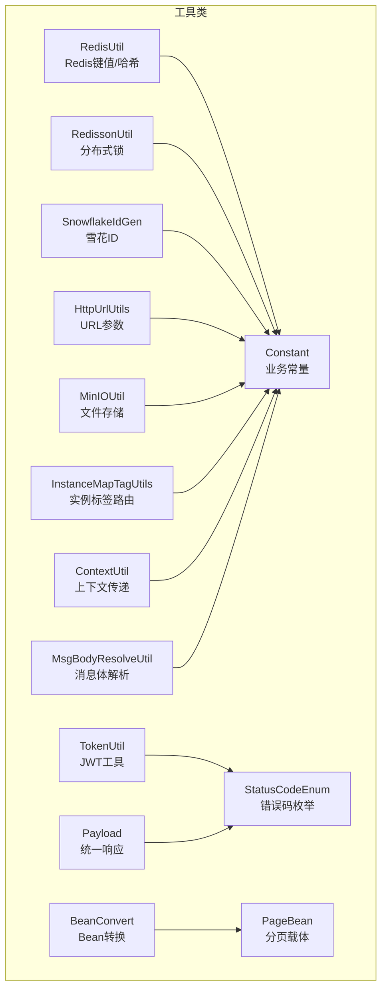
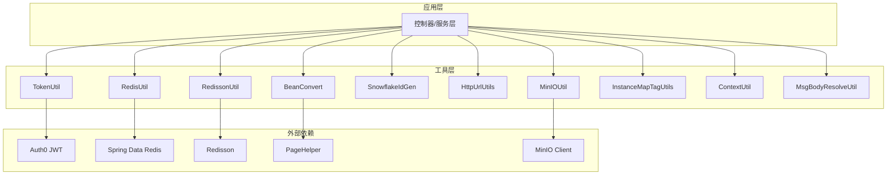
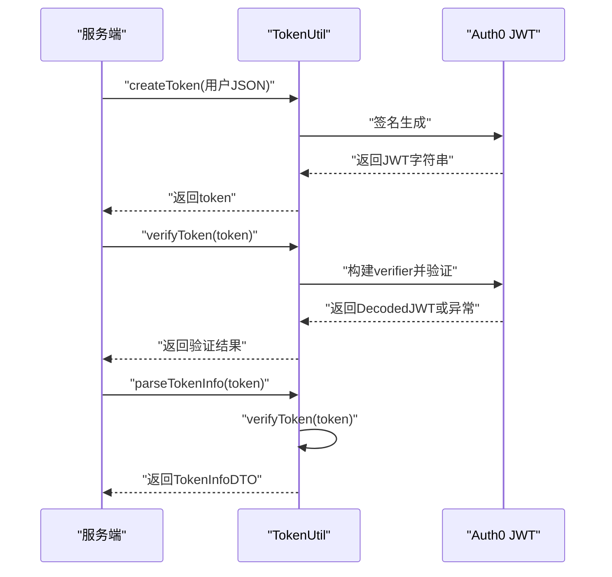
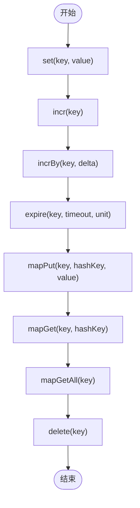
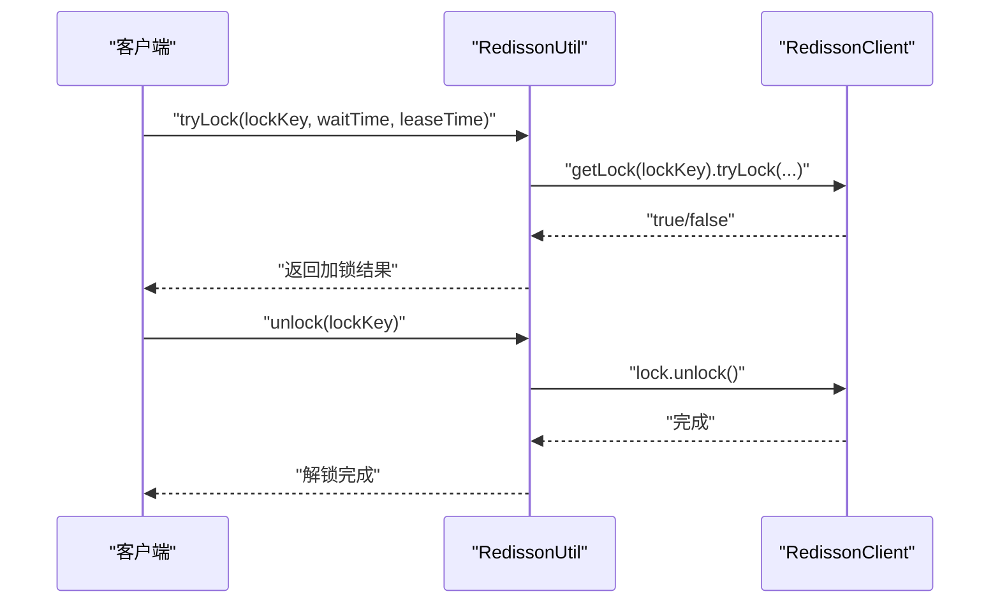
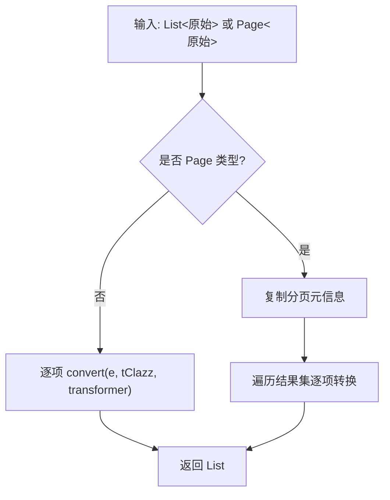
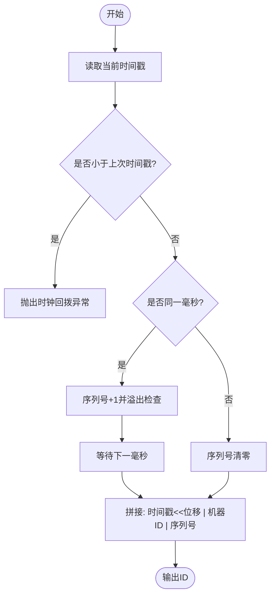
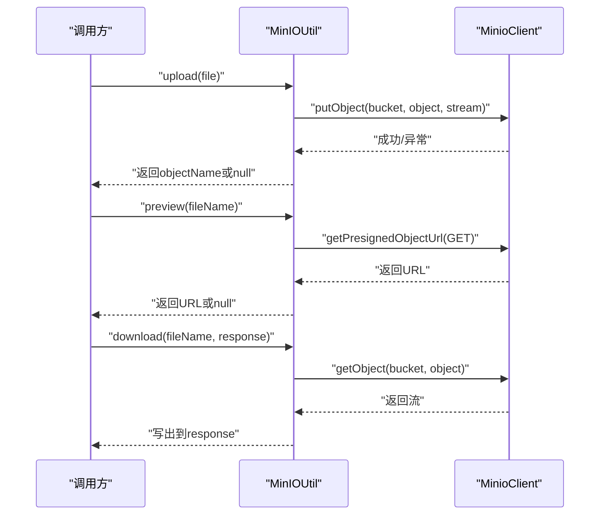
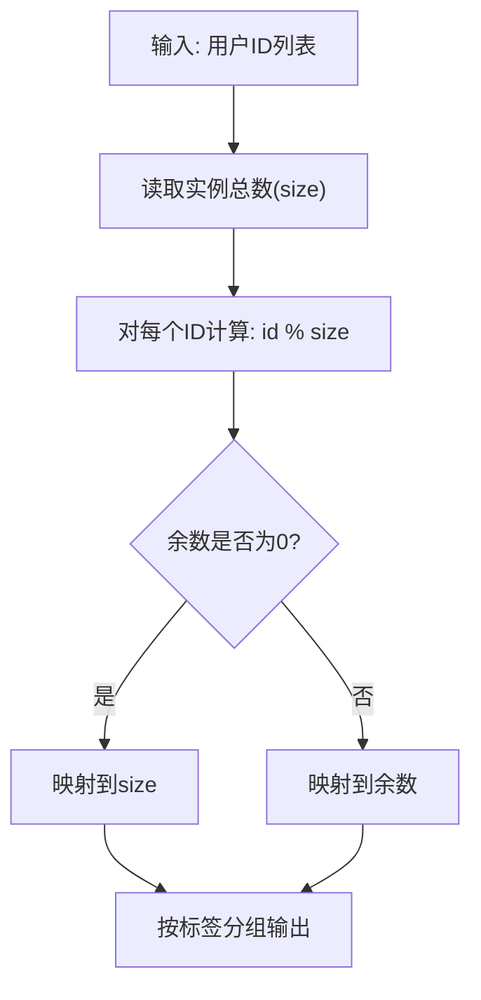
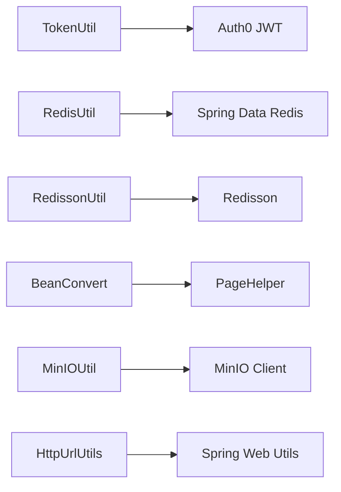

# 工具类和辅助功能

<cite>
**本文引用的文件**
- [Constant.java](file://src/main/java/com/hch/chat_simple/util/Constant.java)
- [StatusCodeEnum.java](file://src/main/java/com/hch/chat_simple/util/StatusCodeEnum.java)
- [TokenUtil.java](file://src/main/java/com/hch/chat_simple/util/TokenUtil.java)
- [RedisUtil.java](file://src/main/java/com/hch/chat_simple/util/RedisUtil.java)
- [RedissonUtil.java](file://src/main/java/com/hch/chat_simple/util/RedissonUtil.java)
- [BeanConvert.java](file://src/main/java/com/hch/chat_simple/util/BeanConvert.java)
- [PageBean.java](file://src/main/java/com/hch/chat_simple/util/PageBean.java)
- [SnowflakeIdGen.java](file://src/main/java/com/hch/chat_simple/util/SnowflakeIdGen.java)
- [HttpUrlUtils.java](file://src/main/java/com/hch/chat_simple/util/HttpUrlUtils.java)
- [Payload.java](file://src/main/java/com/hch/chat_simple/util/Payload.java)
- [MinIOUtil.java](file://src/main/java/com/hch/chat_simple/util/MinIOUtil.java)
- [InstanceMapTagUtils.java](file://src/main/java/com/hch/chat_simple/util/InstanceMapTagUtils.java)
- [ContextUtil.java](file://src/main/java/com/hch/chat_simple/util/ContextUtil.java)
- [MsgBodyResolveUtil.java](file://src/main/java/com/hch/chat_simple/util/MsgBodyResolveUtil.java)
- [application.yml](file://src/main/resources/application.yml)
- [pom.xml](file://pom.xml)
</cite>

## 目录
1. [简介](#简介)
2. [项目结构](#项目结构)
3. [核心组件](#核心组件)
4. [架构总览](#架构总览)
5. [详细组件分析](#详细组件分析)
6. [依赖分析](#依赖分析)
7. [性能考虑](#性能考虑)
8. [故障排查指南](#故障排查指南)
9. [结论](#结论)
10. [附录](#附录)

## 简介
本文件系统性梳理并讲解项目中的通用工具类与辅助功能，覆盖以下主题：
- 常量定义的组织结构（业务常量、系统常量、错误码）
- JWT 令牌工具（生成、解析、验证、续期思路）
- Redis 工具类（键值、哈希、过期、计数等）
- Redisson 分布式锁工具
- Bean 转换工具（对象属性拷贝、分页兼容、类型转换）
- 分页工具（分页参数封装、结果封装）
- 雪花算法 ID 生成器（原理与应用）
- HTTP 工具类（URL 参数解析）
- MinIO 文件存储工具（桶管理、上传、预览、下载、列举、删除）
- 实例标签映射工具（按用户ID取模路由）
- 上下文传递工具（线程本地变量）
- 消息体解析工具（定界符拆分、正则校验）
- 统一响应载体（Payload）

## 项目结构
工具类集中位于 util 包，围绕“常量、枚举、JWT、缓存、Bean转换、分页、ID生成、HTTP、文件存储、标签路由、上下文、消息解析”等维度构建。

图示来源
- [Constant.java:1-33](file://src/main/java/com/hch/chat_simple/util/Constant.java#L1-L33)
- [StatusCodeEnum.java:1-22](file://src/main/java/com/hch/chat_simple/util/StatusCodeEnum.java#L1-L22)
- [TokenUtil.java:1-71](file://src/main/java/com/hch/chat_simple/util/TokenUtil.java#L1-L71)
- [RedisUtil.java:1-123](file://src/main/java/com/hch/chat_simple/util/RedisUtil.java#L1-L123)
- [RedissonUtil.java:1-53](file://src/main/java/com/hch/chat_simple/util/RedissonUtil.java#L1-L53)
- [BeanConvert.java:1-70](file://src/main/java/com/hch/chat_simple/util/BeanConvert.java#L1-L70)
- [PageBean.java:1-21](file://src/main/java/com/hch/chat_simple/util/PageBean.java#L1-L21)
- [SnowflakeIdGen.java:1-118](file://src/main/java/com/hch/chat_simple/util/SnowflakeIdGen.java#L1-L118)
- [HttpUrlUtils.java:1-16](file://src/main/java/com/hch/chat_simple/util/HttpUrlUtils.java#L1-L16)
- [Payload.java:1-30](file://src/main/java/com/hch/chat_simple/util/Payload.java#L1-L30)
- [MinIOUtil.java:1-198](file://src/main/java/com/hch/chat_simple/util/MinIOUtil.java#L1-L198)
- [InstanceMapTagUtils.java:1-55](file://src/main/java/com/hch/chat_simple/util/InstanceMapTagUtils.java#L1-L55)
- [ContextUtil.java:1-52](file://src/main/java/com/hch/chat_simple/util/ContextUtil.java#L1-L52)
- [MsgBodyResolveUtil.java:1-74](file://src/main/java/com/hch/chat_simple/util/MsgBodyResolveUtil.java#L1-L74)

章节来源
- [application.yml:1-89](file://src/main/resources/application.yml#L1-L89)
- [pom.xml:1-346](file://pom.xml#L1-L346)

## 核心组件
- 常量与错误码：集中定义业务常量与统一错误码，便于全局复用与维护。
- JWT 工具：基于 HMAC256 的令牌生成、验证与载荷解析。
- 缓存工具：基于 StringRedisTemplate 的键值与哈希操作。
- 分布式锁：基于 Redisson 的可重入锁与看门狗自动续期。
- Bean 转换：支持普通对象与 PageHelper 分页对象的转换。
- 分页载体：统一分页响应结构。
- 雪花 ID：高并发下稳定递增的全局唯一 ID。
- HTTP 工具：从 URI 字符串提取查询参数。
- MinIO 工具：桶管理、上传、预览、下载、列举、删除。
- 实例标签路由：按用户ID取模路由到不同实例或标签。
- 上下文传递：跨线程传递用户标识与新令牌。
- 消息体解析：按定界符拆分并正则校验。

章节来源
- [Constant.java:1-33](file://src/main/java/com/hch/chat_simple/util/Constant.java#L1-L33)
- [StatusCodeEnum.java:1-22](file://src/main/java/com/hch/chat_simple/util/StatusCodeEnum.java#L1-L22)
- [TokenUtil.java:1-71](file://src/main/java/com/hch/chat_simple/util/TokenUtil.java#L1-L71)
- [RedisUtil.java:1-123](file://src/main/java/com/hch/chat_simple/util/RedisUtil.java#L1-L123)
- [RedissonUtil.java:1-53](file://src/main/java/com/hch/chat_simple/util/RedissonUtil.java#L1-L53)
- [BeanConvert.java:1-70](file://src/main/java/com/hch/chat_simple/util/BeanConvert.java#L1-L70)
- [PageBean.java:1-21](file://src/main/java/com/hch/chat_simple/util/PageBean.java#L1-L21)
- [SnowflakeIdGen.java:1-118](file://src/main/java/com/hch/chat_simple/util/SnowflakeIdGen.java#L1-L118)
- [HttpUrlUtils.java:1-16](file://src/main/java/com/hch/chat_simple/util/HttpUrlUtils.java#L1-L16)
- [Payload.java:1-30](file://src/main/java/com/hch/chat_simple/util/Payload.java#L1-L30)
- [MinIOUtil.java:1-198](file://src/main/java/com/hch/chat_simple/util/MinIOUtil.java#L1-L198)
- [InstanceMapTagUtils.java:1-55](file://src/main/java/com/hch/chat_simple/util/InstanceMapTagUtils.java#L1-L55)
- [ContextUtil.java:1-52](file://src/main/java/com/hch/chat_simple/util/ContextUtil.java#L1-L52)
- [MsgBodyResolveUtil.java:1-74](file://src/main/java/com/hch/chat_simple/util/MsgBodyResolveUtil.java#L1-L74)

## 架构总览
工具层与外部依赖的关系如下：

图示来源
- [TokenUtil.java:1-71](file://src/main/java/com/hch/chat_simple/util/TokenUtil.java#L1-L71)
- [RedisUtil.java:1-123](file://src/main/java/com/hch/chat_simple/util/RedisUtil.java#L1-L123)
- [RedissonUtil.java:1-53](file://src/main/java/com/hch/chat_simple/util/RedissonUtil.java#L1-L53)
- [BeanConvert.java:1-70](file://src/main/java/com/hch/chat_simple/util/BeanConvert.java#L1-L70)
- [SnowflakeIdGen.java:1-118](file://src/main/java/com/hch/chat_simple/util/SnowflakeIdGen.java#L1-L118)
- [HttpUrlUtils.java:1-16](file://src/main/java/com/hch/chat_simple/util/HttpUrlUtils.java#L1-L16)
- [MinIOUtil.java:1-198](file://src/main/java/com/hch/chat_simple/util/MinIOUtil.java#L1-L198)
- [application.yml:1-89](file://src/main/resources/application.yml#L1-L89)
- [pom.xml:1-346](file://pom.xml#L1-L346)

## 详细组件分析

### 常量与错误码
- Constant：集中存放业务常量，如消息发送状态、删除标记、聊天类型、群成员状态、Redis 实例计数键等。
- StatusCodeEnum：统一错误码枚举，包含成功、token 失败/缺失/过期、用户不存在、密码错误、文件上传失败等。

最佳实践
- 所有业务常量集中在此类，避免散落各处；错误码统一从此枚举返回，便于前端与日志统一处理。

章节来源
- [Constant.java:1-33](file://src/main/java/com/hch/chat_simple/util/Constant.java#L1-L33)
- [StatusCodeEnum.java:1-22](file://src/main/java/com/hch/chat_simple/util/StatusCodeEnum.java#L1-L22)

### JWT 令牌工具
- 生成：使用 HMAC256 算法签名，设置签发人、过期时间与自定义声明。
- 验证：构建 JWTVerifier，允许一定宽限期内的过期容忍，便于续期场景。
- 解析：从已验证的令牌中提取 Subject（JSON），反序列化为 TokenInfoDTO。

图示来源
- [TokenUtil.java:1-71](file://src/main/java/com/hch/chat_simple/util/TokenUtil.java#L1-L71)

章节来源
- [TokenUtil.java:1-71](file://src/main/java/com/hch/chat_simple/util/TokenUtil.java#L1-L71)

### Redis 工具类
- 功能：键值操作（set/get/incr/decr/incrBy/delete/expire/hasKey）、哈希操作（put/get/entries/delete）。
- 设计：通过 ApplicationContextAware 注入 StringRedisTemplate，静态方法直接调用，简化使用。

图示来源
- [RedisUtil.java:1-123](file://src/main/java/com/hch/chat_simple/util/RedisUtil.java#L1-L123)

章节来源
- [RedisUtil.java:1-123](file://src/main/java/com/hch/chat_simple/util/RedisUtil.java#L1-L123)

### Redisson 分布式锁
- 功能：尝试加锁（带等待与自动释放时间）、解锁、看门狗自动续期。
- 注意：解锁前检查是否被当前线程持有，避免误解锁。

图示来源
- [RedissonUtil.java:1-53](file://src/main/java/com/hch/chat_simple/util/RedissonUtil.java#L1-L53)

章节来源
- [RedissonUtil.java:1-53](file://src/main/java/com/hch/chat_simple/util/RedissonUtil.java#L1-L53)

### Bean 转换工具
- 功能：单对象转换、列表转换（兼容 PageHelper 分页对象）、单条转换。
- 特点：基于 BeanUtils 拷贝属性，支持自定义转换器 BiConsumer 进行二次加工。

图示来源
- [BeanConvert.java:1-70](file://src/main/java/com/hch/chat_simple/util/BeanConvert.java#L1-L70)

章节来源
- [BeanConvert.java:1-70](file://src/main/java/com/hch/chat_simple/util/BeanConvert.java#L1-L70)

### 分页工具
- PageBean：封装 page、size、list 三要素，作为统一分页响应载体。
- 与 BeanConvert 协作：在转换过程中保留分页信息。

章节来源
- [PageBean.java:1-21](file://src/main/java/com/hch/chat_simple/util/PageBean.java#L1-L21)
- [BeanConvert.java:1-70](file://src/main/java/com/hch/chat_simple/util/BeanConvert.java#L1-L70)

### 雪花算法 ID 生成器
- 原理：41 位时间戳 + 10 位机器 ID + 12 位序列号，保证单调递增与高并发唯一性。
- 时钟回拨保护：若检测到时钟回退，抛出异常以阻止生成非法 ID。
- 应用：适合订单号、消息 ID 等需要全局唯一且趋势递增的场景。

图示来源
- [SnowflakeIdGen.java:1-118](file://src/main/java/com/hch/chat_simple/util/SnowflakeIdGen.java#L1-L118)

章节来源
- [SnowflakeIdGen.java:1-118](file://src/main/java/com/hch/chat_simple/util/SnowflakeIdGen.java#L1-L118)

### HTTP 工具类（URL 参数）
- 功能：从 URI 字符串解析查询参数，返回 MultiValueMap 形式的参数集合。
- 场景：REST 接口参数解析、代理转发参数透传。

章节来源
- [HttpUrlUtils.java:1-16](file://src/main/java/com/hch/chat_simple/util/HttpUrlUtils.java#L1-L16)

### MinIO 文件存储工具
- 功能：桶存在性检查、创建、删除；对象上传（UUID 命名 + 日期目录）、预览（预签名URL）、下载（流式写出）、列举、删除。
- 异常：对各类异常进行日志记录与兜底返回。

图示来源
- [MinIOUtil.java:1-198](file://src/main/java/com/hch/chat_simple/util/MinIOUtil.java#L1-L198)

章节来源
- [MinIOUtil.java:1-198](file://src/main/java/com/hch/chat_simple/util/MinIOUtil.java#L1-L198)

### 实例标签映射工具
- 功能：根据用户ID取模，将用户路由到指定实例或标签，支持批量分组。
- 配置：从 application.yml 中读取 chat.tag.list，运行时计算实例总数。

图示来源
- [InstanceMapTagUtils.java:1-55](file://src/main/java/com/hch/chat_simple/util/InstanceMapTagUtils.java#L1-L55)
- [application.yml:76-82](file://src/main/resources/application.yml#L76-L82)

章节来源
- [InstanceMapTagUtils.java:1-55](file://src/main/java/com/hch/chat_simple/util/InstanceMapTagUtils.java#L1-L55)
- [application.yml:76-82](file://src/main/resources/application.yml#L76-L82)

### 上下文传递工具
- 功能：基于 TransmittableThreadLocal 在线程间传递用户标识（userId、username、realName）与新令牌，支持清理。
- 场景：Web 请求链路中跨层传递用户上下文，避免参数层层传递。

章节来源
- [ContextUtil.java:1-52](file://src/main/java/com/hch/chat_simple/util/ContextUtil.java#L1-L52)

### 消息体解析工具
- 功能：按定界符拆分字符串为固定长度列表；支持正则校验；提供逗号拆分并校验的便捷方法。
- 异常：格式不正确时抛出业务异常，便于上层统一处理。

章节来源
- [MsgBodyResolveUtil.java:1-74](file://src/main/java/com/hch/chat_simple/util/MsgBodyResolveUtil.java#L1-L74)

### 统一响应载体
- 功能：承载 data、code、remark，提供 success 与枚举构造方法，便于统一返回结构。

章节来源
- [Payload.java:1-30](file://src/main/java/com/hch/chat_simple/util/Payload.java#L1-L30)

## 依赖分析
- 外部依赖概览：Spring Boot、Spring Web、MyBatis-Plus、PageHelper、RocketMQ、Redis、Redisson、MinIO、JWT、FastJSON、Lombok、TransmittableThreadLocal 等。
- 工具类与依赖耦合：
  - TokenUtil 依赖 Auth0 JWT
  - RedisUtil 依赖 Spring Data Redis
  - RedissonUtil 依赖 Redisson
  - BeanConvert 依赖 PageHelper
  - MinIOUtil 依赖 MinIO 客户端
  - HttpUrlUtils 依赖 Spring Web 工具

图示来源
- [pom.xml:1-346](file://pom.xml#L1-L346)
- [TokenUtil.java:1-71](file://src/main/java/com/hch/chat_simple/util/TokenUtil.java#L1-L71)
- [RedisUtil.java:1-123](file://src/main/java/com/hch/chat_simple/util/RedisUtil.java#L1-L123)
- [RedissonUtil.java:1-53](file://src/main/java/com/hch/chat_simple/util/RedissonUtil.java#L1-L53)
- [BeanConvert.java:1-70](file://src/main/java/com/hch/chat_simple/util/BeanConvert.java#L1-L70)
- [MinIOUtil.java:1-198](file://src/main/java/com/hch/chat_simple/util/MinIOUtil.java#L1-L198)
- [HttpUrlUtils.java:1-16](file://src/main/java/com/hch/chat_simple/util/HttpUrlUtils.java#L1-L16)

章节来源
- [pom.xml:1-346](file://pom.xml#L1-L346)

## 性能考虑
- Redis 工具：尽量批量操作（如批量删除哈希键），减少网络往返；合理设置过期时间，避免内存膨胀。
- Bean 转换：对大列表转换建议分页处理，避免一次性转换过多对象导致内存抖动。
- 雪花 ID：机器 ID 设置需唯一，避免冲突；时钟回拨保护在部署多节点时尤为重要。
- MinIO：上传采用流式写入，下载时注意缓冲区大小与超时控制。
- Redisson：看门狗续期避免长时间持有锁导致业务阻塞；waitTime 与 leaseTime 需结合业务峰值吞吐调整。

## 故障排查指南
- JWT 验证失败
  - 检查密钥、签发人、过期时间配置是否一致
  - 观察宽限期设置是否合理
- Redis 操作异常
  - 确认 Redis 连接配置与可用性
  - 关注返回值为 null 的兜底逻辑
- 分布式锁未释放
  - 确保解锁线程与加锁线程一致
  - 使用 tryLock 并在 finally 中解锁
- MinIO 上传/下载失败
  - 核对桶名、访问凭据与服务地址
  - 捕获异常并记录堆栈
- 消息体拆分异常
  - 核对定界符与期望字段数量
  - 使用正则校验确保格式正确

章节来源
- [TokenUtil.java:1-71](file://src/main/java/com/hch/chat_simple/util/TokenUtil.java#L1-L71)
- [RedisUtil.java:1-123](file://src/main/java/com/hch/chat_simple/util/RedisUtil.java#L1-L123)
- [RedissonUtil.java:1-53](file://src/main/java/com/hch/chat_simple/util/RedissonUtil.java#L1-L53)
- [MinIOUtil.java:1-198](file://src/main/java/com/hch/chat_simple/util/MinIOUtil.java#L1-L198)
- [MsgBodyResolveUtil.java:1-74](file://src/main/java/com/hch/chat_simple/util/MsgBodyResolveUtil.java#L1-L74)

## 结论
本工具体系覆盖认证、缓存、分布式协调、数据转换、分页、ID 生成、HTTP、文件存储、路由与上下文传递等关键能力，具备良好的内聚性与可扩展性。建议在实际业务中遵循统一的常量与错误码规范，结合配置文件与依赖管理，持续优化性能与稳定性。

## 附录
- 使用示例与最佳实践（以路径代替具体代码）
  - JWT 生成与解析
    - 参考路径：[TokenUtil.java:23-69](file://src/main/java/com/hch/chat_simple/util/TokenUtil.java#L23-L69)
  - Redis 键值与哈希操作
    - 参考路径：[RedisUtil.java:53-117](file://src/main/java/com/hch/chat_simple/util/RedisUtil.java#L53-L117)
  - 分布式锁加解锁
    - 参考路径：[RedissonUtil.java:23-41](file://src/main/java/com/hch/chat_simple/util/RedissonUtil.java#L23-L41)
  - Bean 转换（含分页）
    - 参考路径：[BeanConvert.java:38-57](file://src/main/java/com/hch/chat_simple/util/BeanConvert.java#L38-L57)
  - 雪花 ID 生成
    - 参考路径：[SnowflakeIdGen.java:57-86](file://src/main/java/com/hch/chat_simple/util/SnowflakeIdGen.java#L57-L86)
  - URL 参数解析
    - 参考路径：[HttpUrlUtils.java:10-14](file://src/main/java/com/hch/chat_simple/util/HttpUrlUtils.java#L10-L14)
  - MinIO 上传/预览/下载/列举/删除
    - 参考路径：[MinIOUtil.java:98-194](file://src/main/java/com/hch/chat_simple/util/MinIOUtil.java#L98-L194)
  - 实例标签路由
    - 参考路径：[InstanceMapTagUtils.java:32-47](file://src/main/java/com/hch/chat_simple/util/InstanceMapTagUtils.java#L32-L47)
  - 上下文传递
    - 参考路径：[ContextUtil.java:12-49](file://src/main/java/com/hch/chat_simple/util/ContextUtil.java#L12-L49)
  - 消息体拆分与校验
    - 参考路径：[MsgBodyResolveUtil.java:12-31](file://src/main/java/com/hch/chat_simple/util/MsgBodyResolveUtil.java#L12-L31)