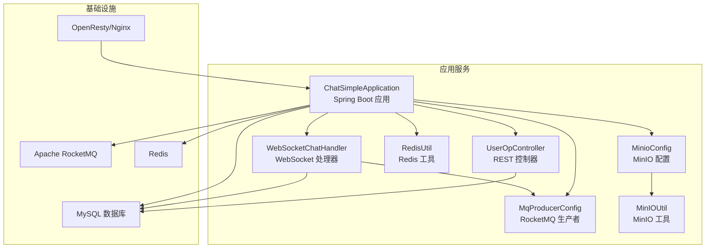
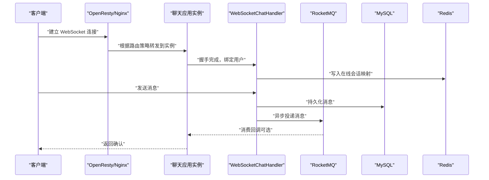
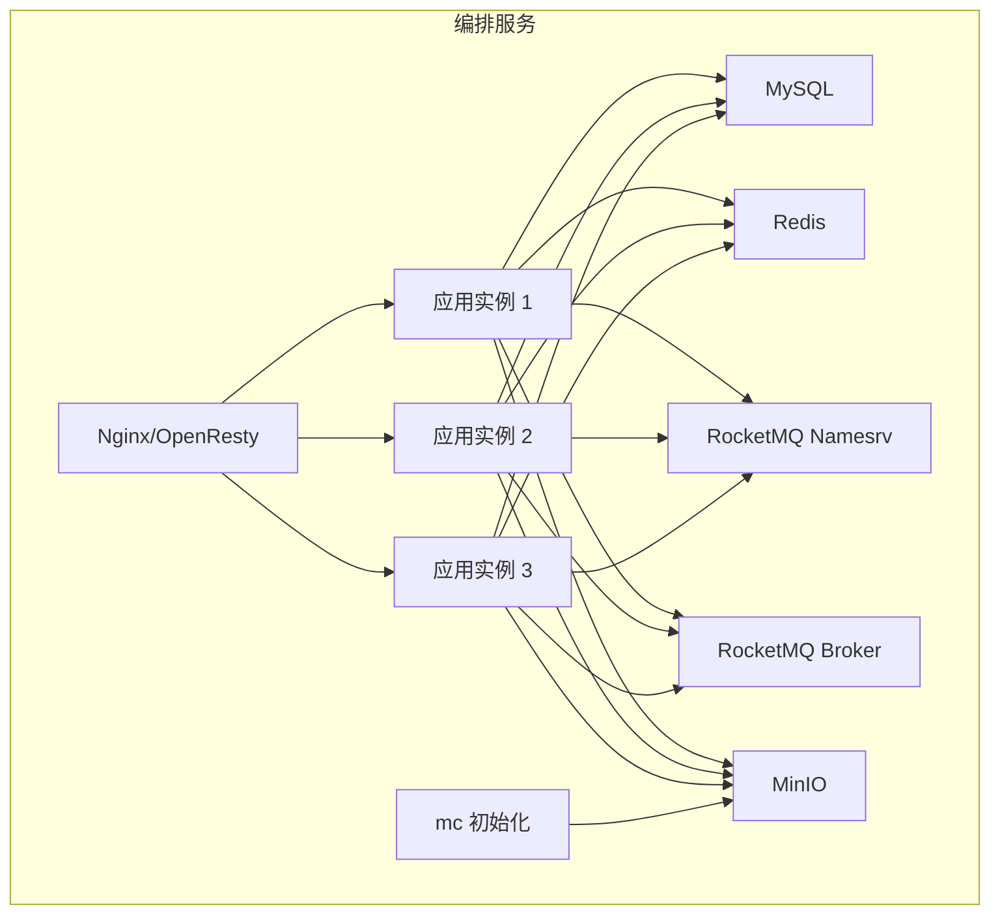
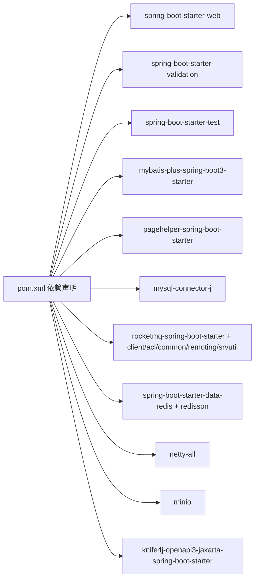

# 快速开始

<cite>
**本文引用的文件**
- [pom.xml](file://pom.xml)
- [application.yml](file://src/main/resources/application.yml)
- [Dockerfile](file://Dockerfile)
- [docker-compose.yml](file://docker-compose.yml)
- [chat.sql](file://db/chat.sql)
- [MinioConfig.java](file://src/main/java/com/hch/chat_simple/config/MinioConfig.java)
- [MinIOUtil.java](file://src/main/java/com/hch/chat_simple/util/MinIOUtil.java)
- [MqProducerConfig.java](file://src/main/java/com/hch/chat_simple/mq/MqProducerConfig.java)
- [RedisUtil.java](file://src/main/java/com/hch/chat_simple/util/RedisUtil.java)
- [ChatSimpleApplication.java](file://src/main/java/com/hch/chat_simple/ChatSimpleApplication.java)
- [UserOpController.java](file://src/main/java/com/hch/chat_simple/controller/UserOpController.java)
- [WebSocketChatHandler.java](file://src/main/java/com/hch/chat_simple/handler/WebSocketChatHandler.java)
- [WebMvcConfig.java](file://src/main/java/com/hch/chat_simple/config/WebMvcConfig.java)
- [nginx.conf](file://openresty_nginx_conf/nginx.conf)
- [.mvn/wrapper/maven-wrapper.properties](file://.mvn/wrapper/maven-wrapper.properties)
</cite>

## 目录
1. [简介](#简介)
2. [项目结构](#项目结构)
3. [核心组件](#核心组件)
4. [架构总览](#架构总览)
5. [详细组件分析](#详细组件分析)
6. [依赖分析](#依赖分析)
7. [性能考虑](#性能考虑)
8. [故障排查指南](#故障排查指南)
9. [结论](#结论)
10. [附录](#附录)

## 简介
本指南面向希望快速搭建与运行聊天应用的开发者，覆盖以下目标：
- 环境准备：JDK 17、Maven、数据库初始化、消息队列配置
- 多种部署方式：本地开发、Docker 容器化、多实例集群
- 关键配置参数详解：数据库、Redis、RocketMQ、MinIO
- 启动流程与验证步骤
- 常见问题排查与解决方案

## 项目结构
该聊天应用采用 Spring Boot 3 + MyBatis-Plus 技术栈，集成 RocketMQ 异步消息、Redis 缓存、MinIO 对象存储，并通过 Netty 提供 WebSocket 聊天通道；同时提供 OpenResty/Nginx 作为反向代理与负载均衡入口。

图表来源
- [ChatSimpleApplication.java:1-25](file://src/main/java/com/hch/chat_simple/ChatSimpleApplication.java#L1-L25)
- [UserOpController.java:1-114](file://src/main/java/com/hch/chat_simple/controller/UserOpController.java#L1-L114)
- [WebSocketChatHandler.java:1-196](file://src/main/java/com/hch/chat_simple/handler/WebSocketChatHandler.java#L1-L196)
- [MqProducerConfig.java:1-31](file://src/main/java/com/hch/chat_simple/mq/MqProducerConfig.java#L1-L31)
- [RedisUtil.java:1-123](file://src/main/java/com/hch/chat_simple/util/RedisUtil.java#L1-L123)
- [MinioConfig.java:1-33](file://src/main/java/com/hch/chat_simple/config/MinioConfig.java#L1-L33)
- [MinIOUtil.java:1-198](file://src/main/java/com/hch/chat_simple/util/MinIOUtil.java#L1-L198)

章节来源
- [pom.xml:1-346](file://pom.xml#L1-L346)
- [application.yml:1-89](file://src/main/resources/application.yml#L1-L89)

## 核心组件
- 应用入口与配置
  - 应用主类负责启动与方言注册，启用 Knife4j 文档能力。
  - Web MVC 配置注册跨域与登录拦截器。
- 控制层
  - 用户登录、查询、新增等接口，使用 JWT 令牌进行鉴权。
- WebSocket 层
  - 基于 Netty 的 WebSocket 处理器，支持鉴权、心跳、离线消息落库等。
- 消息与缓存
  - RocketMQ 生产者配置，Redis 工具封装常用操作。
- 文件存储
  - MinIO 配置与工具，支持桶管理、对象上传/下载/预览、列表与删除。

章节来源
- [ChatSimpleApplication.java:1-25](file://src/main/java/com/hch/chat_simple/ChatSimpleApplication.java#L1-L25)
- [WebMvcConfig.java:1-28](file://src/main/java/com/hch/chat_simple/config/WebMvcConfig.java#L1-L28)
- [UserOpController.java:1-114](file://src/main/java/com/hch/chat_simple/controller/UserOpController.java#L1-L114)
- [WebSocketChatHandler.java:1-196](file://src/main/java/com/hch/chat_simple/handler/WebSocketChatHandler.java#L1-L196)
- [MqProducerConfig.java:1-31](file://src/main/java/com/hch/chat_simple/mq/MqProducerConfig.java#L1-L31)
- [RedisUtil.java:1-123](file://src/main/java/com/hch/chat_simple/util/RedisUtil.java#L1-L123)
- [MinioConfig.java:1-33](file://src/main/java/com/hch/chat_simple/config/MinioConfig.java#L1-L33)
- [MinIOUtil.java:1-198](file://src/main/java/com/hch/chat_simple/util/MinIOUtil.java#L1-L198)

## 架构总览
应用采用“反向代理 + 多实例 + 中间件”的分布式架构：
- OpenResty/Nginx 作为统一入口，按用户路由策略将 WebSocket 请求分发至不同实例。
- 实例内部通过 RocketMQ 异步处理消息，Redis 用于缓存与会话管理，MySQL 存储业务数据。
- MinIO 提供对象存储能力，支持图片/文件上传与预览。

图表来源
- [nginx.conf:53-81](file://openresty_nginx_conf/nginx.conf#L53-L81)
- [WebSocketChatHandler.java:118-163](file://src/main/java/com/hch/chat_simple/handler/WebSocketChatHandler.java#L118-L163)
- [MqProducerConfig.java:22-28](file://src/main/java/com/hch/chat_simple/mq/MqProducerConfig.java#L22-L28)
- [application.yml:39-51](file://src/main/resources/application.yml#L39-L51)

## 详细组件分析

### 环境准备与安装
- JDK 17
  - 项目 Java 版本属性为 17，需在本地或 CI 环境安装 JDK 17 并配置 JAVA_HOME。
- Maven
  - 使用 Maven Wrapper，默认使用 3.9.9 版本，可通过 mvnw.cmd 执行构建。
- 数据库初始化
  - 使用 SQL 脚本初始化数据库与表结构，包含用户、好友关系、群组、群成员、聊天消息、申请记录等。
- 消息队列与对象存储
  - RocketMQ 名字服务与 Broker、Redis、MinIO 均需可用；可在本地或容器中启动。

章节来源
- [pom.xml:29-34](file://pom.xml#L29-L34)
- [.mvn/wrapper/maven-wrapper.properties:17-20](file://.mvn/wrapper/maven-wrapper.properties#L17-L20)
- [chat.sql:1-130](file://db/chat.sql#L1-L130)

### 配置文件关键参数
- 数据源（MySQL）
  - 驱动类名、URL、用户名、密码
- Redis
  - 主机、端口、数据库索引、连接池参数、Redisson 单机配置
- RocketMQ
  - 名字服务地址、生产者/消费者组、主题配置
- 分页与 MyBatis Plus
  - Mapper XML 路径、逻辑删除字段与值
- 服务器端口
  - 应用服务端口、WebSocket 服务端口
- MinIO
  - 访问密钥、桶名、安全开关、对外访问 URL

章节来源
- [application.yml:1-89](file://src/main/resources/application.yml#L1-L89)

### 部署方式一：本地开发环境
- 步骤
  1) 准备 JDK 17、Maven、MySQL、Redis、RocketMQ、MinIO
  2) 初始化数据库脚本
  3) 修改 application.yml 中的数据库、Redis、RocketMQ、MinIO 地址
  4) 启动应用主类
  5) 访问 Knife4j 文档与 WebSocket 接口
- 验证
  - 登录接口返回 Token
  - WebSocket 握手成功并能收发消息

章节来源
- [ChatSimpleApplication.java:18-22](file://src/main/java/com/hch/chat_simple/ChatSimpleApplication.java#L18-L22)
- [UserOpController.java:44-66](file://src/main/java/com/hch/chat_simple/controller/UserOpController.java#L44-L66)
- [WebSocketChatHandler.java:118-163](file://src/main/java/com/hch/chat_simple/handler/WebSocketChatHandler.java#L118-L163)

### 部署方式二：Docker 容器化
- 构建镜像
  - 使用 Dockerfile 将打包好的 jar 复制进镜像，设置时区，暴露应用与 WebSocket 端口。
- 编排与启动
  - 使用 docker-compose 启动：Nginx、三个应用实例、MySQL、Redis、RocketMQ Namesrv/Broker、MinIO、mc 初始化桶。
  - Nginx 通过 Lua 计算用户路由，将请求转发到对应实例。
- 环境变量
  - 通过环境变量覆盖数据库、Redis、RocketMQ、MinIO 等配置项。

图表来源
- [Dockerfile:1-12](file://Dockerfile#L1-L12)
- [docker-compose.yml:1-132](file://docker-compose.yml#L1-L132)
- [nginx.conf:53-81](file://openresty_nginx_conf/nginx.conf#L53-L81)

章节来源
- [Dockerfile:1-12](file://Dockerfile#L1-L12)
- [docker-compose.yml:1-132](file://docker-compose.yml#L1-L132)
- [nginx.conf:53-81](file://openresty_nginx_conf/nginx.conf#L53-L81)

### 部署方式三：多实例集群
- 负载均衡
  - Nginx 通过 Lua 计算用户路由，将同一用户的请求固定到同一实例，保证会话一致性。
- 实例配置
  - 每个实例监听不同端口，通过环境变量设置当前标签（tag），实现消息路由与广播策略。
- 可扩展性
  - 增加实例数量时，同步更新 Nginx 路由数组与实例端口映射。

章节来源
- [docker-compose.yml:13-63](file://docker-compose.yml#L13-L63)
- [nginx.conf:58-68](file://openresty_nginx_conf/nginx.conf#L58-L68)

### 启动流程与验证
- 启动顺序建议
  1) 启动 MySQL、Redis、RocketMQ Namesrv/Broker、MinIO
  2) 初始化数据库脚本
  3) 启动 Nginx
  4) 启动应用实例
- 验证步骤
  - 访问登录接口获取 Token
  - 通过 WebSocket 握手并发送消息，观察消息入库与异步处理

章节来源
- [chat.sql:1-130](file://db/chat.sql#L1-L130)
- [UserOpController.java:44-66](file://src/main/java/com/hch/chat_simple/controller/UserOpController.java#L44-L66)
- [WebSocketChatHandler.java:118-163](file://src/main/java/com/hch/chat_simple/handler/WebSocketChatHandler.java#L118-L163)

## 依赖分析
- 核心依赖
  - Spring Boot Web、Validation、Test
  - MyBatis-Plus、PageHelper、MySQL Connector
  - RocketMQ Spring Boot Starter 与客户端
  - Spring Data Redis、Redisson
  - Netty、MinIO SDK
  - Knife4j OpenAPI 文档
- 构建与打包
  - Spring Boot Maven Plugin 打包可执行 jar

图表来源
- [pom.xml:34-326](file://pom.xml#L34-L326)

章节来源
- [pom.xml:1-346](file://pom.xml#L1-L346)

## 性能考虑
- 连接池与超时
  - Redis 连接池大小、超时参数；Netty 线程池大小；RocketMQ 生产者/消费者组与网络超时
- 负载均衡
  - Nginx 按用户路由，减少跨实例会话迁移成本
- 异步处理
  - 消息通过 RocketMQ 异步投递，降低主流程阻塞
- 缓存策略
  - 利用 Redis 缓存在线会话映射与热点数据，避免频繁查询数据库

## 故障排查指南
- 数据库连接失败
  - 检查 application.yml 中数据库 URL、用户名、密码；确认 MySQL 已启动且脚本执行成功
- Redis 连接异常
  - 检查主机、端口、数据库索引；确认 Redis 已启动
- RocketMQ 不可用
  - 检查名字服务地址与 Broker 状态；确认生产者/消费者组配置正确
- MinIO 访问错误
  - 检查 MinIO URL、AccessKey/SecretKey、桶是否存在；确认 mc 初始化任务已完成
- WebSocket 握手失败
  - 检查 Nginx 路由规则与实例端口映射；确认 Token 有效
- Docker 启动异常
  - 查看各容器健康检查与日志；确认卷挂载与端口映射无冲突

章节来源
- [application.yml:1-89](file://src/main/resources/application.yml#L1-L89)
- [docker-compose.yml:64-127](file://docker-compose.yml#L64-L127)
- [nginx.conf:53-81](file://openresty_nginx_conf/nginx.conf#L53-L81)
- [MinIOUtil.java:56-96](file://src/main/java/com/hch/chat_simple/util/MinIOUtil.java#L56-L96)
- [WebSocketChatHandler.java:118-163](file://src/main/java/com/hch/chat_simple/handler/WebSocketChatHandler.java#L118-L163)

## 结论
通过本指南，您可以在本地或容器环境中快速搭建聊天应用，理解核心组件与部署架构，并掌握关键配置与常见问题排查方法。建议在生产环境进一步完善监控、限流与安全策略。

## 附录
- 关键配置清单
  - 数据库：驱动类名、URL、用户名、密码
  - Redis：主机、端口、数据库索引、连接池参数、Redisson 配置
  - RocketMQ：名字服务、生产者组、消费者组、主题
  - MinIO：URL、AccessKey、SecretKey、桶名、安全开关
  - 服务器端口：应用端口、WebSocket 端口
- 参考文件
  - [application.yml:1-89](file://src/main/resources/application.yml#L1-L89)
  - [docker-compose.yml:1-132](file://docker-compose.yml#L1-L132)
  - [nginx.conf:53-81](file://openresty_nginx_conf/nginx.conf#L53-L81)