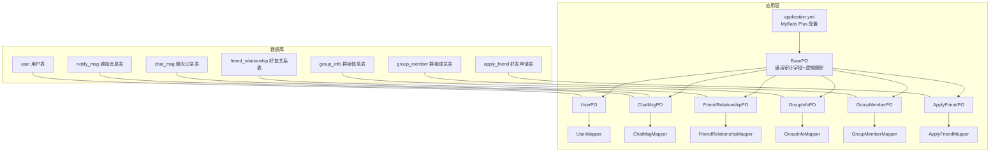
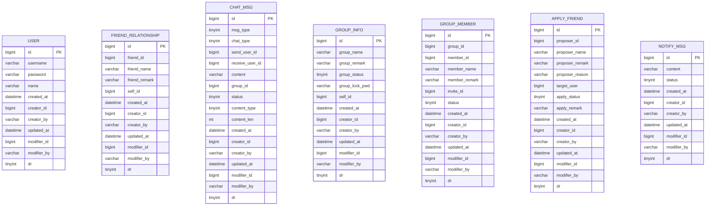
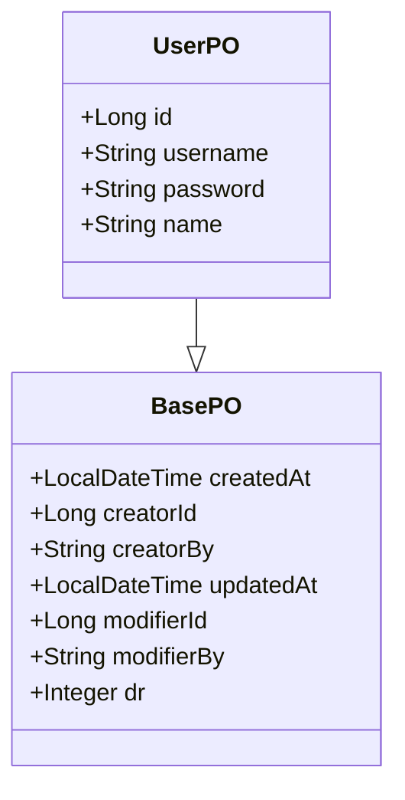
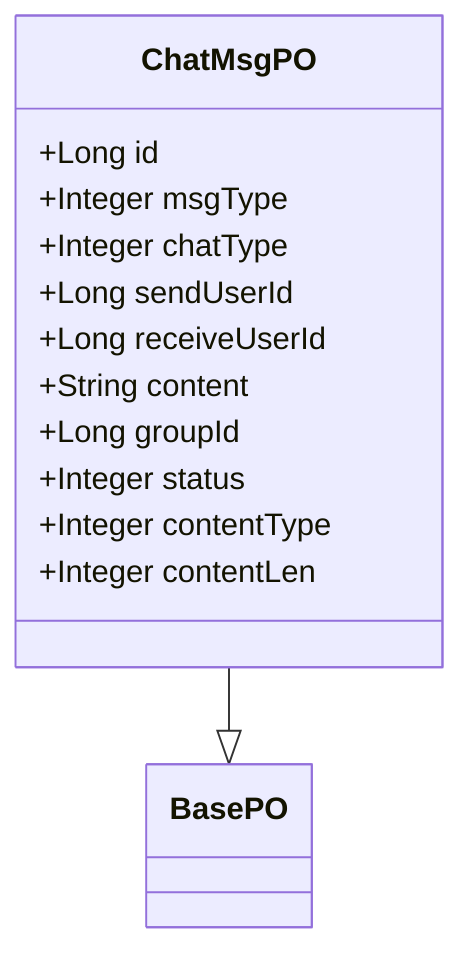
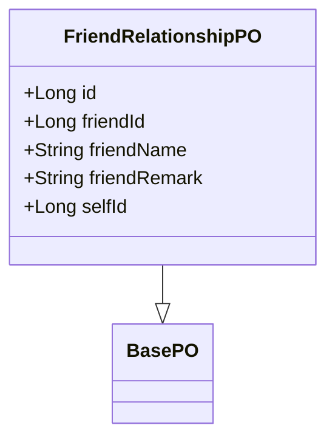
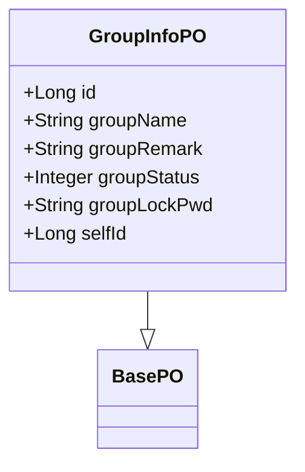
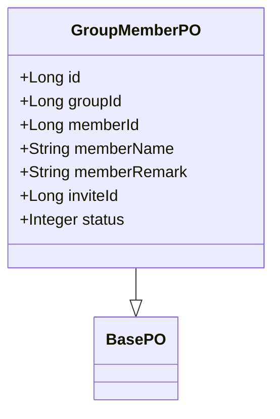
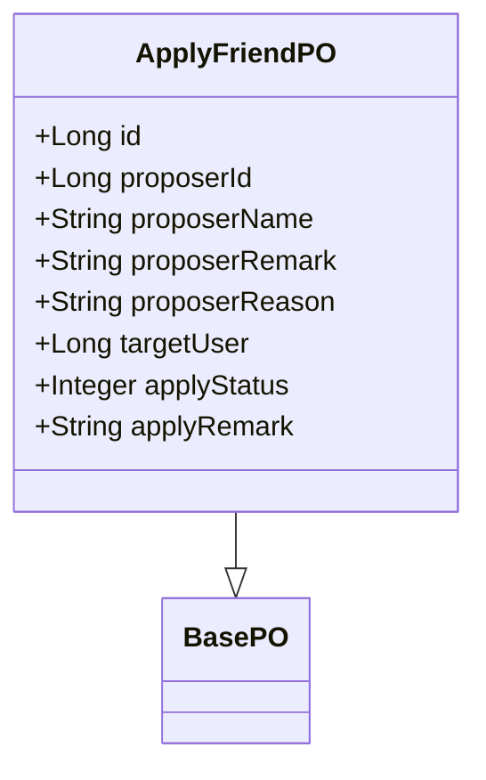
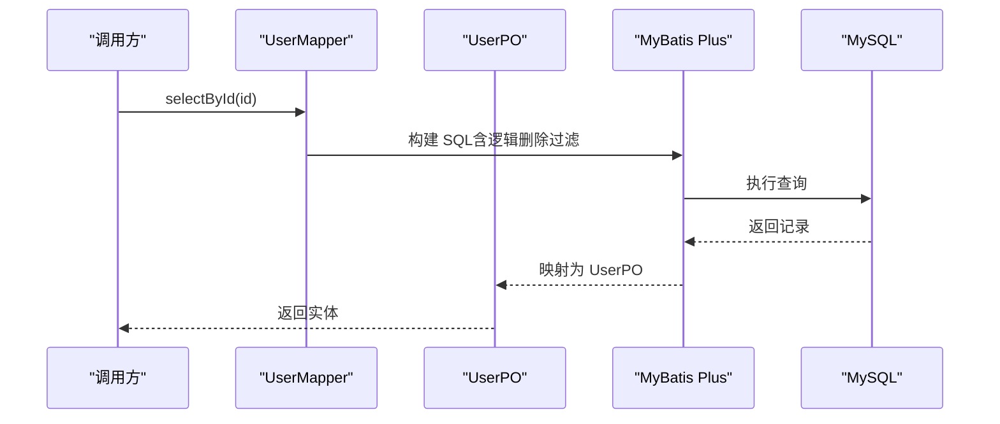
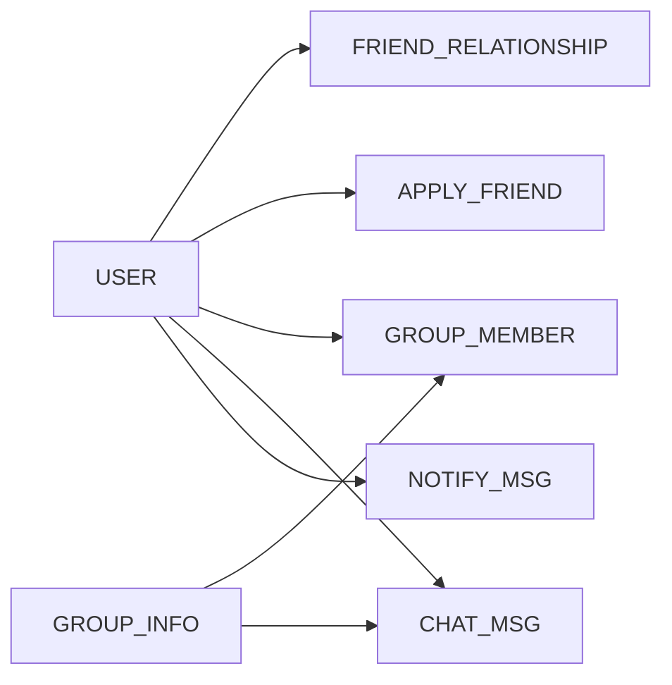

# 数据库设计

<cite>
**本文引用的文件**
- [db/chat.sql](file://db/chat.sql)
- [application.yml](file://src/main/resources/application.yml)
- [BasePO.java](file://src/main/java/com/hch/chat_simple/pojo/po/BasePO.java)
- [UserPO.java](file://src/main/java/com/hch/chat_simple/pojo/po/UserPO.java)
- [ChatMsgPO.java](file://src/main/java/com/hch/chat_simple/pojo/po/ChatMsgPO.java)
- [FriendRelationshipPO.java](file://src/main/java/com/hch/chat_simple/pojo/po/FriendRelationshipPO.java)
- [GroupInfoPO.java](file://src/main/java/com/hch/chat_simple/pojo/po/GroupInfoPO.java)
- [GroupMemberPO.java](file://src/main/java/com/hch/chat_simple/pojo/po/GroupMemberPO.java)
- [ApplyFriendPO.java](file://src/main/java/com/hch/chat_simple/pojo/po/ApplyFriendPO.java)
- [UserMapper.java](file://src/main/java/com/hch/chat_simple/mapper/UserMapper.java)
- [ChatMsgMapper.java](file://src/main/java/com/hch/chat_simple/mapper/ChatMsgMapper.java)
- [FriendRelationshipMapper.java](file://src/main/java/com/hch/chat_simple/mapper/FriendRelationshipMapper.java)
- [GroupInfoMapper.java](file://src/main/java/com/hch/chat_simple/mapper/GroupInfoMapper.java)
- [GroupMemberMapper.java](file://src/main/java/com/hch/chat_simple/mapper/GroupMemberMapper.java)
- [ApplyFriendMapper.java](file://src/main/java/com/hch/chat_simple/mapper/ApplyFriendMapper.java)
</cite>

## 目录
1. [简介](#简介)
2. [项目结构](#项目结构)
3. [核心组件](#核心组件)
4. [架构总览](#架构总览)
5. [详细组件分析](#详细组件分析)
6. [依赖分析](#依赖分析)
7. [性能考虑](#性能考虑)
8. [故障排查指南](#故障排查指南)
9. [结论](#结论)
10. [附录](#附录)

## 简介
本文件系统化梳理聊天应用的数据库设计与实现，覆盖以下方面：
- 核心业务表结构与字段语义（用户、消息、好友关系、群组、群成员、好友申请、通知消息）
- 表间关系与约束（主键、逻辑删除、扩展字段）
- MyBatis Plus 实体映射与通用基类配置
- 查询与索引优化建议
- 数据库迁移与版本管理实践
- 安全与访问控制建议

## 项目结构
数据库相关的核心对象分布如下：
- DDL 脚本：db/chat.sql
- ORM 配置：application.yml 中 mybatis-plus、mapper-locations 等
- 实体基类与 POJO：BasePO 及各业务 PO（UserPO、ChatMsgPO、FriendRelationshipPO、GroupInfoPO、GroupMemberPO、ApplyFriendPO）
- Mapper 接口：UserMapper、ChatMsgMapper、FriendRelationshipMapper、GroupInfoMapper、GroupMemberMapper、ApplyFriendMapper

图表来源
- [db/chat.sql:5-130](file://db/chat.sql#L5-L130)
- [application.yml:24-32](file://src/main/resources/application.yml#L24-L32)
- [BasePO.java:14-43](file://src/main/java/com/hch/chat_simple/pojo/po/BasePO.java#L14-L43)
- [UserPO.java:25-46](file://src/main/java/com/hch/chat_simple/pojo/po/UserPO.java#L25-L46)
- [ChatMsgPO.java:16-53](file://src/main/java/com/hch/chat_simple/pojo/po/ChatMsgPO.java#L16-L53)
- [FriendRelationshipPO.java:23-44](file://src/main/java/com/hch/chat_simple/pojo/po/FriendRelationshipPO.java#L23-L44)
- [GroupInfoPO.java:25-49](file://src/main/java/com/hch/chat_simple/pojo/po/GroupInfoPO.java#L25-L49)
- [GroupMemberPO.java:21-48](file://src/main/java/com/hch/chat_simple/pojo/po/GroupMemberPO.java#L21-L48)
- [ApplyFriendPO.java:23-54](file://src/main/java/com/hch/chat_simple/pojo/po/ApplyFriendPO.java#L23-L54)
- [UserMapper.java:18-21](file://src/main/java/com/hch/chat_simple/mapper/UserMapper.java#L18-L21)
- [ChatMsgMapper.java:17-20](file://src/main/java/com/hch/chat_simple/mapper/ChatMsgMapper.java#L17-L20)
- [FriendRelationshipMapper.java:17-20](file://src/main/java/com/hch/chat_simple/mapper/FriendRelationshipMapper.java#L17-L20)
- [GroupInfoMapper.java:17-20](file://src/main/java/com/hch/chat_simple/mapper/GroupInfoMapper.java#L17-L20)
- [GroupMemberMapper.java:17-20](file://src/main/java/com/hch/chat_simple/mapper/GroupMemberMapper.java#L17-L20)
- [ApplyFriendMapper.java:16-19](file://src/main/java/com/hch/chat_simple/mapper/ApplyFriendMapper.java#L16-L19)

章节来源
- [db/chat.sql:1-130](file://db/chat.sql#L1-L130)
- [application.yml:16-32](file://src/main/resources/application.yml#L16-L32)

## 核心组件
本节聚焦核心业务表的结构与设计要点，并给出 MyBatis Plus 的实体映射配置说明。

- 用户表（user）
  - 字段与类型：自增主键 id；字符串字段 username、password、name；时间戳 created_at、updated_at；审计字段 creator_id/creator_by、modifier_id/modifier_by；逻辑删除 dr
  - 设计要点：统一使用 BasePO 提供的审计与逻辑删除能力；username/password/name 作为登录与身份标识
  - 映射：UserPO 对应 user 表，继承 BasePO 并标注 @TableName("user")

- 好友关系表（friend_relationship）
  - 字段与类型：自增主键 id；friend_id/friend_name/friend_remark；self_id 关联用户；其余审计与逻辑删除字段
  - 设计要点：记录用户与其好友的双向关系，支持备注；可通过 self_id 快速定位某用户的全部好友
  - 映射：FriendRelationshipPO 对应 friend_relationship 表

- 聊天记录表（chat_msg）
  - 字段与类型：自增主键 id；消息类型 msg_type、聊天类型 chat_type；send_user_id、receive_user_id（群聊为空）；content 内容、group_id 群聊标识；status 发送状态；扩展字段 content_type 内容类型、content_len 长度；审计与逻辑删除
  - 设计要点：支持单聊与群聊；通过 content_type/content_len 支持文本/语音等扩展内容；按时间戳与群组维度查询频繁
  - 映射：ChatMsgPO 对应 chat_msg 表

- 群组信息表（group_info）
  - 字段与类型：自增主键 id；group_name/group_remark；group_status 状态（开放/邀请/私密等）；group_lock_pwd 密码；self_id 所属人；审计与逻辑删除
  - 设计要点：群组元信息与状态管理；self_id 便于快速定位用户创建的群组
  - 映射：GroupInfoPO 对应 group_info 表

- 群组成员表（group_member）
  - 字段与类型：自增主键 id；group_id、member_id/member_name/member_remark；invite_id 邀请人；status 成员状态（在群/离开）；审计与逻辑删除
  - 设计要点：成员状态与邀请人可追溯；status 字段便于过滤当前有效成员
  - 映射：GroupMemberPO 对应 group_member 表

- 好友申请表（apply_friend）
  - 字段与类型：自增主键 id；proposer_* 申请人信息；target_user 被申请人；apply_status 状态（申请中/通过/拒绝）；apply_remark 备注；审计与逻辑删除
  - 设计要点：记录好友申请流程与结果；apply_remark 用于后续好友展示
  - 映射：ApplyFriendPO 对应 apply_friend 表

- 通知消息表（notify_msg）
  - 字段与类型：自增主键 id；content 内容；status 发送状态；审计与逻辑删除
  - 设计要点：独立的通知消息表，便于与聊天消息区分处理
  - 映射：ChatMsgPO 同时映射 notify_msg（代码层面复用消息模型）

章节来源
- [db/chat.sql:5-130](file://db/chat.sql#L5-L130)
- [BasePO.java:14-43](file://src/main/java/com/hch/chat_simple/pojo/po/BasePO.java#L14-L43)
- [UserPO.java:25-46](file://src/main/java/com/hch/chat_simple/pojo/po/UserPO.java#L25-L46)
- [ChatMsgPO.java:16-53](file://src/main/java/com/hch/chat_simple/pojo/po/ChatMsgPO.java#L16-L53)
- [FriendRelationshipPO.java:23-44](file://src/main/java/com/hch/chat_simple/pojo/po/FriendRelationshipPO.java#L23-L44)
- [GroupInfoPO.java:25-49](file://src/main/java/com/hch/chat_simple/pojo/po/GroupInfoPO.java#L25-L49)
- [GroupMemberPO.java:21-48](file://src/main/java/com/hch/chat_simple/pojo/po/GroupMemberPO.java#L21-L48)
- [ApplyFriendPO.java:23-54](file://src/main/java/com/hch/chat_simple/pojo/po/ApplyFriendPO.java#L23-L54)

## 架构总览
下图展示数据库表与实体映射的关系，以及 MyBatis Plus 的通用配置如何贯穿到各实体：

图表来源
- [db/chat.sql:5-130](file://db/chat.sql#L5-L130)

章节来源
- [db/chat.sql:5-130](file://db/chat.sql#L5-L130)

## 详细组件分析

### 用户表（user）
- 字段设计：用户名、密码、真实姓名；统一审计字段与逻辑删除
- 映射配置：UserPO 使用 @TableName("user")，继承 BasePO 自动获得审计与逻辑删除字段
- 典型查询：按用户名唯一性校验、按 id 查询详情、按创建人/修改人过滤

图表来源
- [BasePO.java:14-43](file://src/main/java/com/hch/chat_simple/pojo/po/BasePO.java#L14-L43)
- [UserPO.java:25-46](file://src/main/java/com/hch/chat_simple/pojo/po/UserPO.java#L25-L46)

章节来源
- [UserPO.java:25-46](file://src/main/java/com/hch/chat_simple/pojo/po/UserPO.java#L25-L46)
- [BasePO.java:14-43](file://src/main/java/com/hch/chat_simple/pojo/po/BasePO.java#L14-L43)

### 聊天记录表（chat_msg）
- 字段设计：消息类型、聊天类型、发送/接收方、内容、群组标识、发送状态、扩展字段 content_type/content_len
- 映射配置：ChatMsgPO 使用 @TableName("chat_msg")，继承 BasePO；notify_msg 也映射到同一 PO（代码层面共享模型）
- 典型查询：按用户会话查询最近消息、按群组查询历史消息、按时间范围与状态筛选

图表来源
- [ChatMsgPO.java:16-53](file://src/main/java/com/hch/chat_simple/pojo/po/ChatMsgPO.java#L16-L53)
- [BasePO.java:14-43](file://src/main/java/com/hch/chat_simple/pojo/po/BasePO.java#L14-L43)

章节来源
- [ChatMsgPO.java:16-53](file://src/main/java/com/hch/chat_simple/pojo/po/ChatMsgPO.java#L16-L53)
- [db/chat.sql:37-54](file://db/chat.sql#L37-L54)

### 好友关系表（friend_relationship）
- 字段设计：friend_id/friend_name/friend_remark；self_id 关联用户；审计与逻辑删除
- 映射配置：FriendRelationshipPO 使用 @TableName("friend_relationship")
- 典型查询：按 self_id 查询某用户的所有好友、按好友 id 去重匹配

图表来源
- [FriendRelationshipPO.java:23-44](file://src/main/java/com/hch/chat_simple/pojo/po/FriendRelationshipPO.java#L23-L44)
- [BasePO.java:14-43](file://src/main/java/com/hch/chat_simple/pojo/po/BasePO.java#L14-L43)

章节来源
- [FriendRelationshipPO.java:23-44](file://src/main/java/com/hch/chat_simple/pojo/po/FriendRelationshipPO.java#L23-L44)
- [db/chat.sql:20-34](file://db/chat.sql#L20-L34)

### 群组信息表（group_info）
- 字段设计：群名、备注、状态、密码、所属人 self_id；审计与逻辑删除
- 映射配置：GroupInfoPO 使用 @TableName("group_info")
- 典型查询：按 self_id 查询用户创建的群组、按状态筛选可见群组

图表来源
- [GroupInfoPO.java:25-49](file://src/main/java/com/hch/chat_simple/pojo/po/GroupInfoPO.java#L25-L49)
- [BasePO.java:14-43](file://src/main/java/com/hch/chat_simple/pojo/po/BasePO.java#L14-L43)

章节来源
- [GroupInfoPO.java:25-49](file://src/main/java/com/hch/chat_simple/pojo/po/GroupInfoPO.java#L25-L49)
- [db/chat.sql:56-71](file://db/chat.sql#L56-L71)

### 群组成员表（group_member）
- 字段设计：group_id、member_id/member_name/member_remark、invite_id、status；审计与逻辑删除
- 映射配置：GroupMemberPO 使用 @TableName("group_member")
- 典型查询：按 group_id 查询成员列表、按 status 过滤有效成员、按 invite_id 追溯邀请人

图表来源
- [GroupMemberPO.java:21-48](file://src/main/java/com/hch/chat_simple/pojo/po/GroupMemberPO.java#L21-L48)
- [BasePO.java:14-43](file://src/main/java/com/hch/chat_simple/pojo/po/BasePO.java#L14-L43)

章节来源
- [GroupMemberPO.java:21-48](file://src/main/java/com/hch/chat_simple/pojo/po/GroupMemberPO.java#L21-L48)
- [db/chat.sql:73-89](file://db/chat.sql#L73-L89)

### 好友申请表（apply_friend）
- 字段设计：proposer_* 申请人信息、target_user 被申请人、apply_status 状态、apply_remark；审计与逻辑删除
- 映射配置：ApplyFriendPO 使用 @TableName("apply_friend")
- 典型查询：按 target_user 查询待处理申请、按 proposer_id 查询历史申请、按状态统计

图表来源
- [ApplyFriendPO.java:23-54](file://src/main/java/com/hch/chat_simple/pojo/po/ApplyFriendPO.java#L23-L54)
- [BasePO.java:14-43](file://src/main/java/com/hch/chat_simple/pojo/po/BasePO.java#L14-L43)

章节来源
- [ApplyFriendPO.java:23-54](file://src/main/java/com/hch/chat_simple/pojo/po/ApplyFriendPO.java#L23-L54)
- [db/chat.sql:92-108](file://db/chat.sql#L92-L108)

### MyBatis Plus 实体映射与配置
- 通用基类：BasePO 统一注入 createdAt/creator*/updatedAt/modifier* 与逻辑删除 dr，使用注解自动填充 INSERT/UPDATE
- 实体映射：各 PO 使用 @TableName 指定表名，继承 BasePO 即可获得通用字段
- Mapper 接口：各 Mapper 继承 BaseMapper<T>，即可获得通用 CRUD 能力
- 全局配置：application.yml 中启用逻辑删除字段 dr、值与非删除值；mapper-locations 指向 XML 映射文件目录

图表来源
- [application.yml:24-32](file://src/main/resources/application.yml#L24-L32)
- [UserMapper.java:18-21](file://src/main/java/com/hch/chat_simple/mapper/UserMapper.java#L18-L21)
- [UserPO.java:25-46](file://src/main/java/com/hch/chat_simple/pojo/po/UserPO.java#L25-L46)
- [BasePO.java:14-43](file://src/main/java/com/hch/chat_simple/pojo/po/BasePO.java#L14-L43)

章节来源
- [application.yml:24-32](file://src/main/resources/application.yml#L24-L32)
- [UserMapper.java:18-21](file://src/main/java/com/hch/chat_simple/mapper/UserMapper.java#L18-L21)
- [ChatMsgMapper.java:17-20](file://src/main/java/com/hch/chat_simple/mapper/ChatMsgMapper.java#L17-L20)
- [FriendRelationshipMapper.java:17-20](file://src/main/java/com/hch/chat_simple/mapper/FriendRelationshipMapper.java#L17-L20)
- [GroupInfoMapper.java:17-20](file://src/main/java/com/hch/chat_simple/mapper/GroupInfoMapper.java#L17-L20)
- [GroupMemberMapper.java:17-20](file://src/main/java/com/hch/chat_simple/mapper/GroupMemberMapper.java#L17-L20)
- [ApplyFriendMapper.java:16-19](file://src/main/java/com/hch/chat_simple/mapper/ApplyFriendMapper.java#L16-L19)
- [BasePO.java:14-43](file://src/main/java/com/hch/chat_simple/pojo/po/BasePO.java#L14-L43)

## 依赖分析
- 表间关系
  - chat_msg.group_id → group_info.id（群聊消息指向群组）
  - group_member.group_id → group_info.id（成员属于群组）
  - group_member.member_id → user.id（成员是用户）
  - friend_relationship.self_id → user.id（关系属于用户）
  - apply_friend.target_user → user.id（被申请人）
  - notify_msg 与 chat_msg 共享消息模型（代码层面）
- 实体依赖
  - 各 PO 继承 BasePO，统一审计与逻辑删除
  - 各 Mapper 继承 BaseMapper，获得通用 CRUD

图表来源
- [db/chat.sql:5-130](file://db/chat.sql#L5-L130)
- [FriendRelationshipPO.java:42-42](file://src/main/java/com/hch/chat_simple/pojo/po/FriendRelationshipPO.java#L42-L42)
- [GroupMemberPO.java:31-31](file://src/main/java/com/hch/chat_simple/pojo/po/GroupMemberPO.java#L31-L31)
- [GroupInfoPO.java:32-32](file://src/main/java/com/hch/chat_simple/pojo/po/GroupInfoPO.java#L32-L32)
- [ChatMsgPO.java:42-42](file://src/main/java/com/hch/chat_simple/pojo/po/ChatMsgPO.java#L42-L42)
- [ApplyFriendPO.java:46-46](file://src/main/java/com/hch/chat_simple/pojo/po/ApplyFriendPO.java#L46-L46)

章节来源
- [db/chat.sql:5-130](file://db/chat.sql#L5-L130)

## 性能考虑
- 索引设计建议
  - chat_msg：按 send_user_id/receive_user_id 组合建立索引，支持单聊双方检索；按 group_id 建立索引，支持群聊检索；按 created_at 建立索引，支持时间范围查询
  - group_member：按 group_id 建立索引，按 member_id 建立索引，支持成员查询与去重
  - friend_relationship：按 self_id 建立索引，支持用户好友列表查询
  - group_info：按 self_id 建立索引，按 group_status 建立索引，支持状态筛选
  - user：对 username 建立唯一索引，保证登录唯一性
- 查询优化建议
  - 分页查询：结合 created_at 或自增 id 进行游标分页，避免 deep pagination
  - 聚合统计：对 apply_status、chat_type、group_status 等维度进行预聚合或缓存
  - 读写分离：高并发场景下将查询路由至只读副本
- 分表分库
  - 按用户 id 哈希分片：chat_msg 按 send_user_id/receive_user_id 组合哈希分表
  - 按时间分表：chat_msg 按 created_at 年月分表，滚动清理过期数据
- 缓存策略
  - Redis 缓存用户基本信息、好友列表、群组成员列表，降低数据库压力
  - 结合 RocketMQ 异步处理高频写入，削峰填谷

## 故障排查指南
- 逻辑删除导致“查不到数据”
  - 确认全局逻辑删除配置 dr、逻辑删除值与非删除值是否正确
  - 排查查询是否带了逻辑删除过滤
- 审计字段为空
  - 确认 BasePO 的字段填充策略（INSERT/UPDATE）是否生效
  - 检查调用链是否使用了自动填充的保存/更新方法
- 查询性能差
  - 检查是否缺少必要索引；确认是否对大表执行全表扫描
  - 使用 EXPLAIN 分析慢查询，关注 key、rows、Extra 字段
- 数据不一致
  - 核对事务边界与幂等设计；检查异步消息消费是否重复处理

章节来源
- [application.yml:24-32](file://src/main/resources/application.yml#L24-L32)
- [BasePO.java:14-43](file://src/main/java/com/hch/chat_simple/pojo/po/BasePO.java#L14-L43)

## 结论
该数据库设计以清晰的业务表划分与统一的审计/逻辑删除机制为基础，配合 MyBatis Plus 的通用 Mapper 与实体基类，实现了良好的可维护性与扩展性。建议在生产环境中进一步完善索引、分表分库与缓存策略，以满足高并发与海量数据场景下的性能与可用性需求。

## 附录
- 数据库迁移与版本管理
  - DDL 脚本管理：将初始建表与增量变更脚本纳入版本控制，按版本号命名并记录变更说明
  - 渐进式迁移：先加列/加索引，再回填数据，最后切换业务逻辑
  - 回滚策略：保留逆向脚本，确保变更可回滚
- 数据备份与恢复
  - 定期全量备份与增量日志备份；验证恢复流程与 RTO/RPO 指标
- 安全与访问控制
  - 最小权限原则：应用账号仅授予必要权限；禁止使用 root
  - 网络隔离：数据库置于内网；限制来源 IP
  - 加密传输：开启 SSL/TLS；敏感字段加密存储
  - 审计日志：开启 MySQL 审计日志，记录关键 DML 操作