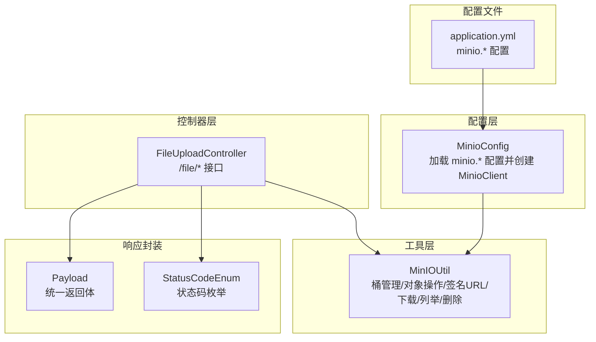
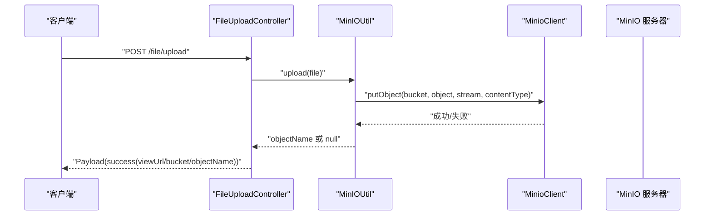
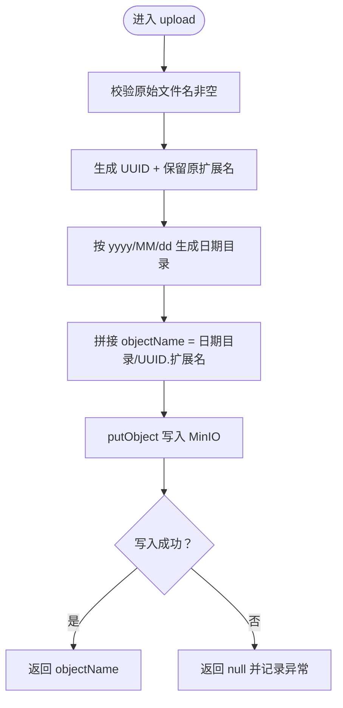
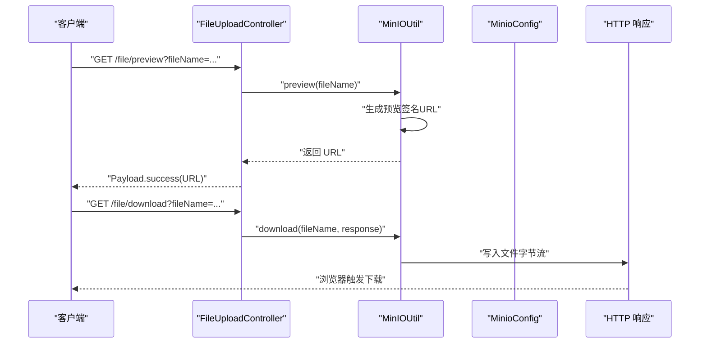
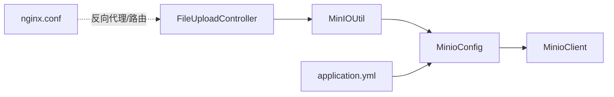

# 文件存储系统

<cite>
**本文引用的文件列表**
- [MinioConfig.java](file://src/main/java/com/hch/chat_simple/config/MinioConfig.java)
- [MinIOUtil.java](file://src/main/java/com/hch/chat_simple/util/MinIOUtil.java)
- [FileUploadController.java](file://src/main/java/com/hch/chat_simple/controller/FileUploadController.java)
- [application.yml](file://src/main/resources/application.yml)
- [Payload.java](file://src/main/java/com/hch/chat_simple/util/Payload.java)
- [StatusCodeEnum.java](file://src/main/java/com/hch/chat_simple/util/StatusCodeEnum.java)
- [nginx.conf](file://openresty_nginx_conf/nginx.conf)
</cite>

## 目录
1. [简介](#简介)
2. [项目结构](#项目结构)
3. [核心组件](#核心组件)
4. [架构总览](#架构总览)
5. [详细组件分析](#详细组件分析)
6. [依赖关系分析](#依赖关系分析)
7. [性能考量](#性能考量)
8. [故障排查指南](#故障排查指南)
9. [结论](#结论)
10. [附录](#附录)

## 简介
本文件存储系统基于 MinIO 对象存储，提供桶管理、文件上传、预览、下载以及删除等能力。系统通过 Spring Boot 配置注入 MinIO 客户端，并在控制器层提供统一的文件操作接口；工具类封装了与 MinIO 的交互逻辑，包括桶存在性检测、对象上传、签名 URL 生成（预览）、对象下载、列举对象、删除对象等。配置文件中定义了 MinIO 的连接参数与视图 URL，便于生成可访问的文件链接。

## 项目结构
围绕文件存储的关键模块如下：
- 配置层：MinIO 连接参数与客户端装配
- 工具层：与 MinIO 的交互封装
- 控制器层：对外暴露文件操作接口
- 配置文件：MinIO 参数与服务端口等基础配置
- 响应封装：统一返回体与状态码

图表来源
- [MinioConfig.java:1-32](file://src/main/java/com/hch/chat_simple/config/MinioConfig.java#L1-L32)
- [MinIOUtil.java:1-198](file://src/main/java/com/hch/chat_simple/util/MinIOUtil.java#L1-L198)
- [FileUploadController.java:1-82](file://src/main/java/com/hch/chat_simple/controller/FileUploadController.java#L1-L82)
- [application.yml:84-89](file://src/main/resources/application.yml#L84-L89)

章节来源
- [MinioConfig.java:1-32](file://src/main/java/com/hch/chat_simple/config/MinioConfig.java#L1-L32)
- [MinIOUtil.java:1-198](file://src/main/java/com/hch/chat_simple/util/MinIOUtil.java#L1-L198)
- [FileUploadController.java:1-82](file://src/main/java/com/hch/chat_simple/controller/FileUploadController.java#L1-L82)
- [application.yml:84-89](file://src/main/resources/application.yml#L84-L89)

## 核心组件
- MinIO 配置类：负责从配置文件读取 MinIO 连接参数并创建 MinioClient 实例，同时提供视图 URL 以生成可访问链接。
- MinIO 工具类：封装桶管理（存在性检测、创建、删除、列举）、对象操作（上传、预览、下载、列举、删除）以及异常处理。
- 文件上传控制器：提供 /file/ 前缀的接口，包括桶操作、上传、预览、下载、删除等。
- 统一响应体与状态码：标准化接口返回格式与错误码。

章节来源
- [MinioConfig.java:13-31](file://src/main/java/com/hch/chat_simple/config/MinioConfig.java#L13-L31)
- [MinIOUtil.java:56-194](file://src/main/java/com/hch/chat_simple/util/MinIOUtil.java#L56-L194)
- [FileUploadController.java:30-77](file://src/main/java/com/hch/chat_simple/controller/FileUploadController.java#L30-L77)
- [Payload.java:6-29](file://src/main/java/com/hch/chat_simple/util/Payload.java#L6-L29)
- [StatusCodeEnum.java:6-21](file://src/main/java/com/hch/chat_simple/util/StatusCodeEnum.java#L6-L21)

## 架构总览
系统采用“控制器-工具类-MinIO 客户端”的分层设计，控制器负责请求接入与响应封装，工具类负责与 MinIO 的具体交互，配置类负责连接参数与客户端装配。

图表来源
- [FileUploadController.java:50-57](file://src/main/java/com/hch/chat_simple/controller/FileUploadController.java#L50-L57)
- [MinIOUtil.java:98-122](file://src/main/java/com/hch/chat_simple/util/MinIOUtil.java#L98-L122)

## 详细组件分析

### MinIO 配置类（MinioConfig）
- 功能要点
  - 通过前缀 minio 读取配置项：url、accessKey、secretKey、bucketName、viewUrl。
  - 提供 @Bean 方法创建 MinioClient 实例，使用 endpoint 与凭证初始化。
- 关键点说明
  - 视图 URL 用于拼接最终可访问的文件链接，便于前端直链访问或预览。
  - 客户端构建时未显式设置 secure 参数，需结合实际部署环境确认是否启用 TLS。

章节来源
- [MinioConfig.java:13-31](file://src/main/java/com/hch/chat_simple/config/MinioConfig.java#L13-L31)
- [application.yml:84-89](file://src/main/resources/application.yml#L84-L89)

### MinIO 工具类（MinIOUtil）
- 桶管理
  - bucketExists：检测桶是否存在。
  - makeBucket：创建桶。
  - removeBucket：删除桶。
  - getAllBuckets：列举所有桶。
- 对象操作
  - upload：接收 MultipartFile，生成唯一对象名（日期目录 + UUID + 原扩展名），调用 putObject 写入 MinIO。
  - preview：生成带签名的预览 URL，支持 GET 访问。
  - download：根据对象名读取对象内容，写入 HttpServletResponse 输出流，实现下载。
  - listObjects：列举指定桶内的对象。
  - remove：删除指定对象。
- 异常处理
  - 所有 MinIO 操作均捕获异常并记录日志，返回值用于表示操作结果。

图表来源
- [MinIOUtil.java:98-122](file://src/main/java/com/hch/chat_simple/util/MinIOUtil.java#L98-L122)

章节来源
- [MinIOUtil.java:56-194](file://src/main/java/com/hch/chat_simple/util/MinIOUtil.java#L56-L194)

### 文件上传控制器（FileUploadController）
- 接口概览
  - GET /file/bucketExists：检测桶是否存在。
  - GET /file/makeBucket：创建桶。
  - GET /file/removeBucket：删除桶。
  - GET /file/getAllBuckets：列举所有桶。
  - POST /file/upload：上传文件，返回 viewUrl + bucket + objectName。
  - GET /file/preview：返回预览 URL。
  - GET /file/download：下载文件。
  - GET /file/remove：批量删除对象（解析 URL 中的 objectName 并删除）。
- 返回封装
  - 使用 Payload 封装数据、状态码与描述信息。
  - 使用 StatusCodeEnum 定义统一的状态码。

图表来源
- [FileUploadController.java:59-68](file://src/main/java/com/hch/chat_simple/controller/FileUploadController.java#L59-L68)
- [MinIOUtil.java:124-163](file://src/main/java/com/hch/chat_simple/util/MinIOUtil.java#L124-L163)

章节来源
- [FileUploadController.java:30-77](file://src/main/java/com/hch/chat_simple/controller/FileUploadController.java#L30-L77)
- [Payload.java:6-29](file://src/main/java/com/hch/chat_simple/util/Payload.java#L6-L29)
- [StatusCodeEnum.java:6-21](file://src/main/java/com/hch/chat_simple/util/StatusCodeEnum.java#L6-L21)

### 配置文件（application.yml）
- MinIO 配置项
  - minio.url：MinIO 服务地址。
  - minio.accessKey / minio.secretKey：访问凭证。
  - minio.bucketName：默认使用的桶名称。
  - minio.viewUrl：对外暴露的访问 URL 前缀，用于生成可访问链接。
  - minio.secure：布尔值，指示是否使用安全连接（在当前配置中未显式设置）。
- 其他服务配置
  - 数据源、Redis、RocketMQ、WebSocket 等配置位于同一文件中，便于集中管理。

章节来源
- [application.yml:84-89](file://src/main/resources/application.yml#L84-L89)

### 响应封装与状态码
- Payload：统一封装 data、code、remark 字段，提供 success/of 静态方法。
- StatusCodeEnum：定义通用业务状态码，如成功、token 失效、文件上传失败等。

章节来源
- [Payload.java:6-29](file://src/main/java/com/hch/chat_simple/util/Payload.java#L6-L29)
- [StatusCodeEnum.java:6-21](file://src/main/java/com/hch/chat_simple/util/StatusCodeEnum.java#L6-L21)

## 依赖关系分析
- FileUploadController 依赖 MinioConfig 与 MinIOUtil，负责接口编排与返回封装。
- MinIOUtil 依赖 MinioConfig 与 MinioClient，负责与 MinIO 的具体交互。
- application.yml 为 MinioConfig 提供配置数据源。
- Nginx/OpenResty 配置文件用于反向代理与 WebSocket 路由，与文件存储无直接耦合，但可作为上游网关参与流量转发。

图表来源
- [FileUploadController.java:27-28](file://src/main/java/com/hch/chat_simple/controller/FileUploadController.java#L27-L28)
- [MinIOUtil.java:50-53](file://src/main/java/com/hch/chat_simple/util/MinIOUtil.java#L50-L53)
- [MinioConfig.java:28-31](file://src/main/java/com/hch/chat_simple/config/MinioConfig.java#L28-L31)
- [application.yml:84-89](file://src/main/resources/application.yml#L84-L89)
- [nginx.conf:35-81](file://openresty_nginx_conf/nginx.conf#L35-L81)

章节来源
- [FileUploadController.java:27-28](file://src/main/java/com/hch/chat_simple/controller/FileUploadController.java#L27-L28)
- [MinIOUtil.java:50-53](file://src/main/java/com/hch/chat_simple/util/MinIOUtil.java#L50-L53)
- [MinioConfig.java:28-31](file://src/main/java/com/hch/chat_simple/config/MinioConfig.java#L28-L31)
- [application.yml:84-89](file://src/main/resources/application.yml#L84-L89)
- [nginx.conf:35-81](file://openresty_nginx_conf/nginx.conf#L35-L81)

## 性能考量
- 上传性能
  - 当前上传使用流式写入，未设置分片大小参数，适合中小文件。对于大文件建议引入分片上传与断点续传机制。
- 下载性能
  - 下载采用一次性读取到内存再输出，可能造成内存压力。建议改为分块读取与管道化输出，减少内存占用。
- 预览性能
  - 预览使用签名 URL，避免服务端转发，降低服务端负载。
- 缓存与 CDN
  - 可结合 Nginx/OpenResty 配置静态资源缓存与压缩，提升访问速度。
- 并发与连接池
  - MinIO 客户端默认连接池行为取决于底层实现，建议在高并发场景下评估连接池配置与超时设置。

[本节为通用性能建议，不直接分析特定文件，故不附加章节来源]

## 故障排查指南
- 上传失败
  - 检查 MinIO 服务连通性与凭证正确性；查看 MinIO 工具类日志输出。
  - 确认桶存在且具备写权限；必要时通过 /file/makeBucket 创建桶。
- 预览失败
  - 确认 viewUrl 与 bucketName 配置正确；检查签名 URL 有效期与权限。
- 下载失败
  - 检查对象名是否正确；确认对象存在且具备读权限；关注下载过程中的异常日志。
- 删除失败
  - 确认对象名解析逻辑与桶名一致；检查权限与对象是否存在。

章节来源
- [MinIOUtil.java:116-118](file://src/main/java/com/hch/chat_simple/util/MinIOUtil.java#L116-L118)
- [MinIOUtil.java:132-138](file://src/main/java/com/hch/chat_simple/util/MinIOUtil.java#L132-L138)
- [MinIOUtil.java:160-162](file://src/main/java/com/hch/chat_simple/util/MinIOUtil.java#L160-L162)
- [FileUploadController.java:70-77](file://src/main/java/com/hch/chat_simple/controller/FileUploadController.java#L70-L77)

## 结论
该文件存储系统以 MinIO 为核心，通过配置类、工具类与控制器三层结构实现了桶管理与对象操作的完整闭环。系统具备基本的上传、预览、下载与删除能力，并通过统一响应体与状态码提升了接口一致性。后续可在以下方面进一步增强：
- 文件类型识别与安全检查：增加 MIME 类型校验、大小限制、病毒扫描等。
- 断点续传与并发下载：针对大文件优化上传与下载体验。
- 权限控制：结合业务用户体系实现细粒度访问控制。
- 性能优化：改进下载内存占用、引入缓存与 CDN、优化连接池配置。

[本节为总结性内容，不直接分析特定文件，故不附加章节来源]

## 附录

### 接口清单与说明
- GET /file/bucketExists?bucketName=xxx：检测桶是否存在
- GET /file/makeBucket?bucketName=xxx：创建桶
- GET /file/removeBucket?bucketName=xxx：删除桶
- GET /file/getAllBuckets：列举所有桶
- POST /file/upload：上传文件，返回 viewUrl + bucket + objectName
- GET /file/preview?fileName=xxx：返回预览 URL
- GET /file/download?fileName=xxx：下载文件
- GET /file/remove：批量删除对象（解析 URL 中的 objectName）

章节来源
- [FileUploadController.java:30-77](file://src/main/java/com/hch/chat_simple/controller/FileUploadController.java#L30-L77)

### 配置项说明
- minio.url：MinIO 服务地址
- minio.accessKey / minio.secretKey：访问凭证
- minio.bucketName：默认桶名称
- minio.viewUrl：对外访问 URL 前缀
- minio.secure：是否启用安全连接（布尔值）

章节来源
- [application.yml:84-89](file://src/main/resources/application.yml#L84-L89)