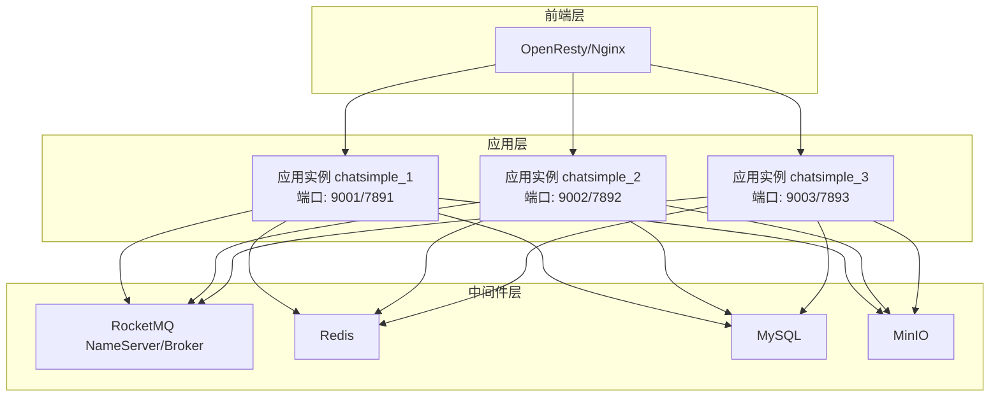
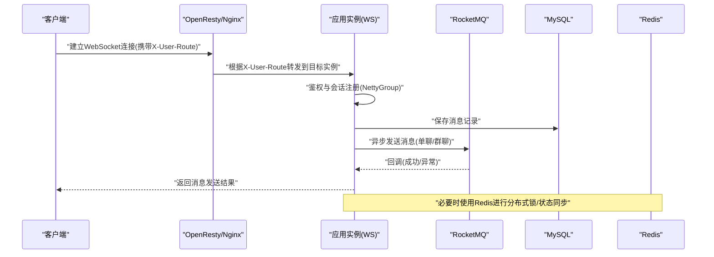
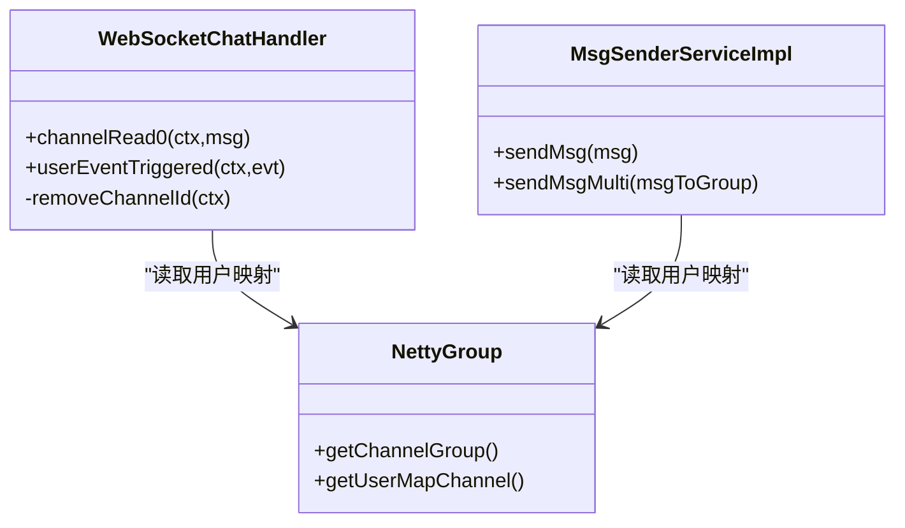
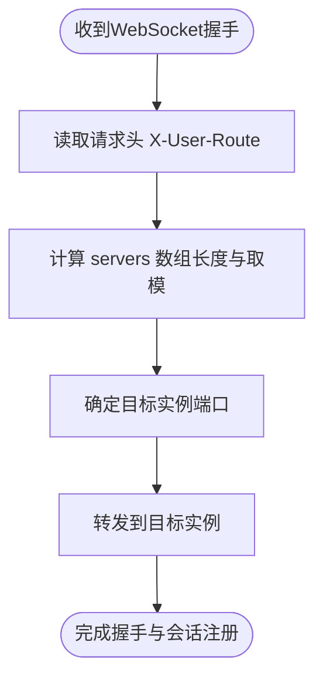
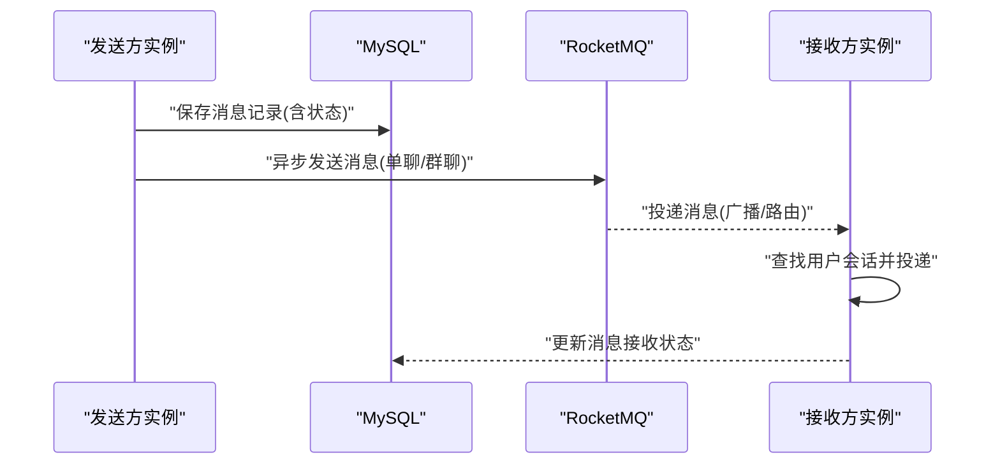
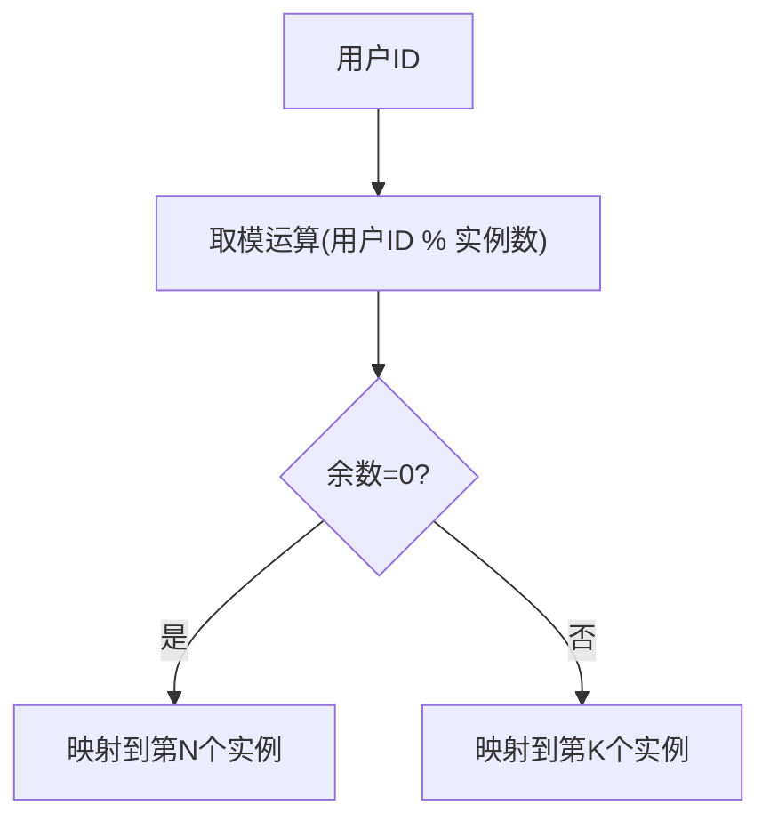
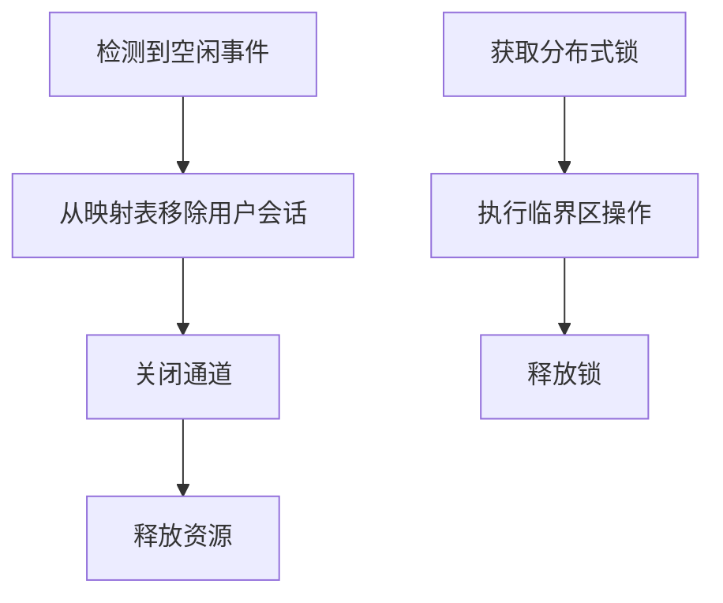
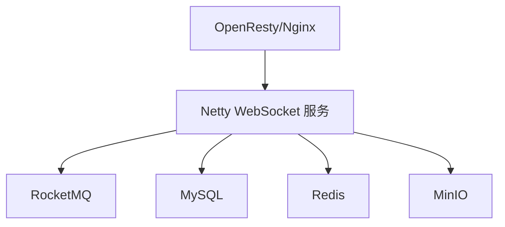

# 分布式架构设计

<cite>
**本文引用的文件**
- [NettyGroup.java](file://src/main/java/com/hch/chat_simple/config/NettyGroup.java)
- [WebSocketChatHandler.java](file://src/main/java/com/hch/chat_simple/handler/WebSocketChatHandler.java)
- [PermisionWsHandler.java](file://src/main/java/com/hch/chat_simple/handler/PermisionWsHandler.java)
- [MsgSenderServiceImpl.java](file://src/main/java/com/hch/chat_simple/service/impl/MsgSenderServiceImpl.java)
- [InstanceMapTagUtils.java](file://src/main/java/com/hch/chat_simple/util/InstanceMapTagUtils.java)
- [RedisUtil.java](file://src/main/java/com/hch/chat_simple/util/RedisUtil.java)
- [RedissonUtil.java](file://src/main/java/com/hch/chat_simple/util/RedissonUtil.java)
- [SnowflakeIdGen.java](file://src/main/java/com/hch/chat_simple/util/SnowflakeIdGen.java)
- [AsyncProducer.java](file://src/main/java/com/hch/chat_simple/mq/AsyncProducer.java)
- [application.yml](file://src/main/resources/application.yml)
- [docker-compose.yml](file://docker-compose.yml)
- [Dockerfile](file://Dockerfile)
- [nginx.conf](file://openresty_nginx_conf/nginx.conf)
- [ChatComponentConfig.java](file://src/main/java/com/hch/chat_simple/config/ChatComponentConfig.java)
- [Constant.java](file://src/main/java/com/hch/chat_simple/util/Constant.java)
</cite>

## 目录
1. [简介](#简介)
2. [项目结构](#项目结构)
3. [核心组件](#核心组件)
4. [架构总览](#架构总览)
5. [详细组件分析](#详细组件分析)
6. [依赖分析](#依赖分析)
7. [性能考虑](#性能考虑)
8. [故障排查指南](#故障排查指南)
9. [结论](#结论)
10. [附录](#附录)

## 简介
本设计文档面向一个基于 Netty 的聊天应用，聚焦其分布式部署与多实例协调机制。文档围绕以下目标展开：
- 多实例部署的架构原理：实例标识、连接分配、消息分发
- NettyGroup 的集群管理能力：实例注册、心跳检测、故障转移
- 分布式环境下的会话管理、连接状态同步、消息一致性保障
- 负载均衡配置、服务发现机制、实例间通信协议
- 提供分布式部署拓扑图与实例协调流程图，完整呈现多实例协作架构

## 项目结构
该项目采用 Spring Boot + Netty + RocketMQ + Redis 的组合，容器化部署于 OpenResty 前置代理之后，形成“前端代理 -> 应用实例 -> 中间件”的典型微服务拓扑。

图表来源
- [docker-compose.yml:1-132](file://docker-compose.yml#L1-L132)
- [nginx.conf:35-81](file://openresty_nginx_conf/nginx.conf#L35-L81)

章节来源
- [docker-compose.yml:1-132](file://docker-compose.yml#L1-L132)
- [application.yml:1-89](file://src/main/resources/application.yml#L1-L89)
- [nginx.conf:1-153](file://openresty_nginx_conf/nginx.conf#L1-L153)

## 核心组件
- NettyGroup：全局静态的 ChannelGroup 与用户到 ChannelId 的映射，用于本地会话管理与消息投递
- WebSocketChatHandler：WebSocket 握手后的鉴权、会话注册、消息落库与异步转发
- PermisionWsHandler：HTTP 请求阶段的鉴权与上下文注入，支持按用户路由头进行实例选择
- MsgSenderServiceImpl：基于 NettyGroup 的单播/群发消息投递
- InstanceMapTagUtils：基于标签列表的实例分片映射工具
- AsyncProducer：RocketMQ 异步消息生产者
- RedisUtil/RedissonUtil：Redis 读写与分布式锁能力
- SnowflakeIdGen：分布式唯一 ID 生成器
- ChatComponentConfig：Netty WebSocket 服务启动配置
- Constant：常量定义（消息类型、键名等）

章节来源
- [NettyGroup.java:1-30](file://src/main/java/com/hch/chat_simple/config/NettyGroup.java#L1-L30)
- [WebSocketChatHandler.java:1-196](file://src/main/java/com/hch/chat_simple/handler/WebSocketChatHandler.java#L1-L196)
- [PermisionWsHandler.java:1-81](file://src/main/java/com/hch/chat_simple/handler/PermisionWsHandler.java#L1-L81)
- [MsgSenderServiceImpl.java:1-79](file://src/main/java/com/hch/chat_simple/service/impl/MsgSenderServiceImpl.java#L1-L79)
- [InstanceMapTagUtils.java:1-55](file://src/main/java/com/hch/chat_simple/util/InstanceMapTagUtils.java#L1-L55)
- [AsyncProducer.java:1-63](file://src/main/java/com/hch/chat_simple/mq/AsyncProducer.java#L1-L63)
- [RedisUtil.java:1-123](file://src/main/java/com/hch/chat_simple/util/RedisUtil.java#L1-L123)
- [RedissonUtil.java:1-53](file://src/main/java/com/hch/chat_simple/util/RedissonUtil.java#L1-L53)
- [SnowflakeIdGen.java:1-118](file://src/main/java/com/hch/chat_simple/util/SnowflakeIdGen.java#L1-L118)
- [ChatComponentConfig.java:1-104](file://src/main/java/com/hch/chat_simple/config/ChatComponentConfig.java#L1-L104)
- [Constant.java:1-33](file://src/main/java/com/hch/chat_simple/util/Constant.java#L1-L33)

## 架构总览
本系统采用“前端代理 + 多实例应用 + 中间件”的分布式架构。OpenResty 作为统一入口，依据请求头中的用户路由信息将 WebSocket 连接定向至特定应用实例；每个实例内部通过 Netty 维护用户会话，并借助 RocketMQ 实现跨实例的消息广播与持久化；Redis 用于分布式锁与键值存储，MySQL 承载业务数据，MinIO 存储文件资源。

图表来源
- [PermisionWsHandler.java:32-66](file://src/main/java/com/hch/chat_simple/handler/PermisionWsHandler.java#L32-L66)
- [WebSocketChatHandler.java:72-109](file://src/main/java/com/hch/chat_simple/handler/WebSocketChatHandler.java#L72-L109)
- [AsyncProducer.java:40-59](file://src/main/java/com/hch/chat_simple/mq/AsyncProducer.java#L40-L59)
- [ChatComponentConfig.java:48-89](file://src/main/java/com/hch/chat_simple/config/ChatComponentConfig.java#L48-L89)

## 详细组件分析

### NettyGroup 与会话管理
- 全局 ChannelGroup 与用户到 ChannelId 的映射，用于本地会话注册与消息投递
- WebSocketChatHandler 在握手完成后将用户加入映射表，并在空闲事件中移除失效连接
- MsgSenderServiceImpl 基于映射表进行单播投递，若用户不存在则记录消息状态

图表来源
- [NettyGroup.java:11-29](file://src/main/java/com/hch/chat_simple/config/NettyGroup.java#L11-L29)
- [WebSocketChatHandler.java:50-196](file://src/main/java/com/hch/chat_simple/handler/WebSocketChatHandler.java#L50-L196)
- [MsgSenderServiceImpl.java:24-79](file://src/main/java/com/hch/chat_simple/service/impl/MsgSenderServiceImpl.java#L24-L79)

章节来源
- [NettyGroup.java:1-30](file://src/main/java/com/hch/chat_simple/config/NettyGroup.java#L1-L30)
- [WebSocketChatHandler.java:118-175](file://src/main/java/com/hch/chat_simple/handler/WebSocketChatHandler.java#L118-L175)
- [MsgSenderServiceImpl.java:34-55](file://src/main/java/com/hch/chat_simple/service/impl/MsgSenderServiceImpl.java#L34-L55)

### 负载均衡与实例路由
- OpenResty 通过 Lua 计算请求头 X-User-Route 的取模，将连接定向至对应实例端口
- 应用侧 PermisionWsHandler 注入用户上下文，随后由 ChatComponentConfig 启动 Netty 服务监听指定端口

图表来源
- [nginx.conf:58-78](file://openresty_nginx_conf/nginx.conf#L58-L78)
- [PermisionWsHandler.java:39-61](file://src/main/java/com/hch/chat_simple/handler/PermisionWsHandler.java#L39-L61)
- [ChatComponentConfig.java:33-71](file://src/main/java/com/hch/chat_simple/config/ChatComponentConfig.java#L33-L71)

章节来源
- [nginx.conf:53-81](file://openresty_nginx_conf/nginx.conf#L53-L81)
- [PermisionWsHandler.java:29-66](file://src/main/java/com/hch/chat_simple/handler/PermisionWsHandler.java#L29-L66)
- [ChatComponentConfig.java:31-89](file://src/main/java/com/hch/chat_simple/config/ChatComponentConfig.java#L31-L89)

### 消息分发与一致性
- 单聊/群聊消息先落库，再异步发送至 RocketMQ；消费者负责跨实例广播
- 本地仅做单播投递，确保消息至少一次投递；最终一致性由下游消费者保障
- 消息 ID 使用 Snowflake 算法生成，避免跨实例冲突

图表来源
- [WebSocketChatHandler.java:88-105](file://src/main/java/com/hch/chat_simple/handler/WebSocketChatHandler.java#L88-L105)
- [AsyncProducer.java:40-59](file://src/main/java/com/hch/chat_simple/mq/AsyncProducer.java#L40-L59)
- [MsgSenderServiceImpl.java:34-55](file://src/main/java/com/hch/chat_simple/service/impl/MsgSenderServiceImpl.java#L34-L55)
- [SnowflakeIdGen.java:54-86](file://src/main/java/com/hch/chat_simple/util/SnowflakeIdGen.java#L54-L86)

章节来源
- [WebSocketChatHandler.java:72-109](file://src/main/java/com/hch/chat_simple/handler/WebSocketChatHandler.java#L72-L109)
- [AsyncProducer.java:17-63](file://src/main/java/com/hch/chat_simple/mq/AsyncProducer.java#L17-L63)
- [MsgSenderServiceImpl.java:24-79](file://src/main/java/com/hch/chat_simple/service/impl/MsgSenderServiceImpl.java#L24-L79)
- [SnowflakeIdGen.java:11-118](file://src/main/java/com/hch/chat_simple/util/SnowflakeIdGen.java#L11-L118)

### 实例标识与分片映射
- 应用通过配置项维护实例标签列表，结合取模算法实现用户到实例的稳定映射
- 该映射用于消息分发与会话定位，提升跨实例一致性

图表来源
- [InstanceMapTagUtils.java:32-47](file://src/main/java/com/hch/chat_simple/util/InstanceMapTagUtils.java#L32-L47)
- [application.yml:80-82](file://src/main/resources/application.yml#L80-L82)

章节来源
- [InstanceMapTagUtils.java:14-55](file://src/main/java/com/hch/chat_simple/util/InstanceMapTagUtils.java#L14-L55)
- [application.yml:76-82](file://src/main/resources/application.yml#L76-L82)

### 集群管理与容错机制
- 心跳检测：WebSocket 空闲事件触发会话清理，避免僵尸连接占用资源
- 故障转移：OpenResty 基于 X-User-Route 将流量路由到目标实例；实例重启后仍可按用户 ID 映射恢复
- 分布式锁：Redisson 提供可重入锁与看门狗续期，保障并发场景下的数据一致性

图表来源
- [WebSocketChatHandler.java:155-175](file://src/main/java/com/hch/chat_simple/handler/WebSocketChatHandler.java#L155-L175)
- [RedissonUtil.java:23-51](file://src/main/java/com/hch/chat_simple/util/RedissonUtil.java#L23-L51)

章节来源
- [WebSocketChatHandler.java:118-175](file://src/main/java/com/hch/chat_simple/handler/WebSocketChatHandler.java#L118-L175)
- [RedissonUtil.java:11-53](file://src/main/java/com/hch/chat_simple/util/RedissonUtil.java#L11-L53)

### 会话管理与状态同步
- 会话注册：握手完成后将用户与 ChannelId 写入映射表
- 状态同步：消息发送状态在本地记录，最终由下游消费者更新数据库状态
- 连接状态：通过空闲事件与异常捕获进行连接回收

章节来源
- [WebSocketChatHandler.java:138-153](file://src/main/java/com/hch/chat_simple/handler/WebSocketChatHandler.java#L138-L153)
- [MsgSenderServiceImpl.java:34-55](file://src/main/java/com/hch/chat_simple/service/impl/MsgSenderServiceImpl.java#L34-L55)

## 依赖分析
- 前端代理：OpenResty 通过 Lua 脚本实现基于用户路由头的实例选择
- 应用实例：Spring Boot + Netty，启动独立 WebSocket 服务
- 中间件：RocketMQ 负责消息异步分发；Redis 提供分布式锁与键值存储；MySQL 存储业务数据；MinIO 存储文件

图表来源
- [nginx.conf:35-81](file://openresty_nginx_conf/nginx.conf#L35-L81)
- [application.yml:39-89](file://src/main/resources/application.yml#L39-L89)

章节来源
- [nginx.conf:1-153](file://openresty_nginx_conf/nginx.conf#L1-L153)
- [application.yml:1-89](file://src/main/resources/application.yml#L1-L89)

## 性能考虑
- 连接模型：Netty 的事件循环模型具备高吞吐低延迟特性，适合长连接场景
- 负载均衡：OpenResty 基于用户路由头的取模策略，降低跨实例会话迁移成本
- 异步处理：消息通过 RocketMQ 异步分发，避免阻塞主流程
- 缓存与锁：Redis 与 Redisson 提供高性能的分布式协调能力
- 端口规划：应用实例分别监听不同端口，便于 OpenResty 路由与水平扩展

## 故障排查指南
- 连接无法建立
  - 检查 OpenResty 转发规则与 X-User-Route 头是否正确
  - 确认应用实例端口映射与健康状态
- 消息未送达
  - 核对 RocketMQ 名称服务器地址与消费者组配置
  - 检查消息生产回调日志与异常堆栈
- 会话异常断开
  - 关注空闲事件触发与异常捕获逻辑
  - 确认用户上下文注入是否成功
- 分布式锁问题
  - 检查 Redisson 客户端配置与锁超时设置
  - 验证看门狗续期是否生效

章节来源
- [PermisionWsHandler.java:68-72](file://src/main/java/com/hch/chat_simple/handler/PermisionWsHandler.java#L68-L72)
- [WebSocketChatHandler.java:112-116](file://src/main/java/com/hch/chat_simple/handler/WebSocketChatHandler.java#L112-L116)
- [AsyncProducer.java:50-58](file://src/main/java/com/hch/chat_simple/mq/AsyncProducer.java#L50-L58)
- [RedissonUtil.java:23-51](file://src/main/java/com/hch/chat_simple/util/RedissonUtil.java#L23-L51)

## 结论
本方案通过“前端代理 + 多实例 + 中间件”的组合，实现了高可用、可扩展的聊天应用分布式架构。OpenResty 的用户路由策略与 Netty 的本地会话管理相结合，配合 RocketMQ 的异步消息分发与 Redis 的分布式协调，满足了多实例部署下的连接分配、消息分发与一致性保障需求。建议在生产环境中进一步完善服务发现、实例健康检查与监控告警体系，以增强整体稳定性与可观测性。

## 附录
- 部署拓扑与端口映射
  - OpenResty 监听 80 端口，转发至各应用实例的 789X 端口
  - 应用实例监听 900X/789X 端口，分别用于 HTTP 与 WebSocket
- 容器编排
  - docker-compose 启动顺序：db -> redis -> broker -> minio -> 应用实例
- 配置要点
  - RocketMQ 名称服务器、消费者组、主题配置
  - Redis 连接池与超时参数
  - MySQL 连接与 MyBatis Plus 配置
  - MinIO 访问密钥与桶配置

章节来源
- [docker-compose.yml:1-132](file://docker-compose.yml#L1-L132)
- [Dockerfile:1-12](file://Dockerfile#L1-L12)
- [application.yml:1-89](file://src/main/resources/application.yml#L1-L89)