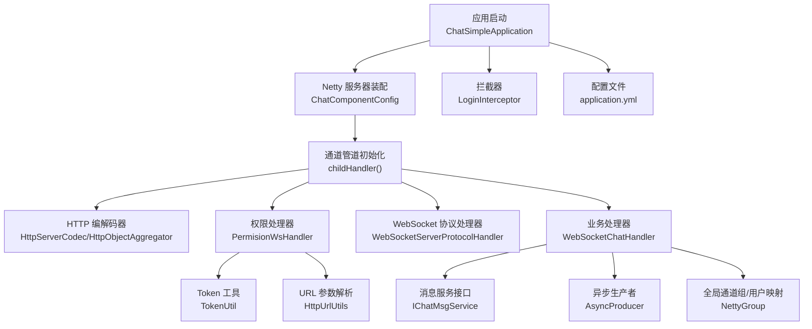
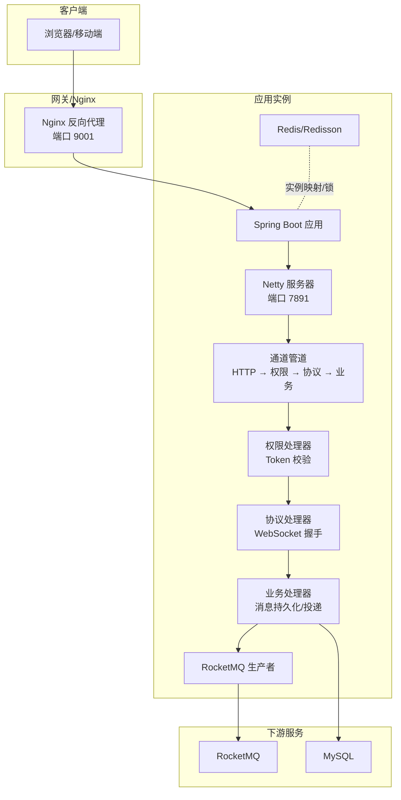
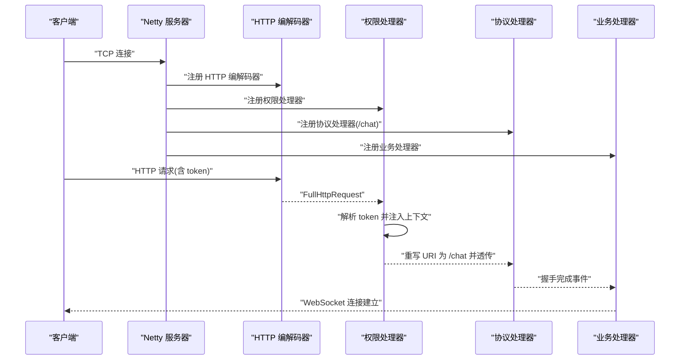
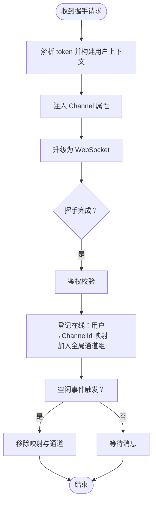
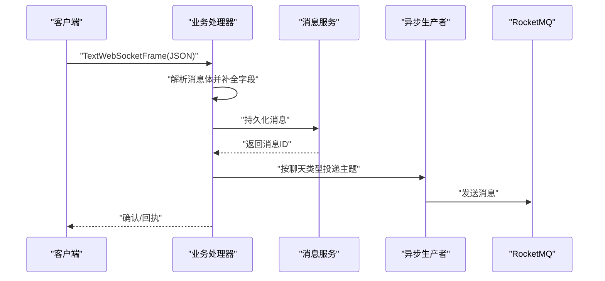
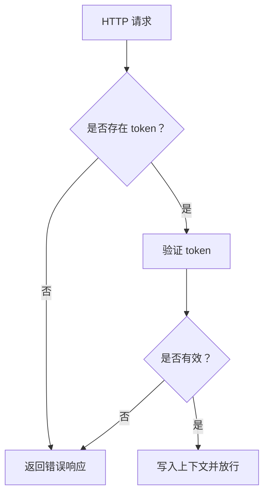
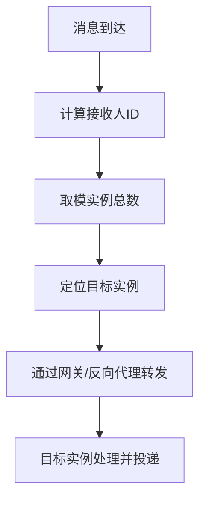
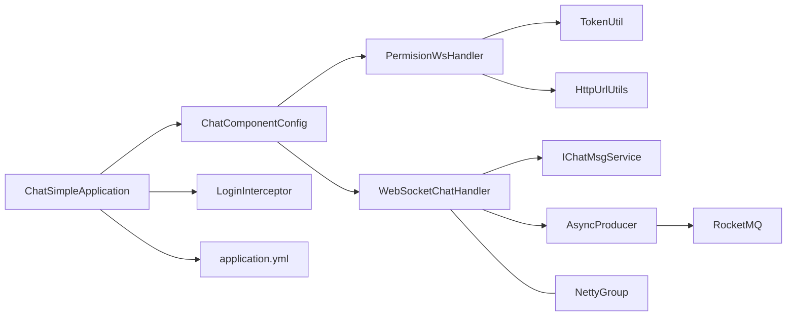

# 实时通信架构

<cite>
**本文引用的文件**
- [ChatSimpleApplication.java](file://src/main/java/com/hch/chat_simple/ChatSimpleApplication.java)
- [ChatComponentConfig.java](file://src/main/java/com/hch/chat_simple/config/ChatComponentConfig.java)
- [NettyGroup.java](file://src/main/java/com/hch/chat_simple/config/NettyGroup.java)
- [WebSocketChatHandler.java](file://src/main/java/com/hch/chat_simple/handler/WebSocketChatHandler.java)
- [PermisionWsHandler.java](file://src/main/java/com/hch/chat_simple/handler/PermisionWsHandler.java)
- [LoginInterceptor.java](file://src/main/java/com/hch/chat_simple/config/LoginInterceptor.java)
- [TokenUtil.java](file://src/main/java/com/hch/chat_simple/util/TokenUtil.java)
- [HttpUrlUtils.java](file://src/main/java/com/hch/chat_simple/util/HttpUrlUtils.java)
- [Constant.java](file://src/main/java/com/hch/chat_simple/util/Constant.java)
- [WebSocketPerssionVerify.java](file://src/main/java/com/hch/chat_simple/pojo/dto/WebSocketPerssionVerify.java)
- [AsyncProducer.java](file://src/main/java/com/hch/chat_simple/mq/AsyncProducer.java)
- [application.yml](file://src/main/resources/application.yml)
- [IChatMsgService.java](file://src/main/java/com/hch/chat_simple/service/IChatMsgService.java)
- [RedisUtil.java](file://src/main/java/com/hch/chat_simple/util/RedisUtil.java)
- [RedissonUtil.java](file://src/main/java/com/hch/chat_simple/util/RedissonUtil.java)
- [InstanceCreateHook.java](file://src/main/java/com/hch/chat_simple/config/InstanceCreateHook.java)
</cite>

## 目录
1. [引言](#引言)
2. [项目结构](#项目结构)
3. [核心组件](#核心组件)
4. [架构总览](#架构总览)
5. [详细组件分析](#详细组件分析)
6. [依赖分析](#依赖分析)
7. [性能考虑](#性能考虑)
8. [故障排查指南](#故障排查指南)
9. [结论](#结论)
10. [附录](#附录)

## 引言
本文件面向实时通信系统的设计与实现，围绕基于 Netty 的 WebSocket 服务器展开，系统采用 Spring Boot 作为应用容器，结合 RocketMQ 实现跨实例消息投递，Redis/Redisson 提供实例映射与分布式锁能力。本文从启动配置、连接管理、消息处理、权限校验、消息路由与多实例协调等维度，给出系统架构图与关键流程图示，帮助读者快速理解并落地部署。

## 项目结构
项目采用标准 Spring Boot 结构，核心模块如下：
- 启动入口：应用主类负责初始化与自动配置
- 配置层：Netty 服务器装配、拦截器、跨域与 Web MVC 配置
- 处理层：WebSocket 权限处理器与业务处理器
- 服务层：聊天消息服务接口
- 工具层：Token 解析、HTTP 参数解析、Redis/Redisson 封装
- MQ 层：RocketMQ 生产者封装
- 配置文件：application.yml 提供数据库、Redis、MQ、WebSocket 等参数

图表来源
- [ChatSimpleApplication.java:18-22](file://src/main/java/com/hch/chat_simple/ChatSimpleApplication.java#L18-L22)
- [ChatComponentConfig.java:48-89](file://src/main/java/com/hch/chat_simple/config/ChatComponentConfig.java#L48-L89)
- [PermisionWsHandler.java:32-66](file://src/main/java/com/hch/chat_simple/handler/PermisionWsHandler.java#L32-L66)
- [WebSocketChatHandler.java:72-109](file://src/main/java/com/hch/chat_simple/handler/WebSocketChatHandler.java#L72-L109)
- [IChatMsgService.java:20-27](file://src/main/java/com/hch/chat_simple/service/IChatMsgService.java#L20-L27)
- [AsyncProducer.java:40-59](file://src/main/java/com/hch/chat_simple/mq/AsyncProducer.java#L40-L59)
- [NettyGroup.java:11-29](file://src/main/java/com/hch/chat_simple/config/NettyGroup.java#L11-L29)
- [LoginInterceptor.java:28-90](file://src/main/java/com/hch/chat_simple/config/LoginInterceptor.java#L28-L90)
- [application.yml:1-89](file://src/main/resources/application.yml#L1-L89)

章节来源
- [ChatSimpleApplication.java:16-22](file://src/main/java/com/hch/chat_simple/ChatSimpleApplication.java#L16-L22)
- [application.yml:1-89](file://src/main/resources/application.yml#L1-L89)

## 核心组件
- Netty 服务器装配：负责创建 boss/worker 事件循环组，绑定监听端口，初始化通道管道，注册 HTTP 与 WebSocket 处理链路
- 权限处理器：从握手请求中解析 token，构建用户上下文并重写 URI，交由协议处理器完成握手
- 业务处理器：在握手完成后进行鉴权与上线登记，处理文本帧消息，持久化消息并触发异步投递
- 全局通道组与用户映射：维护在线用户与 Channel 的映射，支持按用户查找与广播
- 拦截器：对 HTTP 接口进行统一鉴权，透传用户上下文
- RocketMQ 异步生产者：封装消息发送回调，支持单聊/群聊主题
- Redis/Redisson：实例映射与分布式锁，支撑多实例路由与并发控制

章节来源
- [ChatComponentConfig.java:31-103](file://src/main/java/com/hch/chat_simple/config/ChatComponentConfig.java#L31-L103)
- [PermisionWsHandler.java:26-81](file://src/main/java/com/hch/chat_simple/handler/PermisionWsHandler.java#L26-L81)
- [WebSocketChatHandler.java:50-196](file://src/main/java/com/hch/chat_simple/handler/WebSocketChatHandler.java#L50-L196)
- [NettyGroup.java:11-29](file://src/main/java/com/hch/chat_simple/config/NettyGroup.java#L11-L29)
- [LoginInterceptor.java:28-109](file://src/main/java/com/hch/chat_simple/config/LoginInterceptor.java#L28-L109)
- [AsyncProducer.java:17-63](file://src/main/java/com/hch/chat_simple/mq/AsyncProducer.java#L17-L63)
- [RedisUtil.java:19-123](file://src/main/java/com/hch/chat_simple/util/RedisUtil.java#L19-L123)
- [RedissonUtil.java:11-53](file://src/main/java/com/hch/chat_simple/util/RedissonUtil.java#L11-L53)

## 架构总览
系统采用“HTTP 握手 + WebSocket 会话”的双阶段设计。HTTP 阶段完成鉴权与上下文注入；握手完成后进入 WebSocket 阶段，业务处理器负责消息持久化与异步投递。多实例通过 Redis 维护实例映射，结合 RocketMQ 实现跨实例消息分发。

图表来源
- [application.yml:74-89](file://src/main/resources/application.yml#L74-L89)
- [ChatComponentConfig.java:48-89](file://src/main/java/com/hch/chat_simple/config/ChatComponentConfig.java#L48-L89)
- [PermisionWsHandler.java:32-66](file://src/main/java/com/hch/chat_simple/handler/PermisionWsHandler.java#L32-L66)
- [WebSocketChatHandler.java:72-109](file://src/main/java/com/hch/chat_simple/handler/WebSocketChatHandler.java#L72-L109)
- [AsyncProducer.java:40-59](file://src/main/java/com/hch/chat_simple/mq/AsyncProducer.java#L40-L59)
- [RedisUtil.java:53-79](file://src/main/java/com/hch/chat_simple/util/RedisUtil.java#L53-L79)

## 详细组件分析

### Netty 服务器与事件循环组
- 事件循环组角色分工
  - bossGroup：仅 1 个线程，负责接受新连接
  - workerGroup：多线程，负责已连接 Channel 的读写事件
- 服务器启动流程
  - 创建 ServerBootstrap，绑定端口并阻塞等待关闭
  - 初始化通道管道，按序添加编解码器与处理器
- 管道顺序
  - HTTP 编解码器 → 聚合器 → 权限处理器 → 协议处理器 → 业务处理器

图表来源
- [ChatComponentConfig.java:48-89](file://src/main/java/com/hch/chat_simple/config/ChatComponentConfig.java#L48-L89)
- [PermisionWsHandler.java:32-66](file://src/main/java/com/hch/chat_simple/handler/PermisionWsHandler.java#L32-L66)
- [WebSocketChatHandler.java:119-163](file://src/main/java/com/hch/chat_simple/handler/WebSocketChatHandler.java#L119-L163)

章节来源
- [ChatComponentConfig.java:48-103](file://src/main/java/com/hch/chat_simple/config/ChatComponentConfig.java#L48-L103)

### WebSocket 协议握手与连接管理
- 握手过程
  - 权限处理器从请求头或查询参数中提取 token，解析用户信息并注入到 Channel 属性
  - 协议处理器完成升级为 WebSocket，触发握手完成事件
- 连接状态管理
  - 业务处理器在握手完成后进行鉴权，成功则将用户与 ChannelId 写入全局映射，并加入全局通道组
  - 空闲事件触发时移除用户映射与通道，避免资源泄露

图表来源
- [PermisionWsHandler.java:32-66](file://src/main/java/com/hch/chat_simple/handler/PermisionWsHandler.java#L32-L66)
- [WebSocketChatHandler.java:119-175](file://src/main/java/com/hch/chat_simple/handler/WebSocketChatHandler.java#L119-L175)
- [NettyGroup.java:11-29](file://src/main/java/com/hch/chat_simple/config/NettyGroup.java#L11-L29)

章节来源
- [WebSocketChatHandler.java:50-196](file://src/main/java/com/hch/chat_simple/handler/WebSocketChatHandler.java#L50-L196)
- [NettyGroup.java:11-29](file://src/main/java/com/hch/chat_simple/config/NettyGroup.java#L11-L29)

### 消息处理流程与编解码机制
- 文本帧消息处理
  - 业务处理器解析 JSON 消息体，补全发送方、时间戳与消息类型
  - 调用消息服务持久化消息，生成消息 ID 后根据聊天类型选择投递路径
- 编解码机制
  - HTTP 层：HttpServerCodec、HttpObjectAggregator、ChunkedWriteHandler
  - WebSocket 层：WebSocketServerProtocolHandler 负责帧编解码与协议升级
- 异步投递
  - 单聊/群聊分别对应不同主题，通过 RocketMQ 异步投递，提升吞吐与可靠性

图表来源
- [WebSocketChatHandler.java:72-109](file://src/main/java/com/hch/chat_simple/handler/WebSocketChatHandler.java#L72-L109)
- [IChatMsgService.java:20-27](file://src/main/java/com/hch/chat_simple/service/IChatMsgService.java#L20-L27)
- [AsyncProducer.java:40-59](file://src/main/java/com/hch/chat_simple/mq/AsyncProducer.java#L40-L59)

章节来源
- [WebSocketChatHandler.java:72-109](file://src/main/java/com/hch/chat_simple/handler/WebSocketChatHandler.java#L72-L109)
- [AsyncProducer.java:17-63](file://src/main/java/com/hch/chat_simple/mq/AsyncProducer.java#L17-L63)

### 权限验证流程
- HTTP 接口鉴权：拦截器从请求头读取 token，验证后将用户信息写入上下文
- WebSocket 握手鉴权：权限处理器解析 token，注入 Channel 属性；业务处理器在握手完成后再次校验并登记在线
- Token 工具：提供签发、验证与载荷解析能力，支持过期续签策略

图表来源
- [LoginInterceptor.java:30-90](file://src/main/java/com/hch/chat_simple/config/LoginInterceptor.java#L30-L90)
- [TokenUtil.java:48-69](file://src/main/java/com/hch/chat_simple/util/TokenUtil.java#L48-L69)
- [PermisionWsHandler.java:46-57](file://src/main/java/com/hch/chat_simple/handler/PermisionWsHandler.java#L46-L57)
- [WebSocketChatHandler.java:120-136](file://src/main/java/com/hch/chat_simple/handler/WebSocketChatHandler.java#L120-L136)

章节来源
- [LoginInterceptor.java:28-109](file://src/main/java/com/hch/chat_simple/config/LoginInterceptor.java#L28-L109)
- [TokenUtil.java:18-71](file://src/main/java/com/hch/chat_simple/util/TokenUtil.java#L18-L71)

### 消息路由策略与多实例协调
- 实例映射
  - 应用启动后通过 Redis 记录实例数量与实例到编号的映射
  - 路由策略：对用户 ID 取模实例总数，定位目标实例
- 跨实例消息
  - 单聊：按接收人取模，路由到对应实例
  - 群聊：枚举成员逐个取模，按实例聚合后再投递
- 并发控制
  - 使用 Redisson 分布式锁，保证关键操作的互斥性

图表来源
- [InstanceCreateHook.java:45-70](file://src/main/java/com/hch/chat_simple/config/InstanceCreateHook.java#L45-L70)
- [RedisUtil.java:53-79](file://src/main/java/com/hch/chat_simple/util/RedisUtil.java#L53-L79)
- [application.yml:76-83](file://src/main/resources/application.yml#L76-L83)

章节来源
- [InstanceCreateHook.java:21-72](file://src/main/java/com/hch/chat_simple/config/InstanceCreateHook.java#L21-L72)
- [RedisUtil.java:19-123](file://src/main/java/com/hch/chat_simple/util/RedisUtil.java#L19-L123)
- [application.yml:76-83](file://src/main/resources/application.yml#L76-L83)

## 依赖分析
- 组件耦合
  - ChatComponentConfig 依赖两个处理器与配置参数，负责 Netty 生命周期
  - WebSocketChatHandler 依赖消息服务与异步生产者，承担业务处理职责
  - PermisionWsHandler 依赖 Token 工具与 URL 工具，负责握手前鉴权
- 外部依赖
  - RocketMQ：异步投递消息
  - Redis/Redisson：实例映射与分布式锁
  - MySQL：消息持久化

图表来源
- [ChatComponentConfig.java:38-41](file://src/main/java/com/hch/chat_simple/config/ChatComponentConfig.java#L38-L41)
- [PermisionWsHandler.java:46-57](file://src/main/java/com/hch/chat_simple/handler/PermisionWsHandler.java#L46-L57)
- [WebSocketChatHandler.java:63-71](file://src/main/java/com/hch/chat_simple/handler/WebSocketChatHandler.java#L63-L71)
- [IChatMsgService.java:20-27](file://src/main/java/com/hch/chat_simple/service/IChatMsgService.java#L20-L27)
- [AsyncProducer.java:19-20](file://src/main/java/com/hch/chat_simple/mq/AsyncProducer.java#L19-L20)
- [NettyGroup.java:11-29](file://src/main/java/com/hch/chat_simple/config/NettyGroup.java#L11-L29)
- [ChatSimpleApplication.java:16-22](file://src/main/java/com/hch/chat_simple/ChatSimpleApplication.java#L16-L22)
- [LoginInterceptor.java:28-90](file://src/main/java/com/hch/chat_simple/config/LoginInterceptor.java#L28-L90)
- [application.yml:1-89](file://src/main/resources/application.yml#L1-L89)

章节来源
- [ChatComponentConfig.java:31-103](file://src/main/java/com/hch/chat_simple/config/ChatComponentConfig.java#L31-L103)
- [WebSocketChatHandler.java:50-196](file://src/main/java/com/hch/chat_simple/handler/WebSocketChatHandler.java#L50-L196)
- [PermisionWsHandler.java:26-81](file://src/main/java/com/hch/chat_simple/handler/PermisionWsHandler.java#L26-L81)
- [AsyncProducer.java:17-63](file://src/main/java/com/hch/chat_simple/mq/AsyncProducer.java#L17-L63)
- [application.yml:1-89](file://src/main/resources/application.yml#L1-L89)

## 性能考虑
- 线程模型
  - bossGroup 单线程降低竞争，workerGroup 多线程提升并发处理能力
- 空闲与背压
  - 利用空闲事件清理离线连接，避免内存泄漏
  - HTTP 聚合器限制帧大小，防止内存占用过高
- 异步化
  - RocketMQ 异步投递降低主链路延迟
- 缓存与锁
  - Redis 缓存实例映射，Redisson 提供轻量级分布式锁

## 故障排查指南
- 握手失败
  - 检查权限处理器是否正确解析 token，确认协议处理器 URI 是否被重写为 /chat
- 连接频繁断开
  - 关注空闲事件触发频率，检查心跳与 keepalive 配置
- 消息未送达
  - 核对 RocketMQ 主题配置与消费者组，确认异步回调日志
- 多实例消息丢失
  - 检查实例映射键与取模逻辑，确保路由一致

章节来源
- [PermisionWsHandler.java:68-77](file://src/main/java/com/hch/chat_simple/handler/PermisionWsHandler.java#L68-L77)
- [WebSocketChatHandler.java:155-162](file://src/main/java/com/hch/chat_simple/handler/WebSocketChatHandler.java#L155-L162)
- [AsyncProducer.java:44-58](file://src/main/java/com/hch/chat_simple/mq/AsyncProducer.java#L44-L58)
- [application.yml:49-51](file://src/main/resources/application.yml#L49-L51)

## 结论
该系统以 Netty 为核心，结合 Spring Boot、RocketMQ、Redis/Redisson，实现了高并发、可扩展的 WebSocket 实时通信架构。通过清晰的握手鉴权、连接管理与消息路由策略，满足多实例场景下的消息一致性与可用性需求。建议在生产环境中进一步完善监控与告警体系，持续优化消息投递与实例路由策略。

## 附录
- 关键配置项
  - Netty 监听端口：chat.server.port
  - RocketMQ 名称服务器与消费者组
  - Redis 连接与 Redisson 配置
  - WebSocket 路径与协议参数

章节来源
- [application.yml:74-89](file://src/main/resources/application.yml#L74-L89)