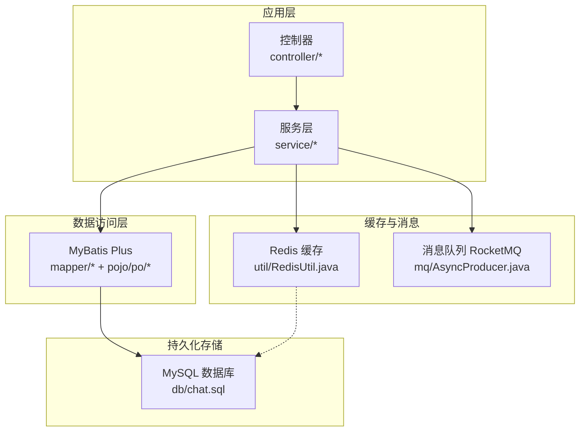
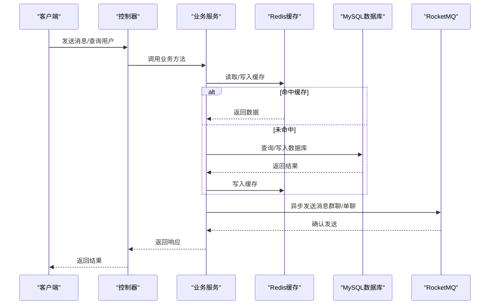
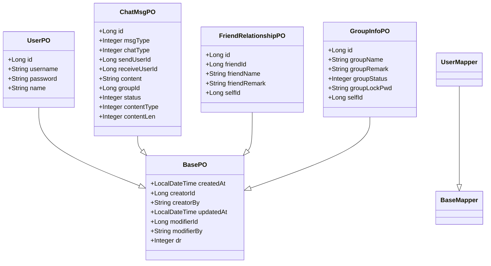
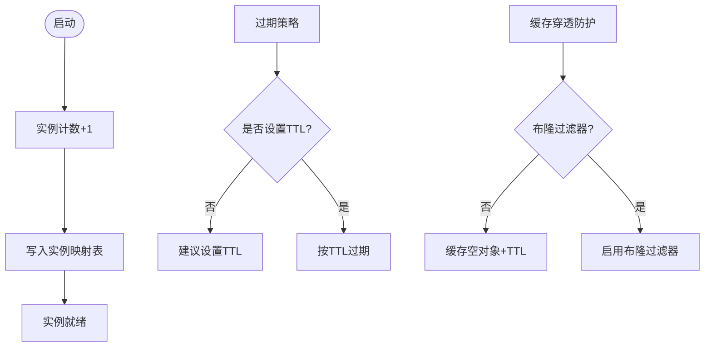
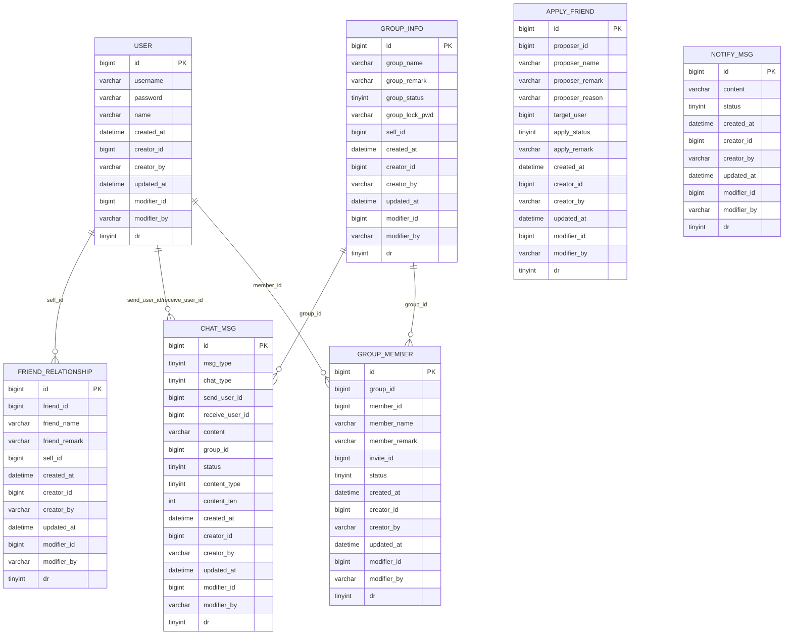
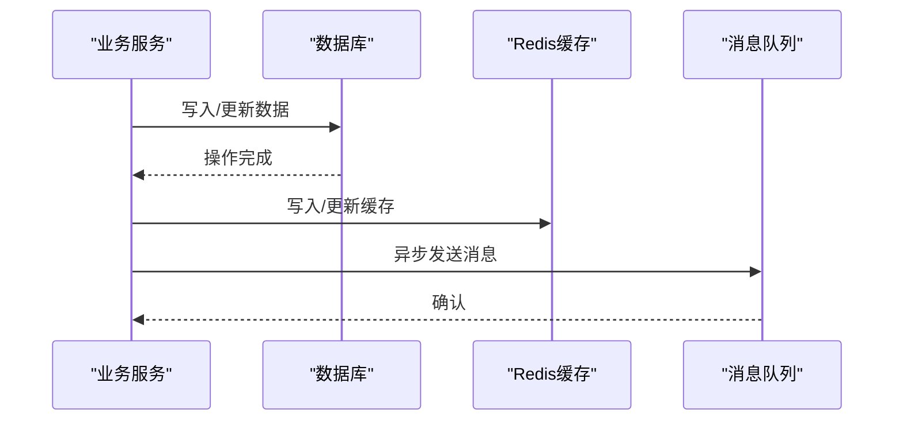
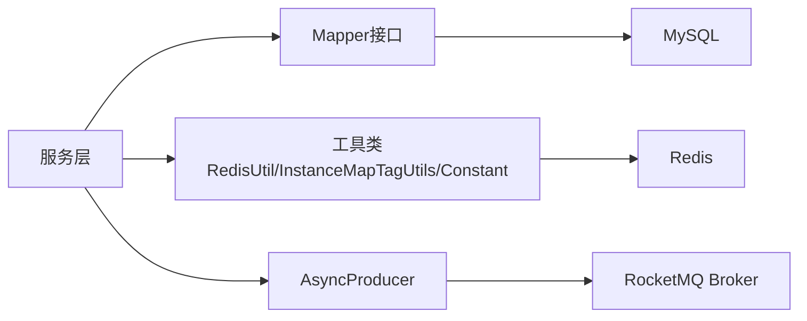

# 数据持久化架构

<cite>
**本文引用的文件**
- [application.yml](file://src/main/resources/application.yml)
- [chat.sql](file://db/chat.sql)
- [BasePO.java](file://src/main/java/com/hch/chat_simple/pojo/po/BasePO.java)
- [UserPO.java](file://src/main/java/com/hch/chat_simple/pojo/po/UserPO.java)
- [ChatMsgPO.java](file://src/main/java/com/hch/chat_simple/pojo/po/ChatMsgPO.java)
- [FriendRelationshipPO.java](file://src/main/java/com/hch/chat_simple/pojo/po/FriendRelationshipPO.java)
- [GroupInfoPO.java](file://src/main/java/com/hch/chat_simple/pojo/po/GroupInfoPO.java)
- [UserMapper.java](file://src/main/java/com/hch/chat_simple/mapper/UserMapper.java)
- [UserMapper.xml](file://src/main/resources/mapper/UserMapper.xml)
- [UserServiceImpl.java](file://src/main/java/com/hch/chat_simple/service/impl/UserServiceImpl.java)
- [ChatMsgServiceImpl.java](file://src/main/java/com/hch/chat_simple/service/impl/ChatMsgServiceImpl.java)
- [AsyncProducer.java](file://src/main/java/com/hch/chat_simple/mq/AsyncProducer.java)
- [RedisUtil.java](file://src/main/java/com/hch/chat_simple/util/RedisUtil.java)
- [InstanceMapTagUtils.java](file://src/main/java/com/hch/chat_simple/util/InstanceMapTagUtils.java)
- [InstanceCreateHook.java](file://src/main/java/com/hch/chat_simple/config/InstanceCreateHook.java)
- [SpringContextListener.java](file://src/main/java/com/hch/chat_simple/listener/SpringContextListener.java)
- [Constant.java](file://src/main/java/com/hch/chat_simple/util/Constant.java)
- [SnowflakeIdGen.java](file://src/main/java/com/hch/chat_simple/util/SnowflakeIdGen.java)
</cite>

## 目录
1. [简介](#简介)
2. [项目结构](#项目结构)
3. [核心组件](#核心组件)
4. [架构总览](#架构总览)
5. [详细组件分析](#详细组件分析)
6. [依赖分析](#依赖分析)
7. [性能考虑](#性能考虑)
8. [故障排查指南](#故障排查指南)
9. [结论](#结论)
10. [附录](#附录)

## 简介
本文件系统性阐述聊天应用的数据持久化架构，覆盖三层存储与多层缓存设计：MySQL关系型数据库、Redis缓存层、RocketMQ消息队列。重点解析MyBatis Plus的ORM映射机制（实体类设计、Mapper接口规范、XML映射组织）、Redis缓存策略与过期控制、MySQL表结构与索引优化、以及跨层一致性保障（缓存更新、数据库写入、消息队列同步）。

## 项目结构
项目采用典型的分层架构：控制器层、服务层、数据访问层（MyBatis Plus）、缓存与消息中间件集成。核心目录与职责如下：
- config：Spring配置与自动装配钩子（实例映射、拦截器、Swagger等）
- controller：对外HTTP接口
- service：业务逻辑与跨表/跨模块协调
- mapper：MyBatis Plus Mapper接口
- pojo：实体、查询、视图对象
- mq：消息生产者与消费者编排
- util：工具类（Redis、雪花ID、常量、实例映射等）
- resources：配置文件、MyBatis XML映射

图表来源
- [application.yml:1-89](file://src/main/resources/application.yml#L1-L89)
- [UserMapper.java:1-22](file://src/main/java/com/hch/chat_simple/mapper/UserMapper.java#L1-L22)
- [UserServiceImpl.java:1-100](file://src/main/java/com/hch/chat_simple/service/impl/UserServiceImpl.java#L1-L100)
- [RedisUtil.java:1-123](file://src/main/java/com/hch/chat_simple/util/RedisUtil.java#L1-L123)
- [AsyncProducer.java:1-63](file://src/main/java/com/hch/chat_simple/mq/AsyncProducer.java#L1-L63)
- [chat.sql:1-130](file://db/chat.sql#L1-L130)

章节来源
- [application.yml:1-89](file://src/main/resources/application.yml#L1-L89)
- [chat.sql:1-130](file://db/chat.sql#L1-L130)

## 核心组件
- MyBatis Plus ORM
  - 实体基类：统一审计字段与逻辑删除
  - 实体类：用户、消息、关系、群组等
  - Mapper接口：继承BaseMapper，零SQL起步
  - XML映射：按需扩展复杂SQL
- Redis缓存
  - 统一工具类封装常用操作
  - 实例映射与实例计数维护
- RocketMQ消息
  - 异步生产者封装，按标签路由
- 业务服务
  - 用户搜索、消息发送、群成员查询等
- 基础设施
  - 雪花ID生成器、常量定义、实例映射工具

章节来源
- [BasePO.java:1-44](file://src/main/java/com/hch/chat_simple/pojo/po/BasePO.java#L1-L44)
- [UserPO.java:1-47](file://src/main/java/com/hch/chat_simple/pojo/po/UserPO.java#L1-L47)
- [ChatMsgPO.java:1-54](file://src/main/java/com/hch/chat_simple/pojo/po/ChatMsgPO.java#L1-L54)
- [FriendRelationshipPO.java:1-45](file://src/main/java/com/hch/chat_simple/pojo/po/FriendRelationshipPO.java#L1-L45)
- [GroupInfoPO.java:1-50](file://src/main/java/com/hch/chat_simple/pojo/po/GroupInfoPO.java#L1-L50)
- [UserMapper.java:1-22](file://src/main/java/com/hch/chat_simple/mapper/UserMapper.java#L1-L22)
- [UserMapper.xml:1-6](file://src/main/resources/mapper/UserMapper.xml#L1-L6)
- [UserServiceImpl.java:1-100](file://src/main/java/com/hch/chat_simple/service/impl/UserServiceImpl.java#L1-L100)
- [ChatMsgServiceImpl.java:1-184](file://src/main/java/com/hch/chat_simple/service/impl/ChatMsgServiceImpl.java#L1-L184)
- [AsyncProducer.java:1-63](file://src/main/java/com/hch/chat_simple/mq/AsyncProducer.java#L1-L63)
- [RedisUtil.java:1-123](file://src/main/java/com/hch/chat_simple/util/RedisUtil.java#L1-L123)
- [InstanceMapTagUtils.java:1-55](file://src/main/java/com/hch/chat_simple/util/InstanceMapTagUtils.java#L1-L55)
- [InstanceCreateHook.java:1-72](file://src/main/java/com/hch/chat_simple/config/InstanceCreateHook.java#L1-L72)
- [Constant.java:1-33](file://src/main/java/com/hch/chat_simple/util/Constant.java#L1-L33)
- [SnowflakeIdGen.java:1-118](file://src/main/java/com/hch/chat_simple/util/SnowflakeIdGen.java#L1-L118)

## 架构总览
数据流从应用层进入，优先读取Redis缓存；未命中或需要强一致场景则访问MySQL；消息类业务通过RocketMQ异步分发至下游实例或客户端。实例映射通过Redis维护，结合标签路由实现多实例负载均衡。

图表来源
- [ChatMsgServiceImpl.java:98-144](file://src/main/java/com/hch/chat_simple/service/impl/ChatMsgServiceImpl.java#L98-L144)
- [UserServiceImpl.java:43-80](file://src/main/java/com/hch/chat_simple/service/impl/UserServiceImpl.java#L43-L80)
- [RedisUtil.java:53-84](file://src/main/java/com/hch/chat_simple/util/RedisUtil.java#L53-L84)
- [AsyncProducer.java:40-59](file://src/main/java/com/hch/chat_simple/mq/AsyncProducer.java#L40-L59)

## 详细组件分析

### MyBatis Plus ORM 映射机制
- 实体类设计
  - 审计字段与逻辑删除：统一由基类提供createdAt/updatedAt/creator*/modifier*与dr字段，减少重复代码
  - 表名映射：通过注解绑定物理表
  - 主键策略：自增主键
- Mapper接口规范
  - 继承BaseMapper，天然具备CRUD能力
  - 复杂条件查询使用Lambda/Wrapper
- SQL映射文件组织
  - XML位于classpath:/mapper/**，按Mapper命名空间组织
  - 当前UserMapper.xml为空，表示使用注解与BaseMapper即可满足需求

图表来源
- [BasePO.java:14-42](file://src/main/java/com/hch/chat_simple/pojo/po/BasePO.java#L14-L42)
- [UserPO.java:25-41](file://src/main/java/com/hch/chat_simple/pojo/po/UserPO.java#L25-L41)
- [ChatMsgPO.java:18-51](file://src/main/java/com/hch/chat_simple/pojo/po/ChatMsgPO.java#L18-L51)
- [FriendRelationshipPO.java:25-42](file://src/main/java/com/hch/chat_simple/pojo/po/FriendRelationshipPO.java#L25-L42)
- [GroupInfoPO.java:27-47](file://src/main/java/com/hch/chat_simple/pojo/po/GroupInfoPO.java#L27-L47)
- [UserMapper.java:18-19](file://src/main/java/com/hch/chat_simple/mapper/UserMapper.java#L18-L19)

章节来源
- [BasePO.java:1-44](file://src/main/java/com/hch/chat_simple/pojo/po/BasePO.java#L1-L44)
- [UserPO.java:1-47](file://src/main/java/com/hch/chat_simple/pojo/po/UserPO.java#L1-L47)
- [ChatMsgPO.java:1-54](file://src/main/java/com/hch/chat_simple/pojo/po/ChatMsgPO.java#L1-L54)
- [FriendRelationshipPO.java:1-45](file://src/main/java/com/hch/chat_simple/pojo/po/FriendRelationshipPO.java#L1-L45)
- [GroupInfoPO.java:1-50](file://src/main/java/com/hch/chat_simple/pojo/po/GroupInfoPO.java#L1-L50)
- [UserMapper.java:1-22](file://src/main/java/com/hch/chat_simple/mapper/UserMapper.java#L1-L22)
- [UserMapper.xml:1-6](file://src/main/resources/mapper/UserMapper.xml#L1-L6)

### Redis缓存层设计
- 缓存策略
  - 读多写少场景优先读缓存，写后同步更新
  - 使用String/Hash结构存储键值与映射
- 过期时间设置
  - 当前代码未显式设置TTL，建议对热点数据设置合理过期时间
- 缓存穿透防护
  - 可引入布隆过滤器或缓存空对象（带过期时间）以避免恶意/异常查询击穿
- 实例映射与实例计数
  - 启动时通过Bean注册实例映射与计数，关闭时清理
  - 提供取模函数将用户ID映射到具体实例标签

图表来源
- [InstanceCreateHook.java:56-70](file://src/main/java/com/hch/chat_simple/config/InstanceCreateHook.java#L56-L70)
- [SpringContextListener.java:30-41](file://src/main/java/com/hch/chat_simple/listener/SpringContextListener.java#L30-L41)
- [RedisUtil.java:45-51](file://src/main/java/com/hch/chat_simple/util/RedisUtil.java#L45-L51)
- [InstanceMapTagUtils.java:32-47](file://src/main/java/com/hch/chat_simple/util/InstanceMapTagUtils.java#L32-L47)

章节来源
- [RedisUtil.java:1-123](file://src/main/java/com/hch/chat_simple/util/RedisUtil.java#L1-L123)
- [InstanceCreateHook.java:1-72](file://src/main/java/com/hch/chat_simple/config/InstanceCreateHook.java#L1-L72)
- [SpringContextListener.java:1-52](file://src/main/java/com/hch/chat_simple/listener/SpringContextListener.java#L1-L52)
- [InstanceMapTagUtils.java:1-55](file://src/main/java/com/hch/chat_simple/util/InstanceMapTagUtils.java#L1-L55)

### MySQL数据库设计
- 表结构设计
  - user：用户基本信息
  - friend_relationship：好友关系
  - chat_msg：聊天消息（含单聊/群聊、状态、内容类型、长度）
  - group_info：群组信息
  - group_member：群成员
  - apply_friend：好友申请
  - notify_msg：通知消息
- 索引优化建议
  - 唯一索引：username（用户）
  - 复合索引：chat_msg(send_user_id/receive_user_id/group_id/status)、group_member(group_id/member_id/status)
  - 范围/等值查询常用字段建立索引，避免全表扫描
- 事务处理
  - 关键写入操作使用Spring声明式事务，确保一致性
  - 批量更新（如消息状态批量修改）使用批处理提升性能

图表来源
- [chat.sql:5-130](file://db/chat.sql#L5-L130)

章节来源
- [chat.sql:1-130](file://db/chat.sql#L1-L130)

### 数据一致性保障机制
- 缓存更新策略
  - 写入数据库后同步更新缓存，避免脏读
  - 删除/更新操作先删缓存再写库，或写库后失效缓存
- 数据库写入
  - 使用MyBatis Plus ServiceImpl.save/update，支持批量更新
- 消息队列同步
  - 单聊/群聊消息先入库，再异步投递MQ，消费端确认后更新状态
  - 实例标签路由：根据用户ID取模选择实例，实现多实例负载

图表来源
- [ChatMsgServiceImpl.java:107-143](file://src/main/java/com/hch/chat_simple/service/impl/ChatMsgServiceImpl.java#L107-L143)
- [UserServiceImpl.java:91-96](file://src/main/java/com/hch/chat_simple/service/impl/UserServiceImpl.java#L91-L96)
- [RedisUtil.java:53-84](file://src/main/java/com/hch/chat_simple/util/RedisUtil.java#L53-L84)
- [AsyncProducer.java:40-59](file://src/main/java/com/hch/chat_simple/mq/AsyncProducer.java#L40-L59)

章节来源
- [ChatMsgServiceImpl.java:1-184](file://src/main/java/com/hch/chat_simple/service/impl/ChatMsgServiceImpl.java#L1-L184)
- [UserServiceImpl.java:1-100](file://src/main/java/com/hch/chat_simple/service/impl/UserServiceImpl.java#L1-L100)
- [RedisUtil.java:1-123](file://src/main/java/com/hch/chat_simple/util/RedisUtil.java#L1-L123)
- [AsyncProducer.java:1-63](file://src/main/java/com/hch/chat_simple/mq/AsyncProducer.java#L1-L63)

## 依赖分析
- 组件耦合
  - 服务层依赖Mapper与工具类，低耦合高内聚
  - Redis与MQ作为横切关注点，通过工具类/配置集中管理
- 外部依赖
  - Spring Boot、MyBatis Plus、RocketMQ、Redis、MySQL

图表来源
- [UserServiceImpl.java:37-97](file://src/main/java/com/hch/chat_simple/service/impl/UserServiceImpl.java#L37-L97)
- [ChatMsgServiceImpl.java:54-143](file://src/main/java/com/hch/chat_simple/service/impl/ChatMsgServiceImpl.java#L54-L143)
- [RedisUtil.java:19-26](file://src/main/java/com/hch/chat_simple/util/RedisUtil.java#L19-L26)
- [AsyncProducer.java:17-20](file://src/main/java/com/hch/chat_simple/mq/AsyncProducer.java#L17-L20)

章节来源
- [UserServiceImpl.java:1-100](file://src/main/java/com/hch/chat_simple/service/impl/UserServiceImpl.java#L1-L100)
- [ChatMsgServiceImpl.java:1-184](file://src/main/java/com/hch/chat_simple/service/impl/ChatMsgServiceImpl.java#L1-L184)
- [RedisUtil.java:1-123](file://src/main/java/com/hch/chat_simple/util/RedisUtil.java#L1-L123)
- [AsyncProducer.java:1-63](file://src/main/java/com/hch/chat_simple/mq/AsyncProducer.java#L1-L63)

## 性能考虑
- MyBatis Plus
  - 使用BaseMapper减少XML维护成本；复杂SQL可选XML优化
  - 批量插入/更新使用批处理，避免逐条提交
- Redis
  - 对热点数据设置TTL，避免内存膨胀
  - 使用Pipeline/事务减少RTT
- MySQL
  - 为高频查询字段建立复合索引
  - 分页查询配合LIMIT，避免深分页
- RocketMQ
  - 合理设置分区数与消费者并发度
  - 消息幂等与去重，避免重复消费

## 故障排查指南
- Redis相关
  - 检查连接池配置与超时参数
  - 关注空值与过期策略导致的缓存穿透
- MySQL相关
  - 慢查询日志定位索引缺失
  - 事务冲突与死锁排查
- RocketMQ相关
  - 生产/消费异常日志与重试策略
  - 消息堆积监控与扩容

章节来源
- [application.yml:1-89](file://src/main/resources/application.yml#L1-L89)
- [RedisUtil.java:29-51](file://src/main/java/com/hch/chat_simple/util/RedisUtil.java#L29-L51)
- [AsyncProducer.java:44-58](file://src/main/java/com/hch/chat_simple/mq/AsyncProducer.java#L44-L58)

## 结论
本架构以MyBatis Plus为核心，结合Redis缓存与RocketMQ异步消息，形成“缓存优先、数据库兜底、消息异步”的数据持久化体系。通过统一的实体基类与Mapper规范，降低重复代码；通过实例映射与标签路由，支撑多实例部署与水平扩展。建议后续补充缓存TTL与布隆过滤器、完善索引与慢查询治理、强化消息幂等与监控告警，进一步提升稳定性与性能。

## 附录
- 配置要点
  - MyBatis Plus：逻辑删除字段、XML扫描路径
  - Redis：连接池、超时、Redisson配置
  - RocketMQ：NameServer地址、生产者/消费者组、Topic与Tag
- 常用工具
  - 雪花ID生成器：分布式唯一ID
  - 常量定义：消息状态、聊天类型、群组状态等

章节来源
- [application.yml:24-51](file://src/main/resources/application.yml#L24-L51)
- [Constant.java:1-33](file://src/main/java/com/hch/chat_simple/util/Constant.java#L1-L33)
- [SnowflakeIdGen.java:1-118](file://src/main/java/com/hch/chat_simple/util/SnowflakeIdGen.java#L1-L118)