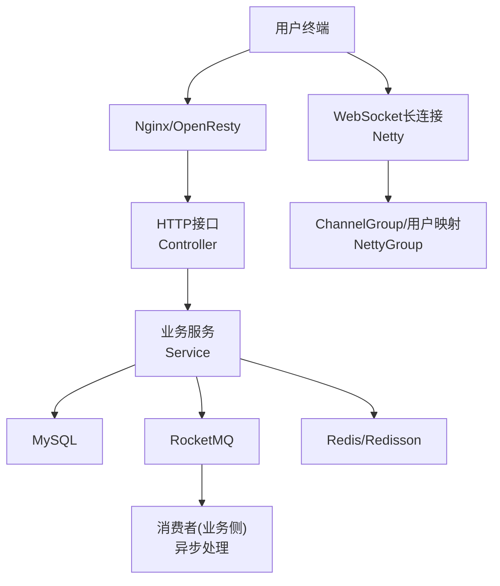
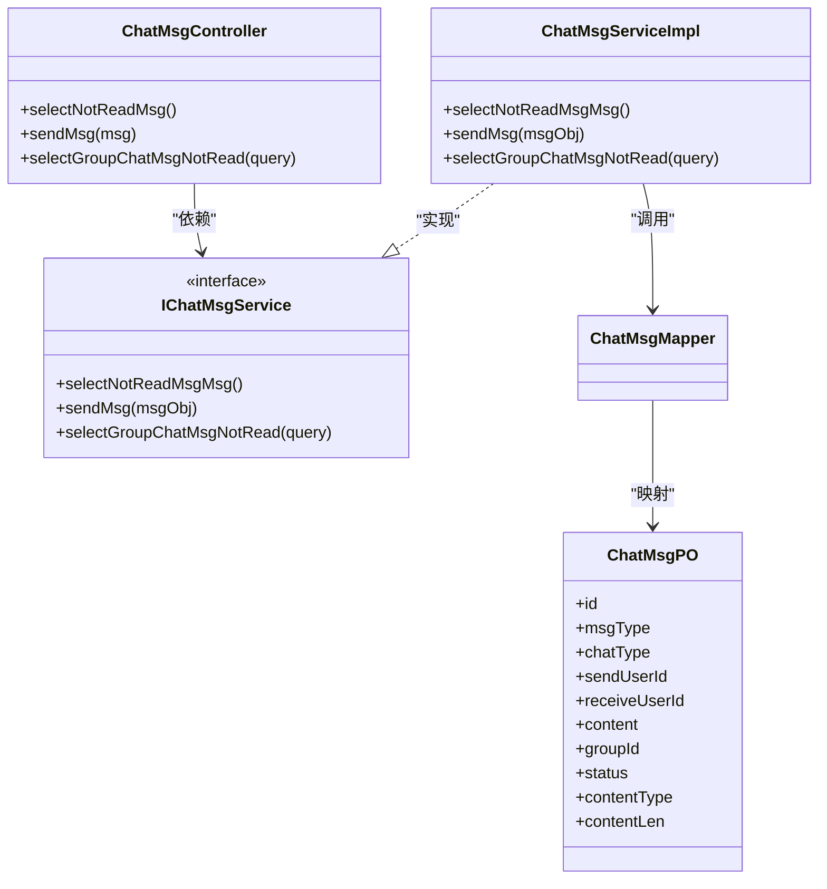
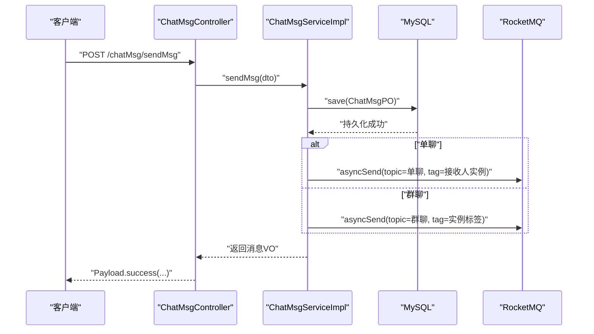
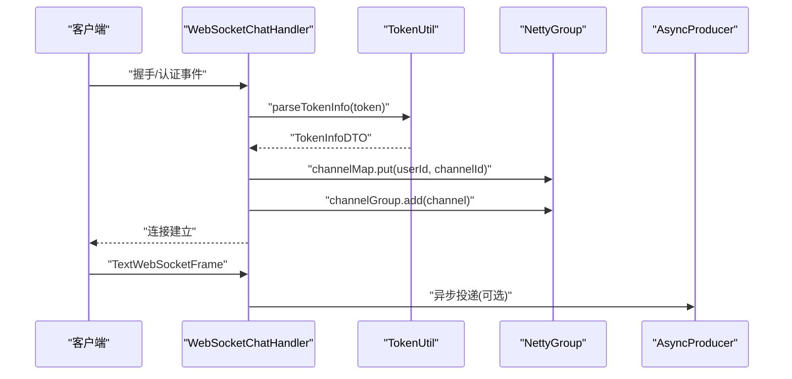
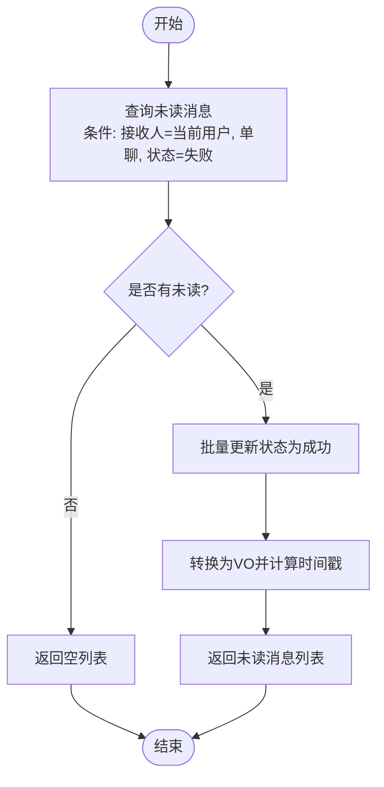
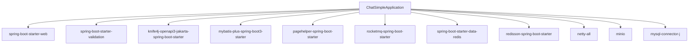

# 整体架构概览

<cite>
**本文档引用的文件**
- [ChatSimpleApplication.java](file://src/main/java/com/hch/chat_simple/ChatSimpleApplication.java)
- [pom.xml](file://pom.xml)
- [application.yml](file://src/main/resources/application.yml)
- [WebMvcConfig.java](file://src/main/java/com/hch/chat_simple/config/WebMvcConfig.java)
- [CrossInterceptorHandler.java](file://src/main/java/com/hch/chat_simple/config/CrossInterceptorHandler.java)
- [LoginInterceptor.java](file://src/main/java/com/hch/chat_simple/config/LoginInterceptor.java)
- [ExceptionAspectHandler.java](file://src/main/java/com/hch/chat_simple/config/ExceptionAspectHandler.java)
- [NettyGroup.java](file://src/main/java/com/hch/chat_simple/config/NettyGroup.java)
- [MqProducerConfig.java](file://src/main/java/com/hch/chat_simple/mq/MqProducerConfig.java)
- [WebSocketChatHandler.java](file://src/main/java/com/hch/chat_simple/handler/WebSocketChatHandler.java)
- [ChatMsgController.java](file://src/main/java/com/hch/chat_simple/controller/ChatMsgController.java)
- [IChatMsgService.java](file://src/main/java/com/hch/chat_simple/service/IChatMsgService.java)
- [ChatMsgServiceImpl.java](file://src/main/java/com/hch/chat_simple/service/impl/ChatMsgServiceImpl.java)
- [ChatMsgMapper.java](file://src/main/java/com/hch/chat_simple/mapper/ChatMsgMapper.java)
- [ChatMsgPO.java](file://src/main/java/com/hch/chat_simple/pojo/po/ChatMsgPO.java)
</cite>

## 目录
1. [引言](#引言)
2. [项目结构](#项目结构)
3. [核心组件](#核心组件)
4. [架构总览](#架构总览)
5. [详细组件分析](#详细组件分析)
6. [依赖分析](#依赖分析)
7. [性能考虑](#性能考虑)
8. [故障排查指南](#故障排查指南)
9. [结论](#结论)

## 引言
本项目是一个基于Spring Boot的聊天应用，采用分层架构设计，包含表现层（Controller）、业务层（Service）、数据访问层（Mapper），并通过消息队列（RocketMQ）实现异步解耦与扩展性，通过Netty提供WebSocket长连接能力，结合Redis/Redisson实现高性能缓存与分布式能力。系统通过拦截器与全局异常处理保障安全与稳定性，并通过Swagger Knife4j提供接口文档。

## 项目结构
项目采用标准的Spring Boot多模块分层组织方式：
- 表现层：controller包，负责HTTP接口暴露与参数校验
- 业务层：service与service/impl，封装业务逻辑与事务控制
- 数据访问层：mapper与mapper/xml，MyBatis Plus映射数据库
- 实体模型：pojo/po定义持久化对象，vo/dto用于接口传输
- 配置与基础设施：config包承载Web配置、拦截器、MQ配置、Netty共享资源等
- 消息中间件：mq包封装生产者配置与消费者组合
- 通信与网关：handler包承载WebSocket处理器；openresty_nginx_conf提供反向代理示例
- 工具类：util包提供通用工具（Token、Redis、雪花ID、分页等）

```mermaid
graph TB
subgraph "表现层"
C1["ChatMsgController"]
end
subgraph "业务层"
S1["IChatMsgService"]
S2["ChatMsgServiceImpl"]
end
subgraph "数据访问层"
M1["ChatMsgMapper"]
PO["ChatMsgPO"]
end
subgraph "基础设施"
CFG1["WebMvcConfig"]
CFG2["CrossInterceptorHandler"]
CFG3["LoginInterceptor"]
CFG4["ExceptionAspectHandler"]
CFG5["MqProducerConfig"]
CFG6["NettyGroup"]
CFG7["WebSocketChatHandler"]
end
subgraph "外部系统"
DB["MySQL"]
MQ["RocketMQ"]
RS["Redis/Redisson"]
NG["OpenResty/Nginx"]
end
C1 --> S1
S1 < --> S2
S2 --> M1
M1 --> DB
S2 --> MQ
S2 --> RS
C1 --> CFG1
CFG1 --> CFG2
CFG1 --> CFG3
CFG3 --> CFG4
CFG5 --> MQ
CFG6 --> CFG7
NG --> C1
```

图表来源
- [ChatMsgController.java:31-57](file://src/main/java/com/hch/chat_simple/controller/ChatMsgController.java#L31-L57)
- [IChatMsgService.java:20-27](file://src/main/java/com/hch/chat_simple/service/IChatMsgService.java#L20-L27)
- [ChatMsgServiceImpl.java:55-183](file://src/main/java/com/hch/chat_simple/service/impl/ChatMsgServiceImpl.java#L55-L183)
- [ChatMsgMapper.java:17-20](file://src/main/java/com/hch/chat_simple/mapper/ChatMsgMapper.java#L17-L20)
- [ChatMsgPO.java:18-53](file://src/main/java/com/hch/chat_simple/pojo/po/ChatMsgPO.java#L18-L53)
- [WebMvcConfig.java:8-27](file://src/main/java/com/hch/chat_simple/config/WebMvcConfig.java#L8-L27)
- [CrossInterceptorHandler.java:8-27](file://src/main/java/com/hch/chat_simple/config/CrossInterceptorHandler.java#L8-L27)
- [LoginInterceptor.java:28-108](file://src/main/java/com/hch/chat_simple/config/LoginInterceptor.java#L28-L108)
- [ExceptionAspectHandler.java:12-23](file://src/main/java/com/hch/chat_simple/config/ExceptionAspectHandler.java#L12-L23)
- [MqProducerConfig.java:12-30](file://src/main/java/com/hch/chat_simple/mq/MqProducerConfig.java#L12-L30)
- [NettyGroup.java:11-29](file://src/main/java/com/hch/chat_simple/config/NettyGroup.java#L11-L29)
- [WebSocketChatHandler.java:48-195](file://src/main/java/com/hch/chat_simple/handler/WebSocketChatHandler.java#L48-L195)

章节来源
- [ChatSimpleApplication.java:16-24](file://src/main/java/com/hch/chat_simple/ChatSimpleApplication.java#L16-L24)
- [pom.xml:34-346](file://pom.xml#L34-L346)
- [application.yml:1-89](file://src/main/resources/application.yml#L1-L89)

## 核心组件
- 应用入口与自动配置
  - 启动类注册分页方言与Knife4j增强，启用Spring Boot自动装配
- Web与安全
  - WebMvcConfig注册跨域与登录拦截器，统一资源映射
  - CrossInterceptorHandler处理CORS，LoginInterceptor校验JWT并注入上下文，ExceptionAspectHandler集中处理Token过期等异常
- 业务核心
  - ChatMsgController提供消息发送、未读拉取、群聊未读查询接口
  - IChatMsgService定义业务契约，ChatMsgServiceImpl实现具体逻辑（持久化、异步发送、状态回写）
- 数据访问
  - ChatMsgMapper继承MyBatis Plus基础接口，ChatMsgPO映射chat_msg表
- 消息与实时通信
  - MqProducerConfig创建RocketMQ生产者
  - NettyGroup维护在线用户与ChannelGroup
  - WebSocketChatHandler处理握手、鉴权、消息落库与异步投递

章节来源
- [ChatSimpleApplication.java:16-24](file://src/main/java/com/hch/chat_simple/ChatSimpleApplication.java#L16-L24)
- [WebMvcConfig.java:8-27](file://src/main/java/com/hch/chat_simple/config/WebMvcConfig.java#L8-L27)
- [CrossInterceptorHandler.java:8-27](file://src/main/java/com/hch/chat_simple/config/CrossInterceptorHandler.java#L8-L27)
- [LoginInterceptor.java:28-108](file://src/main/java/com/hch/chat_simple/config/LoginInterceptor.java#L28-L108)
- [ExceptionAspectHandler.java:12-23](file://src/main/java/com/hch/chat_simple/config/ExceptionAspectHandler.java#L12-L23)
- [ChatMsgController.java:31-57](file://src/main/java/com/hch/chat_simple/controller/ChatMsgController.java#L31-L57)
- [IChatMsgService.java:20-27](file://src/main/java/com/hch/chat_simple/service/IChatMsgService.java#L20-L27)
- [ChatMsgServiceImpl.java:55-183](file://src/main/java/com/hch/chat_simple/service/impl/ChatMsgServiceImpl.java#L55-L183)
- [ChatMsgMapper.java:17-20](file://src/main/java/com/hch/chat_simple/mapper/ChatMsgMapper.java#L17-L20)
- [ChatMsgPO.java:18-53](file://src/main/java/com/hch/chat_simple/pojo/po/ChatMsgPO.java#L18-L53)
- [MqProducerConfig.java:12-30](file://src/main/java/com/hch/chat_simple/mq/MqProducerConfig.java#L12-L30)
- [NettyGroup.java:11-29](file://src/main/java/com/hch/chat_simple/config/NettyGroup.java#L11-L29)
- [WebSocketChatHandler.java:48-195](file://src/main/java/com/hch/chat_simple/handler/WebSocketChatHandler.java#L48-L195)

## 架构总览
系统采用“HTTP + WebSocket + RocketMQ”的混合架构：
- HTTP接口由Controller接收，经Service完成业务处理，持久化至MySQL
- WebSocket通过Netty提供长连接，用户上线加入ChannelGroup，离线清理
- RocketMQ异步解耦消息发送，支持单聊按接收人路由、群聊按实例标签广播
- Redis/Redisson用于缓存与分布式能力，配合分页插件与MyBatis Plus提升性能



图表来源
- [application.yml:16-89](file://src/main/resources/application.yml#L16-L89)
- [WebSocketChatHandler.java:48-195](file://src/main/java/com/hch/chat_simple/handler/WebSocketChatHandler.java#L48-L195)
- [NettyGroup.java:11-29](file://src/main/java/com/hch/chat_simple/config/NettyGroup.java#L11-L29)
- [ChatMsgServiceImpl.java:55-183](file://src/main/java/com/hch/chat_simple/service/impl/ChatMsgServiceImpl.java#L55-L183)
- [MqProducerConfig.java:12-30](file://src/main/java/com/hch/chat_simple/mq/MqProducerConfig.java#L12-L30)

## 详细组件分析

### 分层架构与职责
- 表现层（Controller）
  - ChatMsgController提供消息发送、未读拉取、群聊未读查询接口，统一返回Payload包装
- 业务层（Service）
  - IChatMsgService定义业务契约，ChatMsgServiceImpl实现消息持久化、状态标记、异步投递与结果转换
- 数据访问层（Mapper/PO）
  - ChatMsgMapper基于MyBatis Plus，ChatMsgPO映射chat_msg表，含逻辑删除字段与常用业务字段



图表来源
- [ChatMsgController.java:31-57](file://src/main/java/com/hch/chat_simple/controller/ChatMsgController.java#L31-L57)
- [IChatMsgService.java:20-27](file://src/main/java/com/hch/chat_simple/service/IChatMsgService.java#L20-L27)
- [ChatMsgServiceImpl.java:55-183](file://src/main/java/com/hch/chat_simple/service/impl/ChatMsgServiceImpl.java#L55-L183)
- [ChatMsgMapper.java:17-20](file://src/main/java/com/hch/chat_simple/mapper/ChatMsgMapper.java#L17-L20)
- [ChatMsgPO.java:18-53](file://src/main/java/com/hch/chat_simple/pojo/po/ChatMsgPO.java#L18-L53)

章节来源
- [ChatMsgController.java:31-57](file://src/main/java/com/hch/chat_simple/controller/ChatMsgController.java#L31-L57)
- [IChatMsgService.java:20-27](file://src/main/java/com/hch/chat_simple/service/IChatMsgService.java#L20-L27)
- [ChatMsgServiceImpl.java:55-183](file://src/main/java/com/hch/chat_simple/service/impl/ChatMsgServiceImpl.java#L55-L183)
- [ChatMsgMapper.java:17-20](file://src/main/java/com/hch/chat_simple/mapper/ChatMsgMapper.java#L17-L20)
- [ChatMsgPO.java:18-53](file://src/main/java/com/hch/chat_simple/pojo/po/ChatMsgPO.java#L18-L53)

### 消息发送流程（同步落库 + 异步投递）
消息从HTTP接口进入，先持久化，再根据消息类型选择单聊或群聊路径，通过RocketMQ异步投递，最终由消费者完成下游处理。



图表来源
- [ChatMsgController.java:45-49](file://src/main/java/com/hch/chat_simple/controller/ChatMsgController.java#L45-L49)
- [ChatMsgServiceImpl.java:98-144](file://src/main/java/com/hch/chat_simple/service/impl/ChatMsgServiceImpl.java#L98-L144)
- [application.yml:48-51](file://src/main/resources/application.yml#L48-L51)

章节来源
- [ChatMsgController.java:31-57](file://src/main/java/com/hch/chat_simple/controller/ChatMsgController.java#L31-L57)
- [ChatMsgServiceImpl.java:55-183](file://src/main/java/com/hch/chat_simple/service/impl/ChatMsgServiceImpl.java#L55-L183)

### WebSocket连接与鉴权流程
用户通过WebSocket接入，握手完成后在userEventTriggered中进行鉴权，成功后加入ChannelGroup并维护用户到Channel的映射，超时或断开时清理。



图表来源
- [WebSocketChatHandler.java:118-162](file://src/main/java/com/hch/chat_simple/handler/WebSocketChatHandler.java#L118-L162)
- [NettyGroup.java:11-29](file://src/main/java/com/hch/chat_simple/config/NettyGroup.java#L11-L29)
- [application.yml:48-51](file://src/main/resources/application.yml#L48-L51)

章节来源
- [WebSocketChatHandler.java:48-195](file://src/main/java/com/hch/chat_simple/handler/WebSocketChatHandler.java#L48-L195)
- [NettyGroup.java:11-29](file://src/main/java/com/hch/chat_simple/config/NettyGroup.java#L11-L29)

### 未读消息拉取流程
用户登录后可拉取未读消息，服务端查询未读记录并批量更新状态，避免重复拉取。



图表来源
- [ChatMsgServiceImpl.java:71-95](file://src/main/java/com/hch/chat_simple/service/impl/ChatMsgServiceImpl.java#L71-L95)

章节来源
- [ChatMsgServiceImpl.java:71-95](file://src/main/java/com/hch/chat_simple/service/impl/ChatMsgServiceImpl.java#L71-L95)

## 依赖分析
- 技术栈与版本
  - Spring Boot 3.3.6，MyBatis Plus 3.5.7，PageHelper 2.1.0，RocketMQ 5.0.0，Netty 4.1.69，Redisson 3.23.5，Knife4j 4.4.0
- 关键依赖关系
  - Web启动与拦截器：spring-boot-starter-web、validation、knife4j
  - ORM与分页：mybatis-plus-spring-boot3-starter、pagehelper-spring-boot-starter
  - MQ：rocketmq-spring-boot-starter + rocketmq-client/acl/common/remoting
  - 缓存：spring-boot-starter-data-redis + redisson-spring-boot-starter
  - 其他：mysql-connector-j、netty-all、minio、fastjson、guava、lombok、transmittable-thread-local



图表来源
- [pom.xml:54-326](file://pom.xml#L54-L326)

章节来源
- [pom.xml:29-346](file://pom.xml#L29-L346)

## 性能考虑
- 异步解耦：消息发送先落库，再通过RocketMQ异步投递，降低请求延迟
- 批量更新：未读消息拉取后批量更新状态，减少重复查询
- 分页与逻辑删除：MyBatis Plus逻辑删除与PageHelper合理使用，避免全表扫描
- 缓存与连接池：Redisson连接池配置、Netty线程池固定大小，避免资源耗尽
- 网关与限流：建议在Nginx/OpenResty层增加限流与健康检查

## 故障排查指南
- 认证失败/Token过期
  - 登录拦截器对JWT进行解析与过期判断，过期时生成新Token并通过全局异常切面返回
- CORS问题
  - 跨域拦截器统一设置响应头，确保前端域名与凭证配置正确
- WebSocket断连
  - Netty空闲事件触发时清理用户映射与ChannelGroup，需检查心跳与实例扩容策略
- MQ投递异常
  - 生产者配置需确认NameServer地址与Topic配置，消费者组与标签需与生产者一致

章节来源
- [LoginInterceptor.java:44-82](file://src/main/java/com/hch/chat_simple/config/LoginInterceptor.java#L44-L82)
- [ExceptionAspectHandler.java:16-20](file://src/main/java/com/hch/chat_simple/config/ExceptionAspectHandler.java#L16-L20)
- [CrossInterceptorHandler.java:14-24](file://src/main/java/com/hch/chat_simple/config/CrossInterceptorHandler.java#L14-L24)
- [WebSocketChatHandler.java:155-161](file://src/main/java/com/hch/chat_simple/handler/WebSocketChatHandler.java#L155-L161)
- [MqProducerConfig.java:22-28](file://src/main/java/com/hch/chat_simple/mq/MqProducerConfig.java#L22-L28)
- [application.yml:39-51](file://src/main/resources/application.yml#L39-L51)

## 结论
本项目以Spring Boot为核心，结合MyBatis Plus、RocketMQ、Netty与Redis/Redisson，构建了高内聚、低耦合的分层架构。通过HTTP接口与WebSocket双通道满足即时通讯需求，借助消息队列实现异步解耦与水平扩展，具备良好的可维护性与可扩展性。建议在生产环境中完善网关限流、监控告警与灰度发布策略，持续优化消息路由与缓存命中率。