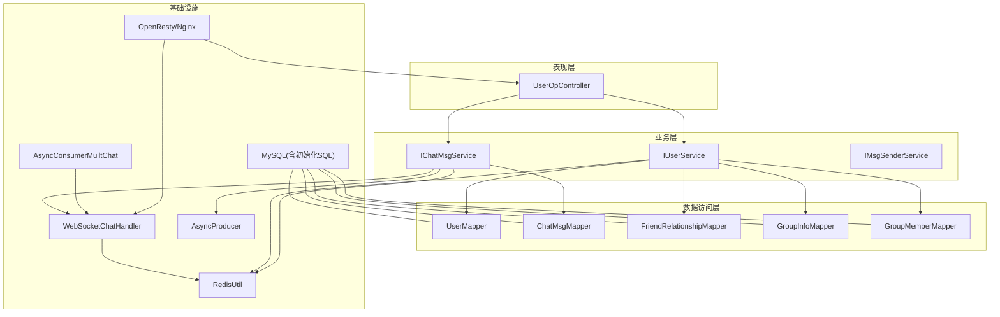
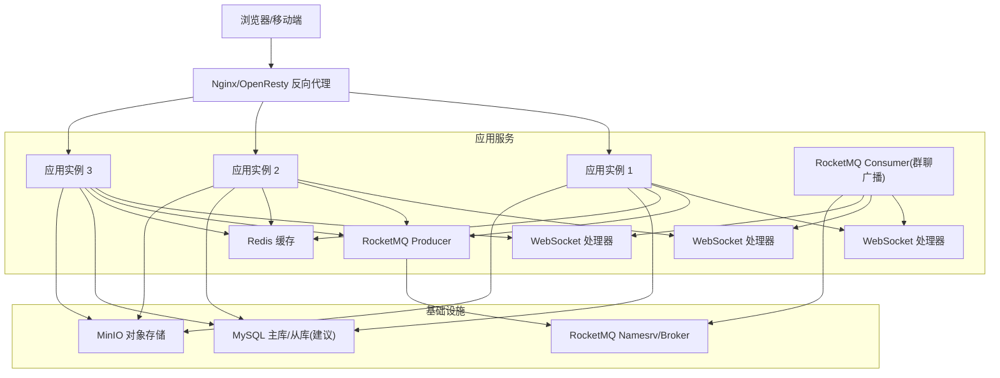
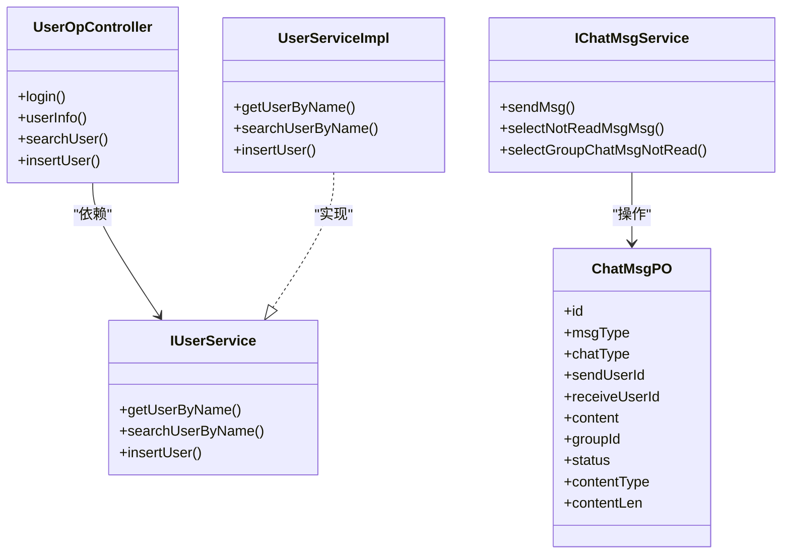
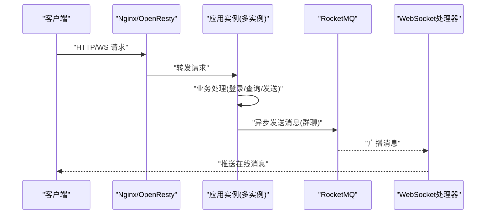
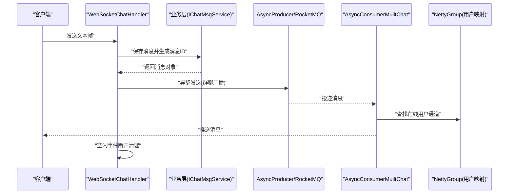
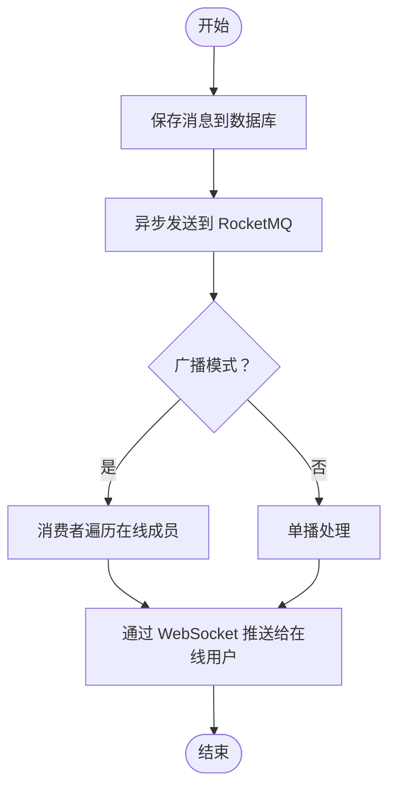
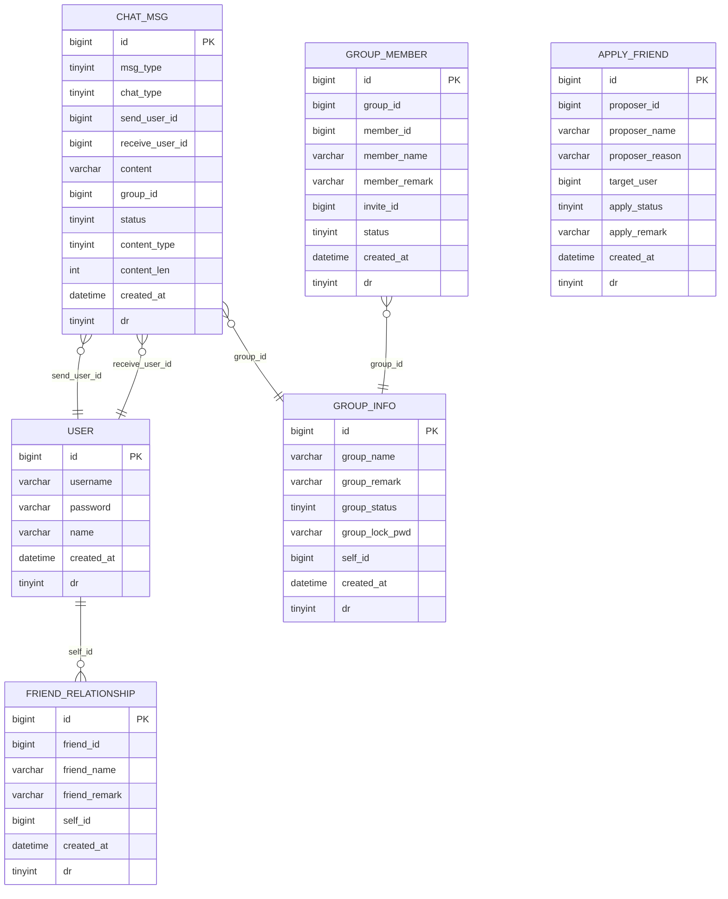
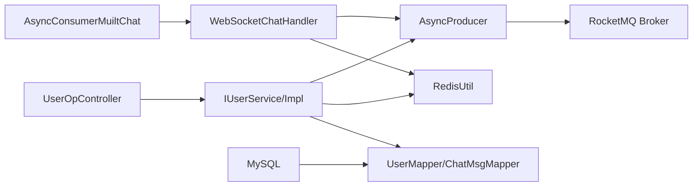

# 架构设计

<cite>
**本文引用的文件**
- [ChatSimpleApplication.java](file://src/main/java/com/hch/chat_simple/ChatSimpleApplication.java)
- [application.yml](file://src/main/resources/application.yml)
- [pom.xml](file://pom.xml)
- [WebMvcConfig.java](file://src/main/java/com/hch/chat_simple/config/WebMvcConfig.java)
- [NettyGroup.java](file://src/main/java/com/hch/chat_simple/config/NettyGroup.java)
- [WebSocketChatHandler.java](file://src/main/java/com/hch/chat_simple/handler/WebSocketChatHandler.java)
- [AsyncProducer.java](file://src/main/java/com/hch/chat_simple/mq/AsyncProducer.java)
- [AsyncConsumerMuiltChat.java](file://src/main/java/com/hch/chat_simple/mq/AsyncConsumerMuiltChat.java)
- [RedisUtil.java](file://src/main/java/com/hch/chat_simple/util/RedisUtil.java)
- [UserServiceImpl.java](file://src/main/java/com/hch/chat_simple/service/impl/UserServiceImpl.java)
- [UserOpController.java](file://src/main/java/com/hch/chat_simple/controller/UserOpController.java)
- [IChatMsgService.java](file://src/main/java/com/hch/chat_simple/service/IChatMsgService.java)
- [ChatMsgPO.java](file://src/main/java/com/hch/chat_simple/pojo/po/ChatMsgPO.java)
- [chat.sql](file://db/chat.sql)
- [docker-compose.yml](file://docker-compose.yml)
</cite>

## 目录
1. [引言](#引言)
2. [项目结构](#项目结构)
3. [核心组件](#核心组件)
4. [架构总览](#架构总览)
5. [详细组件分析](#详细组件分析)
6. [依赖分析](#依赖分析)
7. [性能考虑](#性能考虑)
8. [故障排查指南](#故障排查指南)
9. [结论](#结论)
10. [附录](#附录)

## 引言
本项目是一个基于 Spring Boot 的聊天应用，采用分层架构与分布式设计，结合 WebSocket 实现实时通信，并通过 RocketMQ 实现异步消息处理，配合 Redis 缓存与 MySQL 数据持久化，形成高可用、可扩展的系统架构。本文档从整体架构理念出发，详细阐述表现层、业务层、数据访问层的职责划分，分布式部署与负载均衡、服务发现策略，WebSocket 实时通信机制（连接管理、消息路由、状态同步），以及消息队列异步处理（消息传递模式、消费者组配置、幂等性保障）。

## 项目结构
项目采用标准的 Spring Boot 分层组织方式：
- 表现层：控制器（Controller）负责接收 HTTP 请求，返回标准化响应。
- 业务层：服务接口与实现，封装领域逻辑与流程编排。
- 数据访问层：MyBatis Plus Mapper 与 XML 映射，配合实体 POJO。
- 配置与基础设施：拦截器、跨域、WebSocket、消息队列、缓存、定时任务等。
- 资源与脚本：Swagger 文档、数据库初始化 SQL、Docker Compose 编排。

图示来源
- [UserOpController.java:1-114](file://src/main/java/com/hch/chat_simple/controller/UserOpController.java#L1-L114)
- [IUserService.java:1-100](file://src/main/java/com/hch/chat_simple/service/IUserService.java#L1-L100)
- [IChatMsgService.java:1-28](file://src/main/java/com/hch/chat_simple/service/IChatMsgService.java#L1-L28)
- [UserMapper.java](file://src/main/java/com/hch/chat_simple/mapper/UserMapper.java)
- [ChatMsgMapper.java](file://src/main/java/com/hch/chat_simple/mapper/ChatMsgMapper.java)
- [WebSocketChatHandler.java:1-196](file://src/main/java/com/hch/chat_simple/handler/WebSocketChatHandler.java#L1-L196)
- [AsyncProducer.java:1-63](file://src/main/java/com/hch/chat_simple/mq/AsyncProducer.java#L1-L63)
- [AsyncConsumerMuiltChat.java:1-92](file://src/main/java/com/hch/chat_simple/mq/AsyncConsumerMuiltChat.java#L1-L92)
- [RedisUtil.java:1-123](file://src/main/java/com/hch/chat_simple/util/RedisUtil.java#L1-L123)
- [chat.sql:1-130](file://db/chat.sql#L1-L130)

章节来源
- [ChatSimpleApplication.java:1-25](file://src/main/java/com/hch/chat_simple/ChatSimpleApplication.java#L1-L25)
- [application.yml:1-89](file://src/main/resources/application.yml#L1-L89)
- [pom.xml:1-346](file://pom.xml#L1-L346)

## 核心组件
- 应用入口与配置
  - 启动类注册分页方言与 Knife4j 文档支持，启用 Spring Boot 自动装配。
  - YAML 配置集中定义数据源、Redis、RocketMQ、Redisson、分页、MinIO、服务端口等。
- 控制器与拦截器
  - 用户操作控制器提供登录、查询、添加用户等接口；统一拦截器处理跨域与登录校验。
- WebSocket 实时通信
  - 基于 Netty 的 WebSocket 处理器，维护用户到 Channel 的映射，完成握手认证、心跳空闲检测、消息落库与异步转发。
- 消息队列异步处理
  - 生产者封装 RocketMQ 发送回调；消费者按群聊广播模式消费消息并推送到在线用户。
- 缓存与存储
  - RedisUtil 提供常用键值与哈希操作；MyBatis Plus 实体与 Mapper 负责数据持久化。
- 分布式部署
  - Docker Compose 编排 Nginx/OpenResty 作为反向代理与 WebSocket 转发，多实例应用、MySQL、Redis、RocketMQ Namesrv/Broker、MinIO。

章节来源
- [ChatSimpleApplication.java:1-25](file://src/main/java/com/hch/chat_simple/ChatSimpleApplication.java#L1-L25)
- [application.yml:1-89](file://src/main/resources/application.yml#L1-L89)
- [WebMvcConfig.java:1-28](file://src/main/java/com/hch/chat_simple/config/WebMvcConfig.java#L1-L28)
- [WebSocketChatHandler.java:1-196](file://src/main/java/com/hch/chat_simple/handler/WebSocketChatHandler.java#L1-L196)
- [AsyncProducer.java:1-63](file://src/main/java/com/hch/chat_simple/mq/AsyncProducer.java#L1-L63)
- [AsyncConsumerMuiltChat.java:1-92](file://src/main/java/com/hch/chat_simple/mq/AsyncConsumerMuiltChat.java#L1-L92)
- [RedisUtil.java:1-123](file://src/main/java/com/hch/chat_simple/util/RedisUtil.java#L1-L123)
- [UserOpController.java:1-114](file://src/main/java/com/hch/chat_simple/controller/UserOpController.java#L1-L114)
- [docker-compose.yml:1-132](file://docker-compose.yml#L1-L132)

## 架构总览
系统采用“前端/反向代理 + 应用服务 + 消息中间件 + 缓存 + 数据库”的分层架构。Nginx/OpenResty 作为入口，负责静态资源、HTTP 路由与 WebSocket 握手转发；应用服务负责业务编排与数据访问；RocketMQ 承载异步消息；Redis 提供缓存与分布式能力；MySQL 存储业务数据。

图示来源
- [docker-compose.yml:1-132](file://docker-compose.yml#L1-L132)
- [WebSocketChatHandler.java:1-196](file://src/main/java/com/hch/chat_simple/handler/WebSocketChatHandler.java#L1-L196)
- [AsyncProducer.java:1-63](file://src/main/java/com/hch/chat_simple/mq/AsyncProducer.java#L1-L63)
- [AsyncConsumerMuiltChat.java:1-92](file://src/main/java/com/hch/chat_simple/mq/AsyncConsumerMuiltChat.java#L1-L92)
- [application.yml:1-89](file://src/main/resources/application.yml#L1-L89)

## 详细组件分析

### 分层架构与职责划分
- 表现层（Controller）
  - 用户操作控制器提供登录、查询、添加用户等接口，统一返回 Payload 包装结果。
- 业务层（Service）
  - 用户服务实现包含用户查询、搜索、新增等逻辑；聊天消息服务定义发送与未读查询等接口。
- 数据访问层（Mapper/POJO）
  - MyBatis Plus Mapper 与 XML 映射聊天消息、用户、好友关系、群组与成员等表；POJO 定义字段与注解。

图示来源
- [UserOpController.java:1-114](file://src/main/java/com/hch/chat_simple/controller/UserOpController.java#L1-L114)
- [IUserService.java:1-100](file://src/main/java/com/hch/chat_simple/service/IUserService.java#L1-L100)
- [UserServiceImpl.java:1-100](file://src/main/java/com/hch/chat_simple/service/impl/UserServiceImpl.java#L1-L100)
- [IChatMsgService.java:1-28](file://src/main/java/com/hch/chat_simple/service/IChatMsgService.java#L1-L28)
- [ChatMsgPO.java:1-54](file://src/main/java/com/hch/chat_simple/pojo/po/ChatMsgPO.java#L1-L54)

章节来源
- [UserOpController.java:1-114](file://src/main/java/com/hch/chat_simple/controller/UserOpController.java#L1-L114)
- [UserServiceImpl.java:1-100](file://src/main/java/com/hch/chat_simple/service/impl/UserServiceImpl.java#L1-L100)
- [IChatMsgService.java:1-28](file://src/main/java/com/hch/chat_simple/service/IChatMsgService.java#L1-L28)
- [ChatMsgPO.java:1-54](file://src/main/java/com/hch/chat_simple/pojo/po/ChatMsgPO.java#L1-L54)

### 分布式架构与多实例部署
- 多实例部署
  - 通过 Docker Compose 启动三个应用实例，分别映射不同端口，共享同一数据库、Redis、RocketMQ 与 MinIO。
- 负载均衡与服务发现
  - Nginx/OpenResty 作为反向代理，负责 HTTP 与 WebSocket 握手转发；应用侧未显式集成服务注册发现组件，可通过 Nginx 统一调度。
- 标签与消息路由
  - 应用配置中定义标签列表与当前标签，可用于消息路由或实例选择策略（例如按标签分片）。

图示来源
- [docker-compose.yml:1-132](file://docker-compose.yml#L1-L132)
- [WebSocketChatHandler.java:1-196](file://src/main/java/com/hch/chat_simple/handler/WebSocketChatHandler.java#L1-L196)
- [AsyncProducer.java:1-63](file://src/main/java/com/hch/chat_simple/mq/AsyncProducer.java#L1-L63)
- [AsyncConsumerMuiltChat.java:1-92](file://src/main/java/com/hch/chat_simple/mq/AsyncConsumerMuiltChat.java#L1-L92)

章节来源
- [docker-compose.yml:1-132](file://docker-compose.yml#L1-L132)
- [application.yml:74-83](file://src/main/resources/application.yml#L74-L83)

### WebSocket 实时通信架构
- 连接管理
  - 使用 Netty ChannelGroup 维护全局通道集合，使用并发 Map 维护用户 ID 到 ChannelId 的映射。
- 握手与鉴权
  - 在握手完成后从通道属性中取出权限信息，解析 Token 并绑定用户信息，加入在线用户映射。
- 消息路由
  - 单聊与群聊消息在业务层落库后，通过 RocketMQ 广播；消费者根据在线映射向指定用户通道推送消息。
- 状态同步与空闲处理
  - 记录消息发送状态并在异步成功后更新；对长时间空闲连接进行断开清理。

图示来源
- [WebSocketChatHandler.java:1-196](file://src/main/java/com/hch/chat_simple/handler/WebSocketChatHandler.java#L1-L196)
- [NettyGroup.java:1-30](file://src/main/java/com/hch/chat_simple/config/NettyGroup.java#L1-L30)
- [AsyncProducer.java:1-63](file://src/main/java/com/hch/chat_simple/mq/AsyncProducer.java#L1-L63)
- [AsyncConsumerMuiltChat.java:1-92](file://src/main/java/com/hch/chat_simple/mq/AsyncConsumerMuiltChat.java#L1-L92)

章节来源
- [WebSocketChatHandler.java:1-196](file://src/main/java/com/hch/chat_simple/handler/WebSocketChatHandler.java#L1-L196)
- [NettyGroup.java:1-30](file://src/main/java/com/hch/chat_simple/config/NettyGroup.java#L1-L30)

### 消息队列异步处理架构
- RocketMQ 配置
  - NameServer 地址、生产者组、消费者组、主题（单聊、群聊、组合消息）均在配置文件中集中定义。
- 生产者与消费者
  - 生产者封装发送回调，记录成功/异常日志；消费者按群聊广播模式消费，遍历群成员在线映射进行消息推送。
- 幂等性与一致性
  - 当前实现以“先落库再异步发送”为主，消息体包含消息 ID，可在消费者侧进行去重与状态回写（建议在业务层补充幂等键与状态字段）。

图示来源
- [AsyncProducer.java:1-63](file://src/main/java/com/hch/chat_simple/mq/AsyncProducer.java#L1-L63)
- [AsyncConsumerMuiltChat.java:1-92](file://src/main/java/com/hch/chat_simple/mq/AsyncConsumerMuiltChat.java#L1-L92)
- [application.yml:39-52](file://src/main/resources/application.yml#L39-L52)

章节来源
- [application.yml:39-52](file://src/main/resources/application.yml#L39-L52)
- [AsyncProducer.java:1-63](file://src/main/java/com/hch/chat_simple/mq/AsyncProducer.java#L1-L63)
- [AsyncConsumerMuiltChat.java:1-92](file://src/main/java/com/hch/chat_simple/mq/AsyncConsumerMuiltChat.java#L1-L92)

### 缓存策略与数据库设计
- 缓存策略
  - RedisUtil 提供键值与哈希操作，适合存储会话、令牌、限流、分布式锁等场景；Redisson 配置用于分布式能力（如分布式锁、限流等）。
- 数据库设计
  - 初始化 SQL 定义用户、好友关系、聊天消息、群组、群成员、申请记录等表；消息表包含消息类型、聊天类型、发送状态、内容类型与长度等字段。

图示来源
- [chat.sql:1-130](file://db/chat.sql#L1-L130)

章节来源
- [RedisUtil.java:1-123](file://src/main/java/com/hch/chat_simple/util/RedisUtil.java#L1-L123)
- [chat.sql:1-130](file://db/chat.sql#L1-L130)

## 依赖分析
- 外部依赖
  - Spring Web、MyBatis Plus、PageHelper、RocketMQ Spring Boot Starter、Redis、Redisson、Netty、MinIO、Knife4j OpenAPI。
- 内部模块耦合
  - 控制器依赖服务接口；服务实现依赖 Mapper；WebSocket 处理器依赖服务与消息生产者；消费者依赖通道映射与服务；缓存工具贯穿各层。

图示来源
- [pom.xml:1-346](file://pom.xml#L1-L346)
- [UserOpController.java:1-114](file://src/main/java/com/hch/chat_simple/controller/UserOpController.java#L1-L114)
- [UserServiceImpl.java:1-100](file://src/main/java/com/hch/chat_simple/service/impl/UserServiceImpl.java#L1-L100)
- [WebSocketChatHandler.java:1-196](file://src/main/java/com/hch/chat_simple/handler/WebSocketChatHandler.java#L1-L196)
- [AsyncProducer.java:1-63](file://src/main/java/com/hch/chat_simple/mq/AsyncProducer.java#L1-L63)
- [AsyncConsumerMuiltChat.java:1-92](file://src/main/java/com/hch/chat_simple/mq/AsyncConsumerMuiltChat.java#L1-L92)
- [RedisUtil.java:1-123](file://src/main/java/com/hch/chat_simple/util/RedisUtil.java#L1-L123)

章节来源
- [pom.xml:1-346](file://pom.xml#L1-L346)

## 性能考虑
- 连接与线程
  - WebSocket 处理器使用固定线程池处理消息，建议根据实例数量与并发峰值调整线程数与队列容量。
- 缓存命中
  - 将热点用户信息、会话、令牌放入 Redis，减少数据库压力；注意过期策略与内存淘汰。
- 消息吞吐
  - RocketMQ 广播模式适合群聊场景；建议对消息体进行压缩与限长，避免超大消息影响延迟。
- 数据库优化
  - 为聊天消息、用户、群组等高频表建立合适索引；分页查询与条件过滤需结合实际业务场景优化。
- 反向代理
  - Nginx/OpenResty 需开启合理的缓冲区、超时与连接数限制，确保 WebSocket 握手与长连接稳定。

## 故障排查指南
- 登录鉴权失败
  - 检查登录接口返回的状态码与错误信息；确认密码加密算法与 Token 解析流程。
- WebSocket 无法连接
  - 核查 Nginx 配置是否正确转发 WebSocket；检查握手事件与权限属性是否注入；关注空闲事件导致的断开。
- 消息未送达
  - 查看 RocketMQ 生产回调日志与消费者异常堆栈；确认消费者组配置与广播模式；核对在线映射是否正确。
- 缓存异常
  - 检查 Redis 连接参数与命令执行结果；关注空值与类型转换异常。
- 数据不一致
  - 关注消息落库与状态字段更新顺序；建议在消费者侧补充幂等键与重复消费处理。

章节来源
- [UserOpController.java:1-114](file://src/main/java/com/hch/chat_simple/controller/UserOpController.java#L1-L114)
- [WebSocketChatHandler.java:1-196](file://src/main/java/com/hch/chat_simple/handler/WebSocketChatHandler.java#L1-L196)
- [AsyncProducer.java:1-63](file://src/main/java/com/hch/chat_simple/mq/AsyncProducer.java#L1-L63)
- [AsyncConsumerMuiltChat.java:1-92](file://src/main/java/com/hch/chat_simple/mq/AsyncConsumerMuiltChat.java#L1-L92)
- [RedisUtil.java:1-123](file://src/main/java/com/hch/chat_simple/util/RedisUtil.java#L1-L123)

## 结论
本项目以 Spring Boot 为基础，构建了清晰的分层架构与完善的分布式能力：通过 Nginx/OpenResty 实现多实例负载均衡与 WebSocket 转发，利用 RocketMQ 实现异步消息广播，借助 Redis 提升缓存与并发能力，结合 MyBatis Plus 与初始化 SQL 完成数据持久化。建议在后续迭代中进一步完善服务注册发现、数据库主从复制、消息幂等与状态一致性保障，以满足更高可用与高性能需求。

## 附录
- 配置要点
  - 数据源、Redis、RocketMQ、分页、MinIO、服务端口、WebSocket Netty 路径等均在配置文件中集中管理。
- 开发与测试
  - 使用 Knife4j 提供 OpenAPI 文档；单元测试覆盖基础功能；Docker Compose 支持一键本地部署。

章节来源
- [application.yml:1-89](file://src/main/resources/application.yml#L1-L89)
- [docker-compose.yml:1-132](file://docker-compose.yml#L1-L132)