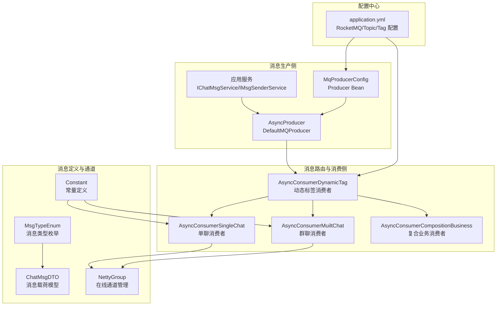
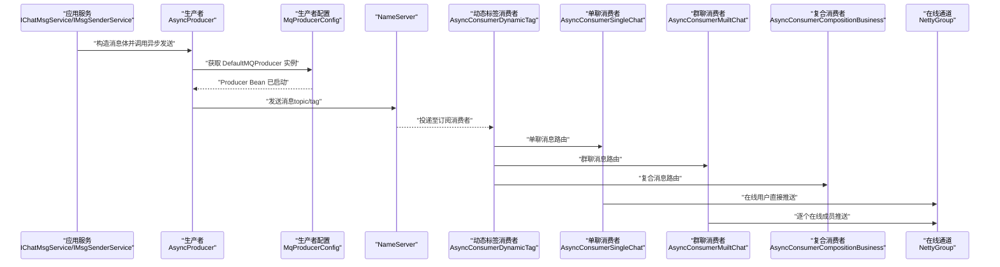
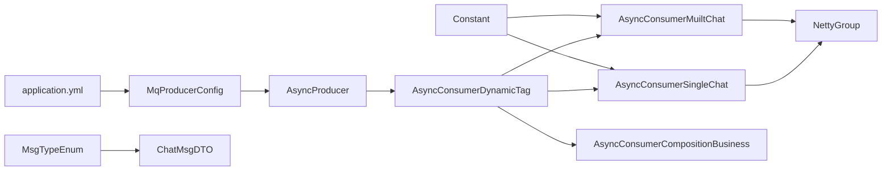
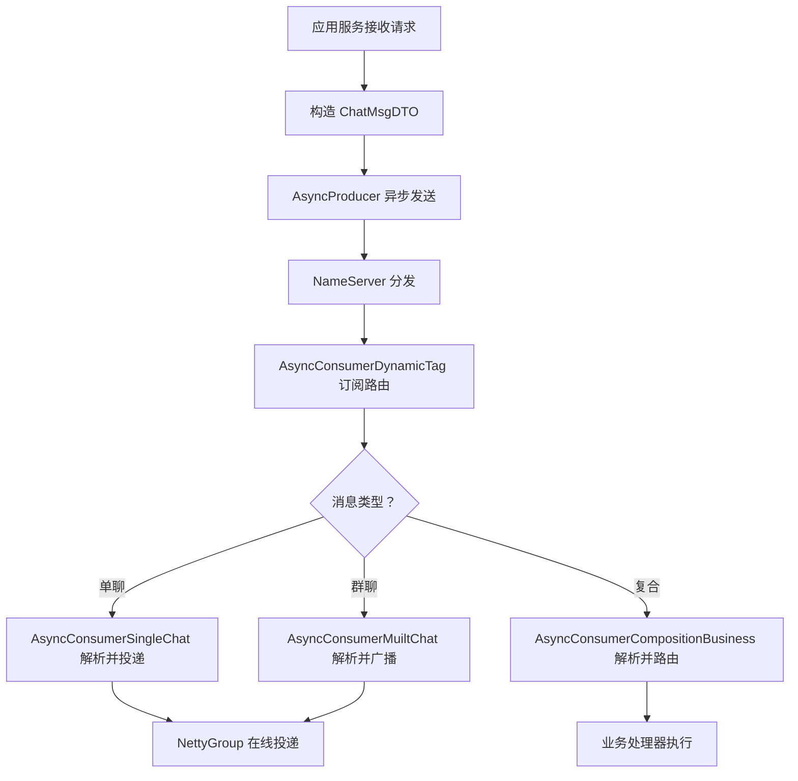

# 消息队列架构

<cite>
**本文引用的文件**
- [application.yml](file://src/main/resources/application.yml)
- [MqProducerConfig.java](file://src/main/java/com/hch/chat_simple/mq/MqProducerConfig.java)
- [AsyncProducer.java](file://src/main/java/com/hch/chat_simple/mq/AsyncProducer.java)
- [AsyncConsumerDynamicTag.java](file://src/main/java/com/hch/chat_simple/mq/AsyncConsumerDynamicTag.java)
- [AsyncConsumerSingleChat.java](file://src/main/java/com/hch/chat_simple/mq/AsyncConsumerSingleChat.java)
- [AsyncConsumerMuiltChat.java](file://src/main/java/com/hch/chat_simple/mq/AsyncConsumerMuiltChat.java)
- [AsyncConsumerCompositionBusiness.java](file://src/main/java/com/hch/chat_simple/mq/AsyncConsumerCompositionBusiness.java)
- [MsgTypeEnum.java](file://src/main/java/com/hch/chat_simple/enums/MsgTypeEnum.java)
- [ChatMsgDTO.java](file://src/main/java/com/hch/chat_simple/pojo/dto/ChatMsgDTO.java)
- [NettyGroup.java](file://src/main/java/com/hch/chat_simple/config/NettyGroup.java)
- [Constant.java](file://src/main/java/com/hch/chat_simple/util/Constant.java)
- [MsgSenderServiceImpl.java](file://src/main/java/com/hch/chat_simple/service/impl/MsgSenderServiceImpl.java)
- [IChatMsgService.java](file://src/main/java/com/hch/chat_simple/service/IChatMsgService.java)
- [IMsgSenderService.java](file://src/main/java/com/hch/chat_simple/service/IMsgSenderService.java)
</cite>

## 目录
1. [简介](#简介)
2. [项目结构](#项目结构)
3. [核心组件](#核心组件)
4. [架构总览](#架构总览)
5. [详细组件分析](#详细组件分析)
6. [依赖分析](#依赖分析)
7. [性能考虑](#性能考虑)
8. [故障排查指南](#故障排查指南)
9. [结论](#结论)
10. [附录](#附录)

## 简介
本文件面向基于 Apache RocketMQ 的异步消息处理系统，围绕聊天场景下的消息生产与消费进行系统化梳理。重点覆盖以下方面：
- 生产者配置与使用：消息类型分类、生产者组管理、消息发送策略（异步回调）。
- 消费者设计模式：单聊与群聊消费者的差异化处理机制。
- 序列化与反序列化：JSON 字符串在消息体中的约定与解析。
- 幂等性与异常处理：消息状态更新、异常日志与重试建议。
- 路由策略与负载均衡：动态标签路由、消费者组动态扩展。
- 消息流转图与处理流程图：从消息产生到消费的完整链路。

## 项目结构
消息队列相关模块集中在 mq 包中，配合枚举、DTO、配置与 Netty 连接管理，形成“生产—路由—消费—在线投递”的闭环。

图表来源
- [application.yml:39-51](file://src/main/resources/application.yml#L39-L51)
- [MqProducerConfig.java:22-28](file://src/main/java/com/hch/chat_simple/mq/MqProducerConfig.java#L22-L28)
- [AsyncProducer.java:40-59](file://src/main/java/com/hch/chat_simple/mq/AsyncProducer.java#L40-L59)
- [AsyncConsumerDynamicTag.java:82-121](file://src/main/java/com/hch/chat_simple/mq/AsyncConsumerDynamicTag.java#L82-L121)
- [AsyncConsumerSingleChat.java:47-73](file://src/main/java/com/hch/chat_simple/mq/AsyncConsumerSingleChat.java#L47-L73)
- [AsyncConsumerMuiltChat.java:57-83](file://src/main/java/com/hch/chat_simple/mq/AsyncConsumerMuiltChat.java#L57-L83)
- [AsyncConsumerCompositionBusiness.java:26-49](file://src/main/java/com/hch/chat_simple/mq/AsyncConsumerCompositionBusiness.java#L26-L49)
- [MsgTypeEnum.java:6-15](file://src/main/java/com/hch/chat_simple/enums/MsgTypeEnum.java#L6-L15)
- [ChatMsgDTO.java:13-61](file://src/main/java/com/hch/chat_simple/pojo/dto/ChatMsgDTO.java#L13-L61)
- [NettyGroup.java:11-26](file://src/main/java/com/hch/chat_simple/config/NettyGroup.java#L11-L26)
- [Constant.java:3-32](file://src/main/java/com/hch/chat_simple/util/Constant.java#L3-L32)

章节来源
- [application.yml:39-51](file://src/main/resources/application.yml#L39-L51)
- [MqProducerConfig.java:16-28](file://src/main/java/com/hch/chat_simple/mq/MqProducerConfig.java#L16-L28)
- [AsyncProducer.java:19-29](file://src/main/java/com/hch/chat_simple/mq/AsyncProducer.java#L19-L29)

## 核心组件
- 生产者配置与启动
  - Producer Bean 通过配置类创建并启动，设置名称服务器地址与生产者组。
  - 异步发送采用回调方式记录成功/异常日志。
- 动态标签消费者
  - 基于实例标签（chat.tag.list 中的当前实例 tag）计算路由 tag，实现按实例分片的负载均衡。
  - 同一 Topic 下不同消费者组订阅相同 Topic 但不同 Tag，达到“同主题多路由”的效果。
- 单聊消费者
  - 解析消息载荷，根据接收方在线状态直接通过 Netty 推送；成功后更新消息状态。
- 群聊消费者
  - 解析消息载荷，遍历群成员列表，过滤发送方后逐个在线成员推送。
- 复合业务消费者
  - 解析复合消息协议（消息类型,通道键,消息体），按消息类型路由到具体业务处理器。

章节来源
- [MqProducerConfig.java:22-28](file://src/main/java/com/hch/chat_simple/mq/MqProducerConfig.java#L22-L28)
- [AsyncProducer.java:40-59](file://src/main/java/com/hch/chat_simple/mq/AsyncProducer.java#L40-L59)
- [AsyncConsumerDynamicTag.java:82-121](file://src/main/java/com/hch/chat_simple/mq/AsyncConsumerDynamicTag.java#L82-L121)
- [AsyncConsumerSingleChat.java:47-73](file://src/main/java/com/hch/chat_simple/mq/AsyncConsumerSingleChat.java#L47-L73)
- [AsyncConsumerMuiltChat.java:57-83](file://src/main/java/com/hch/chat_simple/mq/AsyncConsumerMuiltChat.java#L57-L83)
- [AsyncConsumerCompositionBusiness.java:26-49](file://src/main/java/com/hch/chat_simple/mq/AsyncConsumerCompositionBusiness.java#L26-L49)

## 架构总览
下图展示了从应用服务到 RocketMQ，再到消费者与在线通道的完整链路。

图表来源
- [MqProducerConfig.java:22-28](file://src/main/java/com/hch/chat_simple/mq/MqProducerConfig.java#L22-L28)
- [AsyncProducer.java:40-59](file://src/main/java/com/hch/chat_simple/mq/AsyncProducer.java#L40-L59)
- [AsyncConsumerDynamicTag.java:105-117](file://src/main/java/com/hch/chat_simple/mq/AsyncConsumerDynamicTag.java#L105-L117)
- [AsyncConsumerSingleChat.java:47-73](file://src/main/java/com/hch/chat_simple/mq/AsyncConsumerSingleChat.java#L47-L73)
- [AsyncConsumerMuiltChat.java:57-83](file://src/main/java/com/hch/chat_simple/mq/AsyncConsumerMuiltChat.java#L57-L83)
- [AsyncConsumerCompositionBusiness.java:26-49](file://src/main/java/com/hch/chat_simple/mq/AsyncConsumerCompositionBusiness.java#L26-L49)
- [NettyGroup.java:17-26](file://src/main/java/com/hch/chat_simple/config/NettyGroup.java#L17-L26)

## 详细组件分析

### 生产者配置与使用
- 生产者组与名称服务器
  - 生产者组与 NameServer 地址从配置文件读取，统一在配置类中创建并启动 Producer Bean。
- 消息发送策略
  - 使用异步发送并注册回调，成功/异常均记录日志；异常被捕获并记录，避免阻塞主流程。
- 消息类型与路由
  - 消息体为 JSON 字符串，发送时指定 topic 与 tag；tag 由动态标签消费者决定，实现按实例分片。

章节来源
- [application.yml:39-51](file://src/main/resources/application.yml#L39-L51)
- [MqProducerConfig.java:16-28](file://src/main/java/com/hch/chat_simple/mq/MqProducerConfig.java#L16-L28)
- [AsyncProducer.java:40-59](file://src/main/java/com/hch/chat_simple/mq/AsyncProducer.java#L40-L59)

### 动态标签路由与消费者组管理
- 标签映射规则
  - 依据配置项 chat.tag.list 与 chat.tag.current，计算当前实例在标签列表中的索引作为 tag。
  - 每个实例生成唯一的 tag，消费者组名拼接该 tag，确保同一 Topic 下不同消费者组订阅不同 tag。
- 消费模式
  - 采用集群模式（CLUSTERING），实现同组内负载均衡；不同实例同主题不同 tag，实现跨实例分片。
- 消费者组动态调整
  - 新增实例只需在标签列表中新增一项并重启，即可自动参与路由；无需修改现有消费者组订阅关系。

章节来源
- [application.yml:79-82](file://src/main/resources/application.yml#L79-L82)
- [AsyncConsumerDynamicTag.java:82-121](file://src/main/java/com/hch/chat_simple/mq/AsyncConsumerDynamicTag.java#L82-L121)
- [AsyncConsumerDynamicTag.java:129-163](file://src/main/java/com/hch/chat_simple/mq/AsyncConsumerDynamicTag.java#L129-L163)
- [AsyncConsumerDynamicTag.java:165-199](file://src/main/java/com/hch/chat_simple/mq/AsyncConsumerDynamicTag.java#L165-L199)

### 单聊消费者
- 解析与过滤
  - 将消息体解析为消息 DTO，校验消息类型与接收方 ID；仅处理单聊且消息类型为发送的消息。
- 在线投递与状态更新
  - 通过 NettyGroup 查找用户在线通道，若存在则直接推送；写入成功后更新消息状态。
- 并发与稳定性
  - 使用固定线程池处理消息，避免阻塞 RocketMQ 消费线程。

章节来源
- [AsyncConsumerSingleChat.java:47-73](file://src/main/java/com/hch/chat_simple/mq/AsyncConsumerSingleChat.java#L47-L73)
- [NettyGroup.java:17-26](file://src/main/java/com/hch/chat_simple/config/NettyGroup.java#L17-L26)
- [Constant.java:8-21](file://src/main/java/com/hch/chat_simple/util/Constant.java#L8-L21)

### 群聊消费者
- 解析与广播
  - 将消息体解析为消息 DTO，校验群聊标识与接收人列表；遍历成员列表，过滤发送方后逐个在线成员推送。
- 权限与一致性
  - 当前实现未做发送方权限校验，建议在生产环境补充群成员校验逻辑。
- 并发与稳定性
  - 使用固定线程池处理消息，避免阻塞 RocketMQ 消费线程。

章节来源
- [AsyncConsumerMuiltChat.java:57-83](file://src/main/java/com/hch/chat_simple/mq/AsyncConsumerMuiltChat.java#L57-L83)
- [NettyGroup.java:17-26](file://src/main/java/com/hch/chat_simple/config/NettyGroup.java#L17-L26)

### 复合业务消费者
- 协议解析
  - 约定消息格式为“消息类型,通道键,消息体”，先解析消息类型与通道键，再路由到具体业务处理器。
- 处理器选择
  - 通过组合的业务处理器列表按消息类型筛选并执行对应消费逻辑。

章节来源
- [AsyncConsumerCompositionBusiness.java:26-49](file://src/main/java/com/hch/chat_simple/mq/AsyncConsumerCompositionBusiness.java#L26-L49)

### 消息类型与序列化/反序列化
- 消息类型
  - 定义了多种消息类型（上线、聊天消息、下线、好友申请、添加好友关系、群成员变更等）。
- 序列化与反序列化
  - 消息体以 JSON 字符串形式传输；消费者侧使用 JSON 解析为 DTO 对象。
- 数据模型
  - ChatMsgDTO 承载消息内容、发送方、接收方、群组 ID、时间戳等字段。

章节来源
- [MsgTypeEnum.java:6-15](file://src/main/java/com/hch/chat_simple/enums/MsgTypeEnum.java#L6-L15)
- [ChatMsgDTO.java:13-61](file://src/main/java/com/hch/chat_simple/pojo/dto/ChatMsgDTO.java#L13-L61)

### 幂等性与异常处理
- 幂等性
  - 单聊消费者在写入成功后更新消息状态，用于后续补偿或去重；建议结合消息 ID 做更强的幂等控制。
- 异常处理
  - 生产端异步回调记录异常日志；消费者方法内部捕获异常并抛出运行时异常，便于上层监控与告警。
- 重试机制
  - 当前未实现自动重试；建议在 RocketMQ 层配置重试策略或在业务层引入补偿任务。

章节来源
- [AsyncProducer.java:44-58](file://src/main/java/com/hch/chat_simple/mq/AsyncProducer.java#L44-L58)
- [AsyncConsumerSingleChat.java:76-82](file://src/main/java/com/hch/chat_simple/mq/AsyncConsumerSingleChat.java#L76-L82)
- [AsyncConsumerMuiltChat.java:49-55](file://src/main/java/com/hch/chat_simple/mq/AsyncConsumerMuiltChat.java#L49-L55)

## 依赖分析
- 组件耦合
  - 动态标签消费者负责订阅与路由，解耦了具体业务消费者；业务消费者仅关注消息解析与在线投递。
- 外部依赖
  - RocketMQ 名称服务器地址来自配置；Netty 通道管理集中于 NettyGroup；消息类型与常量集中于枚举与工具类。

图表来源
- [application.yml:39-51](file://src/main/resources/application.yml#L39-L51)
- [MqProducerConfig.java:22-28](file://src/main/java/com/hch/chat_simple/mq/MqProducerConfig.java#L22-L28)
- [AsyncProducer.java:40-59](file://src/main/java/com/hch/chat_simple/mq/AsyncProducer.java#L40-L59)
- [AsyncConsumerDynamicTag.java:82-121](file://src/main/java/com/hch/chat_simple/mq/AsyncConsumerDynamicTag.java#L82-L121)
- [AsyncConsumerSingleChat.java:47-73](file://src/main/java/com/hch/chat_simple/mq/AsyncConsumerSingleChat.java#L47-L73)
- [AsyncConsumerMuiltChat.java:57-83](file://src/main/java/com/hch/chat_simple/mq/AsyncConsumerMuiltChat.java#L57-L83)
- [AsyncConsumerCompositionBusiness.java:26-49](file://src/main/java/com/hch/chat_simple/mq/AsyncConsumerCompositionBusiness.java#L26-L49)
- [MsgTypeEnum.java:6-15](file://src/main/java/com/hch/chat_simple/enums/MsgTypeEnum.java#L6-L15)
- [ChatMsgDTO.java:13-61](file://src/main/java/com/hch/chat_simple/pojo/dto/ChatMsgDTO.java#L13-L61)
- [NettyGroup.java:17-26](file://src/main/java/com/hch/chat_simple/config/NettyGroup.java#L17-L26)
- [Constant.java:8-21](file://src/main/java/com/hch/chat_simple/util/Constant.java#L8-L21)

## 性能考虑
- 并发处理
  - 消费者侧使用固定线程池处理消息，避免阻塞 RocketMQ 消费线程。
- 负载均衡
  - 通过动态标签实现跨实例分片，结合集群模式提升吞吐。
- 写入优化
  - 在线投递采用 Netty 写入并监听写入结果，减少不必要的数据库更新。
- 建议
  - 引入消息去重与幂等控制（如基于消息 ID 的 Redis 去重）。
  - 在 RocketMQ 层配置合理的重试次数与死信队列策略。

## 故障排查指南
- 生产端异常
  - 观察异步回调日志，定位网络或 Broker 异常；检查 Producer Bean 是否已启动。
- 消费端异常
  - 消费方法内部抛出运行时异常，便于快速定位；检查消息类型与 DTO 字段映射。
- 路由问题
  - 确认 chat.tag.list 与 chat.tag.current 配置正确；确认消费者组名拼接的 tag 与发送端一致。
- 在线投递失败
  - 检查 NettyGroup 中用户映射是否存在；确认通道有效后再写入。

章节来源
- [AsyncProducer.java:44-58](file://src/main/java/com/hch/chat_simple/mq/AsyncProducer.java#L44-L58)
- [AsyncConsumerSingleChat.java:76-82](file://src/main/java/com/hch/chat_simple/mq/AsyncConsumerSingleChat.java#L76-L82)
- [application.yml:79-82](file://src/main/resources/application.yml#L79-L82)
- [NettyGroup.java:17-26](file://src/main/java/com/hch/chat_simple/config/NettyGroup.java#L17-L26)

## 结论
该系统以 RocketMQ 为核心，结合动态标签路由与 Netty 在线投递，实现了高可用、可扩展的异步消息处理方案。通过明确的消息类型、清晰的路由策略与稳定的消费者实现，满足单聊、群聊与复合业务的消息流转需求。建议进一步完善幂等控制与自动重试策略，以增强系统的健壮性与可维护性。

## 附录
- 关键流程图：从消息产生到消费的完整链路

图表来源
- [MsgSenderServiceImpl.java:35-55](file://src/main/java/com/hch/chat_simple/service/impl/MsgSenderServiceImpl.java#L35-L55)
- [AsyncProducer.java:40-59](file://src/main/java/com/hch/chat_simple/mq/AsyncProducer.java#L40-L59)
- [AsyncConsumerDynamicTag.java:105-117](file://src/main/java/com/hch/chat_simple/mq/AsyncConsumerDynamicTag.java#L105-L117)
- [AsyncConsumerSingleChat.java:47-73](file://src/main/java/com/hch/chat_simple/mq/AsyncConsumerSingleChat.java#L47-L73)
- [AsyncConsumerMuiltChat.java:57-83](file://src/main/java/com/hch/chat_simple/mq/AsyncConsumerMuiltChat.java#L57-L83)
- [AsyncConsumerCompositionBusiness.java:26-49](file://src/main/java/com/hch/chat_simple/mq/AsyncConsumerCompositionBusiness.java#L26-L49)
- [NettyGroup.java:17-26](file://src/main/java/com/hch/chat_simple/config/NettyGroup.java#L17-L26)