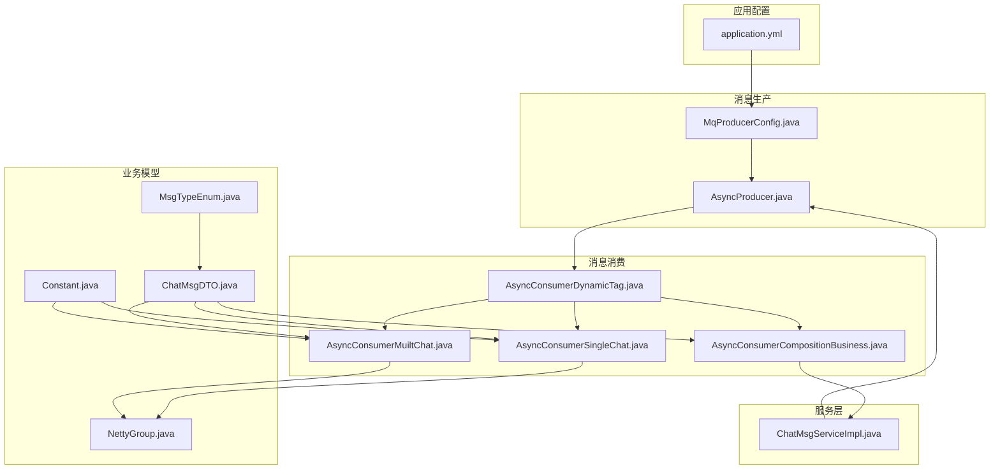
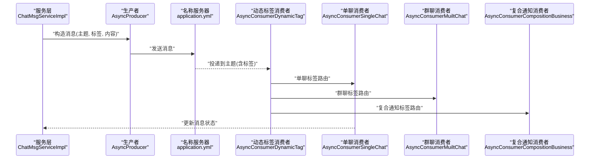
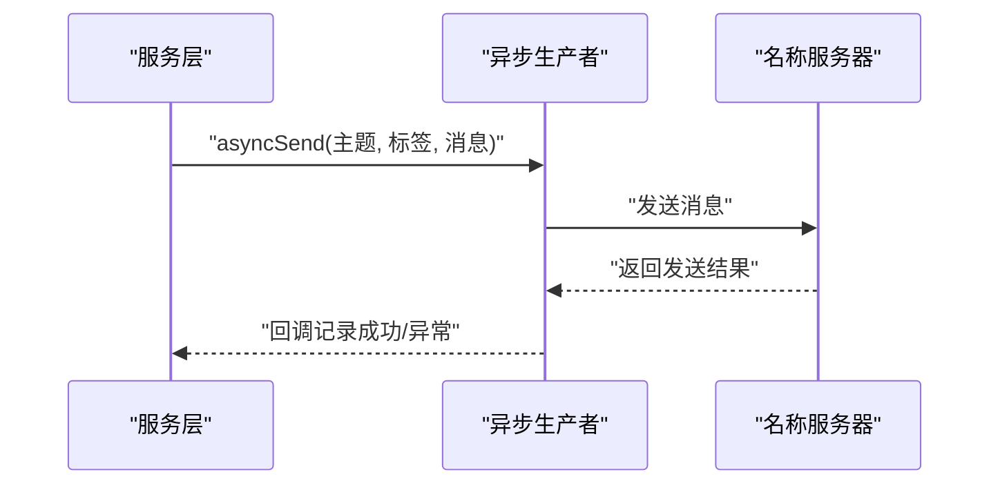
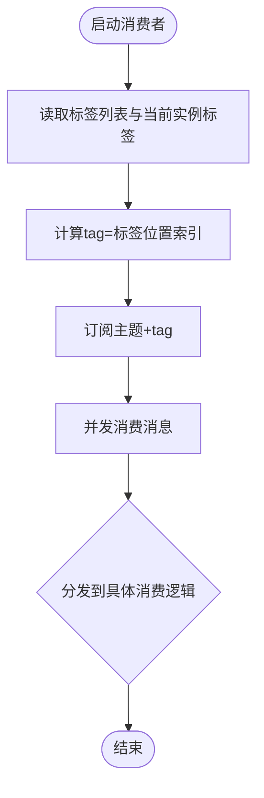
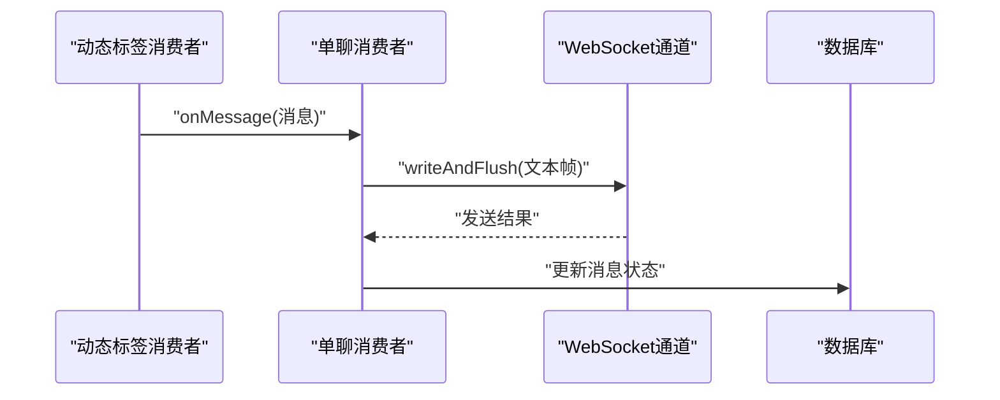
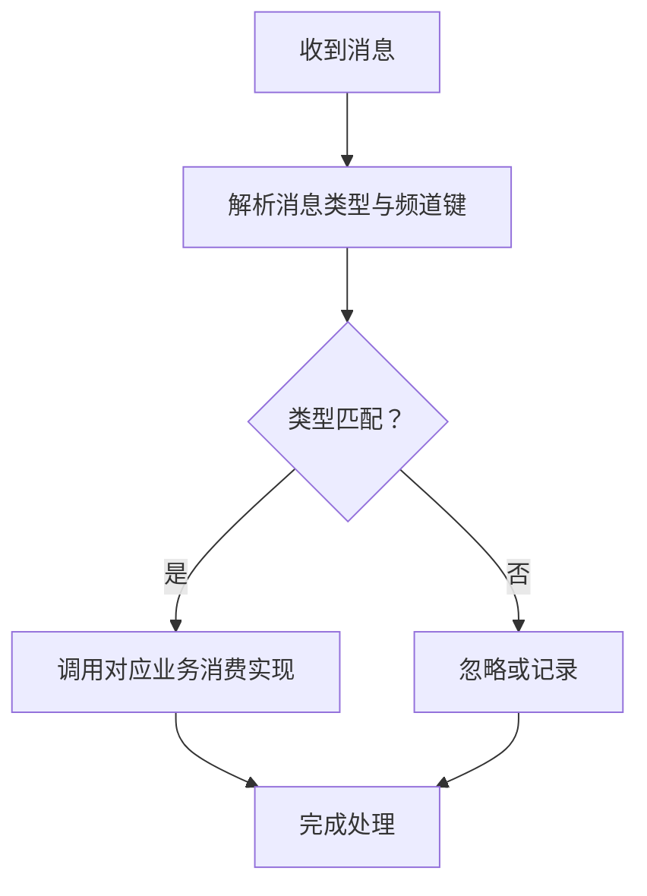
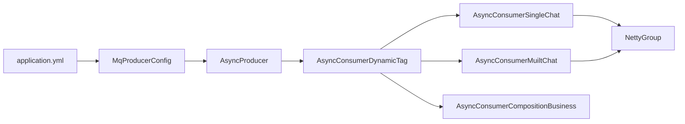

# 消息主题与标签

<cite>
**本文引用的文件**
- [application.yml](file://src/main/resources/application.yml)
- [MqProducerConfig.java](file://src/main/java/com/hch/chat_simple/mq/MqProducerConfig.java)
- [AsyncProducer.java](file://src/main/java/com/hch/chat_simple/mq/AsyncProducer.java)
- [AsyncConsumerDynamicTag.java](file://src/main/java/com/hch/chat_simple/mq/AsyncConsumerDynamicTag.java)
- [AsyncConsumerSingleChat.java](file://src/main/java/com/hch/chat_simple/mq/AsyncConsumerSingleChat.java)
- [AsyncConsumerMuiltChat.java](file://src/main/java/com/hch/chat_simple/mq/AsyncConsumerMuiltChat.java)
- [AsyncConsumerCompositionBusiness.java](file://src/main/java/com/hch/chat_simple/mq/AsyncConsumerCompositionBusiness.java)
- [MsgTypeEnum.java](file://src/main/java/com/hch/chat_simple/enums/MsgTypeEnum.java)
- [Constant.java](file://src/main/java/com/hch/chat_simple/util/Constant.java)
- [ChatMsgDTO.java](file://src/main/java/com/hch/chat_simple/pojo/dto/ChatMsgDTO.java)
- [NettyGroup.java](file://src/main/java/com/hch/chat_simple/config/NettyGroup.java)
- [ChatMsgServiceImpl.java](file://src/main/java/com/hch/chat_simple/service/impl/ChatMsgServiceImpl.java)
</cite>

## 目录
1. [简介](#简介)
2. [项目结构](#项目结构)
3. [核心组件](#核心组件)
4. [架构总览](#架构总览)
5. [详细组件分析](#详细组件分析)
6. [依赖分析](#依赖分析)
7. [性能考虑](#性能考虑)
8. [故障排查指南](#故障排查指南)
9. [结论](#结论)
10. [附录](#附录)

## 简介
本技术文档围绕消息主题（Topic）与标签（Tag）在 RocketMQ 中的设计与使用展开，结合项目中实际的消息通道与消费模型，系统阐述：
- 主题与标签的设计理念与使用规范
- 面向不同业务场景的主题划分策略（单聊、群聊、复合通知）
- 标签的分类体系与动态路由策略
- 命名规范、权限控制与访问策略
- 主题配置最佳实践（分区、副本、存储优化）
- 监控、性能调优与容量规划的运维建议

## 项目结构
本项目采用分层架构，消息模块位于 mq 包内，通过 Spring Boot 自动装配与 RocketMQ 客户端完成生产与消费；消息体对象定义于 pojo/dto，枚举与常量用于统一语义与状态。

图表来源
- [application.yml:39-51](file://src/main/resources/application.yml#L39-L51)
- [MqProducerConfig.java:22-28](file://src/main/java/com/hch/chat_simple/mq/MqProducerConfig.java#L22-L28)
- [AsyncProducer.java:40-59](file://src/main/java/com/hch/chat_simple/mq/AsyncProducer.java#L40-L59)
- [AsyncConsumerDynamicTag.java:82-121](file://src/main/java/com/hch/chat_simple/mq/AsyncConsumerDynamicTag.java#L82-L121)
- [AsyncConsumerSingleChat.java:47-73](file://src/main/java/com/hch/chat_simple/mq/AsyncConsumerSingleChat.java#L47-L73)
- [AsyncConsumerMuiltChat.java:57-82](file://src/main/java/com/hch/chat_simple/mq/AsyncConsumerMuiltChat.java#L57-L82)
- [AsyncConsumerCompositionBusiness.java:26-49](file://src/main/java/com/hch/chat_simple/mq/AsyncConsumerCompositionBusiness.java#L26-L49)
- [ChatMsgDTO.java:18-53](file://src/main/java/com/hch/chat_simple/pojo/dto/ChatMsgDTO.java#L18-L53)
- [MsgTypeEnum.java:6-15](file://src/main/java/com/hch/chat_simple/enums/MsgTypeEnum.java#L6-L15)
- [Constant.java:19-25](file://src/main/java/com/hch/chat_simple/util/Constant.java#L19-L25)
- [NettyGroup.java:11-26](file://src/main/java/com/hch/chat_simple/config/NettyGroup.java#L11-L26)
- [ChatMsgServiceImpl.java:100-124](file://src/main/java/com/hch/chat_simple/service/impl/ChatMsgServiceImpl.java#L100-L124)

章节来源
- [application.yml:39-51](file://src/main/resources/application.yml#L39-L51)
- [MqProducerConfig.java:22-28](file://src/main/java/com/hch/chat_simple/mq/MqProducerConfig.java#L22-L28)
- [AsyncProducer.java:40-59](file://src/main/java/com/hch/chat_simple/mq/AsyncProducer.java#L40-L59)
- [AsyncConsumerDynamicTag.java:82-121](file://src/main/java/com/hch/chat_simple/mq/AsyncConsumerDynamicTag.java#L82-L121)
- [AsyncConsumerSingleChat.java:47-73](file://src/main/java/com/hch/chat_simple/mq/AsyncConsumerSingleChat.java#L47-L73)
- [AsyncConsumerMuiltChat.java:57-82](file://src/main/java/com/hch/chat_simple/mq/AsyncConsumerMuiltChat.java#L57-L82)
- [AsyncConsumerCompositionBusiness.java:26-49](file://src/main/java/com/hch/chat_simple/mq/AsyncConsumerCompositionBusiness.java#L26-L49)
- [ChatMsgDTO.java:18-53](file://src/main/java/com/hch/chat_simple/pojo/dto/ChatMsgDTO.java#L18-L53)
- [MsgTypeEnum.java:6-15](file://src/main/java/com/hch/chat_simple/enums/MsgTypeEnum.java#L6-L15)
- [Constant.java:19-25](file://src/main/java/com/hch/chat_simple/util/Constant.java#L19-L25)
- [NettyGroup.java:11-26](file://src/main/java/com/hch/chat_simple/config/NettyGroup.java#L11-L26)
- [ChatMsgServiceImpl.java:100-124](file://src/main/java/com/hch/chat_simple/service/impl/ChatMsgServiceImpl.java#L100-L124)

## 核心组件
- 生产者配置与实例
  - 生产者组与名称服务器地址由配置文件注入，创建并启动 DefaultMQProducer 实例，供消息发送使用。
- 异步生产者
  - 提供按主题与标签发送消息的能力，并通过回调记录成功与异常日志。
- 动态标签消费者
  - 基于实例当前标签与配置的标签列表，计算出具体 tag 值，订阅相同主题但不同 tag 的消息，实现“同一主题、多标签路由”的消费模型。
- 单聊/群聊/复合通知消费者
  - 单聊与群聊消费者负责在线直发 WebSocket 消息；复合通知消费者根据消息类型分派至具体业务消费实现。
- 业务模型与常量
  - ChatMsgDTO 统一消息载体；MsgTypeEnum 定义消息类型；Constant 定义聊天类型与状态常量；NettyGroup 维护用户与通道映射。

章节来源
- [MqProducerConfig.java:22-28](file://src/main/java/com/hch/chat_simple/mq/MqProducerConfig.java#L22-L28)
- [AsyncProducer.java:40-59](file://src/main/java/com/hch/chat_simple/mq/AsyncProducer.java#L40-L59)
- [AsyncConsumerDynamicTag.java:82-121](file://src/main/java/com/hch/chat_simple/mq/AsyncConsumerDynamicTag.java#L82-L121)
- [AsyncConsumerSingleChat.java:47-73](file://src/main/java/com/hch/chat_simple/mq/AsyncConsumerSingleChat.java#L47-L73)
- [AsyncConsumerMuiltChat.java:57-82](file://src/main/java/com/hch/chat_simple/mq/AsyncConsumerMuiltChat.java#L57-L82)
- [AsyncConsumerCompositionBusiness.java:26-49](file://src/main/java/com/hch/chat_simple/mq/AsyncConsumerCompositionBusiness.java#L26-L49)
- [ChatMsgDTO.java:18-53](file://src/main/java/com/hch/chat_simple/pojo/dto/ChatMsgDTO.java#L18-L53)
- [MsgTypeEnum.java:6-15](file://src/main/java/com/hch/chat_simple/enums/MsgTypeEnum.java#L6-L15)
- [Constant.java:19-25](file://src/main/java/com/hch/chat_simple/util/Constant.java#L19-L25)
- [NettyGroup.java:11-26](file://src/main/java/com/hch/chat_simple/config/NettyGroup.java#L11-L26)

## 架构总览
消息从服务层进入生产者，按业务类型选择主题与标签，消费者根据标签路由到对应消费逻辑，最终通过 WebSocket 将消息推送到在线用户。

图表来源
- [application.yml:39-51](file://src/main/resources/application.yml#L39-L51)
- [AsyncProducer.java:40-59](file://src/main/java/com/hch/chat_simple/mq/AsyncProducer.java#L40-L59)
- [AsyncConsumerDynamicTag.java:82-121](file://src/main/java/com/hch/chat_simple/mq/AsyncConsumerDynamicTag.java#L82-L121)
- [AsyncConsumerSingleChat.java:47-73](file://src/main/java/com/hch/chat_simple/mq/AsyncConsumerSingleChat.java#L47-L73)
- [AsyncConsumerMuiltChat.java:57-82](file://src/main/java/com/hch/chat_simple/mq/AsyncConsumerMuiltChat.java#L57-L82)
- [AsyncConsumerCompositionBusiness.java:26-49](file://src/main/java/com/hch/chat_simple/mq/AsyncConsumerCompositionBusiness.java#L26-L49)
- [ChatMsgServiceImpl.java:100-124](file://src/main/java/com/hch/chat_simple/service/impl/ChatMsgServiceImpl.java#L100-L124)

## 详细组件分析

### 主题与标签设计
- 主题划分
  - 单聊主题：single-chat
  - 群聊主题：muilt-chat
  - 复合通知主题：composition
- 标签路由
  - 通过配置的标签列表与当前实例标签，计算出一个整型 tag，订阅相同主题的不同标签，实现“多实例、多标签”的负载与隔离。
- 消息体与类型
  - ChatMsgDTO 承载消息类型、聊天类型、内容与时间戳等字段；MsgTypeEnum 统一消息类型枚举。

章节来源
- [application.yml:47-51](file://src/main/resources/application.yml#L47-L51)
- [AsyncConsumerDynamicTag.java:82-121](file://src/main/java/com/hch/chat_simple/mq/AsyncConsumerDynamicTag.java#L82-L121)
- [AsyncConsumerDynamicTag.java:129-163](file://src/main/java/com/hch/chat_simple/mq/AsyncConsumerDynamicTag.java#L129-L163)
- [AsyncConsumerDynamicTag.java:165-199](file://src/main/java/com/hch/chat_simple/mq/AsyncConsumerDynamicTag.java#L165-L199)
- [ChatMsgDTO.java:18-53](file://src/main/java/com/hch/chat_simple/pojo/dto/ChatMsgDTO.java#L18-L53)
- [MsgTypeEnum.java:6-15](file://src/main/java/com/hch/chat_simple/enums/MsgTypeEnum.java#L6-L15)

### 生产者与发送流程
- 生产者配置
  - 从配置读取生产者组与名称服务器地址，初始化并启动 DefaultMQProducer。
- 发送方法
  - 使用 Message 构造主题、标签与消息体，通过回调记录成功与异常日志。
- 服务层发送
  - 服务层根据聊天类型选择主题，并基于接收方 ID 或实例映射计算标签，调用异步发送。

图表来源
- [MqProducerConfig.java:22-28](file://src/main/java/com/hch/chat_simple/mq/MqProducerConfig.java#L22-L28)
- [AsyncProducer.java:40-59](file://src/main/java/com/hch/chat_simple/mq/AsyncProducer.java#L40-L59)
- [ChatMsgServiceImpl.java:100-124](file://src/main/java/com/hch/chat_simple/service/impl/ChatMsgServiceImpl.java#L100-L124)

章节来源
- [MqProducerConfig.java:22-28](file://src/main/java/com/hch/chat_simple/mq/MqProducerConfig.java#L22-L28)
- [AsyncProducer.java:40-59](file://src/main/java/com/hch/chat_simple/mq/AsyncProducer.java#L40-L59)
- [ChatMsgServiceImpl.java:100-124](file://src/main/java/com/hch/chat_simple/service/impl/ChatMsgServiceImpl.java#L100-L124)

### 动态标签消费者与路由
- 标签计算
  - 依据当前实例标签在配置标签列表中的位置，生成整型 tag。
- 订阅关系
  - 同一主题下，不同消费组订阅不同标签，实现“同一主题、多标签路由”。
- 消费模式
  - 设置为集群模式，确保消息在同组内均衡分配。

图表来源
- [AsyncConsumerDynamicTag.java:82-121](file://src/main/java/com/hch/chat_simple/mq/AsyncConsumerDynamicTag.java#L82-L121)
- [AsyncConsumerDynamicTag.java:129-163](file://src/main/java/com/hch/chat_simple/mq/AsyncConsumerDynamicTag.java#L129-L163)
- [AsyncConsumerDynamicTag.java:165-199](file://src/main/java/com/hch/chat_simple/mq/AsyncConsumerDynamicTag.java#L165-L199)

章节来源
- [AsyncConsumerDynamicTag.java:82-121](file://src/main/java/com/hch/chat_simple/mq/AsyncConsumerDynamicTag.java#L82-L121)
- [AsyncConsumerDynamicTag.java:129-163](file://src/main/java/com/hch/chat_simple/mq/AsyncConsumerDynamicTag.java#L129-L163)
- [AsyncConsumerDynamicTag.java:165-199](file://src/main/java/com/hch/chat_simple/mq/AsyncConsumerDynamicTag.java#L165-L199)

### 单聊与群聊消费
- 单聊
  - 解析消息，判断聊天类型为单聊且接收方在线，直接通过 WebSocket 推送消息，并在发送成功后更新消息状态。
- 群聊
  - 解析消息，遍历群成员列表，过滤发送者自身，逐个在线成员推送消息。

图表来源
- [AsyncConsumerSingleChat.java:47-73](file://src/main/java/com/hch/chat_simple/mq/AsyncConsumerSingleChat.java#L47-L73)
- [NettyGroup.java:11-26](file://src/main/java/com/hch/chat_simple/config/NettyGroup.java#L11-L26)

章节来源
- [AsyncConsumerSingleChat.java:47-73](file://src/main/java/com/hch/chat_simple/mq/AsyncConsumerSingleChat.java#L47-L73)
- [NettyGroup.java:11-26](file://src/main/java/com/hch/chat_simple/config/NettyGroup.java#L11-L26)

### 复合通知消费
- 消息格式约定
  - 以“消息类型,频道键,消息体”的形式传递，解析后根据消息类型分派到具体业务消费实现。
- 分派逻辑
  - 通过实现列表筛选匹配的消息类型，执行对应业务消费。

图表来源
- [AsyncConsumerCompositionBusiness.java:26-49](file://src/main/java/com/hch/chat_simple/mq/AsyncConsumerCompositionBusiness.java#L26-L49)

章节来源
- [AsyncConsumerCompositionBusiness.java:26-49](file://src/main/java/com/hch/chat_simple/mq/AsyncConsumerCompositionBusiness.java#L26-L49)

## 依赖分析
- 组件耦合
  - 生产者与消费者通过主题与标签解耦；动态标签消费者负责路由，降低跨模块耦合。
- 外部依赖
  - RocketMQ 名称服务器地址来自配置；标签列表与当前实例标签来自配置。
- 潜在循环依赖
  - 当前结构未见循环依赖；消费者之间通过服务层或工具类交互，避免直接循环引用。

图表来源
- [application.yml:39-51](file://src/main/resources/application.yml#L39-L51)
- [MqProducerConfig.java:22-28](file://src/main/java/com/hch/chat_simple/mq/MqProducerConfig.java#L22-L28)
- [AsyncProducer.java:40-59](file://src/main/java/com/hch/chat_simple/mq/AsyncProducer.java#L40-L59)
- [AsyncConsumerDynamicTag.java:82-121](file://src/main/java/com/hch/chat_simple/mq/AsyncConsumerDynamicTag.java#L82-L121)
- [AsyncConsumerSingleChat.java:47-73](file://src/main/java/com/hch/chat_simple/mq/AsyncConsumerSingleChat.java#L47-L73)
- [AsyncConsumerMuiltChat.java:57-82](file://src/main/java/com/hch/chat_simple/mq/AsyncConsumerMuiltChat.java#L57-L82)
- [AsyncConsumerCompositionBusiness.java:26-49](file://src/main/java/com/hch/chat_simple/mq/AsyncConsumerCompositionBusiness.java#L26-L49)
- [NettyGroup.java:11-26](file://src/main/java/com/hch/chat_simple/config/NettyGroup.java#L11-L26)

章节来源
- [application.yml:39-51](file://src/main/resources/application.yml#L39-L51)
- [MqProducerConfig.java:22-28](file://src/main/java/com/hch/chat_simple/mq/MqProducerConfig.java#L22-L28)
- [AsyncProducer.java:40-59](file://src/main/java/com/hch/chat_simple/mq/AsyncProducer.java#L40-L59)
- [AsyncConsumerDynamicTag.java:82-121](file://src/main/java/com/hch/chat_simple/mq/AsyncConsumerDynamicTag.java#L82-L121)
- [AsyncConsumerSingleChat.java:47-73](file://src/main/java/com/hch/chat_simple/mq/AsyncConsumerSingleChat.java#L47-L73)
- [AsyncConsumerMuiltChat.java:57-82](file://src/main/java/com/hch/chat_simple/mq/AsyncConsumerMuiltChat.java#L57-L82)
- [AsyncConsumerCompositionBusiness.java:26-49](file://src/main/java/com/hch/chat_simple/mq/AsyncConsumerCompositionBusiness.java#L26-L49)
- [NettyGroup.java:11-26](file://src/main/java/com/hch/chat_simple/config/NettyGroup.java#L11-L26)

## 性能考虑
- 并发与线程池
  - 消费端使用固定大小线程池处理消息，避免高并发下的资源争用。
- 消息模型
  - 消费者设置为集群模式，保证同组内的消息均衡分配。
- 发送回调
  - 生产端使用回调记录发送结果，便于快速定位异常与重试策略。
- 通道与状态
  - 通过 NettyGroup 维护用户与通道映射，减少查找成本；发送成功后及时更新消息状态，降低重复投递风险。

章节来源
- [AsyncConsumerSingleChat.java](file://src/main/java/com/hch/chat_simple/mq/AsyncConsumerSingleChat.java#L41)
- [AsyncConsumerMuiltChat.java](file://src/main/java/com/hch/chat_simple/mq/AsyncConsumerMuiltChat.java#L42)
- [AsyncProducer.java:44-55](file://src/main/java/com/hch/chat_simple/mq/AsyncProducer.java#L44-L55)
- [NettyGroup.java:11-26](file://src/main/java/com/hch/chat_simple/config/NettyGroup.java#L11-L26)

## 故障排查指南
- 生产端异常
  - 观察回调日志，确认主题与标签是否正确；检查名称服务器地址与网络连通性。
- 消费端异常
  - 查看动态标签消费者日志，确认标签计算是否与配置一致；核对订阅关系与消费组命名。
- 在线推送失败
  - 检查 WebSocket 通道是否存在与可用；确认 NettyGroup 中用户映射是否正确。
- 复合通知分派失败
  - 校验消息格式约定与消息类型枚举是否匹配；确认业务消费实现已注册。

章节来源
- [AsyncProducer.java:44-55](file://src/main/java/com/hch/chat_simple/mq/AsyncProducer.java#L44-L55)
- [AsyncConsumerDynamicTag.java:82-121](file://src/main/java/com/hch/chat_simple/mq/AsyncConsumerDynamicTag.java#L82-L121)
- [AsyncConsumerSingleChat.java:55-70](file://src/main/java/com/hch/chat_simple/mq/AsyncConsumerSingleChat.java#L55-L70)
- [AsyncConsumerMuiltChat.java:66-81](file://src/main/java/com/hch/chat_simple/mq/AsyncConsumerMuiltChat.java#L66-L81)
- [AsyncConsumerCompositionBusiness.java:26-49](file://src/main/java/com/hch/chat_simple/mq/AsyncConsumerCompositionBusiness.java#L26-L49)

## 结论
本项目通过“同一主题、多标签路由”的方式，实现了单聊、群聊与复合通知的清晰分离与高效扩展。配合生产端回调与消费端并发处理，能够在保证实时性的前提下提升吞吐与稳定性。建议在生产环境中进一步完善权限校验、监控告警与容量规划，持续优化标签策略与分区副本配置。

## 附录

### 主题与标签命名规范
- 主题命名
  - 使用全小写、中划线或下划线分隔，语义明确，避免过长。
  - 示例：single-chat、muilt-chat、composition。
- 标签命名
  - 使用连续整数或稳定映射值，便于路由与扩展。
  - 建议与实例标签列表顺序一一对应，避免冲突。

章节来源
- [application.yml:47-51](file://src/main/resources/application.yml#L47-L51)
- [AsyncConsumerDynamicTag.java:82-121](file://src/main/java/com/hch/chat_simple/mq/AsyncConsumerDynamicTag.java#L82-L121)

### 权限控制与访问策略
- 发送权限
  - 服务层在发送前应校验用户与目标成员的权限（例如群成员校验），避免越权发送。
- 接收权限
  - 消费端可增加接收方权限校验，防止非法用户接收消息。
- 访问策略
  - 建议对主题与标签进行最小权限授权，仅允许必要消费者订阅指定标签。

章节来源
- [AsyncConsumerSingleChat.java:50-70](file://src/main/java/com/hch/chat_simple/mq/AsyncConsumerSingleChat.java#L50-L70)
- [AsyncConsumerMuiltChat.java:57-82](file://src/main/java/com/hch/chat_simple/mq/AsyncConsumerMuiltChat.java#L57-L82)

### 主题配置最佳实践
- 分区数量
  - 单聊与群聊主题建议按实例数与峰值 QPS 设定分区数，保证写入并行度。
- 副本策略
  - 建议开启至少 3 副本，提高可靠性与容灾能力。
- 存储优化
  - 合理设置消息保留周期与磁盘配额，定期清理历史消息。
- 监控指标
  - 关注发送延迟、堆积量、消费速率与失败率，建立阈值告警。

章节来源
- [application.yml:39-51](file://src/main/resources/application.yml#L39-L51)
- [AsyncConsumerDynamicTag.java:82-121](file://src/main/java/com/hch/chat_simple/mq/AsyncConsumerDynamicTag.java#L82-L121)