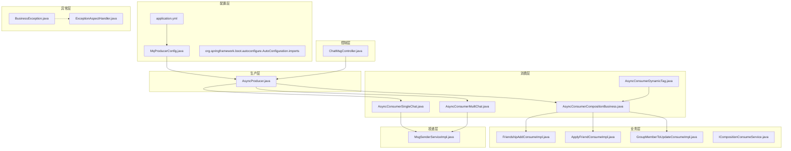
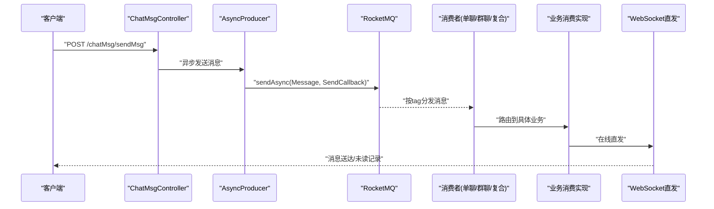
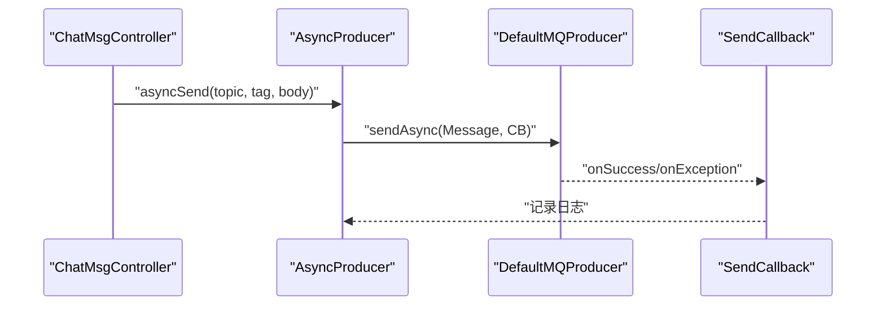
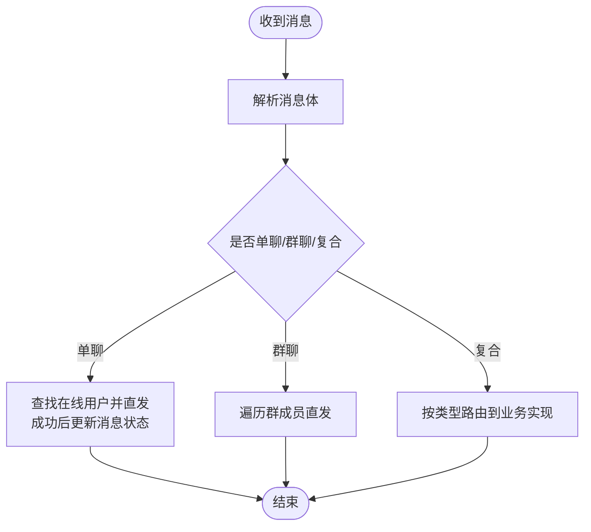
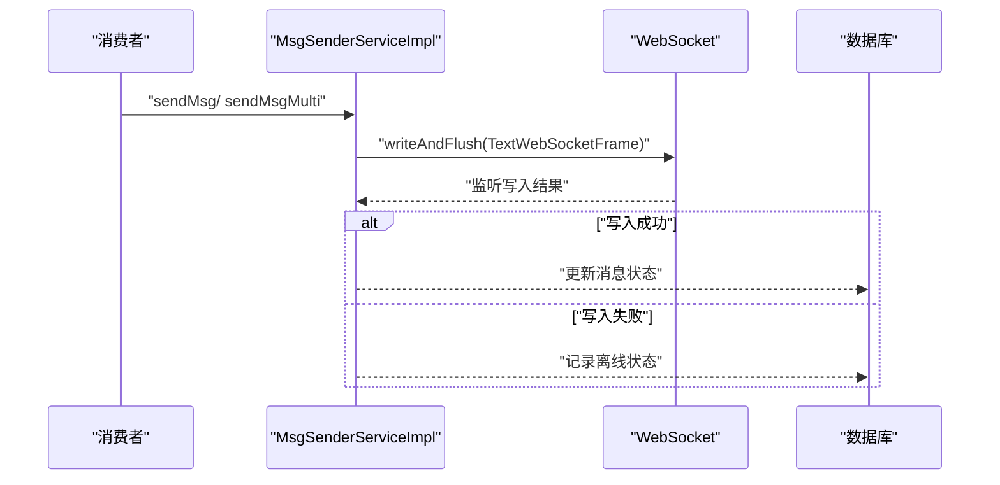
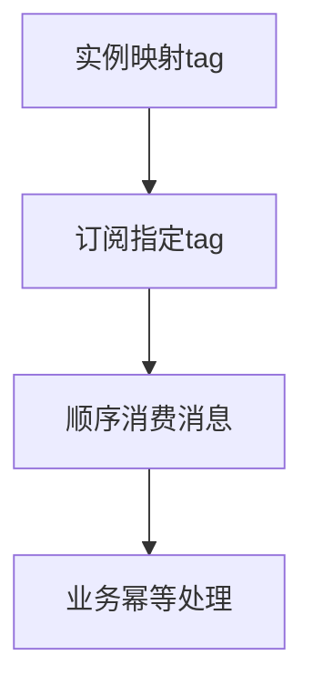
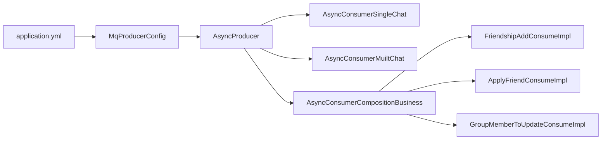

# 消息可靠性保障

<cite>
**本文引用的文件**
- [application.yml](file://src/main/resources/application.yml)
- [MqProducerConfig.java](file://src/main/java/com/hch/chat_simple/mq/MqProducerConfig.java)
- [AsyncProducer.java](file://src/main/java/com/hch/chat_simple/mq/AsyncProducer.java)
- [AsyncConsumerSingleChat.java](file://src/main/java/com/hch/chat_simple/mq/AsyncConsumerSingleChat.java)
- [AsyncConsumerMuiltChat.java](file://src/main/java/com/hch/chat_simple/mq/AsyncConsumerMuiltChat.java)
- [AsyncConsumerCompositionBusiness.java](file://src/main/java/com/hch/chat_simple/mq/AsyncConsumerCompositionBusiness.java)
- [AsyncConsumerDynamicTag.java](file://src/main/java/com/hch/chat_simple/mq/AsyncConsumerDynamicTag.java)
- [MsgSenderServiceImpl.java](file://src/main/java/com/hch/chat_simple/service/impl/MsgSenderServiceImpl.java)
- [ChatMsgController.java](file://src/main/java/com/hch/chat_simple/controller/ChatMsgController.java)
- [BusinessException.java](file://src/main/java/com/hch/chat_simple/exception/BusinessException.java)
- [ExceptionAspectHandler.java](file://src/main/java/com/hch/chat_simple/config/ExceptionAspectHandler.java)
- [FriendshipAddConsumeImpl.java](file://src/main/java/com/hch/chat_simple/service/impl/FriendshipAddConsumeImpl.java)
- [ApplyFriendConsumeImpl.java](file://src/main/java/com/hch/chat_simple/service/impl/ApplyFriendConsumeImpl.java)
- [GroupMemberToUpdateConsumeImpl.java](file://src/main/java/com/hch/chat_simple/service/impl/GroupMemberToUpdateConsumeImpl.java)
- [ICompositionConsumeService.java](file://src/main/java/com/hch/chat_simple/service/ICompositionConsumeService.java)
- [org.springframework.boot.autoconfigure.AutoConfiguration.imports](file://src/main/resources/META-INF/spring/org.springframework.boot.autoconfigure.AutoConfiguration.imports)
</cite>

## 目录
1. [简介](#简介)
2. [项目结构](#项目结构)
3. [核心组件](#核心组件)
4. [架构总览](#架构总览)
5. [组件详解](#组件详解)
6. [依赖关系分析](#依赖关系分析)
7. [性能与可靠性权衡](#性能与可靠性权衡)
8. [故障排查指南](#故障排查指南)
9. [结论](#结论)
10. [附录](#附录)

## 简介
本文件围绕聊天系统中的消息可靠性保障机制展开，系统采用 RocketMQ 作为消息中间件，结合异步生产、动态标签分片、消费端幂等与补偿策略、以及 WebSocket 在线直发等手段，构建从“生产—传输—消费—投递”的全链路可靠性闭环。本文重点覆盖：
- 生产端：异步发送、回调日志、失败兜底
- Broker 端：名称服务器配置、集群部署与高可用（由配置与外部环境决定）
- 消费端：并发消费、动态标签分片、业务幂等与补偿
- 投递端：在线直发、离线落库、未读拉取
- 顺序性：按标签分片的顺序保障策略
- 监控与告警：日志级别与异常切面
- 故障排查：常见问题定位与修复路径

## 项目结构
消息相关模块主要分布在以下包与文件中：
- 配置层：RocketMQ 生产者与消费者配置、应用参数
- 生产层：异步生产者封装
- 消费层：单聊、群聊、复合消息三种消费通道
- 业务层：复合消息分发器与具体业务消费实现
- 投递层：WebSocket 在线直发与离线记录
- 控制层：对外接口入口
- 异常层：统一异常处理与业务异常定义

图表来源
- [application.yml:39-51](file://src/main/resources/application.yml#L39-L51)
- [MqProducerConfig.java:16-28](file://src/main/java/com/hch/chat_simple/mq/MqProducerConfig.java#L16-L28)
- [AsyncProducer.java:40-59](file://src/main/java/com/hch/chat_simple/mq/AsyncProducer.java#L40-L59)
- [AsyncConsumerSingleChat.java:47-73](file://src/main/java/com/hch/chat_simple/mq/AsyncConsumerSingleChat.java#L47-L73)
- [AsyncConsumerMuiltChat.java:57-83](file://src/main/java/com/hch/chat_simple/mq/AsyncConsumerMuiltChat.java#L57-L83)
- [AsyncConsumerCompositionBusiness.java:26-49](file://src/main/java/com/hch/chat_simple/mq/AsyncConsumerCompositionBusiness.java#L26-L49)
- [AsyncConsumerDynamicTag.java:82-199](file://src/main/java/com/hch/chat_simple/mq/AsyncConsumerDynamicTag.java#L82-L199)
- [MsgSenderServiceImpl.java:35-55](file://src/main/java/com/hch/chat_simple/service/impl/MsgSenderServiceImpl.java#L35-L55)
- [ChatMsgController.java:47-49](file://src/main/java/com/hch/chat_simple/controller/ChatMsgController.java#L47-L49)
- [BusinessException.java:3-11](file://src/main/java/com/hch/chat_simple/exception/BusinessException.java#L3-L11)
- [ExceptionAspectHandler.java:16-20](file://src/main/java/com/hch/chat_simple/config/ExceptionAspectHandler.java#L16-L20)

章节来源
- [application.yml:39-51](file://src/main/resources/application.yml#L39-L51)
- [MqProducerConfig.java:16-28](file://src/main/java/com/hch/chat_simple/mq/MqProducerConfig.java#L16-L28)
- [AsyncProducer.java:40-59](file://src/main/java/com/hch/chat_simple/mq/AsyncProducer.java#L40-L59)

## 核心组件
- 生产者配置与启动：通过配置类初始化 DefaultMQProducer，设置名称服务器地址与生产组，并在启动时开启生产者。
- 异步生产者：封装 RocketMQ 异步发送，使用 SendCallback 回调记录成功与异常日志。
- 消费者配置：动态标签分片消费者，按实例与 tag 列表映射订阅不同 tag 的消息，确保同标签消息顺序性。
- 消费端处理器：
  - 单聊消费者：在线直发 WebSocket，成功后更新消息状态。
  - 群聊消费者：遍历群成员在线状态，逐个直发。
  - 复合消息分发器：按消息类型路由到具体业务消费实现。
- 业务消费实现：好友申请、好友通过、群成员变更等，均通过 ChannelSendIfPresentHandler 进行在线投递。
- 投递服务：MsgSenderServiceImpl 提供单发与群发能力，记录接收状态；未在线则离线落库，支持登录后拉取。
- 控制器：对外暴露发送消息接口，调用服务层完成消息落库与生产。

章节来源
- [MqProducerConfig.java:22-28](file://src/main/java/com/hch/chat_simple/mq/MqProducerConfig.java#L22-L28)
- [AsyncProducer.java:40-59](file://src/main/java/com/hch/chat_simple/mq/AsyncProducer.java#L40-L59)
- [AsyncConsumerDynamicTag.java:82-199](file://src/main/java/com/hch/chat_simple/mq/AsyncConsumerDynamicTag.java#L82-L199)
- [AsyncConsumerSingleChat.java:47-73](file://src/main/java/com/hch/chat_simple/mq/AsyncConsumerSingleChat.java#L47-L73)
- [AsyncConsumerMuiltChat.java:57-83](file://src/main/java/com/hch/chat_simple/mq/AsyncConsumerMuiltChat.java#L57-L83)
- [AsyncConsumerCompositionBusiness.java:26-49](file://src/main/java/com/hch/chat_simple/mq/AsyncConsumerCompositionBusiness.java#L26-L49)
- [MsgSenderServiceImpl.java:35-55](file://src/main/java/com/hch/chat_simple/service/impl/MsgSenderServiceImpl.java#L35-L55)
- [ChatMsgController.java:47-49](file://src/main/java/com/hch/chat_simple/controller/ChatMsgController.java#L47-L49)

## 架构总览
系统整体采用“生产—传输—消费—投递”链路，结合 RocketMQ 的动态标签分片与业务幂等，实现高可靠与高性能的消息传递。

图表来源
- [ChatMsgController.java:47-49](file://src/main/java/com/hch/chat_simple/controller/ChatMsgController.java#L47-L49)
- [AsyncProducer.java:40-59](file://src/main/java/com/hch/chat_simple/mq/AsyncProducer.java#L40-L59)
- [AsyncConsumerSingleChat.java:47-73](file://src/main/java/com/hch/chat_simple/mq/AsyncConsumerSingleChat.java#L47-L73)
- [AsyncConsumerMuiltChat.java:57-83](file://src/main/java/com/hch/chat_simple/mq/AsyncConsumerMuiltChat.java#L57-L83)
- [AsyncConsumerCompositionBusiness.java:26-49](file://src/main/java/com/hch/chat_simple/mq/AsyncConsumerCompositionBusiness.java#L26-L49)
- [MsgSenderServiceImpl.java:35-55](file://src/main/java/com/hch/chat_simple/service/impl/MsgSenderServiceImpl.java#L35-L55)

## 组件详解

### 生产端可靠性保障
- 异步发送与回调：使用 RocketMQ 的异步发送接口，通过 SendCallback 记录成功与异常日志，便于后续排查与重试策略制定。
- 生产者配置：设置名称服务器地址与生产组，启动后即可发送消息。
- 失败兜底：捕获 MQClientException、RemotingException、InterruptedException，避免阻塞主流程。

图表来源
- [AsyncProducer.java:40-59](file://src/main/java/com/hch/chat_simple/mq/AsyncProducer.java#L40-L59)
- [MqProducerConfig.java:22-28](file://src/main/java/com/hch/chat_simple/mq/MqProducerConfig.java#L22-L28)

章节来源
- [AsyncProducer.java:40-59](file://src/main/java/com/hch/chat_simple/mq/AsyncProducer.java#L40-L59)
- [MqProducerConfig.java:22-28](file://src/main/java/com/hch/chat_simple/mq/MqProducerConfig.java#L22-L28)

### 消费端可靠性保障
- 动态标签分片：根据实例与 tag 列表映射，每个实例只消费特定 tag 的消息，保证同标签内消息顺序性。
- 并发消费：消费者并发处理消息，降低延迟，同时通过 tag 分片避免跨实例乱序。
- 业务幂等与补偿：
  - 单聊：WebSocket 写入成功后更新消息状态，避免重复投递导致的状态不一致。
  - 群聊：遍历成员逐一投递，未在线则跳过，支持后续离线拉取。
  - 复合消息：按消息类型路由到具体实现，统一通过 ChannelSendIfPresentHandler 进行在线投递。

图表来源
- [AsyncConsumerSingleChat.java:47-73](file://src/main/java/com/hch/chat_simple/mq/AsyncConsumerSingleChat.java#L47-L73)
- [AsyncConsumerMuiltChat.java:57-83](file://src/main/java/com/hch/chat_simple/mq/AsyncConsumerMuiltChat.java#L57-L83)
- [AsyncConsumerCompositionBusiness.java:26-49](file://src/main/java/com/hch/chat_simple/mq/AsyncConsumerCompositionBusiness.java#L26-L49)

章节来源
- [AsyncConsumerSingleChat.java:47-73](file://src/main/java/com/hch/chat_simple/mq/AsyncConsumerSingleChat.java#L47-L73)
- [AsyncConsumerMuiltChat.java:57-83](file://src/main/java/com/hch/chat_simple/mq/AsyncConsumerMuiltChat.java#L57-L83)
- [AsyncConsumerCompositionBusiness.java:26-49](file://src/main/java/com/hch/chat_simple/mq/AsyncConsumerCompositionBusiness.java#L26-L49)

### 投递端可靠性保障
- 在线直发：通过 Netty WebSocket 直接投递，写入成功后记录状态，失败则进入离线流程。
- 离线记录与拉取：未在线用户的消息记录在数据库，登录后可主动拉取未读消息。
- 权限校验：群发前校验用户是否在群内，避免越权投递。

图表来源
- [MsgSenderServiceImpl.java:35-55](file://src/main/java/com/hch/chat_simple/service/impl/MsgSenderServiceImpl.java#L35-L55)
- [AsyncConsumerSingleChat.java:60-67](file://src/main/java/com/hch/chat_simple/mq/AsyncConsumerSingleChat.java#L60-L67)

章节来源
- [MsgSenderServiceImpl.java:35-55](file://src/main/java/com/hch/chat_simple/service/impl/MsgSenderServiceImpl.java#L35-L55)
- [AsyncConsumerSingleChat.java:60-67](file://src/main/java/com/hch/chat_simple/mq/AsyncConsumerSingleChat.java#L60-L67)

### 顺序性保障与处理策略
- 同标签顺序：通过动态标签分片，确保相同 tag 的消息由同一消费者实例顺序消费，天然满足顺序性要求。
- 跨标签乱序：不同 tag 的消息可并发消费，不保证全局顺序，但通过业务幂等与补偿避免影响最终一致性。

图表来源
- [AsyncConsumerDynamicTag.java:82-199](file://src/main/java/com/hch/chat_simple/mq/AsyncConsumerDynamicTag.java#L82-L199)

章节来源
- [AsyncConsumerDynamicTag.java:82-199](file://src/main/java/com/hch/chat_simple/mq/AsyncConsumerDynamicTag.java#L82-L199)

### 死信队列与重试策略
- 当前实现未显式启用死信队列与重试策略。建议在 RocketMQ 管理台或配置中开启重试与死信队列，结合业务幂等实现最终一致性。
- 对于消费异常，建议通过日志与告警系统及时发现并人工介入处理。

章节来源
- [AsyncConsumerSingleChat.java:76-82](file://src/main/java/com/hch/chat_simple/mq/AsyncConsumerSingleChat.java#L76-L82)
- [AsyncConsumerMuiltChat.java:49-55](file://src/main/java/com/hch/chat_simple/mq/AsyncConsumerMuiltChat.java#L49-L55)
- [AsyncConsumerCompositionBusiness.java:26-49](file://src/main/java/com/hch/chat_simple/mq/AsyncConsumerCompositionBusiness.java#L26-L49)

### 监控指标与告警机制
- 日志级别：生产端与消费端均使用 info/error 记录成功与异常，便于集中化日志收集与告警。
- 异常切面：统一处理 TokenExpiredException 等异常，返回标准化响应，便于前端感知与埋点。
- 建议：增加 RocketMQ 监控指标（发送/消费延迟、堆积量、失败率）与告警规则，结合日志平台实现自动告警。

章节来源
- [AsyncProducer.java:46-54](file://src/main/java/com/hch/chat_simple/mq/AsyncProducer.java#L46-L54)
- [ExceptionAspectHandler.java:16-20](file://src/main/java/com/hch/chat_simple/config/ExceptionAspectHandler.java#L16-L20)

## 依赖关系分析
- 配置依赖：application.yml 提供 RocketMQ 名称服务器、生产组、消费者组与 topic 配置；MqProducerConfig 初始化 DefaultMQProducer。
- 生产依赖：AsyncProducer 依赖 DefaultMQProducer，通过异步发送与回调实现可靠性记录。
- 消费依赖：消费者通过注解或动态注册订阅不同 topic 与 tag；复合消息通过接口列表进行路由。
- 业务依赖：复合消息实现类依赖 ChannelSendIfPresentHandler 完成在线投递。

图表来源
- [application.yml:39-51](file://src/main/resources/application.yml#L39-L51)
- [MqProducerConfig.java:22-28](file://src/main/java/com/hch/chat_simple/mq/MqProducerConfig.java#L22-L28)
- [AsyncProducer.java:40-59](file://src/main/java/com/hch/chat_simple/mq/AsyncProducer.java#L40-L59)
- [AsyncConsumerSingleChat.java:47-73](file://src/main/java/com/hch/chat_simple/mq/AsyncConsumerSingleChat.java#L47-L73)
- [AsyncConsumerMuiltChat.java:57-83](file://src/main/java/com/hch/chat_simple/mq/AsyncConsumerMuiltChat.java#L57-L83)
- [AsyncConsumerCompositionBusiness.java:26-49](file://src/main/java/com/hch/chat_simple/mq/AsyncConsumerCompositionBusiness.java#L26-L49)
- [FriendshipAddConsumeImpl.java:27-32](file://src/main/java/com/hch/chat_simple/service/impl/FriendshipAddConsumeImpl.java#L27-L32)
- [ApplyFriendConsumeImpl.java:22-24](file://src/main/java/com/hch/chat_simple/service/impl/ApplyFriendConsumeImpl.java#L22-L24)
- [GroupMemberToUpdateConsumeImpl.java:23-26](file://src/main/java/com/hch/chat_simple/service/impl/GroupMemberToUpdateConsumeImpl.java#L23-L26)

章节来源
- [application.yml:39-51](file://src/main/resources/application.yml#L39-L51)
- [MqProducerConfig.java:22-28](file://src/main/java/com/hch/chat_simple/mq/MqProducerConfig.java#L22-L28)
- [AsyncProducer.java:40-59](file://src/main/java/com/hch/chat_simple/mq/AsyncProducer.java#L40-L59)
- [AsyncConsumerCompositionBusiness.java:26-49](file://src/main/java/com/hch/chat_simple/mq/AsyncConsumerCompositionBusiness.java#L26-L49)

## 性能与可靠性权衡
- 异步发送：提升吞吐，降低 RT，但需配合回调与日志实现可观测性。
- 并发消费：提高处理速度，但需注意幂等与补偿，避免重复投递。
- 标签分片：保证同标签顺序，减少跨实例乱序，但需合理规划 tag 数量与实例数量。
- 在线直发：降低数据库压力，但需考虑网络抖动与客户端离线场景，结合离线记录与拉取机制。

## 故障排查指南
- 生产端异常
  - 现象：回调 onException 日志频繁
  - 排查：检查 RocketMQ 名称服务器连通性、生产组配置、消息体大小限制
  - 解决：修复网络与配置，必要时拆分大消息
- 消费端异常
  - 现象：RuntimeException 或业务异常
  - 排查：查看异常切面对应异常类型与堆栈，定位具体业务实现
  - 解决：完善业务幂等与补偿，增加重试与死信队列
- 投递失败
  - 现象：WebSocket 写入失败
  - 排查：检查用户在线状态、Netty 连接、通道有效性
  - 解决：记录离线状态，登录后拉取未读消息
- 配置问题
  - 现象：消费者无法订阅或路由不到业务实现
  - 排查：核对 application.yml 中 topic 与 tag 配置、消费者组与实例映射
  - 解决：修正配置并重启消费者实例

章节来源
- [AsyncProducer.java:56-58](file://src/main/java/com/hch/chat_simple/mq/AsyncProducer.java#L56-L58)
- [ExceptionAspectHandler.java:16-20](file://src/main/java/com/hch/chat_simple/config/ExceptionAspectHandler.java#L16-L20)
- [AsyncConsumerSingleChat.java:76-82](file://src/main/java/com/hch/chat_simple/mq/AsyncConsumerSingleChat.java#L76-L82)
- [application.yml:39-51](file://src/main/resources/application.yml#L39-L51)

## 结论
本系统通过异步生产、动态标签分片、消费端幂等与补偿、以及 WebSocket 在线直发等手段，构建了较为完善的可靠性保障体系。建议进一步引入 RocketMQ 重试与死信队列、完善监控与告警、并持续优化标签分片与实例规模，以在性能与可靠性之间取得最佳平衡。

## 附录
- 关键配置项参考
  - RocketMQ 名称服务器地址、生产组、消费者组、topic 定义
- 业务接口参考
  - 发送消息接口路径与职责

章节来源
- [application.yml:39-51](file://src/main/resources/application.yml#L39-L51)
- [ChatMsgController.java:47-49](file://src/main/java/com/hch/chat_simple/controller/ChatMsgController.java#L47-L49)