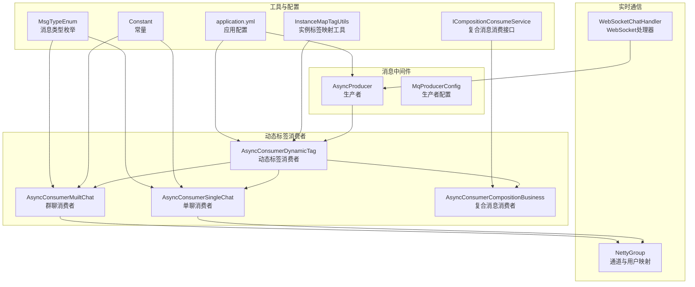
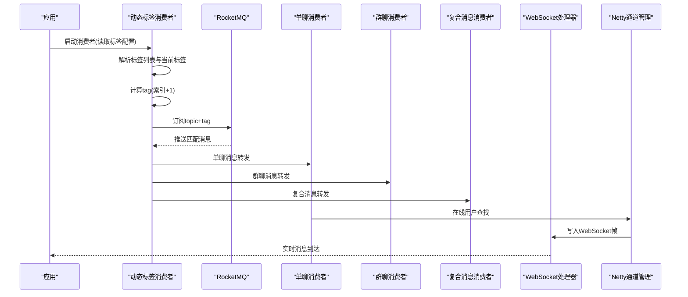
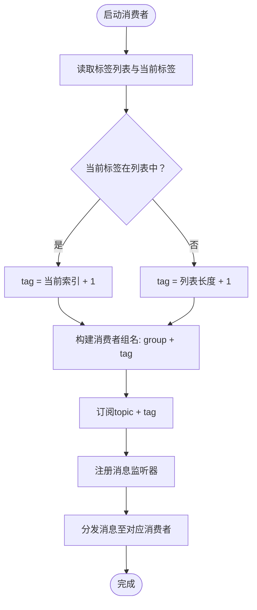
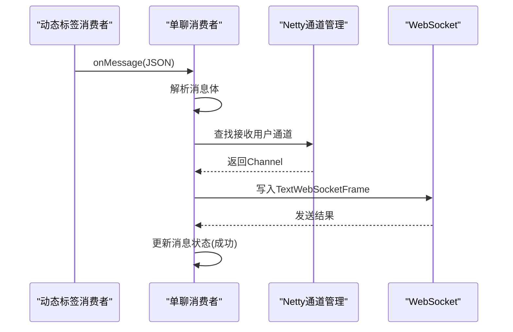
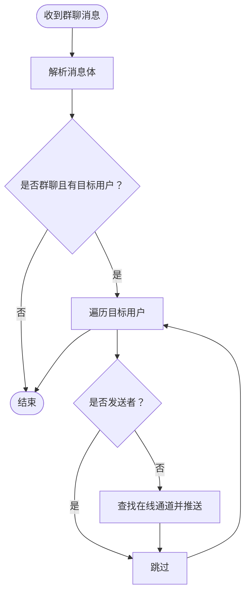
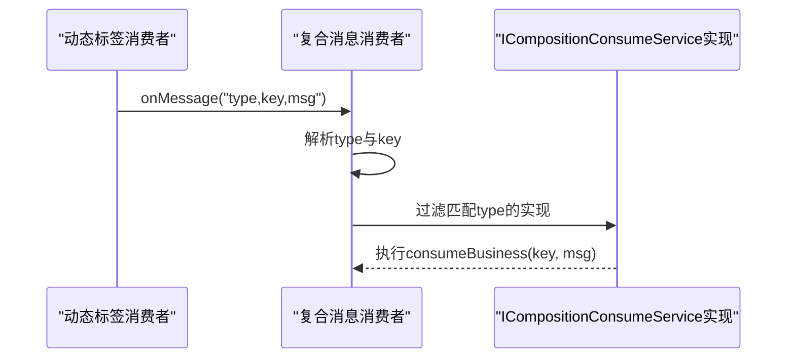
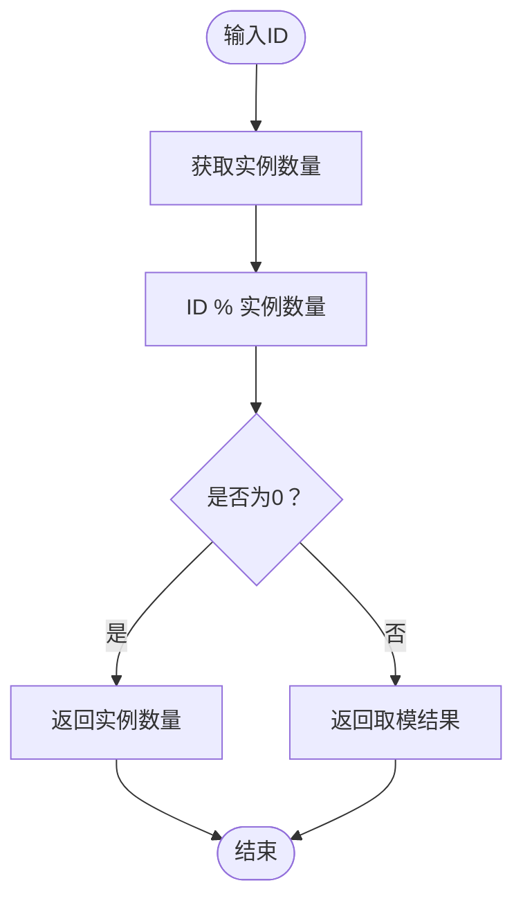
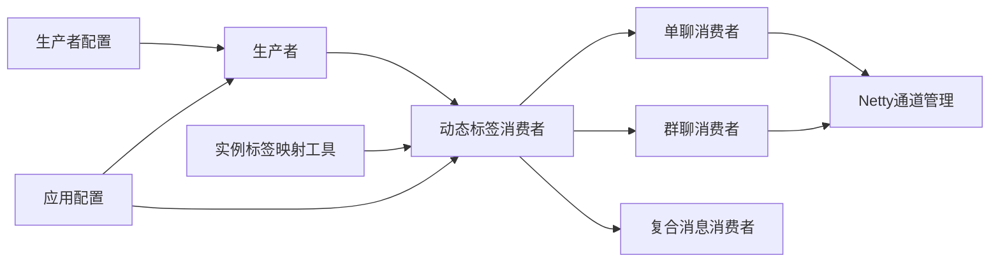

# 动态标签消费者

<cite>
**本文引用的文件**
- [AsyncConsumerDynamicTag.java](file://src/main/java/com/hch/chat_simple/mq/AsyncConsumerDynamicTag.java)
- [AsyncConsumerSingleChat.java](file://src/main/java/com/hch/chat_simple/mq/AsyncConsumerSingleChat.java)
- [AsyncConsumerMuiltChat.java](file://src/main/java/com/hch/chat_simple/mq/AsyncConsumerMuiltChat.java)
- [AsyncConsumerCompositionBusiness.java](file://src/main/java/com/hch/chat_simple/mq/AsyncConsumerCompositionBusiness.java)
- [AsyncProducer.java](file://src/main/java/com/hch/chat_simple/mq/AsyncProducer.java)
- [MqProducerConfig.java](file://src/main/java/com/hch/chat_simple/mq/MqProducerConfig.java)
- [InstanceMapTagUtils.java](file://src/main/java/com/hch/chat_simple/util/InstanceMapTagUtils.java)
- [application.yml](file://src/main/resources/application.yml)
- [WebSocketChatHandler.java](file://src/main/java/com/hch/chat_simple/handler/WebSocketChatHandler.java)
- [NettyGroup.java](file://src/main/java/com/hch/chat_simple/config/NettyGroup.java)
- [Constant.java](file://src/main/java/com/hch/chat_simple/util/Constant.java)
- [MsgTypeEnum.java](file://src/main/java/com/hch/chat_simple/enums/MsgTypeEnum.java)
- [ICompositionConsumeService.java](file://src/main/java/com/hch/chat_simple/service/ICompositionConsumeService.java)
</cite>

## 目录
1. [简介](#简介)
2. [项目结构](#项目结构)
3. [核心组件](#核心组件)
4. [架构总览](#架构总览)
5. [详细组件分析](#详细组件分析)
6. [依赖关系分析](#依赖关系分析)
7. [性能考量](#性能考量)
8. [故障排查指南](#故障排查指南)
9. [结论](#结论)
10. [附录](#附录)

## 简介
本文档围绕动态标签消费者展开，系统性解析 AsyncConsumerDynamicTag 类的标签路由机制，涵盖动态标签生成、消息路由策略、标签匹配算法；详述标签消费者的配置方式、标签规则定义、路由决策过程；阐述动态标签在消息分发中的作用（负载均衡、就近原则、性能优化）；解释标签消费者与业务系统的集成方式（标签同步、状态更新、一致性保证）；并提供监控指标、性能评估与调优建议，以及扩展性设计与高可用保障措施。

## 项目结构
该模块位于消息中间件与实时通信子系统之间，负责基于“动态标签”的消息路由与分发：
- MQ 消费侧：动态标签消费者、单聊/群聊/复合消息消费者
- MQ 生产侧：生产者与生产者配置
- 实时通信侧：WebSocket 处理器与 Netty 通道管理
- 工具与配置：标签映射工具、应用配置、常量与枚举

图表来源
- [AsyncConsumerDynamicTag.java:30-214](file://src/main/java/com/hch/chat_simple/mq/AsyncConsumerDynamicTag.java#L30-L214)
- [AsyncConsumerSingleChat.java:29-83](file://src/main/java/com/hch/chat_simple/mq/AsyncConsumerSingleChat.java#L29-L83)
- [AsyncConsumerMuiltChat.java:31-91](file://src/main/java/com/hch/chat_simple/mq/AsyncConsumerMuiltChat.java#L31-L91)
- [AsyncConsumerCompositionBusiness.java:13-51](file://src/main/java/com/hch/chat_simple/mq/AsyncConsumerCompositionBusiness.java#L13-L51)
- [AsyncProducer.java:15-62](file://src/main/java/com/hch/chat_simple/mq/AsyncProducer.java#L15-L62)
- [MqProducerConfig.java:11-29](file://src/main/java/com/hch/chat_simple/mq/MqProducerConfig.java#L11-L29)
- [WebSocketChatHandler.java:47-196](file://src/main/java/com/hch/chat_simple/handler/WebSocketChatHandler.java#L47-L196)
- [NettyGroup.java:11-29](file://src/main/java/com/hch/chat_simple/config/NettyGroup.java#L11-L29)
- [InstanceMapTagUtils.java:13-54](file://src/main/java/com/hch/chat_simple/util/InstanceMapTagUtils.java#L13-L54)
- [application.yml:39-83](file://src/main/resources/application.yml#L39-L83)
- [Constant.java:3-32](file://src/main/java/com/hch/chat_simple/util/Constant.java#L3-L32)
- [MsgTypeEnum.java:5-24](file://src/main/java/com/hch/chat_simple/enums/MsgTypeEnum.java#L5-L24)
- [ICompositionConsumeService.java:5-10](file://src/main/java/com/hch/chat_simple/service/ICompositionConsumeService.java#L5-L10)

章节来源
- [application.yml:39-83](file://src/main/resources/application.yml#L39-L83)

## 核心组件
- 动态标签消费者：根据当前实例的标签配置，动态计算 MQ 的 tag，并按 tag 订阅对应 topic，完成消息路由与分发。
- 单聊/群聊/复合消息消费者：分别处理不同类型的业务消息，结合 Netty 通道进行实时推送或业务处理。
- 生产者与配置：统一的 RocketMQ 生产者配置与发送封装，支持按 tag 发送消息。
- 实例标签映射工具：提供基于实例数量的取模映射能力，用于消息路由的均匀分布。
- WebSocket 处理器与通道管理：维护用户与通道映射，实现在线消息的实时推送。

章节来源
- [AsyncConsumerDynamicTag.java:30-214](file://src/main/java/com/hch/chat_simple/mq/AsyncConsumerDynamicTag.java#L30-L214)
- [AsyncConsumerSingleChat.java:29-83](file://src/main/java/com/hch/chat_simple/mq/AsyncConsumerSingleChat.java#L29-L83)
- [AsyncConsumerMuiltChat.java:31-91](file://src/main/java/com/hch/chat_simple/mq/AsyncConsumerMuiltChat.java#L31-L91)
- [AsyncConsumerCompositionBusiness.java:13-51](file://src/main/java/com/hch/chat_simple/mq/AsyncConsumerCompositionBusiness.java#L13-L51)
- [AsyncProducer.java:15-62](file://src/main/java/com/hch/chat_simple/mq/AsyncProducer.java#L15-L62)
- [MqProducerConfig.java:11-29](file://src/main/java/com/hch/chat_simple/mq/MqProducerConfig.java#L11-L29)
- [InstanceMapTagUtils.java:13-54](file://src/main/java/com/hch/chat_simple/util/InstanceMapTagUtils.java#L13-L54)
- [WebSocketChatHandler.java:47-196](file://src/main/java/com/hch/chat_simple/handler/WebSocketChatHandler.java#L47-L196)
- [NettyGroup.java:11-29](file://src/main/java/com/hch/chat_simple/config/NettyGroup.java#L11-L29)

## 架构总览
动态标签消费者通过读取应用配置中的标签列表与当前实例标签，计算出一个整型 tag，并以此作为订阅条件从 RocketMQ 拉取消息。消费者启动后，每个实例仅消费与其 tag 匹配的消息，从而实现“按实例标签路由”的负载均衡与就近原则。

图表来源
- [AsyncConsumerDynamicTag.java:82-121](file://src/main/java/com/hch/chat_simple/mq/AsyncConsumerDynamicTag.java#L82-L121)
- [AsyncConsumerSingleChat.java:47-82](file://src/main/java/com/hch/chat_simple/mq/AsyncConsumerSingleChat.java#L47-L82)
- [AsyncConsumerMuiltChat.java:49-83](file://src/main/java/com/hch/chat_simple/mq/AsyncConsumerMuiltChat.java#L49-L83)
- [AsyncConsumerCompositionBusiness.java:26-49](file://src/main/java/com/hch/chat_simple/mq/AsyncConsumerCompositionBusiness.java#L26-L49)
- [WebSocketChatHandler.java:72-109](file://src/main/java/com/hch/chat_simple/handler/WebSocketChatHandler.java#L72-L109)
- [NettyGroup.java:11-29](file://src/main/java/com/hch/chat_simple/config/NettyGroup.java#L11-L29)

## 详细组件分析

### 动态标签消费者（AsyncConsumerDynamicTag）
- 标签生成与匹配
  - 从配置中读取标签列表与当前实例标签。
  - 遍历标签列表，定位当前实例标签所在索引，将索引+1作为最终 tag。
  - 若当前标签不在列表中，则默认使用索引+1，确保 tag 为正整数。
- 路由策略
  - 为每个 topic 创建独立的消费者组名（consumerGroup + tag），以避免相同消费组内的订阅关系不一致。
  - 每个消费者组仅订阅与自身 tag 对应的消息，实现“一对一”路由。
- 消息监听与分发
  - 注册并发消息监听器，遍历消息并调用对应业务消费者处理。
  - 单聊/群聊/复合消息分别交由 AsyncConsumerSingleChat、AsyncConsumerMuiltChat、AsyncConsumerCompositionBusiness 处理。
- 配置要点
  - 名称服务器地址、各 topic 与消费组、标签列表、当前标签等均来自 application.yml。
  - 消费模型采用集群模式，确保消息在同组内不重复消费。

图表来源
- [AsyncConsumerDynamicTag.java:82-121](file://src/main/java/com/hch/chat_simple/mq/AsyncConsumerDynamicTag.java#L82-L121)
- [AsyncConsumerDynamicTag.java:129-163](file://src/main/java/com/hch/chat_simple/mq/AsyncConsumerDynamicTag.java#L129-L163)
- [AsyncConsumerDynamicTag.java:165-199](file://src/main/java/com/hch/chat_simple/mq/AsyncConsumerDynamicTag.java#L165-L199)

章节来源
- [AsyncConsumerDynamicTag.java:30-214](file://src/main/java/com/hch/chat_simple/mq/AsyncConsumerDynamicTag.java#L30-L214)
- [application.yml:39-83](file://src/main/resources/application.yml#L39-L83)

### 单聊消费者（AsyncConsumerSingleChat）
- 业务职责
  - 解析消息体为聊天 DTO，校验消息类型与接收用户 ID。
  - 通过 Netty 通道映射查找在线用户，构造消息类型前缀与 JSON 数据，写入 WebSocket 帧。
  - 发送成功后异步更新消息状态。
- 关键点
  - 使用固定线程池提升并发处理能力。
  - 通过 ChannelGroup 与 Map 维护用户与通道映射，确保只对在线用户推送。

图表来源
- [AsyncConsumerSingleChat.java:47-82](file://src/main/java/com/hch/chat_simple/mq/AsyncConsumerSingleChat.java#L47-L82)
- [NettyGroup.java:11-29](file://src/main/java/com/hch/chat_simple/config/NettyGroup.java#L11-L29)
- [Constant.java:8-11](file://src/main/java/com/hch/chat_simple/util/Constant.java#L8-L11)
- [MsgTypeEnum.java:6-14](file://src/main/java/com/hch/chat_simple/enums/MsgTypeEnum.java#L6-L14)

章节来源
- [AsyncConsumerSingleChat.java:29-83](file://src/main/java/com/hch/chat_simple/mq/AsyncConsumerSingleChat.java#L29-L83)
- [NettyGroup.java:11-29](file://src/main/java/com/hch/chat_simple/config/NettyGroup.java#L11-L29)
- [Constant.java:3-32](file://src/main/java/com/hch/chat_simple/util/Constant.java#L3-L32)
- [MsgTypeEnum.java:5-24](file://src/main/java/com/hch/chat_simple/enums/MsgTypeEnum.java#L5-L24)

### 群聊消费者（AsyncConsumerMuiltChat）
- 业务职责
  - 解析消息体，过滤群聊消息类型与目标用户列表。
  - 遍历目标用户，排除发送者，构造消息并推送到各自在线通道。
- 关键点
  - 使用固定线程池与并发集合，提升批量处理效率。
  - 通过 MyBatis Plus 查询群成员，确保仅向有效成员推送。

图表来源
- [AsyncConsumerMuiltChat.java:57-83](file://src/main/java/com/hch/chat_simple/mq/AsyncConsumerMuiltChat.java#L57-L83)

章节来源
- [AsyncConsumerMuiltChat.java:31-91](file://src/main/java/com/hch/chat_simple/mq/AsyncConsumerMuiltChat.java#L31-L91)

### 复合消息消费者（AsyncConsumerCompositionBusiness）
- 业务职责
  - 解析复合消息协议（消息类型,频道键,消息体），按消息类型路由到对应业务消费实现。
  - 通过接口列表动态匹配并执行消费逻辑。
- 关键点
  - 协议约定与正则校验确保消息格式正确。
  - 基于枚举类型进行精确匹配，保证路由准确性。

图表来源
- [AsyncConsumerCompositionBusiness.java:26-49](file://src/main/java/com/hch/chat_simple/mq/AsyncConsumerCompositionBusiness.java#L26-L49)
- [ICompositionConsumeService.java:5-10](file://src/main/java/com/hch/chat_simple/service/ICompositionConsumeService.java#L5-L10)

章节来源
- [AsyncConsumerCompositionBusiness.java:13-51](file://src/main/java/com/hch/chat_simple/mq/AsyncConsumerCompositionBusiness.java#L13-L51)
- [ICompositionConsumeService.java:5-10](file://src/main/java/com/hch/chat_simple/service/ICompositionConsumeService.java#L5-L10)

### 实例标签映射工具（InstanceMapTagUtils）
- 作用
  - 提供基于实例数量的取模映射，用于消息路由的均匀分布。
  - 支持单用户与群组用户的标签映射分组。
- 关键点
  - 通过静态内部类保存实例数量，避免重复计算。
  - 取模结果为 0 时映射到最大标签值，确保标签连续性。

图表来源
- [InstanceMapTagUtils.java:32-47](file://src/main/java/com/hch/chat_simple/util/InstanceMapTagUtils.java#L32-L47)

章节来源
- [InstanceMapTagUtils.java:13-54](file://src/main/java/com/hch/chat_simple/util/InstanceMapTagUtils.java#L13-L54)

### 生产者与配置（AsyncProducer、MqProducerConfig）
- 作用
  - 统一 RocketMQ 生产者配置与发送封装，支持按 topic 与 tag 发送消息。
- 关键点
  - 生产者组与名称服务器地址来自配置。
  - 发送回调记录成功与异常日志，便于监控与排障。

章节来源
- [AsyncProducer.java:15-62](file://src/main/java/com/hch/chat_simple/mq/AsyncProducer.java#L15-L62)
- [MqProducerConfig.java:11-29](file://src/main/java/com/hch/chat_simple/mq/MqProducerConfig.java#L11-L29)
- [application.yml:39-47](file://src/main/resources/application.yml#L39-L47)

### WebSocket 处理器与通道管理（WebSocketChatHandler、NettyGroup）
- 作用
  - 维护用户与通道映射，实现用户上线/下线与消息推送。
- 关键点
  - 通过 ChannelGroup 管理全局通道，Map 维护用户到 ChannelId 的映射。
  - 在握手完成后将用户信息写入通道属性，便于后续消息路由。

章节来源
- [WebSocketChatHandler.java:47-196](file://src/main/java/com/hch/chat_simple/handler/WebSocketChatHandler.java#L47-L196)
- [NettyGroup.java:11-29](file://src/main/java/com/hch/chat_simple/config/NettyGroup.java#L11-L29)

## 依赖关系分析
- 组件耦合
  - 动态标签消费者依赖配置与工具，同时依赖具体业务消费者进行消息分发。
  - 业务消费者依赖 Netty 通道管理与服务层，实现消息的实时推送与持久化。
  - 生产者依赖消费者配置与 RocketMQ 客户端，负责消息的可靠投递。
- 外部依赖
  - RocketMQ：消息中间件，提供发布/订阅与集群消费模型。
  - Netty：网络框架，提供 WebSocket 会话管理与消息推送。
  - Spring Boot：自动装配与配置管理，简化组件初始化。

图表来源
- [AsyncConsumerDynamicTag.java:56-66](file://src/main/java/com/hch/chat_simple/mq/AsyncConsumerDynamicTag.java#L56-L66)
- [AsyncProducer.java:19-28](file://src/main/java/com/hch/chat_simple/mq/AsyncProducer.java#L19-L28)
- [MqProducerConfig.java:16-20](file://src/main/java/com/hch/chat_simple/mq/MqProducerConfig.java#L16-L20)
- [InstanceMapTagUtils.java:16-26](file://src/main/java/com/hch/chat_simple/util/InstanceMapTagUtils.java#L16-L26)
- [application.yml:39-83](file://src/main/resources/application.yml#L39-L83)

章节来源
- [AsyncConsumerDynamicTag.java:30-214](file://src/main/java/com/hch/chat_simple/mq/AsyncConsumerDynamicTag.java#L30-L214)
- [AsyncProducer.java:15-62](file://src/main/java/com/hch/chat_simple/mq/AsyncProducer.java#L15-L62)
- [MqProducerConfig.java:11-29](file://src/main/java/com/hch/chat_simple/mq/MqProducerConfig.java#L11-L29)
- [InstanceMapTagUtils.java:13-54](file://src/main/java/com/hch/chat_simple/util/InstanceMapTagUtils.java#L13-L54)
- [application.yml:39-83](file://src/main/resources/application.yml#L39-L83)

## 性能考量
- 路由策略
  - 通过“实例标签 + topic + tag”的组合，实现按实例路由，天然具备负载均衡与就近原则。
  - 消费组名随 tag 变化，避免订阅关系不一致导致的重复消费。
- 并发与线程池
  - 业务消费者使用固定大小线程池，限制并发度并避免资源争用。
  - WebSocket 写入采用异步回调更新消息状态，降低阻塞风险。
- 网络与序列化
  - 使用 Netty 管理通道，减少上下文切换与内存拷贝。
  - JSON 序列化与反序列化在业务层集中处理，避免重复转换。
- 监控与可观测性
  - 生产者发送回调记录成功与异常日志，便于监控与告警。
  - 消费者日志记录 topic、tag 与消息处理情况，辅助问题定位。

[本节为通用性能讨论，无需特定文件来源]

## 故障排查指南
- 标签不匹配
  - 现象：消费者未收到消息或收到错误消息。
  - 排查：确认 chat.tag.list 与 chat.tag.current 配置是否一致；检查动态标签计算逻辑。
  - 参考路径：[AsyncConsumerDynamicTag.java:82-121](file://src/main/java/com/hch/chat_simple/mq/AsyncConsumerDynamicTag.java#L82-L121)
- 消费组订阅不一致
  - 现象：同组内消息重复消费或丢失。
  - 排查：确保相同消费组的订阅关系与消费逻辑一致；动态标签消费者已通过“组名+tag”规避此问题。
  - 参考路径：[AsyncConsumerDynamicTag.java:99-101](file://src/main/java/com/hch/chat_simple/mq/AsyncConsumerDynamicTag.java#L99-L101)
- 在线用户未推送
  - 现象：消息发送成功但用户未收到。
  - 排查：检查 Netty 通道映射是否正确；确认用户上线事件是否触发；验证 WebSocket 写入是否成功。
  - 参考路径：[WebSocketChatHandler.java:118-163](file://src/main/java/com/hch/chat_simple/handler/WebSocketChatHandler.java#L118-L163)，[NettyGroup.java:11-29](file://src/main/java/com/hch/chat_simple/config/NettyGroup.java#L11-L29)
- 复合消息未路由
  - 现象：复合消息未被任何实现消费。
  - 排查：检查消息协议格式与消息类型枚举；确认实现类是否注册为 Spring 组件。
  - 参考路径：[AsyncConsumerCompositionBusiness.java:26-49](file://src/main/java/com/hch/chat_simple/mq/AsyncConsumerCompositionBusiness.java#L26-L49)，[ICompositionConsumeService.java:5-10](file://src/main/java/com/hch/chat_simple/service/ICompositionConsumeService.java#L5-L10)
- 生产者异常
  - 现象：消息发送异常或超时。
  - 排查：检查 RocketMQ 名称服务器地址与生产者组配置；查看发送回调日志。
  - 参考路径：[AsyncProducer.java:40-59](file://src/main/java/com/hch/chat_simple/mq/AsyncProducer.java#L40-L59)，[MqProducerConfig.java:22-28](file://src/main/java/com/hch/chat_simple/mq/MqProducerConfig.java#L22-L28)，[application.yml:39-47](file://src/main/resources/application.yml#L39-L47)

章节来源
- [AsyncConsumerDynamicTag.java:82-121](file://src/main/java/com/hch/chat_simple/mq/AsyncConsumerDynamicTag.java#L82-L121)
- [WebSocketChatHandler.java:118-163](file://src/main/java/com/hch/chat_simple/handler/WebSocketChatHandler.java#L118-L163)
- [NettyGroup.java:11-29](file://src/main/java/com/hch/chat_simple/config/NettyGroup.java#L11-L29)
- [AsyncConsumerCompositionBusiness.java:26-49](file://src/main/java/com/hch/chat_simple/mq/AsyncConsumerCompositionBusiness.java#L26-L49)
- [ICompositionConsumeService.java:5-10](file://src/main/java/com/hch/chat_simple/service/ICompositionConsumeService.java#L5-L10)
- [AsyncProducer.java:40-59](file://src/main/java/com/hch/chat_simple/mq/AsyncProducer.java#L40-L59)
- [MqProducerConfig.java:22-28](file://src/main/java/com/hch/chat_simple/mq/MqProducerConfig.java#L22-L28)
- [application.yml:39-47](file://src/main/resources/application.yml#L39-L47)

## 结论
动态标签消费者通过“标签列表 + 当前标签”的组合，计算出唯一的整型 tag，并以此作为 RocketMQ 的订阅条件，实现按实例路由的消息分发。该方案具备良好的负载均衡与就近原则，配合固定线程池与 Netty 通道管理，能够满足高并发场景下的实时消息推送需求。通过统一的生产者配置与日志监控，系统具备较好的可观测性与可维护性。未来可在标签同步、状态更新与一致性保障方面进一步增强，以支撑更大规模的部署与更复杂的业务场景。

[本节为总结性内容，无需特定文件来源]

## 附录
- 配置项参考
  - RocketMQ 名称服务器、生产者组、消费者组、topic 配置
  - 动态标签列表、本地开关、当前标签
- 常用枚举与常量
  - 消息类型枚举、聊天类型常量、消息状态常量

章节来源
- [application.yml:39-83](file://src/main/resources/application.yml#L39-L83)
- [MsgTypeEnum.java:5-24](file://src/main/java/com/hch/chat_simple/enums/MsgTypeEnum.java#L5-L24)
- [Constant.java:3-32](file://src/main/java/com/hch/chat_simple/util/Constant.java#L3-L32)