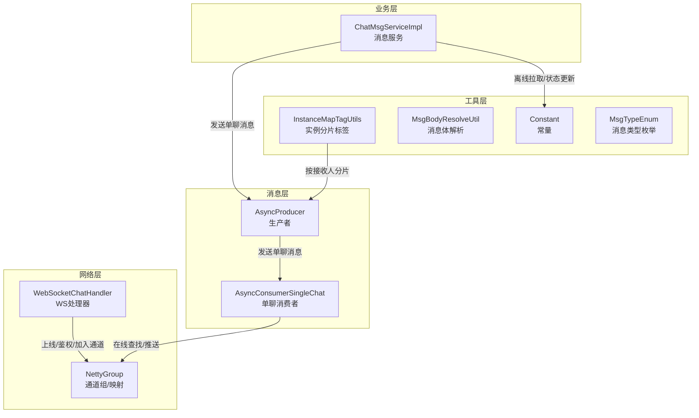
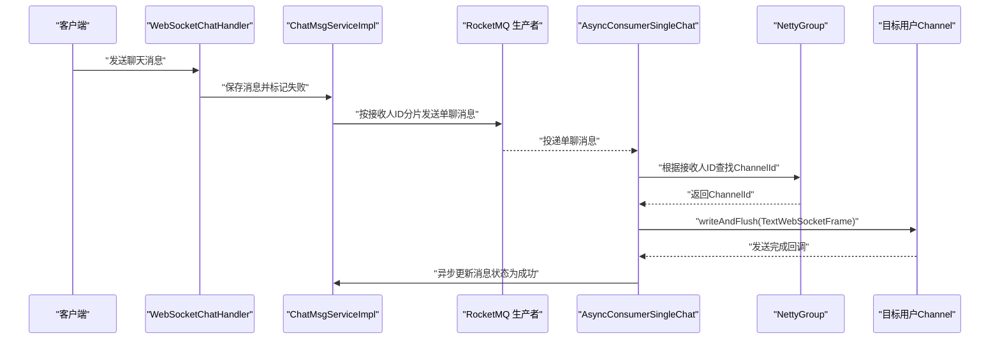
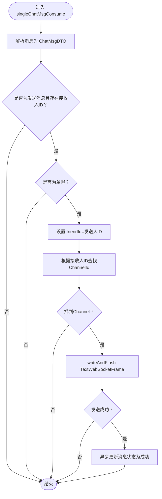
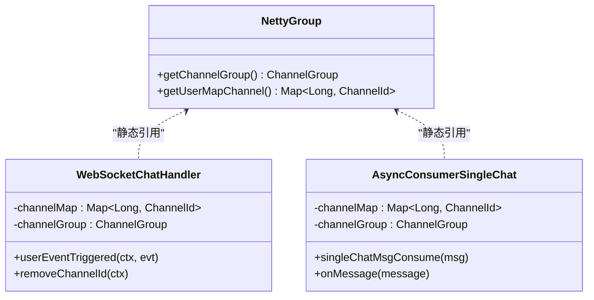
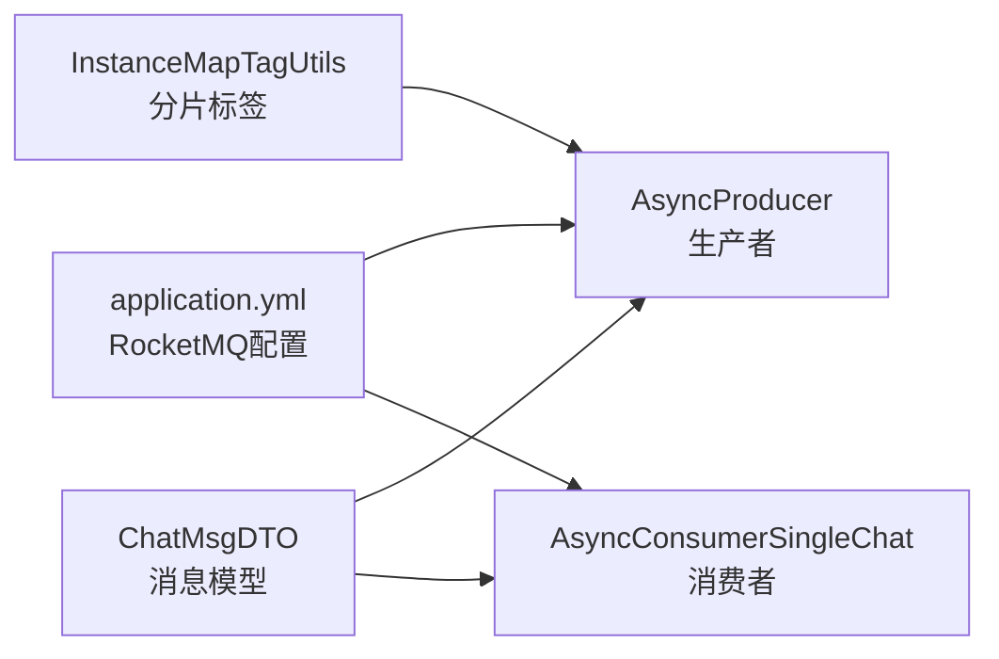

# 单聊消息消费者

<cite>
**本文引用的文件**
- [AsyncConsumerSingleChat.java](file://src/main/java/com/hch/chat_simple/mq/AsyncConsumerSingleChat.java)
- [NettyGroup.java](file://src/main/java/com/hch/chat_simple/config/NettyGroup.java)
- [WebSocketChatHandler.java](file://src/main/java/com/hch/chat_simple/handler/WebSocketChatHandler.java)
- [ChatMsgServiceImpl.java](file://src/main/java/com/hch/chat_simple/service/impl/ChatMsgServiceImpl.java)
- [MsgBodyResolveUtil.java](file://src/main/java/com/hch/chat_simple/util/MsgBodyResolveUtil.java)
- [ChatMsgDTO.java](file://src/main/java/com/hch/chat_simple/pojo/dto/ChatMsgDTO.java)
- [MsgTypeEnum.java](file://src/main/java/com/hch/chat_simple/enums/MsgTypeEnum.java)
- [Constant.java](file://src/main/java/com/hch/chat_simple/util/Constant.java)
- [application.yml](file://src/main/resources/application.yml)
- [AsyncProducer.java](file://src/main/java/com/hch/chat_simple/mq/AsyncProducer.java)
- [MqProducerConfig.java](file://src/main/java/com/hch/chat_simple/mq/MqProducerConfig.java)
- [InstanceMapTagUtils.java](file://src/main/java/com/hch/chat_simple/util/InstanceMapTagUtils.java)
- [ChannelSendIfPresentHandler.java](file://src/main/java/com/hch/chat_simple/handler/ChannelSendIfPresentHandler.java)
</cite>

## 目录
1. [简介](#简介)
2. [项目结构](#项目结构)
3. [核心组件](#核心组件)
4. [架构总览](#架构总览)
5. [详细组件分析](#详细组件分析)
6. [依赖分析](#依赖分析)
7. [性能考虑](#性能考虑)
8. [故障排查指南](#故障排查指南)
9. [结论](#结论)
10. [附录](#附录)

## 简介
本文档围绕单聊消息消费者 AsyncConsumerSingleChat 的实现机制展开，系统性解析以下方面：
- 消息监听与消费流程：消息解析、在线用户查找、WebSocket 推送、状态更新
- Netty 连接管理：ChannelMap 用户映射、ChannelGroup 通道组、并发线程池策略
- 幂等性与异常处理：当前实现的不足与改进建议
- 性能优化与监控指标：吞吐、延迟、队列积压、连接健康度
- 常见问题排查与故障恢复策略

## 项目结构
本项目采用分层+功能域划分的组织方式：
- mq：消息中间件相关（生产者、消费者）
- handler：Netty WebSocket 处理器
- service：业务服务层
- config：全局配置（Netty 通道组、拦截器等）
- util：通用工具（常量、消息体解析、实例分片标签等）
- pojo：数据传输对象与持久化对象
- resources：Spring 配置、MyBatis Mapper XML、日志配置

图表来源
- [AsyncConsumerSingleChat.java:36-84](file://src/main/java/com/hch/chat_simple/mq/AsyncConsumerSingleChat.java#L36-L84)
- [WebSocketChatHandler.java:50-196](file://src/main/java/com/hch/chat_simple/handler/WebSocketChatHandler.java#L50-L196)
- [NettyGroup.java:11-30](file://src/main/java/com/hch/chat_simple/config/NettyGroup.java#L11-L30)
- [ChatMsgServiceImpl.java:53-184](file://src/main/java/com/hch/chat_simple/service/impl/ChatMsgServiceImpl.java#L53-L184)
- [InstanceMapTagUtils.java:13-55](file://src/main/java/com/hch/chat_simple/util/InstanceMapTagUtils.java#L13-L55)
- [MsgBodyResolveUtil.java:10-74](file://src/main/java/com/hch/chat_simple/util/MsgBodyResolveUtil.java#L10-L74)
- [Constant.java:3-33](file://src/main/java/com/hch/chat_simple/util/Constant.java#L3-L33)
- [MsgTypeEnum.java:6-25](file://src/main/java/com/hch/chat_simple/enums/MsgTypeEnum.java#L6-L25)

章节来源
- [application.yml:39-51](file://src/main/resources/application.yml#L39-L51)

## 核心组件
- AsyncConsumerSingleChat：单聊消息消费者，负责从 RocketMQ 拉取消息、解析、在线查找、WebSocket 推送、成功后异步更新消息状态
- NettyGroup：全局 ChannelGroup 和用户到 ChannelId 的映射，提供静态访问入口
- WebSocketChatHandler：WebSocket 会话建立、鉴权、上线加入通道、下线移除通道
- ChatMsgServiceImpl：消息服务，负责消息入库、状态标记、按接收人分片发送到 RocketMQ
- InstanceMapTagUtils：基于接收人 ID 的实例分片标签计算，确保同用户的消息路由到同一消费者实例
- ChannelSendIfPresentHandler：封装“存在即推送”的通用逻辑，减少重复代码
- MsgBodyResolveUtil：消息体解析工具（当前单聊消费者未直接使用）

章节来源
- [AsyncConsumerSingleChat.java:36-84](file://src/main/java/com/hch/chat_simple/mq/AsyncConsumerSingleChat.java#L36-L84)
- [NettyGroup.java:11-30](file://src/main/java/com/hch/chat_simple/config/NettyGroup.java#L11-L30)
- [WebSocketChatHandler.java:50-196](file://src/main/java/com/hch/chat_simple/handler/WebSocketChatHandler.java#L50-L196)
- [ChatMsgServiceImpl.java:53-184](file://src/main/java/com/hch/chat_simple/service/impl/ChatMsgServiceImpl.java#L53-L184)
- [InstanceMapTagUtils.java:13-55](file://src/main/java/com/hch/chat_simple/util/InstanceMapTagUtils.java#L13-L55)
- [ChannelSendIfPresentHandler.java:14-34](file://src/main/java/com/hch/chat_simple/handler/ChannelSendIfPresentHandler.java#L14-L34)
- [MsgBodyResolveUtil.java:10-74](file://src/main/java/com/hch/chat_simple/util/MsgBodyResolveUtil.java#L10-L74)

## 架构总览
单聊消息从产生到送达的端到端路径如下：
- 客户端通过 WebSocket 发送消息，服务端写入数据库并标记“发送失败”
- 业务服务将消息按接收人 ID 分片发送至 RocketMQ 单聊 Topic
- 单聊消费者订阅该 Topic，按 Tag 路由到对应实例
- 消费者解析消息，查询在线用户映射，找到目标用户的 Channel
- 通过 Netty 写入并刷新消息帧；发送成功后异步更新消息状态为“发送成功”

图表来源
- [WebSocketChatHandler.java:72-109](file://src/main/java/com/hch/chat_simple/handler/WebSocketChatHandler.java#L72-L109)
- [ChatMsgServiceImpl.java:97-144](file://src/main/java/com/hch/chat_simple/service/impl/ChatMsgServiceImpl.java#L97-L144)
- [AsyncConsumerSingleChat.java:47-73](file://src/main/java/com/hch/chat_simple/mq/AsyncConsumerSingleChat.java#L47-L73)
- [NettyGroup.java:11-30](file://src/main/java/com/hch/chat_simple/config/NettyGroup.java#L11-L30)

## 详细组件分析

### AsyncConsumerSingleChat 组件分析
- 消息监听与消费
  - 当前以方法 onMessage 包裹 singleChatMsgConsume，内部解析 JSON 为 ChatMsgDTO
  - 仅处理“发送消息”类型且存在接收人 ID 的场景
  - 对单聊类型进行处理，设置 friendId 为发送人 ID
- 在线用户查找与推送
  - 通过 NettyGroup 的静态映射获取接收人的 ChannelId
  - 在 ChannelGroup 中查找 Channel，若存在则写入并刷新 TextWebSocketFrame
  - 发送成功后，异步更新消息状态为“发送成功”
- 并发与线程池
  - 使用固定大小线程池执行消费逻辑，避免阻塞 RocketMQ 消费线程
- 异常处理
  - onMessage 捕获异常并抛出运行时异常，便于上层统一处理

图表来源
- [AsyncConsumerSingleChat.java:47-73](file://src/main/java/com/hch/chat_simple/mq/AsyncConsumerSingleChat.java#L47-L73)
- [NettyGroup.java:22-26](file://src/main/java/com/hch/chat_simple/config/NettyGroup.java#L22-L26)
- [ChatMsgServiceImpl.java:119-124](file://src/main/java/com/hch/chat_simple/service/impl/ChatMsgServiceImpl.java#L119-L124)

章节来源
- [AsyncConsumerSingleChat.java:36-84](file://src/main/java/com/hch/chat_simple/mq/AsyncConsumerSingleChat.java#L36-L84)

### Netty 连接管理机制
- ChannelGroup 管理
  - 全局 ChannelGroup 统一维护所有活跃 WebSocket 连接
  - 提供按 ChannelId 查找 Channel 的能力
- 用户映射
  - 使用并发 Map 维护用户 ID 到 ChannelId 的映射
  - 登录鉴权成功后，将用户加入映射与 ChannelGroup
  - 空闲事件触发或异常时，移除用户映射与 ChannelGroup 中的连接
- 并发线程池
  - 消费者与处理器均使用固定大小线程池，避免阻塞 IO 线程

图表来源
- [NettyGroup.java:11-30](file://src/main/java/com/hch/chat_simple/config/NettyGroup.java#L11-L30)
- [WebSocketChatHandler.java:50-196](file://src/main/java/com/hch/chat_simple/handler/WebSocketChatHandler.java#L50-L196)
- [AsyncConsumerSingleChat.java:36-84](file://src/main/java/com/hch/chat_simple/mq/AsyncConsumerSingleChat.java#L36-L84)

章节来源
- [WebSocketChatHandler.java:118-175](file://src/main/java/com/hch/chat_simple/handler/WebSocketChatHandler.java#L118-L175)
- [NettyGroup.java:11-30](file://src/main/java/com/hch/chat_simple/config/NettyGroup.java#L11-L30)

### 消息消费流程详解
- 消息解析
  - 使用 JSON 解析字符串为 ChatMsgDTO
- 用户在线状态检查
  - 通过接收人 ID 在用户映射中查找 ChannelId
  - 在 ChannelGroup 中定位 Channel
- 消息转发给目标用户
  - 将消息封装为 TextWebSocketFrame 并写入 Channel
- 发送成功后的状态更新
  - 通过 ChannelFuture 回调判断发送成功
  - 调用消息服务更新消息状态为“发送成功”

章节来源
- [AsyncConsumerSingleChat.java:47-73](file://src/main/java/com/hch/chat_simple/mq/AsyncConsumerSingleChat.java#L47-L73)
- [ChatMsgServiceImpl.java:97-144](file://src/main/java/com/hch/chat_simple/service/impl/ChatMsgServiceImpl.java#L97-L144)

### 幂等性与异常处理
- 幂等性现状
  - 当前未对重复消息进行去重处理，存在重复消费风险
  - 建议引入消息 ID 去重、Redis 去重键或 RocketMQ 消息去重
- 异常处理现状
  - onMessage 捕获异常并抛出运行时异常，便于 RocketMQ 重试
  - 建议区分可重试与不可重试异常，合理配置重试次数与死信队列
- 状态一致性
  - 发送成功后再更新状态，避免“先更新后发送”的不一致
  - 建议增加补偿机制：定时扫描“发送失败”消息并重推

章节来源
- [AsyncConsumerSingleChat.java:76-82](file://src/main/java/com/hch/chat_simple/mq/AsyncConsumerSingleChat.java#L76-L82)
- [ChatMsgServiceImpl.java:71-95](file://src/main/java/com/hch/chat_simple/service/impl/ChatMsgServiceImpl.java#L71-L95)

## 依赖分析
- RocketMQ 配置
  - 生产者组、消费者组、单聊 Topic 名称在配置文件中定义
  - 消费者订阅单聊 Topic，按 Tag 路由到不同实例
- 实例分片
  - 通过接收人 ID 取模确定 Tag，确保同用户的消息落到同一消费者实例
- 消息模型
  - ChatMsgDTO 描述消息字段，包含消息类型、聊天类型、发送/接收人、内容、时间戳等

图表来源
- [application.yml:39-51](file://src/main/resources/application.yml#L39-L51)
- [AsyncProducer.java:17-44](file://src/main/java/com/hch/chat_simple/mq/AsyncProducer.java#L17-L44)
- [MqProducerConfig.java:13-30](file://src/main/java/com/hch/chat_simple/mq/MqProducerConfig.java#L13-L30)
- [InstanceMapTagUtils.java:32-47](file://src/main/java/com/hch/chat_simple/util/InstanceMapTagUtils.java#L32-L47)
- [ChatMsgDTO.java:13-62](file://src/main/java/com/hch/chat_simple/pojo/dto/ChatMsgDTO.java#L13-L62)

章节来源
- [application.yml:39-51](file://src/main/resources/application.yml#L39-L51)
- [InstanceMapTagUtils.java:13-55](file://src/main/java/com/hch/chat_simple/util/InstanceMapTagUtils.java#L13-L55)
- [ChatMsgDTO.java:13-62](file://src/main/java/com/hch/chat_simple/pojo/dto/ChatMsgDTO.java#L13-L62)

## 性能考虑
- 吞吐与延迟
  - 使用固定线程池处理消费，避免阻塞 RocketMQ 消费线程
  - WebSocket 写入采用 writeAndFlush，减少多次 flush 的开销
- 连接与内存
  - ChannelGroup 维护所有连接，注意空闲连接清理与资源释放
  - 用户映射为并发 Map，读多写少场景下具备较好性能
- 分片与扩展
  - 按接收人 ID 分片，提升水平扩展能力
  - Tag 数量应与消费者实例数匹配，避免热点
- 监控指标建议
  - RocketMQ：消息积压、消费速率、重试次数、死信数量
  - Netty：活跃连接数、消息发送成功率、平均发送耗时
  - 应用：消息入库耗时、状态更新耗时、异常率

[本节为通用性能讨论，无需具体文件分析]

## 故障排查指南
- 常见问题
  - 接收人不在线：消息不会被推送，需确认用户是否已鉴权并加入 ChannelGroup
  - Token 失效：鉴权阶段无法解析用户信息，导致未加入映射
  - 空闲断连：IdleStateEvent 导致移除映射，需重新握手
  - RocketMQ 投递失败：检查生产者配置、NameServer 地址、Topic/Tag 设置
- 排查步骤
  - 核对 application.yml 中 RocketMQ 与 Topic 配置
  - 检查 WebSocketChatHandler 的鉴权与加入映射逻辑
  - 观察 AsyncConsumerSingleChat 的 Channel 查找与写入流程
  - 关注 ChannelFuture 回调，确认发送成功后状态更新
- 故障恢复策略
  - 引入补偿任务：定时扫描“发送失败”消息并重推
  - 增加重试与死信队列策略，避免无限重试
  - 对重复消息进行去重，降低无效推送

章节来源
- [WebSocketChatHandler.java:118-175](file://src/main/java/com/hch/chat_simple/handler/WebSocketChatHandler.java#L118-L175)
- [AsyncConsumerSingleChat.java:47-73](file://src/main/java/com/hch/chat_simple/mq/AsyncConsumerSingleChat.java#L47-L73)
- [application.yml:39-51](file://src/main/resources/application.yml#L39-L51)

## 结论
AsyncConsumerSingleChat 通过 RocketMQ 与 Netty 的组合，实现了单聊消息的可靠投递与实时推送。当前实现具备清晰的消费流程与基础的异常处理，但在幂等性、补偿与监控方面仍有改进空间。结合实例分片与 ChannelGroup 管理，系统具备良好的扩展性与稳定性基础。

[本节为总结，无需具体文件分析]

## 附录
- 关键配置项
  - RocketMQ 生产者组、消费者组、单聊 Topic
  - 实例分片标签列表与当前实例标识
- 数据模型
  - ChatMsgDTO 字段与消息类型枚举
- 工具类
  - InstanceMapTagUtils：按接收人 ID 计算 Tag
  - MsgBodyResolveUtil：消息体解析（当前未在单聊消费者中使用）

章节来源
- [application.yml:39-83](file://src/main/resources/application.yml#L39-L83)
- [ChatMsgDTO.java:13-62](file://src/main/java/com/hch/chat_simple/pojo/dto/ChatMsgDTO.java#L13-L62)
- [MsgTypeEnum.java:6-25](file://src/main/java/com/hch/chat_simple/enums/MsgTypeEnum.java#L6-L25)
- [InstanceMapTagUtils.java:13-55](file://src/main/java/com/hch/chat_simple/util/InstanceMapTagUtils.java#L13-L55)
- [MsgBodyResolveUtil.java:10-74](file://src/main/java/com/hch/chat_simple/util/MsgBodyResolveUtil.java#L10-L74)