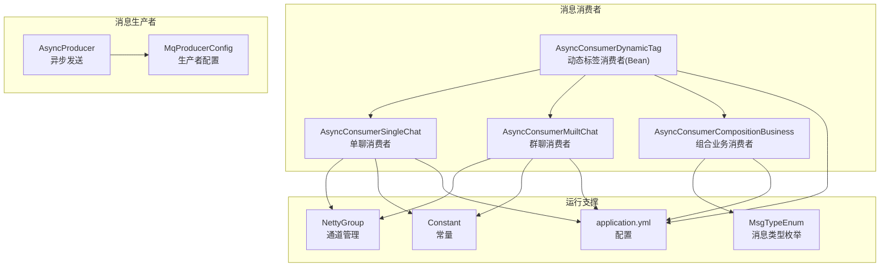
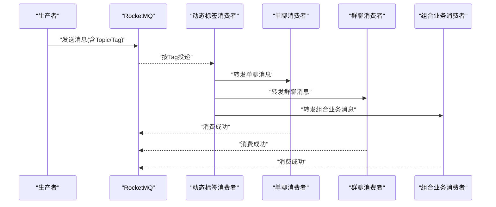
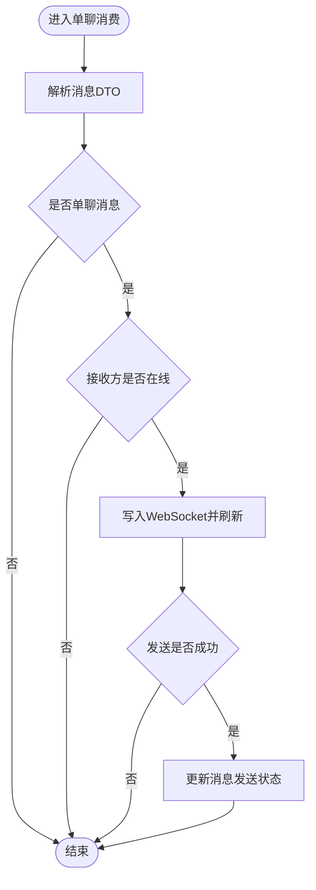
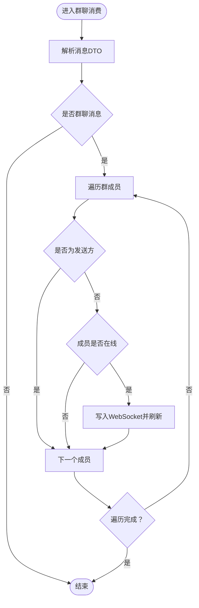
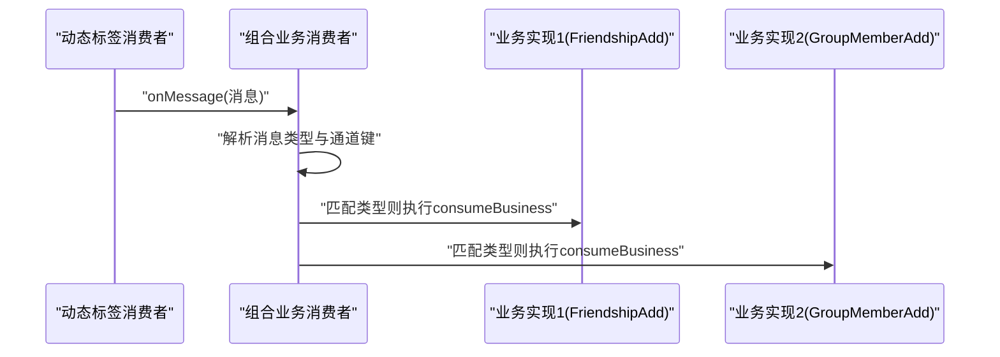
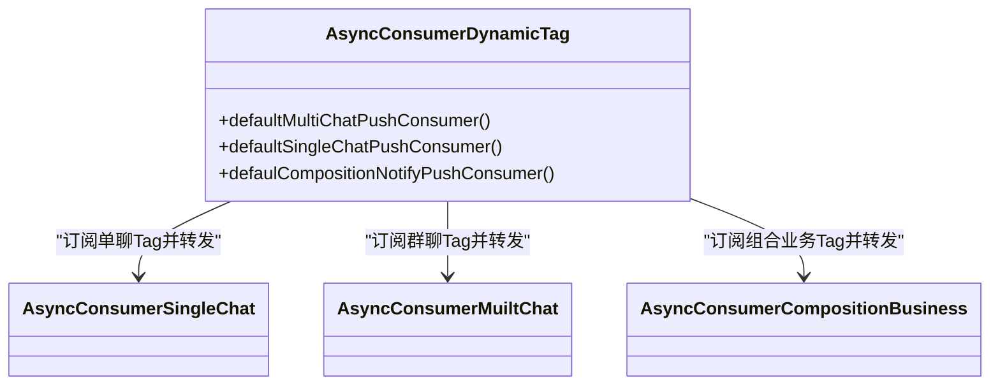
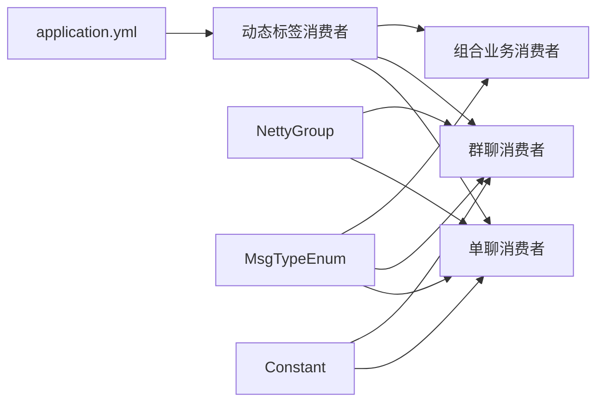

# 消息消费者

<cite>
**本文引用的文件**
- [AsyncConsumerSingleChat.java](file://src/main/java/com/hch/chat_simple/mq/AsyncConsumerSingleChat.java)
- [AsyncConsumerMuiltChat.java](file://src/main/java/com/hch/chat_simple/mq/AsyncConsumerMuiltChat.java)
- [AsyncConsumerCompositionBusiness.java](file://src/main/java/com/hch/chat_simple/mq/AsyncConsumerCompositionBusiness.java)
- [AsyncConsumerDynamicTag.java](file://src/main/java/com/hch/chat_simple/mq/AsyncConsumerDynamicTag.java)
- [AsyncProducer.java](file://src/main/java/com/hch/chat_simple/mq/AsyncProducer.java)
- [MqProducerConfig.java](file://src/main/java/com/hch/chat_simple/mq/MqProducerConfig.java)
- [application.yml](file://src/main/resources/application.yml)
- [MsgTypeEnum.java](file://src/main/java/com/hch/chat_simple/enums/MsgTypeEnum.java)
- [Constant.java](file://src/main/java/com/hch/chat_simple/util/Constant.java)
- [NettyGroup.java](file://src/main/java/com/hch/chat_simple/config/NettyGroup.java)
- [ChatMsgDTO.java](file://src/main/java/com/hch/chat_simple/pojo/dto/ChatMsgDTO.java)
- [ChatMsgPO.java](file://src/main/java/com/hch/chat_simple/pojo/po/ChatMsgPO.java)
- [ICompositionConsumeService.java](file://src/main/java/com/hch/chat_simple/service/ICompositionConsumeService.java)
- [FriendshipAddConsumeImpl.java](file://src/main/java/com/hch/chat_simple/service/impl/FriendshipAddConsumeImpl.java)
- [GroupMemberAddConsumeImpl.java](file://src/main/java/com/hch/chat_simple/service/impl/GroupMemberAddConsumeImpl.java)
</cite>

## 目录
1. [简介](#简介)
2. [项目结构](#项目结构)
3. [核心组件](#核心组件)
4. [架构总览](#架构总览)
5. [详细组件分析](#详细组件分析)
6. [依赖分析](#依赖分析)
7. [性能考虑](#性能考虑)
8. [故障排查指南](#故障排查指南)
9. [结论](#结论)
10. [附录](#附录)

## 简介
本文件面向消息消费者的实现与运维，系统性梳理单聊消息消费者、群聊消息消费者、组合业务消费者以及动态标签消费者的消息拉取机制、并发处理策略、负载均衡算法，并结合现有代码实现说明幂等性、重复消费处理、死信队列机制的现状与建议。同时给出配置参数说明、性能优化策略、监控指标建议以及运维扩容缩容指南。

## 项目结构
消息消费者相关代码主要位于 mq 包中，配合 RocketMQ 生产者配置、应用配置、枚举与常量、Netty 连接管理等模块协同工作。

图示来源
- [AsyncConsumerSingleChat.java:1-84](file://src/main/java/com/hch/chat_simple/mq/AsyncConsumerSingleChat.java#L1-L84)
- [AsyncConsumerMuiltChat.java:1-92](file://src/main/java/com/hch/chat_simple/mq/AsyncConsumerMuiltChat.java#L1-L92)
- [AsyncConsumerCompositionBusiness.java:1-52](file://src/main/java/com/hch/chat_simple/mq/AsyncConsumerCompositionBusiness.java#L1-L52)
- [AsyncConsumerDynamicTag.java:1-215](file://src/main/java/com/hch/chat_simple/mq/AsyncConsumerDynamicTag.java#L1-L215)
- [AsyncProducer.java:1-63](file://src/main/java/com/hch/chat_simple/mq/AsyncProducer.java#L1-L63)
- [MqProducerConfig.java:1-31](file://src/main/java/com/hch/chat_simple/mq/MqProducerConfig.java#L1-L31)
- [application.yml:1-89](file://src/main/resources/application.yml#L1-L89)
- [MsgTypeEnum.java:1-25](file://src/main/java/com/hch/chat_simple/enums/MsgTypeEnum.java#L1-L25)
- [Constant.java:1-33](file://src/main/java/com/hch/chat_simple/util/Constant.java#L1-L33)
- [NettyGroup.java:1-30](file://src/main/java/com/hch/chat_simple/config/NettyGroup.java#L1-L30)

章节来源
- [application.yml:1-89](file://src/main/resources/application.yml#L1-L89)
- [MqProducerConfig.java:1-31](file://src/main/java/com/hch/chat_simple/mq/MqProducerConfig.java#L1-L31)

## 核心组件
- 单聊消息消费者：负责将单聊消息通过 WebSocket 推送给在线用户，并更新消息发送状态。
- 群聊消息消费者：遍历群成员列表，向每个在线成员推送消息。
- 组合业务消费者：按消息类型分发给具体业务实现（如好友关系、群成员变更）。
- 动态标签消费者：基于实例标签动态订阅不同 Tag 的消息，实现负载均衡与水平扩展。

章节来源
- [AsyncConsumerSingleChat.java:1-84](file://src/main/java/com/hch/chat_simple/mq/AsyncConsumerSingleChat.java#L1-L84)
- [AsyncConsumerMuiltChat.java:1-92](file://src/main/java/com/hch/chat_simple/mq/AsyncConsumerMuiltChat.java#L1-L92)
- [AsyncConsumerCompositionBusiness.java:1-52](file://src/main/java/com/hch/chat_simple/mq/AsyncConsumerCompositionBusiness.java#L1-L52)
- [AsyncConsumerDynamicTag.java:1-215](file://src/main/java/com/hch/chat_simple/mq/AsyncConsumerDynamicTag.java#L1-L215)

## 架构总览
消息从生产者发送到 RocketMQ，消费者根据配置订阅 Topic 和 Tag，动态标签消费者按实例映射选择对应 Tag，最终将消息投递到具体消费者实现，完成消息的实时推送或业务处理。

图示来源
- [AsyncConsumerDynamicTag.java:82-214](file://src/main/java/com/hch/chat_simple/mq/AsyncConsumerDynamicTag.java#L82-L214)
- [AsyncConsumerSingleChat.java:47-82](file://src/main/java/com/hch/chat_simple/mq/AsyncConsumerSingleChat.java#L47-L82)
- [AsyncConsumerMuiltChat.java:49-91](file://src/main/java/com/hch/chat_simple/mq/AsyncConsumerMuiltChat.java#L49-L91)
- [AsyncConsumerCompositionBusiness.java:26-49](file://src/main/java/com/hch/chat_simple/mq/AsyncConsumerCompositionBusiness.java#L26-L49)

## 详细组件分析

### 单聊消息消费者
- 消息拉取机制：由动态标签消费者按 Tag 订阅 Topic 后，调用单聊消费者处理。
- 处理逻辑：解析消息 DTO，判断为单聊且接收方在线时，通过 Netty 将消息推送给目标用户，并在发送成功后更新消息状态。
- 并发策略：内部使用固定大小线程池处理消息，避免阻塞。
- 幂等性与重复消费：当前实现未见显式幂等控制；可结合消息 ID 或业务键进行去重。
- 错误处理：异常向上抛出，便于上层统一处理。

图示来源
- [AsyncConsumerSingleChat.java:47-73](file://src/main/java/com/hch/chat_simple/mq/AsyncConsumerSingleChat.java#L47-L73)
- [NettyGroup.java:11-29](file://src/main/java/com/hch/chat_simple/config/NettyGroup.java#L11-L29)
- [ChatMsgPO.java:14-54](file://src/main/java/com/hch/chat_simple/pojo/po/ChatMsgPO.java#L14-L54)

章节来源
- [AsyncConsumerSingleChat.java:1-84](file://src/main/java/com/hch/chat_simple/mq/AsyncConsumerSingleChat.java#L1-L84)
- [NettyGroup.java:1-30](file://src/main/java/com/hch/chat_simple/config/NettyGroup.java#L1-L30)
- [ChatMsgPO.java:1-54](file://src/main/java/com/hch/chat_simple/pojo/po/ChatMsgPO.java#L1-L54)

### 群聊消息消费者
- 消息拉取机制：由动态标签消费者按 Tag 订阅 Topic 后，调用群聊消费者处理。
- 处理逻辑：解析消息 DTO，遍历群成员列表，跳过发送方，向每个在线成员推送消息。
- 并发策略：内部使用固定大小线程池处理消息。
- 幂等性与重复消费：当前实现未见显式幂等控制；可结合消息 ID 或业务键进行去重。
- 错误处理：异常向上抛出，便于上层统一处理。

图示来源
- [AsyncConsumerMuiltChat.java:57-83](file://src/main/java/com/hch/chat_simple/mq/AsyncConsumerMuiltChat.java#L57-L83)
- [NettyGroup.java:11-29](file://src/main/java/com/hch/chat_simple/config/NettyGroup.java#L11-L29)

章节来源
- [AsyncConsumerMuiltChat.java:1-92](file://src/main/java/com/hch/chat_simple/mq/AsyncConsumerMuiltChat.java#L1-L92)
- [NettyGroup.java:1-30](file://src/main/java/com/hch/chat_simple/config/NettyGroup.java#L1-L30)

### 组合业务消费者
- 消息拉取机制：由动态标签消费者按 Tag 订阅 Topic 后，调用组合业务消费者处理。
- 处理逻辑：解析消息前缀（消息类型、通道键），根据消息类型分发到具体业务实现。
- 并发策略：使用集合流式过滤与执行，适合轻量处理。
- 幂等性与重复消费：当前实现未见显式幂等控制；可结合消息类型与业务键进行去重。
- 错误处理：异常向上抛出，便于上层统一处理。

图示来源
- [AsyncConsumerCompositionBusiness.java:26-49](file://src/main/java/com/hch/chat_simple/mq/AsyncConsumerCompositionBusiness.java#L26-L49)
- [ICompositionConsumeService.java:1-11](file://src/main/java/com/hch/chat_simple/service/ICompositionConsumeService.java#L1-L11)
- [FriendshipAddConsumeImpl.java:26-38](file://src/main/java/com/hch/chat_simple/service/impl/FriendshipAddConsumeImpl.java#L26-L38)
- [GroupMemberAddConsumeImpl.java:22-31](file://src/main/java/com/hch/chat_simple/service/impl/GroupMemberAddConsumeImpl.java#L22-L31)

章节来源
- [AsyncConsumerCompositionBusiness.java:1-52](file://src/main/java/com/hch/chat_simple/mq/AsyncConsumerCompositionBusiness.java#L1-L52)
- [ICompositionConsumeService.java:1-11](file://src/main/java/com/hch/chat_simple/service/ICompositionConsumeService.java#L1-L11)
- [FriendshipAddConsumeImpl.java:1-41](file://src/main/java/com/hch/chat_simple/service/impl/FriendshipAddConsumeImpl.java#L1-L41)
- [GroupMemberAddConsumeImpl.java:1-34](file://src/main/java/com/hch/chat_simple/service/impl/GroupMemberAddConsumeImpl.java#L1-L34)

### 动态标签消费者
- 动态订阅：根据实例标签列表与当前实例标签计算映射 Tag，为同一 Topic 创建多个消费组以实现负载分摊。
- 负载均衡：相同消费组内采用集群模式，不同 Tag 对应不同实例集合，实现按 Tag 的水平扩展。
- 消息拉取：通过 DefaultMQPushConsumer 注册监听器，逐条消费消息并转发给具体消费者实现。

图示来源
- [AsyncConsumerDynamicTag.java:82-214](file://src/main/java/com/hch/chat_simple/mq/AsyncConsumerDynamicTag.java#L82-L214)
- [AsyncConsumerSingleChat.java:36-84](file://src/main/java/com/hch/chat_simple/mq/AsyncConsumerSingleChat.java#L36-L84)
- [AsyncConsumerMuiltChat.java:38-92](file://src/main/java/com/hch/chat_simple/mq/AsyncConsumerMuiltChat.java#L38-L92)
- [AsyncConsumerCompositionBusiness.java:13-52](file://src/main/java/com/hch/chat_simple/mq/AsyncConsumerCompositionBusiness.java#L13-L52)

章节来源
- [AsyncConsumerDynamicTag.java:1-215](file://src/main/java/com/hch/chat_simple/mq/AsyncConsumerDynamicTag.java#L1-L215)
- [application.yml:76-83](file://src/main/resources/application.yml#L76-L83)

## 依赖分析
- 配置依赖：消费者依赖 application.yml 中的 RocketMQ 名称服务器地址、消费者组、Topic 与 Tag 列表等配置。
- 运行时依赖：消费者依赖 NettyGroup 管理的 ChannelGroup 与用户映射，用于在线消息推送。
- 类型与常量：消费者依赖 MsgTypeEnum 与 Constant 定义的消息类型与状态码。

图示来源
- [application.yml:39-83](file://src/main/resources/application.yml#L39-L83)
- [AsyncConsumerDynamicTag.java:35-76](file://src/main/java/com/hch/chat_simple/mq/AsyncConsumerDynamicTag.java#L35-L76)
- [NettyGroup.java:11-29](file://src/main/java/com/hch/chat_simple/config/NettyGroup.java#L11-L29)
- [MsgTypeEnum.java:6-15](file://src/main/java/com/hch/chat_simple/enums/MsgTypeEnum.java#L6-L15)
- [Constant.java:19-25](file://src/main/java/com/hch/chat_simple/util/Constant.java#L19-L25)

章节来源
- [application.yml:1-89](file://src/main/resources/application.yml#L1-L89)
- [NettyGroup.java:1-30](file://src/main/java/com/hch/chat_simple/config/NettyGroup.java#L1-L30)
- [MsgTypeEnum.java:1-25](file://src/main/java/com/hch/chat_simple/enums/MsgTypeEnum.java#L1-L25)
- [Constant.java:1-33](file://src/main/java/com/hch/chat_simple/util/Constant.java#L1-L33)

## 性能考虑
- 并发与线程池
  - 单聊与群聊消费者内部使用固定大小线程池处理消息，避免阻塞 IO。
  - 建议根据 CPU 核数与消息吞吐量调整线程池大小，防止上下文切换开销过大。
- 批量与拉取
  - 当前消费者为逐条消费，未见批量拉取配置；可在动态标签消费者中启用批量拉取参数以提升吞吐。
- 负载均衡
  - 通过 Tag 实现实例级路由，相同 Topic 下按 Tag 分配不同实例，天然具备水平扩展能力。
- 缓存与连接
  - NettyGroup 使用并发 Map 与 ChannelGroup 管理在线用户，注意高并发下的锁竞争；可引入外部缓存降低内存压力。
- 生产者与网络
  - 生产者异步回调记录成功与异常日志，建议增加重试与限流策略，避免网络抖动导致积压。

章节来源
- [AsyncConsumerSingleChat.java:41-41](file://src/main/java/com/hch/chat_simple/mq/AsyncConsumerSingleChat.java#L41-L41)
- [AsyncConsumerMuiltChat.java:42-42](file://src/main/java/com/hch/chat_simple/mq/AsyncConsumerMuiltChat.java#L42-L42)
- [AsyncConsumerDynamicTag.java:105-117](file://src/main/java/com/hch/chat_simple/mq/AsyncConsumerDynamicTag.java#L105-L117)
- [AsyncProducer.java:44-58](file://src/main/java/com/hch/chat_simple/mq/AsyncProducer.java#L44-L58)

## 故障排查指南
- 消息未送达
  - 检查接收方是否在线（NettyGroup 中是否存在映射）。
  - 检查消息类型与聊天类型是否正确（MsgTypeEnum 与 Constant）。
- 消费异常
  - 单聊/群聊/组合消费者均将异常向上抛出，需检查日志定位具体异常点。
- 动态标签不生效
  - 确认 chat.tag.list 与 chat.tag.current 配置正确，Tag 与实例映射一致。
- 重复消费
  - 当前实现未见显式幂等控制；建议引入消息 ID 去重或业务键去重策略。
- 死信队列
  - 当前未见死信队列配置；建议在 RocketMQ 控制台或配置中启用重试与死信队列，避免无限重试。

章节来源
- [NettyGroup.java:11-29](file://src/main/java/com/hch/chat_simple/config/NettyGroup.java#L11-L29)
- [MsgTypeEnum.java:6-15](file://src/main/java/com/hch/chat_simple/enums/MsgTypeEnum.java#L6-L15)
- [Constant.java:19-25](file://src/main/java/com/hch/chat_simple/util/Constant.java#L19-L25)
- [AsyncConsumerSingleChat.java:76-82](file://src/main/java/com/hch/chat_simple/mq/AsyncConsumerSingleChat.java#L76-L82)
- [AsyncConsumerMuiltChat.java:49-55](file://src/main/java/com/hch/chat_simple/mq/AsyncConsumerMuiltChat.java#L49-L55)
- [AsyncConsumerCompositionBusiness.java:26-49](file://src/main/java/com/hch/chat_simple/mq/AsyncConsumerCompositionBusiness.java#L26-L49)
- [application.yml:76-83](file://src/main/resources/application.yml#L76-L83)

## 结论
该消息消费者体系通过动态标签实现按实例路由与水平扩展，结合 Netty 实现实时消息推送。当前实现简洁清晰，但在幂等性、批量拉取、死信队列与监控指标方面仍有优化空间。建议在生产环境中补充去重策略、批量配置与完善的可观测性方案。

## 附录

### 配置参数说明
- RocketMQ 基础配置
  - 名称服务器地址：用于消费者与生产者连接。
  - 生产者组与消费者组：用于消息分组与负载均衡。
- Topic 配置
  - 单聊 Topic、群聊 Topic、组合业务 Topic：分别对应不同消息类型。
- 动态标签配置
  - Tag 列表：实例标签集合。
  - 当前实例标签：用于计算映射 Tag。
- Netty 与通道
  - 用户在线映射与 ChannelGroup：用于实时推送。

章节来源
- [application.yml:39-83](file://src/main/resources/application.yml#L39-L83)
- [NettyGroup.java:11-29](file://src/main/java/com/hch/chat_simple/config/NettyGroup.java#L11-L29)

### 消息类型与状态
- 消息类型枚举：定义了上线、聊天消息、下线、申请好友、添加好友关系、群成员添加、群成员待更新等类型。
- 消息状态常量：定义了消息发送成功与失败的状态码。

章节来源
- [MsgTypeEnum.java:6-15](file://src/main/java/com/hch/chat_simple/enums/MsgTypeEnum.java#L6-L15)
- [Constant.java:8-11](file://src/main/java/com/hch/chat_simple/util/Constant.java#L8-L11)

### 数据模型
- ChatMsgDTO：单聊/群聊消息传输对象，包含消息类型、聊天类型、发送方、接收方、内容、群组 ID、消息 ID、好友 ID、群聊接收人列表等字段。
- ChatMsgPO：数据库持久化实体，包含消息类型、聊天类型、发送方、接收方、内容、群组 ID、发送状态、内容类型、长度等字段。

章节来源
- [ChatMsgDTO.java:13-61](file://src/main/java/com/hch/chat_simple/pojo/dto/ChatMsgDTO.java#L13-L61)
- [ChatMsgPO.java:18-53](file://src/main/java/com/hch/chat_simple/pojo/po/ChatMsgPO.java#L18-L53)