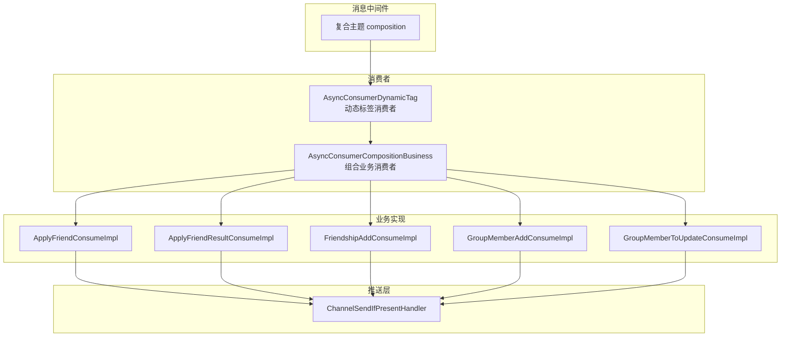
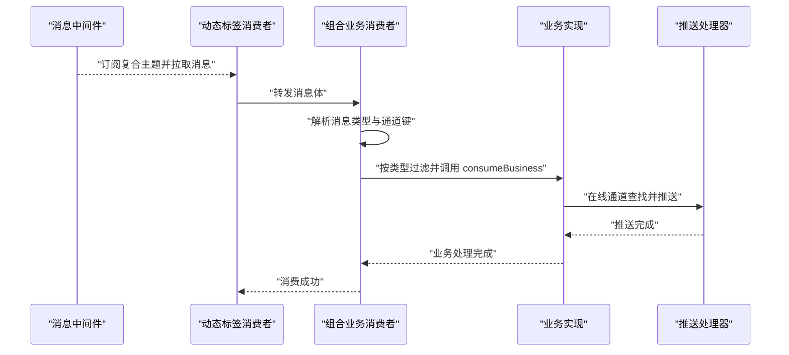
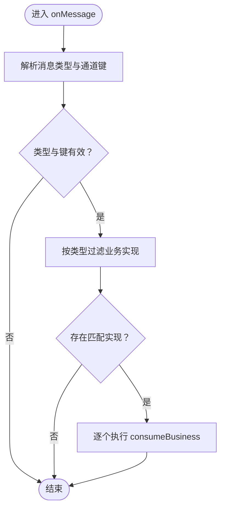
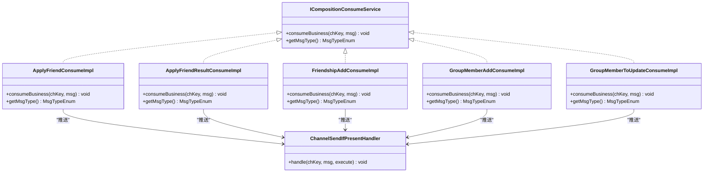
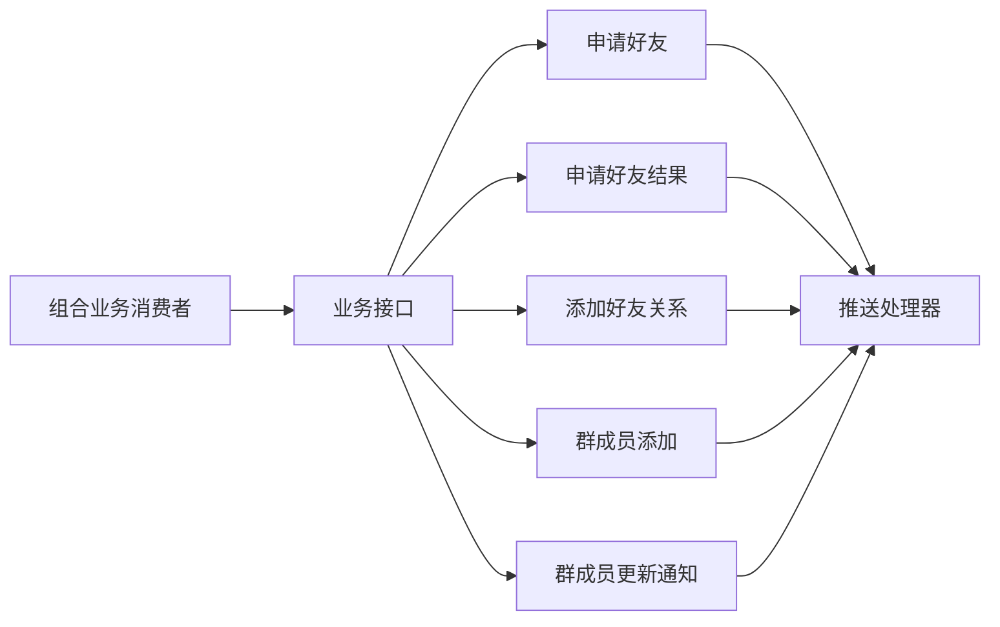

# 组合业务消费者

<cite>
**本文引用的文件**
- [AsyncConsumerCompositionBusiness.java](file://src/main/java/com/hch/chat_simple/mq/AsyncConsumerCompositionBusiness.java)
- [ICompositionConsumeService.java](file://src/main/java/com/hch/chat_simple/service/ICompositionConsumeService.java)
- [ApplyFriendConsumeImpl.java](file://src/main/java/com/hch/chat_simple/service/impl/ApplyFriendConsumeImpl.java)
- [ApplyFriendResultConsumeImpl.java](file://src/main/java/com/hch/chat_simple/service/impl/ApplyFriendResultConsumeImpl.java)
- [FriendshipAddConsumeImpl.java](file://src/main/java/com/hch/chat_simple/service/impl/FriendshipAddConsumeImpl.java)
- [GroupMemberAddConsumeImpl.java](file://src/main/java/com/hch/chat_simple/service/impl/GroupMemberAddConsumeImpl.java)
- [GroupMemberToUpdateConsumeImpl.java](file://src/main/java/com/hch/chat_simple/service/impl/GroupMemberToUpdateConsumeImpl.java)
- [MsgTypeEnum.java](file://src/main/java/com/hch/chat_simple/enums/MsgTypeEnum.java)
- [ChannelSendIfPresentHandler.java](file://src/main/java/com/hch/chat_simple/handler/ChannelSendIfPresentHandler.java)
- [MsgBodyResolveUtil.java](file://src/main/java/com/hch/chat_simple/util/MsgBodyResolveUtil.java)
- [AsyncConsumerDynamicTag.java](file://src/main/java/com/hch/chat_simple/mq/AsyncConsumerDynamicTag.java)
- [AsyncConsumerMuiltChat.java](file://src/main/java/com/hch/chat_simple/mq/AsyncConsumerMuiltChat.java)
- [AsyncConsumerSingleChat.java](file://src/main/java/com/hch/chat_simple/mq/AsyncConsumerSingleChat.java)
- [application.yml](file://src/main/resources/application.yml)
</cite>

## 目录
1. [简介](#简介)
2. [项目结构](#项目结构)
3. [核心组件](#核心组件)
4. [架构总览](#架构总览)
5. [详细组件分析](#详细组件分析)
6. [依赖分析](#依赖分析)
7. [性能考虑](#性能考虑)
8. [故障排查指南](#故障排查指南)
9. [结论](#结论)
10. [附录](#附录)

## 简介
本文件围绕组合业务消费者展开，系统性解析 AsyncConsumerCompositionBusiness 的复合业务处理机制，涵盖多步骤业务流程协调、消息类型与通道键的解析、业务状态管理、事务性消息处理策略、回滚机制、复杂场景下的消息拆分与聚合、结果反馈、与其他消费者类型的协作关系与数据流转，以及错误处理、异常恢复与重试策略，并提供监控、性能分析与故障诊断方法。

## 项目结构
组合业务消费者位于 MQ 层，负责接收复合主题的消息，按消息类型分发给具体的业务消费实现；业务实现通过统一接口 ICompositionConsumeService 抽象，结合 ChannelSendIfPresentHandler 实现在线用户的消息推送。动态标签消费者 AsyncConsumerDynamicTag 负责根据实例标签订阅复合主题并转发给组合消费者。

图表来源
- [AsyncConsumerDynamicTag.java:165-199](file://src/main/java/com/hch/chat_simple/mq/AsyncConsumerDynamicTag.java#L165-L199)
- [AsyncConsumerCompositionBusiness.java:20-49](file://src/main/java/com/hch/chat_simple/mq/AsyncConsumerCompositionBusiness.java#L20-L49)
- [ApplyFriendConsumeImpl.java:15-31](file://src/main/java/com/hch/chat_simple/service/impl/ApplyFriendConsumeImpl.java#L15-L31)
- [ApplyFriendResultConsumeImpl.java:22-44](file://src/main/java/com/hch/chat_simple/service/impl/ApplyFriendResultConsumeImpl.java#L22-L44)
- [FriendshipAddConsumeImpl.java:20-40](file://src/main/java/com/hch/chat_simple/service/impl/FriendshipAddConsumeImpl.java#L20-L40)
- [GroupMemberAddConsumeImpl.java:17-33](file://src/main/java/com/hch/chat_simple/service/impl/GroupMemberAddConsumeImpl.java#L17-L33)
- [GroupMemberToUpdateConsumeImpl.java:17-33](file://src/main/java/com/hch/chat_simple/service/impl/GroupMemberToUpdateConsumeImpl.java#L17-L33)
- [ChannelSendIfPresentHandler.java:15-33](file://src/main/java/com/hch/chat_simple/handler/ChannelSendIfPresentHandler.java#L15-L33)

章节来源
- [AsyncConsumerDynamicTag.java:165-199](file://src/main/java/com/hch/chat_simple/mq/AsyncConsumerDynamicTag.java#L165-L199)
- [AsyncConsumerCompositionBusiness.java:20-49](file://src/main/java/com/hch/chat_simple/mq/AsyncConsumerCompositionBusiness.java#L20-L49)

## 核心组件
- 组合业务消费者 AsyncConsumerCompositionBusiness：解析复合消息，提取消息类型与通道键，按类型分发至具体业务实现。
- 业务消费接口 ICompositionConsumeService：定义统一的业务消费签名与消息类型标识。
- 具体业务实现：
  - 申请好友：ApplyFriendConsumeImpl
  - 申请好友结果：ApplyFriendResultConsumeImpl
  - 添加好友关系：FriendshipAddConsumeImpl
  - 群成员添加：GroupMemberAddConsumeImpl
  - 群成员更新通知：GroupMemberToUpdateConsumeImpl
- 推送处理器 ChannelSendIfPresentHandler：基于 Netty 的在线通道查找与消息推送。
- 消息体解析工具 MsgBodyResolveUtil：提供消息体拆分与格式校验能力。
- 动态标签消费者 AsyncConsumerDynamicTag：按实例标签订阅复合主题并将消息转发给组合消费者。
- 配置 application.yml：包含 RocketMQ 名称服务器地址、消费者组、主题名及标签配置。

章节来源
- [AsyncConsumerCompositionBusiness.java:20-49](file://src/main/java/com/hch/chat_simple/mq/AsyncConsumerCompositionBusiness.java#L20-L49)
- [ICompositionConsumeService.java:5-10](file://src/main/java/com/hch/chat_simple/service/ICompositionConsumeService.java#L5-L10)
- [ApplyFriendConsumeImpl.java:15-31](file://src/main/java/com/hch/chat_simple/service/impl/ApplyFriendConsumeImpl.java#L15-L31)
- [ApplyFriendResultConsumeImpl.java:22-44](file://src/main/java/com/hch/chat_simple/service/impl/ApplyFriendResultConsumeImpl.java#L22-L44)
- [FriendshipAddConsumeImpl.java:20-40](file://src/main/java/com/hch/chat_simple/service/impl/FriendshipAddConsumeImpl.java#L20-L40)
- [GroupMemberAddConsumeImpl.java:17-33](file://src/main/java/com/hch/chat_simple/service/impl/GroupMemberAddConsumeImpl.java#L17-L33)
- [GroupMemberToUpdateConsumeImpl.java:17-33](file://src/main/java/com/hch/chat_simple/service/impl/GroupMemberToUpdateConsumeImpl.java#L17-L33)
- [ChannelSendIfPresentHandler.java:15-33](file://src/main/java/com/hch/chat_simple/handler/ChannelSendIfPresentHandler.java#L15-L33)
- [MsgBodyResolveUtil.java:10-73](file://src/main/java/com/hch/chat_simple/util/MsgBodyResolveUtil.java#L10-L73)
- [AsyncConsumerDynamicTag.java:165-199](file://src/main/java/com/hch/chat_simple/mq/AsyncConsumerDynamicTag.java#L165-L199)
- [application.yml:39-83](file://src/main/resources/application.yml#L39-L83)

## 架构总览
组合业务消费者采用“消息解析—类型分发—业务执行—在线推送”的流水线式处理。动态标签消费者根据当前实例标签选择订阅的 Tag，确保同一主题下不同实例仅消费对应子集，提升扩展性与负载均衡能力。业务实现通过统一接口抽象，便于新增与替换。

图表来源
- [AsyncConsumerDynamicTag.java:184-195](file://src/main/java/com/hch/chat_simple/mq/AsyncConsumerDynamicTag.java#L184-L195)
- [AsyncConsumerCompositionBusiness.java:26-49](file://src/main/java/com/hch/chat_simple/mq/AsyncConsumerCompositionBusiness.java#L26-L49)
- [ChannelSendIfPresentHandler.java:21-32](file://src/main/java/com/hch/chat_simple/handler/ChannelSendIfPresentHandler.java#L21-L32)

## 详细组件分析

### 组件一：组合业务消费者 AsyncConsumerCompositionBusiness
- 职责
  - 解析复合消息格式，提取消息类型与通道键（用户ID）。
  - 根据消息类型从已注册的业务实现中筛选并执行对应业务。
- 关键点
  - 消息格式约定：消息类型 + “,” + 通道键 + “,” + 消息体。
  - 类型与键的合法性校验：非空且为数字。
  - 分发策略：通过 getMsgType().getType() 匹配，逐一执行。
- 处理流程

图表来源
- [AsyncConsumerCompositionBusiness.java:26-49](file://src/main/java/com/hch/chat_simple/mq/AsyncConsumerCompositionBusiness.java#L26-L49)

章节来源
- [AsyncConsumerCompositionBusiness.java:20-49](file://src/main/java/com/hch/chat_simple/mq/AsyncConsumerCompositionBusiness.java#L20-L49)

### 组件二：业务消费接口 ICompositionConsumeService
- 角色：统一业务消费签名与消息类型标识。
- 方法
  - consumeBusiness(Long chKey, String msg)：按通道键与消息体执行业务。
  - getMsgType()：返回枚举类型，用于分发匹配。

章节来源
- [ICompositionConsumeService.java:5-10](file://src/main/java/com/hch/chat_simple/service/ICompositionConsumeService.java#L5-L10)

### 组件三：具体业务实现
- 申请好友 ApplyFriendConsumeImpl
  - 作用：将“申请好友”类消息按通道键推送至对应用户。
  - 依赖：ChannelSendIfPresentHandler。
- 申请好友结果 ApplyFriendResultConsumeImpl
  - 作用：解析消息体，构造 DTO，向申请人推送结果。
  - 依赖：MsgBodyResolveUtil、ChannelSendIfPresentHandler。
- 添加好友关系 FriendshipAddConsumeImpl
  - 作用：解析 VO，向关系创建者推送“添加好友关系”消息。
  - 依赖：MsgBodyResolveUtil、ChannelSendIfPresentHandler。
- 群成员添加 GroupMemberAddConsumeImpl
  - 作用：向目标成员推送“群成员添加”消息。
  - 依赖：ChannelSendIfPresentHandler。
- 群成员更新通知 GroupMemberToUpdateConsumeImpl
  - 作用：向成员推送“有新成员加入，需更新群信息”消息。
  - 依赖：ChannelSendIfPresentHandler。

图表来源
- [ICompositionConsumeService.java:5-10](file://src/main/java/com/hch/chat_simple/service/ICompositionConsumeService.java#L5-L10)
- [ApplyFriendConsumeImpl.java:15-31](file://src/main/java/com/hch/chat_simple/service/impl/ApplyFriendConsumeImpl.java#L15-L31)
- [ApplyFriendResultConsumeImpl.java:22-44](file://src/main/java/com/hch/chat_simple/service/impl/ApplyFriendResultConsumeImpl.java#L22-L44)
- [FriendshipAddConsumeImpl.java:20-40](file://src/main/java/com/hch/chat_simple/service/impl/FriendshipAddConsumeImpl.java#L20-L40)
- [GroupMemberAddConsumeImpl.java:17-33](file://src/main/java/com/hch/chat_simple/service/impl/GroupMemberAddConsumeImpl.java#L17-L33)
- [GroupMemberToUpdateConsumeImpl.java:17-33](file://src/main/java/com/hch/chat_simple/service/impl/GroupMemberToUpdateConsumeImpl.java#L17-L33)
- [ChannelSendIfPresentHandler.java:15-33](file://src/main/java/com/hch/chat_simple/handler/ChannelSendIfPresentHandler.java#L15-L33)

章节来源
- [ApplyFriendConsumeImpl.java:15-31](file://src/main/java/com/hch/chat_simple/service/impl/ApplyFriendConsumeImpl.java#L15-L31)
- [ApplyFriendResultConsumeImpl.java:22-44](file://src/main/java/com/hch/chat_simple/service/impl/ApplyFriendResultConsumeImpl.java#L22-L44)
- [FriendshipAddConsumeImpl.java:20-40](file://src/main/java/com/hch/chat_simple/service/impl/FriendshipAddConsumeImpl.java#L20-L40)
- [GroupMemberAddConsumeImpl.java:17-33](file://src/main/java/com/hch/chat_simple/service/impl/GroupMemberAddConsumeImpl.java#L17-L33)
- [GroupMemberToUpdateConsumeImpl.java:17-33](file://src/main/java/com/hch/chat_simple/service/impl/GroupMemberToUpdateConsumeImpl.java#L17-L33)

### 组件四：消息体解析与推送
- 消息体解析 MsgBodyResolveUtil
  - 提供按分隔符拆分与长度校验的能力，若格式不正确抛出业务异常。
- 推送处理器 ChannelSendIfPresentHandler
  - 基于 Netty 的通道映射表与通道组，定位在线用户并推送文本帧。
  - 支持在写入前执行自定义回调（如日志或计数）。

章节来源
- [MsgBodyResolveUtil.java:10-73](file://src/main/java/com/hch/chat_simple/util/MsgBodyResolveUtil.java#L10-L73)
- [ChannelSendIfPresentHandler.java:15-33](file://src/main/java/com/hch/chat_simple/handler/ChannelSendIfPresentHandler.java#L15-L33)

### 组件五：动态标签消费者与订阅路由
- AsyncConsumerDynamicTag
  - 根据实例标签 currentTag 在 tagList 中定位索引，生成 Tag 并订阅复合主题。
  - 同一主题下不同实例消费不同 Tag，实现负载分摊与扩展。
  - 将消息转发给 AsyncConsumerCompositionBusiness 执行。

章节来源
- [AsyncConsumerDynamicTag.java:165-199](file://src/main/java/com/hch/chat_simple/mq/AsyncConsumerDynamicTag.java#L165-L199)
- [application.yml:76-83](file://src/main/resources/application.yml#L76-L83)

### 组件六：对比：单聊与群聊消费者
- 单聊消费者 AsyncConsumerSingleChat
  - 解析消息后直接推送至接收方通道；发送成功后异步更新消息状态。
- 群聊消费者 AsyncConsumerMuiltChat
  - 遍历群成员列表，排除发送方后逐个推送。
- 与组合消费者的关系
  - 单聊/群聊消费者处理实时消息流；组合消费者处理由上游聚合后的复合通知，二者解耦但可并存。

章节来源
- [AsyncConsumerSingleChat.java:36-82](file://src/main/java/com/hch/chat_simple/mq/AsyncConsumerSingleChat.java#L36-L82)
- [AsyncConsumerMuiltChat.java:38-91](file://src/main/java/com/hch/chat_simple/mq/AsyncConsumerMuiltChat.java#L38-L91)

## 依赖分析
- 组件内聚与耦合
  - 组合消费者与业务实现通过接口解耦，便于扩展新的业务类型。
  - 业务实现依赖推送处理器，形成清晰的职责边界。
- 外部依赖
  - RocketMQ：动态标签消费者订阅复合主题并转发消息。
  - Netty：通道管理与消息推送。
  - JSON 工具：消息体序列化与反序列化。
- 可能的循环依赖
  - 当前结构无循环依赖，接口抽象避免了双向依赖风险。

图表来源
- [AsyncConsumerCompositionBusiness.java:24-49](file://src/main/java/com/hch/chat_simple/mq/AsyncConsumerCompositionBusiness.java#L24-L49)
- [ICompositionConsumeService.java:5-10](file://src/main/java/com/hch/chat_simple/service/ICompositionConsumeService.java#L5-L10)
- [ChannelSendIfPresentHandler.java:15-33](file://src/main/java/com/hch/chat_simple/handler/ChannelSendIfPresentHandler.java#L15-L33)

章节来源
- [AsyncConsumerCompositionBusiness.java:20-49](file://src/main/java/com/hch/chat_simple/mq/AsyncConsumerCompositionBusiness.java#L20-L49)
- [ICompositionConsumeService.java:5-10](file://src/main/java/com/hch/chat_simple/service/ICompositionConsumeService.java#L5-L10)

## 性能考虑
- 并发与线程池
  - 单聊/群聊消费者内部使用固定大小线程池处理消息，避免阻塞 IO。
- 推送性能
  - 通道查找与写入在内存 Map/Group 中完成，减少网络往返。
- 扩展性
  - 动态标签订阅按实例标签分片，提高横向扩展能力。
- 建议
  - 对消息体解析与推送增加限流与熔断，防止突发流量导致内存与 CPU 峰值。
  - 对推送失败进行重试与死信队列处理，保障消息可达性。

[本节为通用性能建议，无需特定文件引用]

## 故障排查指南
- 常见问题与定位
  - 消息格式不正确：消息体解析工具会因格式异常抛出业务异常，检查上游消息拼装是否符合约定。
  - 通道键无效：组合消费者对类型与键进行数字校验，确认传入键为有效数字。
  - 业务实现未匹配：确认业务实现的 getMsgType 返回值与上游发送一致。
  - 推送失败：检查 Netty 通道映射与通道组状态，确认用户在线。
- 日志与监控
  - 动态标签消费者与组合消费者均输出消费日志，便于定位消费链路。
  - 单聊消费者在推送成功后异步更新消息状态，可用于追踪消息投递结果。
- 重试与补偿
  - 对于推送失败或业务异常，建议引入 RocketMQ 的重试与死信队列策略，结合补偿任务定期扫描未达预期状态的消息。

章节来源
- [MsgBodyResolveUtil.java:12-31](file://src/main/java/com/hch/chat_simple/util/MsgBodyResolveUtil.java#L12-L31)
- [AsyncConsumerCompositionBusiness.java:26-43](file://src/main/java/com/hch/chat_simple/mq/AsyncConsumerCompositionBusiness.java#L26-L43)
- [AsyncConsumerDynamicTag.java:184-195](file://src/main/java/com/hch/chat_simple/mq/AsyncConsumerDynamicTag.java#L184-L195)
- [AsyncConsumerSingleChat.java:55-70](file://src/main/java/com/hch/chat_simple/mq/AsyncConsumerSingleChat.java#L55-L70)

## 结论
组合业务消费者通过“消息解析—类型分发—业务执行—在线推送”的链路，实现了对复杂业务场景的统一接入与扩展。配合动态标签订阅与接口化的业务实现，系统具备良好的扩展性与可维护性。建议在生产环境中完善异常恢复、重试与监控体系，以进一步提升可靠性与可观测性。

[本节为总结性内容，无需特定文件引用]

## 附录
- 消息类型枚举
  - 上线、聊天消息、下线、申请好友、申请好友结果、添加好友关系、群成员添加、群成员待更新等。
- 关键配置
  - RocketMQ 名称服务器、消费者组、主题名、标签列表与当前实例标签。

章节来源
- [MsgTypeEnum.java:6-15](file://src/main/java/com/hch/chat_simple/enums/MsgTypeEnum.java#L6-L15)
- [application.yml:39-83](file://src/main/resources/application.yml#L39-L83)