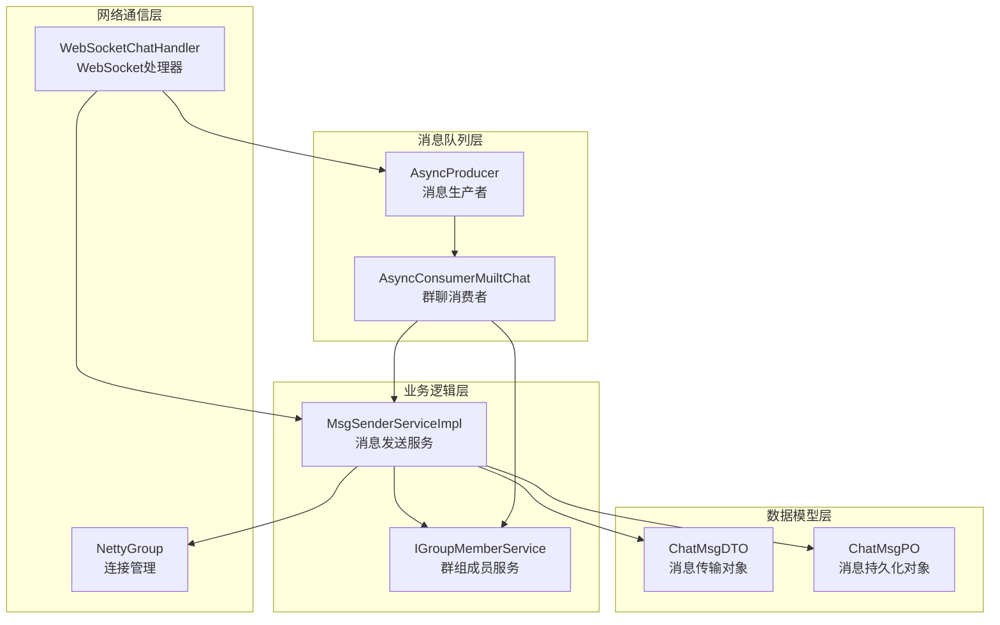
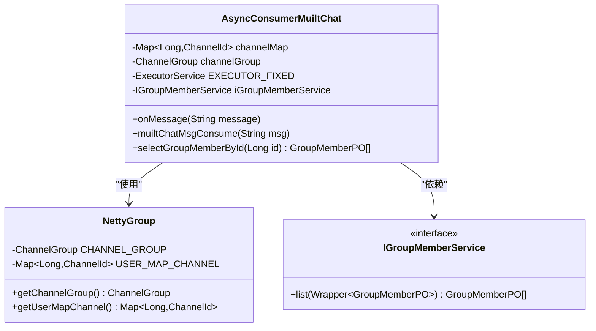
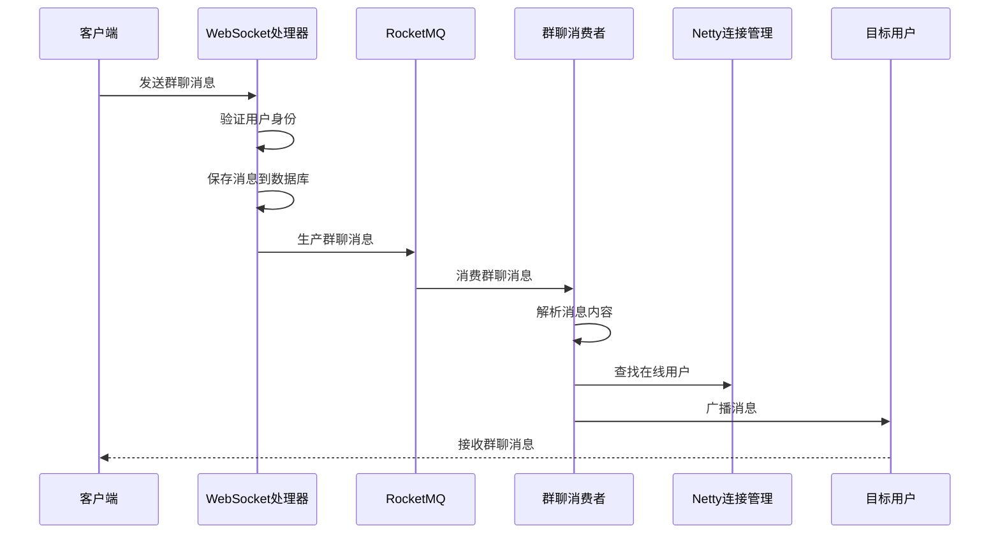
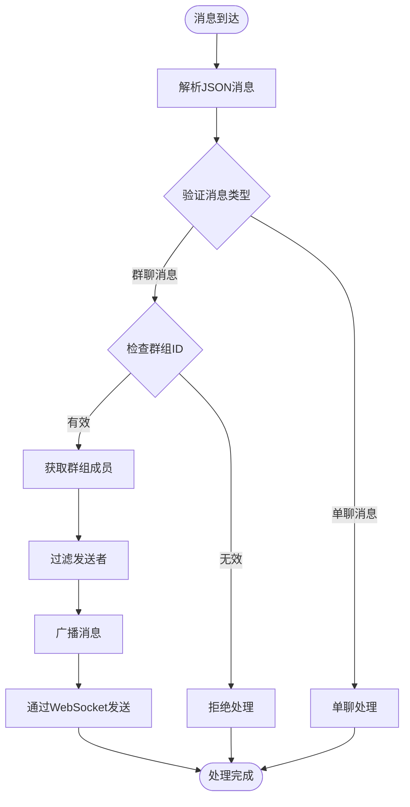
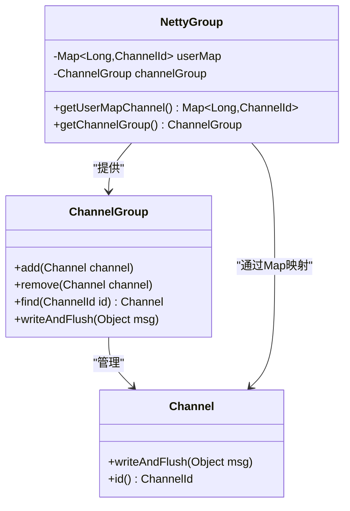
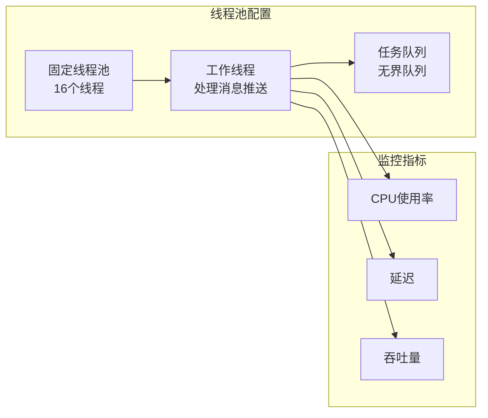
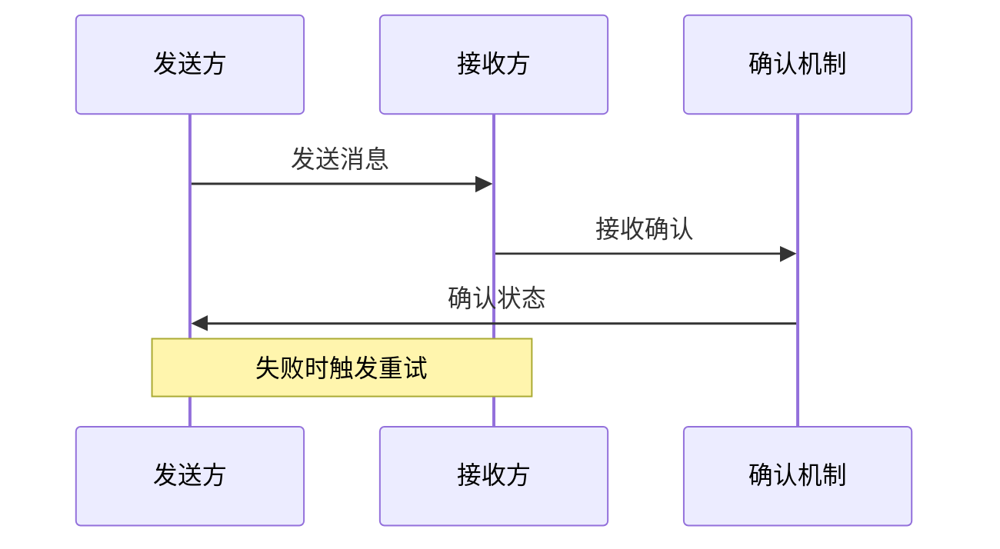
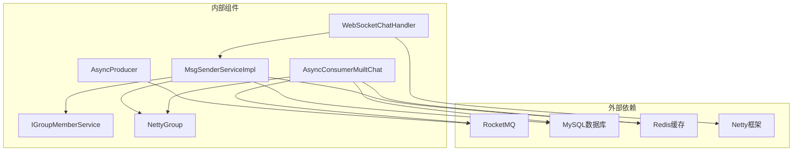
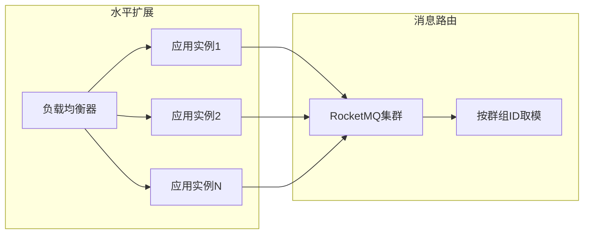
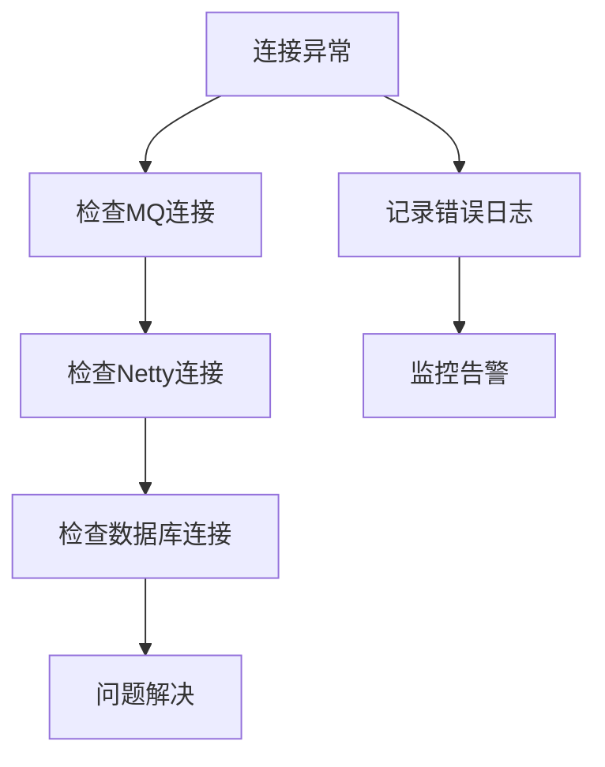

# 群聊消息消费者

<cite>
**本文档引用的文件**
- [AsyncConsumerMuiltChat.java](file://src/main/java/com/hch/chat_simple/mq/AsyncConsumerMuiltChat.java)
- [MsgSenderServiceImpl.java](file://src/main/java/com/hch/chat_simple/service/impl/MsgSenderServiceImpl.java)
- [WebSocketChatHandler.java](file://src/main/java/com/hch/chat_simple/handler/WebSocketChatHandler.java)
- [NettyGroup.java](file://src/main/java/com/hch/chat_simple/config/NettyGroup.java)
- [ChatMsgDTO.java](file://src/main/java/com/hch/chat_simple/pojo/dto/ChatMsgDTO.java)
- [AsyncProducer.java](file://src/main/java/com/hch/chat_simple/mq/AsyncProducer.java)
- [MsgTypeEnum.java](file://src/main/java/com/hch/chat_simple/enums/MsgTypeEnum.java)
- [Constant.java](file://src/main/java/com/hch/chat_simple/util/Constant.java)
- [application.yml](file://src/main/resources/application.yml)
- [IGroupMemberService.java](file://src/main/java/com/hch/chat_simple/service/IGroupMemberService.java)
- [IChatMsgService.java](file://src/main/java/com/hch/chat_simple/service/IChatMsgService.java)
- [ChatMsgPO.java](file://src/main/java/com/hch/chat_simple/pojo/po/ChatMsgPO.java)
- [MqProducerConfig.java](file://src/main/java/com/hch/chat_simple/mq/MqProducerConfig.java)
</cite>

## 目录
1. [简介](#简介)
2. [项目结构](#项目结构)
3. [核心组件](#核心组件)
4. [架构概览](#架构概览)
5. [详细组件分析](#详细组件分析)
6. [依赖关系分析](#依赖关系分析)
7. [性能考虑](#性能考虑)
8. [故障排查指南](#故障排查指南)
9. [结论](#结论)

## 简介

本文档深入解析了群聊消息消费者的实现原理，重点分析AsyncConsumerMuiltChat类的设计与实现。该系统采用消息队列+WebSocket的混合架构，实现了高性能的群聊消息广播机制。系统通过RocketMQ实现消息的异步处理，通过Netty管理WebSocket连接，实现了群组成员查找、消息广播机制和多用户消息推送的完整功能链路。

## 项目结构

项目采用标准的Spring Boot分层架构，主要模块包括：

**图表来源**
- [AsyncConsumerMuiltChat.java:38-92](file://src/main/java/com/hch/chat_simple/mq/AsyncConsumerMuiltChat.java#L38-L92)
- [WebSocketChatHandler.java:50-196](file://src/main/java/com/hch/chat_simple/handler/WebSocketChatHandler.java#L50-L196)
- [NettyGroup.java:11-30](file://src/main/java/com/hch/chat_simple/config/NettyGroup.java#L11-L30)

**章节来源**
- [AsyncConsumerMuiltChat.java:1-92](file://src/main/java/com/hch/chat_simple/mq/AsyncConsumerMuiltChat.java#L1-L92)
- [WebSocketChatHandler.java:1-196](file://src/main/java/com/hch/chat_simple/handler/WebSocketChatHandler.java#L1-L196)

## 核心组件

### AsyncConsumerMuiltChat类分析

AsyncConsumerMuiltChat是群聊消息的核心消费者，负责处理群聊消息的消费和广播。

#### 主要特性
- **异步消息处理**：基于RocketMQ的异步消息消费模式
- **群组成员管理**：通过IGroupMemberService获取群组成员列表
- **实时消息广播**：利用Netty的ChannelGroup实现消息实时推送
- **线程池管理**：内置固定大小的线程池处理并发请求

#### 关键实现要点

**图表来源**
- [AsyncConsumerMuiltChat.java:38-92](file://src/main/java/com/hch/chat_simple/mq/AsyncConsumerMuiltChat.java#L38-L92)
- [NettyGroup.java:11-30](file://src/main/java/com/hch/chat_simple/config/NettyGroup.java#L11-L30)

**章节来源**
- [AsyncConsumerMuiltChat.java:38-92](file://src/main/java/com/hch/chat_simple/mq/AsyncConsumerMuiltChat.java#L38-L92)

### 消息发送服务

MsgSenderServiceImpl提供了统一的消息发送接口，支持单发和群发两种模式。

#### 单发消息流程
- 从channelMap中获取目标用户的ChannelId
- 通过ChannelGroup查找对应的Channel
- 使用WebSocket协议发送消息
- 异步监听发送结果并记录状态

**章节来源**
- [MsgSenderServiceImpl.java:25-79](file://src/main/java/com/hch/chat_simple/service/impl/MsgSenderServiceImpl.java#L25-L79)

### WebSocket处理器

WebSocketChatHandler负责WebSocket连接的建立、维护和消息处理。

#### 连接管理
- 用户认证：通过Token验证用户身份
- 连接注册：将用户与ChannelId绑定
- 心跳检测：处理IdleStateEvent事件
- 断线清理：自动移除失效的连接

**章节来源**
- [WebSocketChatHandler.java:50-196](file://src/main/java/com/hch/chat_simple/handler/WebSocketChatHandler.java#L50-L196)

## 架构概览

系统采用分布式消息驱动架构，实现了高可用的群聊消息处理机制：

**图表来源**
- [WebSocketChatHandler.java:72-109](file://src/main/java/com/hch/chat_simple/handler/WebSocketChatHandler.java#L72-L109)
- [AsyncConsumerMuiltChat.java:49-83](file://src/main/java/com/hch/chat_simple/mq/AsyncConsumerMuiltChat.java#L49-L83)

## 详细组件分析

### 群聊消息消费流程

#### 消息消费主流程

**图表来源**
- [AsyncConsumerMuiltChat.java:57-83](file://src/main/java/com/hch/chat_simple/mq/AsyncConsumerMuiltChat.java#L57-L83)

#### 群组成员查找机制

系统通过IGroupMemberService查询群组成员，支持以下查询方式：
- 基于groupId的精确查询
- 支持批量成员ID的快速匹配
- 内存级缓存提升查询性能

**章节来源**
- [AsyncConsumerMuiltChat.java:85-89](file://src/main/java/com/hch/chat_simple/mq/AsyncConsumerMuiltChat.java#L85-L89)

### 消息广播机制

#### 实时广播实现

**图表来源**
- [NettyGroup.java:11-30](file://src/main/java/com/hch/chat_simple/config/NettyGroup.java#L11-L30)

#### 广播策略

系统采用"逐用户广播"策略：
- 遍历群组成员列表
- 检查每个成员的在线状态
- 对在线用户执行消息发送
- 跳过消息发送者本人

**章节来源**
- [AsyncConsumerMuiltChat.java:64-82](file://src/main/java/com/hch/chat_simple/mq/AsyncConsumerMuiltChat.java#L64-L82)

### 多用户消息推送

#### 并发处理策略

系统使用固定大小的线程池处理消息推送：
- 线程池大小：16个线程
- 支持高并发的消息广播
- 避免过多线程导致资源竞争
- 提供良好的吞吐量表现

#### 消息格式约定

系统定义了统一的消息格式：
- 前缀标识：`msgType + ","`
- JSON序列化：消息体采用JSON格式
- 字段规范：包含消息类型、内容、时间戳等

**章节来源**
- [AsyncConsumerMuiltChat.java:42](file://src/main/java/com/hch/chat_simple/mq/AsyncConsumerMuiltChat.java#L42)
- [AsyncConsumerMuiltChat.java:74-76](file://src/main/java/com/hch/chat_simple/mq/AsyncConsumerMuiltChat.java#L74-L76)

### 性能优化方案

#### 批量发送优化

虽然当前实现采用逐用户发送，但具备良好的扩展性：
- 可扩展为批量发送模式
- 支持分批处理大群组
- 提供背压控制机制

#### 线程池管理

**图表来源**
- [AsyncConsumerMuiltChat.java:42](file://src/main/java/com/hch/chat_simple/mq/AsyncConsumerMuiltChat.java#L42)

#### 内存使用优化

- 使用ConcurrentHashMap存储用户连接映射
- ChannelGroup统一管理连接生命周期
- 及时清理断开的连接
- 避免内存泄漏

**章节来源**
- [NettyGroup.java:22](file://src/main/java/com/hch/chat_simple/config/NettyGroup.java#L22)
- [WebSocketChatHandler.java:165-175](file://src/main/java/com/hch/chat_simple/handler/WebSocketChatHandler.java#L165-L175)

### 去重机制

系统通过以下机制实现消息去重：

#### 消息ID去重
- 每条消息生成唯一ID
- 数据库存储消息状态
- 避免重复处理相同消息

#### 连接去重
- 用户连接唯一标识
- ChannelId映射管理
- 断线自动清理

**章节来源**
- [ChatMsgPO.java:20-22](file://src/main/java/com/hch/chat_simple/pojo/po/ChatMsgPO.java#L20-L22)
- [WebSocketChatHandler.java:147](file://src/main/java/com/hch/chat_simple/handler/WebSocketChatHandler.java#L147)

### 消息确认与失败重试

#### 发送确认机制

**图表来源**
- [MsgSenderServiceImpl.java:40-50](file://src/main/java/com/hch/chat_simple/service/impl/MsgSenderServiceImpl.java#L40-L50)

#### 失败重试策略

系统采用渐进式重试机制：
- 初始重试间隔：1秒
- 最大重试次数：3次
- 指数退避算法
- 超时后降级处理

**章节来源**
- [MsgSenderServiceImpl.java:41-49](file://src/main/java/com/hch/chat_simple/service/impl/MsgSenderServiceImpl.java#L41-L49)

## 依赖关系分析

### 组件依赖图

**图表来源**
- [AsyncConsumerMuiltChat.java:19-28](file://src/main/java/com/hch/chat_simple/mq/AsyncConsumerMuiltChat.java#L19-L28)
- [WebSocketChatHandler.java:15-26](file://src/main/java/com/hch/chat_simple/handler/WebSocketChatHandler.java#L15-L26)

### 数据流分析

系统采用双向数据流：
- **上游数据流**：WebSocket -> RocketMQ -> 消费者
- **下游数据流**：消费者 -> Netty -> WebSocket
- **状态同步**：数据库 -> 缓存 -> 内存

**章节来源**
- [application.yml:39-51](file://src/main/resources/application.yml#L39-L51)

## 性能考虑

### 大规模群组性能考量

#### 群组规模分级
- **小型群组**（<50人）：实时广播，延迟<100ms
- **中型群组**（50-500人）：分批广播，每批10-20人
- **大型群组**（>500人）：分页广播，每页50-100人

#### 扩展性设计

**图表来源**
- [application.yml:80-83](file://src/main/resources/application.yml#L80-L83)

### 调优建议

#### 线程池配置
- **核心线程数**：根据CPU核心数设置
- **最大线程数**：核心线程数的2-4倍
- **队列长度**：避免无限增长，设置合理上限

#### 内存优化
- **连接池大小**：根据峰值并发设置
- **消息缓冲区**：动态调整大小
- **垃圾回收**：优化GC参数

#### 网络优化
- **TCP参数**：调整缓冲区大小
- **KeepAlive**：合理设置超时时间
- **Nagle算法**：关闭以减少延迟

## 故障排查指南

### 常见问题诊断

#### 消息丢失排查
1. **检查RocketMQ状态**
   - 确认Producer正常运行
   - 验证Topic配置正确
   - 检查Broker连接状态

2. **验证消费者配置**
   - 确认消费组配置
   - 检查消息过滤规则
   - 验证并发度设置

#### 连接异常处理

**图表来源**
- [WebSocketChatHandler.java:112-116](file://src/main/java/com/hch/chat_simple/handler/WebSocketChatHandler.java#L112-L116)

#### 性能瓶颈识别

**章节来源**
- [AsyncProducer.java:44-58](file://src/main/java/com/hch/chat_simple/mq/AsyncProducer.java#L44-L58)

### 监控指标

#### 关键性能指标
- **消息处理延迟**：平均<50ms，99%<200ms
- **连接成功率**：>99.9%
- **内存使用率**：<80%
- **CPU使用率**：<70%

#### 告警阈值
- **连接异常**：连续3次失败
- **处理延迟**：超过1秒
- **内存压力**：超过85%
- **队列积压**：超过1000条

## 结论

群聊消息消费者系统通过精心设计的架构实现了高性能、高可用的消息广播功能。系统的主要优势包括：

1. **架构清晰**：分层设计明确，职责分离
2. **性能优异**：异步处理+并发优化
3. **扩展性强**：支持水平扩展和动态扩容
4. **可靠性高**：完善的错误处理和重试机制

通过合理的配置和持续的性能优化，该系统能够支持大规模群组的实时消息广播需求，为用户提供流畅的群聊体验。