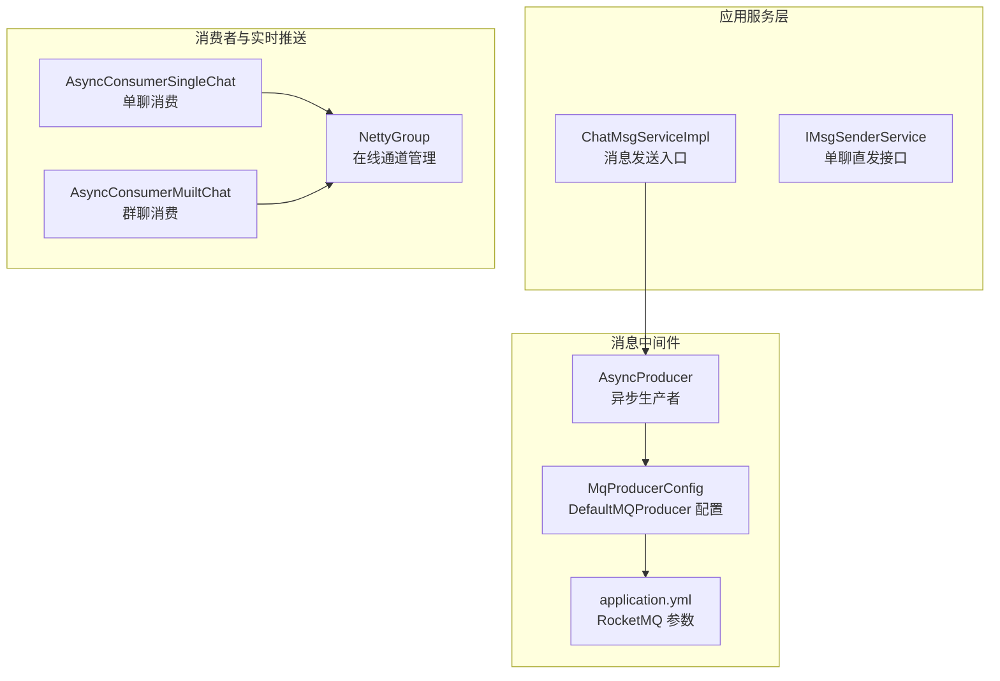
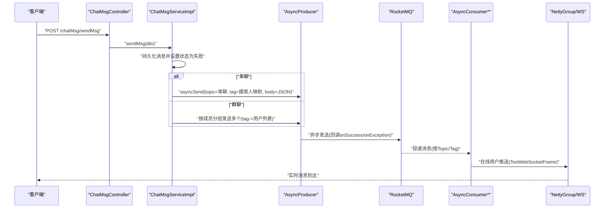
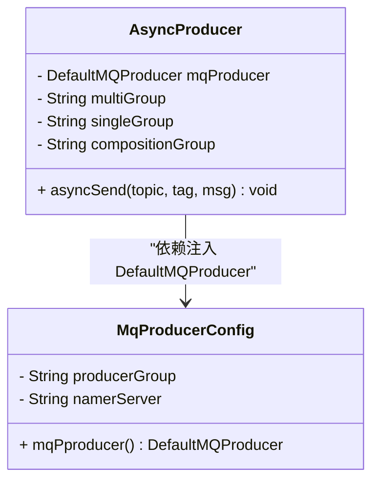
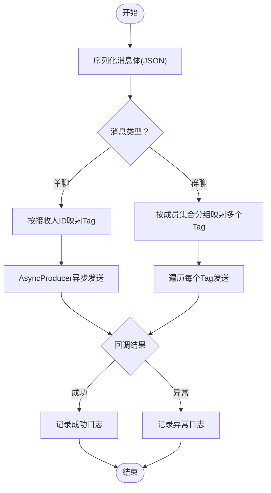
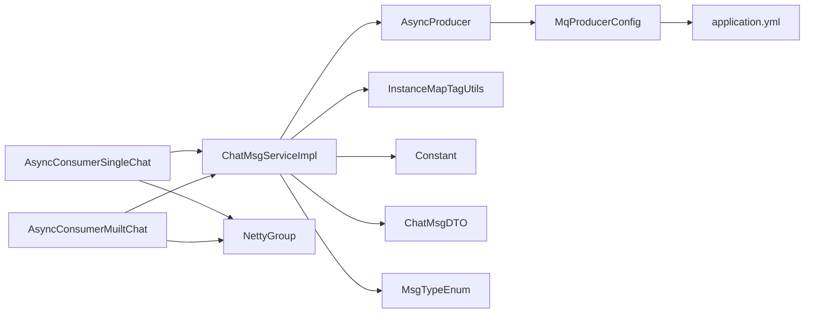

# 消息生产者

<cite>
**本文引用的文件**
- [AsyncProducer.java](file://src/main/java/com/hch/chat_simple/mq/AsyncProducer.java)
- [MqProducerConfig.java](file://src/main/java/com/hch/chat_simple/mq/MqProducerConfig.java)
- [ChatMsgServiceImpl.java](file://src/main/java/com/hch/chat_simple/service/impl/ChatMsgServiceImpl.java)
- [application.yml](file://src/main/resources/application.yml)
- [MsgTypeEnum.java](file://src/main/java/com/hch/chat_simple/enums/MsgTypeEnum.java)
- [ChatMsgDTO.java](file://src/main/java/com/hch/chat_simple/pojo/dto/ChatMsgDTO.java)
- [AsyncConsumerSingleChat.java](file://src/main/java/com/hch/chat_simple/mq/AsyncConsumerSingleChat.java)
- [AsyncConsumerMuiltChat.java](file://src/main/java/com/hch/chat_simple/mq/AsyncConsumerMuiltChat.java)
- [InstanceMapTagUtils.java](file://src/main/java/com/hch/chat_simple/util/InstanceMapTagUtils.java)
- [Constant.java](file://src/main/java/com/hch/chat_simple/util/Constant.java)
- [NettyGroup.java](file://src/main/java/com/hch/chat_simple/config/NettyGroup.java)
- [IChatMsgService.java](file://src/main/java/com/hch/chat_simple/service/IChatMsgService.java)
- [MsgBodyResolveUtil.java](file://src/main/java/com/hch/chat_simple/util/MsgBodyResolveUtil.java)
</cite>

## 目录
1. [简介](#简介)
2. [项目结构](#项目结构)
3. [核心组件](#核心组件)
4. [架构总览](#架构总览)
5. [详细组件分析](#详细组件分析)
6. [依赖分析](#依赖分析)
7. [性能考虑](#性能考虑)
8. [故障排查指南](#故障排查指南)
9. [结论](#结论)
10. [附录](#附录)

## 简介
本文件面向消息生产者的技术实现，重点围绕 AsyncProducer 类与 DefaultMQProducer 的配置与使用展开，系统性阐述消息发送流程（消息封装、异步发送回调、错误处理）、不同消息类型的发送策略（单聊、群聊、组合消息）、生产者配置参数（超时、重试、批量发送）以及 API 使用示例与最佳实践（异常处理、性能优化、监控告警）。同时给出消息格式规范与序列化处理方式，帮助读者快速理解并安全高效地集成与扩展。

## 项目结构
本项目采用 Spring Boot 层次化组织，消息相关模块集中在 mq、service、util、config 等包内，结合 RocketMQ 生产与消费解耦，配合 Netty 实现实时推送。

图示来源
- [ChatMsgServiceImpl.java:97-144](file://src/main/java/com/hch/chat_simple/service/impl/ChatMsgServiceImpl.java#L97-L144)
- [AsyncProducer.java:40-59](file://src/main/java/com/hch/chat_simple/mq/AsyncProducer.java#L40-L59)
- [MqProducerConfig.java:22-28](file://src/main/java/com/hch/chat_simple/mq/MqProducerConfig.java#L22-L28)
- [application.yml:39-51](file://src/main/resources/application.yml#L39-L51)
- [AsyncConsumerSingleChat.java:47-73](file://src/main/java/com/hch/chat_simple/mq/AsyncConsumerSingleChat.java#L47-L73)
- [AsyncConsumerMuiltChat.java:49-83](file://src/main/java/com/hch/chat_simple/mq/AsyncConsumerMuiltChat.java#L49-L83)
- [NettyGroup.java:11-26](file://src/main/java/com/hch/chat_simple/config/NettyGroup.java#L11-L26)

章节来源
- [application.yml:39-51](file://src/main/resources/application.yml#L39-L51)
- [MqProducerConfig.java:16-28](file://src/main/java/com/hch/chat_simple/mq/MqProducerConfig.java#L16-L28)

## 核心组件
- AsyncProducer：封装 RocketMQ 异步发送逻辑，负责将消息以异步回调的方式投递到指定 Topic/Tag，并记录成功与异常日志。
- MqProducerConfig：定义 DefaultMQProducer Bean，设置名称服务器地址与生产者分组，启动生产者实例。
- ChatMsgServiceImpl：业务入口，负责消息持久化、消息类型判断、按单聊/群聊拆分与路由、调用 AsyncProducer 发送。
- AsyncConsumerSingleChat / AsyncConsumerMuiltChat：消费者侧将消息推送到在线用户的 WebSocket 通道。
- NettyGroup：维护在线用户与 Channel 的映射，支撑实时推送。
- InstanceMapTagUtils：基于用户 ID 或群成员集合进行标签映射，用于跨实例负载均衡与广播。
- Constant / MsgTypeEnum / ChatMsgDTO：常量、消息类型枚举与消息体模型，统一消息格式与语义。

章节来源
- [AsyncProducer.java:17-62](file://src/main/java/com/hch/chat_simple/mq/AsyncProducer.java#L17-L62)
- [MqProducerConfig.java:13-30](file://src/main/java/com/hch/chat_simple/mq/MqProducerConfig.java#L13-L30)
- [ChatMsgServiceImpl.java:55-144](file://src/main/java/com/hch/chat_simple/service/impl/ChatMsgServiceImpl.java#L55-L144)
- [AsyncConsumerSingleChat.java:36-83](file://src/main/java/com/hch/chat_simple/mq/AsyncConsumerSingleChat.java#L36-L83)
- [AsyncConsumerMuiltChat.java:31-91](file://src/main/java/com/hch/chat_simple/mq/AsyncConsumerMuiltChat.java#L31-L91)
- [NettyGroup.java:11-29](file://src/main/java/com/hch/chat_simple/config/NettyGroup.java#L11-L29)
- [InstanceMapTagUtils.java:14-54](file://src/main/java/com/hch/chat_simple/util/InstanceMapTagUtils.java#L14-L54)
- [Constant.java:3-32](file://src/main/java/com/hch/chat_simple/util/Constant.java#L3-L32)
- [MsgTypeEnum.java:6-15](file://src/main/java/com/hch/chat_simple/enums/MsgTypeEnum.java#L6-L15)
- [ChatMsgDTO.java:13-61](file://src/main/java/com/hch/chat_simple/pojo/dto/ChatMsgDTO.java#L13-L61)

## 架构总览
消息从服务层进入，先持久化并生成消息 ID，再依据消息类型选择发送路径：单聊按接收人路由到对应 Tag；群聊按成员集合分组到多个 Tag 广播。生产者异步发送至 RocketMQ，消费者从对应 Topic/Tag 拉取消息并推送至在线用户 WebSocket。

图示来源
- [ChatMsgServiceImpl.java:97-144](file://src/main/java/com/hch/chat_simple/service/impl/ChatMsgServiceImpl.java#L97-L144)
- [AsyncProducer.java:40-59](file://src/main/java/com/hch/chat_simple/mq/AsyncProducer.java#L40-L59)
- [AsyncConsumerSingleChat.java:47-73](file://src/main/java/com/hch/chat_simple/mq/AsyncConsumerSingleChat.java#L47-L73)
- [AsyncConsumerMuiltChat.java:49-83](file://src/main/java/com/hch/chat_simple/mq/AsyncConsumerMuiltChat.java#L49-L83)
- [NettyGroup.java:11-29](file://src/main/java/com/hch/chat_simple/config/NettyGroup.java#L11-L29)

## 详细组件分析

### AsyncProducer 组件
- 角色定位：封装 DefaultMQProducer 的异步发送，屏蔽底层细节，提供简洁的 asyncSend(topic, tag, body) 方法。
- 关键点
  - 使用 Message 封装 topic、tag 与字节数组正文。
  - 注入的 DefaultMQProducer 由 MqProducerConfig 提供，已设置名称服务器与分组并启动。
  - 异步回调 onSuccess/onException 分别记录成功与异常日志，便于监控与告警。
  - 通过 application.yml 中的 rocketmq.consumer.* 配置注入不同 Topic/Tag 的分组名（用于消费者侧识别）。

图示来源
- [AsyncProducer.java:17-62](file://src/main/java/com/hch/chat_simple/mq/AsyncProducer.java#L17-L62)
- [MqProducerConfig.java:16-28](file://src/main/java/com/hch/chat_simple/mq/MqProducerConfig.java#L16-L28)

章节来源
- [AsyncProducer.java:17-62](file://src/main/java/com/hch/chat_simple/mq/AsyncProducer.java#L17-L62)
- [MqProducerConfig.java:16-28](file://src/main/java/com/hch/chat_simple/mq/MqProducerConfig.java#L16-L28)
- [application.yml:39-51](file://src/main/resources/application.yml#L39-L51)

### DefaultMQProducer 配置与使用
- 配置来源：MqProducerConfig 通过 @Value 读取 rocketmq.producer.group 与 rocketmq.name-server，创建并启动 DefaultMQProducer。
- 使用方式：AsyncProducer 直接注入 DefaultMQProducer，无需手动管理生命周期。
- 建议
  - 在生产环境确保名称服务器可达与可用。
  - 合理设置生产者分组，避免跨环境冲突。
  - 如需自定义超时、重试、批量等参数，可在 MqProducerConfig 中扩展 DefaultMQProducer 的属性设置。

章节来源
- [MqProducerConfig.java:16-28](file://src/main/java/com/hch/chat_simple/mq/MqProducerConfig.java#L16-L28)
- [application.yml:39-46](file://src/main/resources/application.yml#L39-L46)

### 消息发送流程（封装、异步回调、错误处理）
- 封装：ChatMsgServiceImpl 将 ChatMsgDTO 序列化为 JSON 字符串作为消息体，构造 RocketMQ Message。
- 单聊：按接收人 ID 映射到 Tag（InstanceMapTagUtils），发送到单聊 Topic。
- 群聊：按成员集合分组映射到多个 Tag，广播发送到群聊 Topic。
- 异步回调：AsyncProducer 使用 SendCallback，在 onSuccess 中记录成功日志，在 onException 中记录异常日志。
- 错误处理：捕获 MQClientException、RemotingException、InterruptedException，保证上层调用不被阻塞。

图示来源
- [ChatMsgServiceImpl.java:97-144](file://src/main/java/com/hch/chat_simple/service/impl/ChatMsgServiceImpl.java#L97-L144)
- [AsyncProducer.java:40-59](file://src/main/java/com/hch/chat_simple/mq/AsyncProducer.java#L40-L59)
- [InstanceMapTagUtils.java:32-47](file://src/main/java/com/hch/chat_simple/util/InstanceMapTagUtils.java#L32-L47)

章节来源
- [ChatMsgServiceImpl.java:97-144](file://src/main/java/com/hch/chat_simple/service/impl/ChatMsgServiceImpl.java#L97-L144)
- [AsyncProducer.java:40-59](file://src/main/java/com/hch/chat_simple/mq/AsyncProducer.java#L40-L59)

### 不同消息类型的发送策略
- 单聊消息
  - Topic：${mq.topic.single-chat}
  - Tag：按接收人 ID 映射到具体 Tag，实现一对一精准路由。
  - 消费：AsyncConsumerSingleChat 从单聊 Topic 拉取，按接收人在线状态推送。
- 群聊消息
  - Topic：${mq.topic.multi-chat}
  - Tag：按成员集合分组映射多个 Tag，实现跨实例广播。
  - 消费：AsyncConsumerMuiltChat 从群聊 Topic 拉取，逐个成员推送。
- 组合消息
  - 当前代码未显式定义“组合消息”专用 Topic/Tag，可复用群聊策略或新增 Topic/Tag 以支持混合场景。

章节来源
- [application.yml:47-51](file://src/main/resources/application.yml#L47-L51)
- [ChatMsgServiceImpl.java:119-135](file://src/main/java/com/hch/chat_simple/service/impl/ChatMsgServiceImpl.java#L119-L135)
- [AsyncConsumerSingleChat.java:47-73](file://src/main/java/com/hch/chat_simple/mq/AsyncConsumerSingleChat.java#L47-L73)
- [AsyncConsumerMuiltChat.java:49-83](file://src/main/java/com/hch/chat_simple/mq/AsyncConsumerMuiltChat.java#L49-L83)

### 生产者配置参数与行为
- 必要参数
  - rocketmq.name-server：名称服务器地址。
  - rocketmq.producer.group：生产者分组。
  - mq.topic.single-chat / multi-chat：单聊/群聊 Topic 名称。
- 可选优化参数（建议在 MqProducerConfig 扩展）
  - 发送超时：设置生产者发送超时时间，避免阻塞。
  - 重试策略：设置最大重试次数与重试间隔。
  - 批量发送：启用批量发送以提升吞吐。
  - 压缩阈值：对大消息启用压缩。
  - 回调线程池：自定义 SendCallback 线程池大小。
- 配置示例参考
  - application.yml 中已提供名称服务器与 Topic/分组的基础配置。

章节来源
- [application.yml:39-51](file://src/main/resources/application.yml#L39-L51)
- [MqProducerConfig.java:16-28](file://src/main/java/com/hch/chat_simple/mq/MqProducerConfig.java#L16-L28)

### API 使用示例与最佳实践
- 单聊发送
  - 步骤：构造 ChatMsgDTO（设置 msgType=SEND_MSG、chatType=SINGLE_CHAT、receiveUserId、content 等），调用 ChatMsgServiceImpl.sendMsg。
  - 注意：接收人在线状态由消费者侧 NettyGroup 判断，未在线将不会推送。
- 群聊发送
  - 步骤：构造 ChatMsgDTO（设置 msgType=SEND_MSG、chatType=MUILT_CHAT、groupId、content 等），调用 ChatMsgServiceImpl.sendMsg。
  - 注意：会按成员集合分组广播，避免向发送者本人重复推送。
- 异常处理
  - 生产端：AsyncProducer 的 SendCallback 记录异常日志；上层捕获 MQClientException/RemotingException/InterruptedException。
  - 消费端：消费者方法内部 try-catch 包裹，抛出运行时异常以便 RocketMQ 消费失败重试。
- 性能优化
  - 使用 Tag 路由减少无效投递。
  - 合理设置批量发送与压缩阈值。
  - 控制回调线程池大小，避免过多并发导致资源争用。
- 监控与告警
  - 基于 onSuccess/onException 日志建立指标与告警。
  - 结合 RocketMQ 控台查看发送延迟、堆积与失败率。

章节来源
- [ChatMsgServiceImpl.java:97-144](file://src/main/java/com/hch/chat_simple/service/impl/ChatMsgServiceImpl.java#L97-L144)
- [AsyncProducer.java:40-59](file://src/main/java/com/hch/chat_simple/mq/AsyncProducer.java#L40-L59)
- [AsyncConsumerSingleChat.java:76-82](file://src/main/java/com/hch/chat_simple/mq/AsyncConsumerSingleChat.java#L76-L82)
- [AsyncConsumerMuiltChat.java:50-55](file://src/main/java/com/hch/chat_simple/mq/AsyncConsumerMuiltChat.java#L50-L55)

### 消息格式规范与序列化处理
- 消息体结构：ChatMsgDTO
  - 字段：msgType、chatType、sendUserId、receiveUserId、content、groupId、createdAt、dateTime、msgId、friendId、groupToUserIds、contentType、contentLen 等。
  - 语义：统一消息类型枚举 MsgTypeEnum，聊天类型常量 Constant。
- 序列化方式：服务层将 ChatMsgDTO 转换为 JSON 字符串作为消息体，消费者侧再反序列化为对象。
- 格式约定：消费者侧对单聊消息约定格式为 “msgType + ',' + JSON”，便于前端解析与状态同步。
- 校验与拆分：MsgBodyResolveUtil 提供基于分隔符的拆分与正则校验工具，可用于自定义协议的解析与校验。

章节来源
- [ChatMsgDTO.java:13-61](file://src/main/java/com/hch/chat_simple/pojo/dto/ChatMsgDTO.java#L13-L61)
- [MsgTypeEnum.java:6-15](file://src/main/java/com/hch/chat_simple/enums/MsgTypeEnum.java#L6-L15)
- [Constant.java:19-21](file://src/main/java/com/hch/chat_simple/util/Constant.java#L19-L21)
- [AsyncConsumerSingleChat.java:58-60](file://src/main/java/com/hch/chat_simple/mq/AsyncConsumerSingleChat.java#L58-L60)
- [MsgBodyResolveUtil.java:12-72](file://src/main/java/com/hch/chat_simple/util/MsgBodyResolveUtil.java#L12-L72)

## 依赖分析
- 组件耦合
  - ChatMsgServiceImpl 依赖 AsyncProducer、IChatMsgService、IGroupInfoService、InstanceMapTagUtils 等。
  - AsyncProducer 依赖 DefaultMQProducer（由 MqProducerConfig 提供）。
  - 消费者 AsyncConsumerSingleChat/AsyncConsumerMuiltChat 依赖 NettyGroup 与 IChatMsgService。
- 外部依赖
  - RocketMQ 客户端与 Spring Boot Starter（通过注解驱动消费者监听）。
  - Netty 用于 WebSocket 实时推送。
- 风险点
  - 若名称服务器不可达或 Topic/Tag 配置错误，会导致发送失败。
  - 消费端未在线用户不会收到消息，需结合离线落库与重试策略。

图示来源
- [ChatMsgServiceImpl.java:55-144](file://src/main/java/com/hch/chat_simple/service/impl/ChatMsgServiceImpl.java#L55-L144)
- [AsyncProducer.java:17-62](file://src/main/java/com/hch/chat_simple/mq/AsyncProducer.java#L17-L62)
- [MqProducerConfig.java:16-28](file://src/main/java/com/hch/chat_simple/mq/MqProducerConfig.java#L16-L28)
- [application.yml:39-51](file://src/main/resources/application.yml#L39-L51)
- [AsyncConsumerSingleChat.java:36-83](file://src/main/java/com/hch/chat_simple/mq/AsyncConsumerSingleChat.java#L36-L83)
- [AsyncConsumerMuiltChat.java:31-91](file://src/main/java/com/hch/chat_simple/mq/AsyncConsumerMuiltChat.java#L31-L91)
- [NettyGroup.java:11-29](file://src/main/java/com/hch/chat_simple/config/NettyGroup.java#L11-L29)
- [InstanceMapTagUtils.java:14-54](file://src/main/java/com/hch/chat_simple/util/InstanceMapTagUtils.java#L14-L54)
- [Constant.java:3-32](file://src/main/java/com/hch/chat_simple/util/Constant.java#L3-L32)
- [ChatMsgDTO.java:13-61](file://src/main/java/com/hch/chat_simple/pojo/dto/ChatMsgDTO.java#L13-L61)
- [MsgTypeEnum.java:6-15](file://src/main/java/com/hch/chat_simple/enums/MsgTypeEnum.java#L6-L15)

章节来源
- [ChatMsgServiceImpl.java:55-144](file://src/main/java/com/hch/chat_simple/service/impl/ChatMsgServiceImpl.java#L55-L144)
- [AsyncProducer.java:17-62](file://src/main/java/com/hch/chat_simple/mq/AsyncProducer.java#L17-L62)
- [MqProducerConfig.java:16-28](file://src/main/java/com/hch/chat_simple/mq/MqProducerConfig.java#L16-L28)
- [AsyncConsumerSingleChat.java:36-83](file://src/main/java/com/hch/chat_simple/mq/AsyncConsumerSingleChat.java#L36-L83)
- [AsyncConsumerMuiltChat.java:31-91](file://src/main/java/com/hch/chat_simple/mq/AsyncConsumerMuiltChat.java#L31-L91)
- [NettyGroup.java:11-29](file://src/main/java/com/hch/chat_simple/config/NettyGroup.java#L11-L29)
- [InstanceMapTagUtils.java:14-54](file://src/main/java/com/hch/chat_simple/util/InstanceMapTagUtils.java#L14-L54)
- [Constant.java:3-32](file://src/main/java/com/hch/chat_simple/util/Constant.java#L3-L32)
- [ChatMsgDTO.java:13-61](file://src/main/java/com/hch/chat_simple/pojo/dto/ChatMsgDTO.java#L13-L61)
- [MsgTypeEnum.java:6-15](file://src/main/java/com/hch/chat_simple/enums/MsgTypeEnum.java#L6-L15)

## 性能考虑
- 路由与广播
  - 单聊按接收人映射 Tag，降低无效投递。
  - 群聊按成员集合分组映射多个 Tag，实现跨实例广播。
- 批量与压缩
  - 建议在 MqProducerConfig 中开启批量发送与压缩阈值，提升吞吐与带宽利用率。
- 回调与线程池
  - SendCallback 与消费者处理逻辑应避免阻塞，必要时引入异步线程池。
- 超时与重试
  - 设置合理的发送超时与最大重试次数，防止长时间阻塞影响请求链路。
- 监控指标
  - 基于 onSuccess/onException 日志统计发送成功率、失败率与延迟分布。

[本节为通用指导，无需特定文件引用]

## 故障排查指南
- 发送异常
  - 现象：onException 日志频繁出现。
  - 排查：检查名称服务器连通性、Topic/Tag 是否存在、生产者分组是否正确。
- 消费失败
  - 现象：消费者抛出运行时异常。
  - 排查：确认 ChatMsgDTO 字段完整性、JSON 序列化一致性、NettyGroup 中用户在线状态。
- 未收到消息
  - 现象：发送成功但接收端未收到。
  - 排查：确认接收人在线、Tag 映射正确、消费者订阅的 Topic/Tag 一致。
- 性能问题
  - 现象：发送延迟高、堆积严重。
  - 排查：检查批量参数、压缩阈值、回调线程池大小与消费者并发度。

章节来源
- [AsyncProducer.java:40-59](file://src/main/java/com/hch/chat_simple/mq/AsyncProducer.java#L40-L59)
- [AsyncConsumerSingleChat.java:76-82](file://src/main/java/com/hch/chat_simple/mq/AsyncConsumerSingleChat.java#L76-L82)
- [AsyncConsumerMuiltChat.java:50-55](file://src/main/java/com/hch/chat_simple/mq/AsyncConsumerMuiltChat.java#L50-L55)

## 结论
本文从架构与实现两个层面梳理了消息生产者的设计与落地，重点覆盖 AsyncProducer 与 DefaultMQProducer 的配置与使用、消息发送流程、不同消息类型的发送策略、配置参数与最佳实践，以及消息格式与序列化规范。通过 Tag 路由与广播、异步回调与日志监控，系统实现了高可靠、低耦合的消息投递与实时推送能力。建议在生产环境中进一步完善超时与重试策略、批量与压缩参数，并结合监控告警体系持续优化。

[本节为总结，无需特定文件引用]

## 附录
- 关键配置项
  - rocketmq.name-server：名称服务器地址。
  - rocketmq.producer.group：生产者分组。
  - mq.topic.single-chat / multi-chat：单聊/群聊 Topic。
  - rocketmq.consumer.group / single / composition：消费者分组（用于消费者侧识别）。
- 常量与枚举
  - Constant：消息状态、聊天类型等常量。
  - MsgTypeEnum：消息类型枚举。
- 工具类
  - InstanceMapTagUtils：用户 ID 与 Tag 映射。
  - MsgBodyResolveUtil：消息体拆分与正则校验。

章节来源
- [application.yml:39-51](file://src/main/resources/application.yml#L39-L51)
- [Constant.java:3-32](file://src/main/java/com/hch/chat_simple/util/Constant.java#L3-L32)
- [MsgTypeEnum.java:6-15](file://src/main/java/com/hch/chat_simple/enums/MsgTypeEnum.java#L6-L15)
- [InstanceMapTagUtils.java:14-54](file://src/main/java/com/hch/chat_simple/util/InstanceMapTagUtils.java#L14-L54)
- [MsgBodyResolveUtil.java:10-73](file://src/main/java/com/hch/chat_simple/util/MsgBodyResolveUtil.java#L10-L73)