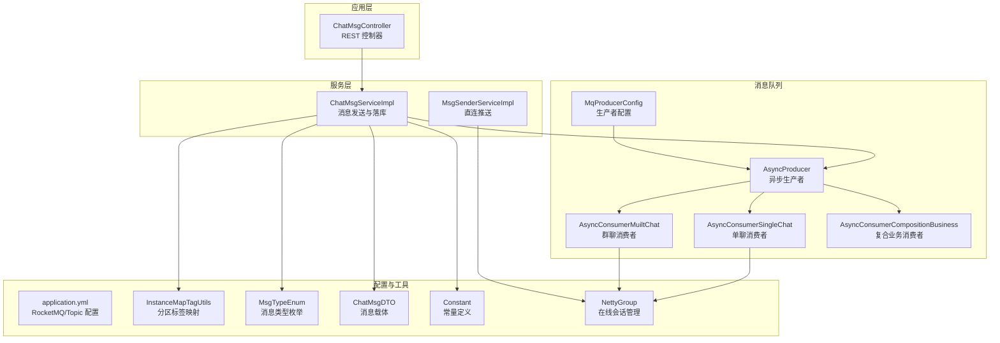
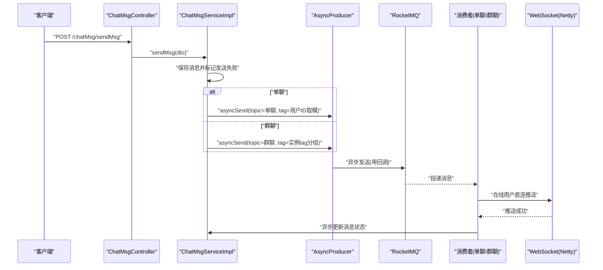
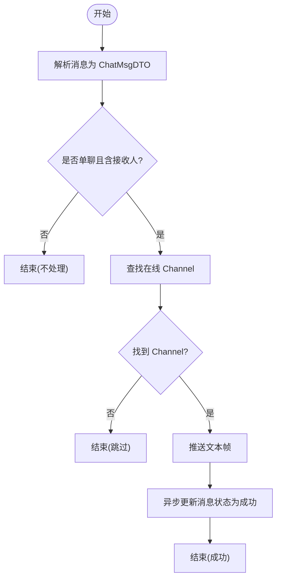
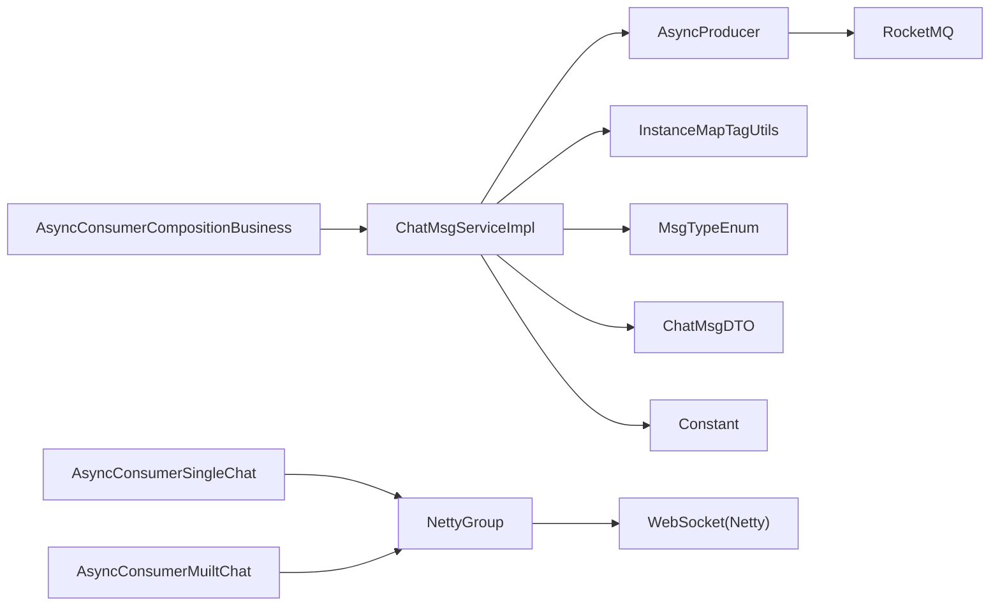

# 消息队列系统

<cite>
**本文引用的文件**
- [AsyncProducer.java](file://src/main/java/com/hch/chat_simple/mq/AsyncProducer.java)
- [MqProducerConfig.java](file://src/main/java/com/hch/chat_simple/mq/MqProducerConfig.java)
- [AsyncConsumerSingleChat.java](file://src/main/java/com/hch/chat_simple/mq/AsyncConsumerSingleChat.java)
- [AsyncConsumerMuiltChat.java](file://src/main/java/com/hch/chat_simple/mq/AsyncConsumerMuiltChat.java)
- [AsyncConsumerCompositionBusiness.java](file://src/main/java/com/hch/chat_simple/mq/AsyncConsumerCompositionBusiness.java)
- [application.yml](file://src/main/resources/application.yml)
- [ChatMsgServiceImpl.java](file://src/main/java/com/hch/chat_simple/service/impl/ChatMsgServiceImpl.java)
- [InstanceMapTagUtils.java](file://src/main/java/com/hch/chat_simple/util/InstanceMapTagUtils.java)
- [MsgTypeEnum.java](file://src/main/java/com/hch/chat_simple/enums/MsgTypeEnum.java)
- [ChatMsgDTO.java](file://src/main/java/com/hch/chat_simple/pojo/dto/ChatMsgDTO.java)
- [Constant.java](file://src/main/java/com/hch/chat_simple/util/Constant.java)
- [NettyGroup.java](file://src/main/java/com/hch/chat_simple/config/NettyGroup.java)
- [ChatMsgController.java](file://src/main/java/com/hch/chat_simple/controller/ChatMsgController.java)
- [IMsgSenderService.java](file://src/main/java/com/hch/chat_simple/service/IMsgSenderService.java)
- [MsgSenderServiceImpl.java](file://src/main/java/com/hch/chat_simple/service/impl/MsgSenderServiceImpl.java)
</cite>

## 目录
1. [引言](#引言)
2. [项目结构](#项目结构)
3. [核心组件](#核心组件)
4. [架构总览](#架构总览)
5. [详细组件分析](#详细组件分析)
6. [依赖分析](#依赖分析)
7. [性能考虑](#性能考虑)
8. [故障排查指南](#故障排查指南)
9. [结论](#结论)
10. [附录](#附录)

## 引言
本文件面向消息队列系统（基于 RocketMQ）的综合技术文档，聚焦于异步消息处理架构的设计与实现。文档围绕消息生产者、消费者、分区策略、可靠性保障、监控运维以及消息格式规范展开，帮助读者快速理解并高效维护该系统。

## 项目结构
该项目采用分层与模块化组织方式，消息队列相关代码集中在 mq 包内，业务服务位于 service 层，配置与资源位于 resources 下。整体结构清晰，职责分离明确，便于扩展与维护。

图表来源
- [ChatMsgController.java:1-58](file://src/main/java/com/hch/chat_simple/controller/ChatMsgController.java#L1-L58)
- [ChatMsgServiceImpl.java:1-184](file://src/main/java/com/hch/chat_simple/service/impl/ChatMsgServiceImpl.java#L1-L184)
- [AsyncProducer.java:1-63](file://src/main/java/com/hch/chat_simple/mq/AsyncProducer.java#L1-L63)
- [MqProducerConfig.java:1-31](file://src/main/java/com/hch/chat_simple/mq/MqProducerConfig.java#L1-L31)
- [AsyncConsumerSingleChat.java:1-84](file://src/main/java/com/hch/chat_simple/mq/AsyncConsumerSingleChat.java#L1-L84)
- [AsyncConsumerMuiltChat.java:1-92](file://src/main/java/com/hch/chat_simple/mq/AsyncConsumerMuiltChat.java#L1-L92)
- [AsyncConsumerCompositionBusiness.java:1-52](file://src/main/java/com/hch/chat_simple/mq/AsyncConsumerCompositionBusiness.java#L1-L52)
- [application.yml:1-89](file://src/main/resources/application.yml#L1-L89)
- [InstanceMapTagUtils.java:1-55](file://src/main/java/com/hch/chat_simple/util/InstanceMapTagUtils.java#L1-L55)
- [MsgTypeEnum.java:1-25](file://src/main/java/com/hch/chat_simple/enums/MsgTypeEnum.java#L1-L25)
- [ChatMsgDTO.java:1-62](file://src/main/java/com/hch/chat_simple/pojo/dto/ChatMsgDTO.java#L1-L62)
- [Constant.java:1-33](file://src/main/java/com/hch/chat_simple/util/Constant.java#L1-L33)
- [NettyGroup.java:1-30](file://src/main/java/com/hch/chat_simple/config/NettyGroup.java#L1-L30)
- [IMsgSenderService.java:1-10](file://src/main/java/com/hch/chat_simple/service/IMsgSenderService.java#L1-L10)
- [MsgSenderServiceImpl.java:1-40](file://src/main/java/com/hch/chat_simple/service/impl/MsgSenderServiceImpl.java#L1-L40)

章节来源
- [application.yml:1-89](file://src/main/resources/application.yml#L1-L89)
- [ChatMsgController.java:1-58](file://src/main/java/com/hch/chat_simple/controller/ChatMsgController.java#L1-L58)

## 核心组件
- 生产者与配置
  - 生产者配置：通过配置类初始化 RocketMQ 生产者，设置名称服务器地址与生产者分组，启动后可全局注入使用。
  - 异步生产者：封装 RocketMQ 的异步发送接口，支持回调日志记录，统一发送到指定 topic 与 tag。
- 消费者
  - 单聊消费者：解析消息，定位在线接收方，通过 Netty 直接推送；成功后异步更新消息状态。
  - 群聊消费者：按消息中预计算的接收人列表逐一推送，避免重复查询。
  - 复合业务消费者：按约定格式解析消息类型与通道键，路由到具体业务处理器。
- 分区策略
  - 用户 ID 取模映射到固定 tag，确保同一用户的消息稳定落在同一队列，提升顺序性与可维护性。
- 会话与推送
  - 使用 NettyGroup 维护用户与 Channel 的映射，结合消息类型枚举与 DTO 规范，完成消息格式化与推送。
- 配置与常量
  - application.yml 中集中管理 RocketMQ 名称服务器、生产者/消费者分组、topic 与 tag 列表等。
  - Constant 提供消息状态、聊天类型等常量，统一语义。

章节来源
- [MqProducerConfig.java:1-31](file://src/main/java/com/hch/chat_simple/mq/MqProducerConfig.java#L1-L31)
- [AsyncProducer.java:1-63](file://src/main/java/com/hch/chat_simple/mq/AsyncProducer.java#L1-L63)
- [AsyncConsumerSingleChat.java:1-84](file://src/main/java/com/hch/chat_simple/mq/AsyncConsumerSingleChat.java#L1-L84)
- [AsyncConsumerMuiltChat.java:1-92](file://src/main/java/com/hch/chat_simple/mq/AsyncConsumerMuiltChat.java#L1-L92)
- [AsyncConsumerCompositionBusiness.java:1-52](file://src/main/java/com/hch/chat_simple/mq/AsyncConsumerCompositionBusiness.java#L1-L52)
- [InstanceMapTagUtils.java:1-55](file://src/main/java/com/hch/chat_simple/util/InstanceMapTagUtils.java#L1-L55)
- [application.yml:1-89](file://src/main/resources/application.yml#L1-L89)
- [NettyGroup.java:1-30](file://src/main/java/com/hch/chat_simple/config/NettyGroup.java#L1-L30)
- [Constant.java:1-33](file://src/main/java/com/hch/chat_simple/util/Constant.java#L1-L33)

## 架构总览
系统采用“请求入库 + 异步投递”的模式：客户端调用服务层接口，先写入数据库并标记发送失败，随后由生产者按聊天类型与分区策略投递到 RocketMQ；消费者从队列中拉取消息，定位在线用户并推送至 WebSocket，最后异步更新消息状态。

图表来源
- [ChatMsgController.java:1-58](file://src/main/java/com/hch/chat_simple/controller/ChatMsgController.java#L1-L58)
- [ChatMsgServiceImpl.java:1-184](file://src/main/java/com/hch/chat_simple/service/impl/ChatMsgServiceImpl.java#L1-L184)
- [AsyncProducer.java:1-63](file://src/main/java/com/hch/chat_simple/mq/AsyncProducer.java#L1-L63)
- [AsyncConsumerSingleChat.java:1-84](file://src/main/java/com/hch/chat_simple/mq/AsyncConsumerSingleChat.java#L1-L84)
- [AsyncConsumerMuiltChat.java:1-92](file://src/main/java/com/hch/chat_simple/mq/AsyncConsumerMuiltChat.java#L1-L92)
- [NettyGroup.java:1-30](file://src/main/java/com/hch/chat_simple/config/NettyGroup.java#L1-L30)

## 详细组件分析

### 生产者与配置
- 生产者配置
  - 初始化 DefaultMQProducer，设置名称服务器地址与生产者分组，启动后可被其他组件注入使用。
- 异步生产者
  - 将消息体封装为 RocketMQ Message，使用 SendCallback 记录成功/异常日志，确保发送过程可观测。
  - 通过注入的消费者分组常量，间接控制不同业务场景下的消费者归属（如单聊、群聊、复合业务）。

章节来源
- [MqProducerConfig.java:1-31](file://src/main/java/com/hch/chat_simple/mq/MqProducerConfig.java#L1-L31)
- [AsyncProducer.java:1-63](file://src/main/java/com/hch/chat_simple/mq/AsyncProducer.java#L1-L63)

### 分区策略与消息序列化
- 分区策略
  - 单聊：用户 ID 对实例数量取模，得到固定 tag，保证同一用户的消息路由到相同队列。
  - 群聊：将成员 ID 列表按实例数量取模分组，生成多个 tag，分别投递，降低单队列压力。
- 消息序列化
  - 使用 JSON 序列化 ChatMsgDTO，作为消息体发送；消费者侧反序列化为对象，统一处理。

章节来源
- [InstanceMapTagUtils.java:1-55](file://src/main/java/com/hch/chat_simple/util/InstanceMapTagUtils.java#L1-L55)
- [ChatMsgServiceImpl.java:1-184](file://src/main/java/com/hch/chat_simple/service/impl/ChatMsgServiceImpl.java#L1-L184)
- [ChatMsgDTO.java:1-62](file://src/main/java/com/hch/chat_simple/pojo/dto/ChatMsgDTO.java#L1-L62)

### 单聊消费者处理逻辑
- 解析消息为 ChatMsgDTO，校验消息类型与接收人。
- 通过 NettyGroup 查找在线用户的 Channel，构造约定格式文本帧进行推送。
- 推送成功后，异步更新消息状态为成功，确保最终一致性。

图表来源
- [AsyncConsumerSingleChat.java:1-84](file://src/main/java/com/hch/chat_simple/mq/AsyncConsumerSingleChat.java#L1-L84)
- [NettyGroup.java:1-30](file://src/main/java/com/hch/chat_simple/config/NettyGroup.java#L1-L30)
- [Constant.java:1-33](file://src/main/java/com/hch/chat_simple/util/Constant.java#L1-L33)

章节来源
- [AsyncConsumerSingleChat.java:1-84](file://src/main/java/com/hch/chat_simple/mq/AsyncConsumerSingleChat.java#L1-L84)
- [NettyGroup.java:1-30](file://src/main/java/com/hch/chat_simple/config/NettyGroup.java#L1-L30)
- [Constant.java:1-33](file://src/main/java/com/hch/chat_simple/util/Constant.java#L1-L33)

### 群聊消费者处理逻辑
- 解析消息为 ChatMsgDTO，校验群聊标识与接收人列表。
- 遍历接收人列表，过滤发送者自身，按成员 ID 定位在线用户并推送。
- 由于生产端已预计算接收人列表，消费端无需再次查询，提升吞吐。

章节来源
- [AsyncConsumerMuiltChat.java:1-92](file://src/main/java/com/hch/chat_simple/mq/AsyncConsumerMuiltChat.java#L1-L92)

### 复合业务消费者处理逻辑
- 解析消息约定格式（消息类型,通道键,消息体），提取消息类型与通道键。
- 通过类型匹配注册的业务处理器集合，执行对应 consumeBusiness 方法，实现解耦与扩展。

章节来源
- [AsyncConsumerCompositionBusiness.java:1-52](file://src/main/java/com/hch/chat_simple/mq/AsyncConsumerCompositionBusiness.java#L1-L52)

### 消息可靠性与幂等性
- 可靠性
  - 生产端使用异步发送并记录回调日志，便于追踪发送结果。
  - 消费端在推送成功后异步更新消息状态，确保最终一致。
- 幂等性
  - 建议在业务处理层引入去重键（如消息 ID 或业务唯一键），避免重复消费导致的重复处理。
  - 对于 WebSocket 推送，可在消费端记录已推送的用户集合，防止重复推送。

章节来源
- [AsyncProducer.java:1-63](file://src/main/java/com/hch/chat_simple/mq/AsyncProducer.java#L1-L63)
- [AsyncConsumerSingleChat.java:1-84](file://src/main/java/com/hch/chat_simple/mq/AsyncConsumerSingleChat.java#L1-L84)
- [AsyncConsumerMuiltChat.java:1-92](file://src/main/java/com/hch/chat_simple/mq/AsyncConsumerMuiltChat.java#L1-L92)

### 配置管理
- RocketMQ
  - 名称服务器地址、生产者分组、消费者分组均在配置文件中集中管理。
- Topic 与 Tag
  - 单聊、群聊、复合业务的主题名称与 tag 列表在配置文件中定义，便于统一维护。
- 实例与 Tag 映射
  - 通过配置项定义 tag 列表，运行时计算实例数量，用于用户与群组的分区映射。

章节来源
- [application.yml:1-89](file://src/main/resources/application.yml#L1-L89)
- [InstanceMapTagUtils.java:1-55](file://src/main/java/com/hch/chat_simple/util/InstanceMapTagUtils.java#L1-L55)

### 消息格式规范
- 单聊/群聊消息
  - 消息体为 ChatMsgDTO 的 JSON 字符串，包含消息类型、聊天类型、发送人、接收人、内容、时间戳等字段。
- 复合业务消息
  - 约定格式为“消息类型,通道键,消息体”，其中消息类型与通道键为数字，便于快速解析与路由。

章节来源
- [ChatMsgDTO.java:1-62](file://src/main/java/com/hch/chat_simple/pojo/dto/ChatMsgDTO.java#L1-L62)
- [MsgTypeEnum.java:1-25](file://src/main/java/com/hch/chat_simple/enums/MsgTypeEnum.java#L1-L25)
- [AsyncConsumerCompositionBusiness.java:1-52](file://src/main/java/com/hch/chat_simple/mq/AsyncConsumerCompositionBusiness.java#L1-L52)

## 依赖分析
- 组件耦合
  - ChatMsgServiceImpl 依赖 AsyncProducer、分组服务与工具类，承担消息落库与投递的协调职责。
  - 消费者组件依赖 NettyGroup 与服务层接口，负责在线用户直连推送与状态更新。
- 外部依赖
  - RocketMQ 客户端、Netty、MyBatis-Plus、FastJSON 等第三方库。
- 配置依赖
  - application.yml 中的 RocketMQ、Topic、Tag、Redisson 等配置项贯穿生产与消费两端。

图表来源
- [ChatMsgServiceImpl.java:1-184](file://src/main/java/com/hch/chat_simple/service/impl/ChatMsgServiceImpl.java#L1-L184)
- [AsyncProducer.java:1-63](file://src/main/java/com/hch/chat_simple/mq/AsyncProducer.java#L1-L63)
- [AsyncConsumerSingleChat.java:1-84](file://src/main/java/com/hch/chat_simple/mq/AsyncConsumerSingleChat.java#L1-L84)
- [AsyncConsumerMuiltChat.java:1-92](file://src/main/java/com/hch/chat_simple/mq/AsyncConsumerMuiltChat.java#L1-L92)
- [AsyncConsumerCompositionBusiness.java:1-52](file://src/main/java/com/hch/chat_simple/mq/AsyncConsumerCompositionBusiness.java#L1-L52)
- [NettyGroup.java:1-30](file://src/main/java/com/hch/chat_simple/config/NettyGroup.java#L1-L30)
- [application.yml:1-89](file://src/main/resources/application.yml#L1-L89)

章节来源
- [ChatMsgServiceImpl.java:1-184](file://src/main/java/com/hch/chat_simple/service/impl/ChatMsgServiceImpl.java#L1-L184)
- [application.yml:1-89](file://src/main/resources/application.yml#L1-L89)

## 性能考虑
- 分区与负载均衡
  - 单聊按用户 ID 取模，群聊按成员 ID 分组，减少热点与锁竞争，提升吞吐。
- 并发与线程池
  - 消费者内部使用固定大小线程池处理消息，避免阻塞 IO 导致的延迟放大。
- 推送路径优化
  - 消费端直接使用 Netty ChannelGroup 推送，减少中间层调用链。
- 数据库与状态更新
  - 先落库再投递，消费端成功后异步更新状态，避免阻塞主流程。

章节来源
- [InstanceMapTagUtils.java:1-55](file://src/main/java/com/hch/chat_simple/util/InstanceMapTagUtils.java#L1-L55)
- [AsyncConsumerSingleChat.java:1-84](file://src/main/java/com/hch/chat_simple/mq/AsyncConsumerSingleChat.java#L1-L84)
- [AsyncConsumerMuiltChat.java:1-92](file://src/main/java/com/hch/chat_simple/mq/AsyncConsumerMuiltChat.java#L1-L92)

## 故障排查指南
- 生产端异常
  - 检查 RocketMQ 名称服务器地址与网络连通性；查看生产回调日志，定位发送失败原因。
- 消费端异常
  - 核查消费者分组与主题订阅是否正确；检查 Netty 在线用户映射是否存在；确认消息格式解析是否符合约定。
- 消息堆积
  - 扩容消费者实例或增加并发度；检查消费速率与推送耗时，必要时优化推送路径。
- 幂等性问题
  - 引入去重键与幂等处理逻辑，避免重复消费导致的数据不一致。

章节来源
- [AsyncProducer.java:1-63](file://src/main/java/com/hch/chat_simple/mq/AsyncProducer.java#L1-L63)
- [AsyncConsumerSingleChat.java:1-84](file://src/main/java/com/hch/chat_simple/mq/AsyncConsumerSingleChat.java#L1-L84)
- [AsyncConsumerMuiltChat.java:1-92](file://src/main/java/com/hch/chat_simple/mq/AsyncConsumerMuiltChat.java#L1-L92)
- [application.yml:1-89](file://src/main/resources/application.yml#L1-L89)

## 结论
该系统以 RocketMQ 为核心，结合 Netty 实现高并发、低延迟的异步消息处理。通过合理的分区策略、直连推送与异步状态更新，实现了可靠的最终一致性。建议在现有基础上进一步完善重试与死信队列策略、引入去重与幂等控制，并持续优化监控与告警体系，以支撑更大规模的业务增长。

## 附录

### API 使用示例（参考）
- 发送消息
  - 请求：POST /chatMsg/sendMsg
  - 请求体：ChatMsgDTO（包含消息类型、聊天类型、发送人、接收人、内容等）
  - 返回：Payload<ChatMsgVO>，包含消息 ID 与时间戳
- 说明
  - 单聊：chatType=1，receiveUserId 必填
  - 群聊：chatType=2，groupId 与 groupToUserIds 必填

章节来源
- [ChatMsgController.java:1-58](file://src/main/java/com/hch/chat_simple/controller/ChatMsgController.java#L1-L58)
- [ChatMsgServiceImpl.java:1-184](file://src/main/java/com/hch/chat_simple/service/impl/ChatMsgServiceImpl.java#L1-L184)
- [ChatMsgDTO.java:1-62](file://src/main/java/com/hch/chat_simple/pojo/dto/ChatMsgDTO.java#L1-L62)