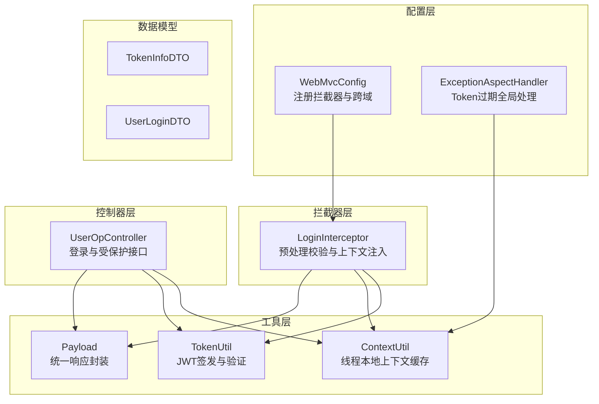
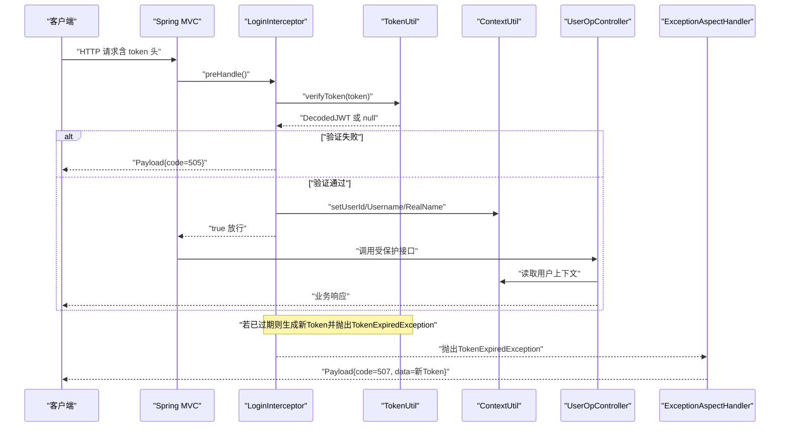
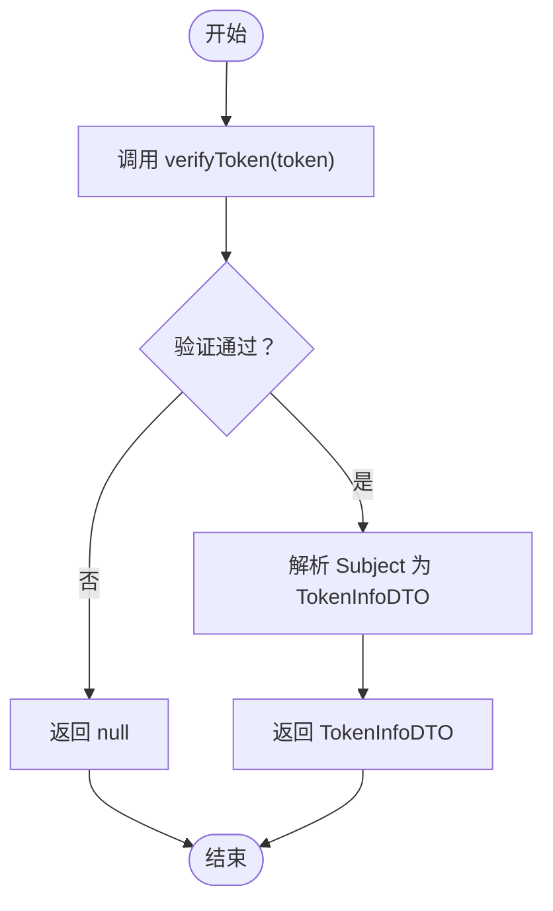
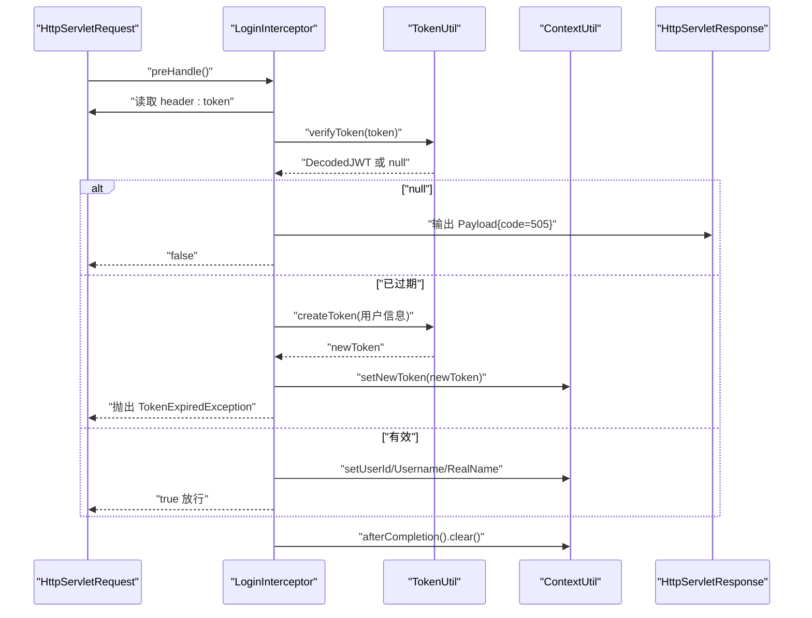
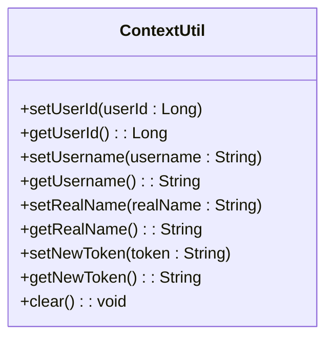
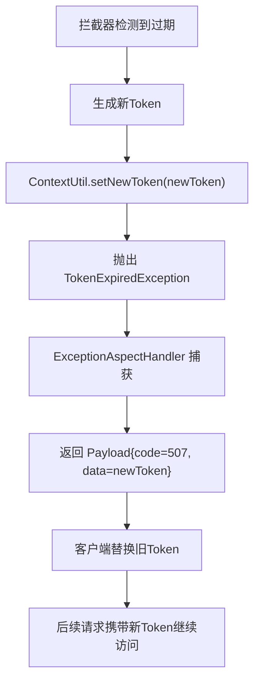
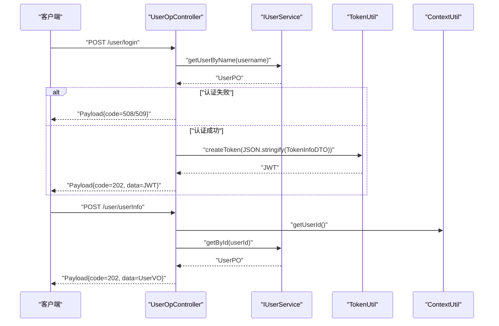
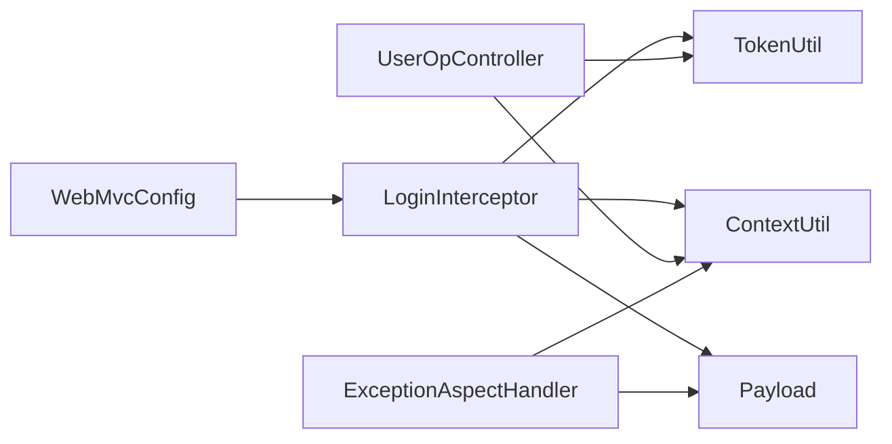

# 用户会话管理

<cite>
**本文引用的文件**
- [ContextUtil.java](file://src/main/java/com/hch/chat_simple/util/ContextUtil.java)
- [TokenUtil.java](file://src/main/java/com/hch/chat_simple/util/TokenUtil.java)
- [LoginInterceptor.java](file://src/main/java/com/hch/chat_simple/config/LoginInterceptor.java)
- [WebMvcConfig.java](file://src/main/java/com/hch/chat_simple/config/WebMvcConfig.java)
- [ExceptionAspectHandler.java](file://src/main/java/com/hch/chat_simple/config/ExceptionAspectHandler.java)
- [UserOpController.java](file://src/main/java/com/hch/chat_simple/controller/UserOpController.java)
- [TokenInfoDTO.java](file://src/main/java/com/hch/chat_simple/pojo/dto/TokenInfoDTO.java)
- [UserLoginDTO.java](file://src/main/java/com/hch/chat_simple/pojo/dto/UserLoginDTO.java)
- [Payload.java](file://src/main/java/com/hch/chat_simple/util/Payload.java)
- [NoAuth.java](file://src/main/java/com/hch/chat_simple/auth/NoAuth.java)
- [StatusCodeEnum.java](file://src/main/java/com/hch/chat_simple/util/StatusCodeEnum.java)
- [application.yml](file://src/main/resources/application.yml)
</cite>

## 目录
1. [简介](#简介)
2. [项目结构](#项目结构)
3. [核心组件](#核心组件)
4. [架构总览](#架构总览)
5. [详细组件分析](#详细组件分析)
6. [依赖分析](#依赖分析)
7. [性能考虑](#性能考虑)
8. [故障排查指南](#故障排查指南)
9. [结论](#结论)
10. [附录](#附录)

## 简介
本文件系统性阐述该聊天应用的用户会话管理方案，覆盖会话生命周期与状态维护、JWT令牌的解析与验证（签名验证、过期时间检查、用户身份提取）、登录拦截器的实现原理（请求拦截、权限验证、异常处理）、ContextUtil上下文工具的使用方式（用户信息缓存、线程安全保证、会话状态维护）、会话超时与续期机制（自动刷新策略、失效处理、安全退出），以及会话管理的配置项与最佳实践。

## 项目结构
围绕会话管理的关键模块分布如下：
- 配置层：拦截器注册与跨域处理
- 拦截器层：统一登录校验与上下文注入
- 工具层：JWT生成与验证、上下文缓存、响应封装
- 控制器层：登录接口与受保护资源访问
- 数据模型：Token信息载体与登录输入参数
- 异常处理：Token过期统一响应

图表来源
- [WebMvcConfig.java:11-16](file://src/main/java/com/hch/chat_simple/config/WebMvcConfig.java#L11-L16)
- [LoginInterceptor.java:30-90](file://src/main/java/com/hch/chat_simple/config/LoginInterceptor.java#L30-L90)
- [TokenUtil.java:18-70](file://src/main/java/com/hch/chat_simple/util/TokenUtil.java#L18-L70)
- [ContextUtil.java:5-51](file://src/main/java/com/hch/chat_simple/util/ContextUtil.java#L5-L51)
- [UserOpController.java:35-114](file://src/main/java/com/hch/chat_simple/controller/UserOpController.java#L35-L114)
- [ExceptionAspectHandler.java:12-23](file://src/main/java/com/hch/chat_simple/config/ExceptionAspectHandler.java#L12-L23)
- [TokenInfoDTO.java:9-19](file://src/main/java/com/hch/chat_simple/pojo/dto/TokenInfoDTO.java#L9-L19)
- [UserLoginDTO.java:9-21](file://src/main/java/com/hch/chat_simple/pojo/dto/UserLoginDTO.java#L9-L21)
- [Payload.java:5-29](file://src/main/java/com/hch/chat_simple/util/Payload.java#L5-L29)

章节来源
- [WebMvcConfig.java:8-27](file://src/main/java/com/hch/chat_simple/config/WebMvcConfig.java#L8-L27)
- [LoginInterceptor.java:27-109](file://src/main/java/com/hch/chat_simple/config/LoginInterceptor.java#L27-L109)
- [TokenUtil.java:17-70](file://src/main/java/com/hch/chat_simple/util/TokenUtil.java#L17-L70)
- [ContextUtil.java:5-51](file://src/main/java/com/hch/chat_simple/util/ContextUtil.java#L5-L51)
- [UserOpController.java:35-114](file://src/main/java/com/hch/chat_simple/controller/UserOpController.java#L35-L114)
- [ExceptionAspectHandler.java:12-23](file://src/main/java/com/hch/chat_simple/config/ExceptionAspectHandler.java#L12-L23)
- [TokenInfoDTO.java:9-19](file://src/main/java/com/hch/chat_simple/pojo/dto/TokenInfoDTO.java#L9-L19)
- [UserLoginDTO.java:9-21](file://src/main/java/com/hch/chat_simple/pojo/dto/UserLoginDTO.java#L9-L21)
- [Payload.java:5-29](file://src/main/java/com/hch/chat_simple/util/Payload.java#L5-L29)

## 核心组件
- TokenUtil：负责JWT的签发与验证，包含密钥、签发者、过期时间等常量，支持解析Token中的用户信息载体。
- LoginInterceptor：Spring MVC拦截器，统一从请求头读取token，执行签名与过期校验，注入用户上下文，处理Token过期并触发续期。
- ContextUtil：基于TransmittableThreadLocal的线程本地上下文，存储用户标识、用户名、真实姓名及新Token，确保线程内与异步传播场景下的会话状态一致。
- UserOpController：提供登录接口，签发JWT；受保护接口通过拦截器注入的上下文获取当前用户信息。
- ExceptionAspectHandler：捕获TokenExpiredException，返回统一响应并携带新Token，实现透明续期。
- Payload/StatusCodeEnum：统一响应体与状态码定义，便于前端识别Token缺失、无效、过期等场景。
- WebMvcConfig：注册拦截器与排除路径，控制拦截范围与白名单。

章节来源
- [TokenUtil.java:18-70](file://src/main/java/com/hch/chat_simple/util/TokenUtil.java#L18-L70)
- [LoginInterceptor.java:27-109](file://src/main/java/com/hch/chat_simple/config/LoginInterceptor.java#L27-L109)
- [ContextUtil.java:5-51](file://src/main/java/com/hch/chat_simple/util/ContextUtil.java#L5-L51)
- [UserOpController.java:35-114](file://src/main/java/com/hch/chat_simple/controller/UserOpController.java#L35-L114)
- [ExceptionAspectHandler.java:12-23](file://src/main/java/com/hch/chat_simple/config/ExceptionAspectHandler.java#L12-L23)
- [Payload.java:5-29](file://src/main/java/com/hch/chat_simple/util/Payload.java#L5-L29)
- [StatusCodeEnum.java:6-21](file://src/main/java/com/hch/chat_simple/util/StatusCodeEnum.java#L6-L21)
- [WebMvcConfig.java:8-27](file://src/main/java/com/hch/chat_simple/config/WebMvcConfig.java#L8-L27)

## 架构总览
下图展示一次典型请求从进入拦截器到返回响应的全链路流程，包括Token解析、上下文注入、异常处理与续期返回。

图表来源
- [LoginInterceptor.java:30-90](file://src/main/java/com/hch/chat_simple/config/LoginInterceptor.java#L30-L90)
- [TokenUtil.java:48-69](file://src/main/java/com/hch/chat_simple/util/TokenUtil.java#L48-L69)
- [ContextUtil.java:12-49](file://src/main/java/com/hch/chat_simple/util/ContextUtil.java#L12-L49)
- [UserOpController.java:74-87](file://src/main/java/com/hch/chat_simple/controller/UserOpController.java#L74-L87)
- [ExceptionAspectHandler.java:16-20](file://src/main/java/com/hch/chat_simple/config/ExceptionAspectHandler.java#L16-L20)
- [Payload.java:18-28](file://src/main/java/com/hch/chat_simple/util/Payload.java#L18-L28)

## 详细组件分析

### JWT令牌解析与验证机制
- 签名验证：使用固定密钥与算法对JWT进行签名校验，确保令牌未被篡改。
- 过期时间检查：允许在一定宽限窗口内接受已过期的令牌，以便完成当前请求；同时在拦截器中触发新Token生成与异常抛出，实现“透明续期”。
- 用户身份提取：从Token的Subject中取出序列化后的用户信息载体，反序列化为TokenInfoDTO，供后续业务使用。

图表来源
- [TokenUtil.java:48-69](file://src/main/java/com/hch/chat_simple/util/TokenUtil.java#L48-L69)

章节来源
- [TokenUtil.java:18-70](file://src/main/java/com/hch/chat_simple/util/TokenUtil.java#L18-L70)
- [TokenInfoDTO.java:9-19](file://src/main/java/com/hch/chat_simple/pojo/dto/TokenInfoDTO.java#L9-L19)

### 登录拦截器实现原理
- 请求拦截：在preHandle中读取请求头token，判断是否标注@NoAuth或属于错误控制器，决定是否放行。
- 权限验证：调用TokenUtil进行签名与过期校验；若通过，将用户信息写入ContextUtil；若已过期，则生成新Token并抛出TokenExpiredException。
- 异常处理：由ExceptionAspectHandler捕获TokenExpiredException，返回统一响应并携带新Token，前端可自动替换旧Token以维持会话连续性。
- 清理上下文：afterCompletion中清理线程本地上下文，避免内存泄漏。

图表来源
- [LoginInterceptor.java:30-97](file://src/main/java/com/hch/chat_simple/config/LoginInterceptor.java#L30-L97)
- [TokenUtil.java:23-30](file://src/main/java/com/hch/chat_simple/util/TokenUtil.java#L23-L30)
- [ContextUtil.java:44-49](file://src/main/java/com/hch/chat_simple/util/ContextUtil.java#L44-L49)

章节来源
- [LoginInterceptor.java:27-109](file://src/main/java/com/hch/chat_simple/config/LoginInterceptor.java#L27-L109)
- [ExceptionAspectHandler.java:12-23](file://src/main/java/com/hch/chat_simple/config/ExceptionAspectHandler.java#L12-L23)
- [WebMvcConfig.java:12-16](file://src/main/java/com/hch/chat_simple/config/WebMvcConfig.java#L12-L16)

### ContextUtil上下文工具
- 线程安全：基于TransmittableThreadLocal，支持在线程池与异步场景中正确传递用户上下文。
- 缓存能力：提供userId、username、realName、newToken的存取方法，简化业务层对当前用户信息的获取。
- 生命周期：在拦截器afterCompletion阶段统一清理，防止请求间污染与内存泄漏。

图表来源
- [ContextUtil.java:5-51](file://src/main/java/com/hch/chat_simple/util/ContextUtil.java#L5-L51)

章节来源
- [ContextUtil.java:5-51](file://src/main/java/com/hch/chat_simple/util/ContextUtil.java#L5-L51)

### 会话超时与续期机制
- 自动刷新策略：当拦截器检测到Token已过期但仍在宽限窗口内，会生成新Token并抛出TokenExpiredException，交由全局异常处理器返回给客户端。
- 失效处理：异常处理器返回统一响应，包含新Token与过期状态码，前端可据此替换旧Token。
- 安全退出：在afterCompletion清理上下文，避免会话残留；登录接口仅在认证通过后签发新Token，确保会话可控。

图表来源
- [LoginInterceptor.java:55-66](file://src/main/java/com/hch/chat_simple/config/LoginInterceptor.java#L55-L66)
- [ExceptionAspectHandler.java:16-20](file://src/main/java/com/hch/chat_simple/config/ExceptionAspectHandler.java#L16-L20)

章节来源
- [LoginInterceptor.java:55-66](file://src/main/java/com/hch/chat_simple/config/LoginInterceptor.java#L55-L66)
- [ExceptionAspectHandler.java:16-20](file://src/main/java/com/hch/chat_simple/config/ExceptionAspectHandler.java#L16-L20)

### 登录与受保护接口
- 登录接口：接收用户名与密码，校验通过后构造TokenInfoDTO，序列化为JSON字符串作为Token的Subject，调用TokenUtil签发JWT。
- 受保护接口：通过拦截器注入的上下文读取当前用户信息，执行业务逻辑并返回结果。

图表来源
- [UserOpController.java:44-87](file://src/main/java/com/hch/chat_simple/controller/UserOpController.java#L44-L87)
- [TokenUtil.java:23-30](file://src/main/java/com/hch/chat_simple/util/TokenUtil.java#L23-L30)
- [TokenInfoDTO.java:14-19](file://src/main/java/com/hch/chat_simple/pojo/dto/TokenInfoDTO.java#L14-L19)
- [ContextUtil.java:16-33](file://src/main/java/com/hch/chat_simple/util/ContextUtil.java#L16-L33)

章节来源
- [UserOpController.java:35-114](file://src/main/java/com/hch/chat_simple/controller/UserOpController.java#L35-L114)
- [TokenUtil.java:18-70](file://src/main/java/com/hch/chat_simple/util/TokenUtil.java#L18-L70)
- [TokenInfoDTO.java:9-19](file://src/main/java/com/hch/chat_simple/pojo/dto/TokenInfoDTO.java#L9-L19)
- [ContextUtil.java:12-33](file://src/main/java/com/hch/chat_simple/util/ContextUtil.java#L12-L33)

## 依赖分析
- 拦截器与配置：WebMvcConfig注册LoginInterceptor与跨域拦截器，排除登录、错误、Swagger等路径。
- 异常处理：ExceptionAspectHandler对TokenExpiredException进行统一处理，结合ContextUtil返回新Token。
- 工具与模型：TokenUtil依赖JWT库与TokenInfoDTO；LoginInterceptor依赖TokenUtil、ContextUtil与Payload；UserOpController依赖TokenUtil与ContextUtil。

图表来源
- [WebMvcConfig.java:12-16](file://src/main/java/com/hch/chat_simple/config/WebMvcConfig.java#L12-L16)
- [LoginInterceptor.java:30-90](file://src/main/java/com/hch/chat_simple/config/LoginInterceptor.java#L30-L90)
- [TokenUtil.java:18-70](file://src/main/java/com/hch/chat_simple/util/TokenUtil.java#L18-L70)
- [ContextUtil.java:5-51](file://src/main/java/com/hch/chat_simple/util/ContextUtil.java#L5-L51)
- [UserOpController.java:35-114](file://src/main/java/com/hch/chat_simple/controller/UserOpController.java#L35-L114)
- [ExceptionAspectHandler.java:12-23](file://src/main/java/com/hch/chat_simple/config/ExceptionAspectHandler.java#L12-L23)
- [Payload.java:5-29](file://src/main/java/com/hch/chat_simple/util/Payload.java#L5-L29)

章节来源
- [WebMvcConfig.java:8-27](file://src/main/java/com/hch/chat_simple/config/WebMvcConfig.java#L8-L27)
- [LoginInterceptor.java:27-109](file://src/main/java/com/hch/chat_simple/config/LoginInterceptor.java#L27-L109)
- [ExceptionAspectHandler.java:12-23](file://src/main/java/com/hch/chat_simple/config/ExceptionAspectHandler.java#L12-L23)

## 性能考虑
- Token宽限窗口：验证器允许在固定秒级宽限内接受过期Token，有助于减少频繁续期带来的抖动。
- 线程本地缓存：ContextUtil使用TransmittableThreadLocal，避免共享状态竞争，降低锁开销。
- 统一异常处理：集中处理Token过期，减少重复逻辑与分支判断。
- 建议优化点：将密钥与签发者配置外置；根据业务调整过期时间与宽限窗口；对高并发场景评估Token签发成本与缓存命中率。

## 故障排查指南
- Token缺失：拦截器返回“token不存在”，检查请求头是否正确携带token。
- Token无效：拦截器返回“token验证失败”，检查签名密钥、签发者与Token格式。
- Token过期：全局异常返回“token 过期”，前端应替换新Token并重试；确认拦截器是否正确生成新Token并抛出异常。
- 上下文未清理：若出现用户信息串扰，检查拦截器afterCompletion是否执行清理。
- 白名单误拦截：确认WebMvcConfig中排除路径是否覆盖登录、错误、Swagger等接口。

章节来源
- [LoginInterceptor.java:74-82](file://src/main/java/com/hch/chat_simple/config/LoginInterceptor.java#L74-L82)
- [ExceptionAspectHandler.java:16-20](file://src/main/java/com/hch/chat_simple/config/ExceptionAspectHandler.java#L16-L20)
- [WebMvcConfig.java:12-16](file://src/main/java/com/hch/chat_simple/config/WebMvcConfig.java#L12-L16)
- [StatusCodeEnum.java:6-21](file://src/main/java/com/hch/chat_simple/util/StatusCodeEnum.java#L6-L21)

## 结论
该会话管理方案以JWT为核心，结合拦截器、上下文工具与全局异常处理，实现了从签发、校验、续期到清理的完整生命周期闭环。通过线程本地上下文与统一响应封装，既保证了线程安全与易用性，也提升了开发效率与用户体验。建议在生产环境中进一步完善密钥管理、过期策略与监控告警，持续优化性能与安全性。

## 附录

### 会话管理配置项
- 令牌有效期：TokenUtil中定义的过期分钟数，用于签发与宽限窗口。
- 签发者与密钥：TokenUtil中固定的ISSUER与加密密钥，用于签名验证。
- 拦截路径：WebMvcConfig中注册拦截器与排除路径，控制拦截范围。
- 统一响应：Payload与StatusCodeEnum定义了标准返回结构与状态码。

章节来源
- [TokenUtil.java:18-30](file://src/main/java/com/hch/chat_simple/util/TokenUtil.java#L18-L30)
- [WebMvcConfig.java:12-16](file://src/main/java/com/hch/chat_simple/config/WebMvcConfig.java#L12-L16)
- [Payload.java:18-28](file://src/main/java/com/hch/chat_simple/util/Payload.java#L18-L28)
- [StatusCodeEnum.java:6-21](file://src/main/java/com/hch/chat_simple/util/StatusCodeEnum.java#L6-L21)

### 会话安全最佳实践
- 密钥管理：将密钥与签发者配置到环境变量或安全配置中心，避免硬编码。
- 传输安全：强制HTTPS，防止Token在传输过程中被窃取。
- 最小权限：仅在必要接口上使用@NoAuth，其余接口均需Token校验。
- 前端策略：在Token即将过期时提前发起续期请求，提升用户体验。
- 审计日志：记录Token验证失败与过期事件，便于追踪与分析。