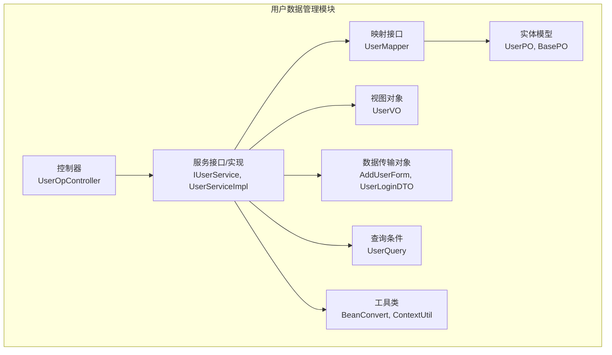
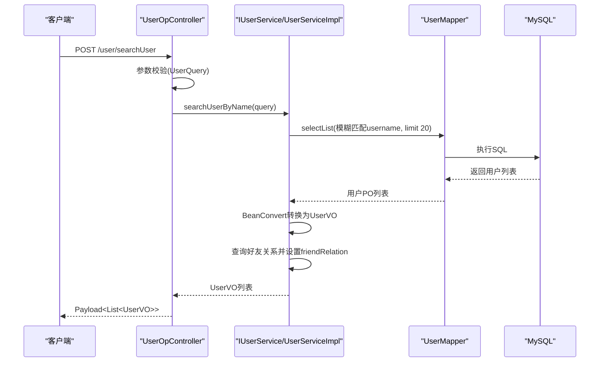
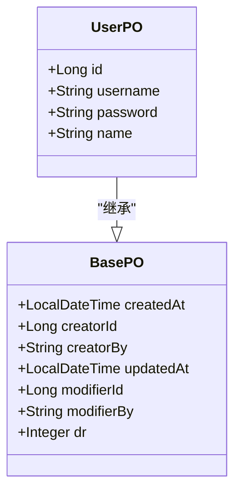
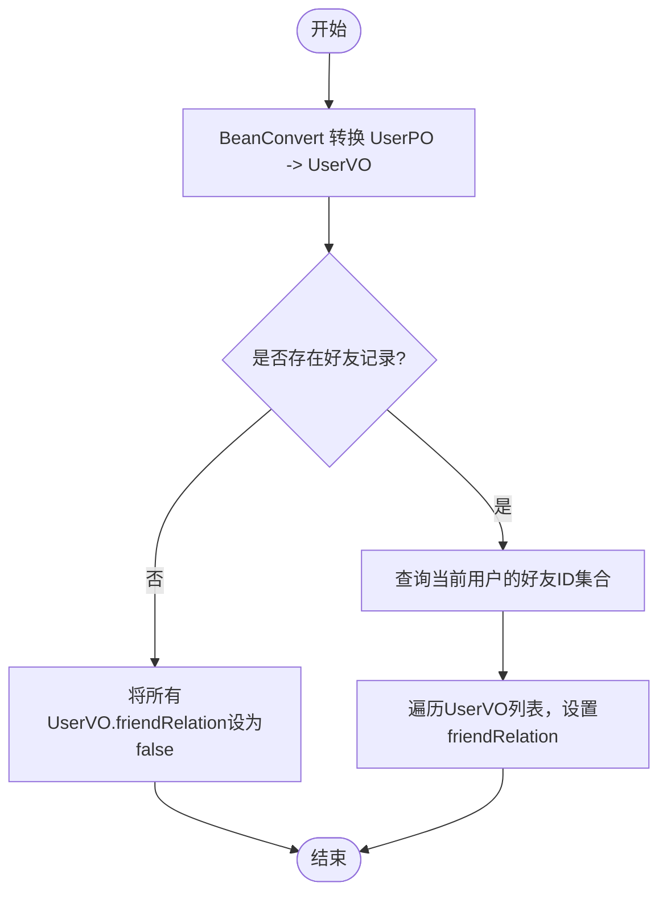
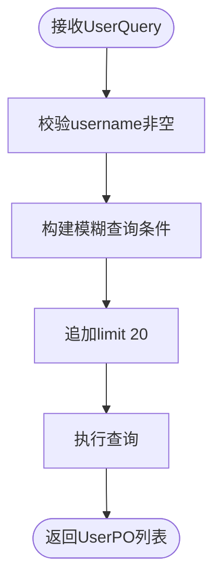
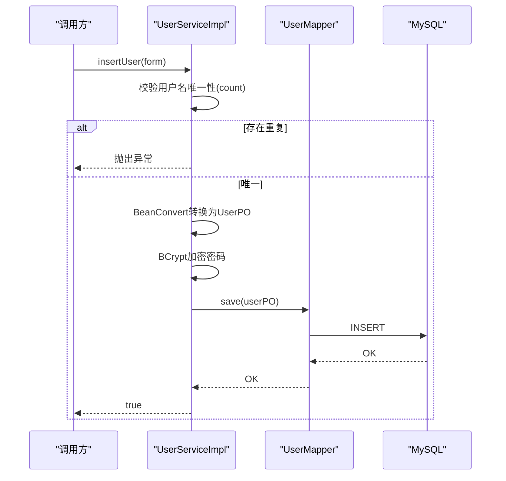
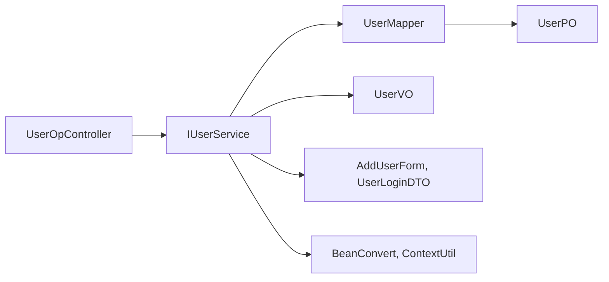

# 用户数据管理

<cite>
**本文档引用的文件**
- [UserPO.java](file://src/main/java/com/hch/chat_simple/pojo/po/UserPO.java)
- [UserVO.java](file://src/main/java/com/hch/chat_simple/pojo/vo/UserVO.java)
- [UserQuery.java](file://src/main/java/com/hch/chat_simple/pojo/query/UserQuery.java)
- [AddUserForm.java](file://src/main/java/com/hch/chat_simple/pojo/dto/AddUserForm.java)
- [UserLoginDTO.java](file://src/main/java/com/hch/chat_simple/pojo/dto/UserLoginDTO.java)
- [BasePO.java](file://src/main/java/com/hch/chat_simple/pojo/po/BasePO.java)
- [UserMapper.java](file://src/main/java/com/hch/chat_simple/mapper/UserMapper.java)
- [UserMapper.xml](file://src/main/resources/mapper/UserMapper.xml)
- [IUserService.java](file://src/main/java/com/hch/chat_simple/service/IUserService.java)
- [UserServiceImpl.java](file://src/main/java/com/hch/chat_simple/service/impl/UserServiceImpl.java)
- [UserOpController.java](file://src/main/java/com/hch/chat_simple/controller/UserOpController.java)
- [BeanConvert.java](file://src/main/java/com/hch/chat_simple/util/BeanConvert.java)
- [ContextUtil.java](file://src/main/java/com/hch/chat_simple/util/ContextUtil.java)
- [chat.sql](file://db/chat.sql)
</cite>

## 目录
1. [简介](#简介)
2. [项目结构](#项目结构)
3. [核心组件](#核心组件)
4. [架构总览](#架构总览)
5. [详细组件分析](#详细组件分析)
6. [依赖关系分析](#依赖关系分析)
7. [性能考虑](#性能考虑)
8. [故障排除指南](#故障排除指南)
9. [结论](#结论)
10. [附录](#附录)

## 简介
本文件为用户数据管理系统的综合技术文档，围绕用户信息的CRUD操作展开，涵盖实体模型设计、视图对象转换、查询条件构建、服务层业务逻辑、API接口定义以及数据一致性与并发控制策略。系统采用Spring Boot + MyBatis-Plus + MySQL架构，使用BCrypt进行密码加密，通过BeanConvert实现对象转换，结合分页与好友关系标识增强用户体验。

## 项目结构
用户数据管理模块位于以下包路径：
- 实体模型：pojo/po
- 视图对象：pojo/vo
- 查询条件：pojo/query
- 数据传输对象：pojo/dto
- 映射接口：mapper
- 服务接口与实现：service
- 控制器：controller
- 工具类：util
- 数据库脚本：db

图表来源
- [UserPO.java:1-47](file://src/main/java/com/hch/chat_simple/pojo/po/UserPO.java#L1-L47)
- [UserVO.java:1-44](file://src/main/java/com/hch/chat_simple/pojo/vo/UserVO.java#L1-L44)
- [AddUserForm.java:1-23](file://src/main/java/com/hch/chat_simple/pojo/dto/AddUserForm.java#L1-L23)
- [UserLoginDTO.java:1-22](file://src/main/java/com/hch/chat_simple/pojo/dto/UserLoginDTO.java#L1-L22)
- [UserQuery.java:1-15](file://src/main/java/com/hch/chat_simple/pojo/query/UserQuery.java#L1-L15)
- [UserMapper.java:1-22](file://src/main/java/com/hch/chat_simple/mapper/UserMapper.java#L1-L22)
- [IUserService.java:1-28](file://src/main/java/com/hch/chat_simple/service/IUserService.java#L1-L28)
- [UserServiceImpl.java:1-100](file://src/main/java/com/hch/chat_simple/service/impl/UserServiceImpl.java#L1-L100)
- [UserOpController.java:1-114](file://src/main/java/com/hch/chat_simple/controller/UserOpController.java#L1-L114)
- [BeanConvert.java:1-70](file://src/main/java/com/hch/chat_simple/util/BeanConvert.java#L1-L70)
- [ContextUtil.java:1-52](file://src/main/java/com/hch/chat_simple/util/ContextUtil.java#L1-L52)

章节来源
- [UserPO.java:1-47](file://src/main/java/com/hch/chat_simple/pojo/po/UserPO.java#L1-L47)
- [UserVO.java:1-44](file://src/main/java/com/hch/chat_simple/pojo/vo/UserVO.java#L1-L44)
- [UserMapper.java:1-22](file://src/main/java/com/hch/chat_simple/mapper/UserMapper.java#L1-L22)
- [UserServiceImpl.java:1-100](file://src/main/java/com/hch/chat_simple/service/impl/UserServiceImpl.java#L1-L100)
- [UserOpController.java:1-114](file://src/main/java/com/hch/chat_simple/controller/UserOpController.java#L1-L114)

## 核心组件
- 实体模型 UserPO：映射数据库表 user，继承基础字段 BasePO，包含自增主键 id、用户名 username、密码 password、真实姓名 name。
- 视图对象 UserVO：用于对外传输，包含 id、username、name，并扩展 friendRelation 字段用于标识当前登录用户与目标用户的“是否好友”关系。
- 查询条件 UserQuery：支持按用户名进行非空校验与模糊匹配。
- 数据传输对象 AddUserForm：新增用户时的表单校验，包含用户名、密码、真实姓名。
- 映射接口 UserMapper：基于 MyBatis-Plus 的通用 Mapper，继承 BaseMapper<UserPO>。
- 服务接口 IUserService 与实现 UserServiceImpl：提供按名查询、模糊搜索、新增用户（含密码加密）等业务逻辑。
- 控制器 UserOpController：提供登录、用户信息获取、搜索用户、新增用户等REST接口。
- 工具类 BeanConvert：提供对象与集合的转换能力，兼容分页场景。
- 上下文工具 ContextUtil：线程本地存储当前用户信息，便于服务层识别当前操作用户。

章节来源
- [UserPO.java:22-47](file://src/main/java/com/hch/chat_simple/pojo/po/UserPO.java#L22-L47)
- [UserVO.java:24-44](file://src/main/java/com/hch/chat_simple/pojo/vo/UserVO.java#L24-L44)
- [UserQuery.java:7-15](file://src/main/java/com/hch/chat_simple/pojo/query/UserQuery.java#L7-L15)
- [AddUserForm.java:7-23](file://src/main/java/com/hch/chat_simple/pojo/dto/AddUserForm.java#L7-L23)
- [UserMapper.java:18-22](file://src/main/java/com/hch/chat_simple/mapper/UserMapper.java#L18-L22)
- [IUserService.java:19-28](file://src/main/java/com/hch/chat_simple/service/IUserService.java#L19-L28)
- [UserServiceImpl.java:37-100](file://src/main/java/com/hch/chat_simple/service/impl/UserServiceImpl.java#L37-L100)
- [UserOpController.java:35-114](file://src/main/java/com/hch/chat_simple/controller/UserOpController.java#L35-L114)
- [BeanConvert.java:14-70](file://src/main/java/com/hch/chat_simple/util/BeanConvert.java#L14-L70)
- [ContextUtil.java:5-52](file://src/main/java/com/hch/chat_simple/util/ContextUtil.java#L5-L52)

## 架构总览
系统遵循经典的分层架构：控制器层负责HTTP请求处理与参数校验；服务层封装业务逻辑；数据访问层通过MyBatis-Plus与数据库交互；工具层提供对象转换与上下文管理。

图表来源
- [UserOpController.java:100-104](file://src/main/java/com/hch/chat_simple/controller/UserOpController.java#L100-L104)
- [UserServiceImpl.java:50-80](file://src/main/java/com/hch/chat_simple/service/impl/UserServiceImpl.java#L50-L80)
- [UserMapper.java:18-22](file://src/main/java/com/hch/chat_simple/mapper/UserMapper.java#L18-L22)

## 详细组件分析

### 实体模型 UserPO 设计
- 继承 BasePO，自动填充创建/修改时间与逻辑删除字段。
- 主键 id 使用自增策略，对应数据库表 user 的主键。
- 字段 username/password/name 对应数据库列，均具备注释说明。
- 采用 Lombok 注解简化 getter/setter/toString 等代码。

图表来源
- [BasePO.java:14-44](file://src/main/java/com/hch/chat_simple/pojo/po/BasePO.java#L14-L44)
- [UserPO.java:22-47](file://src/main/java/com/hch/chat_simple/pojo/po/UserPO.java#L22-L47)

章节来源
- [UserPO.java:22-47](file://src/main/java/com/hch/chat_simple/pojo/po/UserPO.java#L22-L47)
- [BasePO.java:14-44](file://src/main/java/com/hch/chat_simple/pojo/po/BasePO.java#L14-L44)
- [chat.sql:5-18](file://db/chat.sql#L5-L18)

### 视图对象 UserVO 转换机制
- 字段映射：id、username、name 与 UserPO 保持一致；新增 friendRelation 用于标识“是否好友”。
- 转换流程：服务层将 UserPO 列表通过 BeanConvert 转换为 UserVO 列表，随后根据当前用户与目标用户的 ID 关系，设置 friendRelation 标识。
- 友情关系查询：通过 FriendRelationshipMapper 查询当前用户的好友集合，再对结果集进行布尔标记。

图表来源
- [UserServiceImpl.java:60-80](file://src/main/java/com/hch/chat_simple/service/impl/UserServiceImpl.java#L60-L80)
- [BeanConvert.java:17-65](file://src/main/java/com/hch/chat_simple/util/BeanConvert.java#L17-L65)

章节来源
- [UserVO.java:24-44](file://src/main/java/com/hch/chat_simple/pojo/vo/UserVO.java#L24-L44)
- [UserServiceImpl.java:50-80](file://src/main/java/com/hch/chat_simple/service/impl/UserServiceImpl.java#L50-L80)
- [BeanConvert.java:17-65](file://src/main/java/com/hch/chat_simple/util/BeanConvert.java#L17-L65)

### 查询条件 UserQuery 设计
- 支持按用户名进行非空校验与模糊匹配。
- 限制搜索范围：服务层在查询时追加 limit 20，避免过量数据返回。
- 适用场景：用户搜索、好友查找等。

图表来源
- [UserQuery.java:7-15](file://src/main/java/com/hch/chat_simple/pojo/query/UserQuery.java#L7-L15)
- [UserServiceImpl.java:50-55](file://src/main/java/com/hch/chat_simple/service/impl/UserServiceImpl.java#L50-L55)

章节来源
- [UserQuery.java:7-15](file://src/main/java/com/hch/chat_simple/pojo/query/UserQuery.java#L7-L15)
- [UserServiceImpl.java:50-55](file://src/main/java/com/hch/chat_simple/service/impl/UserServiceImpl.java#L50-L55)

### 服务层核心方法实现
- getUserByName：按用户名精确查询单个用户。
- searchUserByName：模糊搜索用户名，限制返回数量，转换为 UserVO 并标注好友关系。
- insertUser：校验用户名唯一性，使用 BCrypt 加密密码后保存。

图表来源
- [UserServiceImpl.java:82-97](file://src/main/java/com/hch/chat_simple/service/impl/UserServiceImpl.java#L82-L97)
- [UserMapper.java:18-22](file://src/main/java/com/hch/chat_simple/mapper/UserMapper.java#L18-L22)

章节来源
- [IUserService.java:19-28](file://src/main/java/com/hch/chat_simple/service/IUserService.java#L19-L28)
- [UserServiceImpl.java:42-97](file://src/main/java/com/hch/chat_simple/service/impl/UserServiceImpl.java#L42-L97)

### API 接口文档
- 登录接口
  - 方法：POST
  - 路径：/user/login
  - 请求体：UserLoginDTO（包含用户名与密码）
  - 响应：Payload<String>（令牌）
  - 失败场景：用户不存在、密码错误
- 用户信息获取
  - 方法：POST
  - 路径：/user/userInfo
  - 请求体：无
  - 响应：Payload<UserVO>
  - 认证：需要登录态（由拦截器处理）
- 搜索用户
  - 方法：POST
  - 路径：/user/searchUser
  - 请求体：UserQuery（用户名）
  - 响应：Payload<List<UserVO>>
- 新增用户
  - 方法：POST
  - 路径：/user/insertUser
  - 请求体：AddUserForm（用户名、密码、真实姓名）
  - 响应：Payload<Boolean>

章节来源
- [UserOpController.java:44-66](file://src/main/java/com/hch/chat_simple/controller/UserOpController.java#L44-L66)
- [UserOpController.java:74-80](file://src/main/java/com/hch/chat_simple/controller/UserOpController.java#L74-L80)
- [UserOpController.java:100-104](file://src/main/java/com/hch/chat_simple/controller/UserOpController.java#L100-L104)
- [UserOpController.java:106-111](file://src/main/java/com/hch/chat_simple/controller/UserOpController.java#L106-L111)

### 数据一致性与并发控制策略
- 逻辑删除：BasePO 中 dr 字段配合 MyBatis-Plus 的逻辑删除注解，实现软删除，避免物理删除造成的数据丢失风险。
- 密码安全：新增用户时使用 BCrypt 进行密码加密，确保存储安全。
- 并发控制：当前实现未显式使用分布式锁或版本号控制，建议在高并发场景下引入 Redisson 或数据库乐观锁以保障写入一致性。
- 事务边界：服务层方法未显式声明事务注解，默认由 MyBatis-Plus 的 save/saveBatch 等方法在单次操作中保证原子性；复杂业务可考虑 @Transactional。

章节来源
- [BasePO.java:39-43](file://src/main/java/com/hch/chat_simple/pojo/po/BasePO.java#L39-L43)
- [UserServiceImpl.java:91-95](file://src/main/java/com/hch/chat_simple/service/impl/UserServiceImpl.java#L91-L95)

## 依赖关系分析
- 控制器依赖服务接口，通过构造注入方式获取实现类实例。
- 服务实现依赖 Mapper 接口与工具类，完成数据查询、转换与业务处理。
- 实体与映射接口通过 MyBatis-Plus 自动映射数据库表结构。
- 查询条件与 DTO 作为输入参数参与参数校验与业务处理。

图表来源
- [UserOpController.java:41](file://src/main/java/com/hch/chat_simple/controller/UserOpController.java#L41)
- [IUserService.java:19-28](file://src/main/java/com/hch/chat_simple/service/IUserService.java#L19-L28)
- [UserMapper.java:18-22](file://src/main/java/com/hch/chat_simple/mapper/UserMapper.java#L18-L22)
- [BeanConvert.java:14-70](file://src/main/java/com/hch/chat_simple/util/BeanConvert.java#L14-L70)
- [ContextUtil.java:5-52](file://src/main/java/com/hch/chat_simple/util/ContextUtil.java#L5-L52)

章节来源
- [UserOpController.java:35-114](file://src/main/java/com/hch/chat_simple/controller/UserOpController.java#L35-L114)
- [IUserService.java:19-28](file://src/main/java/com/hch/chat_simple/service/IUserService.java#L19-L28)
- [UserMapper.java:18-22](file://src/main/java/com/hch/chat_simple/mapper/UserMapper.java#L18-L22)
- [BeanConvert.java:14-70](file://src/main/java/com/hch/chat_simple/util/BeanConvert.java#L14-L70)
- [ContextUtil.java:5-52](file://src/main/java/com/hch/chat_simple/util/ContextUtil.java#L5-L52)

## 性能考虑
- 查询限制：服务层对模糊搜索追加 limit 20，避免大量数据传输与渲染。
- 分页兼容：BeanConvert 提供对 PageHelper 分页对象的兼容转换，便于后续扩展分页查询。
- 密码加密成本：BCrypt 加密在新增用户时执行，建议在批量导入场景下评估性能影响。
- 数据库索引：建议为 username 字段建立索引以提升模糊查询性能。

章节来源
- [UserServiceImpl.java:53-55](file://src/main/java/com/hch/chat_simple/service/impl/UserServiceImpl.java#L53-L55)
- [BeanConvert.java:38-57](file://src/main/java/com/hch/chat_simple/util/BeanConvert.java#L38-L57)

## 故障排除指南
- 用户名重复：新增用户时若用户名已存在，服务层抛出运行时异常。排查要点：确认用户名唯一性校验逻辑与数据库索引。
- 密码不匹配：登录时若密码不正确，返回密码错误状态码。排查要点：确认 BCrypt 匹配逻辑与存储密码格式。
- 好友关系标识异常：若 friendRelation 标识始终为 false，检查当前用户上下文是否正确设置，以及好友关系表数据是否完整。
- 查询无结果：若搜索无结果，确认 UserQuery 的 username 是否为空，以及数据库中是否存在匹配数据。

章节来源
- [UserServiceImpl.java:87-90](file://src/main/java/com/hch/chat_simple/service/impl/UserServiceImpl.java#L87-L90)
- [UserOpController.java:51-55](file://src/main/java/com/hch/chat_simple/controller/UserOpController.java#L51-L55)
- [ContextUtil.java:12-18](file://src/main/java/com/hch/chat_simple/util/ContextUtil.java#L12-L18)

## 结论
该用户数据管理模块以清晰的分层架构实现了完整的CRUD功能，通过实体-视图转换与查询条件限制提升了用户体验与系统性能。建议在后续迭代中引入更完善的并发控制与分页查询能力，并持续优化数据库索引与缓存策略以满足更高并发场景的需求。

## 附录
- 数据库表结构参考：用户表 user 包含 id、username、password、name、基础审计字段与逻辑删除字段。
- 常用工具类：BeanConvert 提供对象转换能力；ContextUtil 提供线程本地用户上下文。

章节来源
- [chat.sql:5-18](file://db/chat.sql#L5-L18)
- [BeanConvert.java:14-70](file://src/main/java/com/hch/chat_simple/util/BeanConvert.java#L14-L70)
- [ContextUtil.java:5-52](file://src/main/java/com/hch/chat_simple/util/ContextUtil.java#L5-L52)