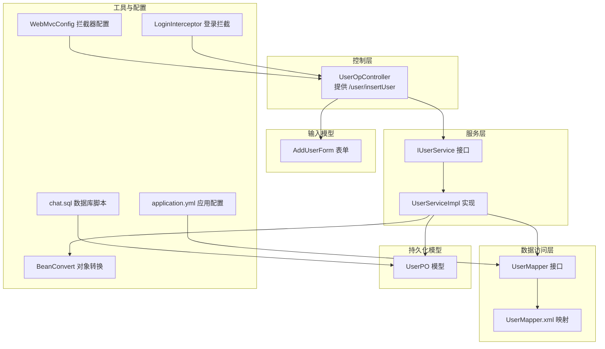
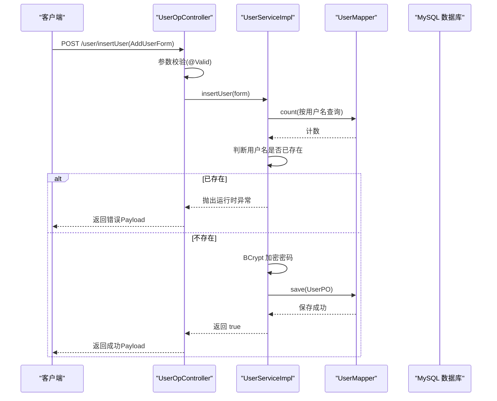
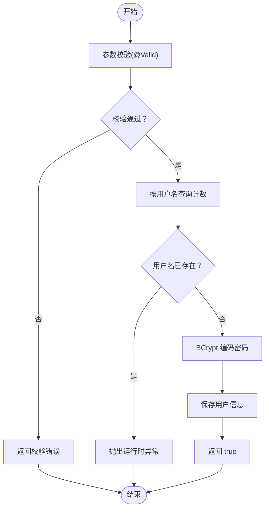
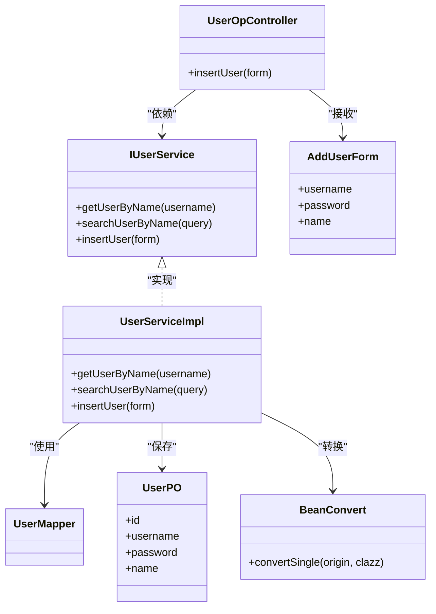

# 用户注册流程

<cite>
**本文引用的文件**
- [AddUserForm.java](file://src/main/java/com/hch/chat_simple/pojo/dto/AddUserForm.java)
- [UserOpController.java](file://src/main/java/com/hch/chat_simple/controller/UserOpController.java)
- [IUserService.java](file://src/main/java/com/hch/chat_simple/service/IUserService.java)
- [UserServiceImpl.java](file://src/main/java/com/hch/chat_simple/service/impl/UserServiceImpl.java)
- [UserMapper.java](file://src/main/java/com/hch/chat_simple/mapper/UserMapper.java)
- [UserMapper.xml](file://src/main/resources/mapper/UserMapper.xml)
- [UserPO.java](file://src/main/java/com/hch/chat_simple/pojo/po/UserPO.java)
- [UserQuery.java](file://src/main/java/com/hch/chat_simple/pojo/query/UserQuery.java)
- [BeanConvert.java](file://src/main/java/com/hch/chat_simple/util/BeanConvert.java)
- [StatusCodeEnum.java](file://src/main/java/com/hch/chat_simple/util/StatusCodeEnum.java)
- [WebMvcConfig.java](file://src/main/java/com/hch/chat_simple/config/WebMvcConfig.java)
- [LoginInterceptor.java](file://src/main/java/com/hch/chat_simple/config/LoginInterceptor.java)
- [application.yml](file://src/main/resources/application.yml)
- [chat.sql](file://db/chat.sql)
</cite>

## 目录
1. [简介](#简介)
2. [项目结构](#项目结构)
3. [核心组件](#核心组件)
4. [架构总览](#架构总览)
5. [详细组件分析](#详细组件分析)
6. [依赖分析](#依赖分析)
7. [性能考虑](#性能考虑)
8. [故障排查指南](#故障排查指南)
9. [结论](#结论)
10. [附录](#附录)

## 简介
本文件面向“用户注册流程”的技术实现，系统性梳理从表单提交到数据库落库的完整链路，重点覆盖以下方面：
- AddUserForm 表单的输入校验规则与约束
- 注册接口的业务逻辑与控制流
- 密码加密存储机制（BCrypt）
- 注册成功后的默认行为与扩展点
- 注册接口的 API 文档与错误码说明
- 异常处理与用户体验优化策略

## 项目结构
围绕用户注册的关键模块与文件如下：
- 控制层：UserOpController 提供 /user/insertUser 注册接口
- 服务层：IUserService 及其实现 UserServiceImpl 执行业务逻辑
- 数据访问层：UserMapper 及 MyBatis XML 映射
- 持久化模型：UserPO 对应数据库 user 表
- 输入模型：AddUserForm 定义注册表单字段与校验
- 工具与配置：BeanConvert 负责对象转换；WebMvcConfig/ LoginInterceptor 负责拦截与鉴权；application.yml 提供数据源与 MyBatis Plus 配置；chat.sql 定义数据库结构

图表来源
- [UserOpController.java:35-114](file://src/main/java/com/hch/chat_simple/controller/UserOpController.java#L35-L114)
- [IUserService.java:19-27](file://src/main/java/com/hch/chat_simple/service/IUserService.java#L19-L27)
- [UserServiceImpl.java:38-99](file://src/main/java/com/hch/chat_simple/service/impl/UserServiceImpl.java#L38-L99)
- [UserMapper.java:18-21](file://src/main/java/com/hch/chat_simple/mapper/UserMapper.java#L18-L21)
- [UserMapper.xml:1-6](file://src/main/resources/mapper/UserMapper.xml#L1-L6)
- [UserPO.java:22-46](file://src/main/java/com/hch/chat_simple/pojo/po/UserPO.java#L22-L46)
- [AddUserForm.java:1-23](file://src/main/java/com/hch/chat_simple/pojo/dto/AddUserForm.java#L1-L23)
- [BeanConvert.java:14-70](file://src/main/java/com/hch/chat_simple/util/BeanConvert.java#L14-L70)
- [WebMvcConfig.java:8-27](file://src/main/java/com/hch/chat_simple/config/WebMvcConfig.java#L8-L27)
- [LoginInterceptor.java:28-109](file://src/main/java/com/hch/chat_simple/config/LoginInterceptor.java#L28-L109)
- [application.yml:16-33](file://src/main/resources/application.yml#L16-L33)
- [chat.sql:5-18](file://db/chat.sql#L5-L18)

章节来源
- [UserOpController.java:35-114](file://src/main/java/com/hch/chat_simple/controller/UserOpController.java#L35-L114)
- [UserServiceImpl.java:38-99](file://src/main/java/com/hch/chat_simple/service/impl/UserServiceImpl.java#L38-L99)
- [UserMapper.java:18-21](file://src/main/java/com/hch/chat_simple/mapper/UserMapper.java#L18-L21)
- [UserMapper.xml:1-6](file://src/main/resources/mapper/UserMapper.xml#L1-L6)
- [UserPO.java:22-46](file://src/main/java/com/hch/chat_simple/pojo/po/UserPO.java#L22-L46)
- [AddUserForm.java:1-23](file://src/main/java/com/hch/chat_simple/pojo/dto/AddUserForm.java#L1-L23)
- [BeanConvert.java:14-70](file://src/main/java/com/hch/chat_simple/util/BeanConvert.java#L14-L70)
- [WebMvcConfig.java:8-27](file://src/main/java/com/hch/chat_simple/config/WebMvcConfig.java#L8-L27)
- [LoginInterceptor.java:28-109](file://src/main/java/com/hch/chat_simple/config/LoginInterceptor.java#L28-L109)
- [application.yml:16-33](file://src/main/resources/application.yml#L16-L33)
- [chat.sql:5-18](file://db/chat.sql#L5-L18)

## 核心组件
- 控制器：UserOpController 暴露 /user/insertUser 接口，使用 @NoAuth 注解允许未登录访问，接收 AddUserForm 并调用 IUserService.insertUser 执行注册。
- 服务实现：UserServiceImpl.insertUser 执行用户名唯一性检查、密码 BCrypt 加密、保存用户信息。
- 数据访问：UserMapper 继承 MyBatis-Plus 基类，结合 UserMapper.xml 使用默认 CRUD 能力。
- 持久化模型：UserPO 映射 user 表，包含 id、username、password、name 等字段。
- 输入模型：AddUserForm 定义 username、password、name 字段并标注非空校验。
- 工具与配置：BeanConvert 负责 DTO/PO 转换；WebMvcConfig/ LoginInterceptor 提供跨域与登录拦截；application.yml 提供数据源与 MyBatis Plus 配置；chat.sql 定义数据库结构。

章节来源
- [UserOpController.java:106-111](file://src/main/java/com/hch/chat_simple/controller/UserOpController.java#L106-L111)
- [UserServiceImpl.java:82-97](file://src/main/java/com/hch/chat_simple/service/impl/UserServiceImpl.java#L82-L97)
- [UserMapper.java:18-21](file://src/main/java/com/hch/chat_simple/mapper/UserMapper.java#L18-L21)
- [UserPO.java:22-46](file://src/main/java/com/hch/chat_simple/pojo/po/UserPO.java#L22-L46)
- [AddUserForm.java:11-21](file://src/main/java/com/hch/chat_simple/pojo/dto/AddUserForm.java#L11-L21)
- [BeanConvert.java:63-65](file://src/main/java/com/hch/chat_simple/util/BeanConvert.java#L63-L65)
- [WebMvcConfig.java:12-16](file://src/main/java/com/hch/chat_simple/config/WebMvcConfig.java#L12-L16)
- [LoginInterceptor.java:39-83](file://src/main/java/com/hch/chat_simple/config/LoginInterceptor.java#L39-L83)
- [application.yml:16-33](file://src/main/resources/application.yml#L16-L33)
- [chat.sql:5-18](file://db/chat.sql#L5-L18)

## 架构总览
用户注册的整体调用链如下：

图表来源
- [UserOpController.java:106-111](file://src/main/java/com/hch/chat_simple/controller/UserOpController.java#L106-L111)
- [UserServiceImpl.java:82-97](file://src/main/java/com/hch/chat_simple/service/impl/UserServiceImpl.java#L82-L97)
- [UserMapper.java:18-21](file://src/main/java/com/hch/chat_simple/mapper/UserMapper.java#L18-L21)
- [chat.sql:5-18](file://db/chat.sql#L5-L18)

## 详细组件分析

### AddUserForm 表单与校验规则
- 字段定义与约束
  - username：非空校验，用于登录与唯一性判断
  - password：非空校验，后续通过 BCrypt 编码存储
  - name：非空校验，真实姓名
- 校验触发位置
  - 控制器方法参数上使用 @Valid，Spring 在进入业务逻辑前执行 JSR-303 校验
- 未覆盖的校验
  - 当前未包含邮箱格式校验、密码强度规则、用户名长度限制等

章节来源
- [AddUserForm.java:11-21](file://src/main/java/com/hch/chat_simple/pojo/dto/AddUserForm.java#L11-L21)
- [UserOpController.java:109](file://src/main/java/com/hch/chat_simple/controller/UserOpController.java#L109)

### 注册接口业务逻辑
- 接口定义
  - 路径：/user/insertUser
  - 方法：POST
  - 访问控制：@NoAuth，无需登录即可调用
  - 请求体：AddUserForm
  - 返回体：Payload<Boolean>
- 业务流程
  1) 参数校验：由 @Valid 触发 JSR-303 校验
  2) 唯一性检查：按 username 查询计数，若大于 0 则抛出运行时异常
  3) 密码加密：使用 BCryptPasswordEncoder 对 password 进行编码
  4) 保存用户：将转换后的 UserPO 写入数据库
  5) 返回结果：返回 true 表示成功
- 默认值与初始状态
  - 当前实现未设置额外默认值或初始状态；如需扩展可在保存前填充 created_at、creator_id 等字段

图表来源
- [UserOpController.java:106-111](file://src/main/java/com/hch/chat_simple/controller/UserOpController.java#L106-L111)
- [UserServiceImpl.java:82-97](file://src/main/java/com/hch/chat_simple/service/impl/UserServiceImpl.java#L82-L97)

章节来源
- [UserOpController.java:106-111](file://src/main/java/com/hch/chat_simple/controller/UserOpController.java#L106-L111)
- [UserServiceImpl.java:82-97](file://src/main/java/com/hch/chat_simple/service/impl/UserServiceImpl.java#L82-L97)

### 密码加密存储实现
- 编码方式：BCryptPasswordEncoder
- 执行时机：在 insertUser 中对原始密码进行编码后写入数据库
- 安全性保障：
  - 自动盐值生成与哈希计算
  - 不可逆加密，抵御彩虹表攻击
  - 与登录匹配使用 matches 进行验证

章节来源
- [UserServiceImpl.java:92-94](file://src/main/java/com/hch/chat_simple/service/impl/UserServiceImpl.java#L92-L94)
- [UserOpController.java:50-55](file://src/main/java/com/hch/chat_simple/controller/UserOpController.java#L50-L55)

### 注册成功后的处理与扩展
- 当前行为
  - 仅完成用户名唯一性检查、密码加密与入库
  - 未设置默认权限、初始化数据（如默认好友、群组等）
- 建议扩展点
  - 在保存前填充基础字段（如 created_at、creator_id、modifier_id 等）
  - 新增默认权限与初始化数据（如默认好友、默认群组、系统通知等）
  - 发送欢迎消息或触发异步任务

章节来源
- [UserServiceImpl.java:91-96](file://src/main/java/com/hch/chat_simple/service/impl/UserServiceImpl.java#L91-L96)
- [UserPO.java:22-46](file://src/main/java/com/hch/chat_simple/pojo/po/UserPO.java#L22-L46)

### API 文档：注册接口
- 地址
  - POST /user/insertUser
- 请求头
  - Content-Type: application/json
  - 无需 token（@NoAuth）
- 请求体
  - AddUserForm
    - username: string，必填
    - password: string，必填
    - name: string，必填
- 响应体
  - Payload<Boolean>
    - code: number，成功时为 202
    - desc: string，成功时为“成功”
    - data: boolean，true 表示注册成功
- 错误码
  - 202：成功
  - 508：用户不存在（登录接口使用）
  - 509：密码错误（登录接口使用）
  - 510：文件上传失败（通用）
  - 其他：参数校验失败或运行时异常时，返回相应错误信息
- 示例
  - 请求示例：见“附录-请求示例”
  - 成功响应示例：见“附录-成功响应示例”

章节来源
- [UserOpController.java:106-111](file://src/main/java/com/hch/chat_simple/controller/UserOpController.java#L106-L111)
- [AddUserForm.java:11-21](file://src/main/java/com/hch/chat_simple/pojo/dto/AddUserForm.java#L11-L21)
- [StatusCodeEnum.java:6-21](file://src/main/java/com/hch/chat_simple/util/StatusCodeEnum.java#L6-L21)

### 异常处理与用户体验优化
- 参数校验异常
  - 由 @Valid 触发，Spring 将自动封装为参数错误并返回
- 业务异常
  - 用户名已存在：抛出运行时异常，控制器捕获后返回错误
- 登录拦截
  - 未登录访问受 LoginInterceptor 控制，但注册接口标注 @NoAuth 放行
- 用户体验建议
  - 前端在提交前进行弱校验（如长度、格式提示）
  - 后端统一错误码与文案，便于前端一致化提示
  - 对重复用户名场景提供更明确的提示语

章节来源
- [UserServiceImpl.java:88-90](file://src/main/java/com/hch/chat_simple/service/impl/UserServiceImpl.java#L88-L90)
- [LoginInterceptor.java:39-83](file://src/main/java/com/hch/chat_simple/config/LoginInterceptor.java#L39-L83)
- [WebMvcConfig.java:12-16](file://src/main/java/com/hch/chat_simple/config/WebMvcConfig.java#L12-L16)

## 依赖分析
- 控制器依赖服务接口 IUserService
- 服务实现依赖 UserMapper 与 BeanConvert
- 数据访问层依赖 MyBatis-Plus 与 application.yml 的数据源配置
- 模型层 UserPO 与数据库 user 表结构对应

图表来源
- [UserOpController.java:41](file://src/main/java/com/hch/chat_simple/controller/UserOpController.java#L41)
- [IUserService.java:19-27](file://src/main/java/com/hch/chat_simple/service/IUserService.java#L19-L27)
- [UserServiceImpl.java:38-99](file://src/main/java/com/hch/chat_simple/service/impl/UserServiceImpl.java#L38-L99)
- [UserMapper.java:18-21](file://src/main/java/com/hch/chat_simple/mapper/UserMapper.java#L18-L21)
- [UserPO.java:22-46](file://src/main/java/com/hch/chat_simple/pojo/po/UserPO.java#L22-L46)
- [AddUserForm.java:1-23](file://src/main/java/com/hch/chat_simple/pojo/dto/AddUserForm.java#L1-L23)
- [BeanConvert.java:63-65](file://src/main/java/com/hch/chat_simple/util/BeanConvert.java#L63-L65)

章节来源
- [UserOpController.java:41](file://src/main/java/com/hch/chat_simple/controller/UserOpController.java#L41)
- [IUserService.java:19-27](file://src/main/java/com/hch/chat_simple/service/IUserService.java#L19-L27)
- [UserServiceImpl.java:38-99](file://src/main/java/com/hch/chat_simple/service/impl/UserServiceImpl.java#L38-L99)
- [UserMapper.java:18-21](file://src/main/java/com/hch/chat_simple/mapper/UserMapper.java#L18-L21)
- [UserPO.java:22-46](file://src/main/java/com/hch/chat_simple/pojo/po/UserPO.java#L22-L46)
- [AddUserForm.java:1-23](file://src/main/java/com/hch/chat_simple/pojo/dto/AddUserForm.java#L1-L23)
- [BeanConvert.java:63-65](file://src/main/java/com/hch/chat_simple/util/BeanConvert.java#L63-L65)

## 性能考虑
- 唯一性检查：按 username 查询计数，建议在 username 字段建立唯一索引以提升查询效率与约束一致性
- 密码编码：BCrypt 开销较高，建议在高并发场景下关注线程池与连接池配置
- ORM 层：MyBatis-Plus 默认 CRUD 性能良好，注意避免 N+1 查询与不必要的字段加载

[本节为通用指导，不直接分析具体文件]

## 故障排查指南
- 常见问题
  - 用户名重复：insertUser 中会抛出运行时异常，确认数据库唯一约束与代码分支
  - 参数校验失败：检查 AddUserForm 的 @NotBlank 是否满足
  - 登录拦截导致无法访问：注册接口标注 @NoAuth，确认拦截器配置未误拦截
- 关键定位路径
  - 注册入口：UserOpController.insertUser
  - 业务逻辑：UserServiceImpl.insertUser
  - 数据访问：UserMapper（基于 MyBatis-Plus）
  - 数据库：chat.sql 中 user 表结构

章节来源
- [UserServiceImpl.java:88-90](file://src/main/java/com/hch/chat_simple/service/impl/UserServiceImpl.java#L88-L90)
- [UserOpController.java:106-111](file://src/main/java/com/hch/chat_simple/controller/UserOpController.java#L106-L111)
- [UserMapper.java:18-21](file://src/main/java/com/hch/chat_simple/mapper/UserMapper.java#L18-L21)
- [chat.sql:5-18](file://db/chat.sql#L5-L18)

## 结论
本注册流程以简洁清晰为核心目标：通过 AddUserForm 的基础校验、服务层的唯一性检查与 BCrypt 加密、以及 MyBatis-Plus 的标准持久化，完成了从表单到数据库的闭环。当前实现未包含邮箱格式校验、密码强度规则、默认权限与初始化数据等高级能力，建议在后续版本中逐步增强，以提升安全性与用户体验。

[本节为总结性内容，不直接分析具体文件]

## 附录
- 请求示例
  - POST /user/insertUser
  - Content-Type: application/json
  - 请求体：
    {
      "username": "example",
      "password": "ExamplePass123!",
      "name": "张三"
    }
- 成功响应示例
  - {
      "code": 202,
      "desc": "成功",
      "data": true
    }
- 数据库表结构参考
  - user 表包含 id、username、password、name、created_at、creator_id、updated_at、modifier_id、dr 等字段

章节来源
- [AddUserForm.java:11-21](file://src/main/java/com/hch/chat_simple/pojo/dto/AddUserForm.java#L11-L21)
- [UserOpController.java:106-111](file://src/main/java/com/hch/chat_simple/controller/UserOpController.java#L106-L111)
- [chat.sql:5-18](file://db/chat.sql#L5-L18)