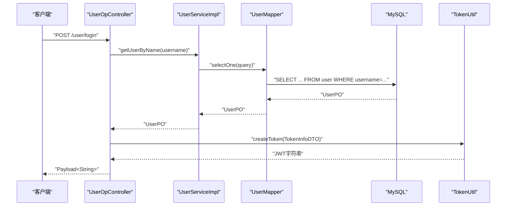
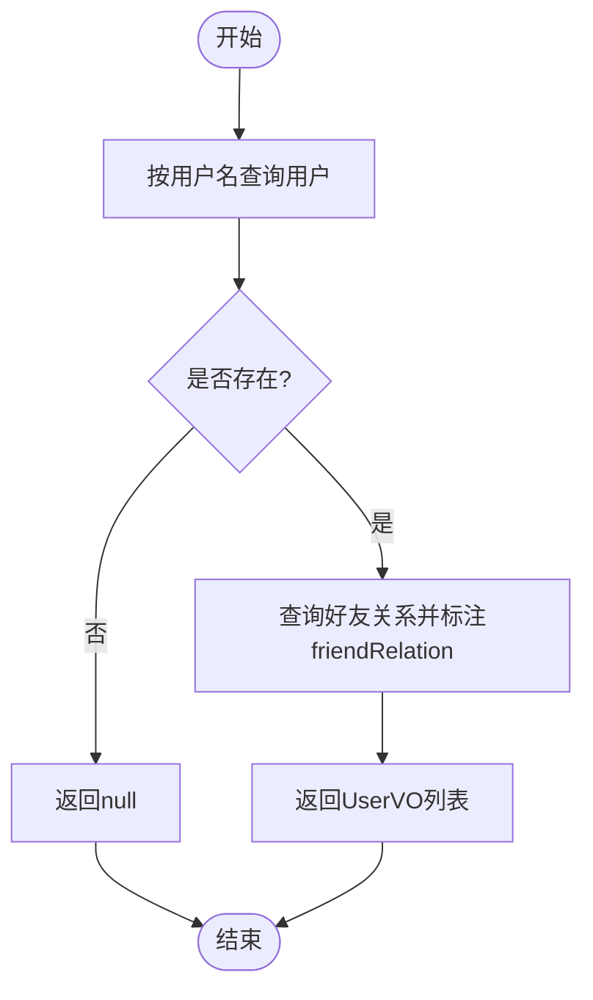
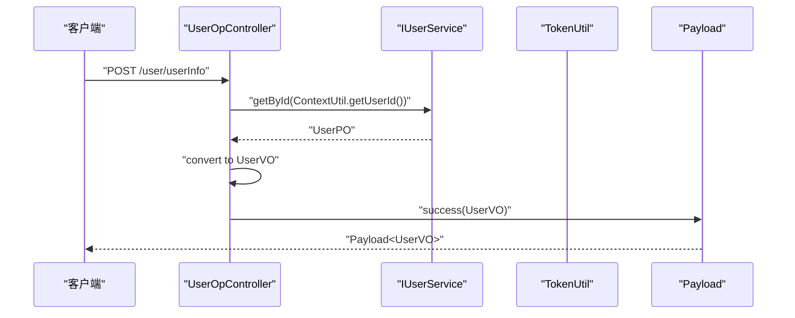
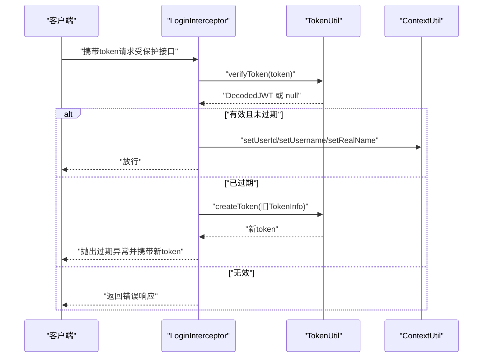
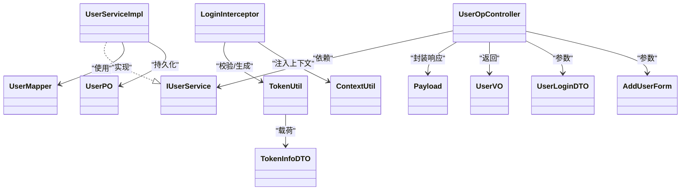

# 用户管理系统

<cite>
**本文引用的文件**
- [UserPO.java](file://src/main/java/com/hch/chat_simple/pojo/po/UserPO.java)
- [IUserService.java](file://src/main/java/com/hch/chat_simple/service/IUserService.java)
- [UserServiceImpl.java](file://src/main/java/com/hch/chat_simple/service/impl/UserServiceImpl.java)
- [UserOpController.java](file://src/main/java/com/hch/chat_simple/controller/UserOpController.java)
- [TokenUtil.java](file://src/main/java/com/hch/chat_simple/util/TokenUtil.java)
- [LoginInterceptor.java](file://src/main/java/com/hch/chat_simple/config/LoginInterceptor.java)
- [ContextUtil.java](file://src/main/java/com/hch/chat_simple/util/ContextUtil.java)
- [Payload.java](file://src/main/java/com/hch/chat_simple/util/Payload.java)
- [TokenInfoDTO.java](file://src/main/java/com/hch/chat_simple/pojo/dto/TokenInfoDTO.java)
- [UserMapper.java](file://src/main/java/com/hch/chat_simple/mapper/UserMapper.java)
- [AddUserForm.java](file://src/main/java/com/hch/chat_simple/pojo/dto/AddUserForm.java)
- [UserLoginDTO.java](file://src/main/java/com/hch/chat_simple/pojo/dto/UserLoginDTO.java)
- [UserVO.java](file://src/main/java/com/hch/chat_simple/pojo/vo/UserVO.java)
- [application.yml](file://src/main/resources/application.yml)
- [chat.sql](file://db/chat.sql)
</cite>

## 目录
1. [简介](#简介)
2. [项目结构](#项目结构)
3. [核心组件](#核心组件)
4. [架构总览](#架构总览)
5. [详细组件分析](#详细组件分析)
6. [依赖分析](#依赖分析)
7. [性能考虑](#性能考虑)
8. [故障排查指南](#故障排查指南)
9. [结论](#结论)
10. [附录](#附录)

## 简介
本文件面向用户管理系统，围绕用户注册、登录、信息查询与管理等核心功能，系统性梳理实体模型、服务层实现、控制器API设计、JWT令牌机制、权限控制与安全实践。文档以代码为依据，辅以图示帮助读者快速理解系统设计与实现要点。

## 项目结构
系统采用分层架构：控制器层负责对外API；服务层封装业务逻辑；持久层基于MyBatis-Plus访问数据库；工具层提供通用能力（如Token、上下文、响应封装）；配置层提供拦截器与跨域等横切关注点。

```mermaid
graph TB
subgraph "控制器层"
C1["UserOpController"]
end
subgraph "服务层"
S1["IUserService"]
S2["UserServiceImpl"]
end
subgraph "持久层"
M1["UserMapper"]
end
subgraph "工具与配置"
U1["TokenUtil"]
U2["LoginInterceptor"]
U3["ContextUtil"]
U4["Payload"]
end
subgraph "领域模型"
D1["UserPO"]
D2["UserVO"]
D3["UserLoginDTO"]
D4["AddUserForm"]
D5["TokenInfoDTO"]
end
C1 --> S1
S1 < --> S2
S2 --> M1
C1 --> U1
U2 --> U1
U2 --> U3
C1 --> U4
S2 --> D1
C1 --> D2
C1 --> D3
C1 --> D4
U1 --> D5
```

图表来源
- [UserOpController.java:35-114](file://src/main/java/com/hch/chat_simple/controller/UserOpController.java#L35-L114)
- [IUserService.java:19-27](file://src/main/java/com/hch/chat_simple/service/IUserService.java#L19-L27)
- [UserServiceImpl.java:37-99](file://src/main/java/com/hch/chat_simple/service/impl/UserServiceImpl.java#L37-L99)
- [UserMapper.java:18-21](file://src/main/java/com/hch/chat_simple/mapper/UserMapper.java#L18-L21)
- [TokenUtil.java:18-70](file://src/main/java/com/hch/chat_simple/util/TokenUtil.java#L18-L70)
- [LoginInterceptor.java:28-108](file://src/main/java/com/hch/chat_simple/config/LoginInterceptor.java#L28-L108)
- [ContextUtil.java:5-51](file://src/main/java/com/hch/chat_simple/util/ContextUtil.java#L5-L51)
- [Payload.java:5-29](file://src/main/java/com/hch/chat_simple/util/Payload.java#L5-L29)
- [UserPO.java:22-46](file://src/main/java/com/hch/chat_simple/pojo/po/UserPO.java#L22-L46)
- [UserVO.java:24-43](file://src/main/java/com/hch/chat_simple/pojo/vo/UserVO.java#L24-L43)
- [UserLoginDTO.java:9-21](file://src/main/java/com/hch/chat_simple/pojo/dto/UserLoginDTO.java#L9-L21)
- [AddUserForm.java:7-22](file://src/main/java/com/hch/chat_simple/pojo/dto/AddUserForm.java#L7-L22)
- [TokenInfoDTO.java:9-19](file://src/main/java/com/hch/chat_simple/pojo/dto/TokenInfoDTO.java#L9-L19)

章节来源
- [UserOpController.java:35-114](file://src/main/java/com/hch/chat_simple/controller/UserOpController.java#L35-L114)
- [application.yml:1-89](file://src/main/resources/application.yml#L1-L89)

## 核心组件
- 用户实体模型：UserPO承载用户基本信息，继承基础审计字段，映射数据库表结构。
- 用户服务接口与实现：IUserService定义查询、搜索、新增等契约；UserServiceImpl实现业务逻辑，含密码加密、重复校验、好友关系标注等。
- 控制器API：UserOpController提供登录、用户信息查询、用户搜索、新增用户等接口，统一使用Payload封装响应。
- JWT与拦截器：TokenUtil负责签发与校验；LoginInterceptor在请求前校验令牌并注入上下文；ContextUtil在线程内传递用户上下文。
- 数据模型与表结构：UserPO、UserVO、UserLoginDTO、AddUserForm、TokenInfoDTO构成前后端交互与内部处理的数据载体；chat.sql定义用户表及字段。

章节来源
- [UserPO.java:22-46](file://src/main/java/com/hch/chat_simple/pojo/po/UserPO.java#L22-L46)
- [IUserService.java:19-27](file://src/main/java/com/hch/chat_simple/service/IUserService.java#L19-L27)
- [UserServiceImpl.java:37-99](file://src/main/java/com/hch/chat_simple/service/impl/UserServiceImpl.java#L37-L99)
- [UserOpController.java:35-114](file://src/main/java/com/hch/chat_simple/controller/UserOpController.java#L35-L114)
- [TokenUtil.java:18-70](file://src/main/java/com/hch/chat_simple/util/TokenUtil.java#L18-L70)
- [LoginInterceptor.java:28-108](file://src/main/java/com/hch/chat_simple/config/LoginInterceptor.java#L28-L108)
- [ContextUtil.java:5-51](file://src/main/java/com/hch/chat_simple/util/ContextUtil.java#L5-L51)
- [Payload.java:5-29](file://src/main/java/com/hch/chat_simple/util/Payload.java#L5-L29)
- [TokenInfoDTO.java:9-19](file://src/main/java/com/hch/chat_simple/pojo/dto/TokenInfoDTO.java#L9-L19)
- [UserMapper.java:18-21](file://src/main/java/com/hch/chat_simple/mapper/UserMapper.java#L18-L21)
- [AddUserForm.java:7-22](file://src/main/java/com/hch/chat_simple/pojo/dto/AddUserForm.java#L7-L22)
- [UserLoginDTO.java:9-21](file://src/main/java/com/hch/chat_simple/pojo/dto/UserLoginDTO.java#L9-L21)
- [UserVO.java:24-43](file://src/main/java/com/hch/chat_simple/pojo/vo/UserVO.java#L24-L43)
- [chat.sql:5-18](file://db/chat.sql#L5-L18)

## 架构总览
系统遵循“控制器-服务-持久层”分层，配合拦截器完成鉴权与上下文注入，工具层提供统一响应格式与令牌处理。



图表来源
- [UserOpController.java:44-66](file://src/main/java/com/hch/chat_simple/controller/UserOpController.java#L44-L66)
- [UserServiceImpl.java:42-48](file://src/main/java/com/hch/chat_simple/service/impl/UserServiceImpl.java#L42-L48)
- [UserMapper.java:18-21](file://src/main/java/com/hch/chat_simple/mapper/UserMapper.java#L18-L21)
- [TokenUtil.java:23-30](file://src/main/java/com/hch/chat_simple/util/TokenUtil.java#L23-L30)

## 详细组件分析

### 用户实体模型（UserPO）
- 字段定义
  - id：主键自增
  - username：登录名
  - password：密码（加密存储）
  - name：真实姓名
  - 审计字段：创建/更新时间、创建者/修改者、逻辑删除标记
- 设计要点
  - 继承BasePO，复用通用审计字段
  - 使用MyBatis-Plus注解映射表与字段
  - 与数据库表user保持一致

章节来源
- [UserPO.java:22-46](file://src/main/java/com/hch/chat_simple/pojo/po/UserPO.java#L22-L46)
- [chat.sql:5-18](file://db/chat.sql#L5-L18)

### 用户服务层（IUserService 与 UserServiceImpl）
- 接口职责
  - getUserByName：按用户名查询用户
  - searchUserByName：按用户名模糊搜索并标注是否为当前用户的好友
  - insertUser：新增用户，校验用户名唯一性并加密密码
- 实现细节
  - 密码加密：使用BCryptPasswordEncoder对明文密码进行编码后入库
  - 好友关系标注：查询当前用户的好友列表，为结果集附加friendRelation标识
  - 用户名唯一性：查询重复后抛出运行时异常



图表来源
- [UserServiceImpl.java:50-80](file://src/main/java/com/hch/chat_simple/service/impl/UserServiceImpl.java#L50-L80)

章节来源
- [IUserService.java:19-27](file://src/main/java/com/hch/chat_simple/service/IUserService.java#L19-L27)
- [UserServiceImpl.java:37-99](file://src/main/java/com/hch/chat_simple/service/impl/UserServiceImpl.java#L37-L99)

### 用户控制器（UserOpController）
- 登录接口
  - 路径：POST /user/login
  - 参数：UserLoginDTO（用户名、密码）
  - 流程：查询用户、比对密码、构造TokenInfoDTO、签发JWT、封装响应
- 用户信息接口
  - 路径：POST /user/userInfo
  - 流程：根据上下文用户ID查询用户并转换为UserVO
- 用户搜索接口
  - 路径：POST /user/searchUser
  - 参数：UserQuery（用户名关键字）
  - 流程：调用服务层搜索并返回列表
- 新增用户接口
  - 路径：POST /user/insertUser
  - 参数：AddUserForm（用户名、密码、真实姓名）
  - 流程：校验唯一性、加密密码、保存用户



图表来源
- [UserOpController.java:74-80](file://src/main/java/com/hch/chat_simple/controller/UserOpController.java#L74-L80)
- [UserServiceImpl.java:76-79](file://src/main/java/com/hch/chat_simple/service/impl/UserServiceImpl.java#L76-L79)
- [Payload.java:22-28](file://src/main/java/com/hch/chat_simple/util/Payload.java#L22-L28)

章节来源
- [UserOpController.java:35-114](file://src/main/java/com/hch/chat_simple/controller/UserOpController.java#L35-L114)
- [UserLoginDTO.java:9-21](file://src/main/java/com/hch/chat_simple/pojo/dto/UserLoginDTO.java#L9-L21)
- [AddUserForm.java:7-22](file://src/main/java/com/hch/chat_simple/pojo/dto/AddUserForm.java#L7-L22)
- [UserVO.java:24-43](file://src/main/java/com/hch/chat_simple/pojo/vo/UserVO.java#L24-L43)

### JWT令牌生成与验证（TokenUtil、LoginInterceptor、ContextUtil）
- 令牌生成
  - 签名算法：HMAC-SHA256
  - 过期时间：默认30分钟
  - 发行人：chat_admin
  - 载荷：TokenInfoDTO序列化后的字符串作为subject
- 令牌验证
  - 校验签名与issuer
  - 放宽过期容忍窗口（用于续期场景）
  - 解析subject得到TokenInfoDTO
- 请求拦截与上下文注入
  - 拦截器读取请求头token
  - 校验通过后将用户信息写入ContextUtil
  - 过期时生成新token并通过异常机制返回提示



图表来源
- [LoginInterceptor.java:30-90](file://src/main/java/com/hch/chat_simple/config/LoginInterceptor.java#L30-L90)
- [TokenUtil.java:48-69](file://src/main/java/com/hch/chat_simple/util/TokenUtil.java#L48-L69)
- [ContextUtil.java:12-49](file://src/main/java/com/hch/chat_simple/util/ContextUtil.java#L12-L49)

章节来源
- [TokenUtil.java:18-70](file://src/main/java/com/hch/chat_simple/util/TokenUtil.java#L18-L70)
- [LoginInterceptor.java:28-108](file://src/main/java/com/hch/chat_simple/config/LoginInterceptor.java#L28-L108)
- [ContextUtil.java:5-51](file://src/main/java/com/hch/chat_simple/util/ContextUtil.java#L5-L51)
- [TokenInfoDTO.java:9-19](file://src/main/java/com/hch/chat_simple/pojo/dto/TokenInfoDTO.java#L9-L19)

### 权限控制与安全机制
- 注解式免鉴权
  - NoAuth注解标注的接口不进行拦截，适用于登录、注册等公开接口
- 拦截器强制鉴权
  - 未标注NoAuth的接口均需携带token，否则返回相应错误
- 上下文传递
  - 通过ContextUtil在线程内传递用户身份，便于后续业务使用
- 密码安全
  - 使用BCryptPasswordEncoder进行不可逆加密
  - 登录时使用matches进行密码比对

章节来源
- [UserOpController.java:44-114](file://src/main/java/com/hch/chat_simple/controller/UserOpController.java#L44-L114)
- [LoginInterceptor.java:38-90](file://src/main/java/com/hch/chat_simple/config/LoginInterceptor.java#L38-L90)
- [UserServiceImpl.java:92-94](file://src/main/java/com/hch/chat_simple/service/impl/UserServiceImpl.java#L92-L94)

### 数据安全与隐私保护
- 密码加密
  - 新增用户与登录流程均使用BCrypt进行加密与比对
- 令牌安全
  - 使用强密钥与固定issuer，避免泄露敏感信息
  - 过期续期策略降低重放风险
- 敏感字段
  - 数据库层面未见敏感字段明文存储
  - 建议对日志输出进行脱敏处理

章节来源
- [UserServiceImpl.java:92-94](file://src/main/java/com/hch/chat_simple/service/impl/UserServiceImpl.java#L92-L94)
- [TokenUtil.java:18-30](file://src/main/java/com/hch/chat_simple/util/TokenUtil.java#L18-L30)
- [UserOpController.java:50-55](file://src/main/java/com/hch/chat_simple/controller/UserOpController.java#L50-L55)

## 依赖分析
- 控制器依赖服务接口，服务实现依赖Mapper与工具类
- 拦截器依赖TokenUtil与ContextUtil，贯穿请求生命周期
- DTO/VO与PO形成清晰的数据传输与持久化边界



图表来源
- [UserOpController.java:35-114](file://src/main/java/com/hch/chat_simple/controller/UserOpController.java#L35-L114)
- [IUserService.java:19-27](file://src/main/java/com/hch/chat_simple/service/IUserService.java#L19-L27)
- [UserServiceImpl.java:37-99](file://src/main/java/com/hch/chat_simple/service/impl/UserServiceImpl.java#L37-L99)
- [UserMapper.java:18-21](file://src/main/java/com/hch/chat_simple/mapper/UserMapper.java#L18-L21)
- [TokenUtil.java:18-70](file://src/main/java/com/hch/chat_simple/util/TokenUtil.java#L18-L70)
- [LoginInterceptor.java:28-108](file://src/main/java/com/hch/chat_simple/config/LoginInterceptor.java#L28-L108)
- [ContextUtil.java:5-51](file://src/main/java/com/hch/chat_simple/util/ContextUtil.java#L5-L51)
- [Payload.java:5-29](file://src/main/java/com/hch/chat_simple/util/Payload.java#L5-L29)
- [UserPO.java:22-46](file://src/main/java/com/hch/chat_simple/pojo/po/UserPO.java#L22-L46)
- [UserVO.java:24-43](file://src/main/java/com/hch/chat_simple/pojo/vo/UserVO.java#L24-L43)
- [UserLoginDTO.java:9-21](file://src/main/java/com/hch/chat_simple/pojo/dto/UserLoginDTO.java#L9-L21)
- [AddUserForm.java:7-22](file://src/main/java/com/hch/chat_simple/pojo/dto/AddUserForm.java#L7-L22)
- [TokenInfoDTO.java:9-19](file://src/main/java/com/hch/chat_simple/pojo/dto/TokenInfoDTO.java#L9-L19)

## 性能考虑
- 查询优化
  - 用户搜索限制返回条数（limit 20），避免高成本模糊匹配
- 加密成本
  - BCrypt加密在新增与登录时执行，建议结合缓存与批量处理优化高频场景
- 令牌续期
  - 过期时即时生成新token，减少客户端重试开销
- 并发与线程安全
  - ContextUtil使用TransmittableThreadLocal，适合多线程与异步场景

章节来源
- [UserServiceImpl.java:52-55](file://src/main/java/com/hch/chat_simple/service/impl/UserServiceImpl.java#L52-L55)
- [LoginInterceptor.java:54-66](file://src/main/java/com/hch/chat_simple/config/LoginInterceptor.java#L54-L66)

## 故障排查指南
- 登录失败
  - 用户不存在或密码错误：检查UserLoginDTO参数与数据库用户记录
  - 参考路径：[UserOpController.java:49-55](file://src/main/java/com/hch/chat_simple/controller/UserOpController.java#L49-L55)
- 令牌校验失败
  - 缺少token或token无效：确认请求头携带token且未过期
  - 参考路径：[LoginInterceptor.java:44-82](file://src/main/java/com/hch/chat_simple/config/LoginInterceptor.java#L44-L82)
- 令牌过期
  - 拦截器会抛出过期异常并返回新token：客户端应捕获并替换本地token
  - 参考路径：[LoginInterceptor.java:54-66](file://src/main/java/com/hch/chat_simple/config/LoginInterceptor.java#L54-L66)
- 新增用户失败
  - 用户名重复：检查唯一性校验逻辑
  - 参考路径：[UserServiceImpl.java:84-90](file://src/main/java/com/hch/chat_simple/service/impl/UserServiceImpl.java#L84-L90)

章节来源
- [UserOpController.java:44-66](file://src/main/java/com/hch/chat_simple/controller/UserOpController.java#L44-L66)
- [LoginInterceptor.java:30-90](file://src/main/java/com/hch/chat_simple/config/LoginInterceptor.java#L30-L90)
- [UserServiceImpl.java:82-97](file://src/main/java/com/hch/chat_simple/service/impl/UserServiceImpl.java#L82-L97)

## 结论
本系统以简洁清晰的分层架构实现了用户管理的核心能力：实体模型与数据库表结构对应，服务层完成业务规则与安全处理，控制器提供RESTful接口，拦截器与JWT保障鉴权与上下文传递。建议在生产环境中进一步完善角色权限体系、日志脱敏与令牌刷新策略，持续提升安全性与可维护性。

## 附录
- 数据库建表脚本参考：[chat.sql:5-18](file://db/chat.sql#L5-L18)
- 应用配置参考：[application.yml:1-89](file://src/main/resources/application.yml#L1-L89)