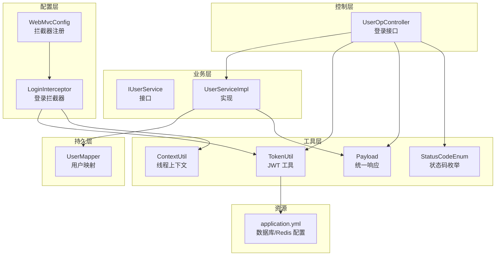
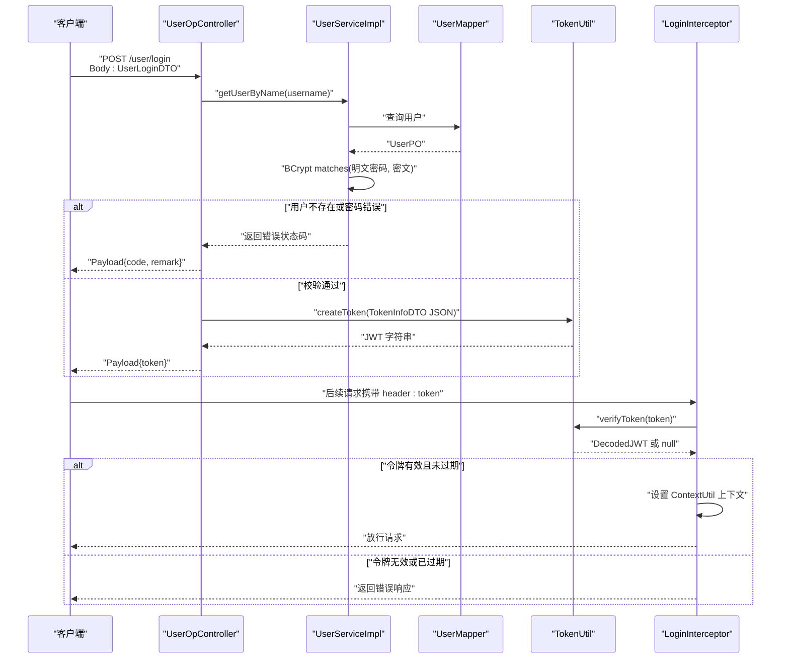
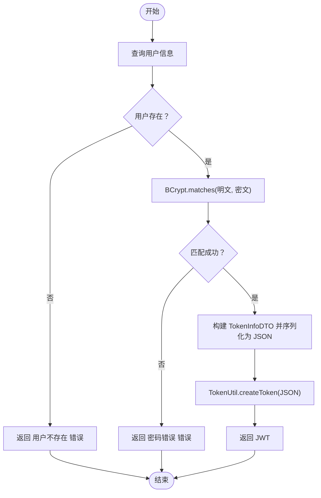
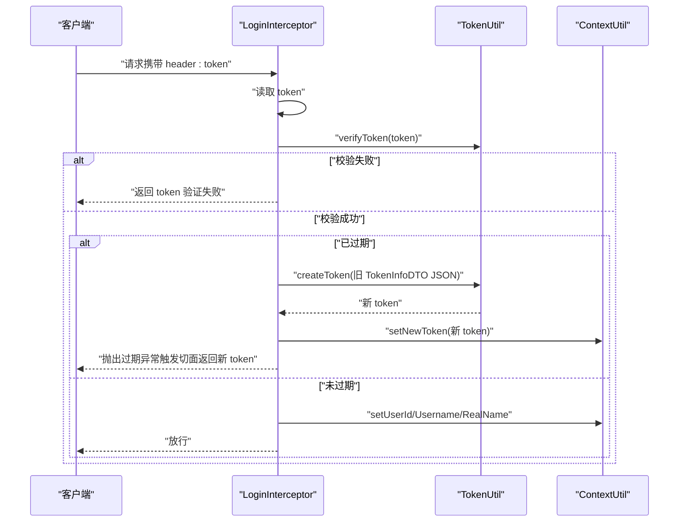
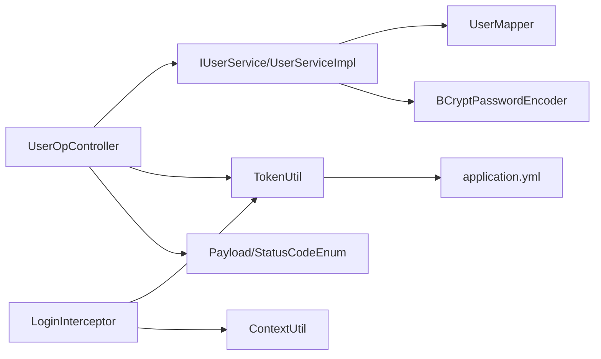

# 用户认证机制

<cite>
**本文引用的文件**
- [UserLoginDTO.java](file://src/main/java/com/hch/chat_simple/pojo/dto/UserLoginDTO.java)
- [TokenInfoDTO.java](file://src/main/java/com/hch/chat_simple/pojo/dto/TokenInfoDTO.java)
- [TokenUtil.java](file://src/main/java/com/hch/chat_simple/util/TokenUtil.java)
- [UserOpController.java](file://src/main/java/com/hch/chat_simple/controller/UserOpController.java)
- [IUserService.java](file://src/main/java/com/hch/chat_simple/service/IUserService.java)
- [UserServiceImpl.java](file://src/main/java/com/hch/chat_simple/service/impl/UserServiceImpl.java)
- [UserMapper.java](file://src/main/java/com/hch/chat_simple/mapper/UserMapper.java)
- [LoginInterceptor.java](file://src/main/java/com/hch/chat_simple/config/LoginInterceptor.java)
- [WebMvcConfig.java](file://src/main/java/com/hch/chat_simple/config/WebMvcConfig.java)
- [Payload.java](file://src/main/java/com/hch/chat_simple/util/Payload.java)
- [StatusCodeEnum.java](file://src/main/java/com/hch/chat_simple/util/StatusCodeEnum.java)
- [NoAuth.java](file://src/main/java/com/hch/chat_simple/auth/NoAuth.java)
- [ContextUtil.java](file://src/main/java/com/hch/chat_simple/util/ContextUtil.java)
- [application.yml](file://src/main/resources/application.yml)
</cite>

## 目录
1. [简介](#简介)
2. [项目结构](#项目结构)
3. [核心组件](#核心组件)
4. [架构总览](#架构总览)
5. [详细组件分析](#详细组件分析)
6. [依赖分析](#依赖分析)
7. [性能考虑](#性能考虑)
8. [故障排查指南](#故障排查指南)
9. [结论](#结论)
10. [附录](#附录)

## 简介
本文件系统性梳理并解释该聊天应用的用户认证机制，覆盖以下要点：
- 用户登录流程的完整实现与控制流
- UserLoginDTO 的数据验证规则与参数校验逻辑
- BCrypt 密码加密算法的使用方式（编码与匹配）
- JWT 令牌生成机制（TokenInfoDTO 数据结构、签名算法、过期时间）
- 登录接口的 API 设计（请求/响应、错误处理）
- 密码安全存储最佳实践（盐值、哈希算法）
- 登录失败处理策略与安全防护措施

## 项目结构
认证相关代码主要分布在以下模块：
- 控制层：用户登录接口与权限拦截
- 业务层：用户查询与密码校验
- 工具层：JWT 工具、上下文传递、统一响应封装
- 配置层：拦截器注册、跨域处理
- 持久层：用户表映射
- 资源配置：数据库与 Redis 连接配置

图表来源
- [UserOpController.java:1-114](file://src/main/java/com/hch/chat_simple/controller/UserOpController.java#L1-L114)
- [UserServiceImpl.java:1-100](file://src/main/java/com/hch/chat_simple/service/impl/UserServiceImpl.java#L1-L100)
- [TokenUtil.java:1-71](file://src/main/java/com/hch/chat_simple/util/TokenUtil.java#L1-L71)
- [LoginInterceptor.java:1-109](file://src/main/java/com/hch/chat_simple/config/LoginInterceptor.java#L1-L109)
- [WebMvcConfig.java:1-28](file://src/main/java/com/hch/chat_simple/config/WebMvcConfig.java#L1-L28)
- [UserMapper.java:1-22](file://src/main/java/com/hch/chat_simple/mapper/UserMapper.java#L1-L22)
- [application.yml:1-89](file://src/main/resources/application.yml#L1-L89)

章节来源
- [UserOpController.java:1-114](file://src/main/java/com/hch/chat_simple/controller/UserOpController.java#L1-L114)
- [WebMvcConfig.java:1-28](file://src/main/java/com/hch/chat_simple/config/WebMvcConfig.java#L1-L28)

## 核心组件
- UserLoginDTO：登录请求体的数据模型，包含用户名与密码字段，并通过注解进行非空校验。
- TokenInfoDTO：JWT 载荷载体，包含用户名、真实姓名与用户 ID。
- TokenUtil：JWT 生成与校验工具，定义签名密钥、签发者、过期时间与解析方法。
- UserOpController：登录接口控制器，负责接收登录请求、执行密码校验、签发 JWT。
- IUserService/UserServiceImpl：用户查询与密码匹配逻辑，使用 BCrypt 进行密码比对。
- LoginInterceptor：全局拦截器，负责从请求头读取 token、校验有效性、注入上下文。
- WebMvcConfig：注册拦截器与排除路径，确保登录接口免鉴权。
- Payload/StatusCodeEnum：统一响应封装与状态码定义。
- application.yml：数据库与 Redis 连接配置。

章节来源
- [UserLoginDTO.java:1-22](file://src/main/java/com/hch/chat_simple/pojo/dto/UserLoginDTO.java#L1-L22)
- [TokenInfoDTO.java:1-20](file://src/main/java/com/hch/chat_simple/pojo/dto/TokenInfoDTO.java#L1-L20)
- [TokenUtil.java:1-71](file://src/main/java/com/hch/chat_simple/util/TokenUtil.java#L1-L71)
- [UserOpController.java:1-114](file://src/main/java/com/hch/chat_simple/controller/UserOpController.java#L1-L114)
- [IUserService.java:1-28](file://src/main/java/com/hch/chat_simple/service/IUserService.java#L1-L28)
- [UserServiceImpl.java:1-100](file://src/main/java/com/hch/chat_simple/service/impl/UserServiceImpl.java#L1-L100)
- [LoginInterceptor.java:1-109](file://src/main/java/com/hch/chat_simple/config/LoginInterceptor.java#L1-L109)
- [WebMvcConfig.java:1-28](file://src/main/java/com/hch/chat_simple/config/WebMvcConfig.java#L1-L28)
- [Payload.java:1-30](file://src/main/java/com/hch/chat_simple/util/Payload.java#L1-L30)
- [StatusCodeEnum.java:1-22](file://src/main/java/com/hch/chat_simple/util/StatusCodeEnum.java#L1-L22)
- [application.yml:1-89](file://src/main/resources/application.yml#L1-L89)

## 架构总览
下图展示从客户端到服务端的认证交互流程，包括登录、令牌签发与后续请求的鉴权。

图表来源
- [UserOpController.java:44-66](file://src/main/java/com/hch/chat_simple/controller/UserOpController.java#L44-L66)
- [UserServiceImpl.java:42-48](file://src/main/java/com/hch/chat_simple/service/impl/UserServiceImpl.java#L42-L48)
- [UserMapper.java:18-22](file://src/main/java/com/hch/chat_simple/mapper/UserMapper.java#L18-L22)
- [TokenUtil.java:23-59](file://src/main/java/com/hch/chat_simple/util/TokenUtil.java#L23-L59)
- [LoginInterceptor.java:30-90](file://src/main/java/com/hch/chat_simple/config/LoginInterceptor.java#L30-L90)

## 详细组件分析

### UserLoginDTO 数据验证规则与参数校验逻辑
- 字段定义
  - username：登录名，必填
  - password：密码，必填
- 校验机制
  - 使用注解在控制器层进行非空校验，若为空则返回相应错误状态码
- 参数校验流程
  - 控制器接收请求体后，进入业务层进行用户查询与密码匹配
  - 若 DTO 校验失败，Spring 将直接返回参数错误响应

章节来源
- [UserLoginDTO.java:12-19](file://src/main/java/com/hch/chat_simple/pojo/dto/UserLoginDTO.java#L12-L19)
- [UserOpController.java:47](file://src/main/java/com/hch/chat_simple/controller/UserOpController.java#L47)

### BCrypt 密码加密与解码（匹配）流程
- 加密（注册/新增用户时）
  - 在业务层使用 BCrypt 对明文密码进行编码，保存为密文
- 匹配（登录时）
  - 控制器侧使用 BCrypt 进行明文与存储密码的匹配校验
- 安全特性
  - BCrypt 自带盐值，无需额外生成；具备自适应成本因子，抗暴力破解能力强

图表来源
- [UserServiceImpl.java:82-97](file://src/main/java/com/hch/chat_simple/service/impl/UserServiceImpl.java#L82-L97)
- [UserOpController.java:49-65](file://src/main/java/com/hch/chat_simple/controller/UserOpController.java#L49-L65)
- [TokenUtil.java:23-30](file://src/main/java/com/hch/chat_simple/util/TokenUtil.java#L23-L30)

章节来源
- [UserServiceImpl.java:92-94](file://src/main/java/com/hch/chat_simple/service/impl/UserServiceImpl.java#L92-L94)
- [UserOpController.java:50-55](file://src/main/java/com/hch/chat_simple/controller/UserOpController.java#L50-L55)

### JWT 令牌生成机制
- TokenInfoDTO 结构
  - username：登录名
  - realName：真实姓名
  - userId：用户主键
- 签名与过期
  - 签名算法：HMAC-SHA256
  - 密钥：固定字符串（开发环境示例）
  - 过期时间：30 分钟（UTC+8）
  - 签发者：固定字符串（开发环境示例）
- 生成流程
  - 将 TokenInfoDTO 序列化为 JSON 字符串
  - 使用 JWT.create 构建载荷，设置签发者、过期时间与签名
- 解析流程
  - 校验签名与签发者
  - 提取 subject 中的 JSON 并反序列化为 TokenInfoDTO

章节来源
- [TokenInfoDTO.java:14-19](file://src/main/java/com/hch/chat_simple/pojo/dto/TokenInfoDTO.java#L14-L19)
- [TokenUtil.java:19-30](file://src/main/java/com/hch/chat_simple/util/TokenUtil.java#L19-L30)
- [TokenUtil.java:48-69](file://src/main/java/com/hch/chat_simple/util/TokenUtil.java#L48-L69)

### 登录接口 API 设计
- 请求
  - 方法：POST
  - 地址：/user/login
  - 请求体：UserLoginDTO（username、password 必填）
  - 响应体：Payload<String>（token）
- 响应
  - 成功：Payload.success(token)
  - 失败：
    - 用户不存在：StatusCodeEnum.USER_NOT_FOUND
    - 密码错误：StatusCodeEnum.PWD_ERROR
- 错误处理
  - DTO 参数校验失败由框架自动处理
  - 业务错误通过 Payload.of(data, code, remark) 返回

章节来源
- [UserOpController.java:44-66](file://src/main/java/com/hch/chat_simple/controller/UserOpController.java#L44-L66)
- [Payload.java:18-28](file://src/main/java/com/hch/chat_simple/util/Payload.java#L18-L28)
- [StatusCodeEnum.java:6-13](file://src/main/java/com/hch/chat_simple/util/StatusCodeEnum.java#L6-L13)

### 权限拦截与上下文注入
- 拦截范围
  - 注册拦截器并排除登录、错误、Swagger 等路径
- 校验逻辑
  - 从请求头读取 token
  - 使用 TokenUtil.verifyToken 校验签名与签发者
  - 判断是否过期：若已过期则生成新 token 并抛出过期异常，交由切面处理
  - 将用户上下文写入 ThreadLocal，供后续业务使用
- 清理
  - 请求完成后清理上下文

图表来源
- [LoginInterceptor.java:44-72](file://src/main/java/com/hch/chat_simple/config/LoginInterceptor.java#L44-L72)
- [TokenUtil.java:48-59](file://src/main/java/com/hch/chat_simple/util/TokenUtil.java#L48-L59)
- [ContextUtil.java:12-42](file://src/main/java/com/hch/chat_simple/util/ContextUtil.java#L12-L42)

章节来源
- [WebMvcConfig.java:12-16](file://src/main/java/com/hch/chat_simple/config/WebMvcConfig.java#L12-L16)
- [LoginInterceptor.java:30-90](file://src/main/java/com/hch/chat_simple/config/LoginInterceptor.java#L30-L90)

### 密码安全存储最佳实践
- 使用 BCrypt 编码
  - 自动处理盐值与成本因子，无需手动生成盐
  - 存储密文而非明文
- 密钥管理
  - 当前实现中签名密钥为硬编码字符串，生产环境需改为安全的密钥管理方案（如环境变量、KMS）
- 过期策略
  - 令牌有效期较短（30 分钟），降低泄露风险
- 建议增强
  - 引入登录失败次数限制与账户锁定策略
  - 使用 HTTPS 传输，避免中间人攻击
  - 定期轮换 JWT 密钥

章节来源
- [UserServiceImpl.java:92-94](file://src/main/java/com/hch/chat_simple/service/impl/UserServiceImpl.java#L92-L94)
- [TokenUtil.java:19-30](file://src/main/java/com/hch/chat_simple/util/TokenUtil.java#L19-L30)

### 登录失败处理策略与安全防护
- 失败场景
  - 用户不存在：返回用户不存在状态码
  - 密码错误：返回密码错误状态码
  - 令牌无效/缺失：返回对应状态码
- 安全措施
  - DTO 层参数校验
  - BCrypt 密码匹配
  - JWT 签名与签发者校验
  - 短有效期令牌与过期续签机制
  - 拦截器排除登录接口，避免循环拦截

章节来源
- [UserOpController.java:51-55](file://src/main/java/com/hch/chat_simple/controller/UserOpController.java#L51-L55)
- [LoginInterceptor.java:74-82](file://src/main/java/com/hch/chat_simple/config/LoginInterceptor.java#L74-L82)
- [StatusCodeEnum.java:8-13](file://src/main/java/com/hch/chat_simple/util/StatusCodeEnum.java#L8-L13)

## 依赖分析
- 组件耦合
  - 控制器依赖业务层接口，业务层依赖持久层映射
  - 拦截器依赖 JWT 工具与上下文工具
  - 统一响应与状态码贯穿各层
- 外部依赖
  - JWT 库用于令牌生成与校验
  - Spring Security Crypto 用于 BCrypt
  - MyBatis-Plus 用于数据访问
  - Redis（配置项）可用于扩展缓存与限流

图表来源
- [UserOpController.java:41-47](file://src/main/java/com/hch/chat_simple/controller/UserOpController.java#L41-L47)
- [UserServiceImpl.java:25-27](file://src/main/java/com/hch/chat_simple/service/impl/UserServiceImpl.java#L25-L27)
- [UserMapper.java:18-22](file://src/main/java/com/hch/chat_simple/mapper/UserMapper.java#L18-L22)
- [TokenUtil.java:8-13](file://src/main/java/com/hch/chat_simple/util/TokenUtil.java#L8-L13)
- [LoginInterceptor.java:18-25](file://src/main/java/com/hch/chat_simple/config/LoginInterceptor.java#L18-L25)
- [ContextUtil.java:3-10](file://src/main/java/com/hch/chat_simple/util/ContextUtil.java#L3-L10)
- [Payload.java:5-10](file://src/main/java/com/hch/chat_simple/util/Payload.java#L5-L10)
- [application.yml:1-89](file://src/main/resources/application.yml#L1-L89)

章节来源
- [UserOpController.java:1-114](file://src/main/java/com/hch/chat_simple/controller/UserOpController.java#L1-L114)
- [UserServiceImpl.java:1-100](file://src/main/java/com/hch/chat_simple/service/impl/UserServiceImpl.java#L1-L100)
- [TokenUtil.java:1-71](file://src/main/java/com/hch/chat_simple/util/TokenUtil.java#L1-L71)
- [LoginInterceptor.java:1-109](file://src/main/java/com/hch/chat_simple/config/LoginInterceptor.java#L1-L109)
- [application.yml:1-89](file://src/main/resources/application.yml#L1-L89)

## 性能考虑
- 密码匹配
  - BCrypt 成本因子默认适中，建议根据服务器性能调优
- 令牌生成
  - HMAC-SHA256 计算开销低，适合高并发场景
- 拦截器
  - 每次请求均进行 token 校验，建议结合缓存优化（如 Redis）存储近期活跃 token 的白名单或黑名单
- 数据库
  - 用户查询使用精确条件，建议在用户名字段建立唯一索引以提升查询效率

## 故障排查指南
- 常见问题
  - 参数校验失败：检查请求体字段是否为空
  - 用户不存在：确认用户名是否正确
  - 密码错误：确认明文密码与存储密文匹配
  - token 验证失败：确认签名密钥一致、签发者匹配、未过期
  - token 缺失：确认请求头是否包含 token
- 排查步骤
  - 查看拦截器日志与异常栈
  - 核对 application.yml 中的数据库与 Redis 配置
  - 确认拦截器排除路径是否包含 /user/login

章节来源
- [LoginInterceptor.java:74-82](file://src/main/java/com/hch/chat_simple/config/LoginInterceptor.java#L74-L82)
- [application.yml:1-89](file://src/main/resources/application.yml#L1-L89)

## 结论
该认证体系采用 DTO 参数校验、BCrypt 密码匹配与 JWT 令牌机制，配合全局拦截器实现统一鉴权。整体设计清晰、职责分离明确，具备良好的扩展性。建议在生产环境中强化密钥管理、引入登录风控策略与更完善的日志审计能力。

## 附录
- 关键配置项
  - 数据库连接与 MyBatis-Plus 配置
  - Redis 连接与 RocketMQ 配置
  - 服务器端口与聊天服务端口
- 安全加固建议
  - 使用 HTTPS
  - 引入验证码与登录失败限制
  - 定期轮换 JWT 密钥
  - 对敏感操作二次校验

章节来源
- [application.yml:1-89](file://src/main/resources/application.yml#L1-L89)