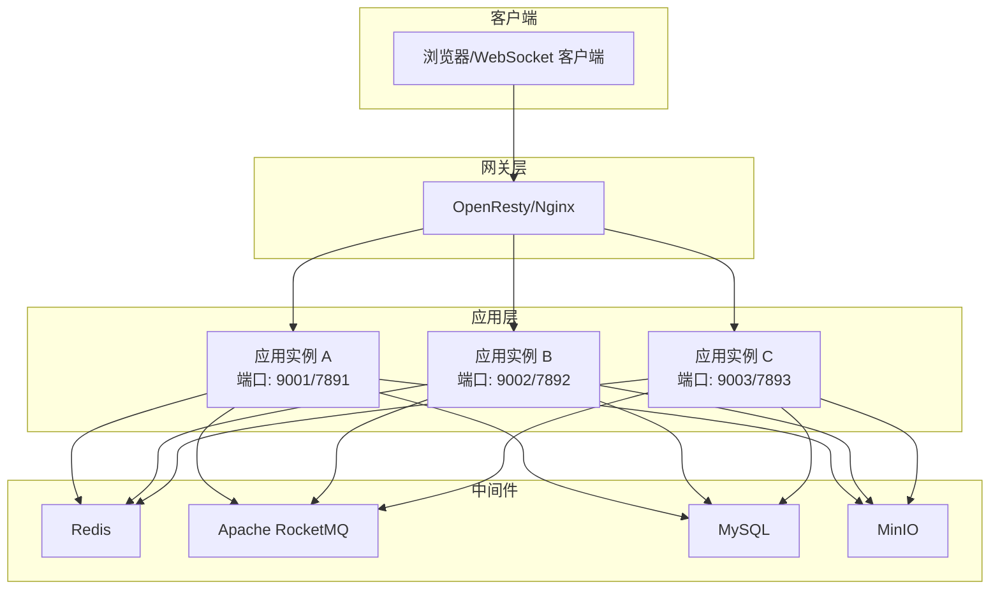
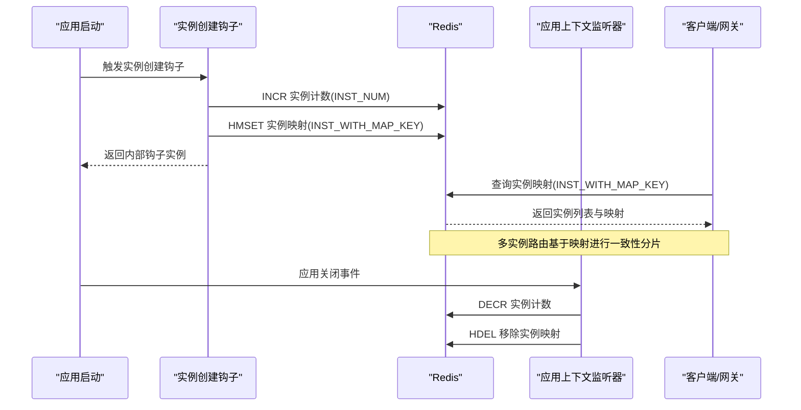
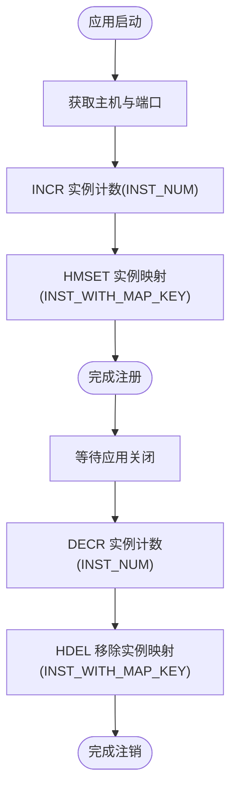
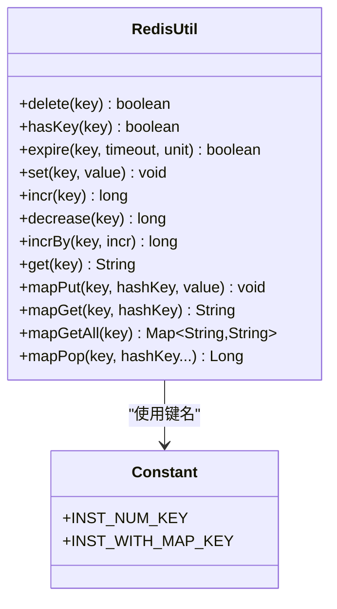
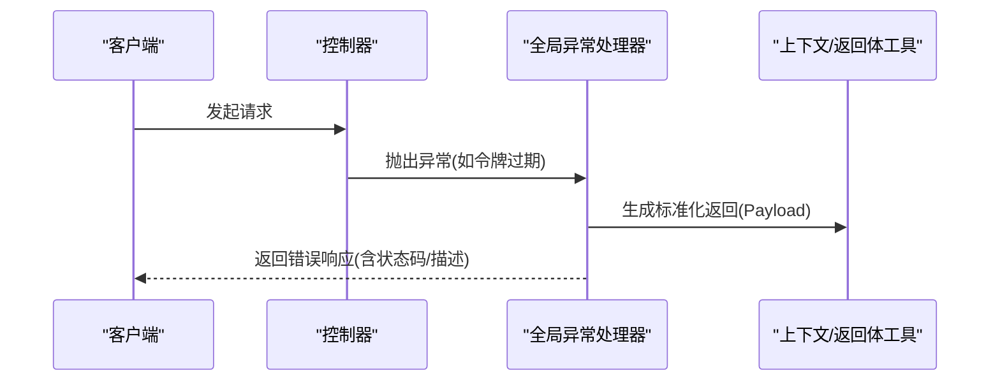
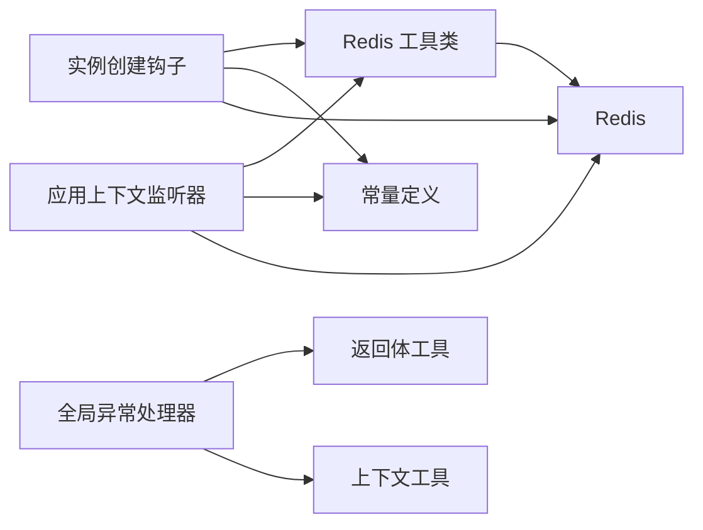

# 健康监控

<cite>
**本文引用的文件**
- [InstanceCreateHook.java](file://src/main/java/com/hch/chat_simple/config/InstanceCreateHook.java)
- [SpringContextListener.java](file://src/main/java/com/hch/chat_simple/listener/SpringContextListener.java)
- [RedisUtil.java](file://src/main/java/com/hch/chat_simple/util/RedisUtil.java)
- [Constant.java](file://src/main/java/com/hch/chat_simple/util/Constant.java)
- [application.yml](file://src/main/resources/application.yml)
- [logback-spring.xml](file://src/main/resources/logback-spring.xml)
- [Dockerfile](file://Dockerfile)
- [docker-compose.yml](file://docker-compose.yml)
- [chat.sql](file://db/chat.sql)
- [ProxyController.java](file://src/main/java/com/hch/chat_simple/controller/ProxyController.java)
- [ExceptionAspectHandler.java](file://src/main/java/com/hch/chat_simple/config/ExceptionAspectHandler.java)
- [ContextUtil.java](file://src/main/java/com/hch/chat_simple/util/ContextUtil.java)
- [Payload.java](file://src/main/java/com/hch/chat_simple/util/Payload.java)
- [StatusCodeEnum.java](file://src/main/java/com/hch/chat_simple/util/StatusCodeEnum.java)
</cite>

## 目录
1. [简介](#简介)
2. [项目结构](#项目结构)
3. [核心组件](#核心组件)
4. [架构总览](#架构总览)
5. [详细组件分析](#详细组件分析)
6. [依赖分析](#依赖分析)
7. [性能考虑](#性能考虑)
8. [故障排查指南](#故障排查指南)
9. [结论](#结论)
10. [附录](#附录)

## 简介
本技术文档围绕聊天应用的运行时监控与健康检查机制展开，重点覆盖以下方面：
- 实例创建钩子的实现原理与作用：应用启动监听、服务注册、健康状态上报等
- 关键监控指标的定义与采集：系统资源使用率、业务指标、错误率、响应时间等
- 监控数据的可视化展示：仪表板设计、告警规则配置、趋势分析等
- 故障预警与自动恢复机制：熔断器模式、降级策略、重试机制等
- 监控系统的扩展性设计：支持多实例部署与分布式监控

## 项目结构
该项目采用 Spring Boot 单体架构，结合 Redis、MySQL、RocketMQ、MinIO、OpenResty/Nginx 等组件，形成前后端分离与实时通信协同的系统。监控侧的关键点在于：
- 应用启动/关闭事件驱动的实例注册与注销
- Redis 中维护实例数量与实例映射表，支撑多实例路由与一致性
- 日志与异常处理统一出口，便于集中化监控与告警
- Docker 与 docker-compose 支持多实例部署与负载均衡

图表来源
- [docker-compose.yml:1-132](file://docker-compose.yml#L1-L132)
- [Dockerfile:1-12](file://Dockerfile#L1-L12)
- [application.yml:1-89](file://src/main/resources/application.yml#L1-L89)

章节来源
- [docker-compose.yml:1-132](file://docker-compose.yml#L1-L132)
- [Dockerfile:1-12](file://Dockerfile#L1-L12)
- [application.yml:1-89](file://src/main/resources/application.yml#L1-L89)

## 核心组件
- 实例创建钩子：在应用启动时向 Redis 注册实例，记录实例数量与映射关系，用于后续多实例路由与一致性保障
- 应用上下文监听器：在应用关闭时从 Redis 清理实例信息，避免脏读与路由错误
- Redis 工具类：封装常用 Redis 操作，包括计数、哈希写入/读取、删除等
- 常量定义：集中管理实例计数与映射键名
- 异常与返回体：统一异常处理与返回结构，便于监控系统识别错误率与异常类型
- 日志配置：SQL 与通用日志输出级别，便于问题定位与审计

章节来源
- [InstanceCreateHook.java:1-72](file://src/main/java/com/hch/chat_simple/config/InstanceCreateHook.java#L1-L72)
- [SpringContextListener.java:1-53](file://src/main/java/com/hch/chat_simple/listener/SpringContextListener.java#L1-L53)
- [RedisUtil.java:1-123](file://src/main/java/com/hch/chat_simple/util/RedisUtil.java#L1-L123)
- [Constant.java:1-33](file://src/main/java/com/hch/chat_simple/util/Constant.java#L1-L33)
- [ExceptionAspectHandler.java:1-24](file://src/main/java/com/hch/chat_simple/config/ExceptionAspectHandler.java#L1-L24)
- [Payload.java:1-30](file://src/main/java/com/hch/chat_simple/util/Payload.java#L1-L30)
- [logback-spring.xml:1-24](file://src/main/resources/logback-spring.xml#L1-L24)

## 架构总览
下图展示了健康监控与多实例路由的整体交互流程，强调实例注册、实例映射、请求路由与健康状态上报的关系。

图表来源
- [InstanceCreateHook.java:56-70](file://src/main/java/com/hch/chat_simple/config/InstanceCreateHook.java#L56-L70)
- [SpringContextListener.java:30-41](file://src/main/java/com/hch/chat_simple/listener/SpringContextListener.java#L30-L41)
- [RedisUtil.java:57-97](file://src/main/java/com/hch/chat_simple/util/RedisUtil.java#L57-L97)
- [Constant.java:27-31](file://src/main/java/com/hch/chat_simple/util/Constant.java#L27-L31)

## 详细组件分析

### 实例创建钩子与服务注册
- 启动监听：在应用启动完成后，钩子通过环境变量获取主机与端口，向 Redis 写入实例映射，并递增实例计数
- 服务注册：实例映射键保存“主机:端口 → 实例序号”，实例计数键用于计算取模因子
- 健康状态上报：当前实现通过实例注册与注销间接反映健康状态；可扩展为定时心跳或外部健康检查接口

图表来源
- [InstanceCreateHook.java:56-70](file://src/main/java/com/hch/chat_simple/config/InstanceCreateHook.java#L56-L70)
- [SpringContextListener.java:30-41](file://src/main/java/com/hch/chat_simple/listener/SpringContextListener.java#L30-L41)
- [RedisUtil.java:57-97](file://src/main/java/com/hch/chat_simple/util/RedisUtil.java#L57-L97)
- [Constant.java:27-31](file://src/main/java/com/hch/chat_simple/util/Constant.java#L27-L31)

章节来源
- [InstanceCreateHook.java:17-70](file://src/main/java/com/hch/chat_simple/config/InstanceCreateHook.java#L17-L70)
- [SpringContextListener.java:26-41](file://src/main/java/com/hch/chat_simple/listener/SpringContextListener.java#L26-L41)
- [RedisUtil.java:57-97](file://src/main/java/com/hch/chat_simple/util/RedisUtil.java#L57-L97)
- [Constant.java:27-31](file://src/main/java/com/hch/chat_simple/util/Constant.java#L27-L31)

### Redis 工具类与实例映射
- 计数与哈希操作：提供原子计数、哈希写入/读取/删除等能力，确保实例注册/注销的强一致
- 键命名规范：实例计数键与实例映射键集中定义，降低耦合与误用风险

图表来源
- [RedisUtil.java:1-123](file://src/main/java/com/hch/chat_simple/util/RedisUtil.java#L1-L123)
- [Constant.java:27-31](file://src/main/java/com/hch/chat_simple/util/Constant.java#L27-L31)

章节来源
- [RedisUtil.java:29-117](file://src/main/java/com/hch/chat_simple/util/RedisUtil.java#L29-L117)
- [Constant.java:27-31](file://src/main/java/com/hch/chat_simple/util/Constant.java#L27-L31)

### 多实例路由与代理（扩展）
- 当前代码中存在代理控制器的占位实现，保留了按实例映射取模进行路由的思路，可用于后续扩展
- 建议：在生产环境中优先通过网关层（如 OpenResty/Nginx）进行一致性哈希或轮询路由，应用内路由作为兜底

章节来源
- [ProxyController.java:61-163](file://src/main/java/com/hch/chat_simple/controller/ProxyController.java#L61-L163)

### 异常处理与返回体
- 统一异常处理：针对特定异常（如令牌过期）进行拦截与标准化返回
- 返回体结构：包含数据、状态码与描述，便于监控系统解析错误类型与频率

图表来源
- [ExceptionAspectHandler.java:16-20](file://src/main/java/com/hch/chat_simple/config/ExceptionAspectHandler.java#L16-L20)
- [ContextUtil.java:36-42](file://src/main/java/com/hch/chat_simple/util/ContextUtil.java#L36-L42)
- [Payload.java:18-28](file://src/main/java/com/hch/chat_simple/util/Payload.java#L18-L28)
- [StatusCodeEnum.java:6-20](file://src/main/java/com/hch/chat_simple/util/StatusCodeEnum.java#L6-L20)

章节来源
- [ExceptionAspectHandler.java:16-20](file://src/main/java/com/hch/chat_simple/config/ExceptionAspectHandler.java#L16-L20)
- [ContextUtil.java:36-42](file://src/main/java/com/hch/chat_simple/util/ContextUtil.java#L36-L42)
- [Payload.java:18-28](file://src/main/java/com/hch/chat_simple/util/Payload.java#L18-L28)
- [StatusCodeEnum.java:6-20](file://src/main/java/com/hch/chat_simple/util/StatusCodeEnum.java#L6-L20)

### 日志与可观测性
- 日志配置：开启 SQL 与通用日志输出，便于问题定位与审计
- 建议：接入集中式日志（如 ELK/Fluent Bit）与指标导出（如 Micrometer），实现统一监控面板与告警

章节来源
- [logback-spring.xml:12-18](file://src/main/resources/logback-spring.xml#L12-L18)

## 依赖分析
- 组件耦合：实例注册/注销依赖 Redis 工具类与常量定义；异常处理依赖返回体与上下文工具
- 外部依赖：MySQL、Redis、RocketMQ、MinIO、OpenResty/Nginx
- 扩展点：可通过引入 Micrometer/Actuator、Prometheus/Grafana、SkyWalking 等完善监控体系

图表来源
- [InstanceCreateHook.java:56-70](file://src/main/java/com/hch/chat_simple/config/InstanceCreateHook.java#L56-L70)
- [SpringContextListener.java:30-41](file://src/main/java/com/hch/chat_simple/listener/SpringContextListener.java#L30-L41)
- [RedisUtil.java:57-97](file://src/main/java/com/hch/chat_simple/util/RedisUtil.java#L57-L97)
- [Constant.java:27-31](file://src/main/java/com/hch/chat_simple/util/Constant.java#L27-L31)
- [ExceptionAspectHandler.java:16-20](file://src/main/java/com/hch/chat_simple/config/ExceptionAspectHandler.java#L16-L20)
- [Payload.java:18-28](file://src/main/java/com/hch/chat_simple/util/Payload.java#L18-L28)
- [ContextUtil.java:36-42](file://src/main/java/com/hch/chat_simple/util/ContextUtil.java#L36-L42)

章节来源
- [RedisUtil.java:1-123](file://src/main/java/com/hch/chat_simple/util/RedisUtil.java#L1-L123)
- [Constant.java:1-33](file://src/main/java/com/hch/chat_simple/util/Constant.java#L1-L33)
- [ExceptionAspectHandler.java:1-24](file://src/main/java/com/hch/chat_simple/config/ExceptionAspectHandler.java#L1-L24)
- [Payload.java:1-30](file://src/main/java/com/hch/chat_simple/util/Payload.java#L1-L30)
- [ContextUtil.java:1-52](file://src/main/java/com/hch/chat_simple/util/ContextUtil.java#L1-L52)

## 性能考虑
- 实例映射一致性：通过 Redis 原子操作保证实例计数与映射的强一致，避免路由错误
- 路由效率：实例映射键为哈希表，查询复杂度为 O(1)，适合高并发场景
- 日志开销：SQL 与通用日志建议在生产环境调整级别，避免过多 IO 影响吞吐
- 多实例部署：通过网关层进行请求分发，应用内仅做兜底路由，降低跨实例调用成本

## 故障排查指南
- 实例无法注册/注销
  - 检查 Redis 连通性与权限
  - 查看实例计数与映射键是否存在
  - 确认应用启动/关闭事件是否触发
- 请求路由异常
  - 核对实例映射表与实例数量是否一致
  - 检查取模逻辑与实例序号连续性
- 异常与错误码
  - 统一通过异常处理器与返回体识别错误类型
  - 结合日志定位具体异常堆栈

章节来源
- [SpringContextListener.java:30-41](file://src/main/java/com/hch/chat_simple/listener/SpringContextListener.java#L30-L41)
- [RedisUtil.java:57-97](file://src/main/java/com/hch/chat_simple/util/RedisUtil.java#L57-L97)
- [ExceptionAspectHandler.java:16-20](file://src/main/java/com/hch/chat_simple/config/ExceptionAspectHandler.java#L16-L20)
- [Payload.java:18-28](file://src/main/java/com/hch/chat_simple/util/Payload.java#L18-L28)

## 结论
本项目通过“启动注册 + 关闭注销 + Redis 映射”的轻量监控机制，实现了多实例的一致性路由与健康状态的间接反映。建议在此基础上引入指标导出、集中式日志与可视化面板，完善告警与趋势分析能力，进一步提升系统的可观测性与可运维性。

## 附录
- 数据库初始化脚本：包含用户、好友关系、聊天消息、群组与通知等核心表结构
- Docker 与 docker-compose：支持多实例部署与外部依赖编排
- 配置文件：包含 Redis、MySQL、RocketMQ、MinIO、Redisson 等关键配置项

章节来源
- [chat.sql:1-130](file://db/chat.sql#L1-L130)
- [Dockerfile:1-12](file://Dockerfile#L1-L12)
- [docker-compose.yml:1-132](file://docker-compose.yml#L1-L132)
- [application.yml:1-89](file://src/main/resources/application.yml#L1-L89)