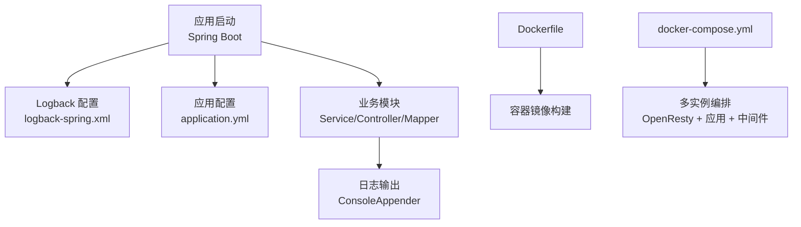
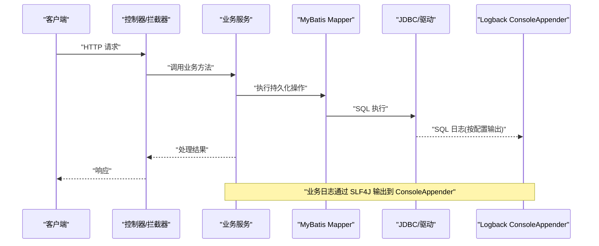
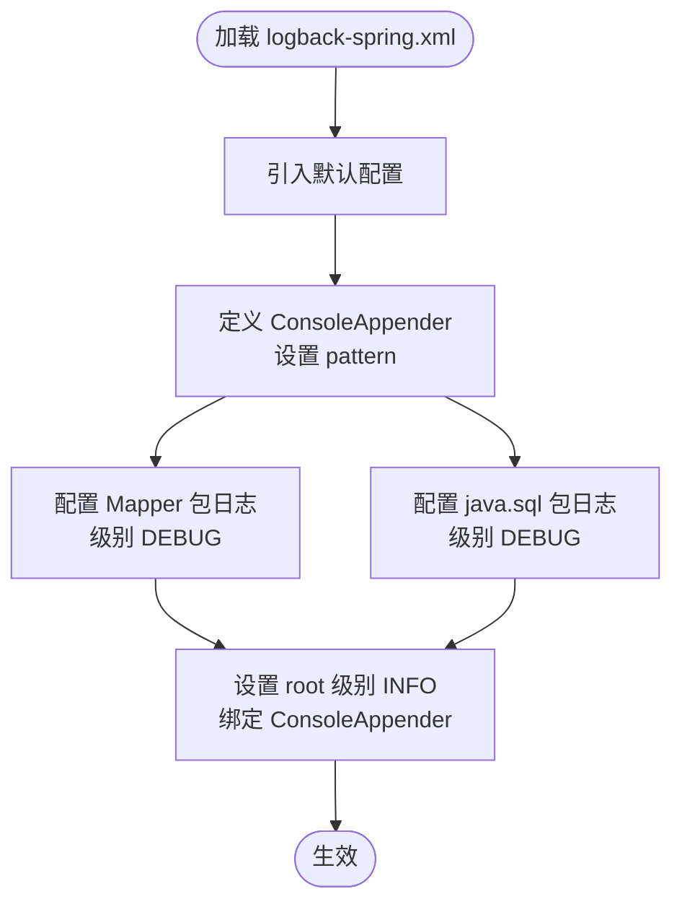
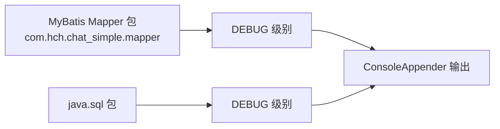
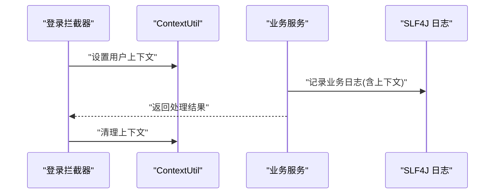
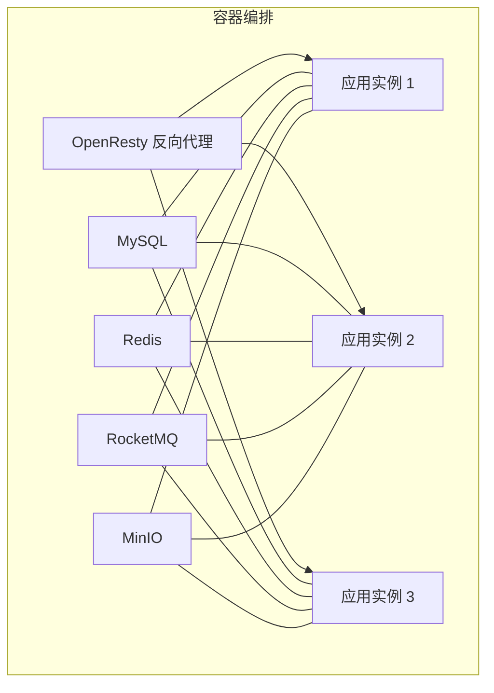
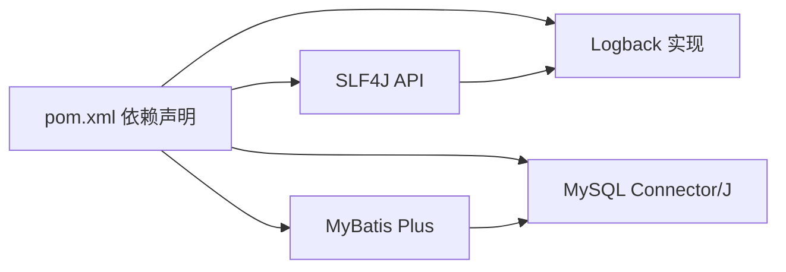

# 日志管理

<cite>
**本文引用的文件**
- [logback-spring.xml](file://src/main/resources/logback-spring.xml)
- [application.yml](file://src/main/resources/application.yml)
- [Dockerfile](file://Dockerfile)
- [docker-compose.yml](file://docker-compose.yml)
- [ChatMsgServiceImpl.java](file://src/main/java/com/hch/chat_simple/service/impl/ChatMsgServiceImpl.java)
- [ExceptionAspectHandler.java](file://src/main/java/com/hch/chat_simple/config/ExceptionAspectHandler.java)
- [LoginInterceptor.java](file://src/main/java/com/hch/chat_simple/config/LoginInterceptor.java)
- [ContextUtil.java](file://src/main/java/com/hch/chat_simple/util/ContextUtil.java)
- [ChatMsgMapper.java](file://src/main/java/com/hch/chat_simple/mapper/ChatMsgMapper.java)
- [pom.xml](file://pom.xml)
</cite>

## 目录
1. [简介](#简介)
2. [项目结构](#项目结构)
3. [核心组件](#核心组件)
4. [架构总览](#架构总览)
5. [详细组件分析](#详细组件分析)
6. [依赖分析](#依赖分析)
7. [性能考量](#性能考量)
8. [故障排查指南](#故障排查指南)
9. [结论](#结论)
10. [附录](#附录)

## 简介
本文件面向聊天应用的日志管理，系统性梳理了基于 Logback 的日志配置与使用方式，覆盖控制台输出、SQL 日志调试、日志级别与分类管理、异步日志扩展建议、日志轮转与归档策略，以及在 Docker 容器中的日志管理最佳实践。同时提供常见问题定位、性能分析与错误追踪的实操案例，帮助开发与运维人员快速建立稳定高效的日志体系。

## 项目结构
- 日志配置位于资源目录，采用 Spring Boot 推荐的 logback-spring.xml 方式，便于环境变量与条件化配置。
- 应用配置位于 application.yml，其中包含数据库、MyBatis Plus、RocketMQ、Redisson、分页插件等关键配置项。
- Dockerfile 与 docker-compose.yml 提供容器化部署与多实例运行能力，便于在容器环境中统一采集与管理日志。

**图表来源**
- [logback-spring.xml:1-24](file://src/main/resources/logback-spring.xml#L1-L24)
- [application.yml:1-89](file://src/main/resources/application.yml#L1-L89)
- [Dockerfile:1-12](file://Dockerfile#L1-L12)
- [docker-compose.yml:1-132](file://docker-compose.yml#L1-L132)

**章节来源**
- [logback-spring.xml:1-24](file://src/main/resources/logback-spring.xml#L1-L24)
- [application.yml:1-89](file://src/main/resources/application.yml#L1-L89)
- [Dockerfile:1-12](file://Dockerfile#L1-L12)
- [docker-compose.yml:1-132](file://docker-compose.yml#L1-L132)

## 核心组件
- 控制台输出 Appender：定义 ConsoleAppender 并通过 pattern 指定时间、级别、Logger 名称与消息内容。
- SQL 日志记录：针对 MyBatis Mapper 包与 java.sql 包开启 DEBUG 级别，输出 SQL 语句与 JDBC 调试信息。
- 根日志级别：设置根 Logger 为 INFO，统一控制全局日志输出粒度。
- 日志门面：项目广泛使用 SLF4J（通过 Lombok 注解），结合 Logback 实现日志输出。
- 容器化部署：Dockerfile 指定时区与入口命令；docker-compose.yml 提供多实例与中间件编排。

**章节来源**
- [logback-spring.xml:5-23](file://src/main/resources/logback-spring.xml#L5-L23)
- [application.yml:16-32](file://src/main/resources/application.yml#L16-L32)
- [pom.xml:34-346](file://pom.xml#L34-L346)

## 架构总览
下图展示日志从应用到输出的总体流程，包括 SQL 调试与通用日志的路径。

**图表来源**
- [logback-spring.xml:12-18](file://src/main/resources/logback-spring.xml#L12-L18)
- [ChatMsgServiceImpl.java:98-144](file://src/main/java/com/hch/chat_simple/service/impl/ChatMsgServiceImpl.java#L98-L144)
- [ChatMsgMapper.java:1-21](file://src/main/java/com/hch/chat_simple/mapper/ChatMsgMapper.java#L1-L21)

## 详细组件分析

### Logback 配置文件结构与参数详解
- 控制台 Appender
  - 名称：CONSOLE
  - 编码器：指定输出格式 pattern，包含日期时间、日志级别、Logger 名称与消息内容
- SQL 日志记录
  - Mapper 包日志：com.hch.chat_simple.mapper，级别 DEBUG，additivity=false，避免重复输出
  - JDBC 包日志：java.sql，级别 DEBUG，additivity=false
- 根日志级别
  - root 级别 INFO，绑定 CONSOLE Appender，作为全局默认输出

**图表来源**
- [logback-spring.xml:4-23](file://src/main/resources/logback-spring.xml#L4-L23)

**章节来源**
- [logback-spring.xml:4-23](file://src/main/resources/logback-spring.xml#L4-L23)

### SQL 日志记录配置
- MyBatis Mapper 日志：通过 com.hch.chat_simple.mapper 包级别的 DEBUG 输出，可观察 SQL 语句与参数。
- JDBC 日志：java.sql 包 DEBUG 输出，可观察底层 JDBC 调用细节。
- 注意：当前未启用 MyBatis 内置 StdOutImpl 输出，SQL 日志由 Logback 的 java.sql 包日志接管。

**图表来源**
- [logback-spring.xml:12-18](file://src/main/resources/logback-spring.xml#L12-L18)
- [application.yml:31-32](file://src/main/resources/application.yml#L31-L32)

**章节来源**
- [logback-spring.xml:12-18](file://src/main/resources/logback-spring.xml#L12-L18)
- [application.yml:31-32](file://src/main/resources/application.yml#L31-L32)

### 日志分类管理
- 根日志级别：INFO，确保生产环境输出不过于冗长
- 特定包日志级别：Mapper 包与 java.sql 包 DEBUG，便于开发与联调阶段定位问题
- 异步日志：当前未启用异步 Appender，如需提升高并发场景下的吞吐量，可在生产环境引入异步 Appender 并配合合适的队列与丢弃策略

**章节来源**
- [logback-spring.xml:20-23](file://src/main/resources/logback-spring.xml#L20-L23)
- [logback-spring.xml:12-18](file://src/main/resources/logback-spring.xml#L12-L18)

### 日志输出与使用示例
- 业务日志：大量使用 @Slf4j 注解，结合 log.info/log.warn/log.error 等方法输出业务事件与异常信息
- 上下文携带：通过 ContextUtil 在拦截器中设置用户上下文，业务日志中可包含用户标识，便于问题定位
- 异常处理：全局异常切面中记录异常栈，辅助错误追踪

**图表来源**
- [LoginInterceptor.java:27-97](file://src/main/java/com/hch/chat_simple/config/LoginInterceptor.java#L27-L97)
- [ContextUtil.java:5-52](file://src/main/java/com/hch/chat_simple/util/ContextUtil.java#L5-L52)
- [ChatMsgServiceImpl.java:54-144](file://src/main/java/com/hch/chat_simple/service/impl/ChatMsgServiceImpl.java#L54-L144)

**章节来源**
- [LoginInterceptor.java:27-97](file://src/main/java/com/hch/chat_simple/config/LoginInterceptor.java#L27-L97)
- [ContextUtil.java:5-52](file://src/main/java/com/hch/chat_simple/util/ContextUtil.java#L5-L52)
- [ChatMsgServiceImpl.java:54-144](file://src/main/java/com/hch/chat_simple/service/impl/ChatMsgServiceImpl.java#L54-L144)
- [ExceptionAspectHandler.java:10-23](file://src/main/java/com/hch/chat_simple/config/ExceptionAspectHandler.java#L10-L23)

### 容器化日志管理最佳实践
- Dockerfile
  - 指定时区，保证日志时间戳一致
  - 使用 java -jar 启动，标准输出即容器日志源
- docker-compose.yml
  - 多实例编排，便于横向扩展与负载均衡
  - OpenResty 作为反向代理，统一入口与日志采集
  - 中间件（MySQL、Redis、RocketMQ、MinIO）独立容器，便于集中日志收集

**图表来源**
- [Dockerfile:1-12](file://Dockerfile#L1-L12)
- [docker-compose.yml:13-63](file://docker-compose.yml#L13-L63)

**章节来源**
- [Dockerfile:1-12](file://Dockerfile#L1-L12)
- [docker-compose.yml:1-132](file://docker-compose.yml#L1-L132)

## 依赖分析
- 日志门面与实现
  - 项目使用 SLF4J（通过 Lombok @Slf4j），Logback 作为实现
  - 依赖范围：compile，随应用打包
- SQL 日志依赖
  - MyBatis Plus 与 JDBC 驱动负责 SQL 执行与 JDBC 调用
  - 日志由 Logback 捕获并输出

**图表来源**
- [pom.xml:34-346](file://pom.xml#L34-L346)

**章节来源**
- [pom.xml:34-346](file://pom.xml#L34-L346)

## 性能考量
- 当前配置以控制台输出为主，适合开发与测试环境
- 生产环境建议：
  - 引入异步 Appender（如 AsyncAppender）降低 IO 延迟
  - 配置合适的队列容量与拒绝策略，避免内存压力
  - 使用 RollingFileAppender 进行日志轮转与压缩，控制磁盘占用
  - 将根日志级别提升至 WARN 或 ERROR，仅在问题定位时临时降级为 DEBUG

[本节为通用指导，无需具体文件引用]

## 故障排查指南

### 常见问题定位
- SQL 未输出
  - 检查 com.hch.chat_simple.mapper 与 java.sql 包是否处于 DEBUG 级别
  - 确认 additivity=false 未导致重复或遗漏输出
- 日志无时间戳或格式异常
  - 检查 ConsoleAppender 的 pattern 是否正确
- 上下文缺失
  - 确认拦截器已设置 ContextUtil 用户信息，且在业务日志中包含上下文字段

**章节来源**
- [logback-spring.xml:12-18](file://src/main/resources/logback-spring.xml#L12-L18)
- [logback-spring.xml:6-9](file://src/main/resources/logback-spring.xml#L6-L9)
- [LoginInterceptor.java:44-70](file://src/main/java/com/hch/chat_simple/config/LoginInterceptor.java#L44-L70)
- [ContextUtil.java:5-52](file://src/main/java/com/hch/chat_simple/util/ContextUtil.java#L5-L52)

### 性能分析
- SQL 性能
  - 结合 Mapper 包 DEBUG 日志，定位慢查询与重复查询
  - 使用数据库慢查询日志与 EXPLAIN 分析执行计划
- 应用吞吐
  - 在高并发场景下评估是否需要引入异步日志与限流策略
  - 关注 GC 与线程池状态对日志输出的影响

**章节来源**
- [logback-spring.xml:12-18](file://src/main/resources/logback-spring.xml#L12-L18)
- [ChatMsgServiceImpl.java:98-144](file://src/main/java/com/hch/chat_simple/service/impl/ChatMsgServiceImpl.java#L98-L144)

### 错误追踪
- 全局异常处理
  - 使用 @RestControllerAdvice 记录异常栈，辅助快速定位
- 业务异常
  - 在关键业务节点记录上下文信息（用户 ID、请求参数、处理结果）

**章节来源**
- [ExceptionAspectHandler.java:10-23](file://src/main/java/com/hch/chat_simple/config/ExceptionAspectHandler.java#L10-L23)
- [ChatMsgServiceImpl.java:98-144](file://src/main/java/com/hch/chat_simple/service/impl/ChatMsgServiceImpl.java#L98-L144)

## 结论
本项目采用 Logback 控制台输出与 SQL 调试配置，满足开发与联调阶段的需求。生产环境建议引入异步日志、滚动文件与合理的日志级别策略，并结合容器化编排实现统一日志采集与分析。通过上下文日志与全局异常处理，能够有效提升问题定位效率与系统可观测性。

[本节为总结性内容，无需具体文件引用]

## 附录

### 日志轮转与归档策略（建议）
- 使用 RollingFileAppender，按天或按大小滚动
- 压缩旧日志，限制保留天数或最大数量
- 将应用日志与 SQL 日志分离到不同文件，便于检索

[本节为通用指导，无需具体文件引用]

### Docker 容器日志管理最佳实践
- 使用标准输出作为日志源，配合 Docker 日志驱动统一收集
- 在 compose 中为各服务设置日志驱动与日志选项
- 多实例部署时，确保日志时间戳与时区一致

**章节来源**
- [Dockerfile:1-12](file://Dockerfile#L1-L12)
- [docker-compose.yml:1-132](file://docker-compose.yml#L1-L132)