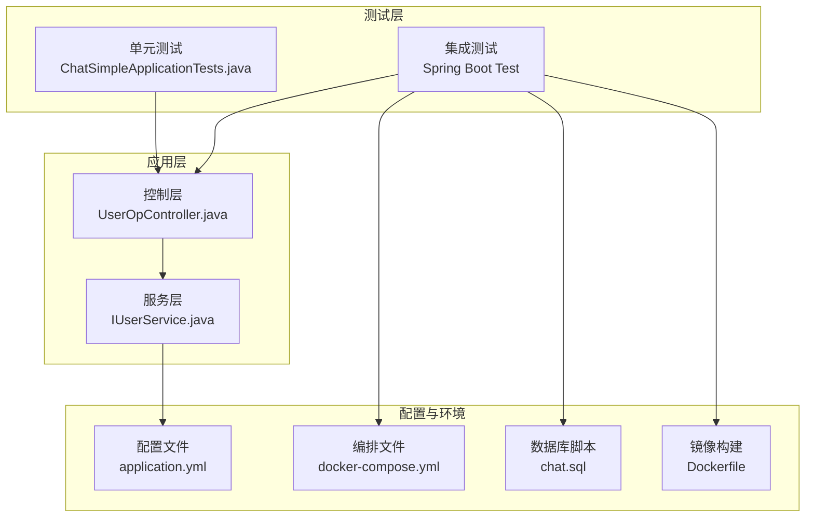
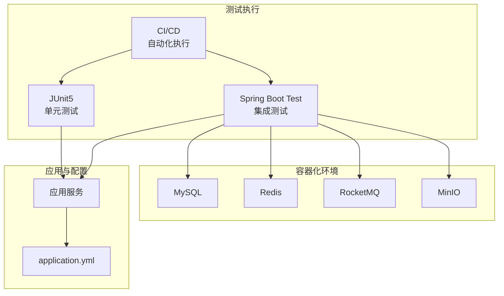
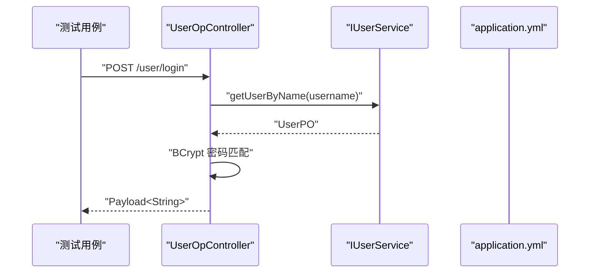
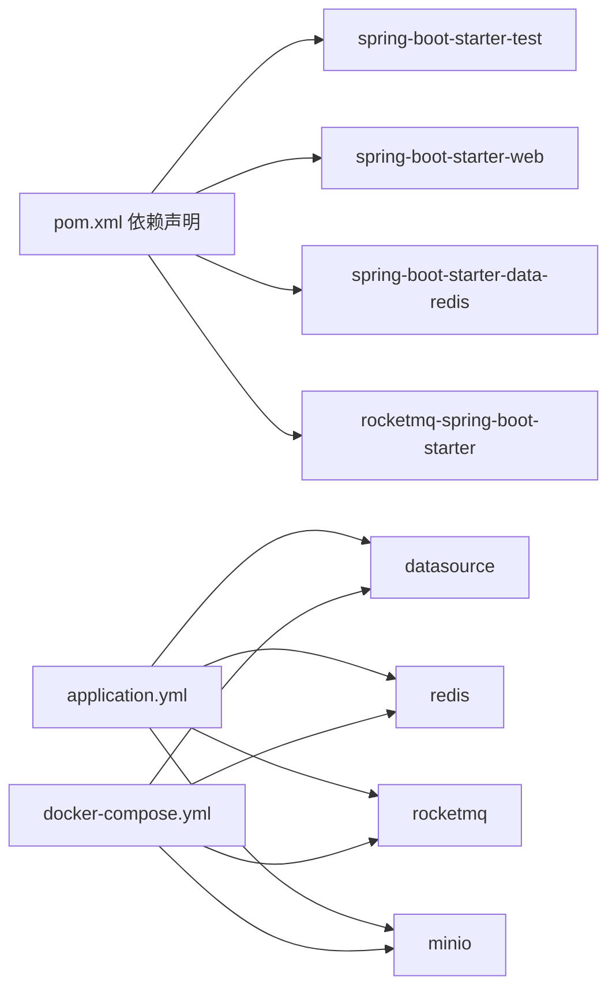

# 测试策略

<cite>
**本文引用的文件**
- [ChatSimpleApplicationTests.java](file://src/test/java/com/hch/chat_simple/ChatSimpleApplicationTests.java)
- [pom.xml](file://pom.xml)
- [application.yml](file://src/main/resources/application.yml)
- [docker-compose.yml](file://docker-compose.yml)
- [Dockerfile](file://Dockerfile)
- [chat.sql](file://db/chat.sql)
- [UserOpController.java](file://src/main/java/com/hch/chat_simple/controller/UserOpController.java)
- [IUserService.java](file://src/main/java/com/hch/chat_simple/service/IUserService.java)
- [NoAuth.java](file://src/main/java/com/hch/chat_simple/auth/NoAuth.java)
</cite>

## 目录
1. [引言](#引言)
2. [项目结构](#项目结构)
3. [核心组件](#核心组件)
4. [架构总览](#架构总览)
5. [详细组件分析](#详细组件分析)
6. [依赖分析](#依赖分析)
7. [性能考虑](#性能考虑)
8. [故障排查指南](#故障排查指南)
9. [结论](#结论)
10. [附录](#附录)

## 引言
本文件面向聊天应用的测试体系与实践，系统化梳理单元测试、集成测试、Mock 技术、覆盖率与质量保障、性能与压力测试以及测试自动化最佳实践。结合当前仓库现状，给出可落地的测试策略与实施建议，帮助团队建立稳定、高效且可持续演进的测试体系。

## 项目结构
- 测试入口与基础能力
  - 单元测试入口位于测试包根路径，采用 Spring Boot 测试注解加载上下文进行基础验证。
  - Maven 依赖中包含 Spring Boot Test 启动器，为集成测试与容器化测试提供基础。
- 配置与运行环境
  - 应用配置集中于资源目录，包含数据库、Redis、RocketMQ、MinIO 等外部依赖的连接参数。
  - Docker Compose 提供本地一键拉起数据库、缓存、消息队列与对象存储等基础设施。
  - 数据库初始化脚本定义了核心业务表结构，支撑数据库测试与回归验证。
- 控制层与服务层
  - 控制层负责接口编排与鉴权豁免标注；服务层提供业务逻辑封装，便于隔离测试与 Mock。

**图表来源**
- [ChatSimpleApplicationTests.java:1-14](file://src/test/java/com/hch/chat_simple/ChatSimpleApplicationTests.java#L1-L14)
- [UserOpController.java:1-114](file://src/main/java/com/hch/chat_simple/controller/UserOpController.java#L1-L114)
- [IUserService.java:1-28](file://src/main/java/com/hch/chat_simple/service/IUserService.java#L1-L28)
- [application.yml:1-89](file://src/main/resources/application.yml#L1-L89)
- [docker-compose.yml:1-132](file://docker-compose.yml#L1-L132)
- [chat.sql:1-130](file://db/chat.sql#L1-L130)
- [Dockerfile:1-12](file://Dockerfile#L1-L12)

**章节来源**
- [ChatSimpleApplicationTests.java:1-14](file://src/test/java/com/hch/chat_simple/ChatSimpleApplicationTests.java#L1-L14)
- [pom.xml:66-68](file://pom.xml#L66-L68)
- [application.yml:1-89](file://src/main/resources/application.yml#L1-L89)
- [docker-compose.yml:1-132](file://docker-compose.yml#L1-L132)
- [chat.sql:1-130](file://db/chat.sql#L1-L130)
- [Dockerfile:1-12](file://Dockerfile#L1-L12)

## 核心组件
- 单元测试入口
  - 基于 Spring Boot Test 注解加载应用上下文，确保基础启动流程可用性验证。
- 控制层与鉴权豁免
  - 控制层对特定接口标注鉴权豁免注解，便于在测试中绕过认证流程，聚焦业务逻辑。
- 服务层接口
  - 服务接口抽象清晰，便于在测试中以接口注入方式替换实现或进行 Mock。
- 外部依赖配置
  - 应用配置集中管理数据库、Redis、消息队列与对象存储等连接参数，便于在测试环境中按需覆盖。

**章节来源**
- [ChatSimpleApplicationTests.java:6-11](file://src/test/java/com/hch/chat_simple/ChatSimpleApplicationTests.java#L6-L11)
- [UserOpController.java:44-66](file://src/main/java/com/hch/chat_simple/controller/UserOpController.java#L44-L66)
- [NoAuth.java:1-13](file://src/main/java/com/hch/chat_simple/auth/NoAuth.java#L1-L13)
- [IUserService.java:19-27](file://src/main/java/com/hch/chat_simple/service/IUserService.java#L19-L27)
- [application.yml:16-89](file://src/main/resources/application.yml#L16-L89)

## 架构总览
测试架构围绕“单元测试 + 集成测试 + 容器化环境 + 覆盖率与报告”的闭环展开。单元测试验证最小可运行单元；集成测试在容器化环境中验证跨模块协作；容器编排提供稳定的外部依赖；覆盖率与报告贯穿开发到 CI 的全流程。

**图表来源**
- [pom.xml:66-68](file://pom.xml#L66-L68)
- [application.yml:16-89](file://src/main/resources/application.yml#L16-L89)
- [docker-compose.yml:64-127](file://docker-compose.yml#L64-L127)

## 详细组件分析

### 单元测试设计与实现
- 设计原则
  - 隔离性：通过接口注入与依赖替换，避免外部依赖影响测试稳定性。
  - 可重复性：使用固定种子或可控随机源，确保测试结果可复现。
  - 可读性：测试命名明确意图，断言清晰表达期望。
- 编写规范
  - 使用 Spring Boot Test 注解加载上下文，确保关键组件可用。
  - 对控制层与服务层分别进行测试，控制层关注请求处理与返回结构，服务层关注业务规则与边界条件。
  - 对鉴权豁免接口进行独立测试，验证无认证场景下的行为。
- 断言方法
  - 结果断言：校验返回值结构与状态码。
  - 行为断言：校验关键方法调用次数与参数（结合 Mock）。
- 测试数据准备
  - 使用内存数据库或测试专用 Schema，避免污染生产数据。
  - 对外部依赖进行 Mock 或 Stub，确保测试独立可控。

**章节来源**
- [ChatSimpleApplicationTests.java:6-11](file://src/test/java/com/hch/chat_simple/ChatSimpleApplicationTests.java#L6-L11)
- [UserOpController.java:44-66](file://src/main/java/com/hch/chat_simple/controller/UserOpController.java#L44-L66)
- [NoAuth.java:8-13](file://src/main/java/com/hch/chat_simple/auth/NoAuth.java#L8-L13)

### 集成测试实施策略
- Spring Boot 测试环境配置
  - 使用 Test 配置文件或测试属性覆盖生产配置，确保测试环境与生产隔离。
  - 在测试中启用最小化启动，仅加载必要模块，缩短启动时间。
- 数据库测试
  - 使用初始化脚本在测试前准备数据，或在测试后清理数据。
  - 对事务型测试，使用回滚策略避免副作用。
- 外部服务模拟
  - 使用容器编排拉起数据库、缓存、消息队列与对象存储，确保测试环境一致性。
  - 对第三方 HTTP 服务，使用 Mock 服务器或 Stub 实现。

**图表来源**
- [UserOpController.java:44-66](file://src/main/java/com/hch/chat_simple/controller/UserOpController.java#L44-L66)
- [IUserService.java:21](file://src/main/java/com/hch/chat_simple/service/IUserService.java#L21)
- [application.yml:16-20](file://src/main/resources/application.yml#L16-L20)

**章节来源**
- [pom.xml:66-68](file://pom.xml#L66-L68)
- [application.yml:16-20](file://src/main/resources/application.yml#L16-L20)
- [docker-compose.yml:64-127](file://docker-compose.yml#L64-L127)
- [chat.sql:5-130](file://db/chat.sql#L5-L130)

### Mock 技术与测试替身
- 使用场景
  - 外部依赖不可用或不稳定时，使用 Mock 替代。
  - 需要控制外部行为或返回值时，使用 Stub 固定响应。
- 桩对象设计
  - 以接口为中心，针对关键方法设计最小可用实现，满足测试断言需求。
- 测试替身
  - 使用容器化外部依赖替代网络级 Mock，提升测试真实性与稳定性。

**章节来源**
- [IUserService.java:19-27](file://src/main/java/com/hch/chat_simple/service/IUserService.java#L19-L27)
- [docker-compose.yml:64-127](file://docker-compose.yml#L64-L127)

### 测试覆盖率与质量保证
- 覆盖率统计
  - 在 CI 中集成覆盖率工具，按模块统计行覆盖率、分支覆盖率与方法覆盖率。
- 测试报告生成
  - 生成 HTML/JSON 报告，支持在 CI 中归档与对比历史趋势。
- 持续集成中的测试执行
  - 将测试阶段纳入流水线，失败即阻断，确保问题早发现。
- 质量门禁
  - 设定最低覆盖率阈值与失败用例上限，作为合并要求。

[本节为通用指导，无需具体文件引用]

### 性能测试与压力测试
- 场景设计
  - 登录、消息收发、好友关系变更等核心链路作为压测目标。
- 工具选择
  - 使用分布式压测工具模拟高并发场景，结合容器化环境快速扩缩容。
- 指标监控
  - 关注 P99 延迟、吞吐量、错误率与外部依赖响应时间。
- 结果分析
  - 识别瓶颈（数据库、缓存、消息队列、对象存储），针对性优化。

[本节为通用指导，无需具体文件引用]

### 测试自动化最佳实践
- 分层测试
  - 单元测试为主，集成测试为辅，端到端测试用于关键路径验证。
- 数据与环境
  - 使用容器化环境与测试专用数据库，避免数据竞争。
- 可观测性
  - 在测试中输出关键指标与日志，便于定位问题。
- 回归与快照
  - 对重要接口建立快照测试，防止回归。

[本节为通用指导，无需具体文件引用]

## 依赖分析
- 测试依赖
  - Spring Boot Test 启动器为集成测试提供基础能力。
- 外部依赖
  - 数据库、Redis、消息队列与对象存储通过配置文件与编排文件统一管理，便于在测试中按需切换或替换。

**图表来源**
- [pom.xml:54-125](file://pom.xml#L54-L125)
- [application.yml:16-89](file://src/main/resources/application.yml#L16-L89)
- [docker-compose.yml:64-127](file://docker-compose.yml#L64-L127)

**章节来源**
- [pom.xml:54-125](file://pom.xml#L54-L125)
- [application.yml:16-89](file://src/main/resources/application.yml#L16-L89)
- [docker-compose.yml:64-127](file://docker-compose.yml#L64-L127)

## 性能考虑
- 启动与资源
  - 在测试中按需加载模块，减少启动时间与内存占用。
- 并发与隔离
  - 使用独立数据库与缓存实例，避免测试间相互干扰。
- 外部依赖
  - 对高延迟依赖进行降级或超时配置，避免测试抖动。

[本节为通用指导，无需具体文件引用]

## 故障排查指南
- 启动失败
  - 检查配置文件中的连接参数与容器编排是否一致。
  - 确认数据库初始化脚本已正确执行。
- 认证相关
  - 对鉴权豁免接口进行单独验证，确认注解生效。
- 外部依赖
  - 使用容器编排快速恢复数据库、缓存、消息队列与对象存储。

**章节来源**
- [application.yml:16-89](file://src/main/resources/application.yml#L16-L89)
- [docker-compose.yml:64-127](file://docker-compose.yml#L64-L127)
- [NoAuth.java:8-13](file://src/main/java/com/hch/chat_simple/auth/NoAuth.java#L8-L13)

## 结论
当前项目具备基础的测试入口与外部依赖编排能力。建议优先完善单元测试与服务层 Mock，随后扩展集成测试覆盖关键业务链路，并在 CI 中引入覆盖率与报告机制。通过容器化环境与规范化流程，逐步形成稳定高效的测试体系。

[本节为总结性内容，无需具体文件引用]

## 附录
- 快速检查清单
  - 是否存在基础上下文加载测试？
  - 是否对关键接口（如登录）进行鉴权豁免测试？
  - 是否使用容器化环境进行集成测试？
  - 是否在 CI 中开启覆盖率统计与报告？

[本节为通用指导，无需具体文件引用]