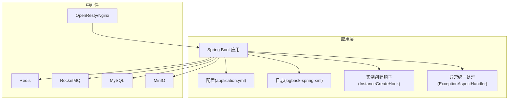
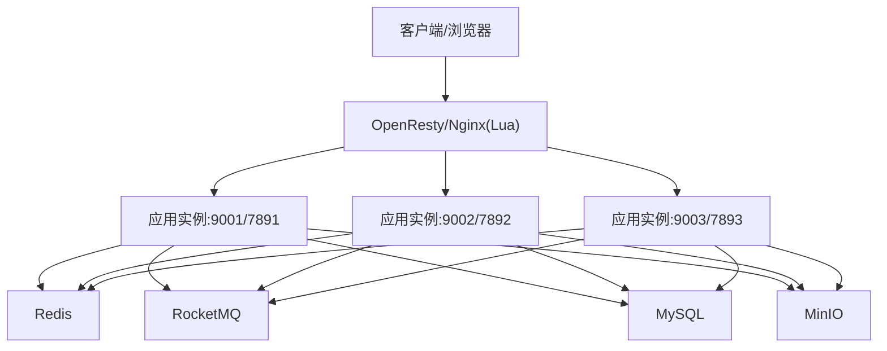
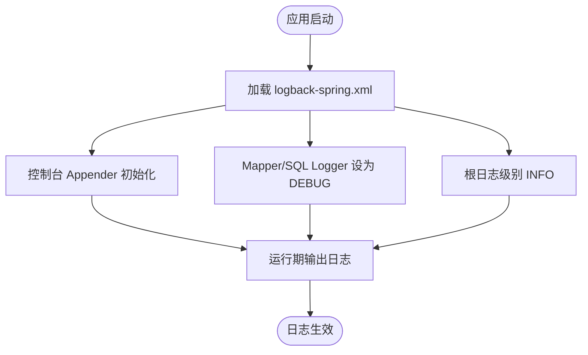
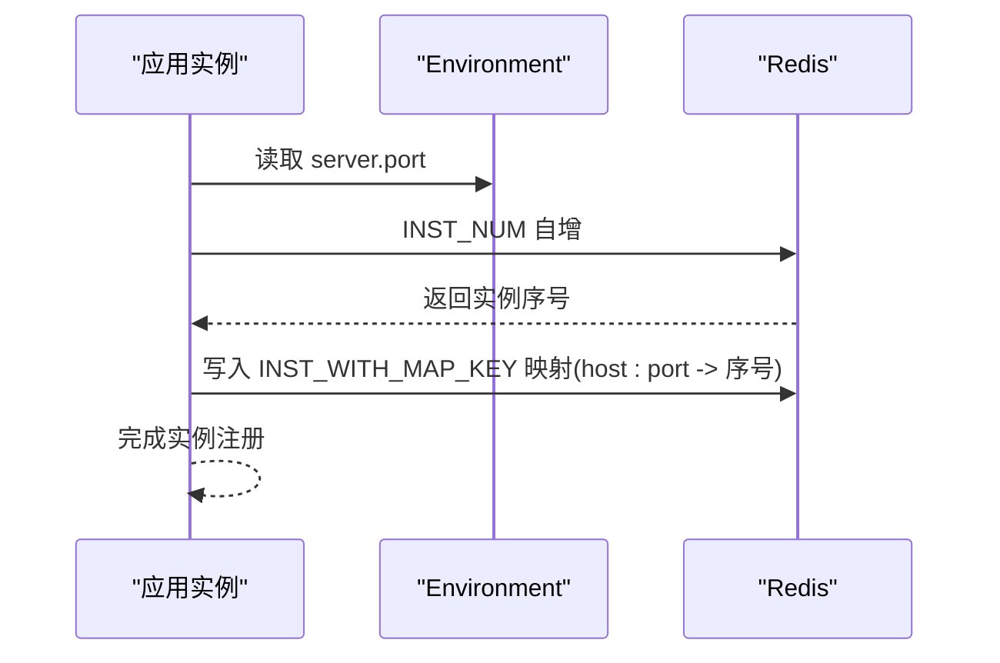
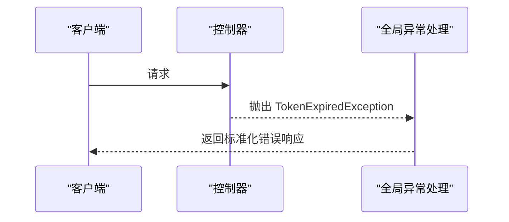
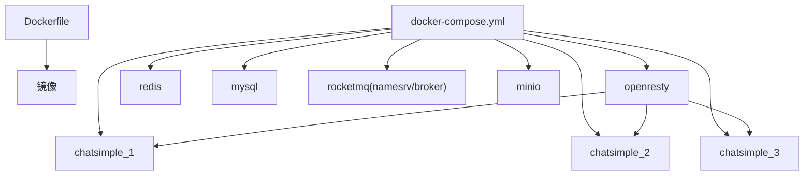
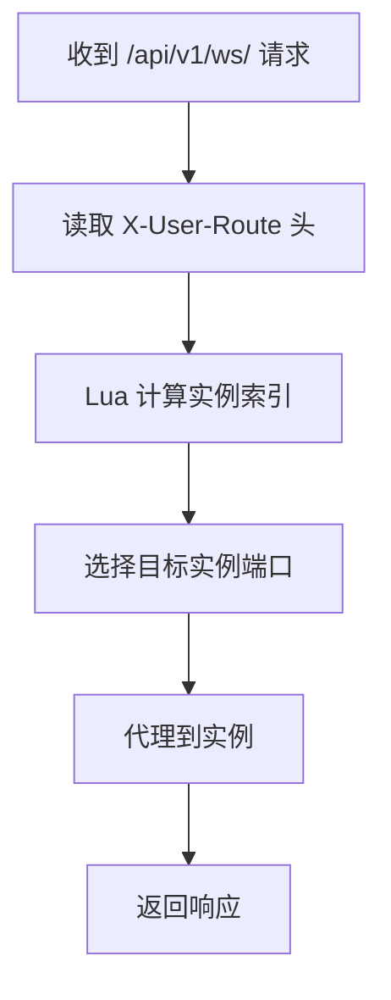
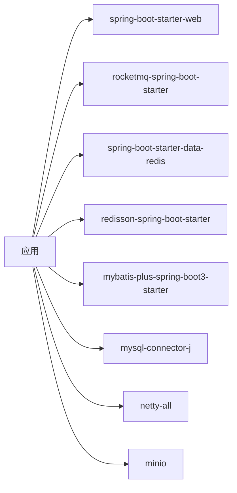

# 监控与运维

<cite>
**本文引用的文件**
- [logback-spring.xml](file://src/main/resources/logback-spring.xml)
- [application.yml](file://src/main/resources/application.yml)
- [InstanceCreateHook.java](file://src/main/java/com/hch/chat_simple/config/InstanceCreateHook.java)
- [RedisUtil.java](file://src/main/java/com/hch/chat_simple/util/RedisUtil.java)
- [Constant.java](file://src/main/java/com/hch/chat_simple/util/Constant.java)
- [ExceptionAspectHandler.java](file://src/main/java/com/hch/chat_simple/config/ExceptionAspectHandler.java)
- [Dockerfile](file://Dockerfile)
- [docker-compose.yml](file://docker-compose.yml)
- [nginx.conf](file://openresty_nginx_conf/nginx.conf)
- [ChatSimpleApplicationTests.java](file://src/test/java/com/hch/chat_simple/ChatSimpleApplicationTests.java)
- [pom.xml](file://pom.xml)
- [chat.sql](file://db/chat.sql)
</cite>

## 目录
1. [简介](#简介)
2. [项目结构](#项目结构)
3. [核心组件](#核心组件)
4. [架构总览](#架构总览)
5. [详细组件分析](#详细组件分析)
6. [依赖分析](#依赖分析)
7. [性能考量](#性能考量)
8. [故障排查指南](#故障排查指南)
9. [结论](#结论)
10. [附录](#附录)

## 简介
本文件面向监控与运维场景，围绕聊天应用的监控体系与运维实践展开，重点覆盖以下方面：
- Logback 日志配置：日志级别、输出格式、SQL 日志可见性与根日志策略
- 实例创建钩子：应用启动监听、实例注册、多实例路由基础
- 单元测试：测试用例现状、可扩展方向与覆盖率建议
- 关键指标：性能、业务、错误率监控建议
- 故障排查：日志分析、性能分析、内存分析方法
- 部署运维：容器化、负载均衡、自动扩缩容与 CI/CD 集成

## 项目结构
项目采用 Spring Boot 标准目录组织，核心与运维相关的关键位置如下：
- 配置与日志：src/main/resources 下的 application.yml 与 logback-spring.xml
- 运维钩子：src/main/java/com/hch/chat_simple/config/InstanceCreateHook.java
- 工具与常量：src/main/java/com/hch/chat_simple/util/RedisUtil.java、Constant.java
- 异常统一处理：src/main/java/com/hch/chat_simple/config/ExceptionAspectHandler.java
- 容器化与编排：Dockerfile、docker-compose.yml
- 负载均衡与反向代理：openresty_nginx_conf/nginx.conf
- 测试：src/test/java/com/hch/chat_simple/ChatSimpleApplicationTests.java
- 数据库初始化：db/chat.sql
- 构建与依赖：pom.xml

**图表来源**
- [application.yml:1-89](file://src/main/resources/application.yml#L1-L89)
- [logback-spring.xml:1-24](file://src/main/resources/logback-spring.xml#L1-L24)
- [InstanceCreateHook.java:1-72](file://src/main/java/com/hch/chat_simple/config/InstanceCreateHook.java#L1-L72)
- [ExceptionAspectHandler.java:1-24](file://src/main/java/com/hch/chat_simple/config/ExceptionAspectHandler.java#L1-L24)
- [nginx.conf:1-153](file://openresty_nginx_conf/nginx.conf#L1-L153)

**章节来源**
- [application.yml:1-89](file://src/main/resources/application.yml#L1-L89)
- [logback-spring.xml:1-24](file://src/main/resources/logback-spring.xml#L1-L24)
- [Dockerfile:1-12](file://Dockerfile#L1-L12)
- [docker-compose.yml:1-132](file://docker-compose.yml#L1-L132)
- [nginx.conf:1-153](file://openresty_nginx_conf/nginx.conf#L1-L153)

## 核心组件
- 日志系统：基于 Logback 的控制台输出，开启 MyBatis Mapper 与 JDBC SQL 的 DEBUG 日志，根日志级别为 INFO
- 实例注册：应用启动后通过 Redis 记录实例数量与映射，为多实例路由提供基础
- 统一异常处理：对特定异常进行捕获与返回，便于前端感知与重试
- 容器化与编排：Dockerfile 固定入口参数；docker-compose 编排多实例与中间件
- 负载均衡：OpenResty 侧通过 Lua 将用户路由到对应实例端口

**章节来源**
- [logback-spring.xml:1-24](file://src/main/resources/logback-spring.xml#L1-L24)
- [InstanceCreateHook.java:1-72](file://src/main/java/com/hch/chat_simple/config/InstanceCreateHook.java#L1-L72)
- [RedisUtil.java:1-123](file://src/main/java/com/hch/chat_simple/util/RedisUtil.java#L1-L123)
- [Constant.java:1-33](file://src/main/java/com/hch/chat_simple/util/Constant.java#L1-L33)
- [ExceptionAspectHandler.java:1-24](file://src/main/java/com/hch/chat_simple/config/ExceptionAspectHandler.java#L1-L24)
- [Dockerfile:1-12](file://Dockerfile#L1-L12)
- [docker-compose.yml:1-132](file://docker-compose.yml#L1-L132)
- [nginx.conf:1-153](file://openresty_nginx_conf/nginx.conf#L1-L153)

## 架构总览
应用采用“应用服务 + 中间件 + 反向代理”的三层架构。应用通过 Redis 记录实例映射，OpenResty 基于用户路由头将请求分发至具体实例端口，实现多实例横向扩展。

**图表来源**
- [docker-compose.yml:13-63](file://docker-compose.yml#L13-L63)
- [nginx.conf:58-78](file://openresty_nginx_conf/nginx.conf#L58-L78)
- [application.yml:3-89](file://src/main/resources/application.yml#L3-L89)

## 详细组件分析

### 日志配置（Logback）
- 输出目标：控制台 Appender，编码器包含时间、级别、Logger 名称与消息
- SQL 日志：MyBatis Mapper 包与 java.sql 均设置为 DEBUG，便于开发调试
- 根日志级别：INFO，避免生产环境冗余日志
- 建议增强：生产环境可引入 RollingFile 或 JSON 输出，结合日志收集系统集中管理

**图表来源**
- [logback-spring.xml:1-24](file://src/main/resources/logback-spring.xml#L1-L24)

**章节来源**
- [logback-spring.xml:1-24](file://src/main/resources/logback-spring.xml#L1-L24)

### 实例创建钩子（InstanceCreateHook）
- 角色：应用启动后写入 Redis，维护实例数量与实例到序号的映射
- 作用：为多实例路由提供依据，结合 OpenResty 的 Lua 路由逻辑，将用户请求定向到对应实例
- 注意：当前钩子未启用为 @Configuration，如需生效请移除注释或调整自动配置顺序

**图表来源**
- [InstanceCreateHook.java:56-70](file://src/main/java/com/hch/chat_simple/config/InstanceCreateHook.java#L56-L70)
- [RedisUtil.java:57-89](file://src/main/java/com/hch/chat_simple/util/RedisUtil.java#L57-L89)
- [Constant.java:27-31](file://src/main/java/com/hch/chat_simple/util/Constant.java#L27-L31)

**章节来源**
- [InstanceCreateHook.java:1-72](file://src/main/java/com/hch/chat_simple/config/InstanceCreateHook.java#L1-L72)
- [RedisUtil.java:1-123](file://src/main/java/com/hch/chat_simple/util/RedisUtil.java#L1-L123)
- [Constant.java:1-33](file://src/main/java/com/hch/chat_simple/util/Constant.java#L1-L33)

### 统一异常处理（ExceptionAspectHandler）
- 目标：拦截特定异常（如 Token 过期）并返回标准化响应
- 影响：提升用户体验与可观测性，便于前端统一处理

**图表来源**
- [ExceptionAspectHandler.java:16-20](file://src/main/java/com/hch/chat_simple/config/ExceptionAspectHandler.java#L16-L20)

**章节来源**
- [ExceptionAspectHandler.java:1-24](file://src/main/java/com/hch/chat_simple/config/ExceptionAspectHandler.java#L1-L24)

### 容器化与编排（Dockerfile/docker-compose）
- Dockerfile：固定时区与入口参数，打包为单 JAR
- docker-compose：编排应用实例与中间件，支持多实例与健康检查
- 建议：为应用实例添加健康探针，结合编排平台实现自动扩缩容

**图表来源**
- [Dockerfile:1-12](file://Dockerfile#L1-L12)
- [docker-compose.yml:1-132](file://docker-compose.yml#L1-L132)

**章节来源**
- [Dockerfile:1-12](file://Dockerfile#L1-L12)
- [docker-compose.yml:1-132](file://docker-compose.yml#L1-L132)

### 负载均衡与路由（OpenResty/Nginx）
- 通过 Lua 计算用户路由头，将请求转发到对应实例端口
- 支持 WebSocket 升级与长连接透传

**图表来源**
- [nginx.conf:58-78](file://openresty_nginx_conf/nginx.conf#L58-L78)

**章节来源**
- [nginx.conf:1-153](file://openresty_nginx_conf/nginx.conf#L1-L153)

### 单元测试现状与建议
- 当前测试：存在空的 SpringBootTest 示例，尚未包含具体断言
- 建议：
  - 引入测试框架与 Mock（如 Mockito/JUnit 5），针对控制器、服务与工具类编写用例
  - 使用 @WebMvcTest 或 @DataJpaTest 等专用测试切片
  - 结合覆盖率工具统计覆盖率，并设定阈值

**章节来源**
- [ChatSimpleApplicationTests.java:1-14](file://src/test/java/com/hch/chat_simple/ChatSimpleApplicationTests.java#L1-L14)
- [pom.xml:65-68](file://pom.xml#L65-L68)

### 数据库与初始化
- 提供初始化脚本，包含用户、好友关系、聊天记录、群组、成员等核心表
- 建议：在 CI/CD 中通过 flyway 或 Liquibase 管理迁移

**章节来源**
- [chat.sql:1-130](file://db/chat.sql#L1-L130)

## 依赖分析
- Spring Boot Web：提供 Web MVC 与嵌入式服务器
- RocketMQ：异步消息与解耦
- Redis/Redisson：缓存与分布式能力
- MySQL：持久化存储
- Netty：WebSocket 通信
- MinIO：对象存储

**图表来源**
- [pom.xml:54-315](file://pom.xml#L54-L315)

**章节来源**
- [pom.xml:1-346](file://pom.xml#L1-L346)

## 性能考量
- 日志级别：生产环境建议提升根日志级别或使用异步 Appender 降低 IO 压力
- SQL 调优：结合 MyBatis Plus 与 PageHelper，合理分页与索引设计
- 缓存策略：利用 Redis 缓存热点数据，减少数据库压力
- 并发与连接池：合理配置 Redis 连接池、数据库连接池与线程池
- GC 与内存：结合 JVM 参数与内存分析工具定位内存泄漏与 GC 抖动

## 故障排查指南
- 日志分析
  - 开启 SQL 日志辅助定位慢查询与异常
  - 使用统一异常处理返回码快速识别 Token 过期等场景
- 性能分析
  - 使用 JVM 分析工具（如 JDK Flight Recorder、Async Profiler）采集 CPU/锁等待
  - 结合 Nginx/OpenResty 访问日志与上游响应时间定位瓶颈
- 内存分析
  - 通过堆转储与对象存活分析定位内存占用与泄漏
- 健康检查
  - 利用 docker-compose 的健康检查与外部探针（如 Prometheus）实现自动故障转移

**章节来源**
- [logback-spring.xml:12-18](file://src/main/resources/logback-spring.xml#L12-L18)
- [ExceptionAspectHandler.java:16-20](file://src/main/java/com/hch/chat_simple/config/ExceptionAspectHandler.java#L16-L20)
- [docker-compose.yml:110-115](file://docker-compose.yml#L110-L115)

## 结论
本项目已具备基础的日志、异常处理、容器化与多实例编排能力。建议在生产环境中进一步完善日志输出策略、引入统一指标与告警、补充单元测试与覆盖率、强化健康检查与自动扩缩容机制，并将监控与 CI/CD 流水线打通，形成闭环的运维体系。

## 附录
- 关键指标建议
  - 性能指标：请求延迟、吞吐量、并发连接数、GC 时间与频率
  - 业务指标：在线用户数、消息发送成功率、群组活跃度
  - 错误率监控：HTTP 错误、RocketMQ 发送失败、MinIO 操作失败
- CI/CD 集成
  - 构建：Maven 打包与 Docker 镜像构建
  - 测试：单元测试与覆盖率报告
  - 部署：Kubernetes/Compose 编排，配合探针与扩缩容策略