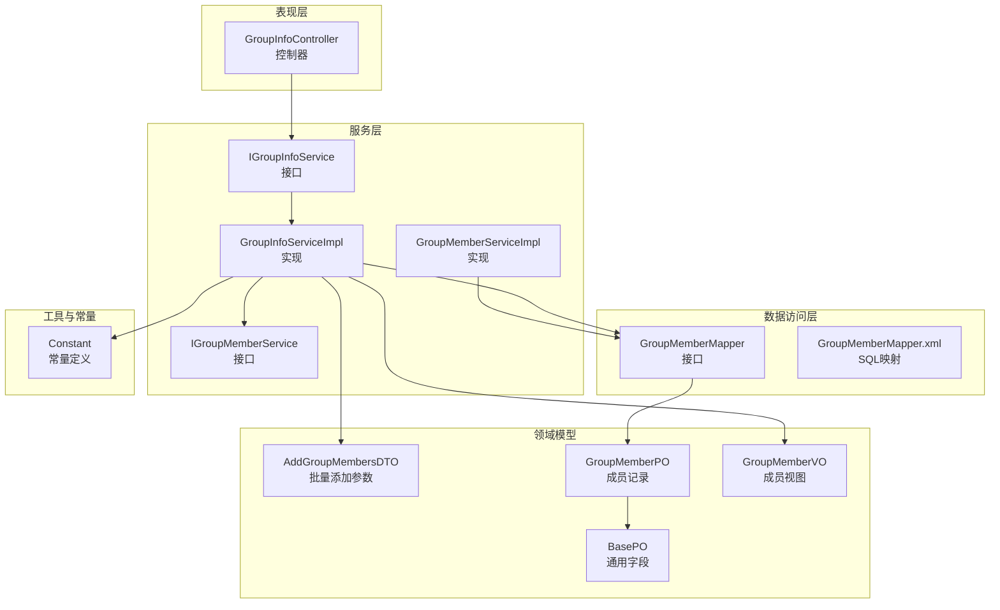
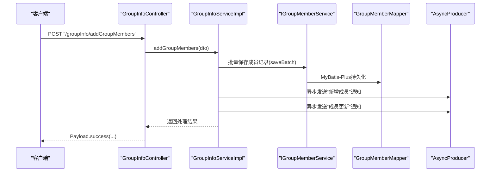
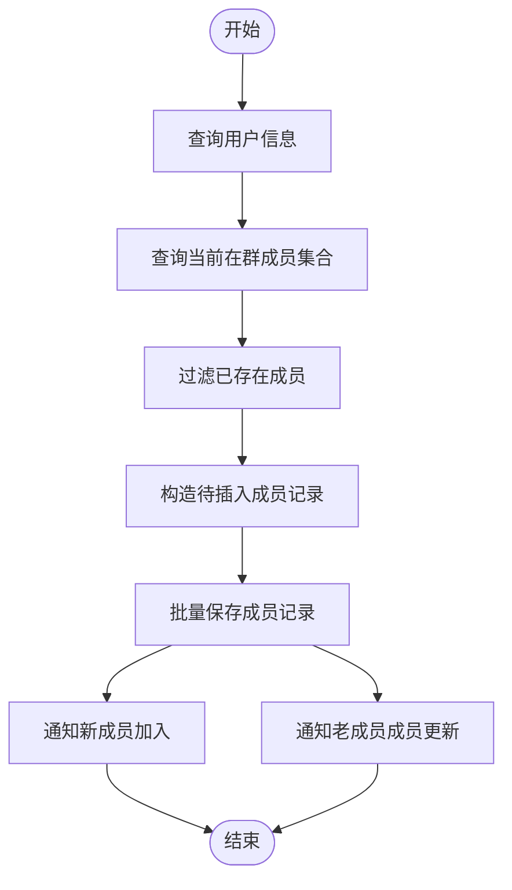
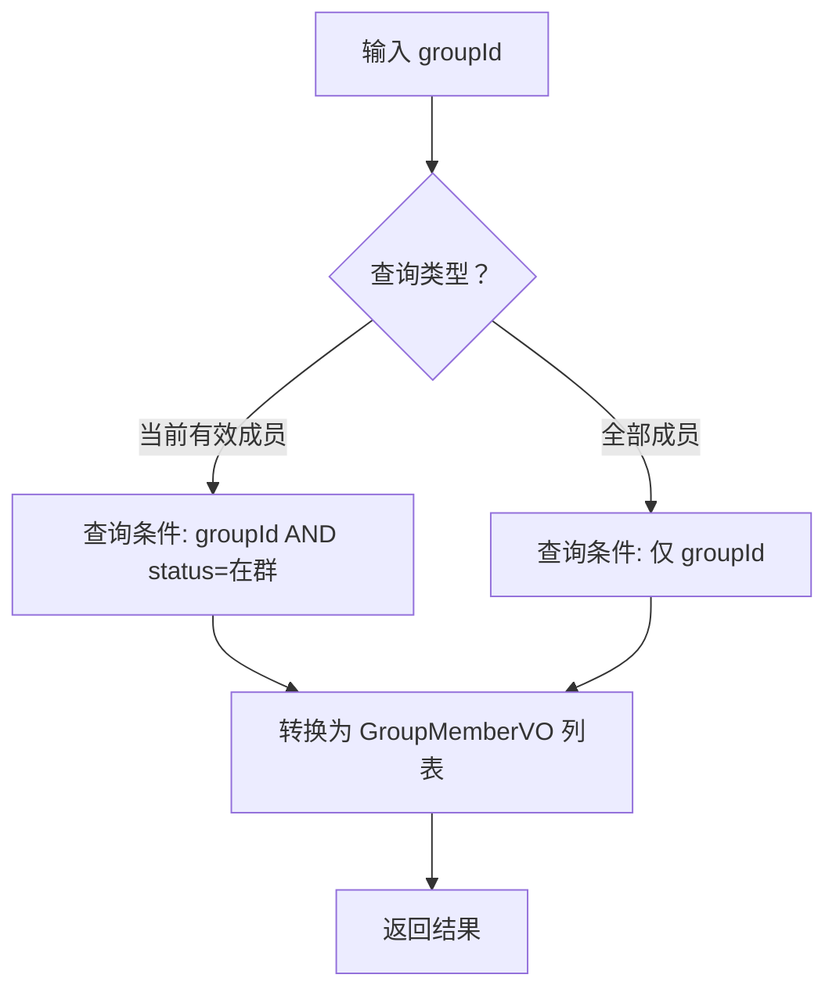
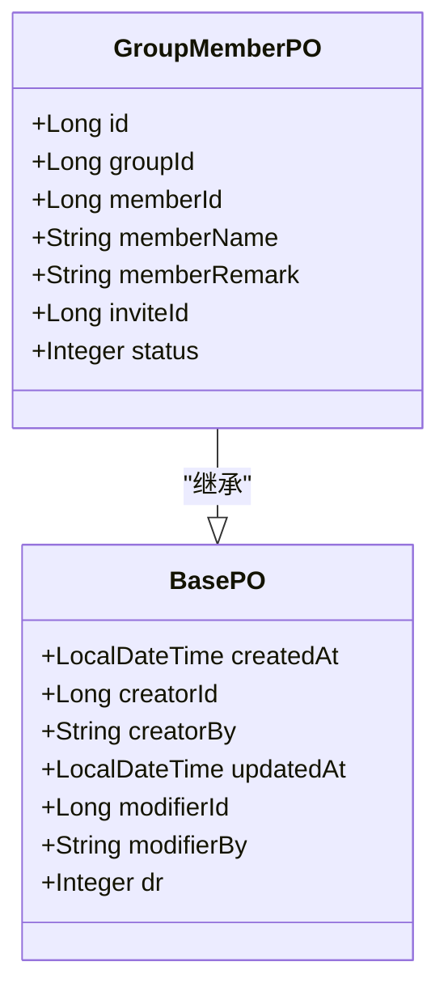
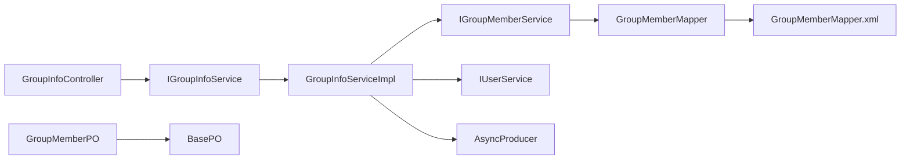

# 群成员管理

<cite>
**本文引用的文件**
- [GroupInfoController.java](file://src/main/java/com/hch/chat_simple/controller/GroupInfoController.java)
- [IGroupInfoService.java](file://src/main/java/com/hch/chat_simple/service/IGroupInfoService.java)
- [GroupInfoServiceImpl.java](file://src/main/java/com/hch/chat_simple/service/impl/GroupInfoServiceImpl.java)
- [IGroupMemberService.java](file://src/main/java/com/hch/chat_simple/service/IGroupMemberService.java)
- [GroupMemberServiceImpl.java](file://src/main/java/com/hch/chat_simple/service/impl/GroupMemberServiceImpl.java)
- [GroupMemberMapper.java](file://src/main/java/com/hch/chat_simple/mapper/GroupMemberMapper.java)
- [GroupMemberMapper.xml](file://src/main/resources/mapper/GroupMemberMapper.xml)
- [GroupMemberPO.java](file://src/main/java/com/hch/chat_simple/pojo/po/GroupMemberPO.java)
- [GroupMemberVO.java](file://src/main/java/com/hch/chat_simple/pojo/vo/GroupMemberVO.java)
- [AddGroupMembersDTO.java](file://src/main/java/com/hch/chat_simple/pojo/dto/AddGroupMembersDTO.java)
- [Constant.java](file://src/main/java/com/hch/chat_simple/util/Constant.java)
- [BasePO.java](file://src/main/java/com/hch/chat_simple/pojo/po/BasePO.java)
</cite>

## 目录
1. [简介](#简介)
2. [项目结构](#项目结构)
3. [核心组件](#核心组件)
4. [架构总览](#架构总览)
5. [详细组件分析](#详细组件分析)
6. [依赖分析](#依赖分析)
7. [性能考虑](#性能考虑)
8. [故障排查指南](#故障排查指南)
9. [结论](#结论)
10. [附录](#附录)

## 简介
本文件围绕群成员管理功能展开，系统性梳理“添加群成员”与“查询群成员”的完整链路，涵盖接口实现、参数校验、实体模型、状态与权限设计、批量操作支持以及并发与一致性保障机制。读者可据此快速理解并扩展该模块。

## 项目结构
群成员管理相关代码采用典型的分层架构组织：
- 控制器层：对外暴露HTTP接口，负责请求接收与响应封装
- 服务层：编排业务逻辑，协调持久化与消息通知
- 数据访问层：MyBatis-Plus映射数据库表
- 领域模型：PO（持久化对象）、VO（视图对象）、DTO（传输对象）
- 工具与常量：统一的状态码、常量定义与上下文工具

图表来源
- [GroupInfoController.java:1-68](file://src/main/java/com/hch/chat_simple/controller/GroupInfoController.java#L1-L68)
- [IGroupInfoService.java:1-31](file://src/main/java/com/hch/chat_simple/service/IGroupInfoService.java#L1-L31)
- [GroupInfoServiceImpl.java:1-143](file://src/main/java/com/hch/chat_simple/service/impl/GroupInfoServiceImpl.java#L1-L143)
- [IGroupMemberService.java:1-21](file://src/main/java/com/hch/chat_simple/service/IGroupMemberService.java#L1-L21)
- [GroupMemberServiceImpl.java:1-21](file://src/main/java/com/hch/chat_simple/service/impl/GroupMemberServiceImpl.java#L1-L21)
- [GroupMemberMapper.java:1-21](file://src/main/java/com/hch/chat_simple/mapper/GroupMemberMapper.java#L1-L21)
- [GroupMemberMapper.xml:1-6](file://src/main/resources/mapper/GroupMemberMapper.xml#L1-L6)
- [GroupMemberPO.java:1-49](file://src/main/java/com/hch/chat_simple/pojo/po/GroupMemberPO.java#L1-L49)
- [GroupMemberVO.java:1-39](file://src/main/java/com/hch/chat_simple/pojo/vo/GroupMemberVO.java#L1-L39)
- [AddGroupMembersDTO.java:1-16](file://src/main/java/com/hch/chat_simple/pojo/dto/AddGroupMembersDTO.java#L1-L16)
- [Constant.java:1-33](file://src/main/java/com/hch/chat_simple/util/Constant.java#L1-L33)
- [BasePO.java:1-44](file://src/main/java/com/hch/chat_simple/pojo/po/BasePO.java#L1-L44)

章节来源
- [GroupInfoController.java:1-68](file://src/main/java/com/hch/chat_simple/controller/GroupInfoController.java#L1-L68)
- [IGroupInfoService.java:1-31](file://src/main/java/com/hch/chat_simple/service/IGroupInfoService.java#L1-L31)
- [GroupInfoServiceImpl.java:1-143](file://src/main/java/com/hch/chat_simple/service/impl/GroupInfoServiceImpl.java#L1-L143)
- [IGroupMemberService.java:1-21](file://src/main/java/com/hch/chat_simple/service/IGroupMemberService.java#L1-L21)
- [GroupMemberServiceImpl.java:1-21](file://src/main/java/com/hch/chat_simple/service/impl/GroupMemberServiceImpl.java#L1-L21)
- [GroupMemberMapper.java:1-21](file://src/main/java/com/hch/chat_simple/mapper/GroupMemberMapper.java#L1-L21)
- [GroupMemberMapper.xml:1-6](file://src/main/resources/mapper/GroupMemberMapper.xml#L1-L6)
- [GroupMemberPO.java:1-49](file://src/main/java/com/hch/chat_simple/pojo/po/GroupMemberPO.java#L1-L49)
- [GroupMemberVO.java:1-39](file://src/main/java/com/hch/chat_simple/pojo/vo/GroupMemberVO.java#L1-L39)
- [AddGroupMembersDTO.java:1-16](file://src/main/java/com/hch/chat_simple/pojo/dto/AddGroupMembersDTO.java#L1-L16)
- [Constant.java:1-33](file://src/main/java/com/hch/chat_simple/util/Constant.java#L1-L33)
- [BasePO.java:1-44](file://src/main/java/com/hch/chat_simple/pojo/po/BasePO.java#L1-L44)

## 核心组件
- 控制器：提供“添加群成员”“查询当前有效成员”“查询全部成员（含离开）”三个接口，分别对应批量添加、按状态查询与全量查询。
- 服务接口与实现：IGroupInfoService定义业务契约；GroupInfoServiceImpl实现群组与成员的组合业务，包括成员批量添加、成员列表查询。
- 数据访问：GroupMemberMapper基于MyBatis-Plus，GroupMemberMapper.xml为空配置，实际查询由Wrapper条件构造。
- 参数与模型：AddGroupMembersDTO承载批量添加参数；GroupMemberPO为持久化模型；GroupMemberVO为对外视图；BasePO提供通用审计字段与逻辑删除。
- 常量：Constant集中定义成员状态常量（在群/离开），用于查询过滤。

章节来源
- [GroupInfoController.java:46-66](file://src/main/java/com/hch/chat_simple/controller/GroupInfoController.java#L46-L66)
- [IGroupInfoService.java:21-30](file://src/main/java/com/hch/chat_simple/service/IGroupInfoService.java#L21-L30)
- [GroupInfoServiceImpl.java:82-99](file://src/main/java/com/hch/chat_simple/service/impl/GroupInfoServiceImpl.java#L82-L99)
- [GroupMemberMapper.java:17-18](file://src/main/java/com/hch/chat_simple/mapper/GroupMemberMapper.java#L17-L18)
- [GroupMemberMapper.xml:1-6](file://src/main/resources/mapper/GroupMemberMapper.xml#L1-L6)
- [AddGroupMembersDTO.java:10-15](file://src/main/java/com/hch/chat_simple/pojo/dto/AddGroupMembersDTO.java#L10-L15)
- [GroupMemberPO.java:23-48](file://src/main/java/com/hch/chat_simple/pojo/po/GroupMemberPO.java#L23-L48)
- [GroupMemberVO.java:18-39](file://src/main/java/com/hch/chat_simple/pojo/vo/GroupMemberVO.java#L18-L39)
- [BasePO.java:14-43](file://src/main/java/com/hch/chat_simple/pojo/po/BasePO.java#L14-L43)
- [Constant.java:23-25](file://src/main/java/com/hch/chat_simple/util/Constant.java#L23-L25)

## 架构总览
下图展示从HTTP请求到数据库写入与消息通知的整体流程：

图表来源
- [GroupInfoController.java:54-59](file://src/main/java/com/hch/chat_simple/controller/GroupInfoController.java#L54-L59)
- [GroupInfoServiceImpl.java:101-141](file://src/main/java/com/hch/chat_simple/service/impl/GroupInfoServiceImpl.java#L101-L141)
- [IGroupMemberService.java:18-18](file://src/main/java/com/hch/chat_simple/service/IGroupMemberService.java#L18-L18)
- [GroupMemberMapper.java:17-18](file://src/main/java/com/hch/chat_simple/mapper/GroupMemberMapper.java#L17-L18)

## 详细组件分析

### 组件一：添加群成员（addGroupMembers）
- 接口职责：接收批量用户ID与目标群组ID，去重后批量创建成员记录，并向新成员与老成员异步推送消息。
- 关键流程：
  - 校验与准备：通过用户ID集合查询用户信息，构建用户ID到用户的映射。
  - 去重与过滤：先查询当前“在群”成员集合，提取memberId集合，过滤掉已存在成员。
  - 构造插入：为每个待添加成员设置群组ID、成员信息、邀请人等字段。
  - 批量写入：使用saveBatch一次性持久化。
  - 通知广播：对新成员发送“加入群组”通知，对老成员发送“成员更新”通知。
- 并发与一致性：
  - 使用事务包裹成员添加与通知发送，确保数据库写入与消息发送的原子性。
  - 基于“在群”成员集合进行去重，避免重复添加导致的数据不一致。

图表来源
- [GroupInfoServiceImpl.java:101-141](file://src/main/java/com/hch/chat_simple/service/impl/GroupInfoServiceImpl.java#L101-L141)
- [IGroupMemberService.java:18-18](file://src/main/java/com/hch/chat_simple/service/IGroupMemberService.java#L18-L18)

章节来源
- [GroupInfoController.java:54-59](file://src/main/java/com/hch/chat_simple/controller/GroupInfoController.java#L54-L59)
- [GroupInfoServiceImpl.java:101-141](file://src/main/java/com/hch/chat_simple/service/impl/GroupInfoServiceImpl.java#L101-L141)
- [AddGroupMembersDTO.java:10-15](file://src/main/java/com/hch/chat_simple/pojo/dto/AddGroupMembersDTO.java#L10-L15)

### 组件二：查询群成员（findGroupMemberById vs findAllGroupMemberById）
- findGroupMemberById：仅返回“在群”成员，用于实时成员交互场景。
- findAllGroupMemberById：返回该群所有成员，包含“离开”成员，用于聊天记录展示与历史回溯。
- 实现要点：
  - 两者均通过GroupMemberMapper查询指定groupId的成员。
  - 区别在于前者附加了“status=在群”的过滤条件，后者不做状态过滤。
  - 查询结果统一转换为GroupMemberVO返回。

图表来源
- [GroupInfoServiceImpl.java:82-99](file://src/main/java/com/hch/chat_simple/service/impl/GroupInfoServiceImpl.java#L82-L99)
- [Constant.java:23-25](file://src/main/java/com/hch/chat_simple/util/Constant.java#L23-L25)

章节来源
- [GroupInfoController.java:46-66](file://src/main/java/com/hch/chat_simple/controller/GroupInfoController.java#L46-L66)
- [GroupInfoServiceImpl.java:82-99](file://src/main/java/com/hch/chat_simple/service/impl/GroupInfoServiceImpl.java#L82-L99)
- [Constant.java:23-25](file://src/main/java/com/hch/chat_simple/util/Constant.java#L23-L25)

### 组件三：GroupMemberPO 实体模型设计
- 字段说明（摘自模型注释与字段名）：
  - id：主键
  - groupId：群组ID
  - memberId：成员用户ID
  - memberName：成员显示名称
  - memberRemark：成员群内备注
  - inviteId：邀请人ID
  - status：成员在群组中的状态（在群/离开）
  - createdAt、creatorId、creatorBy、updatedAt、modifierId、modifierBy、dr：继承自BasePO的通用审计字段与逻辑删除
- 设计特点：
  - 以“在群/离开”状态区分成员有效性，便于查询与权限判断。
  - 继承BasePO，统一审计与软删除策略，降低重复代码。

图表来源
- [GroupMemberPO.java:23-48](file://src/main/java/com/hch/chat_simple/pojo/po/GroupMemberPO.java#L23-L48)
- [BasePO.java:14-43](file://src/main/java/com/hch/chat_simple/pojo/po/BasePO.java#L14-L43)

章节来源
- [GroupMemberPO.java:23-48](file://src/main/java/com/hch/chat_simple/pojo/po/GroupMemberPO.java#L23-L48)
- [BasePO.java:14-43](file://src/main/java/com/hch/chat_simple/pojo/po/BasePO.java#L14-L43)

### 组件四：成员角色与权限体系
- 当前代码未定义“群主/管理员/普通成员”的角色字段与权限判定逻辑。
- 建议扩展方向（概念性建议，非现有实现）：
  - 新增角色枚举或角色字段，结合调用方身份进行权限校验。
  - 对“批量移除/权限变更”等敏感操作增加角色前置校验。
- 本节为概念性说明，不直接分析具体文件。

### 组件五：成员状态管理
- 状态定义：
  - 在群：用于标识当前有效成员
  - 离开：用于标识已离开成员，但保留历史记录
- 业务逻辑：
  - 查询当前有效成员时仅返回“在群”状态
  - 查询全部成员时包含“离开”状态，用于聊天记录展示
- 建议扩展（概念性建议，非现有实现）：
  - 可引入“禁言”“踢出”等状态，配合消息拦截与权限控制
  - 状态变更需事务保证与消息同步

章节来源
- [Constant.java:23-25](file://src/main/java/com/hch/chat_simple/util/Constant.java#L23-L25)
- [GroupInfoServiceImpl.java:82-99](file://src/main/java/com/hch/chat_simple/service/impl/GroupInfoServiceImpl.java#L82-L99)

### 组件六：批量操作支持
- 批量添加：通过AddGroupMembersDTO携带用户ID列表与群组ID，服务层完成去重与批量写入。
- 批量移除/权限变更：当前仓库未提供相应接口与实现，属于扩展点（概念性说明）。

章节来源
- [AddGroupMembersDTO.java:10-15](file://src/main/java/com/hch/chat_simple/pojo/dto/AddGroupMembersDTO.java#L10-L15)
- [GroupInfoServiceImpl.java:101-141](file://src/main/java/com/hch/chat_simple/service/impl/GroupInfoServiceImpl.java#L101-L141)

### 组件七：并发控制与数据一致性
- 事务边界：addGroupMembers方法标注事务，确保数据库写入与消息发送的原子性。
- 去重策略：先查“在群”成员集合，再对传入ID进行过滤，避免重复添加。
- 消息通知：通过异步消息队列向新成员与老成员推送通知，降低同步阻塞风险。
- 建议增强（概念性建议，非现有实现）：
  - 对“批量移除/权限变更”等操作增加分布式锁或版本号校验
  - 对高频操作引入幂等设计（如基于用户+群组+时间戳生成唯一键）

章节来源
- [GroupInfoServiceImpl.java:101-141](file://src/main/java/com/hch/chat_simple/service/impl/GroupInfoServiceImpl.java#L101-L141)

## 依赖分析
- 控制器依赖服务接口，服务实现依赖成员服务与用户服务、消息生产者。
- 成员服务基于MyBatis-Plus，Mapper接口与XML映射文件配合使用。
- 实体模型继承BasePO，统一审计与软删除。

图表来源
- [GroupInfoController.java:35-36](file://src/main/java/com/hch/chat_simple/controller/GroupInfoController.java#L35-L36)
- [IGroupInfoService.java:21-30](file://src/main/java/com/hch/chat_simple/service/IGroupInfoService.java#L21-L30)
- [GroupInfoServiceImpl.java:47-54](file://src/main/java/com/hch/chat_simple/service/impl/GroupInfoServiceImpl.java#L47-L54)
- [IGroupMemberService.java:18-18](file://src/main/java/com/hch/chat_simple/service/IGroupMemberService.java#L18-L18)
- [GroupMemberMapper.java:17-18](file://src/main/java/com/hch/chat_simple/mapper/GroupMemberMapper.java#L17-L18)
- [GroupMemberMapper.xml:1-6](file://src/main/resources/mapper/GroupMemberMapper.xml#L1-L6)
- [GroupMemberPO.java:23-48](file://src/main/java/com/hch/chat_simple/pojo/po/GroupMemberPO.java#L23-L48)
- [BasePO.java:14-43](file://src/main/java/com/hch/chat_simple/pojo/po/BasePO.java#L14-L43)

章节来源
- [GroupInfoController.java:35-36](file://src/main/java/com/hch/chat_simple/controller/GroupInfoController.java#L35-L36)
- [IGroupInfoService.java:21-30](file://src/main/java/com/hch/chat_simple/service/IGroupInfoService.java#L21-L30)
- [GroupInfoServiceImpl.java:47-54](file://src/main/java/com/hch/chat_simple/service/impl/GroupInfoServiceImpl.java#L47-L54)
- [IGroupMemberService.java:18-18](file://src/main/java/com/hch/chat_simple/service/IGroupMemberService.java#L18-L18)
- [GroupMemberMapper.java:17-18](file://src/main/java/com/hch/chat_simple/mapper/GroupMemberMapper.java#L17-L18)
- [GroupMemberMapper.xml:1-6](file://src/main/resources/mapper/GroupMemberMapper.xml#L1-L6)
- [GroupMemberPO.java:23-48](file://src/main/java/com/hch/chat_simple/pojo/po/GroupMemberPO.java#L23-L48)
- [BasePO.java:14-43](file://src/main/java/com/hch/chat_simple/pojo/po/BasePO.java#L14-L43)

## 性能考虑
- 批量写入：使用saveBatch减少多次往返，提升添加效率。
- 查询优化：对groupId建立索引，避免全表扫描；对“在群”状态建立复合索引以加速常用查询。
- 缓存策略：对“在群”成员列表可做短期缓存，降低频繁查询压力。
- 消息异步：通过消息队列异步通知，避免阻塞主流程。

## 故障排查指南
- 批量添加无效：
  - 检查传入用户ID是否已在群内（会被自动过滤）
  - 确认事务是否成功提交，查看异常日志
- 查询结果异常：
  - 确认调用的是“当前有效成员”还是“全部成员”接口
  - 检查状态字段是否正确设置
- 通知未送达：
  - 检查消息队列配置与主题名称
  - 确认异步发送是否抛出异常

章节来源
- [GroupInfoServiceImpl.java:101-141](file://src/main/java/com/hch/chat_simple/service/impl/GroupInfoServiceImpl.java#L101-L141)
- [GroupInfoServiceImpl.java:82-99](file://src/main/java/com/hch/chat_simple/service/impl/GroupInfoServiceImpl.java#L82-L99)

## 结论
本模块以清晰的分层设计实现了群成员的批量添加与多维度查询能力，通过事务与异步通知保障了数据一致性与用户体验。后续可在角色权限、状态扩展与批量变更等方面进一步完善，以满足更复杂的业务需求。

## 附录
- 关键接口与方法路径参考：
  - [GroupInfoController.addGroupMembers:54-59](file://src/main/java/com/hch/chat_simple/controller/GroupInfoController.java#L54-L59)
  - [GroupInfoController.findGroupMemberById:46-51](file://src/main/java/com/hch/chat_simple/controller/GroupInfoController.java#L46-L51)
  - [GroupInfoController.findAllGroupMemberById:61-66](file://src/main/java/com/hch/chat_simple/controller/GroupInfoController.java#L61-L66)
  - [IGroupInfoService.addGroupMembers:29-29](file://src/main/java/com/hch/chat_simple/service/IGroupInfoService.java#L29-L29)
  - [IGroupInfoService.findGroupMemberById:25-25](file://src/main/java/com/hch/chat_simple/service/IGroupInfoService.java#L25-L25)
  - [IGroupInfoService.findAllGroupMemberById:27-27](file://src/main/java/com/hch/chat_simple/service/IGroupInfoService.java#L27-L27)
  - [GroupInfoServiceImpl.addGroupMembers:101-141](file://src/main/java/com/hch/chat_simple/service/impl/GroupInfoServiceImpl.java#L101-L141)
  - [GroupInfoServiceImpl.findGroupMemberById:82-90](file://src/main/java/com/hch/chat_simple/service/impl/GroupInfoServiceImpl.java#L82-L90)
  - [GroupInfoServiceImpl.findAllGroupMemberById:92-99](file://src/main/java/com/hch/chat_simple/service/impl/GroupInfoServiceImpl.java#L92-L99)
  - [AddGroupMembersDTO.userIds:11-12](file://src/main/java/com/hch/chat_simple/pojo/dto/AddGroupMembersDTO.java#L11-L12)
  - [AddGroupMembersDTO.groupId:13-14](file://src/main/java/com/hch/chat_simple/pojo/dto/AddGroupMembersDTO.java#L13-L14)
  - [GroupMemberPO.status:45-46](file://src/main/java/com/hch/chat_simple/pojo/po/GroupMemberPO.java#L45-L46)
  - [Constant.IN_GROUP:24-24](file://src/main/java/com/hch/chat_simple/util/Constant.java#L24-L24)
  - [Constant.LEAVE_GROUP:25-25](file://src/main/java/com/hch/chat_simple/util/Constant.java#L25-L25)