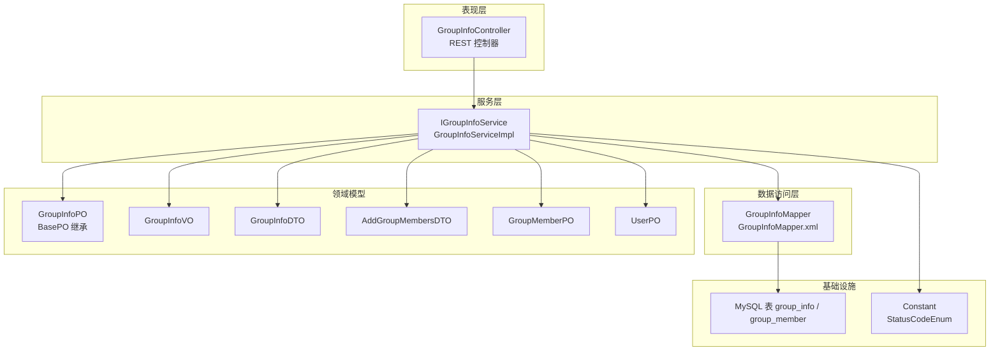
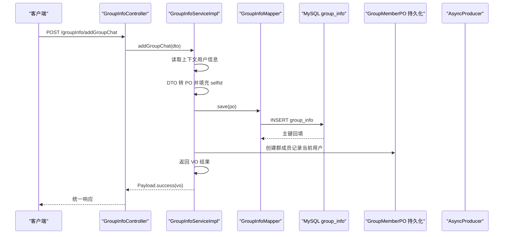
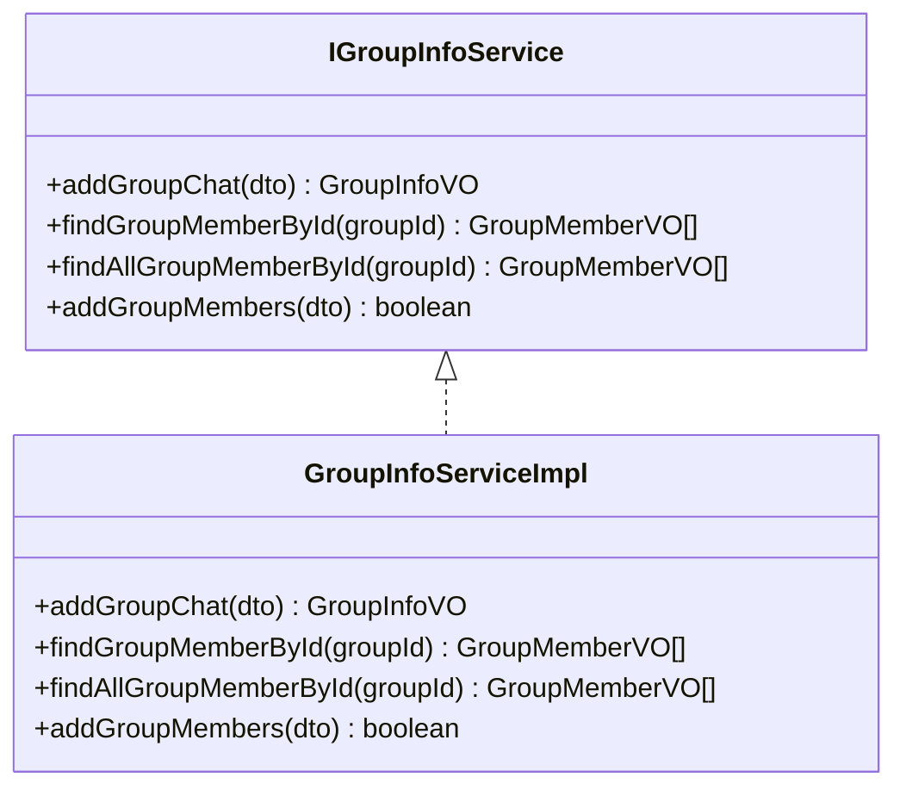
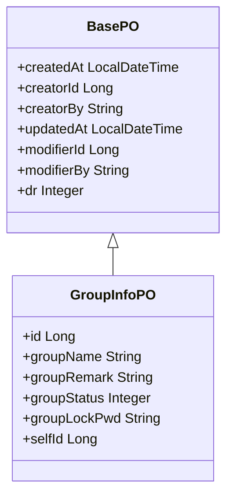
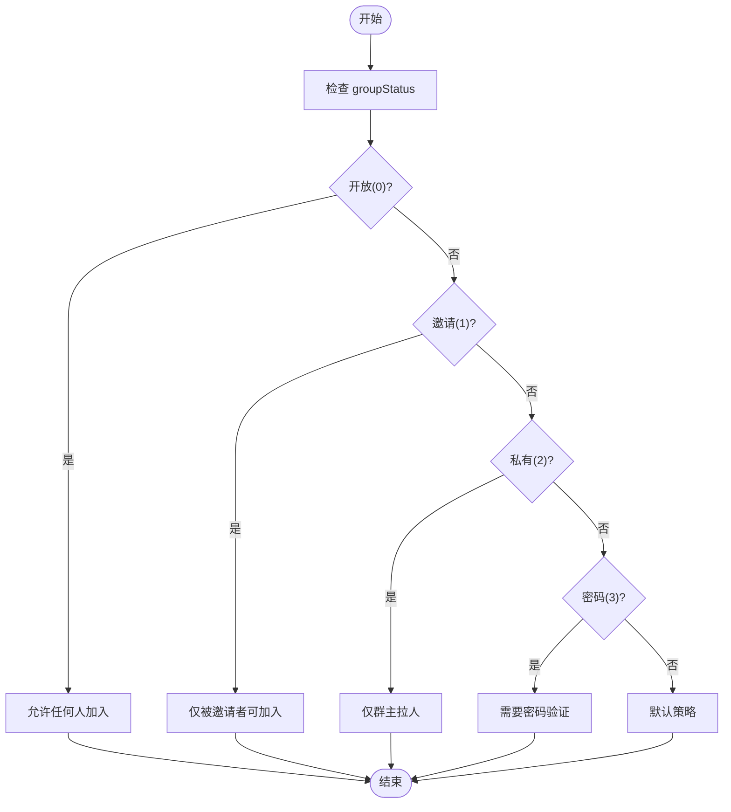
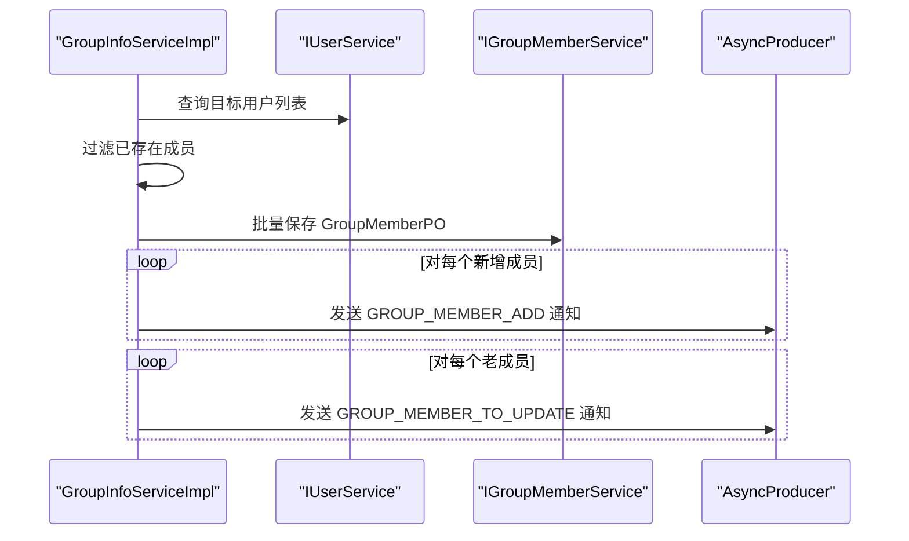
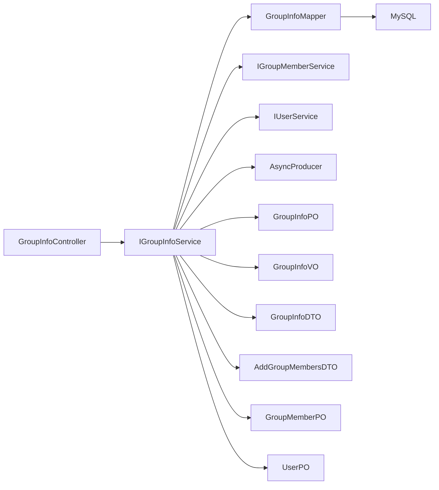

# 群组创建与管理

<cite>
**本文引用的文件**
- [GroupInfoController.java](file://src/main/java/com/hch/chat_simple/controller/GroupInfoController.java)
- [GroupInfoDTO.java](file://src/main/java/com/hch/chat_simple/pojo/dto/GroupInfoDTO.java)
- [GroupInfoServiceImpl.java](file://src/main/java/com/hch/chat_simple/service/impl/GroupInfoServiceImpl.java)
- [GroupInfoPO.java](file://src/main/java/com/hch/chat_simple/pojo/po/GroupInfoPO.java)
- [GroupInfoMapper.java](file://src/main/java/com/hch/chat_simple/mapper/GroupInfoMapper.java)
- [GroupInfoMapper.xml](file://src/main/resources/mapper/GroupInfoMapper.xml)
- [IGroupInfoService.java](file://src/main/java/com/hch/chat_simple/service/IGroupInfoService.java)
- [GroupInfoVO.java](file://src/main/java/com/hch/chat_simple/pojo/vo/GroupInfoVO.java)
- [AddGroupMembersDTO.java](file://src/main/java/com/hch/chat_simple/pojo/dto/AddGroupMembersDTO.java)
- [GroupMemberPO.java](file://src/main/java/com/hch/chat_simple/pojo/po/GroupMemberPO.java)
- [UserPO.java](file://src/main/java/com/hch/chat_simple/pojo/po/UserPO.java)
- [Constant.java](file://src/main/java/com/hch/chat_simple/util/Constant.java)
- [BasePO.java](file://src/main/java/com/hch/chat_simple/pojo/po/BasePO.java)
- [BusinessException.java](file://src/main/java/com/hch/chat_simple/exception/BusinessException.java)
- [StatusCodeEnum.java](file://src/main/java/com/hch/chat_simple/util/StatusCodeEnum.java)
- [chat.sql](file://db/chat.sql)
</cite>

## 目录
1. [简介](#简介)
2. [项目结构](#项目结构)
3. [核心组件](#核心组件)
4. [架构总览](#架构总览)
5. [详细组件分析](#详细组件分析)
6. [依赖分析](#依赖分析)
7. [性能考虑](#性能考虑)
8. [故障排查指南](#故障排查指南)
9. [结论](#结论)
10. [附录](#附录)

## 简介
本文件围绕群组创建与管理功能展开，重点覆盖以下方面：
- 群组创建流程：从控制器到服务层再到持久层的完整链路，以及参数校验与业务处理细节
- 实体模型设计：GroupInfoPO 的字段定义、数据库映射关系与继承的基础字段
- 基本信息管理：群组名称、头像、描述等信息的维护（当前仓库未提供头像/描述字段，后续可按需扩展）
- 权限控制与安全策略：基于上下文的身份识别、群成员自动加入、以及可扩展的权限与频率控制建议
- 状态管理：群组状态枚举与成员状态常量
- 异常处理与错误码：统一的业务异常与状态码体系

## 项目结构
本项目采用分层架构，群组模块位于 controller → service → mapper → po 层，配合 MyBatis-Plus 与 XML 映射文件完成数据访问。

图表来源
- [GroupInfoController.java:39-44](file://src/main/java/com/hch/chat_simple/controller/GroupInfoController.java#L39-L44)
- [GroupInfoServiceImpl.java:59-80](file://src/main/java/com/hch/chat_simple/service/impl/GroupInfoServiceImpl.java#L59-L80)
- [GroupInfoMapper.java:17-18](file://src/main/java/com/hch/chat_simple/mapper/GroupInfoMapper.java#L17-L18)
- [GroupInfoPO.java:27-49](file://src/main/java/com/hch/chat_simple/pojo/po/GroupInfoPO.java#L27-L49)
- [GroupInfoMapper.xml:3](file://src/main/resources/mapper/GroupInfoMapper.xml#L3)
- [chat.sql:56-71](file://db/chat.sql#L56-L71)

章节来源
- [GroupInfoController.java:30-67](file://src/main/java/com/hch/chat_simple/controller/GroupInfoController.java#L30-L67)
- [GroupInfoServiceImpl.java:44-142](file://src/main/java/com/hch/chat_simple/service/impl/GroupInfoServiceImpl.java#L44-L142)
- [GroupInfoMapper.java:17-18](file://src/main/java/com/hch/chat_simple/mapper/GroupInfoMapper.java#L17-L18)
- [GroupInfoMapper.xml:3](file://src/main/resources/mapper/GroupInfoMapper.xml#L3)
- [chat.sql:56-89](file://db/chat.sql#L56-L89)

## 核心组件
- 控制器：提供 /groupInfo/addGroupChat 接口，负责接收请求体 GroupInfoDTO 并返回统一响应包装
- 服务实现：负责群组创建、成员查询与批量添加、消息通知等业务逻辑
- 数据访问：基于 MyBatis-Plus 的 Mapper 接口与 XML 映射
- 领域模型：GroupInfoPO（含继承自 BasePO 的通用审计字段）、GroupInfoVO、GroupInfoDTO、AddGroupMembersDTO、GroupMemberPO、UserPO
- 常量与枚举：成员状态常量、统一状态码枚举、业务异常类

章节来源
- [GroupInfoController.java:39-44](file://src/main/java/com/hch/chat_simple/controller/GroupInfoController.java#L39-L44)
- [GroupInfoServiceImpl.java:59-80](file://src/main/java/com/hch/chat_simple/service/impl/GroupInfoServiceImpl.java#L59-L80)
- [IGroupInfoService.java:21-30](file://src/main/java/com/hch/chat_simple/service/IGroupInfoService.java#L21-L30)
- [GroupInfoPO.java:27-49](file://src/main/java/com/hch/chat_simple/pojo/po/GroupInfoPO.java#L27-L49)
- [GroupInfoVO.java:8-26](file://src/main/java/com/hch/chat_simple/pojo/vo/GroupInfoVO.java#L8-L26)
- [GroupInfoDTO.java:8-25](file://src/main/java/com/hch/chat_simple/pojo/dto/GroupInfoDTO.java#L8-L25)
- [AddGroupMembersDTO.java:10-15](file://src/main/java/com/hch/chat_simple/pojo/dto/AddGroupMembersDTO.java#L10-L15)
- [GroupMemberPO.java](file://src/main/java/com/hch/chat_simple/pojo/po/GroupMemberPO.java)
- [UserPO.java](file://src/main/java/com/hch/chat_simple/pojo/po/UserPO.java)
- [Constant.java:23-25](file://src/main/java/com/hch/chat_simple/util/Constant.java#L23-L25)
- [StatusCodeEnum.java:6-21](file://src/main/java/com/hch/chat_simple/util/StatusCodeEnum.java#L6-L21)
- [BusinessException.java:3-11](file://src/main/java/com/hch/chat_simple/exception/BusinessException.java#L3-L11)

## 架构总览
下图展示了“群组创建”端到端调用序列，从控制器到服务、持久化与消息通知：

图表来源
- [GroupInfoController.java:39-44](file://src/main/java/com/hch/chat_simple/controller/GroupInfoController.java#L39-L44)
- [GroupInfoServiceImpl.java:61-80](file://src/main/java/com/hch/chat_simple/service/impl/GroupInfoServiceImpl.java#L61-L80)
- [GroupInfoMapper.java:17-18](file://src/main/java/com/hch/chat_simple/mapper/GroupInfoMapper.java#L17-L18)
- [chat.sql:56-71](file://db/chat.sql#L56-L71)

## 详细组件分析

### 控制器：GroupInfoController
- 提供 /groupInfo/addGroupChat 接口，使用 @RequestBody 接收 GroupInfoDTO
- 使用统一响应包装类 Payload 返回结果
- 同时提供成员查询与批量添加成员的接口（用于后续扩展）

章节来源
- [GroupInfoController.java:39-44](file://src/main/java/com/hch/chat_simple/controller/GroupInfoController.java#L39-L44)
- [GroupInfoController.java:46-66](file://src/main/java/com/hch/chat_simple/controller/GroupInfoController.java#L46-L66)

### 参数对象：GroupInfoDTO
- 字段说明：groupName、groupRemark、groupStatus、groupLockPwd、selfId
- 用途：作为群组创建的输入参数载体

章节来源
- [GroupInfoDTO.java:8-25](file://src/main/java/com/hch/chat_simple/pojo/dto/GroupInfoDTO.java#L8-L25)

### 服务接口与实现：IGroupInfoService 与 GroupInfoServiceImpl
- addGroupChat：事务性保存群组信息，并自动将创建者设为初始成员
- findGroupMemberById / findAllGroupMemberById：查询在群成员或全部成员（包含已离开）
- addGroupMembers：批量添加成员，去重、生成邀请记录、异步通知新老成员

图表来源
- [IGroupInfoService.java:21-30](file://src/main/java/com/hch/chat_simple/service/IGroupInfoService.java#L21-L30)
- [GroupInfoServiceImpl.java:44-142](file://src/main/java/com/hch/chat_simple/service/impl/GroupInfoServiceImpl.java#L44-L142)

章节来源
- [IGroupInfoService.java:21-30](file://src/main/java/com/hch/chat_simple/service/IGroupInfoService.java#L21-L30)
- [GroupInfoServiceImpl.java:59-80](file://src/main/java/com/hch/chat_simple/service/impl/GroupInfoServiceImpl.java#L59-L80)
- [GroupInfoServiceImpl.java:82-99](file://src/main/java/com/hch/chat_simple/service/impl/GroupInfoServiceImpl.java#L82-L99)
- [GroupInfoServiceImpl.java:101-141](file://src/main/java/com/hch/chat_simple/service/impl/GroupInfoServiceImpl.java#L101-L141)

### 实体模型：GroupInfoPO 与基类 BasePO
- 继承 BasePO，具备创建/修改时间、创建人/修改人、逻辑删除字段
- 映射至数据库表 group_info，字段包括 id、group_name、group_remark、group_status、group_lock_pwd、self_id 等
- 与 MyBatis-Plus 注解配合，支持自动填充与逻辑删除

图表来源
- [BasePO.java:14-43](file://src/main/java/com/hch/chat_simple/pojo/po/BasePO.java#L14-L43)
- [GroupInfoPO.java:27-49](file://src/main/java/com/hch/chat_simple/pojo/po/GroupInfoPO.java#L27-L49)

章节来源
- [BasePO.java:14-43](file://src/main/java/com/hch/chat_simple/pojo/po/BasePO.java#L14-L43)
- [GroupInfoPO.java:27-49](file://src/main/java/com/hch/chat_simple/pojo/po/GroupInfoPO.java#L27-L49)
- [chat.sql:56-71](file://db/chat.sql#L56-L71)

### 数据访问：GroupInfoMapper 与 XML
- Mapper 接口继承 MyBatis-Plus 的 BaseMapper，提供通用 CRUD 能力
- XML 文件当前为空，实际 SQL 由注解或通用方法提供

章节来源
- [GroupInfoMapper.java:17-18](file://src/main/java/com/hch/chat_simple/mapper/GroupInfoMapper.java#L17-L18)
- [GroupInfoMapper.xml:3](file://src/main/resources/mapper/GroupInfoMapper.xml#L3)

### 数据模型与状态
- 成员状态：Constant 中定义了 IN_GROUP=1、LEAVE_GROUP=0
- 群组状态：GroupInfoDTO/PO 中的 groupStatus 字段用于表示群组开放策略（开放/邀请/私有/密码）

图表来源
- [GroupInfoDTO.java:17](file://src/main/java/com/hch/chat_simple/pojo/dto/GroupInfoDTO.java#L17)
- [GroupInfoPO.java:40](file://src/main/java/com/hch/chat_simple/pojo/po/GroupInfoPO.java#L40)
- [Constant.java:23-25](file://src/main/java/com/hch/chat_simple/util/Constant.java#L23-L25)

章节来源
- [GroupInfoDTO.java:17](file://src/main/java/com/hch/chat_simple/pojo/dto/GroupInfoDTO.java#L17)
- [GroupInfoPO.java:40](file://src/main/java/com/hch/chat_simple/pojo/po/GroupInfoPO.java#L40)
- [Constant.java:23-25](file://src/main/java/com/hch/chat_simple/util/Constant.java#L23-L25)

### 群组成员管理与通知
- 批量添加成员时，先查询已有成员集合，进行去重过滤
- 为每个新增成员生成邀请记录，并向新成员与老成员分别发送异步通知

图表来源
- [GroupInfoServiceImpl.java:101-141](file://src/main/java/com/hch/chat_simple/service/impl/GroupInfoServiceImpl.java#L101-L141)

章节来源
- [GroupInfoServiceImpl.java:101-141](file://src/main/java/com/hch/chat_simple/service/impl/GroupInfoServiceImpl.java#L101-L141)

## 依赖分析
- 控制器依赖服务接口；服务实现依赖 Mapper、成员服务、用户服务、消息生产者
- 实体模型依赖 MyBatis-Plus 注解与通用基类
- 数据库层面 group_info 与 group_member 通过外键关联（由业务逻辑保证）

图表来源
- [GroupInfoController.java:35-36](file://src/main/java/com/hch/chat_simple/controller/GroupInfoController.java#L35-L36)
- [GroupInfoServiceImpl.java:47-54](file://src/main/java/com/hch/chat_simple/service/impl/GroupInfoServiceImpl.java#L47-L54)
- [GroupInfoMapper.java:17-18](file://src/main/java/com/hch/chat_simple/mapper/GroupInfoMapper.java#L17-L18)
- [chat.sql:73-89](file://db/chat.sql#L73-L89)

章节来源
- [GroupInfoController.java:35-36](file://src/main/java/com/hch/chat_simple/controller/GroupInfoController.java#L35-L36)
- [GroupInfoServiceImpl.java:47-54](file://src/main/java/com/hch/chat_simple/service/impl/GroupInfoServiceImpl.java#L47-L54)
- [GroupInfoMapper.java:17-18](file://src/main/java/com/hch/chat_simple/mapper/GroupInfoMapper.java#L17-L18)
- [chat.sql:73-89](file://db/chat.sql#L73-L89)

## 性能考虑
- 批量插入：addGroupMembers 使用批量保存，减少多次往返数据库
- 流式处理：使用 Stream 进行去重与对象转换，提升内存与 CPU 利用效率
- 异步通知：通过消息队列异步推送，避免阻塞主流程
- 事务边界：群组创建与成员加入置于同一事务，确保一致性

## 故障排查指南
- 统一异常与状态码
  - 业务异常类 BusinessException 用于抛出业务错误
  - 统一状态码枚举 StatusCodeEnum 定义了常见错误码（如 TOKEN_INVALID、TOKEN_LACK、TOKEN_EXPIRE、USER_NOT_FOUND、PWD_ERROR、FILE_UPLOAD_FAIL）
- 常见问题定位
  - 群组创建失败：检查 DTO 字段与服务层事务是否生效
  - 成员添加异常：确认用户 ID 是否存在、是否已加入、是否触发去重逻辑
  - 通知未到达：检查消息生产者配置与标签映射

章节来源
- [BusinessException.java:3-11](file://src/main/java/com/hch/chat_simple/exception/BusinessException.java#L3-L11)
- [StatusCodeEnum.java:6-21](file://src/main/java/com/hch/chat_simple/util/StatusCodeEnum.java#L6-L21)

## 结论
本群组创建与管理模块以清晰的分层架构实现，控制器负责请求接入与统一响应，服务层承担业务编排与事务控制，数据访问层通过 MyBatis-Plus 简化持久化。实体模型与数据库表结构匹配良好，状态与成员管理逻辑完善。建议后续补充：
- 群组头像与描述字段的持久化与接口
- 群组权限控制与创建频率限制的策略实现
- 更细粒度的参数校验与异常分类

## 附录

### 数据库表结构概览
- group_info：群组基本信息与状态
- group_member：群成员状态与邀请人信息
- user：用户基础信息（用于批量添加成员时的用户校验）

章节来源
- [chat.sql:56-89](file://db/chat.sql#L56-L89)