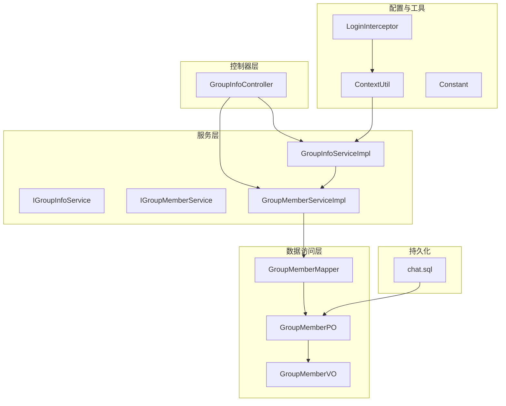
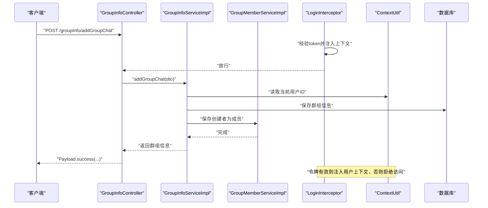
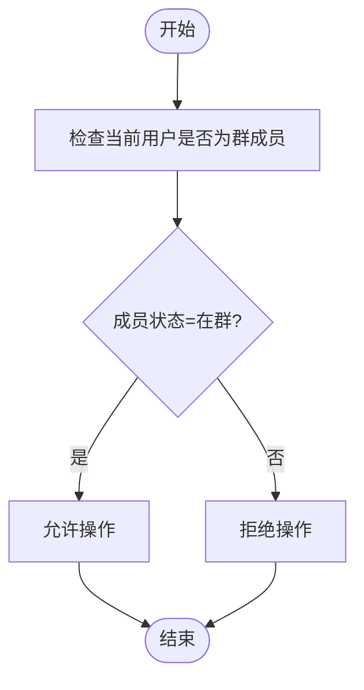
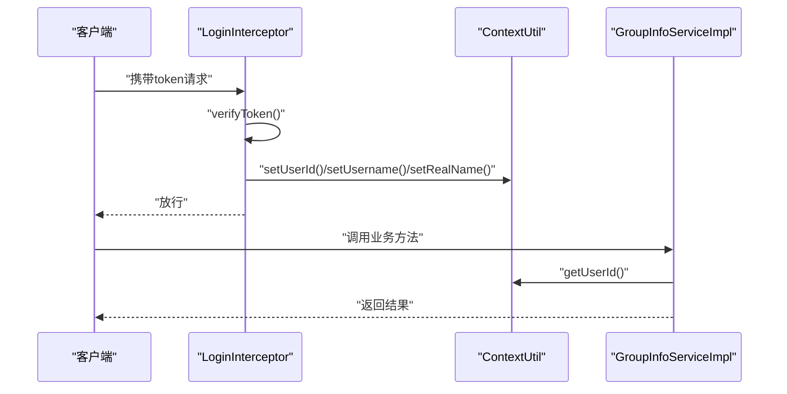
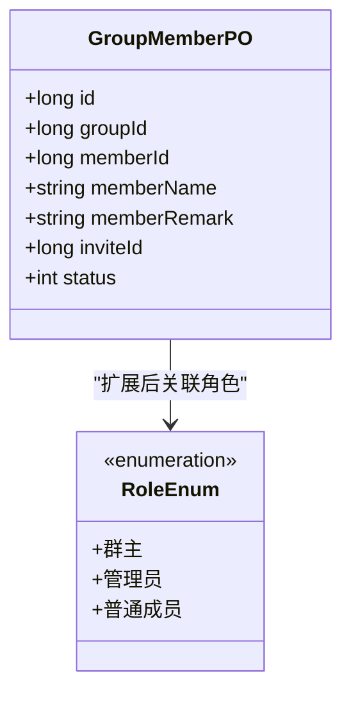
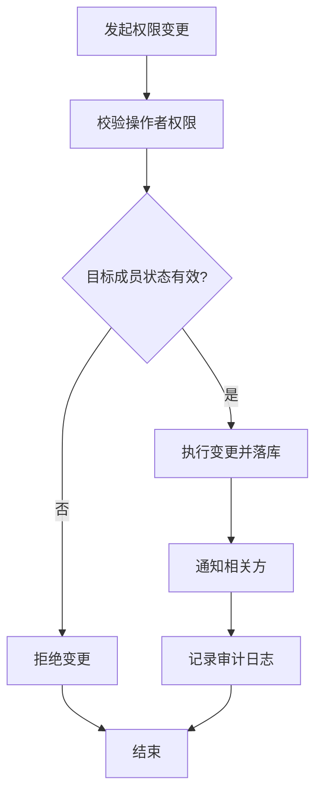
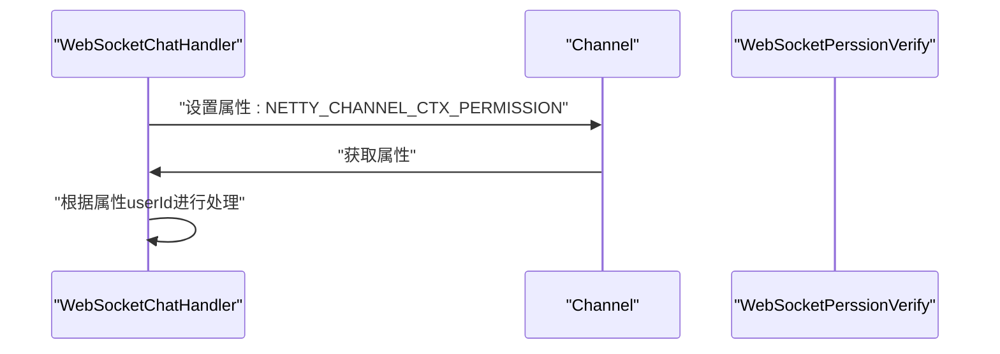
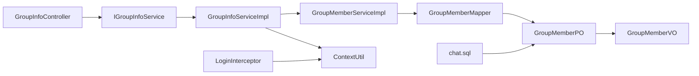

# 群组权限控制

<cite>
**本文引用的文件**
- [GroupMemberPO.java](file://src/main/java/com/hch/chat_simple/pojo/po/GroupMemberPO.java)
- [GroupMemberMapper.java](file://src/main/java/com/hch/chat_simple/mapper/GroupMemberMapper.java)
- [IGroupMemberService.java](file://src/main/java/com/hch/chat_simple/service/IGroupMemberService.java)
- [GroupMemberServiceImpl.java](file://src/main/java/com/hch/chat_simple/service/impl/GroupMemberServiceImpl.java)
- [GroupInfoController.java](file://src/main/java/com/hch/chat_simple/controller/GroupInfoController.java)
- [IGroupInfoService.java](file://src/main/java/com/hch/chat_simple/service/IGroupInfoService.java)
- [GroupInfoServiceImpl.java](file://src/main/java/com/hch/chat_simple/service/impl/GroupInfoServiceImpl.java)
- [AddGroupMembersDTO.java](file://src/main/java/com/hch/chat_simple/pojo/dto/AddGroupMembersDTO.java)
- [GroupInfoDTO.java](file://src/main/java/com/hch/chat_simple/pojo/dto/GroupInfoDTO.java)
- [GroupMemberVO.java](file://src/main/java/com/hch/chat_simple/pojo/vo/GroupMemberVO.java)
- [LoginInterceptor.java](file://src/main/java/com/hch/chat_simple/config/LoginInterceptor.java)
- [ContextUtil.java](file://src/main/java/com/hch/chat_simple/util/ContextUtil.java)
- [Constant.java](file://src/main/java/com/hch/chat_simple/util/Constant.java)
- [WebSocketChatHandler.java](file://src/main/java/com/hch/chat_simple/handler/WebSocketChatHandler.java)
- [chat.sql](file://db/chat.sql)
</cite>

## 目录
1. [引言](#引言)
2. [项目结构](#项目结构)
3. [核心组件](#核心组件)
4. [架构总览](#架构总览)
5. [详细组件分析](#详细组件分析)
6. [依赖分析](#依赖分析)
7. [性能考虑](#性能考虑)
8. [故障排查指南](#故障排查指南)
9. [结论](#结论)
10. [附录](#附录)

## 引言
本文件面向“群组权限控制”主题，系统性梳理该聊天系统中与群组相关的权限设计与实现要点。当前仓库中，群组权限控制尚未以独立枚举或角色表形式完整呈现，但通过以下方式实现了基础的权限边界：
- 用户身份认证与上下文注入：基于拦截器与令牌解析，将当前用户信息注入线程上下文，供后续业务使用。
- 群组成员模型与状态字段：通过成员状态字段区分“在群/离群”，为成员管理提供基础条件。
- 控制器与服务层：在群组创建、成员查询、成员添加等接口中，利用上下文用户ID进行基本的归属与操作约束。

本文件将从权限矩阵、验证机制、继承与传递、变更流程、应用场景、安全保障与日志审计等方面进行说明，并结合现有代码路径给出可落地的实现建议与改进方向。

## 项目结构
围绕群组权限控制的相关模块主要分布在以下层次：
- 控制器层：对外暴露群组相关接口，负责参数接收与响应封装。
- 服务层：实现业务逻辑，包括群组创建、成员查询、成员批量添加等。
- 数据访问层：MyBatis-Plus Mapper 与 PO/VO 定义，承载数据模型与查询条件。
- 配置与工具：拦截器负责鉴权与上下文注入；工具类提供常量与上下文存储；数据库脚本定义表结构。

**图表来源**
- [GroupInfoController.java:30-67](file://src/main/java/com/hch/chat_simple/controller/GroupInfoController.java#L30-L67)
- [GroupInfoServiceImpl.java:44-142](file://src/main/java/com/hch/chat_simple/service/impl/GroupInfoServiceImpl.java#L44-L142)
- [IGroupMemberService.java:18-20](file://src/main/java/com/hch/chat_simple/service/IGroupMemberService.java#L18-L20)
- [GroupMemberServiceImpl.java:17-20](file://src/main/java/com/hch/chat_simple/service/impl/GroupMemberServiceImpl.java#L17-L20)
- [GroupMemberMapper.java:17-20](file://src/main/java/com/hch/chat_simple/mapper/GroupMemberMapper.java#L17-L20)
- [GroupMemberPO.java:20-48](file://src/main/java/com/hch/chat_simple/pojo/po/GroupMemberPO.java#L20-L48)
- [GroupMemberVO.java:15-39](file://src/main/java/com/hch/chat_simple/pojo/vo/GroupMemberVO.java#L15-L39)
- [LoginInterceptor.java:28-108](file://src/main/java/com/hch/chat_simple/config/LoginInterceptor.java#L28-L108)
- [ContextUtil.java:5-51](file://src/main/java/com/hch/chat_simple/util/ContextUtil.java#L5-L51)
- [Constant.java:3-32](file://src/main/java/com/hch/chat_simple/util/Constant.java#L3-L32)
- [chat.sql:62-89](file://db/chat.sql#L62-L89)

**章节来源**
- [GroupInfoController.java:30-67](file://src/main/java/com/hch/chat_simple/controller/GroupInfoController.java#L30-L67)
- [GroupInfoServiceImpl.java:44-142](file://src/main/java/com/hch/chat_simple/service/impl/GroupInfoServiceImpl.java#L44-L142)
- [IGroupMemberService.java:18-20](file://src/main/java/com/hch/chat_simple/service/IGroupMemberService.java#L18-L20)
- [GroupMemberServiceImpl.java:17-20](file://src/main/java/com/hch/chat_simple/service/impl/GroupMemberServiceImpl.java#L17-L20)
- [GroupMemberMapper.java:17-20](file://src/main/java/com/hch/chat_simple/mapper/GroupMemberMapper.java#L17-L20)
- [GroupMemberPO.java:20-48](file://src/main/java/com/hch/chat_simple/pojo/po/GroupMemberPO.java#L20-L48)
- [GroupMemberVO.java:15-39](file://src/main/java/com/hch/chat_simple/pojo/vo/GroupMemberVO.java#L15-L39)
- [LoginInterceptor.java:28-108](file://src/main/java/com/hch/chat_simple/config/LoginInterceptor.java#L28-L108)
- [ContextUtil.java:5-51](file://src/main/java/com/hch/chat_simple/util/ContextUtil.java#L5-L51)
- [Constant.java:3-32](file://src/main/java/com/hch/chat_simple/util/Constant.java#L3-L32)
- [chat.sql:62-89](file://db/chat.sql#L62-L89)

## 核心组件
- 群组成员数据模型：包含成员状态字段，支持区分“在群/离群”，为成员管理提供基础条件。
- 群组成员服务：提供成员列表查询、批量新增等能力。
- 群组信息服务：提供群组创建、成员查询、成员批量添加等能力，并在创建时将创建者自动设为成员。
- 登录拦截器与上下文工具：负责令牌解析、过期处理与用户上下文注入，为权限判断提供当前用户标识。
- 常量与数据库脚本：定义成员状态常量与表结构，支撑权限边界的基础数据。

**章节来源**
- [GroupMemberPO.java:20-48](file://src/main/java/com/hch/chat_simple/pojo/po/GroupMemberPO.java#L20-L48)
- [IGroupMemberService.java:18-20](file://src/main/java/com/hch/chat_simple/service/IGroupMemberService.java#L18-L20)
- [GroupMemberServiceImpl.java:17-20](file://src/main/java/com/hch/chat_simple/service/impl/GroupMemberServiceImpl.java#L17-L20)
- [IGroupInfoService.java:21-30](file://src/main/java/com/hch/chat_simple/service/IGroupInfoService.java#L21-L30)
- [GroupInfoServiceImpl.java:59-80](file://src/main/java/com/hch/chat_simple/service/impl/GroupInfoServiceImpl.java#L59-L80)
- [LoginInterceptor.java:30-90](file://src/main/java/com/hch/chat_simple/config/LoginInterceptor.java#L30-L90)
- [ContextUtil.java:12-49](file://src/main/java/com/hch/chat_simple/util/ContextUtil.java#L12-L49)
- [Constant.java:23-25](file://src/main/java/com/hch/chat_simple/util/Constant.java#L23-L25)
- [chat.sql:73-89](file://db/chat.sql#L73-L89)

## 架构总览
下图展示了从请求到业务处理再到数据持久化的整体流程，以及权限控制的关键节点（令牌校验、上下文注入、成员状态过滤）。

**图表来源**
- [GroupInfoController.java:39-44](file://src/main/java/com/hch/chat_simple/controller/GroupInfoController.java#L39-L44)
- [GroupInfoServiceImpl.java:61-80](file://src/main/java/com/hch/chat_simple/service/impl/GroupInfoServiceImpl.java#L61-L80)
- [LoginInterceptor.java:44-71](file://src/main/java/com/hch/chat_simple/config/LoginInterceptor.java#L44-L71)
- [ContextUtil.java:12-18](file://src/main/java/com/hch/chat_simple/util/ContextUtil.java#L12-L18)

**章节来源**
- [GroupInfoController.java:39-44](file://src/main/java/com/hch/chat_simple/controller/GroupInfoController.java#L39-L44)
- [GroupInfoServiceImpl.java:61-80](file://src/main/java/com/hch/chat_simple/service/impl/GroupInfoServiceImpl.java#L61-L80)
- [LoginInterceptor.java:44-71](file://src/main/java/com/hch/chat_simple/config/LoginInterceptor.java#L44-L71)
- [ContextUtil.java:12-18](file://src/main/java/com/hch/chat_simple/util/ContextUtil.java#L12-L18)

## 详细组件分析

### 权限矩阵与操作范围
当前系统通过成员状态字段与上下文用户ID实现基础的权限边界：
- 群组创建：创建者自动成为成员，具备初始成员权限。
- 成员查询：默认仅查询“在群”成员，避免离群成员参与权限判断。
- 成员添加：基于当前用户ID作为邀请人，批量添加成员并触发通知。

**图表来源**
- [GroupInfoServiceImpl.java:83-90](file://src/main/java/com/hch/chat_simple/service/impl/GroupInfoServiceImpl.java#L83-L90)
- [Constant.java:23-25](file://src/main/java/com/hch/chat_simple/util/Constant.java#L23-L25)

**章节来源**
- [GroupInfoServiceImpl.java:83-90](file://src/main/java/com/hch/chat_simple/service/impl/GroupInfoServiceImpl.java#L83-L90)
- [Constant.java:23-25](file://src/main/java/com/hch/chat_simple/util/Constant.java#L23-L25)

### 权限验证机制
- 身份验证：拦截器从请求头读取令牌，验证通过后将用户信息注入上下文，供后续服务层使用。
- 角色权限检查：当前实现未显式区分“群主/管理员/普通成员”，而是通过成员状态与操作发起者ID进行基础约束。
- 操作权限判断：服务层在执行具体操作前，读取上下文中的用户ID，确保操作发起者具备相应权限。

**图表来源**
- [LoginInterceptor.java:44-71](file://src/main/java/com/hch/chat_simple/config/LoginInterceptor.java#L44-L71)
- [ContextUtil.java:12-34](file://src/main/java/com/hch/chat_simple/util/ContextUtil.java#L12-L34)
- [GroupInfoServiceImpl.java:61-67](file://src/main/java/com/hch/chat_simple/service/impl/GroupInfoServiceImpl.java#L61-L67)

**章节来源**
- [LoginInterceptor.java:44-71](file://src/main/java/com/hch/chat_simple/config/LoginInterceptor.java#L44-L71)
- [ContextUtil.java:12-34](file://src/main/java/com/hch/chat_simple/util/ContextUtil.java#L12-L34)
- [GroupInfoServiceImpl.java:61-67](file://src/main/java/com/hch/chat_simple/service/impl/GroupInfoServiceImpl.java#L61-L67)

### 权限继承与传递机制
- 当前实现未体现“群主对管理员授权、管理员对普通成员管理”的层级关系。成员状态字段仅支持“在群/离群”，不包含角色等级。
- 建议扩展：引入角色枚举与角色表，明确“群主/管理员/普通成员”的职责边界，并在成员表中增加角色字段，以便在权限判断时进行层级传递。

**图表来源**
- [GroupMemberPO.java:20-48](file://src/main/java/com/hch/chat_simple/pojo/po/GroupMemberPO.java#L20-L48)

**章节来源**
- [GroupMemberPO.java:20-48](file://src/main/java/com/hch/chat_simple/pojo/po/GroupMemberPO.java#L20-L48)

### 权限变更流程
- 权限提升：当前未实现将普通成员提升为管理员的流程。建议在服务层新增角色变更接口，校验操作者权限与目标成员状态，更新成员角色并落库。
- 权限降级：同上，建议提供降级接口，限制操作者权限与目标成员状态。
- 权限撤销：建议提供移除成员或禁用成员权限的接口，结合成员状态字段实现“离群”或“封禁”。

[本图为概念流程图，无需图表来源]

**章节来源**
- [GroupInfoServiceImpl.java:101-141](file://src/main/java/com/hch/chat_simple/service/impl/GroupInfoServiceImpl.java#L101-L141)

### 权限控制的应用场景
- 群组创建权限：当前实现由创建者自动成为成员，具备初始成员权限。建议在创建接口中增加创建者角色写入与权限校验。
- 成员管理权限：当前实现支持成员查询与批量添加，但未体现“管理员可管理成员”的能力。建议在成员管理接口中增加角色校验。
- 消息发送权限：当前未体现“仅在群成员可发送消息”的权限控制。建议在消息发送接口中增加成员状态校验。
- 群组设置权限：当前未体现“仅群主可修改群设置”的权限控制。建议在群组设置接口中增加角色校验。

**章节来源**
- [GroupInfoController.java:39-66](file://src/main/java/com/hch/chat_simple/controller/GroupInfoController.java#L39-L66)
- [GroupInfoServiceImpl.java:61-80](file://src/main/java/com/hch/chat_simple/service/impl/GroupInfoServiceImpl.java#L61-L80)

### WebSocket 通道权限校验
系统通过 Netty 的 Channel 属性存储权限信息，便于在连接建立后进行权限校验与用户绑定。

**图表来源**
- [WebSocketChatHandler.java:177-193](file://src/main/java/com/hch/chat_simple/handler/WebSocketChatHandler.java#L177-L193)
- [Constant.java](file://src/main/java/com/hch/chat_simple/util/Constant.java#L6)

**章节来源**
- [WebSocketChatHandler.java:177-193](file://src/main/java/com/hch/chat_simple/handler/WebSocketChatHandler.java#L177-L193)
- [Constant.java](file://src/main/java/com/hch/chat_simple/util/Constant.java#L6)

## 依赖分析
- 控制器依赖服务接口，服务实现依赖 Mapper 与 PO/VO。
- 服务层依赖上下文工具读取当前用户ID，拦截器负责注入上下文。
- 数据模型与数据库脚本保持一致，成员状态字段支撑权限边界。

**图表来源**
- [GroupInfoController.java:35-36](file://src/main/java/com/hch/chat_simple/controller/GroupInfoController.java#L35-L36)
- [IGroupInfoService.java:21-30](file://src/main/java/com/hch/chat_simple/service/IGroupInfoService.java#L21-L30)
- [GroupInfoServiceImpl.java:44-142](file://src/main/java/com/hch/chat_simple/service/impl/GroupInfoServiceImpl.java#L44-L142)
- [GroupMemberServiceImpl.java:17-20](file://src/main/java/com/hch/chat_simple/service/impl/GroupMemberServiceImpl.java#L17-L20)
- [GroupMemberMapper.java:17-20](file://src/main/java/com/hch/chat_simple/mapper/GroupMemberMapper.java#L17-L20)
- [GroupMemberPO.java:20-48](file://src/main/java/com/hch/chat_simple/pojo/po/GroupMemberPO.java#L20-L48)
- [GroupMemberVO.java:15-39](file://src/main/java/com/hch/chat_simple/pojo/vo/GroupMemberVO.java#L15-L39)
- [LoginInterceptor.java:28-108](file://src/main/java/com/hch/chat_simple/config/LoginInterceptor.java#L28-L108)
- [ContextUtil.java:5-51](file://src/main/java/com/hch/chat_simple/util/ContextUtil.java#L5-L51)
- [chat.sql:73-89](file://db/chat.sql#L73-L89)

**章节来源**
- [GroupInfoController.java:35-36](file://src/main/java/com/hch/chat_simple/controller/GroupInfoController.java#L35-L36)
- [IGroupInfoService.java:21-30](file://src/main/java/com/hch/chat_simple/service/IGroupInfoService.java#L21-L30)
- [GroupInfoServiceImpl.java:44-142](file://src/main/java/com/hch/chat_simple/service/impl/GroupInfoServiceImpl.java#L44-L142)
- [GroupMemberServiceImpl.java:17-20](file://src/main/java/com/hch/chat_simple/service/impl/GroupMemberServiceImpl.java#L17-L20)
- [GroupMemberMapper.java:17-20](file://src/main/java/com/hch/chat_simple/mapper/GroupMemberMapper.java#L17-L20)
- [GroupMemberPO.java:20-48](file://src/main/java/com/hch/chat_simple/pojo/po/GroupMemberPO.java#L20-L48)
- [GroupMemberVO.java:15-39](file://src/main/java/com/hch/chat_simple/pojo/vo/GroupMemberVO.java#L15-L39)
- [LoginInterceptor.java:28-108](file://src/main/java/com/hch/chat_simple/config/LoginInterceptor.java#L28-L108)
- [ContextUtil.java:5-51](file://src/main/java/com/hch/chat_simple/util/ContextUtil.java#L5-L51)
- [chat.sql:73-89](file://db/chat.sql#L73-L89)

## 性能考虑
- 批量插入：成员批量添加采用批处理方式，减少多次往返，提高吞吐。
- 查询优化：成员查询默认按“在群”状态过滤，减少无效数据扫描。
- 缓存与异步：成员变更后通过异步消息通知其他成员，降低同步阻塞。

**章节来源**
- [GroupInfoServiceImpl.java:124-138](file://src/main/java/com/hch/chat_simple/service/impl/GroupInfoServiceImpl.java#L124-L138)

## 故障排查指南
- 令牌校验失败：检查拦截器中令牌解析与过期处理逻辑，确认响应格式与状态码。
- 上下文未注入：确认拦截器在预处理阶段正确设置用户信息，并在完成后清理。
- 成员状态异常：核对成员状态字段与查询条件，确保“在群”过滤生效。
- WebSocket 权限校验：检查通道属性设置与获取逻辑，确保 userId 可用。

**章节来源**
- [LoginInterceptor.java:44-90](file://src/main/java/com/hch/chat_simple/config/LoginInterceptor.java#L44-L90)
- [ContextUtil.java:44-49](file://src/main/java/com/hch/chat_simple/util/ContextUtil.java#L44-L49)
- [GroupInfoServiceImpl.java:83-90](file://src/main/java/com/hch/chat_simple/service/impl/GroupInfoServiceImpl.java#L83-L90)
- [WebSocketChatHandler.java:177-193](file://src/main/java/com/hch/chat_simple/handler/WebSocketChatHandler.java#L177-L193)

## 结论
当前系统通过令牌拦截与上下文注入实现了基础的身份验证，借助成员状态字段实现了成员维度的权限边界。然而，完整的群组权限体系（如角色分级、权限继承与传递、权限变更流程等）尚未在代码中完整体现。建议在现有基础上扩展角色模型与权限校验逻辑，完善权限矩阵与审计日志，以满足更复杂的群组管理需求。

## 附录
- 数据模型与表结构参考：群组信息与群组成员表定义。
- DTO/VO 定义：群组信息、添加成员请求与成员视图对象。

**章节来源**
- [chat.sql:62-89](file://db/chat.sql#L62-L89)
- [GroupInfoDTO.java:8-25](file://src/main/java/com/hch/chat_simple/pojo/dto/GroupInfoDTO.java#L8-L25)
- [AddGroupMembersDTO.java:9-15](file://src/main/java/com/hch/chat_simple/pojo/dto/AddGroupMembersDTO.java#L9-L15)
- [GroupMemberVO.java:15-39](file://src/main/java/com/hch/chat_simple/pojo/vo/GroupMemberVO.java#L15-L39)