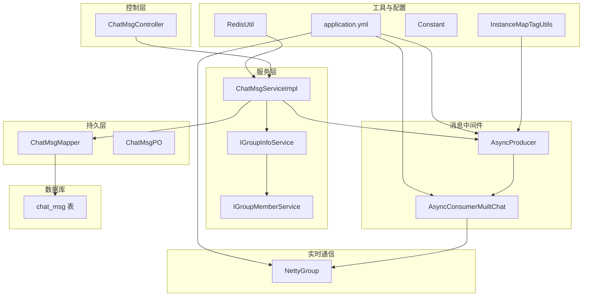
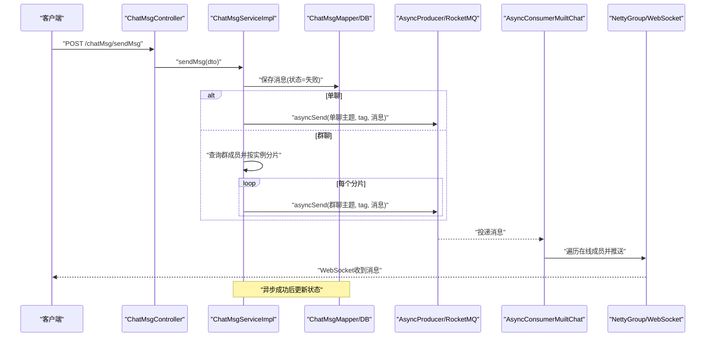
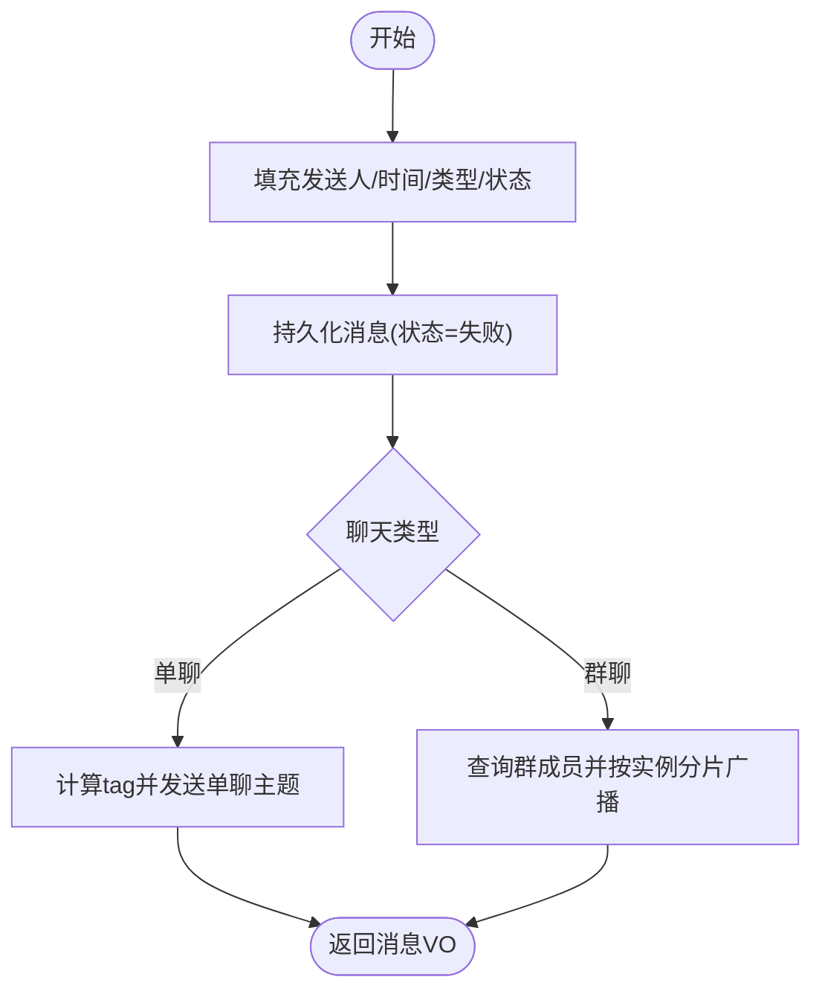
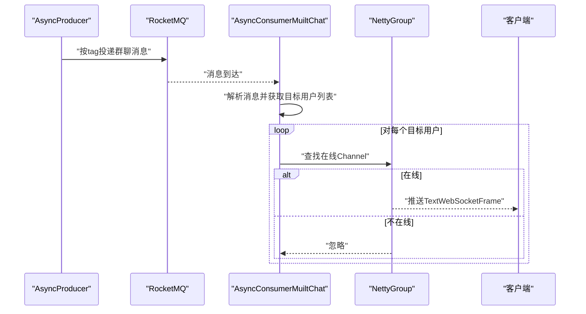
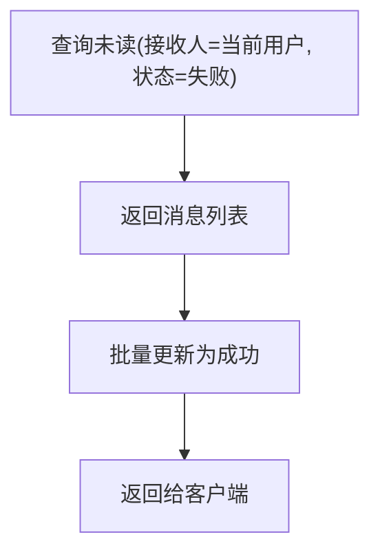
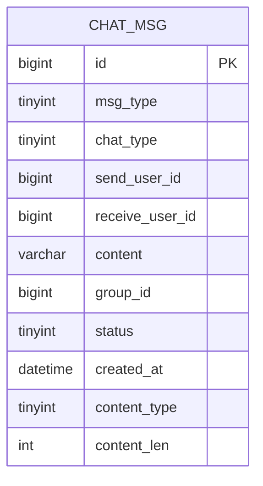
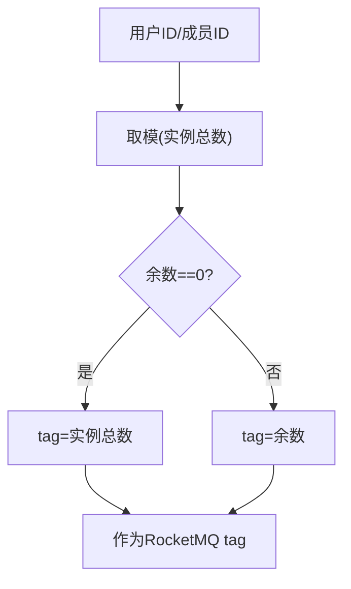
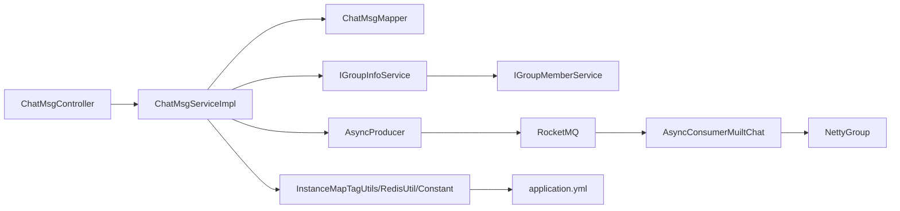

# 群组消息处理

<cite>
**本文引用的文件**
- [ChatMsgController.java](file://src/main/java/com/hch/chat_simple/controller/ChatMsgController.java)
- [ChatMsgServiceImpl.java](file://src/main/java/com/hch/chat_simple/service/impl/ChatMsgServiceImpl.java)
- [ChatMsgMapper.java](file://src/main/java/com/hch/chat_simple/mapper/ChatMsgMapper.java)
- [ChatMsgPO.java](file://src/main/java/com/hch/chat_simple/pojo/po/ChatMsgPO.java)
- [ChatMsgDTO.java](file://src/main/java/com/hch/chat_simple/pojo/dto/ChatMsgDTO.java)
- [AsyncProducer.java](file://src/main/java/com/hch/chat_simple/mq/AsyncProducer.java)
- [AsyncConsumerMuiltChat.java](file://src/main/java/com/hch/chat_simple/mq/AsyncConsumerMuiltChat.java)
- [InstanceMapTagUtils.java](file://src/main/java/com/hch/chat_simple/util/InstanceMapTagUtils.java)
- [RedisUtil.java](file://src/main/java/com/hch/chat_simple/util/RedisUtil.java)
- [MsgTypeEnum.java](file://src/main/java/com/hch/chat_simple/enums/MsgTypeEnum.java)
- [application.yml](file://src/main/resources/application.yml)
- [NettyGroup.java](file://src/main/java/com/hch/chat_simple/config/NettyGroup.java)
- [Constant.java](file://src/main/java/com/hch/chat_simple/util/Constant.java)
- [chat.sql](file://db/chat.sql)
- [IGroupInfoService.java](file://src/main/java/com/hch/chat_simple/service/IGroupInfoService.java)
- [IGroupMemberService.java](file://src/main/java/com/hch/chat_simple/service/IGroupMemberService.java)
- [GroupNotReadMsgQuery.java](file://src/main/java/com/hch/chat_simple/pojo/query/GroupNotReadMsgQuery.java)
</cite>

## 目录
1. [简介](#简介)
2. [项目结构](#项目结构)
3. [核心组件](#核心组件)
4. [架构总览](#架构总览)
5. [详细组件分析](#详细组件分析)
6. [依赖分析](#依赖分析)
7. [性能考虑](#性能考虑)
8. [故障排查指南](#故障排查指南)
9. [结论](#结论)
10. [附录](#附录)

## 简介
本文件面向“群组消息处理”子系统，围绕以下目标展开：消息发送流程（路由到群组成员、去重与状态跟踪）、消息存储与检索（持久化、历史记录、检索优化）、广播机制（多实例同步、分发策略、网络传输优化）、状态管理（发送中/已发送/已接收/已读转换与统计）、性能优化（批量/异步/缓存）、监控与统计（成功率、延迟、活跃度）、以及异常处理与重试保障。文档以代码为依据，辅以图示帮助不同背景读者理解。

## 项目结构
该工程采用典型的分层架构：控制层负责HTTP接口；服务层承载业务逻辑；持久层基于MyBatis-Plus；消息中间件RocketMQ负责异步解耦；Netty负责WebSocket实时广播；Redis用于简单键值操作；数据库提供消息与群组元数据存储。

图表来源
- [ChatMsgController.java:31-57](file://src/main/java/com/hch/chat_simple/controller/ChatMsgController.java#L31-L57)
- [ChatMsgServiceImpl.java:53-144](file://src/main/java/com/hch/chat_simple/service/impl/ChatMsgServiceImpl.java#L53-L144)
- [ChatMsgMapper.java:17-20](file://src/main/java/com/hch/chat_simple/mapper/ChatMsgMapper.java#L17-L20)
- [AsyncProducer.java:17-62](file://src/main/java/com/hch/chat_simple/mq/AsyncProducer.java#L17-L62)
- [AsyncConsumerMuiltChat.java:31-91](file://src/main/java/com/hch/chat_simple/mq/AsyncConsumerMuiltChat.java#L31-L91)
- [NettyGroup.java:11-29](file://src/main/java/com/hch/chat_simple/config/NettyGroup.java#L11-L29)
- [InstanceMapTagUtils.java:14-54](file://src/main/java/com/hch/chat_simple/util/InstanceMapTagUtils.java#L14-L54)
- [application.yml:39-89](file://src/main/resources/application.yml#L39-L89)
- [chat.sql:37-54](file://db/chat.sql#L37-L54)

章节来源
- [ChatMsgController.java:31-57](file://src/main/java/com/hch/chat_simple/controller/ChatMsgController.java#L31-L57)
- [application.yml:1-89](file://src/main/resources/application.yml#L1-L89)

## 核心组件
- 控制器：对外提供消息发送、未读消息拉取、群聊未读查询等接口。
- 服务实现：封装消息发送、持久化、状态管理、群成员查询与广播分发。
- 持久层：基于MyBatis-Plus的Mapper与实体模型，支撑消息写入与查询。
- RocketMQ：异步生产者负责消息投递，消费者负责群组消息的实时广播。
- Netty：维护在线用户通道，按用户映射进行消息推送。
- 工具与配置：实例分片标签、Redis工具、常量定义、应用配置。

章节来源
- [ChatMsgController.java:31-57](file://src/main/java/com/hch/chat_simple/controller/ChatMsgController.java#L31-L57)
- [ChatMsgServiceImpl.java:53-183](file://src/main/java/com/hch/chat_simple/service/impl/ChatMsgServiceImpl.java#L53-L183)
- [ChatMsgMapper.java:17-20](file://src/main/java/com/hch/chat_simple/mapper/ChatMsgMapper.java#L17-L20)
- [AsyncProducer.java:17-62](file://src/main/java/com/hch/chat_simple/mq/AsyncProducer.java#L17-L62)
- [AsyncConsumerMuiltChat.java:31-91](file://src/main/java/com/hch/chat_simple/mq/AsyncConsumerMuiltChat.java#L31-L91)
- [NettyGroup.java:11-29](file://src/main/java/com/hch/chat_simple/config/NettyGroup.java#L11-L29)
- [InstanceMapTagUtils.java:14-54](file://src/main/java/com/hch/chat_simple/util/InstanceMapTagUtils.java#L14-L54)
- [application.yml:39-89](file://src/main/resources/application.yml#L39-L89)

## 架构总览
系统采用“请求-持久化-异步广播-实时推送”的链路。发送消息时先落库并标记为“发送失败”，随后通过RocketMQ按实例分片广播至各节点，节点消费后通过Netty向在线成员推送WebSocket消息。未读消息查询与群聊未读查询分别针对单聊与群聊场景提供高效检索。

图表来源
- [ChatMsgController.java:45-49](file://src/main/java/com/hch/chat_simple/controller/ChatMsgController.java#L45-L49)
- [ChatMsgServiceImpl.java:98-144](file://src/main/java/com/hch/chat_simple/service/impl/ChatMsgServiceImpl.java#L98-L144)
- [AsyncProducer.java:40-59](file://src/main/java/com/hch/chat_simple/mq/AsyncProducer.java#L40-L59)
- [AsyncConsumerMuiltChat.java:57-83](file://src/main/java/com/hch/chat_simple/mq/AsyncConsumerMuiltChat.java#L57-L83)
- [NettyGroup.java:11-29](file://src/main/java/com/hch/chat_simple/config/NettyGroup.java#L11-L29)

## 详细组件分析

### 组件A：消息发送与持久化
- 流程要点
  - 接收消息DTO，填充发送人、时间、消息类型与状态（默认失败）。
  - 先持久化，再根据聊天类型选择路径：单聊按接收人分片；群聊查询成员并按实例分片广播。
  - 返回消息VO供前端展示。
- 关键点
  - 状态字段用于后续统计与重试：发送失败时可被重新拉取。
  - 群聊消息携带“目标用户列表”，消费端无需再次查询。

图表来源
- [ChatMsgServiceImpl.java:98-144](file://src/main/java/com/hch/chat_simple/service/impl/ChatMsgServiceImpl.java#L98-L144)
- [ChatMsgPO.java:18-53](file://src/main/java/com/hch/chat_simple/pojo/po/ChatMsgPO.java#L18-L53)
- [ChatMsgDTO.java:13-61](file://src/main/java/com/hch/chat_simple/pojo/dto/ChatMsgDTO.java#L13-L61)

章节来源
- [ChatMsgServiceImpl.java:98-144](file://src/main/java/com/hch/chat_simple/service/impl/ChatMsgServiceImpl.java#L98-L144)
- [ChatMsgPO.java:18-53](file://src/main/java/com/hch/chat_simple/pojo/po/ChatMsgPO.java#L18-L53)
- [ChatMsgDTO.java:13-61](file://src/main/java/com/hch/chat_simple/pojo/dto/ChatMsgDTO.java#L13-L61)

### 组件B：群组消息广播与实时推送
- 广播策略
  - 生产端按实例分片将消息投递到RocketMQ，tag对应实例编号。
  - 消费端遍历消息中的目标用户集合，仅向在线成员推送。
- 实时推送
  - 使用Netty维护用户到Channel的映射，命中即推送WebSocket文本帧。
- 权限与过滤
  - 当前消费端会跳过发送人自身，避免自收消息。

图表来源
- [AsyncProducer.java:40-59](file://src/main/java/com/hch/chat_simple/mq/AsyncProducer.java#L40-L59)
- [AsyncConsumerMuiltChat.java:57-83](file://src/main/java/com/hch/chat_simple/mq/AsyncConsumerMuiltChat.java#L57-L83)
- [NettyGroup.java:11-29](file://src/main/java/com/hch/chat_simple/config/NettyGroup.java#L11-L29)

章节来源
- [AsyncConsumerMuiltChat.java:57-83](file://src/main/java/com/hch/chat_simple/mq/AsyncConsumerMuiltChat.java#L57-L83)
- [NettyGroup.java:11-29](file://src/main/java/com/hch/chat_simple/config/NettyGroup.java#L11-L29)

### 组件C：消息去重与状态跟踪
- 去重策略
  - 未读消息拉取接口限定接收人为当前用户且状态为“发送失败”，拉取后批量更新为“发送成功”，避免重复拉取。
- 状态字段
  - 消息表包含状态字段，配合业务侧统计与重试。

图表来源
- [ChatMsgServiceImpl.java:71-95](file://src/main/java/com/hch/chat_simple/service/impl/ChatMsgServiceImpl.java#L71-L95)
- [Constant.java:8-11](file://src/main/java/com/hch/chat_simple/util/Constant.java#L8-L11)

章节来源
- [ChatMsgServiceImpl.java:71-95](file://src/main/java/com/hch/chat_simple/service/impl/ChatMsgServiceImpl.java#L71-L95)
- [Constant.java:8-11](file://src/main/java/com/hch/chat_simple/util/Constant.java#L8-L11)

### 组件D：消息存储与检索优化
- 存储模型
  - 消息表包含消息类型、聊天类型、发送人、接收人、群组ID、状态、内容类型与长度等字段，支持单聊与群聊。
- 历史与检索
  - 提供群聊未读查询接口，按“群ID+最后消息ID”组合条件进行范围查询，避免全表扫描。
- 索引建议
  - 建议在群聊场景下对群ID与主键ID建立联合索引以优化范围查询。

图表来源
- [chat.sql:37-54](file://db/chat.sql#L37-L54)
- [ChatMsgPO.java:18-53](file://src/main/java/com/hch/chat_simple/pojo/po/ChatMsgPO.java#L18-L53)

章节来源
- [chat.sql:37-54](file://db/chat.sql#L37-L54)
- [ChatMsgServiceImpl.java:146-181](file://src/main/java/com/hch/chat_simple/service/impl/ChatMsgServiceImpl.java#L146-L181)

### 组件E：实例分片与多实例同步
- 分片规则
  - 通过用户ID或群成员ID对实例总数取模，得到tag，保证同一用户的消息稳定落到同一实例。
- 同步策略
  - 群聊消息按成员维度分片广播，确保多实例环境下消息可达性。

图表来源
- [InstanceMapTagUtils.java:32-47](file://src/main/java/com/hch/chat_simple/util/InstanceMapTagUtils.java#L32-L47)
- [application.yml:76-82](file://src/main/resources/application.yml#L76-L82)

章节来源
- [InstanceMapTagUtils.java:32-47](file://src/main/java/com/hch/chat_simple/util/InstanceMapTagUtils.java#L32-L47)
- [application.yml:76-82](file://src/main/resources/application.yml#L76-L82)

### 组件F：消息类型与枚举
- 消息类型枚举覆盖上线、聊天消息、下线、好友申请、结果、关系变更、群成员变更等，便于统一处理与扩展。

章节来源
- [MsgTypeEnum.java:6-15](file://src/main/java/com/hch/chat_simple/enums/MsgTypeEnum.java#L6-L15)

## 依赖分析
- 控制层依赖服务层；服务层依赖持久层、消息中间件、群信息服务、工具类与配置。
- RocketMQ生产者与消费者通过主题与tag解耦，实现跨实例广播。
- NettyGroup提供全局通道与用户映射，支撑实时推送。

图表来源
- [ChatMsgController.java:31-57](file://src/main/java/com/hch/chat_simple/controller/ChatMsgController.java#L31-L57)
- [ChatMsgServiceImpl.java:53-144](file://src/main/java/com/hch/chat_simple/service/impl/ChatMsgServiceImpl.java#L53-L144)
- [AsyncProducer.java:17-62](file://src/main/java/com/hch/chat_simple/mq/AsyncProducer.java#L17-L62)
- [AsyncConsumerMuiltChat.java:31-91](file://src/main/java/com/hch/chat_simple/mq/AsyncConsumerMuiltChat.java#L31-L91)
- [NettyGroup.java:11-29](file://src/main/java/com/hch/chat_simple/config/NettyGroup.java#L11-L29)
- [InstanceMapTagUtils.java:14-54](file://src/main/java/com/hch/chat_simple/util/InstanceMapTagUtils.java#L14-L54)
- [application.yml:39-89](file://src/main/resources/application.yml#L39-L89)

章节来源
- [ChatMsgServiceImpl.java:53-144](file://src/main/java/com/hch/chat_simple/service/impl/ChatMsgServiceImpl.java#L53-L144)
- [AsyncProducer.java:17-62](file://src/main/java/com/hch/chat_simple/mq/AsyncProducer.java#L17-L62)
- [AsyncConsumerMuiltChat.java:31-91](file://src/main/java/com/hch/chat_simple/mq/AsyncConsumerMuiltChat.java#L31-L91)
- [NettyGroup.java:11-29](file://src/main/java/com/hch/chat_simple/config/NettyGroup.java#L11-L29)
- [application.yml:39-89](file://src/main/resources/application.yml#L39-L89)

## 性能考虑
- 异步解耦
  - 生产端异步发送，降低请求时延；消费端固定线程池并发处理，避免阻塞。
- 批量处理
  - 未读消息拉取后批量更新状态，减少多次写入。
- 缓存与分片
  - 使用实例分片tag，提高消息路由效率；Redis工具提供简单KV能力（当前主要用于其他模块，消息路径可按需扩展）。
- 网络传输优化
  - WebSocket直连推送，消费端仅对在线用户发送，避免无效网络开销。
- 数据库优化
  - 群聊未读查询采用“群ID+最后消息ID”组合条件，建议在数据库层面建立合适索引以提升范围查询性能。

章节来源
- [ChatMsgServiceImpl.java:71-95](file://src/main/java/com/hch/chat_simple/service/impl/ChatMsgServiceImpl.java#L71-L95)
- [ChatMsgServiceImpl.java:146-181](file://src/main/java/com/hch/chat_simple/service/impl/ChatMsgServiceImpl.java#L146-L181)
- [AsyncConsumerMuiltChat.java:42-83](file://src/main/java/com/hch/chat_simple/mq/AsyncConsumerMuiltChat.java#L42-L83)
- [InstanceMapTagUtils.java:32-47](file://src/main/java/com/hch/chat_simple/util/InstanceMapTagUtils.java#L32-L47)
- [chat.sql:37-54](file://db/chat.sql#L37-L54)

## 故障排查指南
- 消息未送达
  - 检查RocketMQ主题与tag配置是否正确；确认生产端日志与回调异常。
  - 消费端是否正确解析消息并命中在线用户映射。
- 状态不一致
  - 未读拉取后应批量更新为“发送成功”，若仍出现重复拉取，检查批量更新逻辑。
- 群成员未收到消息
  - 确认群成员查询是否正确；检查tag分片是否与实例部署一致。
- WebSocket未推送
  - 检查Netty用户映射是否存在；确认通道有效性。

章节来源
- [AsyncProducer.java:40-59](file://src/main/java/com/hch/chat_simple/mq/AsyncProducer.java#L40-L59)
- [AsyncConsumerMuiltChat.java:57-83](file://src/main/java/com/hch/chat_simple/mq/AsyncConsumerMuiltChat.java#L57-L83)
- [NettyGroup.java:11-29](file://src/main/java/com/hch/chat_simple/config/NettyGroup.java#L11-L29)
- [ChatMsgServiceImpl.java:71-95](file://src/main/java/com/hch/chat_simple/service/impl/ChatMsgServiceImpl.java#L71-L95)

## 结论
本系统通过“持久化+异步消息+实时推送”的组合，实现了高吞吐、低时延的群组消息处理能力。通过实例分片与多实例广播，确保消息在分布式环境下的可靠触达；通过状态字段与批量更新，实现去重与可恢复。未来可在数据库索引、消息幂等与更细粒度的监控指标方面进一步增强。

## 附录
- 接口清单
  - 未读消息拉取：POST /chatMsg/selectNotReadMsg
  - 发送消息：POST /chatMsg/sendMsg
  - 群聊未读查询：POST /chatMsg/selectGroupChatMsgNotRead
- 关键配置
  - RocketMQ主题与消费者组、Redis连接、实例分片列表等均在应用配置中集中管理。

章节来源
- [ChatMsgController.java:39-55](file://src/main/java/com/hch/chat_simple/controller/ChatMsgController.java#L39-L55)
- [application.yml:39-89](file://src/main/resources/application.yml#L39-L89)