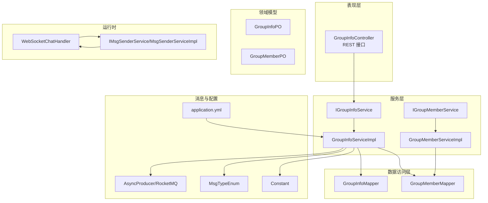
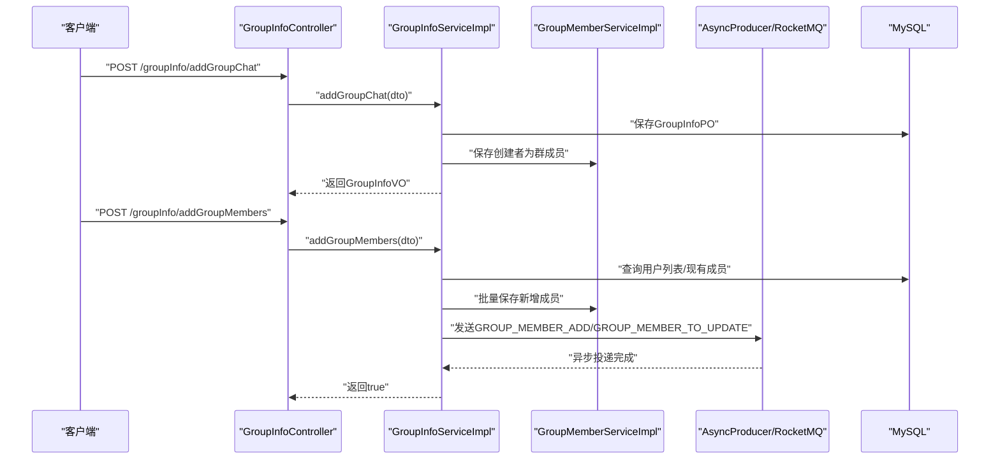
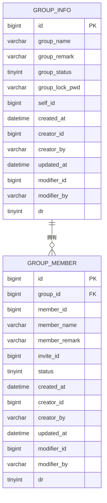
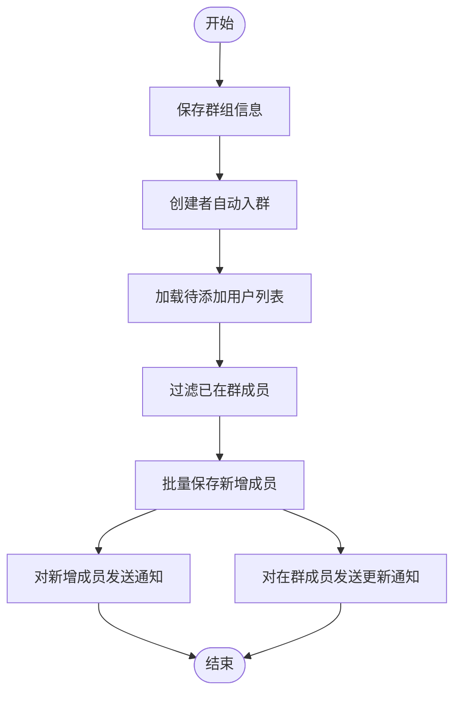
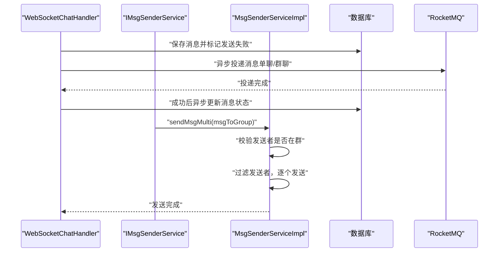
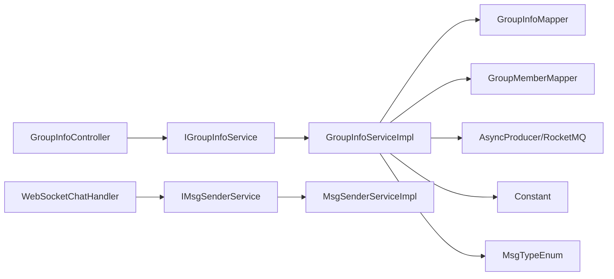

# 群组管理系统

<cite>
**本文引用的文件**
- [GroupInfoPO.java](file://src/main/java/com/hch/chat_simple/pojo/po/GroupInfoPO.java)
- [GroupMemberPO.java](file://src/main/java/com/hch/chat_simple/pojo/po/GroupMemberPO.java)
- [GroupInfoController.java](file://src/main/java/com/hch/chat_simple/controller/GroupInfoController.java)
- [IGroupInfoService.java](file://src/main/java/com/hch/chat_simple/service/IGroupInfoService.java)
- [GroupInfoServiceImpl.java](file://src/main/java/com/hch/chat_simple/service/impl/GroupInfoServiceImpl.java)
- [IGroupMemberService.java](file://src/main/java/com/hch/chat_simple/service/IGroupMemberService.java)
- [GroupMemberServiceImpl.java](file://src/main/java/com/hch/chat_simple/service/impl/GroupMemberServiceImpl.java)
- [GroupInfoMapper.java](file://src/main/java/com/hch/chat_simple/mapper/GroupInfoMapper.java)
- [GroupMemberMapper.java](file://src/main/java/com/hch/chat_simple/mapper/GroupMemberMapper.java)
- [AddGroupMembersDTO.java](file://src/main/java/com/hch/chat_simple/pojo/dto/AddGroupMembersDTO.java)
- [MsgTypeEnum.java](file://src/main/java/com/hch/chat_simple/enums/MsgTypeEnum.java)
- [Constant.java](file://src/main/java/com/hch/chat_simple/util/Constant.java)
- [application.yml](file://src/main/resources/application.yml)
- [chat.sql](file://db/chat.sql)
- [WebSocketChatHandler.java](file://src/main/java/com/hch/chat_simple/handler/WebSocketChatHandler.java)
- [IMsgSenderService.java](file://src/main/java/com/hch/chat_simple/service/IMsgSenderService.java)
- [MsgSenderServiceImpl.java](file://src/main/java/com/hch/chat_simple/service/impl/MsgSenderServiceImpl.java)
</cite>

## 目录
1. [简介](#简介)
2. [项目结构](#项目结构)
3. [核心组件](#核心组件)
4. [架构总览](#架构总览)
5. [详细组件分析](#详细组件分析)
6. [依赖分析](#依赖分析)
7. [性能考虑](#性能考虑)
8. [故障排查指南](#故障排查指南)
9. [结论](#结论)
10. [附录](#附录)

## 简介
本文件面向群组管理系统，围绕群组创建、成员管理与权限控制展开，系统采用Spring Boot + MyBatis-Plus + RocketMQ + Netty + Redis/Redisson的组合架构。重点覆盖以下方面：
- 群组实体模型设计：GroupInfoPO（群组信息）与GroupMemberPO（群成员）的数据结构、字段语义与关系映射。
- 服务层实现：群组创建、成员添加、成员列表查询等业务流程与事务控制。
- 控制器API设计：RESTful风格的群组与成员管理接口。
- 权限与角色体系：基于成员状态与邀请关系的权限边界。
- 消息处理机制：群聊消息广播、消息去重与历史记录策略。
- 并发控制与一致性：分布式实例映射、消息队列异步通知与幂等处理。

## 项目结构
系统按分层组织，主要模块如下：
- 控制器层：对外暴露REST API，如群组创建、成员查询与添加。
- 服务层：封装业务逻辑，负责事务控制、调用持久层与消息队列。
- 数据访问层：MyBatis-Plus Mapper接口，提供基础CRUD能力。
- 实体与DTO/VO：PO（持久化对象）、DTO（请求参数）、VO（响应视图）。
- 配置与工具：应用配置、常量、消息类型枚举、消息发送与WebSocket处理。
- 数据库：MySQL建表脚本，包含群组与成员表结构。

图表来源
- [GroupInfoController.java:30-67](file://src/main/java/com/hch/chat_simple/controller/GroupInfoController.java#L30-L67)
- [IGroupInfoService.java:21-30](file://src/main/java/com/hch/chat_simple/service/IGroupInfoService.java#L21-L30)
- [GroupInfoServiceImpl.java:44-142](file://src/main/java/com/hch/chat_simple/service/impl/GroupInfoServiceImpl.java#L44-L142)
- [IGroupMemberService.java:18-20](file://src/main/java/com/hch/chat_simple/service/IGroupMemberService.java#L18-L20)
- [GroupMemberServiceImpl.java:17-20](file://src/main/java/com/hch/chat_simple/service/impl/GroupMemberServiceImpl.java#L17-L20)
- [GroupInfoMapper.java:17-18](file://src/main/java/com/hch/chat_simple/mapper/GroupInfoMapper.java#L17-L18)
- [GroupMemberMapper.java:17-18](file://src/main/java/com/hch/chat_simple/mapper/GroupMemberMapper.java#L17-L18)
- [application.yml:39-51](file://src/main/resources/application.yml#L39-L51)
- [MsgTypeEnum.java:6-15](file://src/main/java/com/hch/chat_simple/enums/MsgTypeEnum.java#L6-L15)
- [Constant.java:23-25](file://src/main/java/com/hch/chat_simple/util/Constant.java#L23-L25)
- [WebSocketChatHandler.java:50-195](file://src/main/java/com/hch/chat_simple/handler/WebSocketChatHandler.java#L50-L195)
- [IMsgSenderService.java:5-10](file://src/main/java/com/hch/chat_simple/service/IMsgSenderService.java#L5-L10)
- [MsgSenderServiceImpl.java:25-78](file://src/main/java/com/hch/chat_simple/service/impl/MsgSenderServiceImpl.java#L25-L78)

章节来源
- [GroupInfoController.java:30-67](file://src/main/java/com/hch/chat_simple/controller/GroupInfoController.java#L30-L67)
- [application.yml:1-89](file://src/main/resources/application.yml#L1-L89)

## 核心组件
本节聚焦群组实体模型、服务层与控制器的关键职责与交互。

- 实体模型
  - GroupInfoPO：群组基本信息，包含群名称、群备注、群状态、进入密码、所属人等字段，并继承通用审计字段。
  - GroupMemberPO：群成员信息，包含成员ID、成员名称、群内备注、邀请人、成员状态等字段，并继承通用审计字段。
- 服务层
  - IGroupInfoService：定义群组创建、成员查询、批量添加成员等接口。
  - GroupInfoServiceImpl：实现群组创建（含创建者自动入群）、成员查询（在群/全部）、批量添加成员（去重、通知）。
  - IGroupMemberService：群成员服务接口（默认继承MyBatis-Plus基础能力）。
  - GroupMemberServiceImpl：群成员服务实现（默认继承MyBatis-Plus基础能力）。
- 控制器
  - GroupInfoController：提供群组创建、成员查询、批量添加成员等REST接口，返回统一Payload包装。

章节来源
- [GroupInfoPO.java:27-49](file://src/main/java/com/hch/chat_simple/pojo/po/GroupInfoPO.java#L27-L49)
- [GroupMemberPO.java:23-48](file://src/main/java/com/hch/chat_simple/pojo/po/GroupMemberPO.java#L23-L48)
- [IGroupInfoService.java:21-30](file://src/main/java/com/hch/chat_simple/service/IGroupInfoService.java#L21-L30)
- [GroupInfoServiceImpl.java:44-142](file://src/main/java/com/hch/chat_simple/service/impl/GroupInfoServiceImpl.java#L44-L142)
- [IGroupMemberService.java:18-20](file://src/main/java/com/hch/chat_simple/service/IGroupMemberService.java#L18-L20)
- [GroupMemberServiceImpl.java:17-20](file://src/main/java/com/hch/chat_simple/service/impl/GroupMemberServiceImpl.java#L17-L20)
- [GroupInfoController.java:30-67](file://src/main/java/com/hch/chat_simple/controller/GroupInfoController.java#L30-L67)

## 架构总览
系统采用“控制器-服务-持久层”三层架构，结合消息队列实现异步通知与广播，WebSocket负责实时消息通道。

图表来源
- [GroupInfoController.java:39-59](file://src/main/java/com/hch/chat_simple/controller/GroupInfoController.java#L39-L59)
- [GroupInfoServiceImpl.java:61-141](file://src/main/java/com/hch/chat_simple/service/impl/GroupInfoServiceImpl.java#L61-L141)
- [GroupMemberServiceImpl.java:17-20](file://src/main/java/com/hch/chat_simple/service/impl/GroupMemberServiceImpl.java#L17-L20)
- [application.yml:39-51](file://src/main/resources/application.yml#L39-L51)

## 详细组件分析

### 实体模型与关系映射
- 字段与约束
  - GroupInfoPO：自增主键、群名称、群备注、群状态（0-3）、进入密码、所属人ID等。
  - GroupMemberPO：自增主键、群组ID、成员ID、成员名称、群内备注、邀请人、成员状态（0/1），并包含通用审计字段。
- 关系映射
  - 一对多：GroupInfoPO(id) ←→ GroupMemberPO(groupId)。
  - 成员状态字段用于区分“在群/离开”，支持查询在群成员与全量成员两种视图。
- 数据库脚本
  - 群组表与成员表均包含逻辑删除字段与审计字段，确保数据可追溯与安全删除。

图表来源
- [chat.sql:56-89](file://db/chat.sql#L56-L89)
- [GroupInfoPO.java:27-49](file://src/main/java/com/hch/chat_simple/pojo/po/GroupInfoPO.java#L27-L49)
- [GroupMemberPO.java:23-48](file://src/main/java/com/hch/chat_simple/pojo/po/GroupMemberPO.java#L23-L48)

章节来源
- [chat.sql:56-89](file://db/chat.sql#L56-L89)
- [GroupInfoPO.java:27-49](file://src/main/java/com/hch/chat_simple/pojo/po/GroupInfoPO.java#L27-L49)
- [GroupMemberPO.java:23-48](file://src/main/java/com/hch/chat_simple/pojo/po/GroupMemberPO.java#L23-L48)

### 服务层实现逻辑
- 群组创建
  - 设置所属人为当前用户，保存群组信息，再将创建者自动作为首个成员加入群组。
  - 使用事务保证创建与初始成员入库的一致性。
- 成员查询
  - 在群成员查询：仅返回状态为“在群”的成员。
  - 全量成员查询：返回该群所有成员（包含已离开）。
- 批量添加成员
  - 去重：先查询现有在群成员，过滤掉已存在成员。
  - 异步通知：对新增成员发送“成员添加”通知；对已有成员发送“成员更新”通知，触发前端刷新。
  - 使用RocketMQ主题“composition”进行跨实例广播。

图表来源
- [GroupInfoServiceImpl.java:61-141](file://src/main/java/com/hch/chat_simple/service/impl/GroupInfoServiceImpl.java#L61-L141)
- [MsgTypeEnum.java:13-14](file://src/main/java/com/hch/chat_simple/enums/MsgTypeEnum.java#L13-L14)
- [application.yml:47-51](file://src/main/resources/application.yml#L47-L51)

章节来源
- [GroupInfoServiceImpl.java:44-142](file://src/main/java/com/hch/chat_simple/service/impl/GroupInfoServiceImpl.java#L44-L142)
- [IGroupInfoService.java:21-30](file://src/main/java/com/hch/chat_simple/service/IGroupInfoService.java#L21-L30)
- [AddGroupMembersDTO.java:10-15](file://src/main/java/com/hch/chat_simple/pojo/dto/AddGroupMembersDTO.java#L10-L15)

### 控制器API设计
- 群组创建
  - 方法：POST
  - 路径：/groupInfo/addGroupChat
  - 请求体：GroupInfoDTO
  - 返回：Payload包装的GroupInfoVO
- 查询群成员
  - 方法：GET
  - 路径：/groupInfo/findGroupMemberById
  - 参数：groupId
  - 返回：Payload包装的成员列表（仅在群）
- 批量添加成员
  - 方法：POST
  - 路径：/groupInfo/addGroupMembers
  - 请求体：AddGroupMembersDTO（包含groupId与userIds）
  - 返回：Payload包装的布尔值
- 查询全部成员（含离开）
  - 方法：GET
  - 路径：/groupInfo/findAllGroupMemberById
  - 参数：groupId
  - 返回：Payload包装的成员列表（全部）

章节来源
- [GroupInfoController.java:39-66](file://src/main/java/com/hch/chat_simple/controller/GroupInfoController.java#L39-L66)

### 权限与角色体系
- 角色与状态
  - 群主：群组所属人（selfId），具备最高权限。
  - 管理员/普通成员：通过成员状态与邀请关系体现，当前代码未显式区分管理员角色。
  - 成员状态：在群（1）/离开（0），用于筛选可见成员。
- 权限边界
  - 当前实现以成员状态与邀请人字段为主，未见专门的管理员角色字段。若需扩展，可在GroupMemberPO中增加角色字段并在服务层校验。

章节来源
- [GroupInfoPO.java:46-47](file://src/main/java/com/hch/chat_simple/pojo/po/GroupInfoPO.java#L46-L47)
- [GroupMemberPO.java:42-46](file://src/main/java/com/hch/chat_simple/pojo/po/GroupMemberPO.java#L42-L46)
- [Constant.java:23-25](file://src/main/java/com/hch/chat_simple/util/Constant.java#L23-L25)

### 群组消息处理机制
- 群聊消息广播
  - WebSocket接入：通过WebSocketChatHandler建立会话，解析消息并写入数据库，标记发送状态为失败，成功后异步更新。
  - 群发策略：MsgSenderServiceImpl根据群成员列表进行广播，过滤消息发送者自身。
- 消息去重与历史记录
  - 去重：发送时以ChannelId映射判断接收方在线状态，避免重复发送。
  - 历史记录：离线消息暂存数据库，上线后由客户端拉取。
- 异步通知
  - 成员变更：通过RocketMQ主题“composition”异步通知其他实例，实现跨实例同步。

图表来源
- [WebSocketChatHandler.java:72-109](file://src/main/java/com/hch/chat_simple/handler/WebSocketChatHandler.java#L72-L109)
- [MsgSenderServiceImpl.java:60-77](file://src/main/java/com/hch/chat_simple/service/impl/MsgSenderServiceImpl.java#L60-L77)
- [application.yml:39-51](file://src/main/resources/application.yml#L39-L51)

章节来源
- [WebSocketChatHandler.java:50-195](file://src/main/java/com/hch/chat_simple/handler/WebSocketChatHandler.java#L50-L195)
- [IMsgSenderService.java:5-10](file://src/main/java/com/hch/chat_simple/service/IMsgSenderService.java#L5-L10)
- [MsgSenderServiceImpl.java:25-78](file://src/main/java/com/hch/chat_simple/service/impl/MsgSenderServiceImpl.java#L25-L78)

### 并发控制与一致性保证
- 分布式实例映射
  - 通过Redis/Redisson与实例标签（chat.tag.list）实现实例与消息标签映射，确保消息路由到目标实例。
- 事务一致性
  - 群组创建与初始成员加入使用@Transactional保证原子性。
  - 成员批量添加后通过RocketMQ异步通知，结合消息幂等标识（如消息类型+用户ID+群组JSON）实现最终一致。
- 幂等与去重
  - 消息发送侧以ChannelId映射与发送结果监听实现去重。
  - 建议在MQ消费侧增加幂等键（如消息ID/去重哈希）防止重复处理。

章节来源
- [application.yml:74-83](file://src/main/resources/application.yml#L74-L83)
- [GroupInfoServiceImpl.java:60-80](file://src/main/java/com/hch/chat_simple/service/impl/GroupInfoServiceImpl.java#L60-L80)
- [GroupInfoServiceImpl.java:101-141](file://src/main/java/com/hch/chat_simple/service/impl/GroupInfoServiceImpl.java#L101-L141)

## 依赖分析
- 组件耦合
  - 控制器依赖服务接口；服务实现依赖Mapper与消息生产者；实体PO与数据库表一一对应。
- 外部依赖
  - RocketMQ：异步通知与广播。
  - MySQL：持久化存储。
  - Redis/Redisson：实例映射与标签路由。
  - Netty：WebSocket会话管理与消息发送。

图表来源
- [GroupInfoController.java:30-67](file://src/main/java/com/hch/chat_simple/controller/GroupInfoController.java#L30-L67)
- [IGroupInfoService.java:21-30](file://src/main/java/com/hch/chat_simple/service/IGroupInfoService.java#L21-L30)
- [GroupInfoServiceImpl.java:44-142](file://src/main/java/com/hch/chat_simple/service/impl/GroupInfoServiceImpl.java#L44-L142)
- [GroupInfoMapper.java:17-18](file://src/main/java/com/hch/chat_simple/mapper/GroupInfoMapper.java#L17-L18)
- [GroupMemberMapper.java:17-18](file://src/main/java/com/hch/chat_simple/mapper/GroupMemberMapper.java#L17-L18)
- [WebSocketChatHandler.java:50-195](file://src/main/java/com/hch/chat_simple/handler/WebSocketChatHandler.java#L50-L195)
- [IMsgSenderService.java:5-10](file://src/main/java/com/hch/chat_simple/service/IMsgSenderService.java#L5-L10)
- [MsgSenderServiceImpl.java:25-78](file://src/main/java/com/hch/chat_simple/service/impl/MsgSenderServiceImpl.java#L25-L78)

章节来源
- [application.yml:39-83](file://src/main/resources/application.yml#L39-L83)

## 性能考虑
- 批量操作
  - 批量保存成员使用saveBatch减少往返次数。
- 异步解耦
  - 成员变更通过RocketMQ异步通知，降低主流程延迟。
- 连接池与线程池
  - Netty固定线程池（16）用于消息发送，建议根据QPS调整。
- 数据库优化
  - 建议为group_id、member_id、status等常用查询字段建立索引，提升查询效率。

## 故障排查指南
- 群组创建失败
  - 检查事务是否生效、所属人ID是否正确、数据库连接与MyBatis配置。
- 成员添加无效
  - 确认过滤逻辑是否正确（已存在成员会被跳过）、RocketMQ主题配置是否一致。
- 消息未送达
  - 检查WebSocket会话是否建立、ChannelId映射是否正确、Netty线程池是否阻塞。
- 实例间不同步
  - 核对实例标签配置与消息标签映射，确认RocketMQ消费者组配置。

章节来源
- [GroupInfoServiceImpl.java:101-141](file://src/main/java/com/hch/chat_simple/service/impl/GroupInfoServiceImpl.java#L101-L141)
- [WebSocketChatHandler.java:118-163](file://src/main/java/com/hch/chat_simple/handler/WebSocketChatHandler.java#L118-L163)
- [application.yml:39-83](file://src/main/resources/application.yml#L39-L83)

## 结论
本系统以清晰的分层架构实现了群组创建、成员管理与消息广播的核心能力。通过事务与消息队列保障一致性与可扩展性，结合WebSocket实现实时通信。建议后续增强管理员角色字段与权限校验、完善MQ消费幂等与错误重试策略，并针对高频查询建立索引以提升性能。

## 附录
- 数据库建表脚本参考：[chat.sql:56-89](file://db/chat.sql#L56-L89)
- 应用配置参考：[application.yml:1-89](file://src/main/resources/application.yml#L1-L89)