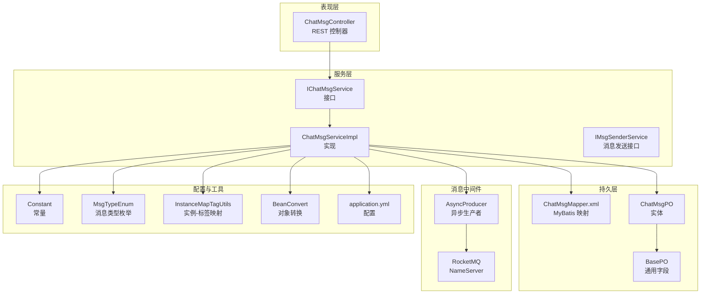
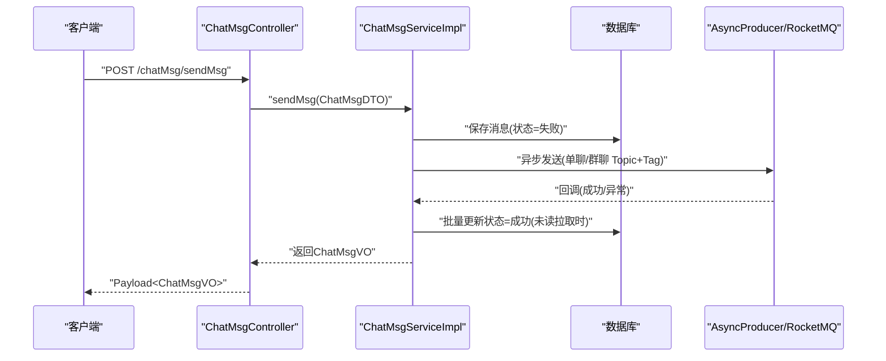
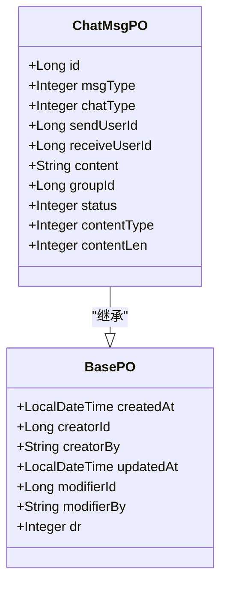
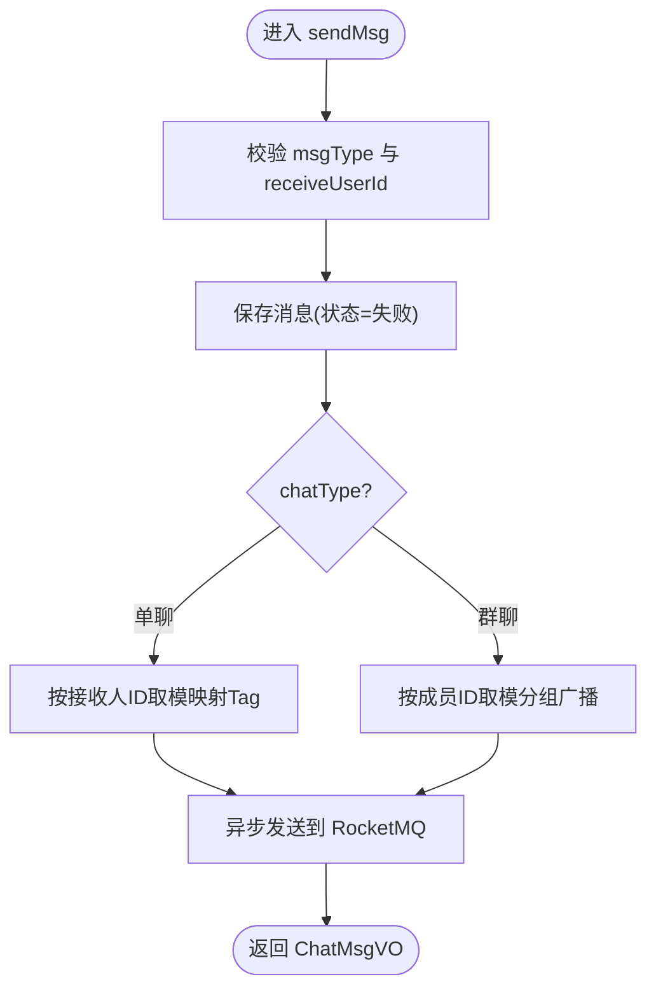
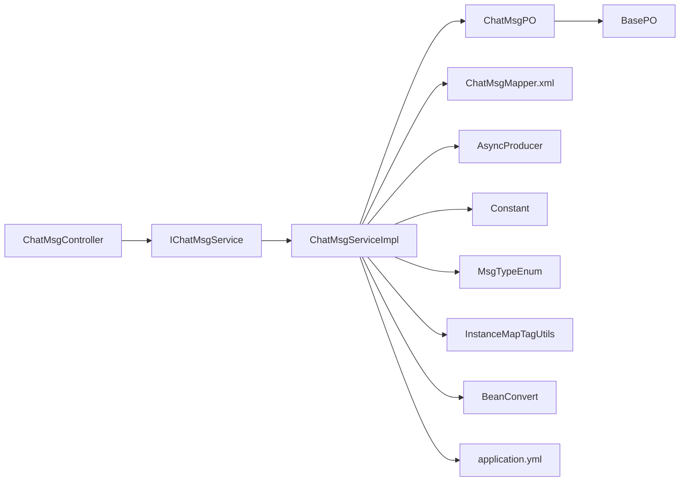

# 聊天消息模块

<cite>
**本文引用的文件**
- [ChatMsgPO.java](file://src/main/java/com/hch/chat_simple/pojo/po/ChatMsgPO.java)
- [ChatMsgDTO.java](file://src/main/java/com/hch/chat_simple/pojo/dto/ChatMsgDTO.java)
- [ChatMsgVO.java](file://src/main/java/com/hch/chat_simple/pojo/vo/ChatMsgVO.java)
- [ChatMsgController.java](file://src/main/java/com/hch/chat_simple/controller/ChatMsgController.java)
- [IChatMsgService.java](file://src/main/java/com/hch/chat_simple/service/IChatMsgService.java)
- [ChatMsgServiceImpl.java](file://src/main/java/com/hch/chat_simple/service/impl/ChatMsgServiceImpl.java)
- [MsgTypeEnum.java](file://src/main/java/com/hch/chat_simple/enums/MsgTypeEnum.java)
- [Constant.java](file://src/main/java/com/hch/chat_simple/util/Constant.java)
- [InstanceMapTagUtils.java](file://src/main/java/com/hch/chat_simple/util/InstanceMapTagUtils.java)
- [AsyncProducer.java](file://src/main/java/com/hch/chat_simple/mq/AsyncProducer.java)
- [ChatMsgMapper.xml](file://src/main/resources/mapper/ChatMsgMapper.xml)
- [application.yml](file://src/main/resources/application.yml)
- [chat.sql](file://db/chat.sql)
- [IMsgSenderService.java](file://src/main/java/com/hch/chat_simple/service/IMsgSenderService.java)
- [GroupNotReadMsgQuery.java](file://src/main/java/com/hch/chat_simple/pojo/query/GroupNotReadMsgQuery.java)
- [BeanConvert.java](file://src/main/java/com/hch/chat_simple/util/BeanConvert.java)
- [BasePO.java](file://src/main/java/com/hch/chat_simple/pojo/po/BasePO.java)
</cite>

## 目录
1. [简介](#简介)
2. [项目结构](#项目结构)
3. [核心组件](#核心组件)
4. [架构总览](#架构总览)
5. [详细组件分析](#详细组件分析)
6. [依赖分析](#依赖分析)
7. [性能考虑](#性能考虑)
8. [故障排查指南](#故障排查指南)
9. [结论](#结论)
10. [附录](#附录)

## 简介
本文件面向聊天消息模块，系统性梳理消息发送、接收、存储与状态管理的完整流程。重点覆盖：
- 消息实体模型设计（ChatMsgPO 数据结构、字段语义与约束）
- 服务层业务逻辑（消息验证、状态更新、未读统计）
- 控制器 API 设计（RESTful 接口、请求/响应格式、错误处理）
- 消息状态管理（发送中、已发送、已接收、已读）
- 查询与分页（历史消息、未读消息统计）
- 消息格式规范与客户端集成要点

## 项目结构
聊天消息模块采用典型的分层架构：控制器层负责对外接口；服务层承载业务逻辑；持久层基于 MyBatis-Plus；消息队列 RocketMQ 负责异步解耦；Redis/Redisson 提供缓存与分布式能力；数据库定义消息表结构。

图表来源
- [ChatMsgController.java:31-57](file://src/main/java/com/hch/chat_simple/controller/ChatMsgController.java#L31-L57)
- [IChatMsgService.java:20-27](file://src/main/java/com/hch/chat_simple/service/IChatMsgService.java#L20-L27)
- [ChatMsgServiceImpl.java:53-183](file://src/main/java/com/hch/chat_simple/service/impl/ChatMsgServiceImpl.java#L53-L183)
- [ChatMsgPO.java:18-53](file://src/main/java/com/hch/chat_simple/pojo/po/ChatMsgPO.java#L18-L53)
- [BasePO.java:14-43](file://src/main/java/com/hch/chat_simple/pojo/po/BasePO.java#L14-L43)
- [ChatMsgMapper.xml:3-5](file://src/main/resources/mapper/ChatMsgMapper.xml#L3-L5)
- [AsyncProducer.java:17-62](file://src/main/java/com/hch/chat_simple/mq/AsyncProducer.java#L17-L62)
- [application.yml:39-89](file://src/main/resources/application.yml#L39-L89)
- [Constant.java:3-32](file://src/main/java/com/hch/chat_simple/util/Constant.java#L3-L32)
- [MsgTypeEnum.java:6-24](file://src/main/java/com/hch/chat_simple/enums/MsgTypeEnum.java#L6-L24)
- [InstanceMapTagUtils.java:14-54](file://src/main/java/com/hch/chat_simple/util/InstanceMapTagUtils.java#L14-L54)
- [BeanConvert.java:14-69](file://src/main/java/com/hch/chat_simple/util/BeanConvert.java#L14-L69)

章节来源
- [ChatMsgController.java:31-57](file://src/main/java/com/hch/chat_simple/controller/ChatMsgController.java#L31-L57)
- [ChatMsgServiceImpl.java:53-183](file://src/main/java/com/hch/chat_simple/service/impl/ChatMsgServiceImpl.java#L53-L183)
- [application.yml:39-89](file://src/main/resources/application.yml#L39-L89)

## 核心组件
- 实体模型：ChatMsgPO 承载消息核心字段，继承 BasePO 获取通用审计字段与逻辑删除标识。
- DTO/VO：ChatMsgDTO 用于入参，ChatMsgVO 用于出参，统一对外传输结构。
- 控制器：ChatMsgController 提供发送消息、拉取未读、群聊未读查询等接口。
- 服务层：IChatMsgService 定义接口，ChatMsgServiceImpl 实现发送、查询、状态更新等逻辑。
- 消息中间件：AsyncProducer 封装 RocketMQ 异步发送，支持单聊与群聊不同 Topic 与 Tag。
- 配置与工具：Constant 统一枚举值，MsgTypeEnum 定义消息类型，InstanceMapTagUtils 负责实例到 Tag 的映射，BeanConvert 负责对象转换。

章节来源
- [ChatMsgPO.java:18-53](file://src/main/java/com/hch/chat_simple/pojo/po/ChatMsgPO.java#L18-L53)
- [BasePO.java:14-43](file://src/main/java/com/hch/chat_simple/pojo/po/BasePO.java#L14-L43)
- [ChatMsgDTO.java:13-61](file://src/main/java/com/hch/chat_simple/pojo/dto/ChatMsgDTO.java#L13-L61)
- [ChatMsgVO.java:14-61](file://src/main/java/com/hch/chat_simple/pojo/vo/ChatMsgVO.java#L14-L61)
- [ChatMsgController.java:31-57](file://src/main/java/com/hch/chat_simple/controller/ChatMsgController.java#L31-L57)
- [IChatMsgService.java:20-27](file://src/main/java/com/hch/chat_simple/service/IChatMsgService.java#L20-L27)
- [ChatMsgServiceImpl.java:53-183](file://src/main/java/com/hch/chat_simple/service/impl/ChatMsgServiceImpl.java#L53-L183)
- [AsyncProducer.java:17-62](file://src/main/java/com/hch/chat_simple/mq/AsyncProducer.java#L17-L62)
- [Constant.java:3-32](file://src/main/java/com/hch/chat_simple/util/Constant.java#L3-L32)
- [MsgTypeEnum.java:6-24](file://src/main/java/com/hch/chat_simple/enums/MsgTypeEnum.java#L6-L24)
- [InstanceMapTagUtils.java:14-54](file://src/main/java/com/hch/chat_simple/util/InstanceMapTagUtils.java#L14-L54)
- [BeanConvert.java:14-69](file://src/main/java/com/hch/chat_simple/util/BeanConvert.java#L14-L69)

## 架构总览
消息从客户端发起，经控制器进入服务层，先写入数据库，再通过 RocketMQ 异步投递至目标实例，最终由 WebSocket 或其他通道投递给接收方。服务层同时维护消息状态与未读统计。

图表来源
- [ChatMsgController.java:45-49](file://src/main/java/com/hch/chat_simple/controller/ChatMsgController.java#L45-L49)
- [ChatMsgServiceImpl.java:98-144](file://src/main/java/com/hch/chat_simple/service/impl/ChatMsgServiceImpl.java#L98-L144)
- [AsyncProducer.java:40-59](file://src/main/java/com/hch/chat_simple/mq/AsyncProducer.java#L40-L59)

## 详细组件分析

### 消息实体模型设计（ChatMsgPO）
- 字段与含义
  - id：自增主键
  - msgType：消息类型，参考 MsgTypeEnum
  - chatType：聊天类型（单聊/群聊），参考 Constant
  - sendUserId/receiveUserId：发送人/接收人（群聊为空）
  - groupId：群聊 ID
  - content/contentType/contentLen：消息内容、类型与长度
  - status：发送状态（0 失败，1 成功）
  - BasePO：createdAt/creatorId/creatorBy/updatedAt/modifierId/modifierBy/dr
- 约束与规则
  - 单聊时 receiveUserId 必填；群聊时 groupId 必填
  - contentType 默认文本，contentLen 与 content 同步
  - dr 逻辑删除，MyBatis-Plus 全局配置启用逻辑删除
- 数据库映射
  - 表名：chat_msg
  - 字段类型与注释见 chat.sql

图表来源
- [ChatMsgPO.java:18-53](file://src/main/java/com/hch/chat_simple/pojo/po/ChatMsgPO.java#L18-L53)
- [BasePO.java:14-43](file://src/main/java/com/hch/chat_simple/pojo/po/BasePO.java#L14-L43)

章节来源
- [ChatMsgPO.java:18-53](file://src/main/java/com/hch/chat_simple/pojo/po/ChatMsgPO.java#L18-L53)
- [BasePO.java:14-43](file://src/main/java/com/hch/chat_simple/pojo/po/BasePO.java#L14-L43)
- [chat.sql:37-54](file://db/chat.sql#L37-L54)

### 消息服务层业务逻辑
- 发送消息
  - 参数校验：msgType 为发送消息且 receiveUserId 存在时才处理
  - 写入数据库：设置状态为失败，保存后获得 msgId
  - 异步投递：单聊按接收人 ID 取模映射到 Tag；群聊按成员集合取模分组广播
  - 返回 VO：包含 msgId 与时间戳
- 未读消息拉取
  - 查询条件：receiveUserId 当前用户、chatType 单聊、status 失败
  - 更新策略：一次性批量更新为成功，避免重复拉取
  - 转换输出：VO 包含 msgId 与时间戳
- 群聊未读查询
  - 输入：GroupNotReadMsgQuery，包含多个群组与最后一条消息 ID
  - 查询：按 groupId + msgId 条件拼接 OR 查询
  - 输出：对应群聊未读消息列表

图表来源
- [ChatMsgServiceImpl.java:98-144](file://src/main/java/com/hch/chat_simple/service/impl/ChatMsgServiceImpl.java#L98-L144)
- [InstanceMapTagUtils.java:32-47](file://src/main/java/com/hch/chat_simple/util/InstanceMapTagUtils.java#L32-L47)
- [AsyncProducer.java:40-59](file://src/main/java/com/hch/chat_simple/mq/AsyncProducer.java#L40-L59)

章节来源
- [ChatMsgServiceImpl.java:70-181](file://src/main/java/com/hch/chat_simple/service/impl/ChatMsgServiceImpl.java#L70-L181)
- [GroupNotReadMsgQuery.java:10-26](file://src/main/java/com/hch/chat_simple/pojo/query/GroupNotReadMsgQuery.java#L10-L26)

### 消息控制器 API 设计
- 未读消息拉取
  - 方法：POST /chatMsg/selectNotReadMsg
  - 返回：Payload<List<ChatMsgVO>>
- 发送消息
  - 方法：POST /chatMsg/sendMsg
  - 请求体：ChatMsgDTO
  - 返回：Payload<ChatMsgVO>
- 群聊未读消息查询
  - 方法：POST /chatMsg/selectGroupChatMsgNotRead
  - 请求体：GroupNotReadMsgQuery
  - 返回：Payload<List<ChatMsgVO>>

章节来源
- [ChatMsgController.java:39-55](file://src/main/java/com/hch/chat_simple/controller/ChatMsgController.java#L39-L55)

### 消息状态管理机制
- 状态定义
  - Constant 中定义 MSG_SEND_FAILED（0）、MSG_SEND_SUCCESSED（1）
- 状态流转
  - 发送时：默认失败，异步发送成功后更新为成功
  - 未读拉取：批量将失败状态更新为成功，避免重复拉取
- 未读统计
  - 通过 status=MSG_SEND_FAILED 与 receiveUserId 组合查询实现

章节来源
- [Constant.java:8-11](file://src/main/java/com/hch/chat_simple/util/Constant.java#L8-L11)
- [ChatMsgServiceImpl.java:70-95](file://src/main/java/com/hch/chat_simple/service/impl/ChatMsgServiceImpl.java#L70-L95)

### 消息查询与分页
- 单聊未读拉取
  - 条件：receiveUserId=当前用户、chatType=单聊、status=失败
  - 结果：批量更新状态并返回消息列表
- 群聊未读查询
  - 条件：chatType=群聊，且按 groupList 中每组的 msgId 进行“大于”过滤
  - 结果：返回各群聊未读消息列表
- 分页支持
  - BeanConvert 支持 PageHelper 分页对象转换，便于扩展分页查询

章节来源
- [ChatMsgServiceImpl.java:70-181](file://src/main/java/com/hch/chat_simple/service/impl/ChatMsgServiceImpl.java#L70-L181)
- [BeanConvert.java:38-57](file://src/main/java/com/hch/chat_simple/util/BeanConvert.java#L38-L57)

### 消息格式规范与客户端集成
- 请求体 ChatMsgDTO 字段
  - msgType：消息类型（参考 MsgTypeEnum）
  - chatType：聊天类型（单聊/群聊）
  - sendUserId/receiveUserId：发送/接收用户 ID
  - content/contentType/contentLen：消息内容、类型与长度
  - groupId：群聊 ID
  - createdAt/dateTime：创建时间与时戳字符串
  - friendId：用于前端会话列表的关联 ID
  - groupToUserIds：群聊广播时的目标用户列表
- 响应体 ChatMsgVO 字段
  - msgId：消息 ID
  - 其余与 DTO 对应字段一致，新增 dr、creatorId、createdAt、dateTime
- 客户端集成建议
  - 发送前本地生成时间戳（dateTime）以保证一致性
  - 单聊按 receiveUserId 取模选择 Tag，确保消息路由到正确实例
  - 群聊广播时，消费端可直接使用 groupToUserIds 减少二次查询
  - 未读拉取后，客户端应清理本地未读计数

章节来源
- [ChatMsgDTO.java:13-61](file://src/main/java/com/hch/chat_simple/pojo/dto/ChatMsgDTO.java#L13-L61)
- [ChatMsgVO.java:14-61](file://src/main/java/com/hch/chat_simple/pojo/vo/ChatMsgVO.java#L14-L61)
- [MsgTypeEnum.java:6-24](file://src/main/java/com/hch/chat_simple/enums/MsgTypeEnum.java#L6-L24)
- [InstanceMapTagUtils.java:32-47](file://src/main/java/com/hch/chat_simple/util/InstanceMapTagUtils.java#L32-L47)

## 依赖分析
- 控制器依赖服务接口，服务实现依赖 Mapper、MQ 生产者、工具类与配置常量
- 实体继承 BasePO，统一审计字段与逻辑删除
- Mapper XML 为空，实际查询通过 ServiceImpl 的条件构造器完成
- 应用配置定义 RocketMQ Topic、消费者组与 Tag 列表

图表来源
- [ChatMsgController.java:31-57](file://src/main/java/com/hch/chat_simple/controller/ChatMsgController.java#L31-L57)
- [ChatMsgServiceImpl.java:53-183](file://src/main/java/com/hch/chat_simple/service/impl/ChatMsgServiceImpl.java#L53-L183)
- [ChatMsgPO.java:18-53](file://src/main/java/com/hch/chat_simple/pojo/po/ChatMsgPO.java#L18-L53)
- [BasePO.java:14-43](file://src/main/java/com/hch/chat_simple/pojo/po/BasePO.java#L14-L43)
- [ChatMsgMapper.xml:3-5](file://src/main/resources/mapper/ChatMsgMapper.xml#L3-L5)
- [AsyncProducer.java:17-62](file://src/main/java/com/hch/chat_simple/mq/AsyncProducer.java#L17-L62)
- [Constant.java:3-32](file://src/main/java/com/hch/chat_simple/util/Constant.java#L3-L32)
- [MsgTypeEnum.java:6-24](file://src/main/java/com/hch/chat_simple/enums/MsgTypeEnum.java#L6-L24)
- [InstanceMapTagUtils.java:14-54](file://src/main/java/com/hch/chat_simple/util/InstanceMapTagUtils.java#L14-L54)
- [BeanConvert.java:14-69](file://src/main/java/com/hch/chat_simple/util/BeanConvert.java#L14-L69)
- [application.yml:39-89](file://src/main/resources/application.yml#L39-L89)

章节来源
- [application.yml:39-89](file://src/main/resources/application.yml#L39-L89)
- [ChatMsgServiceImpl.java:53-183](file://src/main/java/com/hch/chat_simple/service/impl/ChatMsgServiceImpl.java#L53-L183)

## 性能考虑
- 异步解耦：发送消息先落库再异步投递，降低请求延迟
- Tag 路由：按用户或成员 ID 取模映射到固定 Tag，提升消息投递效率
- 批量更新：未读拉取时批量更新状态，减少重复查询
- 查询优化：群聊未读查询使用条件拼接，避免 N+1 查询；可结合分页进一步优化
- 缓存与锁：Redis/Redisson 可用于实例映射与限流控制（当前模块未直接使用）

## 故障排查指南
- 发送失败
  - 检查 RocketMQ NameServer 地址与 Topic 配置
  - 查看 AsyncProducer 回调日志，定位异常原因
- 未读消息不刷新
  - 确认 receiveUserId 与 chatType、status 条件是否匹配
  - 核对批量更新是否执行
- 群聊广播异常
  - 检查 groupToUserIds 与实例 Tag 映射
  - 确认消费者组订阅关系
- 数据不一致
  - 核对逻辑删除 dr 字段与 MyBatis-Plus 全局配置
  - 检查时间区间的转换（Asia/Shanghai）

章节来源
- [AsyncProducer.java:40-59](file://src/main/java/com/hch/chat_simple/mq/AsyncProducer.java#L40-L59)
- [ChatMsgServiceImpl.java:70-95](file://src/main/java/com/hch/chat_simple/service/impl/ChatMsgServiceImpl.java#L70-L95)
- [application.yml:39-89](file://src/main/resources/application.yml#L39-L89)
- [Constant.java](file://src/main/java/com/hch/chat_simple/util/Constant.java#L17)

## 结论
该模块通过清晰的分层设计与 RocketMQ 异步解耦，实现了高吞吐的消息发送与可靠的状态管理。实体模型简洁明确，服务层逻辑聚焦于状态流转与查询优化，控制器 API 规范统一。后续可在查询性能与缓存策略上进一步优化，并补充更完善的错误码与幂等保障。

## 附录
- 数据库建表脚本与字段说明见 chat.sql
- 应用配置项（RocketMQ、分页、Redis 等）见 application.yml
- 消息类型枚举与常量定义见 MsgTypeEnum、Constant

章节来源
- [chat.sql:37-130](file://db/chat.sql#L37-L130)
- [application.yml:39-89](file://src/main/resources/application.yml#L39-L89)
- [MsgTypeEnum.java:6-24](file://src/main/java/com/hch/chat_simple/enums/MsgTypeEnum.java#L6-L24)
- [Constant.java:3-32](file://src/main/java/com/hch/chat_simple/util/Constant.java#L3-L32)