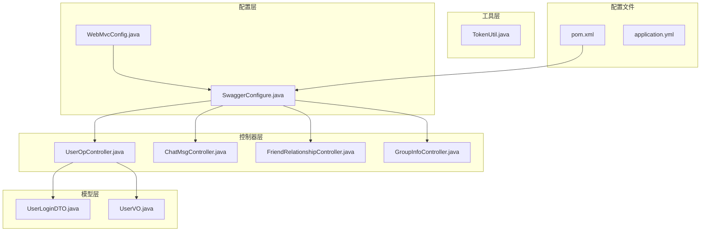
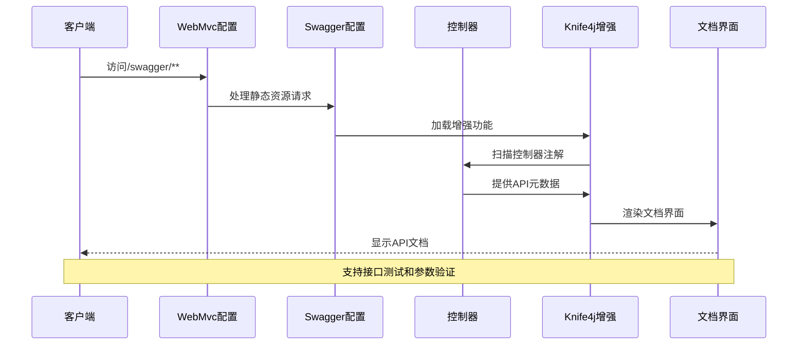
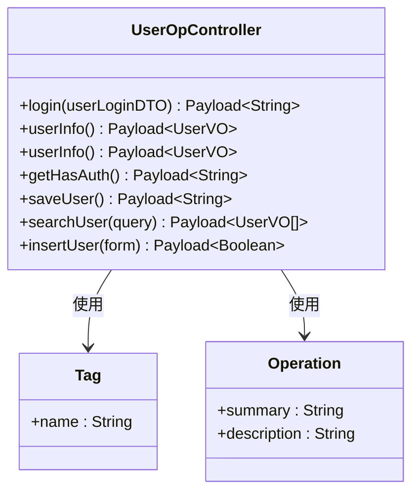
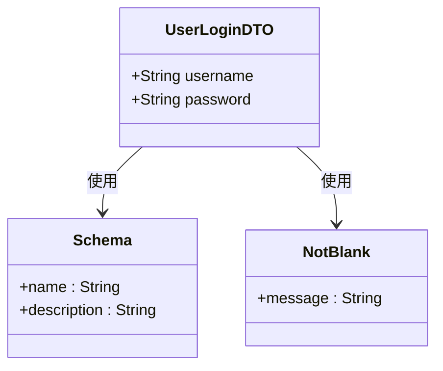
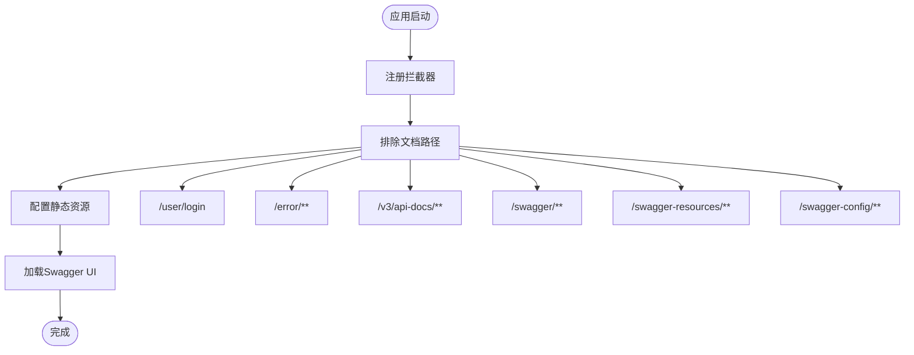
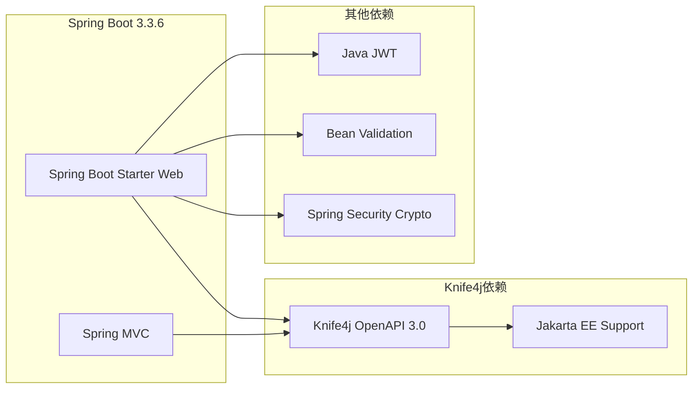

# Swagger API文档配置

<cite>
**本文档引用的文件**
- [SwaggerConfigure.java](file://src/main/java/com/hch/chat_simple/config/SwaggerConfigure.java)
- [WebMvcConfig.java](file://src/main/java/com/hch/chat_simple/config/WebMvcConfig.java)
- [UserOpController.java](file://src/main/java/com/hch/chat_simple/controller/UserOpController.java)
- [ChatMsgController.java](file://src/main/java/com/hch/chat_simple/controller/ChatMsgController.java)
- [FriendRelationshipController.java](file://src/main/java/com/hch/chat_simple/controller/FriendRelationshipController.java)
- [GroupInfoController.java](file://src/main/java/com/hch/chat_simple/controller/GroupInfoController.java)
- [UserLoginDTO.java](file://src/main/java/com/hch/chat_simple/pojo/dto/UserLoginDTO.java)
- [UserVO.java](file://src/main/java/com/hch/chat_simple/pojo/vo/UserVO.java)
- [TokenUtil.java](file://src/main/java/com/hch/chat_simple/util/TokenUtil.java)
- [pom.xml](file://pom.xml)
- [application.yml](file://src/main/resources/application.yml)
</cite>

## 目录
1. [简介](#简介)
2. [项目结构](#项目结构)
3. [核心组件](#核心组件)
4. [架构概览](#架构概览)
5. [详细组件分析](#详细组件分析)
6. [依赖分析](#依赖分析)
7. [性能考虑](#性能考虑)
8. [故障排除指南](#故障排除指南)
9. [结论](#结论)
10. [附录](#附录)

## 简介

本项目采用Knife4j集成OpenAPI 3.0规范实现API文档自动生成，基于Spring Boot 3.3.6和Java 17构建。系统通过SwaggerConfigure配置类定义API文档生成规则，结合Knife4j增强功能提供交互式API文档界面。

Knife4j作为Swagger的增强工具，提供了更丰富的文档展示功能，包括接口测试、文档分组、安全认证等特性。项目中使用了knife4j-openapi3-jakarta-spring-boot-starter依赖，支持Jakarta EE标准和OpenAPI 3.0规范。

## 项目结构

项目采用标准的Spring Boot目录结构，API文档相关的核心文件分布如下：

**图表来源**
- [SwaggerConfigure.java:1-41](file://src/main/java/com/hch/chat_simple/config/SwaggerConfigure.java#L1-L41)
- [WebMvcConfig.java:1-28](file://src/main/java/com/hch/chat_simple/config/WebMvcConfig.java#L1-L28)

**章节来源**
- [SwaggerConfigure.java:1-41](file://src/main/java/com/hch/chat_simple/config/SwaggerConfigure.java#L1-L41)
- [WebMvcConfig.java:1-28](file://src/main/java/com/hch/chat_simple/config/WebMvcConfig.java#L1-L28)

## 核心组件

### Swagger配置类分析

当前项目中的SwaggerConfigure类采用注释形式存在，实际配置被禁用。该类原本计划实现以下功能：

- **文档基本信息配置**：通过ApiInfoBuilder设置标题、描述、版本等信息
- **包扫描配置**：使用RequestHandlerSelectors.basePackage指定控制器扫描路径
- **分组管理**：通过groupName方法创建API文档分组
- **路径过滤**：使用PathSelectors.any()匹配所有路径

### Knife4j集成配置

项目通过pom.xml引入Knife4j依赖，版本为4.4.0，支持OpenAPI 3.0规范和Jakarta EE标准。Knife4j提供了增强的UI界面和更多实用功能。

**章节来源**
- [SwaggerConfigure.java:15-39](file://src/main/java/com/hch/chat_simple/config/SwaggerConfigure.java#L15-L39)
- [pom.xml:266-270](file://pom.xml#L266-L270)

## 架构概览

系统采用分层架构设计，API文档生成流程如下：

**图表来源**
- [WebMvcConfig.java:12-24](file://src/main/java/com/hch/chat_simple/config/WebMvcConfig.java#L12-L24)
- [SwaggerConfigure.java:20-29](file://src/main/java/com/hch/chat_simple/config/SwaggerConfigure.java#L20-L29)

## 详细组件分析

### 控制器注解配置

项目中的控制器广泛使用了OpenAPI 3.0注解：

#### 用户操作控制器
UserOpController展示了完整的注解使用示例：

**图表来源**
- [UserOpController.java:35-113](file://src/main/java/com/hch/chat_simple/controller/UserOpController.java#L35-L113)

#### 聊天消息控制器
ChatMsgController展示了简洁的注解使用模式：

**章节来源**
- [UserOpController.java:35-113](file://src/main/java/com/hch/chat_simple/controller/UserOpController.java#L35-L113)
- [ChatMsgController.java:31-58](file://src/main/java/com/hch/chat_simple/controller/ChatMsgController.java#L31-L58)

### DTO模型注解

数据传输对象使用了OpenAPI 3.0注解进行模型描述：

#### 用户登录DTO
UserLoginDTO展示了参数验证和模型描述注解的使用：

**图表来源**
- [UserLoginDTO.java:10-22](file://src/main/java/com/hch/chat_simple/pojo/dto/UserLoginDTO.java#L10-L22)

**章节来源**
- [UserLoginDTO.java:10-22](file://src/main/java/com/hch/chat_simple/pojo/dto/UserLoginDTO.java#L10-L22)
- [UserVO.java:26-44](file://src/main/java/com/hch/chat_simple/pojo/vo/UserVO.java#L26-L44)

### WebMvc配置分析

WebMvcConfig类负责API文档的静态资源处理和拦截器配置：

**图表来源**
- [WebMvcConfig.java:12-24](file://src/main/java/com/hch/chat_simple/config/WebMvcConfig.java#L12-L24)

**章节来源**
- [WebMvcConfig.java:8-27](file://src/main/java/com/hch/chat_simple/config/WebMvcConfig.java#L8-L27)

## 依赖分析

### 核心依赖关系

项目使用Knife4j替代传统的Swagger UI，提供更好的用户体验：

**图表来源**
- [pom.xml:54-56](file://pom.xml#L54-L56)
- [pom.xml:266-270](file://pom.xml#L266-L270)

### 版本兼容性

项目采用的版本组合确保了良好的兼容性：
- Spring Boot 3.3.6：支持Jakarta EE标准迁移
- Java 17：长期支持版本，提供更好的性能
- Knife4j 4.4.0：最新稳定版本，支持OpenAPI 3.0
- Jakarta Servlet API 5.0.0：与Spring Boot 3兼容

**章节来源**
- [pom.xml:8-31](file://pom.xml#L8-L31)
- [pom.xml:266-270](file://pom.xml#L266-L270)

## 性能考虑

### 文档生成优化

1. **包扫描优化**：通过精确的basePackage配置减少扫描范围
2. **静态资源缓存**：合理配置静态资源处理器提升加载速度
3. **注解使用优化**：避免过度复杂的注解嵌套影响编译性能

### 生产环境部署

- **资源路径配置**：确保/v3/api-docs/**路径不被拦截器拦截
- **CORS配置**：在WebMvcConfig中正确配置跨域资源共享
- **安全考虑**：生产环境中建议移除或限制API文档访问权限

## 故障排除指南

### 常见问题及解决方案

#### 1. API文档无法访问
**症状**：访问/swagger-ui.html返回404错误
**原因**：静态资源处理器未正确配置
**解决方案**：检查WebMvcConfig中的addResourceHandlers方法

#### 2. 接口注解不显示
**症状**：控制器上的@Operation注解未在文档中显示
**原因**：Swagger配置未启用或注解版本不匹配
**解决方案**：确认Knife4j依赖已正确引入且注解使用正确

#### 3. 拦截器影响文档访问
**症状**：文档界面可以访问但API调用失败
**原因**：拦截器规则配置不当
**解决方案**：在WebMvcConfig中正确排除文档相关路径

**章节来源**
- [WebMvcConfig.java:12-24](file://src/main/java/com/hch/chat_simple/config/WebMvcConfig.java#L12-L24)

### 调试技巧

1. **查看日志输出**：关注Swagger和Knife4j相关的启动日志
2. **检查依赖版本**：确保Knife4j版本与Spring Boot版本兼容
3. **验证注解使用**：确认所有OpenAPI注解正确导入相应包

## 结论

本项目成功集成了Knife4j OpenAPI 3.0文档生成解决方案，提供了现代化的API文档体验。通过合理的架构设计和注解使用，实现了代码与文档的一致性维护。

主要优势包括：
- 基于OpenAPI 3.0规范，支持最新的API描述标准
- Knife4j提供增强的UI界面和交互功能
- 与Spring Boot 3.0完全兼容，支持Jakarta EE标准
- 通过注解实现声明式的API文档描述

建议在实际项目中：
1. 完善SwaggerConfigure类的实际配置
2. 建立标准化的注解使用规范
3. 定期更新Knife4j到最新稳定版本
4. 建立API文档变更的审查流程

## 附录

### API文档访问方式

- **主界面**：http://localhost:9001/swagger-ui.html
- **API定义**：http://localhost:9001/v3/api-docs/
- **资源访问**：http://localhost:9001/webjars/**

### 配置文件参考

项目使用application.yml进行基础配置，包括数据库连接、Redis配置、服务器端口等关键设置。

**章节来源**
- [application.yml:74-75](file://src/main/resources/application.yml#L74-L75)
- [WebMvcConfig.java:19-23](file://src/main/java/com/hch/chat_simple/config/WebMvcConfig.java#L19-L23)