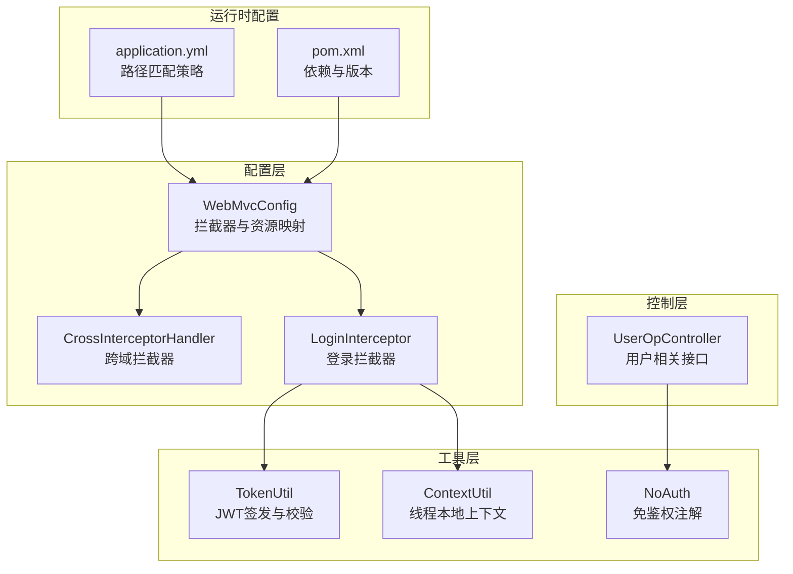
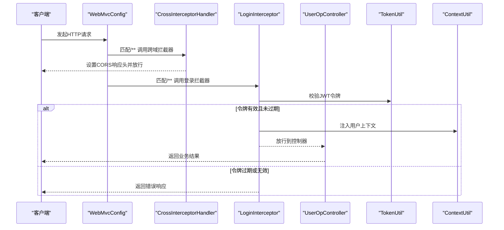
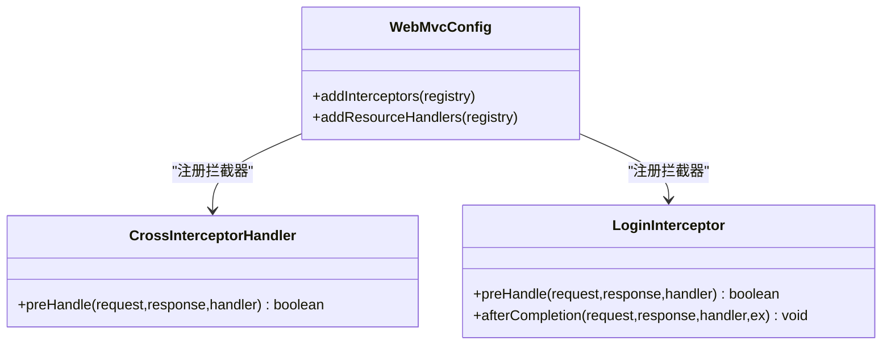
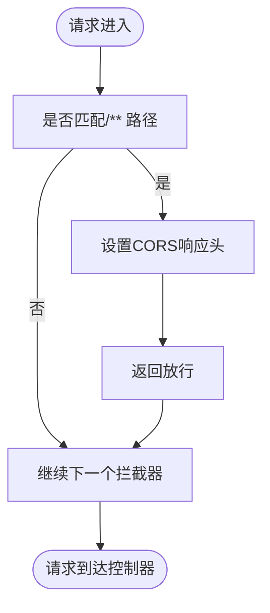
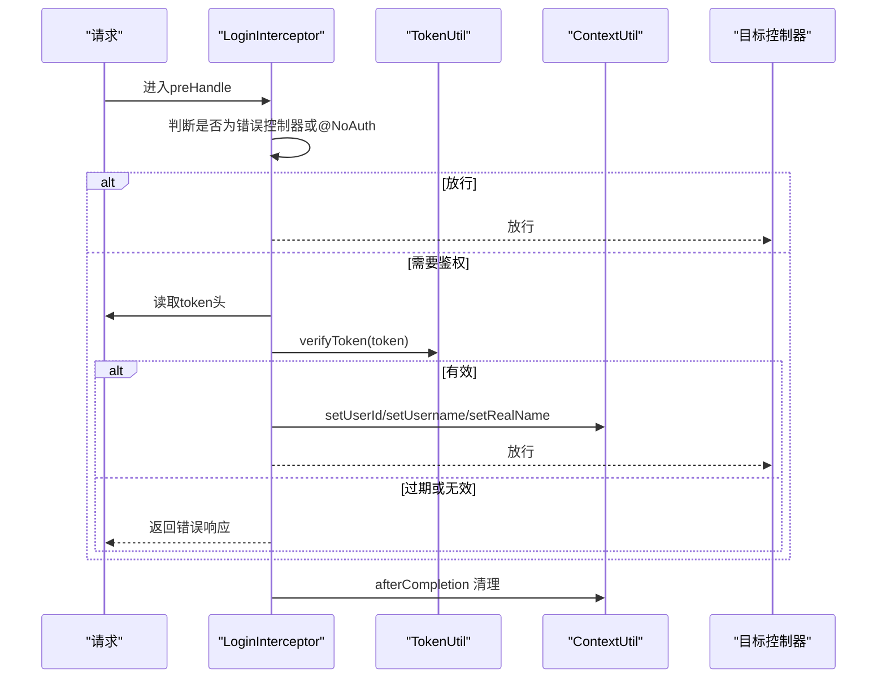
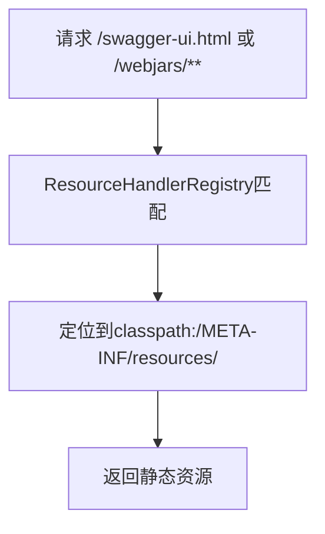
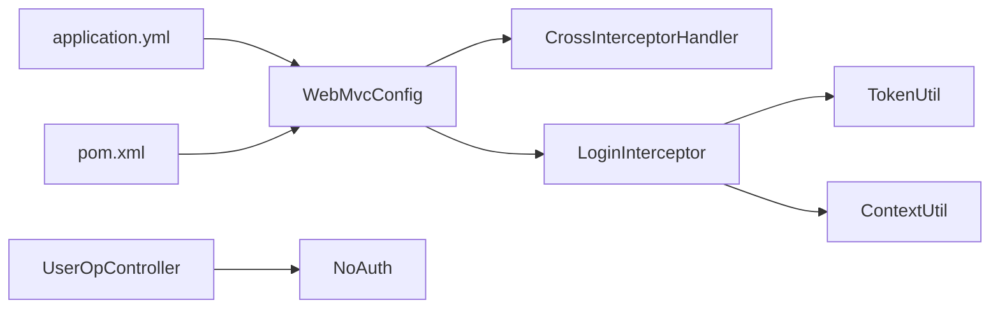

# Web MVC配置

<cite>
**本文引用的文件**
- [WebMvcConfig.java](file://src/main/java/com/hch/chat_simple/config/WebMvcConfig.java)
- [CrossInterceptorHandler.java](file://src/main/java/com/hch/chat_simple/config/CrossInterceptorHandler.java)
- [LoginInterceptor.java](file://src/main/java/com/hch/chat_simple/config/LoginInterceptor.java)
- [TokenUtil.java](file://src/main/java/com/hch/chat_simple/util/TokenUtil.java)
- [ContextUtil.java](file://src/main/java/com/hch/chat_simple/util/ContextUtil.java)
- [NoAuth.java](file://src/main/java/com/hch/chat_simple/auth/NoAuth.java)
- [UserOpController.java](file://src/main/java/com/hch/chat_simple/controller/UserOpController.java)
- [application.yml](file://src/main/resources/application.yml)
- [pom.xml](file://pom.xml)
</cite>

## 目录
1. [简介](#简介)
2. [项目结构](#项目结构)
3. [核心组件](#核心组件)
4. [架构总览](#架构总览)
5. [详细组件分析](#详细组件分析)
6. [依赖分析](#依赖分析)
7. [性能考量](#性能考量)
8. [故障排查指南](#故障排查指南)
9. [结论](#结论)
10. [附录](#附录)

## 简介
本文件围绕Web MVC配置展开，重点解析WebMvcConfig类的自定义实现，涵盖以下方面：
- 跨域处理配置：基于拦截器的响应头设置与@CrossOrigin注解的对比
- 拦截器注册与配置：addInterceptors方法中跨域拦截器与登录拦截器的注册、路径匹配与排除规则
- 视图控制器配置：当前项目未使用addViewControllers，但可扩展
- 静态资源处理：addResourceHandlers对Knife4j/Swagger静态资源的映射
- 路径匹配策略：ANT_PATH_MATCHER在application.yml中的启用
- 基于WebMvcConfigurer的扩展点：请求映射、响应处理、异常处理等

## 项目结构
Web MVC相关的核心文件位于config包，配合工具类与控制器共同完成认证、上下文传递与资源映射。

**图表来源**
- [WebMvcConfig.java:1-27](file://src/main/java/com/hch/chat_simple/config/WebMvcConfig.java#L1-L27)
- [CrossInterceptorHandler.java:1-28](file://src/main/java/com/hch/chat_simple/config/CrossInterceptorHandler.java#L1-L28)
- [LoginInterceptor.java:1-109](file://src/main/java/com/hch/chat_simple/config/LoginInterceptor.java#L1-L109)
- [TokenUtil.java:1-71](file://src/main/java/com/hch/chat_simple/util/TokenUtil.java#L1-L71)
- [ContextUtil.java:1-52](file://src/main/java/com/hch/chat_simple/util/ContextUtil.java#L1-L52)
- [NoAuth.java:1-14](file://src/main/java/com/hch/chat_simple/auth/NoAuth.java#L1-L14)
- [UserOpController.java:1-114](file://src/main/java/com/hch/chat_simple/controller/UserOpController.java#L1-L114)
- [application.yml:21-23](file://src/main/resources/application.yml#L21-L23)
- [pom.xml:54-56](file://pom.xml#L54-L56)

**章节来源**
- [WebMvcConfig.java:1-27](file://src/main/java/com/hch/chat_simple/config/WebMvcConfig.java#L1-L27)
- [application.yml:21-23](file://src/main/resources/application.yml#L21-L23)

## 核心组件
- WebMvcConfig：实现WebMvcConfigurer，负责拦截器注册与静态资源映射
- CrossInterceptorHandler：全局跨域拦截器，统一设置CORS响应头
- LoginInterceptor：登录鉴权拦截器，基于JWT令牌校验与上下文注入
- TokenUtil：JWT签发与校验工具
- ContextUtil：线程本地上下文，传递用户信息
- NoAuth：免鉴权注解，标注无需登录即可访问的接口
- UserOpController：示例控制器，包含@NoAuth与受保护接口

**章节来源**
- [WebMvcConfig.java:8-27](file://src/main/java/com/hch/chat_simple/config/WebMvcConfig.java#L8-L27)
- [CrossInterceptorHandler.java:8-27](file://src/main/java/com/hch/chat_simple/config/CrossInterceptorHandler.java#L8-L27)
- [LoginInterceptor.java:28-108](file://src/main/java/com/hch/chat_simple/config/LoginInterceptor.java#L28-L108)
- [TokenUtil.java:18-59](file://src/main/java/com/hch/chat_simple/util/TokenUtil.java#L18-L59)
- [ContextUtil.java:5-49](file://src/main/java/com/hch/chat_simple/util/ContextUtil.java#L5-L49)
- [NoAuth.java:8-13](file://src/main/java/com/hch/chat_simple/auth/NoAuth.java#L8-L13)
- [UserOpController.java:35-113](file://src/main/java/com/hch/chat_simple/controller/UserOpController.java#L35-L113)

## 架构总览
Web请求从客户端进入，经过拦截器链处理后到达控制器，再由控制器调用服务层与工具类完成业务逻辑。

**图表来源**
- [WebMvcConfig.java:12-16](file://src/main/java/com/hch/chat_simple/config/WebMvcConfig.java#L12-L16)
- [CrossInterceptorHandler.java:10-25](file://src/main/java/com/hch/chat_simple/config/CrossInterceptorHandler.java#L10-L25)
- [LoginInterceptor.java:30-90](file://src/main/java/com/hch/chat_simple/config/LoginInterceptor.java#L30-L90)
- [TokenUtil.java:48-59](file://src/main/java/com/hch/chat_simple/util/TokenUtil.java#L48-L59)
- [ContextUtil.java:12-42](file://src/main/java/com/hch/chat_simple/util/ContextUtil.java#L12-L42)
- [UserOpController.java:44-66](file://src/main/java/com/hch/chat_simple/controller/UserOpController.java#L44-L66)

## 详细组件分析

### WebMvcConfig：自定义Web配置入口
- 拦截器注册
  - 跨域拦截器：对所有路径设置CORS响应头，确保前端跨域请求成功
  - 登录拦截器：对所有路径生效，排除登录、错误页、Knife4j/Swagger相关路径
- 静态资源映射
  - Knife4j/Swagger UI静态资源映射至classpath下的资源目录
- 路径匹配策略
  - 在application.yml中启用ANT_PATH_MATCHER，影响请求映射与匹配行为

**图表来源**
- [WebMvcConfig.java:9-27](file://src/main/java/com/hch/chat_simple/config/WebMvcConfig.java#L9-L27)
- [CrossInterceptorHandler.java:8-27](file://src/main/java/com/hch/chat_simple/config/CrossInterceptorHandler.java#L8-L27)
- [LoginInterceptor.java:28-97](file://src/main/java/com/hch/chat_simple/config/LoginInterceptor.java#L28-L97)

**章节来源**
- [WebMvcConfig.java:11-24](file://src/main/java/com/hch/chat_simple/config/WebMvcConfig.java#L11-L24)
- [application.yml:21-23](file://src/main/resources/application.yml#L21-L23)

### 跨域处理：拦截器方式 vs @CrossOrigin注解
- 拦截器方式
  - 优点：集中管理，对所有路径生效；便于统一策略维护
  - 实现：在CrossInterceptorHandler中设置CORS相关响应头
- @CrossOrigin注解方式
  - 优点：按接口粒度灵活控制
  - 适用场景：不同接口需要差异化跨域策略时
- 当前项目采用拦截器方式，避免在每个控制器重复声明注解

**图表来源**
- [CrossInterceptorHandler.java:10-25](file://src/main/java/com/hch/chat_simple/config/CrossInterceptorHandler.java#L10-L25)
- [WebMvcConfig.java:12-14](file://src/main/java/com/hch/chat_simple/config/WebMvcConfig.java#L12-L14)

**章节来源**
- [CrossInterceptorHandler.java:10-25](file://src/main/java/com/hch/chat_simple/config/CrossInterceptorHandler.java#L10-L25)
- [WebMvcConfig.java:12-14](file://src/main/java/com/hch/chat_simple/config/WebMvcConfig.java#L12-L14)

### 登录拦截器：JWT校验与上下文注入
- 核心流程
  - 排除错误控制器与免鉴权注解的方法
  - 从请求头读取token，调用TokenUtil校验
  - 若令牌过期但仍在宽限期内，生成新token并通过上下文传递
  - 将用户信息写入ContextUtil，供后续处理器与控制器使用
  - 请求完成后清理上下文
- 免鉴权机制
  - 控制器方法或类上标注@NoAuth时，拦截器直接放行

**图表来源**
- [LoginInterceptor.java:30-97](file://src/main/java/com/hch/chat_simple/config/LoginInterceptor.java#L30-L97)
- [TokenUtil.java:48-59](file://src/main/java/com/hch/chat_simple/util/TokenUtil.java#L48-L59)
- [ContextUtil.java:12-49](file://src/main/java/com/hch/chat_simple/util/ContextUtil.java#L12-L49)
- [NoAuth.java:8-13](file://src/main/java/com/hch/chat_simple/auth/NoAuth.java#L8-L13)

**章节来源**
- [LoginInterceptor.java:30-97](file://src/main/java/com/hch/chat_simple/config/LoginInterceptor.java#L30-L97)
- [TokenUtil.java:48-59](file://src/main/java/com/hch/chat_simple/util/TokenUtil.java#L48-L59)
- [ContextUtil.java:12-49](file://src/main/java/com/hch/chat_simple/util/ContextUtil.java#L12-L49)
- [NoAuth.java:8-13](file://src/main/java/com/hch/chat_simple/auth/NoAuth.java#L8-L13)

### 视图控制器配置：可扩展点
- 当前项目未使用addViewControllers，通常用于将请求直接映射到模板视图
- 如需扩展，可在WebMvcConfigurer中添加对应配置，实现“页面路由”与“接口路由”的统一管理

**章节来源**
- [WebMvcConfig.java:11-27](file://src/main/java/com/hch/chat_simple/config/WebMvcConfig.java#L11-L27)

### 静态资源处理：Knife4j/Swagger资源映射
- 映射规则
  - swagger-ui.html -> classpath:/META-INF/resources/
  - /webjars/** -> classpath:/META-INF/resources/webjars/
- 作用
  - 使Knife4j提供的前端界面与静态资源可被正确访问

**图表来源**
- [WebMvcConfig.java:18-24](file://src/main/java/com/hch/chat_simple/config/WebMvcConfig.java#L18-L24)

**章节来源**
- [WebMvcConfig.java:18-24](file://src/main/java/com/hch/chat_simple/config/WebMvcConfig.java#L18-L24)

### 路径匹配策略：ANT_PATH_MATCHER
- 配置位置：application.yml中mvc.pathmatch.matching-strategy=ANT_PATH_MATCHER
- 影响
  - 控制器请求映射与路径变量解析的行为，确保与预期一致
  - 与WebMvcConfigurer的addInterceptors/addResourceHandlers等方法协同工作

**章节来源**
- [application.yml:21-23](file://src/main/resources/application.yml#L21-L23)

## 依赖分析
- 组件耦合
  - WebMvcConfig依赖两个拦截器；LoginInterceptor依赖TokenUtil与ContextUtil
  - 控制器通过@NoAuth注解与拦截器协作
- 外部依赖
  - Spring Boot Web Starter提供Web MVC基础设施
  - Knife4j OpenAPI 3 Starter提供文档与静态资源支持

**图表来源**
- [WebMvcConfig.java:9-27](file://src/main/java/com/hch/chat_simple/config/WebMvcConfig.java#L9-L27)
- [LoginInterceptor.java:28-108](file://src/main/java/com/hch/chat_simple/config/LoginInterceptor.java#L28-L108)
- [TokenUtil.java:18-59](file://src/main/java/com/hch/chat_simple/util/TokenUtil.java#L18-L59)
- [ContextUtil.java:5-49](file://src/main/java/com/hch/chat_simple/util/ContextUtil.java#L5-L49)
- [NoAuth.java:8-13](file://src/main/java/com/hch/chat_simple/auth/NoAuth.java#L8-L13)
- [UserOpController.java:35-113](file://src/main/java/com/hch/chat_simple/controller/UserOpController.java#L35-L113)
- [application.yml:21-23](file://src/main/resources/application.yml#L21-L23)
- [pom.xml:54-56](file://pom.xml#L54-L56)

**章节来源**
- [pom.xml:54-56](file://pom.xml#L54-L56)

## 性能考量
- 拦截器链开销
  - 跨域拦截器仅设置响应头，开销极低
  - 登录拦截器涉及JWT校验与上下文操作，建议保持简洁逻辑
- 资源映射
  - 静态资源映射仅做路径转发，不涉及复杂处理
- 路径匹配
  - ANT_PATH_MATCHER在大量路径规则时可能带来额外匹配成本，建议结合实际接口规模评估

[本节为通用性能讨论，无需特定文件引用]

## 故障排查指南
- 跨域问题
  - 确认CrossInterceptorHandler已对/**生效，且响应头设置正确
  - 前端请求是否携带Cookie？需确保允许凭据与允许来源匹配
- 登录失败
  - 检查请求头是否包含token，token格式与签名是否正确
  - 关注拦截器返回的错误响应内容与状态码
- 上下文未注入
  - 确认LoginInterceptor在afterCompletion中执行了清理
  - 检查ContextUtil的线程本地存储是否在多线程场景下正确传递

**章节来源**
- [CrossInterceptorHandler.java:14-23](file://src/main/java/com/hch/chat_simple/config/CrossInterceptorHandler.java#L14-L23)
- [LoginInterceptor.java:74-82](file://src/main/java/com/hch/chat_simple/config/LoginInterceptor.java#L74-L82)
- [ContextUtil.java:44-49](file://src/main/java/com/hch/chat_simple/util/ContextUtil.java#L44-L49)

## 结论
本项目通过WebMvcConfig统一管理拦截器与静态资源，结合LoginInterceptor与TokenUtil实现JWT鉴权，配合ContextUtil完成上下文传递。跨域处理采用拦截器集中配置，避免分散注解带来的维护成本。路径匹配策略ANT_PATH_MATCHER已在配置中启用，建议在接口规模扩大时关注匹配性能并适时优化。

[本节为总结性内容，无需特定文件引用]

## 附录

### 配置最佳实践
- 跨域策略
  - 生产环境建议将Access-Control-Allow-Origin配置为具体域名而非通配符
  - 凭据传输需显式允许并确保预检缓存合理
- 认证与授权
  - 对敏感接口使用@NoAuth时应明确其必要性与风险
  - 令牌过期策略与续签逻辑需与前端协商一致
- 资源映射
  - 静态资源映射路径应与前端打包产物一致，避免404
- 路径匹配
  - 在接口较多时，优先使用更精确的路径模式以减少匹配开销

[本节为通用最佳实践，无需特定文件引用]