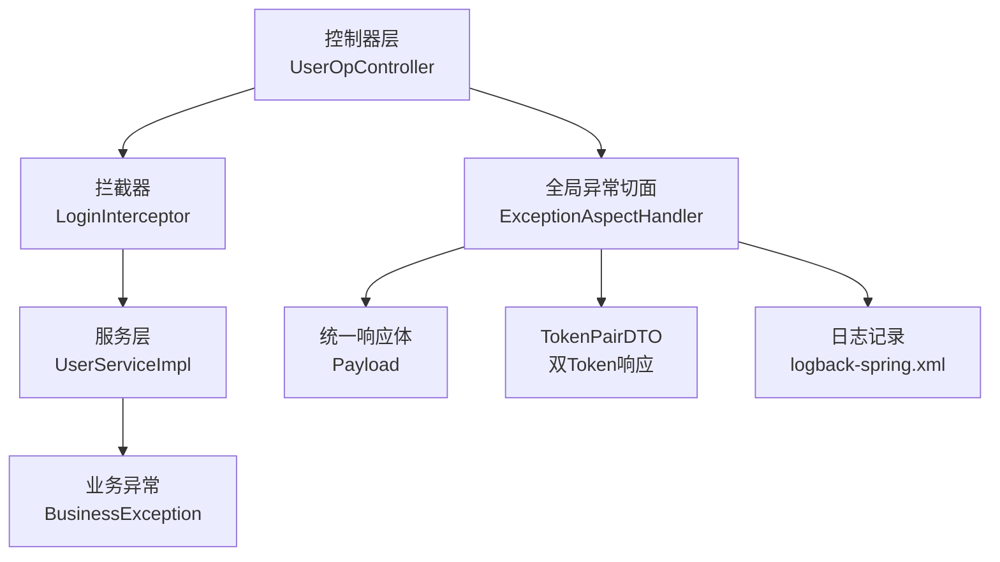
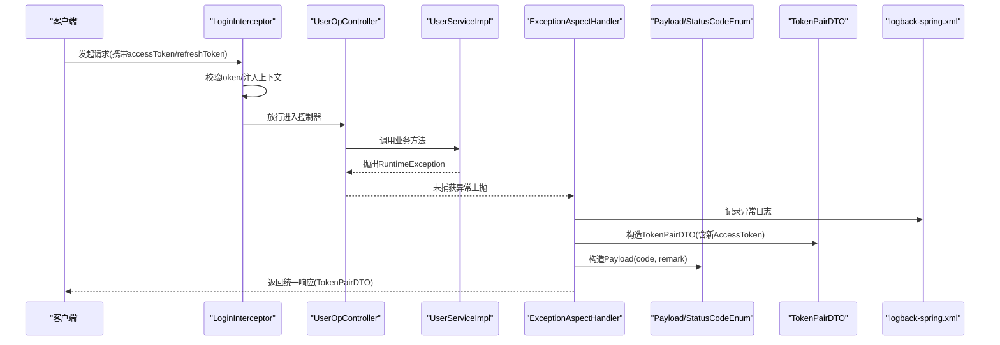
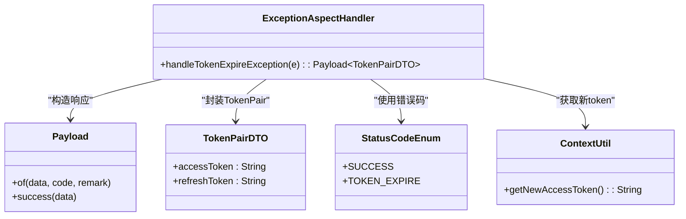
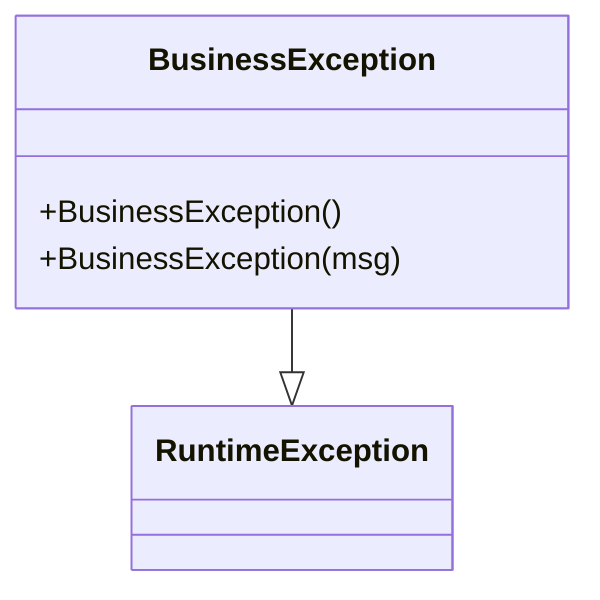
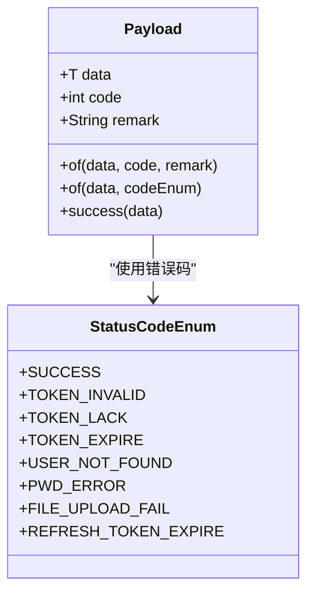
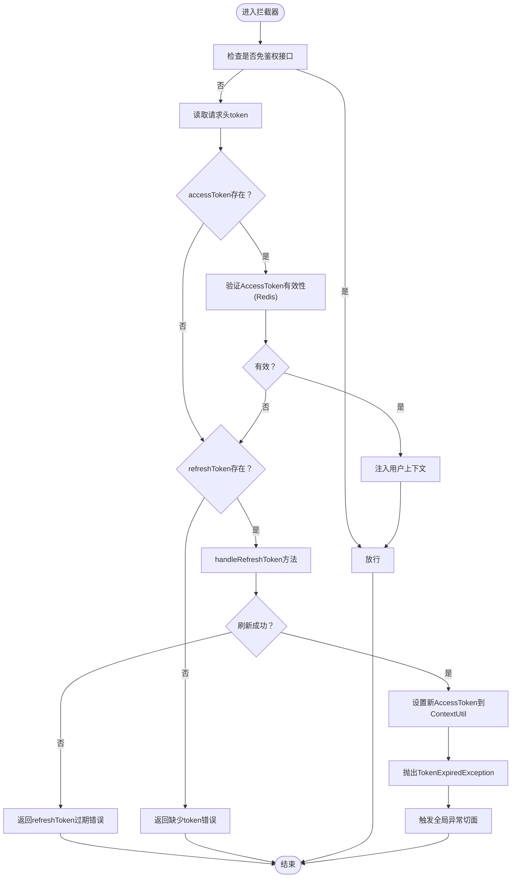
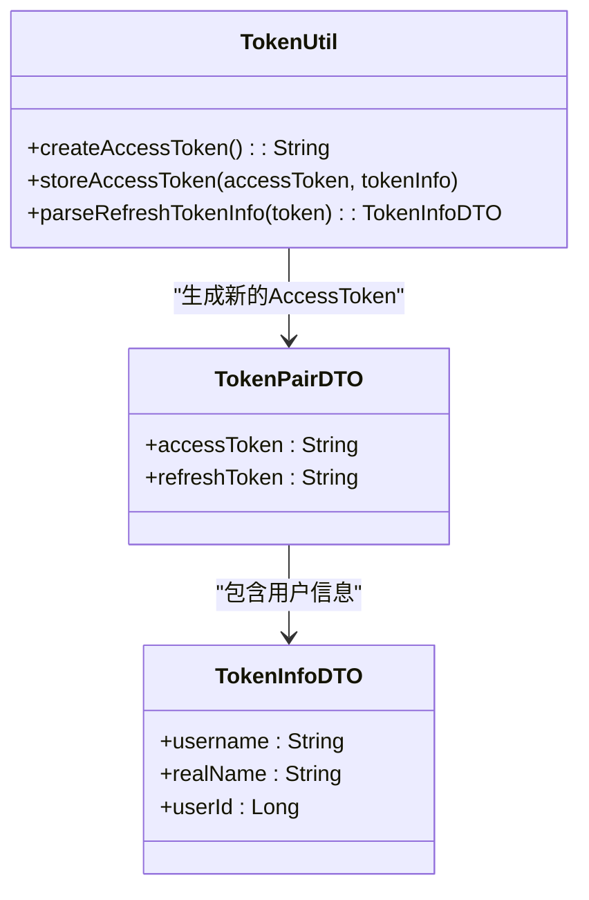
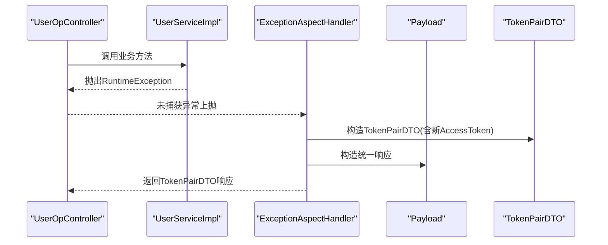
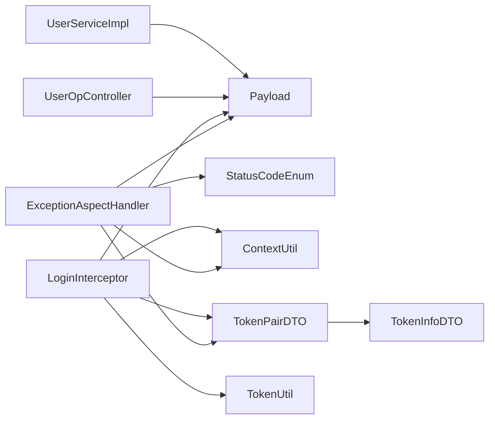

# 全局异常处理

<cite>
**本文引用的文件列表**
- [ExceptionAspectHandler.java](file://src/main/java/com/hch/chat_simple/config/ExceptionAspectHandler.java)
- [BusinessException.java](file://src/main/java/com/hch/chat_simple/exception/BusinessException.java)
- [Payload.java](file://src/main/java/com/hch/chat_simple/util/Payload.java)
- [StatusCodeEnum.java](file://src/main/java/com/hch/chat_simple/util/StatusCodeEnum.java)
- [ContextUtil.java](file://src/main/java/com/hch/chat_simple/util/ContextUtil.java)
- [TokenUtil.java](file://src/main/java/com/hch/chat_simple/util/TokenUtil.java)
- [LoginInterceptor.java](file://src/main/java/com/hch/chat_simple/config/LoginInterceptor.java)
- [TokenPairDTO.java](file://src/main/java/com/hch/chat_simple/pojo/dto/TokenPairDTO.java)
- [TokenInfoDTO.java](file://src/main/java/com/hch/chat_simple/pojo/dto/TokenInfoDTO.java)
- [UserOpController.java](file://src/main/java/com/hch/chat_simple/controller/UserOpController.java)
- [UserServiceImpl.java](file://src/main/java/com/hch/chat_simple/service/impl/UserServiceImpl.java)
- [logback-spring.xml](file://src/main/resources/logback-spring.xml)
</cite>

## 目录
1. [简介](#简介)
2. [项目结构与定位](#项目结构与定位)
3. [核心组件](#核心组件)
4. [架构总览](#架构总览)
5. [详细组件分析](#详细组件分析)
6. [依赖关系分析](#依赖关系分析)
7. [性能与安全考量](#性能与安全考量)
8. [故障排查指南](#故障排查指南)
9. [结论](#结论)
10. [附录：最佳实践清单](#附录最佳实践清单)

## 简介
本技术文档聚焦于项目的全局异常处理机制，系统性阐述基于 Spring 的@RestControllerAdvice 切面异常处理（ExceptionAspectHandler）与业务异常类（BusinessException）的设计与落地。文档将从架构、数据流、处理策略、统一响应格式、错误码体系、日志记录与安全性等方面进行深入解析，并给出异常分类、国际化、调试信息保护等最佳实践建议。

**更新** 本版本重点介绍了增强的TokenExpiredException异常处理机制，支持自动刷新AccessToken并通过TokenPairDTO返回给客户端，实现了双Token认证系统的完整闭环。

## 项目结构与定位
- 异常处理核心位于 config 包下的 ExceptionAspectHandler，采用@RestControllerAdvice 统一捕获控制器层异常。
- 业务异常类 BusinessException 作为运行时异常基类，便于在服务层抛出并由全局切面统一转换为标准响应。
- 统一响应体 Payload 与错误码枚举 StatusCodeEnum 提供一致的返回结构与语义化描述。
- 登录拦截器 LoginInterceptor 负责鉴权与上下文注入，并在必要时触发切面处理（如 TokenExpiredException）。
- TokenPairDTO 作为双Token响应载体，包含新的AccessToken和RefreshToken信息。
- 日志通过 logback-spring.xml 配置，针对 SQL 与根日志级别进行输出控制。

**图表来源**
- [ExceptionAspectHandler.java:14-31](file://src/main/java/com/hch/chat_simple/config/ExceptionAspectHandler.java#L14-L31)
- [LoginInterceptor.java:30-129](file://src/main/java/com/hch/chat_simple/config/LoginInterceptor.java#L30-L129)
- [UserOpController.java:35-113](file://src/main/java/com/hch/chat_simple/controller/UserOpController.java#L35-L113)
- [UserServiceImpl.java:38-99](file://src/main/java/com/hch/chat_simple/service/impl/UserServiceImpl.java#L38-L99)
- [Payload.java:5-29](file://src/main/java/com/hch/chat_simple/util/Payload.java#L5-L29)
- [TokenPairDTO.java:8-24](file://src/main/java/com/hch/chat_simple/pojo/dto/TokenPairDTO.java#L8-L24)
- [logback-spring.xml:1-24](file://src/main/resources/logback-spring.xml#L1-L24)

**章节来源**
- [ExceptionAspectHandler.java:14-31](file://src/main/java/com/hch/chat_simple/config/ExceptionAspectHandler.java#L14-L31)
- [LoginInterceptor.java:30-129](file://src/main/java/com/hch/chat_simple/config/LoginInterceptor.java#L30-L129)
- [UserOpController.java:35-113](file://src/main/java/com/hch/chat_simple/controller/UserOpController.java#L35-L113)
- [UserServiceImpl.java:38-99](file://src/main/java/com/hch/chat_simple/service/impl/UserServiceImpl.java#L38-L99)
- [Payload.java:5-29](file://src/main/java/com/hch/chat_simple/util/Payload.java#L5-L29)
- [TokenPairDTO.java:8-24](file://src/main/java/com/hch/chat_simple/pojo/dto/TokenPairDTO.java#L8-L24)
- [logback-spring.xml:1-24](file://src/main/resources/logback-spring.xml#L1-L24)

## 核心组件
- 全局异常切面 ExceptionAspectHandler：以@RestControllerAdvice 形式注册，使用 @ExceptionHandler 捕获指定异常类型，统一转换为 Payload 响应。
- 业务异常 BusinessException：继承 RuntimeException，作为业务层面的异常标识，便于区分业务异常与系统异常。
- 统一响应体 Payload：包含 data、code、remark 字段，提供静态工厂方法快速构造成功或带状态码的响应。
- 错误码枚举 StatusCodeEnum：集中管理错误码与描述，确保前后端一致的语义化错误表达。
- 登录拦截器 LoginInterceptor：负责鉴权、上下文注入与过期 token 的处理，必要时抛出 TokenExpiredException 触发切面。
- TokenPairDTO：双Token响应载体，包含新的AccessToken和RefreshToken信息，用于自动刷新机制。
- 日志配置 logback-spring.xml：控制台输出、SQL 日志与根日志级别，便于问题定位与生产环境脱敏。

**章节来源**
- [ExceptionAspectHandler.java:14-31](file://src/main/java/com/hch/chat_simple/config/ExceptionAspectHandler.java#L14-L31)
- [BusinessException.java:3-11](file://src/main/java/com/hch/chat_simple/exception/BusinessException.java#L3-L11)
- [Payload.java:5-29](file://src/main/java/com/hch/chat_simple/util/Payload.java#L5-L29)
- [StatusCodeEnum.java:6-22](file://src/main/java/com/hch/chat_simple/util/StatusCodeEnum.java#L6-L22)
- [LoginInterceptor.java:30-129](file://src/main/java/com/hch/chat_simple/config/LoginInterceptor.java#L30-L129)
- [TokenPairDTO.java:8-24](file://src/main/java/com/hch/chat_simple/pojo/dto/TokenPairDTO.java#L8-L24)
- [logback-spring.xml:1-24](file://src/main/resources/logback-spring.xml#L1-L24)

## 架构总览
全局异常处理遵循"拦截器鉴权 + 控制器执行 + 切面统一处理"的链路。当服务层抛出业务异常或拦截器检测到 token 过期时，由切面统一捕获并返回标准化响应；同时通过日志记录异常堆栈以便排查。**更新** 新增的TokenExpiredException处理机制实现了AccessToken的自动刷新和TokenPairDTO的返回。

**图表来源**
- [LoginInterceptor.java:30-129](file://src/main/java/com/hch/chat_simple/config/LoginInterceptor.java#L30-L129)
- [UserOpController.java:35-113](file://src/main/java/com/hch/chat_simple/controller/UserOpController.java#L35-L113)
- [UserServiceImpl.java:38-99](file://src/main/java/com/hch/chat_simple/service/impl/UserServiceImpl.java#L38-L99)
- [ExceptionAspectHandler.java:14-31](file://src/main/java/com/hch/chat_simple/config/ExceptionAspectHandler.java#L14-L31)
- [Payload.java:5-29](file://src/main/java/com/hch/chat_simple/util/Payload.java#L5-L29)
- [TokenPairDTO.java:8-24](file://src/main/java/com/hch/chat_simple/pojo/dto/TokenPairDTO.java#L8-L24)
- [logback-spring.xml:1-24](file://src/main/resources/logback-spring.xml#L1-L24)

## 详细组件分析

### 全局异常切面 ExceptionAspectHandler
- 注解与职责
  - @RestControllerAdvice：声明为全局控制器增强，自动对所有 @RestController 生效。
  - @ExceptionHandler(TokenExpiredException.class)：专门捕获 JWT 过期异常，返回带新 token 的统一响应。
- 处理逻辑
  - 记录异常日志，便于审计与定位。
  - 从上下文工具类获取新 token，结合错误码与描述封装为 Payload。
  - **更新** 返回类型从简单的字符串改为TokenPairDTO，包含新的AccessToken信息。
- 扩展建议
  - 可新增对 BusinessException、其他运行时异常与默认异常的处理分支，统一返回结构。
  - 对敏感参数与堆栈信息进行脱敏处理，避免泄露内部细节。

**图表来源**
- [ExceptionAspectHandler.java:14-31](file://src/main/java/com/hch/chat_simple/config/ExceptionAspectHandler.java#L14-L31)
- [Payload.java:5-29](file://src/main/java/com/hch/chat_simple/util/Payload.java#L5-L29)
- [TokenPairDTO.java:8-24](file://src/main/java/com/hch/chat_simple/pojo/dto/TokenPairDTO.java#L8-L24)
- [StatusCodeEnum.java:6-22](file://src/main/java/com/hch/chat_simple/util/StatusCodeEnum.java#L6-L22)
- [ContextUtil.java:45-51](file://src/main/java/com/hch/chat_simple/util/ContextUtil.java#L45-L51)

**章节来源**
- [ExceptionAspectHandler.java:14-31](file://src/main/java/com/hch/chat_simple/config/ExceptionAspectHandler.java#L14-L31)
- [Payload.java:5-29](file://src/main/java/com/hch/chat_simple/util/Payload.java#L5-L29)
- [TokenPairDTO.java:8-24](file://src/main/java/com/hch/chat_simple/pojo/dto/TokenPairDTO.java#L8-L24)
- [StatusCodeEnum.java:6-22](file://src/main/java/com/hch/chat_simple/util/StatusCodeEnum.java#L6-L22)
- [ContextUtil.java:45-51](file://src/main/java/com/hch/chat_simple/util/ContextUtil.java#L45-L51)

### 业务异常 BusinessException
- 设计意图
  - 作为业务异常的标记类，继承 RuntimeException，便于在服务层抛出并在全局切面中识别与统一处理。
- 使用场景
  - 在服务层根据业务规则抛出，例如重复用户名、权限不足等。
- 建议
  - 可扩展为带错误码的版本，便于切面直接映射到统一响应码。

**图表来源**
- [BusinessException.java:3-11](file://src/main/java/com/hch/chat_simple/exception/BusinessException.java#L3-L11)

**章节来源**
- [BusinessException.java:3-11](file://src/main/java/com/hch/chat_simple/exception/BusinessException.java#L3-L11)

### 统一响应体 Payload 与错误码 StatusCodeEnum
- Payload
  - 字段：data、code、remark。
  - 工厂方法：of(data, code, remark)、of(data, codeEnum)、success(data)，保证返回格式一致性。
- StatusCodeEnum
  - 定义常用错误码与描述，如 TOKEN_EXPIRE、USER_NOT_FOUND、PWD_ERROR、FILE_UPLOAD_FAIL 等。
  - **更新** 新增 REFRESH_TOKEN_EXPIRE 错误码，用于处理RefreshToken过期场景。
- 应用方式
  - 控制器层直接返回 Payload.success(...) 或 Payload.of(..., codeEnum)。
  - 切面层在捕获异常后也通过 Payload.of(...) 输出统一结构。

**图表来源**
- [Payload.java:5-29](file://src/main/java/com/hch/chat_simple/util/Payload.java#L5-L29)
- [StatusCodeEnum.java:6-22](file://src/main/java/com/hch/chat_simple/util/StatusCodeEnum.java#L6-L22)

**章节来源**
- [Payload.java:5-29](file://src/main/java/com/hch/chat_simple/util/Payload.java#L5-L29)
- [StatusCodeEnum.java:6-22](file://src/main/java/com/hch/chat_simple/util/StatusCodeEnum.java#L6-L22)

### 登录拦截器 LoginInterceptor 与 Token 过期处理
- 职责
  - 读取请求头 token，校验有效性与过期时间。
  - 将用户上下文注入到 ThreadLocal，供后续控制器与服务层使用。
  - 当 token 即将过期或已过期时，生成新 token 并抛出 TokenExpiredException，触发全局切面处理。
- 关键点
  - afterCompletion 中清理上下文，防止内存泄漏。
  - 对缺失 token 与无效 token 分别返回不同错误码。
  - **更新** 新增双Token认证机制：AccessToken存储在Redis中短期有效，RefreshToken为JWT长期有效。
- 处理流程
  - 优先验证AccessToken（Redis中查询），若有效则设置上下文并放行。
  - 若AccessToken已过期且存在RefreshToken，则调用handleRefreshToken方法刷新。
  - 刷新成功后设置新的AccessToken到ContextUtil，并抛出TokenExpiredException。
  - 刷新失败则返回相应的错误信息。

**图表来源**
- [LoginInterceptor.java:30-129](file://src/main/java/com/hch/chat_simple/config/LoginInterceptor.java#L30-L129)
- [TokenUtil.java:39-152](file://src/main/java/com/hch/chat_simple/util/TokenUtil.java#L39-L152)
- [ContextUtil.java:45-51](file://src/main/java/com/hch/chat_simple/util/ContextUtil.java#L45-L51)

**章节来源**
- [LoginInterceptor.java:30-129](file://src/main/java/com/hch/chat_simple/config/LoginInterceptor.java#L30-L129)
- [TokenUtil.java:39-152](file://src/main/java/com/hch/chat_simple/util/TokenUtil.java#L39-L152)
- [ContextUtil.java:45-51](file://src/main/java/com/hch/chat_simple/util/ContextUtil.java#L45-L51)

### TokenPairDTO 双Token响应机制
- 设计目的
  - 作为双Token认证系统的响应载体，包含新的AccessToken和RefreshToken信息。
- 字段说明
  - accessToken：短期访问令牌(30分钟)，存储在Redis中，用于接口访问鉴权。
  - refreshToken：长期刷新令牌(7天)，JWT存放在浏览器端，用于刷新AccessToken。
- 使用场景
  - 当AccessToken过期时，LoginInterceptor刷新后通过ExceptionAspectHandler返回给客户端。
  - 客户端收到新的TokenPairDTO后，需要更新本地存储的AccessToken。

**图表来源**
- [TokenPairDTO.java:8-24](file://src/main/java/com/hch/chat_simple/pojo/dto/TokenPairDTO.java#L8-L24)
- [TokenInfoDTO.java:14-19](file://src/main/java/com/hch/chat_simple/pojo/dto/TokenInfoDTO.java#L14-L19)
- [TokenUtil.java:39-152](file://src/main/java/com/hch/chat_simple/util/TokenUtil.java#L39-L152)

**章节来源**
- [TokenPairDTO.java:8-24](file://src/main/java/com/hch/chat_simple/pojo/dto/TokenPairDTO.java#L8-L24)
- [TokenInfoDTO.java:14-19](file://src/main/java/com/hch/chat_simple/pojo/dto/TokenInfoDTO.java#L14-L19)
- [TokenUtil.java:39-152](file://src/main/java/com/hch/chat_simple/util/TokenUtil.java#L39-L152)

### 控制器与服务层的异常处理联动
- 控制器层
  - 使用 Payload.success(...) 或 Payload.of(...) 返回统一响应。
  - 登录接口示例展示了如何根据业务条件返回不同错误码。
- 服务层
  - 在 insertUser 中对重复用户名抛出 RuntimeException，交由全局切面统一处理。
- 切面层
  - 捕获 TokenExpiredException 并返回带新 token 的统一响应。
  - **更新** 返回类型为TokenPairDTO，包含新的AccessToken信息。

**图表来源**
- [UserOpController.java:35-113](file://src/main/java/com/hch/chat_simple/controller/UserOpController.java#L35-L113)
- [UserServiceImpl.java:82-97](file://src/main/java/com/hch/chat_simple/service/impl/UserServiceImpl.java#L82-L97)
- [ExceptionAspectHandler.java:14-31](file://src/main/java/com/hch/chat_simple/config/ExceptionAspectHandler.java#L14-L31)
- [Payload.java:5-29](file://src/main/java/com/hch/chat_simple/util/Payload.java#L5-L29)
- [TokenPairDTO.java:8-24](file://src/main/java/com/hch/chat_simple/pojo/dto/TokenPairDTO.java#L8-L24)

**章节来源**
- [UserOpController.java:35-113](file://src/main/java/com/hch/chat_simple/controller/UserOpController.java#L35-L113)
- [UserServiceImpl.java:82-97](file://src/main/java/com/hch/chat_simple/service/impl/UserServiceImpl.java#L82-L97)
- [ExceptionAspectHandler.java:14-31](file://src/main/java/com/hch/chat_simple/config/ExceptionAspectHandler.java#L14-L31)
- [Payload.java:5-29](file://src/main/java/com/hch/chat_simple/util/Payload.java#L5-L29)
- [TokenPairDTO.java:8-24](file://src/main/java/com/hch/chat_simple/pojo/dto/TokenPairDTO.java#L8-L24)

## 依赖关系分析
- 组件耦合
  - ExceptionAspectHandler 依赖 Payload、StatusCodeEnum、ContextUtil，形成稳定的响应与上下文依赖。
  - LoginInterceptor 依赖 TokenUtil、ContextUtil、Payload，承担鉴权与上下文注入职责。
  - TokenPairDTO 与 TokenInfoDTO 协作，提供完整的双Token信息。
  - 控制器与服务层通过 Payload 与错误码枚举进行契约约定，降低耦合度。
- 外部依赖
  - Spring MVC、Spring AOP、JWT 校验库、FastJSON、MyBatis Plus、Redis 等。

**图表来源**
- [ExceptionAspectHandler.java:14-31](file://src/main/java/com/hch/chat_simple/config/ExceptionAspectHandler.java#L14-L31)
- [Payload.java:5-29](file://src/main/java/com/hch/chat_simple/util/Payload.java#L5-L29)
- [StatusCodeEnum.java:6-22](file://src/main/java/com/hch/chat_simple/util/StatusCodeEnum.java#L6-L22)
- [ContextUtil.java:45-51](file://src/main/java/com/hch/chat_simple/util/ContextUtil.java#L45-L51)
- [LoginInterceptor.java:30-129](file://src/main/java/com/hch/chat_simple/config/LoginInterceptor.java#L30-L129)
- [TokenUtil.java:39-152](file://src/main/java/com/hch/chat_simple/util/TokenUtil.java#L39-L152)
- [UserOpController.java:35-113](file://src/main/java/com/hch/chat_simple/controller/UserOpController.java#L35-L113)
- [UserServiceImpl.java:38-99](file://src/main/java/com/hch/chat_simple/service/impl/UserServiceImpl.java#L38-L99)
- [TokenPairDTO.java:8-24](file://src/main/java/com/hch/chat_simple/pojo/dto/TokenPairDTO.java#L8-L24)
- [TokenInfoDTO.java:14-19](file://src/main/java/com/hch/chat_simple/pojo/dto/TokenInfoDTO.java#L14-L19)

**章节来源**
- [ExceptionAspectHandler.java:14-31](file://src/main/java/com/hch/chat_simple/config/ExceptionAspectHandler.java#L14-L31)
- [Payload.java:5-29](file://src/main/java/com/hch/chat_simple/util/Payload.java#L5-L29)
- [StatusCodeEnum.java:6-22](file://src/main/java/com/hch/chat_simple/util/StatusCodeEnum.java#L6-L22)
- [ContextUtil.java:45-51](file://src/main/java/com/hch/chat_simple/util/ContextUtil.java#L45-L51)
- [LoginInterceptor.java:30-129](file://src/main/java/com/hch/chat_simple/config/LoginInterceptor.java#L30-L129)
- [TokenUtil.java:39-152](file://src/main/java/com/hch/chat_simple/util/TokenUtil.java#L39-L152)
- [UserOpController.java:35-113](file://src/main/java/com/hch/chat_simple/controller/UserOpController.java#L35-L113)
- [UserServiceImpl.java:38-99](file://src/main/java/com/hch/chat_simple/service/impl/UserServiceImpl.java#L38-L99)
- [TokenPairDTO.java:8-24](file://src/main/java/com/hch/chat_simple/pojo/dto/TokenPairDTO.java#L8-L24)
- [TokenInfoDTO.java:14-19](file://src/main/java/com/hch/chat_simple/pojo/dto/TokenInfoDTO.java#L14-L19)

## 性能与安全考量
- 性能
  - 切面仅在异常发生时介入，正常路径零侵入，对性能影响极小。
  - 建议对高频异常进行缓存或降级策略，避免雪崩效应。
  - **更新** 双Token机制通过Redis存储AccessToken，提高验证效率。
- 安全
  - 日志中避免输出完整堆栈与敏感信息，生产环境建议脱敏。
  - token 过期时返回新 token，减少重试风暴，但需限制刷新频率与并发。
  - **更新** RefreshToken使用JWT签名，严格校验过期时间，防止重放攻击。
- 可观测性
  - 结合 logback-spring.xml 的 SQL 与根日志级别，便于开发与生产环境差异化配置。

**章节来源**
- [logback-spring.xml:1-24](file://src/main/resources/logback-spring.xml#L1-L24)
- [TokenUtil.java:122-152](file://src/main/java/com/hch/chat_simple/util/TokenUtil.java#L122-L152)

## 故障排查指南
- 常见问题
  - token 缺失/无效：拦截器返回相应错误码并终止请求。
  - token 过期：拦截器生成新 token 并抛出 TokenExpiredException，切面统一返回带新 token 的响应。
  - 业务异常：服务层抛出 RuntimeException，切面统一转换为 Payload 响应。
  - **更新** 双Token刷新失败：检查RefreshToken是否过期或无效，查看REFRESH_TOKEN_EXPIRE错误码。
- 排查步骤
  - 查看拦截器日志与切面日志，确认异常类型与上下文注入情况。
  - 检查 Payload 的 code 与 remark 是否符合预期。
  - 核对 StatusCodeEnum 的定义，确保前后端一致。
  - **更新** 验证TokenPairDTO中的accessToken是否正确生成和存储到Redis中。

**章节来源**
- [LoginInterceptor.java:30-129](file://src/main/java/com/hch/chat_simple/config/LoginInterceptor.java#L30-L129)
- [ExceptionAspectHandler.java:14-31](file://src/main/java/com/hch/chat_simple/config/ExceptionAspectHandler.java#L14-L31)
- [Payload.java:5-29](file://src/main/java/com/hch/chat_simple/util/Payload.java#L5-L29)
- [StatusCodeEnum.java:6-22](file://src/main/java/com/hch/chat_simple/util/StatusCodeEnum.java#L6-L22)
- [TokenPairDTO.java:8-24](file://src/main/java/com/hch/chat_simple/pojo/dto/TokenPairDTO.java#L8-L24)

## 结论
本项目通过@RestControllerAdvice 实现了对控制器层异常的统一捕获与标准化输出，配合 Payload 与 StatusCodeEnum 提供一致的响应契约。LoginInterceptor 在鉴权阶段即处理 token 过期与上下文注入，确保异常在第一时间被切面接管。**更新** 新增的TokenExpiredException处理机制实现了双Token认证系统的完整闭环，通过TokenPairDTO自动刷新AccessToken并返回给客户端，大大提升了用户体验和系统的健壮性。整体设计具备良好的可维护性与扩展性，建议后续按需扩展切面处理分支与国际化支持。

## 附录：最佳实践清单
- 异常分类
  - 业务异常：由服务层抛出 BusinessException 或 RuntimeException，切面统一处理。
  - 运行时异常：框架或外部依赖异常，切面统一转换为通用错误码。
  - 系统异常：致命错误，切面记录日志并返回系统错误码。
  - **更新** Token异常：包括AccessToken过期、RefreshToken过期等，通过双Token机制自动处理。
- 错误码与国际化
  - 使用 StatusCodeEnum 统一错误码与描述，结合前端多语言资源实现国际化。
  - **更新** 新增REFRESH_TOKEN_EXPIRE错误码，专门处理RefreshToken过期场景。
- 调试信息保护
  - 生产环境脱敏日志，避免输出堆栈与敏感字段。
  - **更新** TokenPairDTO只返回必要的token信息，避免泄露用户敏感数据。
- 响应一致性
  - 所有控制器返回统一 Payload 结构，便于前端统一处理。
  - **更新** TokenExpiredException统一返回TokenPairDTO格式，保持前后端契约一致。
- 刷新策略
  - token 过期时返回新 token，限制刷新频率，避免滥用。
  - **更新** 双Token机制：AccessToken短期有效(30分钟)，RefreshToken长期有效(7天)，通过Redis和JWT双重保障。
- 安全最佳实践
  - RefreshToken使用JWT签名，严格校验过期时间。
  - AccessToken存储在Redis中，支持按用户维度失效。
  - 上下文信息使用ThreadLocal存储，及时清理避免内存泄漏。