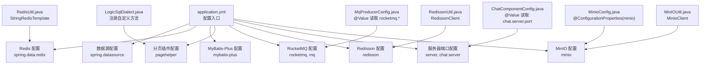
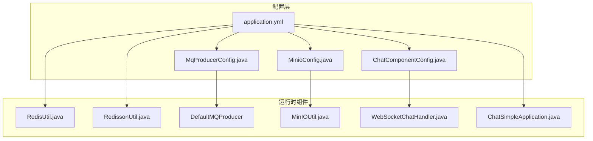
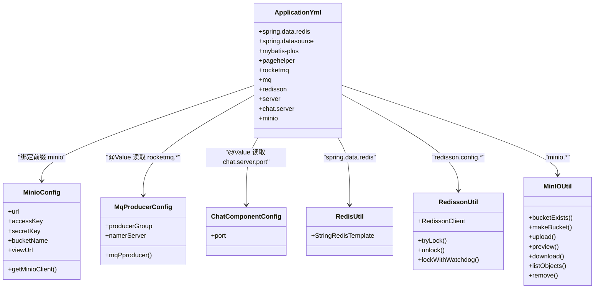

# 应用配置详解

<cite>
**本文引用的文件**
- [application.yml](file://src/main/resources/application.yml)
- [MinioConfig.java](file://src/main/java/com/hch/chat_simple/config/MinioConfig.java)
- [RedisUtil.java](file://src/main/java/com/hch/chat_simple/util/RedisUtil.java)
- [RedissonUtil.java](file://src/main/java/com/hch/chat_simple/util/RedissonUtil.java)
- [MqProducerConfig.java](file://src/main/java/com/hch/chat_simple/mq/MqProducerConfig.java)
- [ChatComponentConfig.java](file://src/main/java/com/hch/chat_simple/config/ChatComponentConfig.java)
- [WebSocketChatHandler.java](file://src/main/java/com/hch/chat_simple/handler/WebSocketChatHandler.java)
- [MinIOUtil.java](file://src/main/java/com/hch/chat_simple/util/MinIOUtil.java)
- [LogicSqlDialect.java](file://src/main/java/com/hch/chat_simple/config/LogicSqlDialect.java)
- [ChatSimpleApplication.java](file://src/main/java/com/hch/chat_simple/ChatSimpleApplication.java)
</cite>

## 目录
1. [简介](#简介)
2. [项目结构与配置入口](#项目结构与配置入口)
3. [核心配置总览](#核心配置总览)
4. [架构概览](#架构概览)
5. [详细配置解析](#详细配置解析)
6. [依赖关系分析](#依赖关系分析)
7. [性能与安全考量](#性能与安全考量)
8. [故障排查指南](#故障排查指南)
9. [结论](#结论)

## 简介
本技术文档围绕应用的配置文件 application.yml 展开，系统性梳理并解释各配置段落的作用、默认值、可选范围与实际应用场景，并结合代码实现给出最佳实践建议。重点覆盖以下方面：
- 数据库连接配置（spring.datasource）
- Redis 缓存配置（spring.data.redis）
- MyBatis-Plus 配置（mybatis-plus）
- 分页插件配置（pagehelper）
- RocketMQ 消息队列配置（rocketmq、mq）
- Redisson 分布式配置（redisson）
- 服务器端口配置（server、chat.server）
- MinIO 对象存储配置（minio）

同时，文档通过图示展示关键组件间的交互流程，帮助读者快速理解配置如何驱动运行时行为。

## 项目结构与配置入口
应用采用 Spring Boot 标准目录结构，配置集中在 resources 目录下的 application.yml；核心业务组件通过 Java 配置类或工具类读取这些配置，形成“配置文件 + Java 组件”的解耦架构。

图表来源
- [application.yml:1-89](file://src/main/resources/application.yml#L1-L89)
- [MinioConfig.java:1-33](file://src/main/java/com/hch/chat_simple/config/MinioConfig.java#L1-L33)
- [MqProducerConfig.java:1-31](file://src/main/java/com/hch/chat_simple/mq/MqProducerConfig.java#L1-L31)
- [ChatComponentConfig.java:1-39](file://src/main/java/com/hch/chat_simple/config/ChatComponentConfig.java#L1-L39)
- [RedisUtil.java:1-123](file://src/main/java/com/hch/chat_simple/util/RedisUtil.java#L1-L123)
- [RedissonUtil.java:1-53](file://src/main/java/com/hch/chat_simple/util/RedissonUtil.java#L1-L53)
- [MinIOUtil.java:1-198](file://src/main/java/com/hch/chat_simple/util/MinIOUtil.java#L1-L198)
- [LogicSqlDialect.java:1-20](file://src/main/java/com/hch/chat_simple/config/LogicSqlDialect.java#L1-L20)

章节来源
- [application.yml:1-89](file://src/main/resources/application.yml#L1-L89)

## 核心配置总览
本节对各配置段落进行快速扫描，明确其作用域与关键键位，便于后续深入解析。

- spring.data.redis：Redis 连接与连接池参数
- spring.datasource：MySQL 数据源驱动、URL、账号密码
- mybatis-plus：逻辑删除字段、Mapper XML 扫描路径
- pagehelper：分页方言、合理化分页、方法参数支持
- rocketmq：NameServer 地址、生产者/消费者分组
- mq：消息主题名称（单聊、群聊、组合）
- redisson：单节点模式配置、连接池、超时重试、地址与数据库索引
- server：HTTP 服务端口
- chat.server：WebSocket 服务端口
- minio：MinIO 访问密钥、桶名、URL、安全开关

章节来源
- [application.yml:1-89](file://src/main/resources/application.yml#L1-L89)

## 架构概览
下图展示了配置如何影响运行时组件的装配与交互，体现从配置到组件的映射关系。

图表来源
- [application.yml:1-89](file://src/main/resources/application.yml#L1-L89)
- [MinioConfig.java:1-33](file://src/main/java/com/hch/chat_simple/config/MinioConfig.java#L1-L33)
- [MqProducerConfig.java:1-31](file://src/main/java/com/hch/chat_simple/mq/MqProducerConfig.java#L1-L31)
- [ChatComponentConfig.java:1-39](file://src/main/java/com/hch/chat_simple/config/ChatComponentConfig.java#L1-L39)
- [RedisUtil.java:1-123](file://src/main/java/com/hch/chat_simple/util/RedisUtil.java#L1-L123)
- [RedissonUtil.java:1-53](file://src/main/java/com/hch/chat_simple/util/RedissonUtil.java#L1-L53)
- [MinIOUtil.java:1-198](file://src/main/java/com/hch/chat_simple/util/MinIOUtil.java#L1-L198)
- [WebSocketChatHandler.java:1-196](file://src/main/java/com/hch/chat_simple/handler/WebSocketChatHandler.java#L1-L196)
- [ChatSimpleApplication.java:1-24](file://src/main/java/com/hch/chat_simple/ChatSimpleApplication.java#L1-L24)

## 详细配置解析

### 数据库连接配置（spring.datasource）
- 作用：定义 MySQL 数据源的驱动类、连接 URL、用户名与密码，供 MyBatis-Plus 与数据库交互使用。
- 关键键位
  - driver-class-name：JDBC 驱动类名
  - url：数据库连接字符串（包含字符集、SSL、批处理等参数）
  - username/password：数据库凭据
- 默认值与可选范围
  - driver-class-name：需匹配实际驱动（如 MySQL 8.x 常用驱动）
  - url：需符合 JDBC URL 规范，包含主机、端口、数据库名与参数
  - username/password：字符串类型，建议使用受控环境变量或密文
- 实际应用场景
  - 初始化数据源 Bean，供 MyBatis-Plus 自动配置使用
  - 支持批量 SQL 重写以提升写入性能
- 最佳实践
  - 生产环境使用只读账号与最小权限策略
  - 启用连接池参数（如 HikariCP）并监控连接泄漏
  - 使用 SSL 连接与强密码策略

章节来源
- [application.yml:16-20](file://src/main/resources/application.yml#L16-L20)

### Redis 缓存配置（spring.data.redis）
- 作用：定义 Redis 连接参数与连接池配置，供 Spring Data Redis 使用。
- 关键键位
  - host/port：Redis 主机与端口
  - database：数据库索引（0~15）
  - password：可选密码
  - lettuce.pool.max-active/max-idle/min-idle：连接池并发与空闲控制
  - lettuce.shutdown-timeout：优雅关闭超时
- 默认值与可选范围
  - host/port：字符串与整数
  - database：整数（通常 0）
  - pool 参数：正整数，建议根据 QPS 与实例数调优
- 实际应用场景
  - 缓存热点数据、会话存储、分布式锁（配合 Redisson）
  - 作为消息队列的前置存储（如 RocketMQ 的本地队列）
- 最佳实践
  - 合理设置最大连接数与最小空闲，避免频繁创建销毁
  - 开启密码与网络隔离，生产环境建议启用 TLS
  - 结合过期策略与内存淘汰策略，防止内存膨胀

章节来源
- [application.yml:2-13](file://src/main/resources/application.yml#L2-L13)

### MyBatis-Plus 配置（mybatis-plus）
- 作用：定义 MyBatis-Plus 的全局配置与 Mapper XML 扫描路径。
- 关键键位
  - global-config.db-config.logic-delete-field：逻辑删除字段名
  - global-config.db-config.logic-delete-value/not-delete-value：逻辑删除标记值
  - mapper-locations：Mapper XML 文件扫描路径
  - configuration：可选日志实现（注释示例）
- 默认值与可选范围
  - 逻辑删除字段与值需与实体模型一致
  - mapper-locations 为通配符路径，确保 XML 文件被正确加载
- 实际应用场景
  - 快速 CRUD、分页查询、条件构造器、自动填充
  - 与 PageHelper 协同实现复杂分页场景
- 最佳实践
  - 明确逻辑删除策略，统一维护 dr 字段
  - 将 XML 放置于 classpath:/mapper/**/ 下，便于扫描
  - 启用日志便于调试 SQL（开发环境）

章节来源
- [application.yml:24-32](file://src/main/resources/application.yml#L24-L32)

### 分页插件配置（pagehelper）
- 作用：配置 PageHelper 分页插件，支持合理化分页与方法参数传递。
- 关键键位
  - helperDialect：数据库方言（示例为 mysql）
  - reasonable：开启合理化分页（越界自动修正）
  - supportMethodsArguments：支持通过方法参数传入分页信息
  - params：额外参数（示例为 count=countSql）
- 默认值与可选范围
  - dialect：可选 mysql/postgresql/sqlserver 等
  - reasonable：布尔值
  - supportMethodsArguments：布尔值
  - params：字符串键值对
- 实际应用场景
  - 列表查询、后台管理、分页列表渲染
  - 与 MyBatis-Plus 查询条件组合使用
- 最佳实践
  - 在高并发场景下避免一次性返回大量数据
  - 合理设置分页大小，防止内存压力过大
  - 自定义方言类（如 LogicSqlDialect）以适配复杂 SQL

章节来源
- [application.yml:34-38](file://src/main/resources/application.yml#L34-L38)
- [LogicSqlDialect.java:1-20](file://src/main/java/com/hch/chat_simple/config/LogicSqlDialect.java#L1-L20)
- [ChatSimpleApplication.java:1-24](file://src/main/java/com/hch/chat_simple/ChatSimpleApplication.java#L1-L24)

### RocketMQ 消息队列配置（rocketmq、mq）
- 作用：定义 RocketMQ NameServer 地址、生产者与消费者分组，以及消息主题名称。
- 关键键位
  - rocketmq.name-server：NameServer 地址
  - rocketmq.producer.group：生产者分组
  - rocketmq.consumer.group/single/composition：消费者分组与标签
  - mq.topic.multi-chat/single-chat/composition：主题名称
- 默认值与可选范围
  - name-server：IP:Port 格式
  - group：字符串标识，建议按业务域划分
  - topic：字符串，建议语义化命名
- 实际应用场景
  - 异步消息发送（单聊、群聊、组合消息）
  - 解耦业务流程，提升系统吞吐
- 最佳实践
  - 生产者与消费者分组独立，便于扩展与治理
  - 主题与标签设计遵循业务维度，避免过度碎片化
  - 生产者端启用重试与幂等，消费者端处理异常与死信队列

章节来源
- [application.yml:39-51](file://src/main/resources/application.yml#L39-L51)
- [MqProducerConfig.java:1-31](file://src/main/java/com/hch/chat_simple/mq/MqProducerConfig.java#L1-L31)
- [WebSocketChatHandler.java:57-61](file://src/main/java/com/hch/chat_simple/handler/WebSocketChatHandler.java#L57-L61)

### Redisson 分布式配置（redisson）
- 作用：配置 Redisson 客户端，提供分布式锁、限流、发布订阅等功能。
- 关键键位
  - redisson.config.singleServerConfig.address：Redis 地址（含协议与端口）
  - redisson.config.singleServerConfig.database：数据库索引
  - redisson.config.singleServerConfig.connectionPoolSize/connectionMinimumIdleSize：连接池大小与最小空闲
  - redisson.config.singleServerConfig.subscriptionConnectionPoolSize：订阅连接池大小
  - redisson.config.singleServerConfig.idleConnectionTimeout/connectTimeout/timeout/retryAttempts/retryInterval：超时与重试
  - redisson.config.singleServerConfig.subscriptionsPerConnection：每连接订阅数
  - redisson.config.singleServerConfig.clientName：客户端名称
- 默认值与可选范围
  - address：字符串，格式为 redis://host:port
  - database：整数（0~15）
  - 连接池参数：正整数
  - 超时与重试：毫秒级数值
- 实际应用场景
  - 分布式锁（tryLock、watchdog 自动续期）
  - 并发控制与资源保护
- 最佳实践
  - 合理设置连接池大小，避免连接不足或浪费
  - watchdog 机制适合长任务，短任务可关闭以减少续约开销
  - 密码与网络隔离，生产环境建议启用 TLS

章节来源
- [application.yml:54-69](file://src/main/resources/application.yml#L54-L69)
- [RedissonUtil.java:1-53](file://src/main/java/com/hch/chat_simple/util/RedissonUtil.java#L1-L53)

### 服务器端口配置（server、chat.server）
- 作用：分别定义 HTTP 服务与 WebSocket 服务的监听端口。
- 关键键位
  - server.port：HTTP 服务端口
  - chat.server.port：WebSocket 服务端口
- 默认值与可选范围
  - port：整数（1024~65535），避免 privileged 端口
- 实际应用场景
  - HTTP API 提供 REST 接口
  - WebSocket 提供实时通信通道
- 最佳实践
  - 将 HTTP 与 WebSocket 端口分离，便于网关与负载均衡配置
  - 在容器化部署中通过环境变量覆盖端口
  - 配合 Nginx/OpenResty 进行反向代理与静态资源服务

章节来源
- [application.yml:74-78](file://src/main/resources/application.yml#L74-L78)
- [ChatComponentConfig.java:33-34](file://src/main/java/com/hch/chat_simple/config/ChatComponentConfig.java#L33-L34)

### MinIO 对象存储配置（minio）
- 作用：定义 MinIO 访问所需的端点、凭据、桶名与安全开关。
- 关键键位
  - minio.url：MinIO 服务地址
  - minio.accessKey/secretKey：访问凭据
  - minio.bucketName：默认桶名
  - minio.secure：是否启用 HTTPS
  - minio.viewUrl：对外访问 URL（代码中声明但未在配置中赋值）
- 默认值与可选范围
  - url：HTTP/HTTPS 地址
  - accessKey/secretKey：字符串
  - bucketName：字符串
  - secure：布尔值
- 实际应用场景
  - 文件上传、预览、下载、列举与删除
  - 生成预签名 URL 供前端直传或预览
- 最佳实践
  - 使用只读/受限策略的 IAM 凭据
  - 生产环境启用 HTTPS 与证书校验
  - 桶策略与生命周期规则配合，控制成本与合规

章节来源
- [application.yml:84-89](file://src/main/resources/application.yml#L84-L89)
- [MinioConfig.java:1-33](file://src/main/java/com/hch/chat_simple/config/MinioConfig.java#L1-L33)
- [MinIOUtil.java:1-198](file://src/main/java/com/hch/chat_simple/util/MinIOUtil.java#L1-L198)

## 依赖关系分析
下图展示配置与组件之间的依赖关系，帮助理解配置如何驱动组件初始化与运行。

图表来源
- [application.yml:1-89](file://src/main/resources/application.yml#L1-L89)
- [MinioConfig.java:1-33](file://src/main/java/com/hch/chat_simple/config/MinioConfig.java#L1-L33)
- [MqProducerConfig.java:1-31](file://src/main/java/com/hch/chat_simple/mq/MqProducerConfig.java#L1-L31)
- [ChatComponentConfig.java:1-39](file://src/main/java/com/hch/chat_simple/config/ChatComponentConfig.java#L1-L39)
- [RedisUtil.java:1-123](file://src/main/java/com/hch/chat_simple/util/RedisUtil.java#L1-L123)
- [RedissonUtil.java:1-53](file://src/main/java/com/hch/chat_simple/util/RedissonUtil.java#L1-L53)
- [MinIOUtil.java:1-198](file://src/main/java/com/hch/chat_simple/util/MinIOUtil.java#L1-L198)

## 性能与安全考量
- 性能调优
  - 数据库连接池：根据 QPS 与事务并发调整最大连接数与空闲连接数
  - Redis 连接池：平衡连接数与 CPU/内存占用，避免频繁创建销毁
  - PageHelper：合理设置分页大小，避免一次性加载过多数据
  - RocketMQ：生产者批量发送、压缩与重试策略，消费者并发度与消费组拆分
  - Redisson：watchdog 续期周期与锁粒度，避免过度续约
- 安全配置
  - 数据库：使用只读账号、最小权限、强密码、SSL 连接
  - Redis：启用密码、网络隔离、TLS、ACL 控制
  - MinIO：IAM 策略、HTTPS、桶策略与生命周期
  - RocketMQ：NameServer 与 Broker 网络隔离、ACL 与 TLS

## 故障排查指南
- 数据库连接失败
  - 检查 driver-class-name 与 URL 是否匹配目标数据库版本
  - 核对用户名与密码，确认网络连通性
- Redis 连接异常
  - 确认 host/port 与网络可达，检查密码与 database 索引
  - 调整连接池参数，观察连接泄漏与超时
- MyBatis-Plus 逻辑删除不生效
  - 确认实体字段与逻辑删除字段名一致，检查全局配置
- PageHelper 分页结果异常
  - 检查 helperDialect 与合理化参数，确认 SQL 语法兼容
- RocketMQ 生产/消费异常
  - 核对 NameServer 地址与分组，检查主题与标签配置
- MinIO 上传/下载失败
  - 确认桶存在与权限策略，检查 secure 与 URL 配置
- WebSocket 端口冲突
  - 检查 server.port 与 chat.server.port 是否与其他进程冲突

## 结论
本文基于 application.yml 与相关 Java 配置类，系统梳理了数据库、缓存、ORM、分页、消息队列、分布式锁、服务器端口与对象存储等核心配置项。通过图示与最佳实践建议，帮助读者在开发与生产环境中高效、安全地完成配置落地与运维优化。