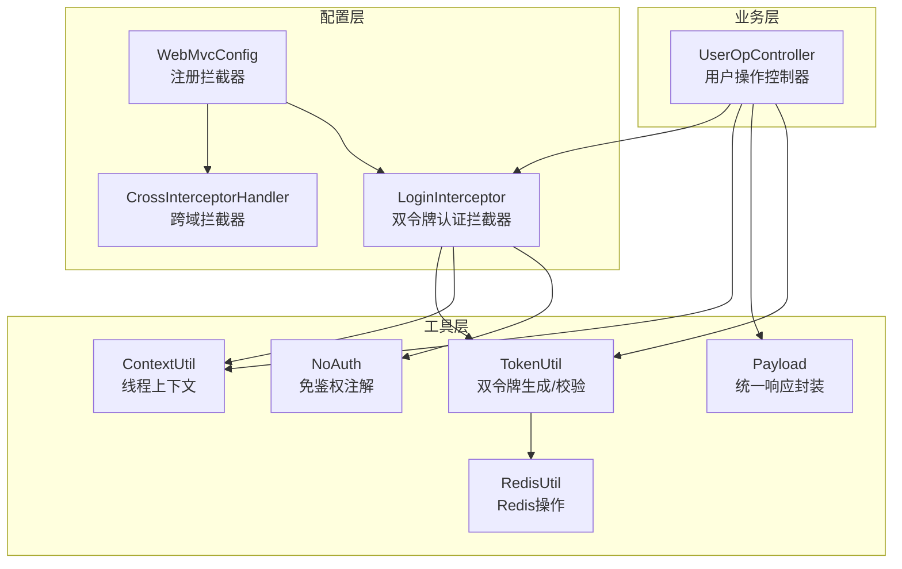
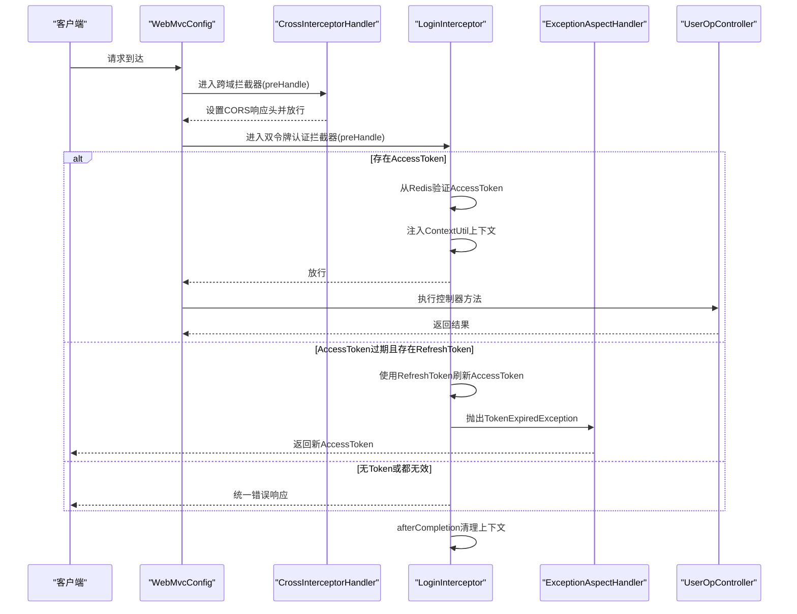
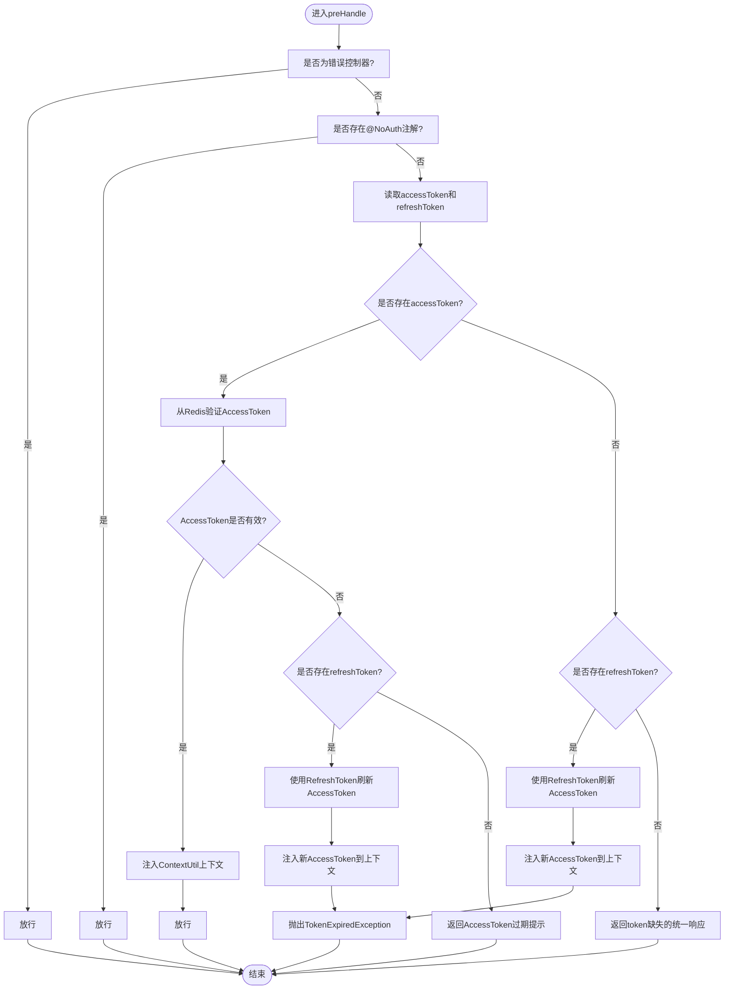
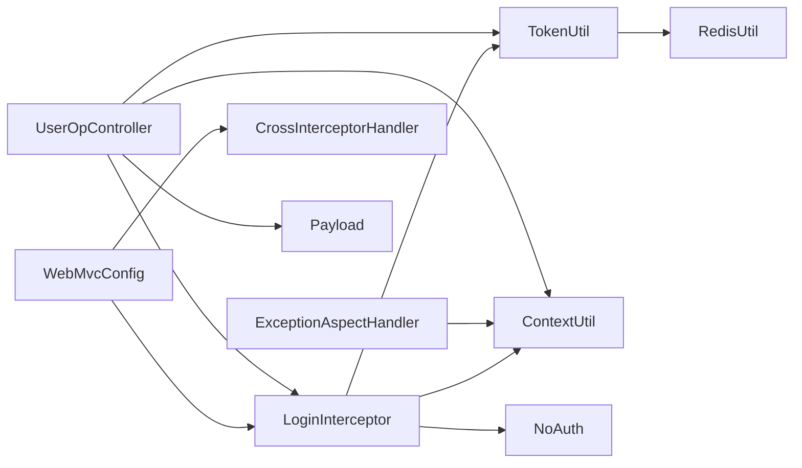

# 拦截器配置

<cite>
**本文引用的文件**
- [CrossInterceptorHandler.java](file://src/main/java/com/hch/chat_simple/config/CrossInterceptorHandler.java)
- [LoginInterceptor.java](file://src/main/java/com/hch/chat_simple/config/LoginInterceptor.java)
- [WebMvcConfig.java](file://src/main/java/com/hch/chat_simple/config/WebMvcConfig.java)
- [TokenUtil.java](file://src/main/java/com/hch/chat_simple/util/TokenUtil.java)
- [ContextUtil.java](file://src/main/java/com/hch/chat_simple/util/ContextUtil.java)
- [NoAuth.java](file://src/main/java/com/hch/chat_simple/auth/NoAuth.java)
- [ExceptionAspectHandler.java](file://src/main/java/com/hch/chat_simple/config/ExceptionAspectHandler.java)
- [UserOpController.java](file://src/main/java/com/hch/chat_simple/controller/UserOpController.java)
- [TokenInfoDTO.java](file://src/main/java/com/hch/chat_simple/pojo/dto/TokenInfoDTO.java)
- [TokenPairDTO.java](file://src/main/java/com/hch/chat_simple/pojo/dto/TokenPairDTO.java)
- [RedisUtil.java](file://src/main/java/com/hch/chat_simple/util/RedisUtil.java)
</cite>

## 目录
1. [简介](#简介)
2. [项目结构](#项目结构)
3. [核心组件](#核心组件)
4. [架构总览](#架构总览)
5. [详细组件分析](#详细组件分析)
6. [双令牌认证机制](#双令牌认证机制)
7. [依赖分析](#依赖分析)
8. [性能考虑](#性能考虑)
9. [故障排查指南](#故障排查指南)
10. [结论](#结论)
11. [附录](#附录)

## 简介
本技术文档聚焦于项目中的拦截器配置与实现，重点介绍两个核心拦截器：
- 跨域拦截器：CrossInterceptorHandler，负责设置CORS响应头、处理预检请求、允许携带凭据等。
- 登录拦截器：LoginInterceptor，负责双令牌认证机制、JWT令牌验证、权限检查、用户上下文注入与过期续签机制。

同时，文档说明拦截器链的注册顺序、执行时机、异常处理策略，并给出性能优化、安全注意事项与调试技巧，帮助开发者正确配置与维护拦截器体系。

**更新** 本版本新增双令牌认证机制的详细说明，包括登录、刷新和登出三个核心接口的实现。

## 项目结构
拦截器相关代码主要位于以下位置：
- config 包：拦截器实现与WebMvc配置
- util 包：Token生成与校验、线程上下文传递、Redis操作
- auth 包：免鉴权注解
- controller 包：用户操作控制器，包含登录、刷新、登出等核心接口

**图表来源**
- [WebMvcConfig.java:11-16](file://src/main/java/com/hch/chat_simple/config/WebMvcConfig.java#L11-L16)
- [CrossInterceptorHandler.java:10-25](file://src/main/java/com/hch/chat_simple/config/CrossInterceptorHandler.java#L10-L25)
- [LoginInterceptor.java:24-28](file://src/main/java/com/hch/chat_simple/config/LoginInterceptor.java#L24-L28)
- [TokenUtil.java:19-199](file://src/main/java/com/hch/chat_simple/util/TokenUtil.java#L19-L199)
- [ContextUtil.java:5-62](file://src/main/java/com/hch/chat_simple/util/ContextUtil.java#L5-L62)
- [NoAuth.java:10-13](file://src/main/java/com/hch/chat_simple/auth/NoAuth.java#L10-L13)
- [UserOpController.java:44-87](file://src/main/java/com/hch/chat_simple/controller/UserOpController.java#L44-L87)
- [RedisUtil.java:19-127](file://src/main/java/com/hch/chat_simple/util/RedisUtil.java#L19-L127)

**章节来源**
- [WebMvcConfig.java:11-16](file://src/main/java/com/hch/chat_simple/config/WebMvcConfig.java#L11-L16)

## 核心组件
- CrossInterceptorHandler：实现HandlerInterceptor接口，统一设置CORS相关响应头，允许指定来源、方法、请求头与凭据；对OPTIONS预检请求友好。
- LoginInterceptor：实现HandlerInterceptor接口，负责双令牌认证机制，包括：
  - 忽略特定控制器（如错误控制器）
  - 放行带@NoAuth注解的方法或类型
  - 优先验证Redis中的AccessToken，不存在时使用JWT的RefreshToken刷新
  - 将用户信息写入ContextUtil线程上下文
  - 对即将过期的token触发续签并抛出异常，由全局异常处理器返回新token
  - 在afterCompletion中清理上下文
- WebMvcConfig：在Spring MVC中注册拦截器，定义拦截路径与排除路径，控制执行顺序与生效范围
- TokenUtil：封装双令牌生成与校验，包括AccessToken（Redis存储，30分钟）和RefreshToken（JWT，7天）的管理
- ContextUtil：基于TransmittableThreadLocal的线程上下文，存储用户标识、新token和新AccessToken
- NoAuth：自定义注解，标注无需鉴权的接口
- ExceptionAspectHandler：全局异常处理，捕获TokenExpiredException并返回包含新AccessToken的统一响应
- UserOpController：用户操作控制器，包含登录、刷新、登出等核心接口，演示双令牌机制

**章节来源**
- [CrossInterceptorHandler.java:10-25](file://src/main/java/com/hch/chat_simple/config/CrossInterceptorHandler.java#L10-L25)
- [LoginInterceptor.java:24-145](file://src/main/java/com/hch/chat_simple/config/LoginInterceptor.java#L24-L145)
- [WebMvcConfig.java:11-16](file://src/main/java/com/hch/chat_simple/config/WebMvcConfig.java#L11-L16)
- [TokenUtil.java:19-199](file://src/main/java/com/hch/chat_simple/util/TokenUtil.java#L19-L199)
- [ContextUtil.java:5-62](file://src/main/java/com/hch/chat_simple/util/ContextUtil.java#L5-L62)
- [NoAuth.java:8-13](file://src/main/java/com/hch/chat_simple/auth/NoAuth.java#L8-L13)
- [ExceptionAspectHandler.java:16-34](file://src/main/java/com/hch/chat_simple/config/ExceptionAspectHandler.java#L16-L34)
- [UserOpController.java:44-172](file://src/main/java/com/hch/chat_simple/controller/UserOpController.java#L44-L172)

## 架构总览
拦截器链在WebMvcConfig中注册，先执行跨域拦截器，再执行双令牌认证拦截器。双令牌认证拦截器内部通过Redis和JWT双重机制控制放行与鉴权流程，配合全局异常处理器完成过期token的续签与响应。

**图表来源**
- [WebMvcConfig.java:11-16](file://src/main/java/com/hch/chat_simple/config/WebMvcConfig.java#L11-L16)
- [CrossInterceptorHandler.java:10-25](file://src/main/java/com/hch/chat_simple/config/CrossInterceptorHandler.java#L10-L25)
- [LoginInterceptor.java:32-89](file://src/main/java/com/hch/chat_simple/config/LoginInterceptor.java#L32-L89)
- [ExceptionAspectHandler.java:23-31](file://src/main/java/com/hch/chat_simple/config/ExceptionAspectHandler.java#L23-L31)
- [UserOpController.java:44-172](file://src/main/java/com/hch/chat_simple/controller/UserOpController.java#L44-L172)

## 详细组件分析

### 跨域拦截器 CrossInterceptorHandler
- 工作原理
  - 实现preHandle，在响应阶段设置CORS相关响应头，允许指定来源、允许的方法、允许的请求头、是否携带凭据以及预检缓存时间。
  - 返回true表示继续执行后续拦截器与控制器。
- 关键点
  - 允许来源固定为"**https://chat.front.com**"，可根据部署环境调整。
  - 允许携带Cookie（Access-Control-Allow-Credentials），需要与前端同源策略一致。
  - 明确允许的HTTP方法与请求头，避免浏览器因不匹配而拒绝。
  - 预检请求缓存时间为3600秒，减少重复预检请求。
- 适用场景
  - 前后端分离部署，前端域名与后端不同源时的跨域通信。
  - 需要携带Cookie的认证场景。

**章节来源**
- [CrossInterceptorHandler.java:10-25](file://src/main/java/com/hch/chat_simple/config/CrossInterceptorHandler.java#L10-L25)

### 登录拦截器 LoginInterceptor
- 工作原理
  - 在preHandle中判断处理器类型，忽略错误控制器。
  - 若方法或类型标注@NoAuth，则直接放行。
  - **双令牌认证机制**：优先验证Redis中的AccessToken，不存在时使用JWT的RefreshToken刷新。
  - 从请求头读取accessToken和refreshToken，调用TokenUtil进行校验。
  - 解析Token中的用户信息，写入ContextUtil线程上下文。
  - 对即将过期的token触发续签，抛出TokenExpiredException，交由全局异常处理器返回新token。
  - afterCompletion中清理上下文，避免内存泄漏。
- 认证逻辑
  - **双令牌优先级**：优先使用Redis中的AccessToken，不存在时使用JWT的RefreshToken刷新。
  - 令牌存在性校验：若请求头缺少token，返回统一错误响应。
  - 令牌有效性校验：调用TokenUtil.getAccessTokenInfo或parseRefreshTokenInfo进行校验。
  - 用户信息注入：将用户ID、用户名、真实姓名写入线程上下文，供后续业务使用。
  - 过期续签：当AccessToken过期时，使用RefreshToken生成新AccessToken并写入上下文，抛出异常触发全局处理。
- 异常处理
  - 通过全局@RestControllerAdvice捕获TokenExpiredException，返回包含新AccessToken的统一响应对象。

**图表来源**
- [LoginInterceptor.java:32-145](file://src/main/java/com/hch/chat_simple/config/LoginInterceptor.java#L32-L145)
- [TokenUtil.java:48-152](file://src/main/java/com/hch/chat_simple/util/TokenUtil.java#L48-L152)
- [ContextUtil.java:13-62](file://src/main/java/com/hch/chat_simple/util/ContextUtil.java#L13-L62)
- [ExceptionAspectHandler.java:23-31](file://src/main/java/com/hch/chat_simple/config/ExceptionAspectHandler.java#L23-L31)

**章节来源**
- [LoginInterceptor.java:24-145](file://src/main/java/com/hch/chat_simple/config/LoginInterceptor.java#L24-L145)
- [TokenUtil.java:48-152](file://src/main/java/com/hch/chat_simple/util/TokenUtil.java#L48-L152)
- [ContextUtil.java:13-62](file://src/main/java/com/hch/chat_simple/util/ContextUtil.java#L13-L62)
- [ExceptionAspectHandler.java:23-31](file://src/main/java/com/hch/chat_simple/config/ExceptionAspectHandler.java#L23-L31)

### 拦截器链配置与执行顺序
- 注册顺序
  - 先注册CrossInterceptorHandler，再注册LoginInterceptor。
  - 两者均对所有路径/**生效，但LoginInterceptor排除了登录、刷新、错误、Swagger等路径。
- 执行顺序
  - 进入：CrossInterceptorHandler -> LoginInterceptor
  - 退出：LoginInterceptor.afterCompletion -> 清理上下文
- 排除规则
  - 登录接口：/user/login
  - 刷新接口：/user/refresh
  - 错误页面：/error/**
  - 文档接口：/v3/api-docs/**、/swagger/**、/swagger-resources/**、/swagger-config/**
- 控制器示例
  - 登录接口标注@NoAuth，确保无需鉴权即可访问。
  - 用户信息查询接口依赖上下文中的用户ID。

**章节来源**
- [WebMvcConfig.java:11-16](file://src/main/java/com/hch/chat_simple/config/WebMvcConfig.java#L11-L16)
- [UserOpController.java:44-172](file://src/main/java/com/hch/chat_simple/controller/UserOpController.java#L44-L172)

## 双令牌认证机制

### 令牌设计与存储策略
- **AccessToken（短期令牌）**
  - 存储位置：Redis数据库
  - 有效期：30分钟
  - 特点：随机UUID字符串，便于快速验证和删除
  - 用途：API接口访问认证
- **RefreshToken（长期令牌）**
  - 存储位置：客户端（浏览器）
  - 有效期：7天
  - 特点：JWT格式，包含用户信息和类型标识
  - 用途：刷新AccessToken

### 令牌生成与管理
- **AccessToken生成**
  - 使用UUID.randomUUID()生成唯一标识符
  - 存储到Redis，设置30分钟过期时间
  - 维护userId到accessToken的映射关系
- **RefreshToken生成**
  - 使用JWT.create()生成，包含用户信息JSON字符串
  - 设置7天过期时间，包含"type":"refresh"声明
  - 使用固定密钥和签发者进行签名

### 令牌验证流程
- **AccessToken验证**
  - 从Redis中查找对应用户信息
  - 不存在则视为过期，尝试使用RefreshToken刷新
- **RefreshToken验证**
  - 使用JWTVerifier严格校验过期时间和签名
  - 解析用户信息JSON字符串
  - 生成新的AccessToken并存储到Redis

### 登录接口实现
- **登录流程**
  - 验证用户名和密码（BCrypt加密验证）
  - 创建AccessToken并存储到Redis
  - 创建RefreshToken（JWT格式）返回给客户端
  - 返回TokenPairDTO包含两个令牌

### 刷新接口实现
- **刷新流程**
  - 验证refreshToken的有效性
  - 解析用户信息并生成新的AccessToken
  - 更新Redis中的用户映射关系
  - 返回包含新AccessToken的TokenPairDTO

### 登出接口实现
- **登出流程**
  - 从ContextUtil获取当前用户ID
  - 删除Redis中对应的AccessToken
  - 清理用户映射关系
  - 返回登出成功消息

**章节来源**
- [UserOpController.java:49-131](file://src/main/java/com/hch/chat_simple/controller/UserOpController.java#L49-L131)
- [TokenUtil.java:39-99](file://src/main/java/com/hch/chat_simple/util/TokenUtil.java#L39-L99)
- [TokenPairDTO.java:8-25](file://src/main/java/com/hch/chat_simple/pojo/dto/TokenPairDTO.java#L8-L25)

## 依赖分析
- 组件耦合
  - LoginInterceptor依赖TokenUtil进行双令牌校验，依赖ContextUtil注入用户上下文，依赖NoAuth注解控制放行。
  - ExceptionAspectHandler依赖ContextUtil获取新AccessToken并返回统一响应。
  - TokenUtil依赖RedisUtil进行Redis操作，依赖JWT库进行RefreshToken验证。
  - WebMvcConfig集中管理拦截器注册与排除路径。
- 可能的循环依赖
  - 截至当前代码，拦截器之间无直接循环依赖，依赖方向清晰：拦截器 -> 工具类 -> 上下文。
- 外部依赖
  - JWT库用于RefreshToken生成与校验
  - Redis用于AccessToken存储与管理
  - Spring MVC拦截器框架
  - FastJSON用于JSON序列化与反序列化

**图表来源**
- [LoginInterceptor.java:24-145](file://src/main/java/com/hch/chat_simple/config/LoginInterceptor.java#L24-L145)
- [TokenUtil.java:19-199](file://src/main/java/com/hch/chat_simple/util/TokenUtil.java#L19-L199)
- [ContextUtil.java:5-62](file://src/main/java/com/hch/chat_simple/util/ContextUtil.java#L5-L62)
- [NoAuth.java:10-13](file://src/main/java/com/hch/chat_simple/auth/NoAuth.java#L10-L13)
- [ExceptionAspectHandler.java:16-34](file://src/main/java/com/hch/chat_simple/config/ExceptionAspectHandler.java#L16-L34)
- [WebMvcConfig.java:11-16](file://src/main/java/com/hch/chat_simple/config/WebMvcConfig.java#L11-L16)
- [UserOpController.java:44-172](file://src/main/java/com/hch/chat_simple/controller/UserOpController.java#L44-L172)
- [RedisUtil.java:19-127](file://src/main/java/com/hch/chat_simple/util/RedisUtil.java#L19-L127)

## 性能考虑
- 拦截器链短小精悍
  - 仅两个拦截器，避免过多链路开销。
- 预检缓存
  - CORS预检缓存时间较长，减少重复OPTIONS请求。
- 双令牌优化
  - Redis中的AccessToken验证成本极低，使用键值查找。
  - RefreshToken验证仅在AccessToken过期时触发，降低整体验证开销。
- token校验成本低
  - Redis键值查找和JWT解析开销较小，建议避免在高频接口中频繁校验。
- 上下文清理
  - afterCompletion及时清理，防止线程复用导致的内存泄漏。
- 建议
  - 对热点接口可考虑在业务层缓存用户信息，减少重复解析。
  - 合理设置token过期时间，平衡安全性与用户体验。
  - 使用Redis集群提高AccessToken存储的可用性和性能。

## 故障排查指南
- token缺失或无效
  - 现象：登录拦截器返回统一错误响应。
  - 排查：确认请求头是否包含accessToken或refreshToken，token格式是否正确。
- AccessToken过期
  - 现象：抛出TokenExpiredException，全局异常处理器返回新AccessToken。
  - 排查：检查客户端是否正确使用refreshToken刷新；服务端Redis中是否还存在对应记录。
- RefreshToken无效
  - 现象：返回refreshToken已过期的统一响应。
  - 排查：确认RefreshToken是否过期或被篡改；检查JWT签名和密钥。
- 跨域问题
  - 现象：浏览器报跨域错误。
  - 排查：确认响应头是否正确设置，来源是否匹配，是否允许携带凭据。
- 免鉴权注解未生效
  - 现象：标注@NoAuth的接口仍被拦截。
  - 排查：确认注解是否正确标注在方法或类型上，拦截器是否识别该注解。
- 上下文未清理
  - 现象：线程复用导致数据串扰。
  - 排查：确认afterCompletion是否执行，是否手动清空上下文。
- Redis连接问题
  - 现象：AccessToken存储或获取失败。
  - 排查：确认Redis服务是否正常；网络连接是否稳定；键值格式是否正确。

**章节来源**
- [LoginInterceptor.java:81-89](file://src/main/java/com/hch/chat_simple/config/LoginInterceptor.java#L81-L89)
- [ExceptionAspectHandler.java:23-31](file://src/main/java/com/hch/chat_simple/config/ExceptionAspectHandler.java#L23-L31)
- [CrossInterceptorHandler.java:14-23](file://src/main/java/com/hch/chat_simple/config/CrossInterceptorHandler.java#L14-L23)
- [NoAuth.java:8-13](file://src/main/java/com/hch/chat_simple/auth/NoAuth.java#L8-L13)
- [ContextUtil.java:53-62](file://src/main/java/com/hch/chat_simple/util/ContextUtil.java#L53-L62)

## 结论
本拦截器体系通过跨域与双令牌认证两大拦截器，实现了前后端分离场景下的CORS支持与双令牌认证能力。双令牌机制通过Redis和JWT的组合，既保证了安全性，又提供了良好的用户体验。结合免鉴权注解与全局异常处理，既保证了安全性，又提供了良好的开发体验。建议在生产环境中根据实际域名与安全策略调整CORS来源与token密钥，并持续监控拦截器链路与异常日志，确保系统稳定运行。

## 附录
- 配置清单
  - CORS来源：https://chat.front.com
  - 允许方法：POST, GET, PUT, OPTIONS
  - 允许请求头：x-requested-with, accept, authorization, content-type
  - 允许携带凭据：true
  - 预检缓存时间：3600秒
  - AccessToken有效期：30分钟（Redis存储）
  - RefreshToken有效期：7天（JWT存储）
  - token密钥：testabcd
  - 签发者：chat_admin
  - Redis键前缀：accessToken:, userAccessToken:
- 常见问题
  - 如何修改CORS来源？请在CrossInterceptorHandler中调整响应头值。
  - 如何新增免鉴权接口？在对应方法或类型上添加@NoAuth注解。
  - 如何扩展登录拦截器？可在preHandle中增加额外校验逻辑，并在afterCompletion中补充清理步骤。
  - 如何处理双令牌刷新失败？检查RefreshToken的有效性和Redis连接状态。
  - 如何优化双令牌性能？考虑使用Redis集群和连接池，减少网络延迟。