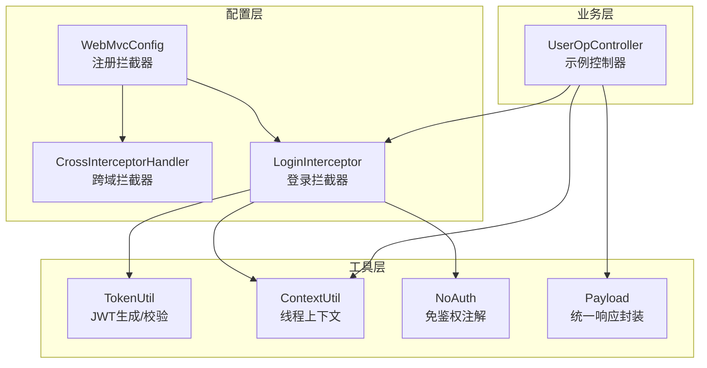
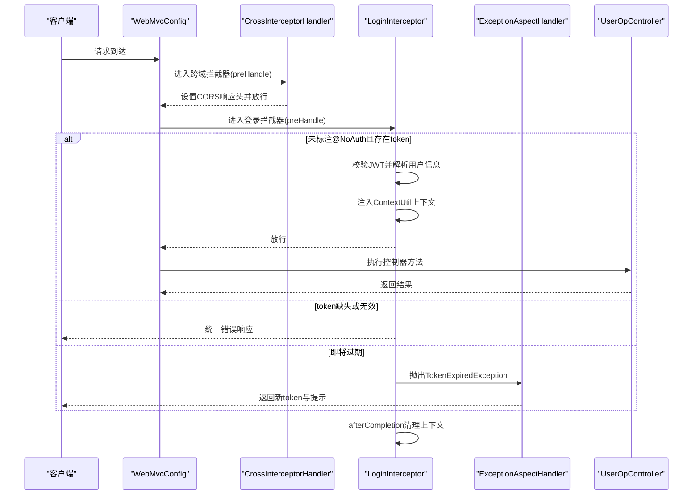
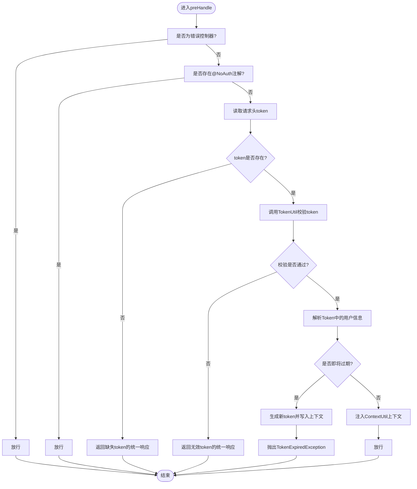
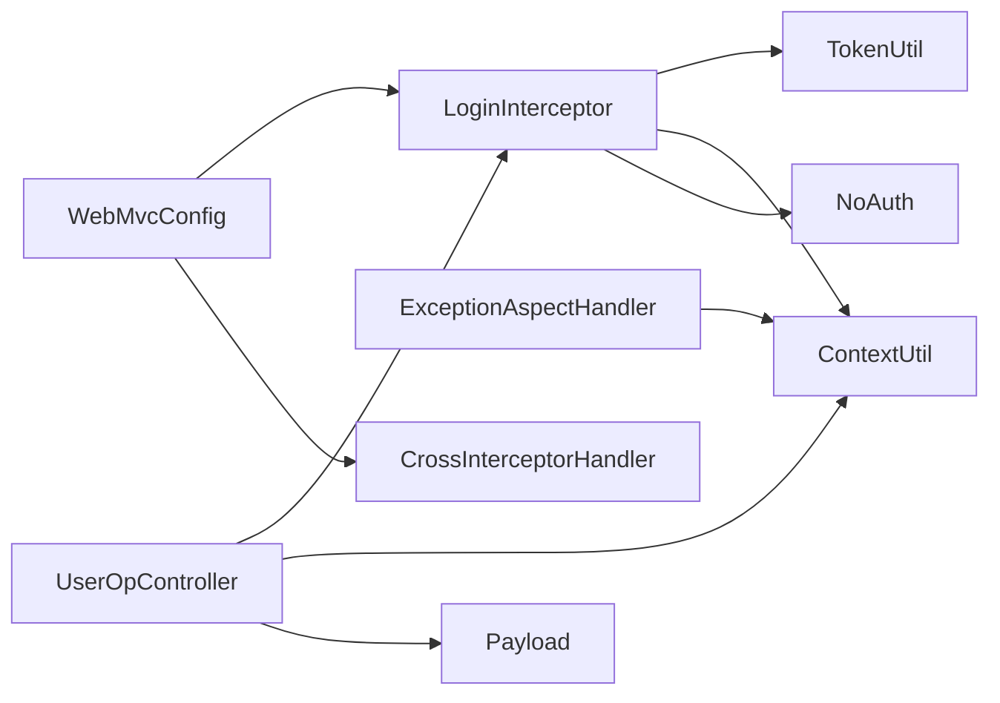

# 拦截器配置

<cite>
**本文引用的文件**
- [CrossInterceptorHandler.java](file://src/main/java/com/hch/chat_simple/config/CrossInterceptorHandler.java)
- [LoginInterceptor.java](file://src/main/java/com/hch/chat_simple/config/LoginInterceptor.java)
- [WebMvcConfig.java](file://src/main/java/com/hch/chat_simple/config/WebMvcConfig.java)
- [TokenUtil.java](file://src/main/java/com/hch/chat_simple/util/TokenUtil.java)
- [ContextUtil.java](file://src/main/java/com/hch/chat_simple/util/ContextUtil.java)
- [NoAuth.java](file://src/main/java/com/hch/chat_simple/auth/NoAuth.java)
- [ExceptionAspectHandler.java](file://src/main/java/com/hch/chat_simple/config/ExceptionAspectHandler.java)
- [UserOpController.java](file://src/main/java/com/hch/chat_simple/controller/UserOpController.java)
- [TokenInfoDTO.java](file://src/main/java/com/hch/chat_simple/pojo/dto/TokenInfoDTO.java)
- [Payload.java](file://src/main/java/com/hch/chat_simple/util/Payload.java)
</cite>

## 目录
1. [简介](#简介)
2. [项目结构](#项目结构)
3. [核心组件](#核心组件)
4. [架构总览](#架构总览)
5. [详细组件分析](#详细组件分析)
6. [依赖分析](#依赖分析)
7. [性能考虑](#性能考虑)
8. [故障排查指南](#故障排查指南)
9. [结论](#结论)
10. [附录](#附录)

## 简介
本技术文档聚焦于项目中的拦截器配置与实现，重点介绍两个核心拦截器：
- 跨域拦截器：CrossInterceptorHandler，负责设置CORS响应头、处理预检请求、允许携带凭据等。
- 登录拦截器：LoginInterceptor，负责JWT令牌验证、权限检查、用户上下文注入与过期续签机制。

同时，文档说明拦截器链的注册顺序、执行时机、异常处理策略，并给出性能优化、安全注意事项与调试技巧，帮助开发者正确配置与维护拦截器体系。

## 项目结构
拦截器相关代码主要位于以下位置：
- config 包：拦截器实现与WebMvc配置
- util 包：Token生成与校验、线程上下文传递
- auth 包：免鉴权注解
- controller 包：示例控制器，演示拦截器生效范围与上下文使用

图表来源
- [WebMvcConfig.java:11-16](file://src/main/java/com/hch/chat_simple/config/WebMvcConfig.java#L11-L16)
- [CrossInterceptorHandler.java:10-25](file://src/main/java/com/hch/chat_simple/config/CrossInterceptorHandler.java#L10-L25)
- [LoginInterceptor.java:30-90](file://src/main/java/com/hch/chat_simple/config/LoginInterceptor.java#L30-L90)
- [TokenUtil.java:23-59](file://src/main/java/com/hch/chat_simple/util/TokenUtil.java#L23-L59)
- [ContextUtil.java:12-49](file://src/main/java/com/hch/chat_simple/util/ContextUtil.java#L12-L49)
- [NoAuth.java:10-13](file://src/main/java/com/hch/chat_simple/auth/NoAuth.java#L10-L13)
- [UserOpController.java:44-87](file://src/main/java/com/hch/chat_simple/controller/UserOpController.java#L44-L87)
- [Payload.java:18-28](file://src/main/java/com/hch/chat_simple/util/Payload.java#L18-L28)

章节来源
- [WebMvcConfig.java:11-16](file://src/main/java/com/hch/chat_simple/config/WebMvcConfig.java#L11-L16)

## 核心组件
- CrossInterceptorHandler：实现HandlerInterceptor接口，统一设置CORS相关响应头，允许指定来源、方法、请求头与凭据；对OPTIONS预检请求友好。
- LoginInterceptor：实现HandlerInterceptor接口，负责：
  - 忽略特定控制器（如错误控制器）
  - 放行带@NoAuth注解的方法或类型
  - 从请求头读取token，调用TokenUtil进行JWT校验
  - 将用户信息写入ContextUtil线程上下文
  - 对即将过期的token触发续签并抛出异常，由全局异常处理器返回新token
  - 在afterCompletion中清理上下文
- WebMvcConfig：在Spring MVC中注册拦截器，定义拦截路径与排除路径，控制执行顺序与生效范围
- TokenUtil：封装JWT生成与校验，包含密钥、签发者、过期时间与解析逻辑
- ContextUtil：基于TransmittableThreadLocal的线程上下文，存储用户标识与新token
- NoAuth：自定义注解，标注无需鉴权的接口
- ExceptionAspectHandler：全局异常处理，捕获TokenExpiredException并返回包含新token的统一响应
- UserOpController：示例控制器，演示登录接口（免鉴权）、用户信息查询（需鉴权）与上下文使用

章节来源
- [CrossInterceptorHandler.java:10-25](file://src/main/java/com/hch/chat_simple/config/CrossInterceptorHandler.java#L10-L25)
- [LoginInterceptor.java:30-97](file://src/main/java/com/hch/chat_simple/config/LoginInterceptor.java#L30-L97)
- [WebMvcConfig.java:11-16](file://src/main/java/com/hch/chat_simple/config/WebMvcConfig.java#L11-L16)
- [TokenUtil.java:19-59](file://src/main/java/com/hch/chat_simple/util/TokenUtil.java#L19-L59)
- [ContextUtil.java:5-49](file://src/main/java/com/hch/chat_simple/util/ContextUtil.java#L5-L49)
- [NoAuth.java:8-13](file://src/main/java/com/hch/chat_simple/auth/NoAuth.java#L8-L13)
- [ExceptionAspectHandler.java:16-20](file://src/main/java/com/hch/chat_simple/config/ExceptionAspectHandler.java#L16-L20)
- [UserOpController.java:44-87](file://src/main/java/com/hch/chat_simple/controller/UserOpController.java#L44-L87)

## 架构总览
拦截器链在WebMvcConfig中注册，先执行跨域拦截器，再执行登录拦截器。登录拦截器内部通过注解与上下文控制放行与鉴权流程，配合全局异常处理器完成过期token的续签与响应。

图表来源
- [WebMvcConfig.java:11-16](file://src/main/java/com/hch/chat_simple/config/WebMvcConfig.java#L11-L16)
- [CrossInterceptorHandler.java:10-25](file://src/main/java/com/hch/chat_simple/config/CrossInterceptorHandler.java#L10-L25)
- [LoginInterceptor.java:30-97](file://src/main/java/com/hch/chat_simple/config/LoginInterceptor.java#L30-L97)
- [ExceptionAspectHandler.java:16-20](file://src/main/java/com/hch/chat_simple/config/ExceptionAspectHandler.java#L16-L20)
- [UserOpController.java:44-87](file://src/main/java/com/hch/chat_simple/controller/UserOpController.java#L44-L87)

## 详细组件分析

### 跨域拦截器 CrossInterceptorHandler
- 工作原理
  - 实现preHandle，在响应阶段设置CORS相关响应头，允许指定来源、允许的方法、允许的请求头、是否携带凭据以及预检缓存时间。
  - 返回true表示继续执行后续拦截器与控制器。
- 关键点
  - 允许来源固定为“https://chat.front.com”，可根据部署环境调整。
  - 允许携带Cookie（Access-Control-Allow-Credentials），需要与前端同源策略一致。
  - 明确允许的HTTP方法与请求头，避免浏览器因不匹配而拒绝。
  - 预检请求缓存时间为3600秒，减少重复预检请求。
- 适用场景
  - 前后端分离部署，前端域名与后端不同源时的跨域通信。
  - 需要携带Cookie的认证场景。

章节来源
- [CrossInterceptorHandler.java:10-25](file://src/main/java/com/hch/chat_simple/config/CrossInterceptorHandler.java#L10-L25)

### 登录拦截器 LoginInterceptor
- 工作原理
  - 在preHandle中判断处理器类型，忽略错误控制器。
  - 若方法或类型标注@NoAuth，则直接放行。
  - 从请求头读取token，调用TokenUtil进行校验。
  - 解析Token中的用户信息，写入ContextUtil线程上下文。
  - 对即将过期的token触发续签，抛出TokenExpiredException，交由全局异常处理器返回新token。
  - afterCompletion中清理上下文，避免内存泄漏。
- 认证逻辑
  - 令牌存在性校验：若请求头缺少token，返回统一错误响应。
  - 令牌有效性校验：调用TokenUtil.verifyToken进行签名与签发者校验。
  - 用户信息注入：将用户ID、用户名、真实姓名写入线程上下文，供后续业务使用。
  - 过期续签：当令牌即将过期时，生成新token并写入上下文，抛出异常触发全局处理。
- 异常处理
  - 通过全局@RestControllerAdvice捕获TokenExpiredException，返回包含新token的统一响应对象。

图表来源
- [LoginInterceptor.java:30-90](file://src/main/java/com/hch/chat_simple/config/LoginInterceptor.java#L30-L90)
- [TokenUtil.java:48-59](file://src/main/java/com/hch/chat_simple/util/TokenUtil.java#L48-L59)
- [ContextUtil.java:12-49](file://src/main/java/com/hch/chat_simple/util/ContextUtil.java#L12-L49)
- [ExceptionAspectHandler.java:16-20](file://src/main/java/com/hch/chat_simple/config/ExceptionAspectHandler.java#L16-L20)

章节来源
- [LoginInterceptor.java:30-97](file://src/main/java/com/hch/chat_simple/config/LoginInterceptor.java#L30-L97)
- [TokenUtil.java:48-59](file://src/main/java/com/hch/chat_simple/util/TokenUtil.java#L48-L59)
- [ContextUtil.java:12-49](file://src/main/java/com/hch/chat_simple/util/ContextUtil.java#L12-L49)
- [ExceptionAspectHandler.java:16-20](file://src/main/java/com/hch/chat_simple/config/ExceptionAspectHandler.java#L16-L20)

### 拦截器链配置与执行顺序
- 注册顺序
  - 先注册CrossInterceptorHandler，再注册LoginInterceptor。
  - 两者均对所有路径/**生效，但LoginInterceptor排除了登录、错误、Swagger等路径。
- 执行顺序
  - 进入：CrossInterceptorHandler -> LoginInterceptor
  - 退出：LoginInterceptor.afterCompletion -> 清理上下文
- 排除规则
  - 登录接口：/user/login
  - 错误页面：/error/**
  - 文档接口：/v3/api-docs/**、/swagger/**、/swagger-resources/**、/swagger-config/**
- 控制器示例
  - 登录接口标注@NoAuth，确保无需鉴权即可访问。
  - 用户信息查询接口依赖上下文中的用户ID。

章节来源
- [WebMvcConfig.java:11-16](file://src/main/java/com/hch/chat_simple/config/WebMvcConfig.java#L11-L16)
- [UserOpController.java:44-87](file://src/main/java/com/hch/chat_simple/controller/UserOpController.java#L44-L87)

### JWT令牌生成与校验
- 生成
  - 使用HMAC256算法，密钥固定为“testabcd”，签发者为“chat_admin”，默认过期时间为30分钟。
  - 将用户信息序列化为JSON字符串作为token主体。
- 校验
  - 校验签发者与签名，允许在一定宽限时间内（30分钟）接受即将过期的token，以便获取用户信息。
  - 解析失败返回null，拦截器据此判定token无效。
- 续签
  - 当token即将过期时，拦截器生成新token并写入上下文，抛出异常触发全局处理返回新token。

章节来源
- [TokenUtil.java:19-59](file://src/main/java/com/hch/chat_simple/util/TokenUtil.java#L19-L59)
- [LoginInterceptor.java:55-66](file://src/main/java/com/hch/chat_simple/config/LoginInterceptor.java#L55-L66)

### 线程上下文与免鉴权注解
- 线程上下文
  - ContextUtil使用TransmittableThreadLocal保存用户ID、用户名、真实姓名与新token，便于业务层直接获取。
  - afterCompletion中统一清理，避免线程复用导致的数据串扰。
- 免鉴权注解
  - NoAuth支持标注在方法或类型上，默认描述字段可用于日志记录。
  - 登录接口与部分公开接口可标注该注解以放行。

章节来源
- [ContextUtil.java:5-49](file://src/main/java/com/hch/chat_simple/util/ContextUtil.java#L5-L49)
- [NoAuth.java:8-13](file://src/main/java/com/hch/chat_simple/auth/NoAuth.java#L8-L13)
- [UserOpController.java:46-111](file://src/main/java/com/hch/chat_simple/controller/UserOpController.java#L46-L111)

## 依赖分析
- 组件耦合
  - LoginInterceptor依赖TokenUtil进行JWT校验，依赖ContextUtil注入用户上下文，依赖NoAuth注解控制放行。
  - ExceptionAspectHandler依赖ContextUtil获取新token并返回统一响应。
  - WebMvcConfig集中管理拦截器注册与排除路径。
- 可能的循环依赖
  - 截至当前代码，拦截器之间无直接循环依赖，依赖方向清晰：拦截器 -> 工具类 -> 上下文。
- 外部依赖
  - JWT库用于生成与校验token
  - Spring MVC拦截器框架
  - FastJSON用于JSON序列化与反序列化

图表来源
- [LoginInterceptor.java:30-97](file://src/main/java/com/hch/chat_simple/config/LoginInterceptor.java#L30-L97)
- [TokenUtil.java:48-59](file://src/main/java/com/hch/chat_simple/util/TokenUtil.java#L48-L59)
- [ContextUtil.java:12-49](file://src/main/java/com/hch/chat_simple/util/ContextUtil.java#L12-L49)
- [NoAuth.java:10-13](file://src/main/java/com/hch/chat_simple/auth/NoAuth.java#L10-L13)
- [ExceptionAspectHandler.java:16-20](file://src/main/java/com/hch/chat_simple/config/ExceptionAspectHandler.java#L16-L20)
- [WebMvcConfig.java:11-16](file://src/main/java/com/hch/chat_simple/config/WebMvcConfig.java#L11-L16)
- [UserOpController.java:44-87](file://src/main/java/com/hch/chat_simple/controller/UserOpController.java#L44-L87)
- [Payload.java:18-28](file://src/main/java/com/hch/chat_simple/util/Payload.java#L18-L28)

## 性能考虑
- 拦截器链短小精悍
  - 仅两个拦截器，避免过多链路开销。
- 预检缓存
  - CORS预检缓存时间较长，减少重复OPTIONS请求。
- token校验成本低
  - HMAC256校验与JSON解析开销较小，建议避免在高频接口中频繁校验。
- 上下文清理
  - afterCompletion及时清理，防止线程复用导致的内存泄漏。
- 建议
  - 对热点接口可考虑在业务层缓存用户信息，减少重复解析。
  - 合理设置token过期时间，平衡安全性与用户体验。

## 故障排查指南
- token缺失或无效
  - 现象：登录拦截器返回统一错误响应。
  - 排查：确认请求头是否包含token，token格式是否正确。
- token即将过期
  - 现象：抛出TokenExpiredException，全局异常处理器返回新token。
  - 排查：检查客户端是否在过期前主动刷新token；服务端宽限时间是否合理。
- 跨域问题
  - 现象：浏览器报跨域错误。
  - 排查：确认响应头是否正确设置，来源是否匹配，是否允许携带凭据。
- 免鉴权注解未生效
  - 现象：标注@NoAuth的接口仍被拦截。
  - 排查：确认注解是否正确标注在方法或类型上，拦截器是否识别该注解。
- 上下文未清理
  - 现象：线程复用导致数据串扰。
  - 排查：确认afterCompletion是否执行，是否手动清空上下文。

章节来源
- [LoginInterceptor.java:74-82](file://src/main/java/com/hch/chat_simple/config/LoginInterceptor.java#L74-L82)
- [ExceptionAspectHandler.java:16-20](file://src/main/java/com/hch/chat_simple/config/ExceptionAspectHandler.java#L16-L20)
- [CrossInterceptorHandler.java:14-23](file://src/main/java/com/hch/chat_simple/config/CrossInterceptorHandler.java#L14-L23)
- [NoAuth.java:8-13](file://src/main/java/com/hch/chat_simple/auth/NoAuth.java#L8-L13)
- [ContextUtil.java:44-49](file://src/main/java/com/hch/chat_simple/util/ContextUtil.java#L44-L49)

## 结论
本拦截器体系通过跨域与登录两大拦截器，实现了前后端分离场景下的CORS支持与JWT认证能力。结合免鉴权注解与全局异常处理，既保证了安全性，又提供了良好的开发体验。建议在生产环境中根据实际域名与安全策略调整CORS来源与token密钥，并持续监控拦截器链路与异常日志，确保系统稳定运行。

## 附录
- 配置清单
  - CORS来源：https://chat.front.com
  - 允许方法：POST, GET, PUT, OPTIONS
  - 允许请求头：x-requested-with, accept, authorization, content-type
  - 允许携带凭据：true
  - 预检缓存时间：3600秒
  - token密钥：testabcd
  - 签发者：chat_admin
  - 默认过期时间：30分钟
  - 宽限时间：30分钟（用于续签）
- 常见问题
  - 如何修改CORS来源？请在CrossInterceptorHandler中调整响应头值。
  - 如何新增免鉴权接口？在对应方法或类型上添加@NoAuth注解。
  - 如何扩展登录拦截器？可在preHandle中增加额外校验逻辑，并在afterCompletion中补充清理步骤。