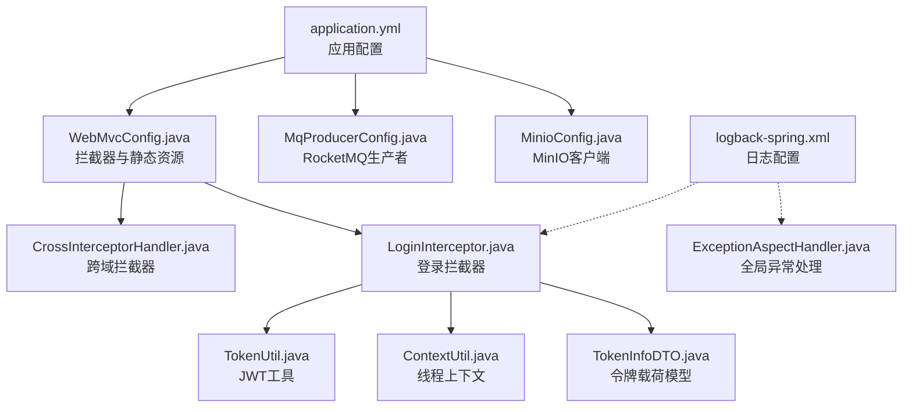
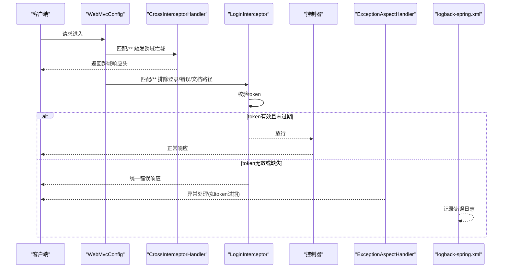
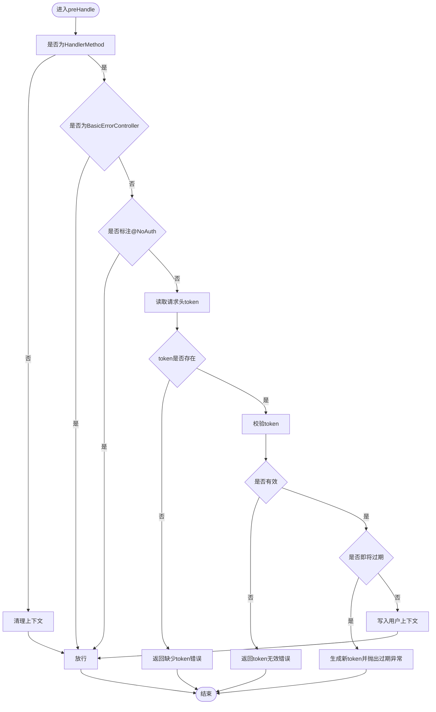
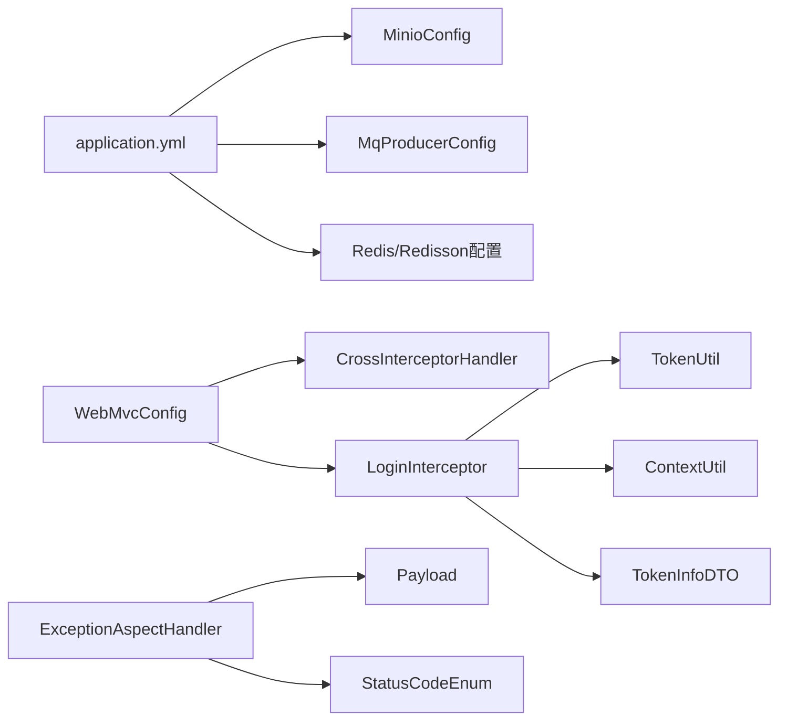

# 配置管理

<cite>
**本文引用的文件**
- [application.yml](file://src/main/resources/application.yml)
- [WebMvcConfig.java](file://src/main/java/com/hch/chat_simple/config/WebMvcConfig.java)
- [CrossInterceptorHandler.java](file://src/main/java/com/hch/chat_simple/config/CrossInterceptorHandler.java)
- [LoginInterceptor.java](file://src/main/java/com/hch/chat_simple/config/LoginInterceptor.java)
- [ExceptionAspectHandler.java](file://src/main/java/com/hch/chat_simple/config/ExceptionAspectHandler.java)
- [SwaggerConfigure.java](file://src/main/java/com/hch/chat_simple/config/SwaggerConfigure.java)
- [TokenUtil.java](file://src/main/java/com/hch/chat_simple/util/TokenUtil.java)
- [Payload.java](file://src/main/java/com/hch/chat_simple/util/Payload.java)
- [ContextUtil.java](file://src/main/java/com/hch/chat_simple/util/ContextUtil.java)
- [StatusCodeEnum.java](file://src/main/java/com/hch/chat_simple/util/StatusCodeEnum.java)
- [TokenInfoDTO.java](file://src/main/java/com/hch/chat_simple/pojo/dto/TokenInfoDTO.java)
- [MinioConfig.java](file://src/main/java/com/hch/chat_simple/config/MinioConfig.java)
- [MqProducerConfig.java](file://src/main/java/com/hch/chat_simple/mq/MqProducerConfig.java)
- [logback-spring.xml](file://src/main/resources/logback-spring.xml)
</cite>

## 目录
1. [简介](#简介)
2. [项目结构](#项目结构)
3. [核心组件](#核心组件)
4. [架构总览](#架构总览)
5. [详细组件分析](#详细组件分析)
6. [依赖关系分析](#依赖关系分析)
7. [性能考虑](#性能考虑)
8. [故障排查指南](#故障排查指南)
9. [结论](#结论)
10. [附录](#附录)

## 简介
本文件系统性梳理该Spring Boot应用的配置管理与扩展点，覆盖以下主题：
- application.yml中数据库、Redis、MyBatis-Plus、分页插件、RocketMQ、Redisson、服务器端口、MinIO等关键配置项说明
- WebMvcConfig的拦截器与静态资源映射配置
- 跨域拦截器与登录拦截器的实现与作用范围
- 全局异常处理机制（统一异常捕获、错误响应格式、日志记录）
- Swagger文档配置现状与建议
- 文件存储（MinIO）的配置与使用
- 消息队列（RocketMQ）生产者配置
- 多环境配置与配置热更新的实践建议

## 项目结构
该项目采用标准Spring Boot目录结构，配置相关的关键文件集中在resources与config包内：
- application.yml：应用主配置文件，集中定义数据源、Redis、MyBatis-Plus、分页、RocketMQ、Redisson、服务器端口、MinIO等
- config包：WebMvc配置、拦截器、全局异常处理、Swagger配置、MinIO配置、Netty共享对象、HTTP客户端池等
- util包：Token工具、上下文传递、统一响应体、状态码枚举、日志配置等
- mq包：RocketMQ生产者配置

**图表来源**
- [application.yml:1-89](file://src/main/resources/application.yml#L1-L89)
- [WebMvcConfig.java:1-28](file://src/main/java/com/hch/chat_simple/config/WebMvcConfig.java#L1-L28)
- [CrossInterceptorHandler.java:1-28](file://src/main/java/com/hch/chat_simple/config/CrossInterceptorHandler.java#L1-L28)
- [LoginInterceptor.java:1-109](file://src/main/java/com/hch/chat_simple/config/LoginInterceptor.java#L1-L109)
- [TokenUtil.java:1-71](file://src/main/java/com/hch/chat_simple/util/TokenUtil.java#L1-L71)
- [ContextUtil.java:1-52](file://src/main/java/com/hch/chat_simple/util/ContextUtil.java#L1-L52)
- [TokenInfoDTO.java:1-20](file://src/main/java/com/hch/chat_simple/pojo/dto/TokenInfoDTO.java#L1-L20)
- [MqProducerConfig.java:1-31](file://src/main/java/com/hch/chat_simple/mq/MqProducerConfig.java#L1-L31)
- [MinioConfig.java:1-33](file://src/main/java/com/hch/chat_simple/config/MinioConfig.java#L1-L33)
- [logback-spring.xml:1-24](file://src/main/resources/logback-spring.xml#L1-L24)
- [ExceptionAspectHandler.java:1-24](file://src/main/java/com/hch/chat_simple/config/ExceptionAspectHandler.java#L1-L24)

**章节来源**
- [application.yml:1-89](file://src/main/resources/application.yml#L1-L89)
- [WebMvcConfig.java:1-28](file://src/main/java/com/hch/chat_simple/config/WebMvcConfig.java#L1-L28)

## 核心组件
- 应用配置(application.yml)：集中定义数据源、Redis、MyBatis-Plus、分页、RocketMQ、Redisson、服务器端口、MinIO等
- WebMvc配置(WebMvcConfig)：注册跨域与登录拦截器，配置静态资源映射
- 拦截器：跨域拦截器(CrossInterceptorHandler)、登录拦截器(LoginInterceptor)
- 全局异常处理(ExceptionAspectHandler)：统一捕获特定异常，返回标准化响应
- 工具类：TokenUtil、ContextUtil、Payload、StatusCodeEnum、TokenInfoDTO
- 文件存储(MinioConfig)：基于@ConfigurationProperties绑定配置并注入MinioClient
- 消息队列(MqProducerConfig)：基于@Value读取配置并启动RocketMQ生产者
- 日志(logback-spring.xml)：SQL与业务日志输出级别配置

**章节来源**
- [application.yml:1-89](file://src/main/resources/application.yml#L1-L89)
- [WebMvcConfig.java:1-28](file://src/main/java/com/hch/chat_simple/config/WebMvcConfig.java#L1-L28)
- [CrossInterceptorHandler.java:1-28](file://src/main/java/com/hch/chat_simple/config/CrossInterceptorHandler.java#L1-L28)
- [LoginInterceptor.java:1-109](file://src/main/java/com/hch/chat_simple/config/LoginInterceptor.java#L1-L109)
- [ExceptionAspectHandler.java:1-24](file://src/main/java/com/hch/chat_simple/config/ExceptionAspectHandler.java#L1-L24)
- [TokenUtil.java:1-71](file://src/main/java/com/hch/chat_simple/util/TokenUtil.java#L1-L71)
- [ContextUtil.java:1-52](file://src/main/java/com/hch/chat_simple/util/ContextUtil.java#L1-L52)
- [Payload.java:1-30](file://src/main/java/com/hch/chat_simple/util/Payload.java#L1-L30)
- [StatusCodeEnum.java:1-22](file://src/main/java/com/hch/chat_simple/util/StatusCodeEnum.java#L1-L22)
- [TokenInfoDTO.java:1-20](file://src/main/java/com/hch/chat_simple/pojo/dto/TokenInfoDTO.java#L1-L20)
- [MinioConfig.java:1-33](file://src/main/java/com/hch/chat_simple/config/MinioConfig.java#L1-L33)
- [MqProducerConfig.java:1-31](file://src/main/java/com/hch/chat_simple/mq/MqProducerConfig.java#L1-L31)
- [logback-spring.xml:1-24](file://src/main/resources/logback-spring.xml#L1-L24)

## 架构总览
下图展示配置与拦截链路在运行时的交互关系：

**图表来源**
- [WebMvcConfig.java:11-24](file://src/main/java/com/hch/chat_simple/config/WebMvcConfig.java#L11-L24)
- [CrossInterceptorHandler.java:10-25](file://src/main/java/com/hch/chat_simple/config/CrossInterceptorHandler.java#L10-L25)
- [LoginInterceptor.java:30-97](file://src/main/java/com/hch/chat_simple/config/LoginInterceptor.java#L30-L97)
- [ExceptionAspectHandler.java:16-20](file://src/main/java/com/hch/chat_simple/config/ExceptionAspectHandler.java#L16-L20)
- [logback-spring.xml:13-18](file://src/main/resources/logback-spring.xml#L13-L18)

## 详细组件分析

### application.yml 配置详解
- 数据库连接
  - driver-class-name、url、username、password：定义MySQL驱动、连接串、账号与密码
  - 建议：生产环境使用密钥管理服务或环境变量注入敏感信息
- Redis
  - host、port、database：连接地址、端口、逻辑库
  - lettuce.pool.max-active/idle/min-idle、shutdown-timeout：连接池参数
  - 建议：根据QPS调整连接池大小，避免阻塞
- MyBatis-Plus
  - mapper-locations：XML映射文件路径
  - global-config.db-config.logic-delete-field/value/not-delete-value：逻辑删除字段与值
  - 建议：统一逻辑删除策略，确保查询默认过滤已删除记录
- 分页插件(PageHelper)
  - helperDialect、reasonable、supportMethodsArguments、params：方言、合理化、参数传递
  - 建议：结合业务场景开启合理化，避免超大分页
- RocketMQ
  - name-server、producer.group、consumer.group/single/composition：命名服务、生产者与消费者组
  - 建议：消费者组按功能拆分，避免消息重复消费
- MQ主题(topic.multi/single/composition)：消息主题名称
- Redisson
  - 单机配置：idleConnectionTimeout/connectTimeout/timeout/retryAttempts/retryInterval、subscriptionsPerConnection、clientName、address/database、连接池大小与最小空闲连接数
  - 建议：根据并发与延迟要求调优重试与超时参数
- 服务器(server)
  - port：HTTP监听端口
- 聊天服务(chat)
  - server.port：WebSocket监听端口
  - tag.list/local/current：标签列表、是否本地模式、当前标签
  - 建议：标签用于消息路由与负载均衡，需与业务一致
- MinIO
  - accessKey、secretKey、bucketName、secure、url：对象存储访问凭据与桶
  - 建议：生产环境启用HTTPS与最小权限策略

**章节来源**
- [application.yml:1-89](file://src/main/resources/application.yml#L1-L89)

### WebMvcConfig 自定义配置
- 拦截器注册
  - 跨域拦截器：对/**路径生效，设置Access-Control-Allow系列响应头
  - 登录拦截器：对/**路径生效，排除登录、错误、Swagger相关路径
- 静态资源映射
  - swagger-ui.html与/webjars/**映射至类路径资源
- 建议
  - 跨域白名单应从配置中心动态加载，避免硬编码
  - 登录拦截器排除路径应与实际接口保持同步

**章节来源**
- [WebMvcConfig.java:11-24](file://src/main/java/com/hch/chat_simple/config/WebMvcConfig.java#L11-L24)

### 跨域拦截器 CrossInterceptorHandler
- 功能
  - 在preHandle阶段设置跨域响应头，允许指定来源、凭证、方法与请求头
- 注意
  - 当前为硬编码域名，建议迁移到配置中心或环境变量
- 影响范围
  - 对所有受拦截的请求生效

**章节来源**
- [CrossInterceptorHandler.java:10-25](file://src/main/java/com/hch/chat_simple/config/CrossInterceptorHandler.java#L10-L25)

### 登录拦截器 LoginInterceptor
- 功能
  - 从请求头提取token，校验有效性；若即将过期则生成新token并通过切面返回
  - 将用户信息写入线程上下文，便于后续处理器使用
  - 对标注@NoAuth的方法放行
  - 对BasicErrorController放行，避免错误页面被拦截
- 关键流程
  - 解析token -> 判断过期 -> 写入上下文 -> 放行或返回错误
- 清理
  - afterCompletion中清理线程上下文，避免内存泄漏

**图表来源**
- [LoginInterceptor.java:30-97](file://src/main/java/com/hch/chat_simple/config/LoginInterceptor.java#L30-L97)
- [TokenUtil.java:48-59](file://src/main/java/com/hch/chat_simple/util/TokenUtil.java#L48-L59)
- [ContextUtil.java:12-49](file://src/main/java/com/hch/chat_simple/util/ContextUtil.java#L12-L49)

**章节来源**
- [LoginInterceptor.java:1-109](file://src/main/java/com/hch/chat_simple/config/LoginInterceptor.java#L1-L109)
- [TokenUtil.java:1-71](file://src/main/java/com/hch/chat_simple/util/TokenUtil.java#L1-L71)
- [ContextUtil.java:1-52](file://src/main/java/com/hch/chat_simple/util/ContextUtil.java#L1-L52)
- [TokenInfoDTO.java:1-20](file://src/main/java/com/hch/chat_simple/pojo/dto/TokenInfoDTO.java#L1-L20)

### 全局异常处理 ExceptionAspectHandler
- 功能
  - 捕获TokenExpiredException，记录日志并返回标准化Payload，携带新token
- 响应格式
  - 使用Payload封装data/code/remark，统一对外输出
- 建议
  - 扩展更多异常类型，统一错误码与提示

**章节来源**
- [ExceptionAspectHandler.java:1-24](file://src/main/java/com/hch/chat_simple/config/ExceptionAspectHandler.java#L1-L24)
- [Payload.java:1-30](file://src/main/java/com/hch/chat_simple/util/Payload.java#L1-L30)
- [StatusCodeEnum.java:1-22](file://src/main/java/com/hch/chat_simple/util/StatusCodeEnum.java#L1-L22)

### Swagger API 文档配置
- 现状
  - SwaggerConfigure为注释掉的示例配置，未启用
- 建议
  - 启用Swagger2或SpringDoc OpenAPI，按控制器包路径扫描，配置分组与元信息
  - 结合WebMvcConfig的静态资源映射，确保UI可访问

**章节来源**
- [SwaggerConfigure.java:1-41](file://src/main/java/com/hch/chat_simple/config/SwaggerConfigure.java#L1-L41)
- [WebMvcConfig.java:18-24](file://src/main/java/com/hch/chat_simple/config/WebMvcConfig.java#L18-L24)

### 文件存储 MinIO 配置
- 配置绑定
  - 通过@ConfigurationProperties(prefix="minio")绑定配置项
- 客户端注入
  - @Bean返回MinioClient实例，供业务使用
- 建议
  - 生产环境启用HTTPS与桶策略，限制访问范围

**章节来源**
- [MinioConfig.java:1-33](file://src/main/java/com/hch/chat_simple/config/MinioConfig.java#L1-L33)
- [application.yml:84-89](file://src/main/resources/application.yml#L84-L89)

### RocketMQ 生产者配置
- 配置读取
  - @Value读取rocketmq.name-server与producer.group
- 启动
  - 创建DefaultMQProducer并start，供消息发送使用
- 建议
  - 消费者组按业务拆分，topic命名规范，消息体序列化统一

**章节来源**
- [MqProducerConfig.java:1-31](file://src/main/java/com/hch/chat_simple/mq/MqProducerConfig.java#L1-L31)
- [application.yml:39-51](file://src/main/resources/application.yml#L39-L51)

### 日志配置 logback-spring.xml
- 控制台输出与模式
- Mapper与SQL日志级别设置为DEBUG，便于开发调试
- 建议
  - 生产环境降低SQL日志级别，避免I/O开销

**章节来源**
- [logback-spring.xml:1-24](file://src/main/resources/logback-spring.xml#L1-L24)

## 依赖关系分析
- Web层依赖
  - WebMvcConfig依赖拦截器与静态资源映射
  - LoginInterceptor依赖TokenUtil、ContextUtil、TokenInfoDTO
  - ExceptionAspectHandler依赖Payload、StatusCodeEnum
- 配置依赖
  - application.yml为各组件提供基础参数
  - MinioConfig与MqProducerConfig分别依赖application.yml中的minio与rocketmq配置
- 日志依赖
  - 登录拦截器与异常处理均使用logback输出

**图表来源**
- [application.yml:1-89](file://src/main/resources/application.yml#L1-L89)
- [WebMvcConfig.java:11-24](file://src/main/java/com/hch/chat_simple/config/WebMvcConfig.java#L11-L24)
- [CrossInterceptorHandler.java:1-28](file://src/main/java/com/hch/chat_simple/config/CrossInterceptorHandler.java#L1-L28)
- [LoginInterceptor.java:1-109](file://src/main/java/com/hch/chat_simple/config/LoginInterceptor.java#L1-L109)
- [TokenUtil.java:1-71](file://src/main/java/com/hch/chat_simple/util/TokenUtil.java#L1-L71)
- [ContextUtil.java:1-52](file://src/main/java/com/hch/chat_simple/util/ContextUtil.java#L1-L52)
- [TokenInfoDTO.java:1-20](file://src/main/java/com/hch/chat_simple/pojo/dto/TokenInfoDTO.java#L1-L20)
- [ExceptionAspectHandler.java:1-24](file://src/main/java/com/hch/chat_simple/config/ExceptionAspectHandler.java#L1-L24)
- [Payload.java:1-30](file://src/main/java/com/hch/chat_simple/util/Payload.java#L1-L30)
- [StatusCodeEnum.java:1-22](file://src/main/java/com/hch/chat_simple/util/StatusCodeEnum.java#L1-L22)
- [MinioConfig.java:1-33](file://src/main/java/com/hch/chat_simple/config/MinioConfig.java#L1-L33)
- [MqProducerConfig.java:1-31](file://src/main/java/com/hch/chat_simple/mq/MqProducerConfig.java#L1-L31)

## 性能考虑
- Redis连接池
  - 调整max-active/idle/min-idle与超时参数，匹配峰值QPS
- RocketMQ
  - 生产者与消费者分离，topic按业务拆分，避免单topic成为瓶颈
- MyBatis-Plus
  - 合理使用逻辑删除与分页，避免全表扫描
- 日志
  - 生产环境降低SQL日志级别，减少磁盘IO

## 故障排查指南
- 登录拦截器常见问题
  - 缺少token：检查请求头是否包含token，确认拦截器排除路径是否正确
  - token无效：核对签名算法与issuer，确认加密密钥一致
  - token即将过期：观察切面是否返回新token，确认前端自动刷新逻辑
- 跨域问题
  - 检查Access-Control-Allow-Origin是否与前端域名一致，必要时从配置中心动态下发
- Swagger不可用
  - 确认Swagger配置已启用，静态资源映射正常
- 日志定位
  - 使用logback-spring.xml中SQL与Mapper日志级别快速定位问题

**章节来源**
- [LoginInterceptor.java:74-82](file://src/main/java/com/hch/chat_simple/config/LoginInterceptor.java#L74-L82)
- [ExceptionAspectHandler.java:16-20](file://src/main/java/com/hch/chat_simple/config/ExceptionAspectHandler.java#L16-L20)
- [logback-spring.xml:13-18](file://src/main/resources/logback-spring.xml#L13-L18)

## 结论
本项目在配置层面实现了较为完善的基础设施：数据库、Redis、MyBatis-Plus、分页、RocketMQ、Redisson、MinIO等均有明确配置入口；Web层通过拦截器实现跨域与登录校验；全局异常处理提供统一响应与日志记录。建议后续完善Swagger启用、跨域白名单动态化、以及多环境配置与热更新方案。

## 附录

### 多环境配置与配置热更新建议
- 多环境
  - 使用application-{env}.yml区分dev/test/prod
  - 通过spring.profiles.active切换
- 配置中心
  - 引入Spring Cloud Config或Nacos，集中管理配置并支持动态刷新
- 密钥与敏感信息
  - 使用环境变量或Vault/KMS注入数据库密码、Redis密码、MinIO凭据等
- 配置热更新
  - 对于可重载配置（如跨域白名单、日志级别），优先通过配置中心推送
  - 对于连接参数（Redis、RocketMQ），建议重启生效或实现优雅停机+重建