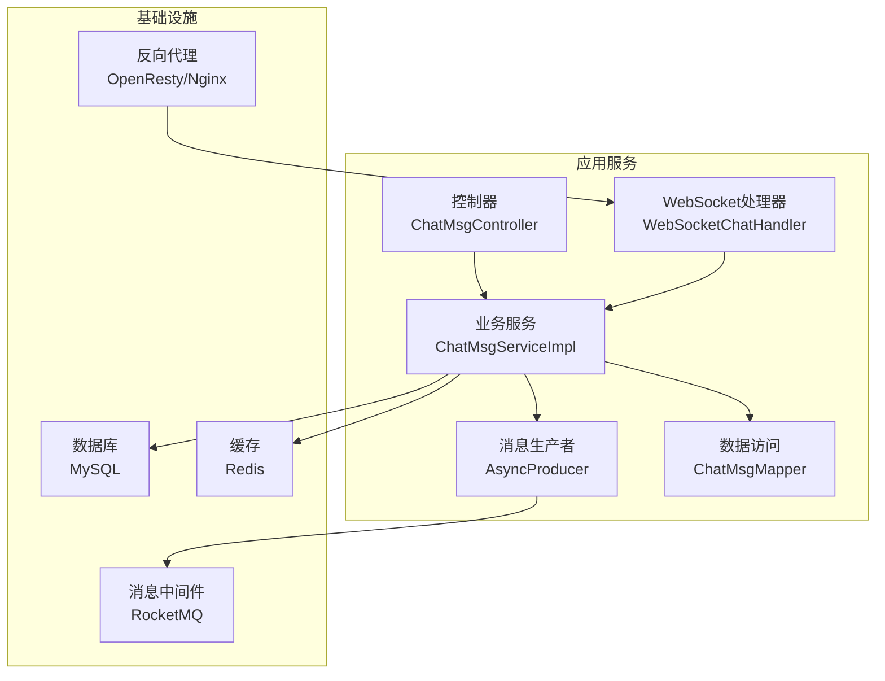
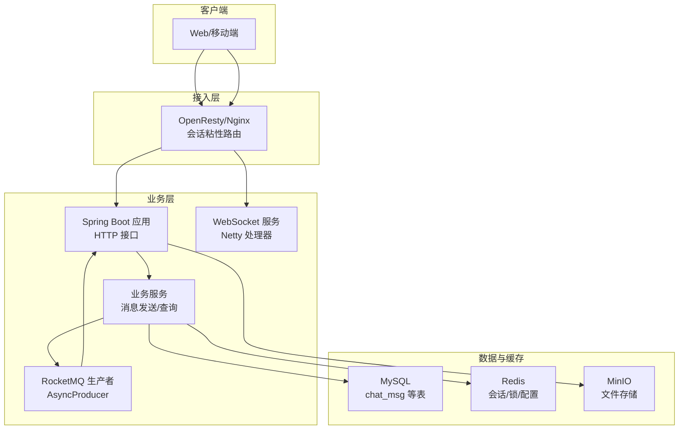
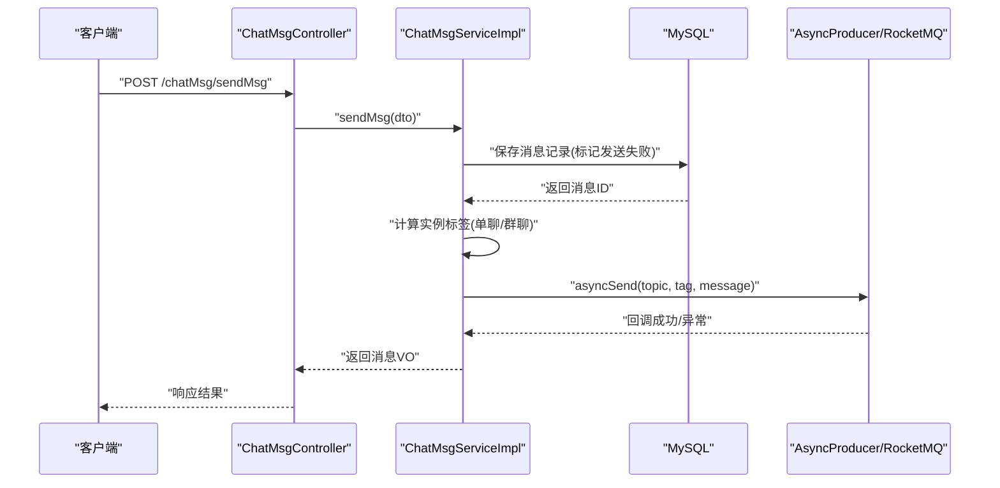
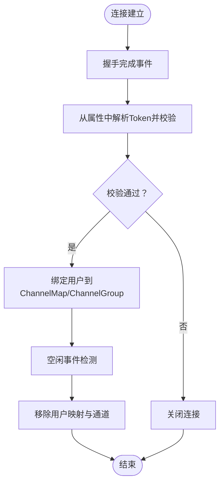
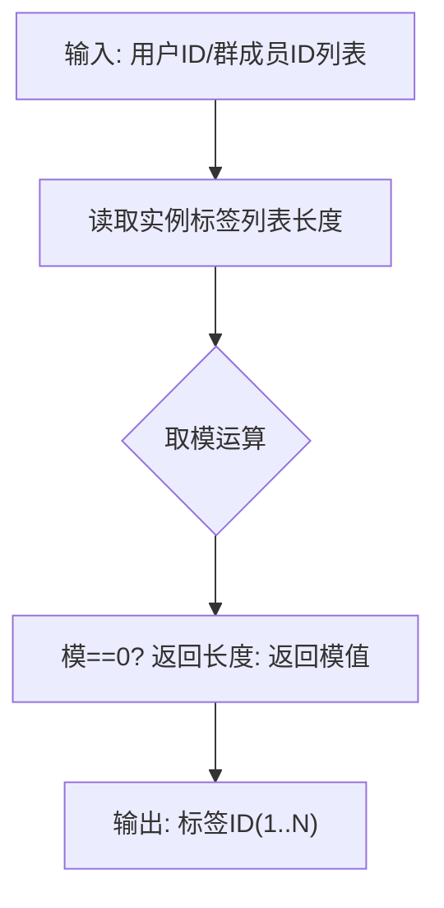
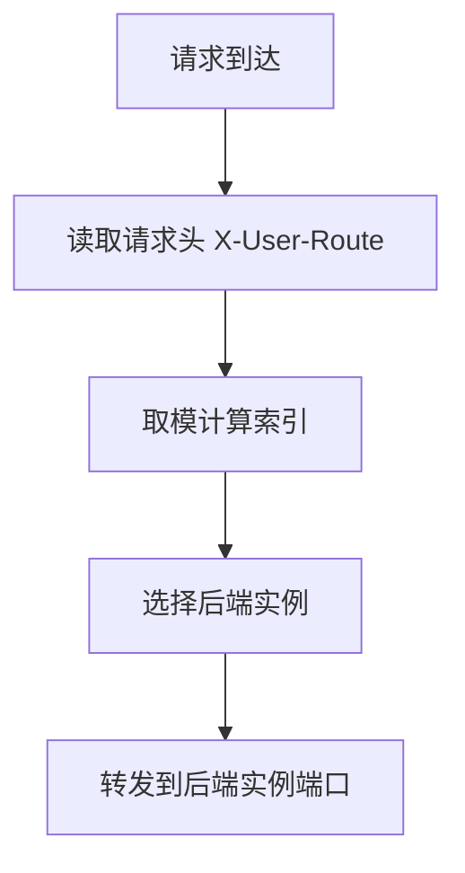
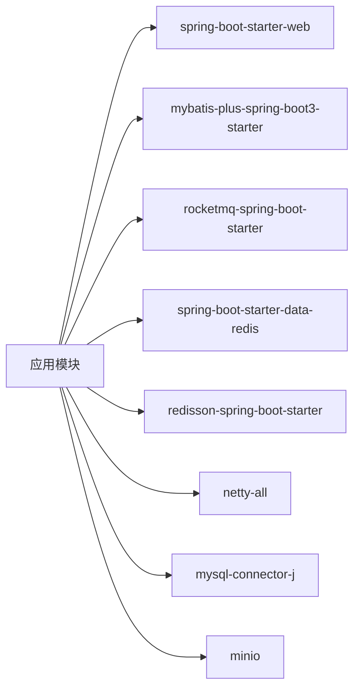

# 项目概述

<cite>
**本文引用的文件**
- [ChatSimpleApplication.java](file://src/main/java/com/hch/chat_simple/ChatSimpleApplication.java)
- [pom.xml](file://pom.xml)
- [application.yml](file://src/main/resources/application.yml)
- [chat.sql](file://db/chat.sql)
- [Dockerfile](file://Dockerfile)
- [docker-compose.yml](file://docker-compose.yml)
- [ChatMsgController.java](file://src/main/java/com/hch/chat_simple/controller/ChatMsgController.java)
- [WebSocketChatHandler.java](file://src/main/java/com/hch/chat_simple/handler/WebSocketChatHandler.java)
- [ChatMsgServiceImpl.java](file://src/main/java/com/hch/chat_simple/service/impl/ChatMsgServiceImpl.java)
- [AsyncProducer.java](file://src/main/java/com/hch/chat_simple/mq/AsyncProducer.java)
- [NettyGroup.java](file://src/main/java/com/hch/chat_simple/config/NettyGroup.java)
- [InstanceMapTagUtils.java](file://src/main/java/com/hch/chat_simple/util/InstanceMapTagUtils.java)
- [MsgTypeEnum.java](file://src/main/java/com/hch/chat_simple/enums/MsgTypeEnum.java)
- [ChatMsgDTO.java](file://src/main/java/com/hch/chat_simple/pojo/dto/ChatMsgDTO.java)
- [nginx.conf](file://openresty_nginx_conf/nginx.conf)
</cite>

## 目录
1. [简介](#简介)
2. [项目结构](#项目结构)
3. [核心组件](#核心组件)
4. [架构总览](#架构总览)
5. [详细组件分析](#详细组件分析)
6. [依赖分析](#依赖分析)
7. [性能考虑](#性能考虑)
8. [故障排查指南](#故障排查指南)
9. [结论](#结论)
10. [附录](#附录)

## 简介
本项目是一个基于 Spring Boot 的分布式即时通讯系统，支持单聊与群聊模式，具备实时消息推送能力。系统采用“HTTP + WebSocket + RocketMQ + Netty + Redis + MySQL”的技术栈组合，围绕消息的“高并发写入、可靠投递、跨实例路由”进行设计，满足多实例部署下的会话粘性与消息一致性需求。

项目定位清晰：
- 对于初学者：提供从零到一的完整示例，涵盖消息模型、接口设计、消息队列、WebSocket 会话管理与负载均衡路由。
- 对于有经验的开发者：提供可扩展的架构参考，包括消息路由标签、实例分片策略、容器化部署与 Nginx/OpenResty 负载均衡实践。

业务价值与场景：
- 实时沟通：单聊与群聊消息的高吞吐写入与投递。
- 可扩展性：通过 RocketMQ 与实例标签实现水平扩展与消息分发。
- 高可用：结合 Nginx/OpenResty 会话粘性路由与多实例部署，提升系统可用性与弹性。

## 项目结构
项目采用标准的 Spring Boot Maven 工程结构，按功能域划分包：
- controller：对外 HTTP 接口层（如聊天消息接口）
- service：业务逻辑层（消息发送、群成员查询等）
- mapper：MyBatis Plus 数据访问层
- handler：Netty WebSocket 处理器
- mq：消息队列生产者封装
- config：全局配置与 Netty 会话管理
- util：工具类（雪花 ID、Redis、实例标签映射等）
- po/dto/vo：实体、传输与视图对象
- enums：枚举定义
- resources：配置文件、XML 映射、静态资源
- db：初始化 SQL

图表来源
- [ChatMsgController.java:1-58](file://src/main/java/com/hch/chat_simple/controller/ChatMsgController.java#L1-L58)
- [ChatMsgServiceImpl.java:1-184](file://src/main/java/com/hch/chat_simple/service/impl/ChatMsgServiceImpl.java#L1-L184)
- [WebSocketChatHandler.java:1-196](file://src/main/java/com/hch/chat_simple/handler/WebSocketChatHandler.java#L1-L196)
- [AsyncProducer.java:1-63](file://src/main/java/com/hch/chat_simple/mq/AsyncProducer.java#L1-L63)
- [application.yml:1-89](file://src/main/resources/application.yml#L1-L89)
- [docker-compose.yml:1-132](file://docker-compose.yml#L1-L132)

章节来源
- [ChatSimpleApplication.java:1-25](file://src/main/java/com/hch/chat_simple/ChatSimpleApplication.java#L1-L25)
- [pom.xml:1-346](file://pom.xml#L1-L346)
- [application.yml:1-89](file://src/main/resources/application.yml#L1-L89)

## 核心组件
- 应用入口与配置
  - 启动类注册分页方言与启动 Spring Boot 应用
  - 配置文件集中管理 Redis、MySQL、MyBatis Plus、RocketMQ、Redisson、WebSocket 端口、MinIO 等
- 控制器与业务
  - 提供“发送消息”“未读消息拉取”“群聊未读查询”等接口
  - 业务层负责消息持久化、状态标记、RocketMQ 异步投递与实例标签路由
- WebSocket 与 Netty
  - 基于 Netty 的 WebSocket 处理器，完成握手、鉴权、会话维护与断连清理
  - 会话映射与通道组由 NettyGroup 统一管理
- 消息队列
  - AsyncProducer 封装 RocketMQ 生产者回调，支持单聊/群聊 Topic 与 Tag 分发
- 实例路由与标签
  - InstanceMapTagUtils 基于用户 ID 对实例总数取模，将消息路由到对应实例
- 枚举与数据模型
  - MsgTypeEnum 定义消息类型；ChatMsgDTO 描述消息请求体结构

章节来源
- [ChatMsgController.java:1-58](file://src/main/java/com/hch/chat_simple/controller/ChatMsgController.java#L1-L58)
- [ChatMsgServiceImpl.java:1-184](file://src/main/java/com/hch/chat_simple/service/impl/ChatMsgServiceImpl.java#L1-L184)
- [WebSocketChatHandler.java:1-196](file://src/main/java/com/hch/chat_simple/handler/WebSocketChatHandler.java#L1-L196)
- [AsyncProducer.java:1-63](file://src/main/java/com/hch/chat_simple/mq/AsyncProducer.java#L1-L63)
- [NettyGroup.java:1-30](file://src/main/java/com/hch/chat_simple/config/NettyGroup.java#L1-L30)
- [InstanceMapTagUtils.java:1-55](file://src/main/java/com/hch/chat_simple/util/InstanceMapTagUtils.java#L1-L55)
- [MsgTypeEnum.java:1-25](file://src/main/java/com/hch/chat_simple/enums/MsgTypeEnum.java#L1-L25)
- [ChatMsgDTO.java:1-62](file://src/main/java/com/hch/chat_simple/pojo/dto/ChatMsgDTO.java#L1-L62)

## 架构总览
系统采用“HTTP + WebSocket + RocketMQ + Netty + Redis + MySQL”的分层架构，结合 OpenResty 进行会话粘性路由与负载均衡，实现多实例部署下的高可用与可扩展性。

图表来源
- [nginx.conf:35-81](file://openresty_nginx_conf/nginx.conf#L35-L81)
- [ChatMsgController.java:1-58](file://src/main/java/com/hch/chat_simple/controller/ChatMsgController.java#L1-L58)
- [WebSocketChatHandler.java:1-196](file://src/main/java/com/hch/chat_simple/handler/WebSocketChatHandler.java#L1-L196)
- [ChatMsgServiceImpl.java:1-184](file://src/main/java/com/hch/chat_simple/service/impl/ChatMsgServiceImpl.java#L1-L184)
- [AsyncProducer.java:1-63](file://src/main/java/com/hch/chat_simple/mq/AsyncProducer.java#L1-L63)
- [application.yml:1-89](file://src/main/resources/application.yml#L1-L89)

## 详细组件分析

### 组件一：消息发送流程（HTTP → 业务 → RocketMQ → 消费 → 推送）
该流程覆盖单聊与群聊的消息发送，强调“先落库、再异步投递、最终一致性”的设计。

图表来源
- [ChatMsgController.java:45-49](file://src/main/java/com/hch/chat_simple/controller/ChatMsgController.java#L45-L49)
- [ChatMsgServiceImpl.java:97-144](file://src/main/java/com/hch/chat_simple/service/impl/ChatMsgServiceImpl.java#L97-L144)
- [AsyncProducer.java:40-59](file://src/main/java/com/hch/chat_simple/mq/AsyncProducer.java#L40-L59)

章节来源
- [ChatMsgController.java:1-58](file://src/main/java/com/hch/chat_simple/controller/ChatMsgController.java#L1-L58)
- [ChatMsgServiceImpl.java:1-184](file://src/main/java/com/hch/chat_simple/service/impl/ChatMsgServiceImpl.java#L1-L184)
- [AsyncProducer.java:1-63](file://src/main/java/com/hch/chat_simple/mq/AsyncProducer.java#L1-L63)

### 组件二：WebSocket 会话管理与鉴权
WebSocketChatHandler 负责握手、鉴权、会话加入与断连清理，并将用户与 ChannelId 绑定，便于后续消息推送。

图表来源
- [WebSocketChatHandler.java:118-175](file://src/main/java/com/hch/chat_simple/handler/WebSocketChatHandler.java#L118-L175)
- [NettyGroup.java:11-29](file://src/main/java/com/hch/chat_simple/config/NettyGroup.java#L11-L29)

章节来源
- [WebSocketChatHandler.java:1-196](file://src/main/java/com/hch/chat_simple/handler/WebSocketChatHandler.java#L1-L196)
- [NettyGroup.java:1-30](file://src/main/java/com/hch/chat_simple/config/NettyGroup.java#L1-L30)

### 组件三：实例标签与消息路由
InstanceMapTagUtils 基于用户 ID 对实例总数取模，决定消息应投递到的实例标签，从而实现“按用户分片”的路由策略。

图表来源
- [InstanceMapTagUtils.java:32-47](file://src/main/java/com/hch/chat_simple/util/InstanceMapTagUtils.java#L32-L47)

章节来源
- [InstanceMapTagUtils.java:1-55](file://src/main/java/com/hch/chat_simple/util/InstanceMapTagUtils.java#L1-L55)

### 组件四：负载均衡与会话粘性（OpenResty）
Nginx/OpenResty 通过 Lua 计算 X-User-Route 的取模值，将同一用户的请求固定到相同后端实例，保证 WebSocket 会话粘性。

图表来源
- [nginx.conf:58-78](file://openresty_nginx_conf/nginx.conf#L58-L78)

章节来源
- [nginx.conf:1-153](file://openresty_nginx_conf/nginx.conf#L1-L153)

## 依赖分析
- 技术栈与版本
  - Spring Boot 3.3.6：提供 Web、Validation、Test、DevTools 等基础能力
  - MyBatis Plus 3.5.7：简化数据访问与分页
  - RocketMQ 5.0.0：异步消息投递与解耦
  - Netty 4.1.69：WebSocket 服务端实现
  - Redis + Redisson：缓存与分布式能力
  - MySQL 5.7：持久化存储
  - MinIO：对象存储
- 关键依赖关系
  - 业务层依赖 RocketMQ 生产者进行异步投递
  - WebSocket 层依赖 Netty 与 Token 校验
  - 配置文件集中管理各组件连接参数
  - Docker Compose 提供一键编排数据库、缓存、消息中间件与应用实例

图表来源
- [pom.xml:54-315](file://pom.xml#L54-L315)

章节来源
- [pom.xml:1-346](file://pom.xml#L1-L346)
- [application.yml:1-89](file://src/main/resources/application.yml#L1-L89)

## 性能考虑
- 写入路径优化
  - 先持久化、后异步投递，确保消息不丢失；发送状态位用于后续重试与拉取
- 路由与扩展
  - 基于用户 ID 的标签分片，降低热点与跨实例通信成本
  - 多实例部署 + 负载均衡，提升吞吐与可用性
- 连接与内存
  - Netty ChannelGroup 与用户映射需配合空闲事件清理，避免内存泄漏
- 缓存与热点
  - Redis 缓存会话与配置，减少重复计算与 IO
- 数据库与分页
  - MyBatis Plus 与分页插件配合，合理设计索引以支撑高并发查询

## 故障排查指南
- WebSocket 无法连接
  - 检查 Nginx/OpenResty 路由头 X-User-Route 是否正确传入
  - 确认后端实例端口与 WebSocket 端口映射一致
- 消息未送达
  - 核对 RocketMQ NameServer 地址与消费者组配置
  - 查看生产回调日志，确认发送异常与重试策略
- 会话粘性失效
  - 确认请求头 X-User-Route 与后端实例数量一致
  - 检查取模逻辑与实例标签配置
- 数据不一致
  - 校验消息状态位更新逻辑与未读消息拉取条件
  - 检查数据库连接与事务配置

章节来源
- [nginx.conf:58-78](file://openresty_nginx_conf/nginx.conf#L58-L78)
- [AsyncProducer.java:44-58](file://src/main/java/com/hch/chat_simple/mq/AsyncProducer.java#L44-L58)
- [WebSocketChatHandler.java:118-175](file://src/main/java/com/hch/chat_simple/handler/WebSocketChatHandler.java#L118-L175)
- [ChatMsgServiceImpl.java:71-95](file://src/main/java/com/hch/chat_simple/service/impl/ChatMsgServiceImpl.java#L71-L95)

## 结论
本项目以“HTTP + WebSocket + RocketMQ + Netty + Redis + MySQL”为核心，构建了可扩展、高可用的即时通讯系统。通过实例标签与 OpenResty 路由实现会话粘性与水平扩展，结合异步消息投递保障消息可靠性与性能。对于初学者，项目提供了清晰的接口与流程；对于有经验的开发者，项目展示了分布式消息与会话管理的工程化实践。

## 附录
- 数据库初始化脚本包含用户、好友关系、聊天记录、群组、群成员、申请记录等核心表
- Dockerfile 与 docker-compose.yml 支持一键本地部署，包含 Nginx、MySQL、Redis、RocketMQ、MinIO 与多个应用实例

章节来源
- [chat.sql:1-130](file://db/chat.sql#L1-L130)
- [Dockerfile:1-12](file://Dockerfile#L1-L12)
- [docker-compose.yml:1-132](file://docker-compose.yml#L1-L132)